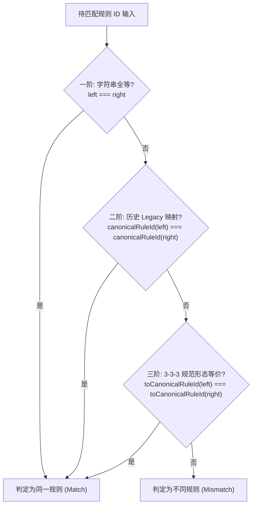

# rule-catalog-governance — 全仓单源规则目录与元数据一致性治理

本技能规范了工作区 410 条静态分析与审查规则的单源聚合机制（Single Source of Truth, SSOT）、标准 3-3-3 命名拓扑公理、权威 104 项三字母映射词典、三阶双轨别名等价网络、底层完备诊断与表现层语义去重双层解耦公理、跨项目规则族命名空间边界、三大项目规范注册流程、规则防虚构门禁（`RCFG-RULE-DRIFT`）以及客观度量求真数学公理。

---

## 一、 适用场景与触发条件

在以下任一开发或治理场景中，必须激活本技能：
1. **新增、修改或弃用静态分析/审查规则**（涉及 `auto-refactor`、`workspace-timing` 或 `WebGames`）；
2. **在 Git 提交说明（Commit Message）中引用规则 ID**；
3. **维护度量评估系统与评分算法**（CAI 自研率、质量置信度区间估算）；
4. **执行全仓单源规则目录同步更新与校验**（`scripts/common/generate-rule-catalog.js`）；
5. **排查 `RCFG-RULE-DRIFT`（规则未登记或虚构代号）门禁阻断**。

---

## 二、 全仓单源规则目录架构 (`rule-catalog.json`)

工作区维护全局唯一的规则真源注册表，任何规则必须在注册表中登记后方可在代码、配置、分析报告或提交说明中生效：
- **SSOT 文件路径**：`scripts/common/rule-catalog.json`
- **生成与聚合脚本**：`scripts/common/generate-rule-catalog.js`
- **纳管规模与形态**：跨三大项目聚合 410 条活跃规则，结构元数据定义如下：
  ```json
  {
    "schema": "workspace-rule-catalog/v1",
    "generatedAt": "2026-10-09T12:55:00.000Z",
    "totalRules": 410,
    "counts": {
      "autoRefactor": 325,
      "workspaceTiming": 49,
      "webGames": 56,
      "globalTooling": 7
    },
    "rules": [
      {
        "id": "ARCH-FAC-001",
        "title": "门面模块必须满足实质承载与不可变性预算",
        "category": "architecture",
        "severity": "error",
        "analyzer": "architecture",
        "family": "ARCH",
        "dimension": "topological_coupling"
      }
    ]
  }
  ```

### 规则分布矩阵 (410 条活跃规则)：
1. **`autoRefactor` (325 条)**：涵盖 30 个内置分析器（architecture, data-architecture, test-modernity, dependency-layout, naming, gate-architecture 等）与四层金字塔体系；
2. **`workspaceTiming` (49 条)**：涵盖 VS Code 扩展审查体系的 L0~L5 六层刚性防线（编译、存储崩溃安全、聚合守恒、i18n、性能与 UI 对比度）及进阶门禁与测试预算规则；
3. **`webGames` (56 条)**：涵盖 Godot 游戏工程的文档治理（`DOC-`、`LINK-`）、高性能脚本契约（`ADV-`）与配置架构审查规则；
4. **`globalTooling` (7 条)**：涵盖提交规范与禁词风格拦截（`CMG-STY-001`~`006`）及四大受控项目归属声明守卫（`CMG-PRJ-001`）。

---

## 三、 标准 3-3-3 命名拓扑公理与 104 项权威词典

工作区所有通用规则统一遵循「标准 3-3-3 命名拓扑公理」，杜绝随意的命名缩写与序号断层：

### 1. 标准 3-3-3 结构定义
规则 ID 严格由三段大写字母与数字组成，格式为：
$$\text{Family (3 字母)} - \text{Topic (3 字母)} - \text{Sequence (3 位数字)}$$

```text
  ARCH   -   FAC   -   001
   │          │         └── Sequence: 3 位递增数字 (001~999)
   │          └──────────── Topic: 权威 3 字母领域主题
   └─────────────────────── Family: 3 字母规则家族 (少数脚本族为 2 字母，如 SH, PS, UI)
```

- **Family（规则家族）**：对应核心分析器或业务治理域（如 `ARCH` 架构、`PRF` 性能、`SIM` 简化、`SEC` 安全、`NAM` 命名）；
- **Topic（领域主题）**：严格限制为标准 3 字母大写缩写（如 `FAC` 门面、`MEM` 内存、`TOK` 凭证、`ARG` 参数）；
- **Sequence（递增序号）**：3 位定长数字，原则上自 `001` 起始单调递增（`001`, `002`, `003`, ...）。

### 2. 104 项权威三字母映射词典 (`CANONICAL_3LETTER_GLOSSARY`)
为终结历史命名中 4+ 字母主题（如 `DISP`, `ALLOC`, `BUDGET`）与 3 字母标准形的混乱漂移，工作区在 `auto-refactor/src/core/rules/topic-catalog.ts` 中确立了权威单源的 104 项三字母映射词典：
- **规范收录 104 个标准主题映射**：涵盖 `ALIAS` $\rightarrow$ `ALS`、`ALLOC` $\rightarrow$ `ALC`、`ARGS` $\rightarrow$ `ARG`、`BUDGET` $\rightarrow$ `BDG`、`GUARD` $\rightarrow$ `GRD`、`PERF` $\rightarrow$ `PRF`、`SECRET` $\rightarrow$ `TOK`、`YIELD` $\rightarrow$ `YLD` 等；
- **单向规范收敛**：通过 `normalizeTopicCode(topic)` 与 `toCanonicalRuleId(ruleId)`，将任何输入主题自动归一化为唯一的权威 3 字母缩写；
- **拓扑校验器守门**：`isCanonical3LetterForm(id)` 持续监控规则形态，拦截不符合 `^[A-Z]{2,3}-[A-Z]{3}-\d{3}$` 拓扑规范的新增规则。

### 3. 5 项历史 Sequence 序列异常刚性锁定 (`HISTORICAL_SEQUENCE_ANOMALIES`)
全仓除以下 5 条具有历史双生背景的规则允许自 `002` 起始外，所有其他家族主题严格从 `001` 连续递增，严禁随意出现序号空洞：
1. `ARCH-DEC-002`：与跨领域符号解耦规则双生配对（AST 解析器解耦 vs 符号解耦）；
2. `ARCH-DSP-002`：与历史 4 字母前序规则配对（分发器透传 vs 分发器复杂度）；
3. `GOV-RTC-002`：基线路径重命名追踪规则，与引擎级单调棘轮门禁配对；
4. `NAM-JRG-002`：历史黑话标记规则（变量黑话已合并至 `HYG-STB-002`）；
5. `SIM-FLAT-002`：深度控制流扁平化阈值规则，与卫语句提前返回规则 `SIM-GUARD-001` 双生配对。

---

## 四、 三阶双轨别名等价网络与平滑演进

为确保规则库向 3-3-3 拓扑平滑演进的同时，100% 兼容历史冻结基线（Frozen Baselines）、行内抑制指令（Suppression Directives）与外部消费者配置，工作区在 `auto-refactor/src/core/rules/aliases.ts` 中构建了「三阶双轨别名等价网络」：



### 1. 三阶等价解析原理 (`areAliasForms`)
- **一阶：精确字符串全等**：`left === right`，处理标准 ID 的快速直接命中；
- **二阶：历史 Legacy 映射**：`canonicalRuleId(id)` 基于 `LEGACY_RULE_ALIASES` 解析 15 条旧版 kebab-case 规则名：
  ```typescript
  // 历史别名映射示范 (LEGACY_RULE_ALIASES)
  'high-complexity': 'CPX-CYC-001',
  'large-file': 'BIG-SIZE-001',
  'loop-transient-allocation': 'PRF-TRAN-001',
  'secret-detected': 'SEC-TOK-001',
  'clean-layer-violation': 'ARCH-CLN-001'
  ```
- **三阶：3-3-3 规范形态等价**：`toCanonicalRuleId(id)` 结合 `CANONICAL_3LETTER_GLOSSARY`，使 4+ 字母历史形与 3 字母规范形自动等价互认：
  ```typescript
  // 规范主题归一化等价示范:
  toCanonicalRuleId('ARCH-DISP-001') === 'ARCH-DSP-001';
  areAliasForms('ARCH-DISP-001', 'ARCH-DSP-001'); // true
  ```

### 2. 双轨平滑演进与历史基线冻结保障
- **零破坏性演进**：当规则名称升级时，开发者无需修改历史基线文件（如 `baseline-self-audit.json`）中的既有条目，亦无需批量重构存量代码中的 `// auto-refactor:disable-next-line` 抑制注释；
- **配置双向透明**：外部配置无论使用旧别名还是新规范 ID，均能在运行时无缝生效；
- **演进退休窗口**：旧别名仅在跨 Major 版本时视弃用生命周期统一评估退役，彻底消除孤儿基线行与无效抑制隐患。

---

## 五、 底层完备诊断与表现层语义去重双层解耦公理

针对代码分析中「质量度量需要完整证据」与「人类审查容易认知过载」的根本矛盾，工作区确立了「底层完备发射与表现层语义聚合」双层解耦公理：

### 1. 扫描底座 100% 完备无损发射 (Stage 0~3)
- **零私自吞吐铁律**：分析器扫描引擎在遍历 AST、控制流与符号图时，必须对所有触碰的违规点保持 100% 完备发射；
- **度量证据链完整性**：十维质量模型、CAI 自研率、熵密分析与长期演化账本（`.refactor-trajectory/`）依赖每一个细粒度 Finding 计算倒数饱和曲线与贝叶斯后验。**严禁在扫描底座阶段私自过滤、合并或丢弃 Issue**，否则将导致质量模型证据链断裂、评分失真。

### 2. 表现层并查集语义聚合 (`semantic-correlation.ts`)
- **并查集聚类算法**：在呈现给开发者或 IDE 诊断卡片（`PraxisDiagnosticCard`）阶段，表现层适配器统一使用并查集（Disjoint Set / Union-Find）在文件路径与物理行号相同的交汇点上，对 11 组重叠规则族（`SEMANTIC_OVERLAP_GROUPS`）执行聚类；
- **主卡片民主选举机制 (`electPrimaryCard`)**：
  依据严重级别权重从聚类中选举唯一主卡片：
  $$\text{Severity Weight: } \text{block (4)} > \text{warn (3)} > \text{info (2)} > \text{pass (1)}$$
  若权重相同，保持原始发射顺序稳定性。
- **次级关联聚合 (`correlatedRules`)**：
  将聚类中的次级规则 ID 聚合至主卡片的 `correlatedRules` 数组中，并填充 `correlationCount`：
  ```typescript
  // 表现层合并结果示例
  {
    ruleId: "SIM-FLAT-002",           // 主卡片 (较高严重级别)
    severity: "warn",
    file: "src/engine/runner.ts",
    line: 42,
    correlatedRules: ["CPX-NEST-001"], // 次级规则收拢入关联列表
    correlationCount: 1
  }
  ```
- **治理收益**：既彻底消除了开发者在同一行代码上被 3~4 个同质化卡片刷屏的认知疲劳（Cognitive Fatigue），又保留了完整的关联规则排查线索，兼顾了底层求真与高层易读。

---

## 六、 跨项目规则族前缀命名空间规范

为避免全仓 410 条规则在跨项目静态分析、预提交门禁（Gate 7）或 CI 流程中发生命名空间踩踏与误杀，工作区严格划分四大项目域的规则族前缀边界：

| 项目领域 (`Project`) | 规则规模 | 权威合法规则族前缀 / 命名空间 | 治理范围与职责边界 |
| :--- | :--- | :--- | :--- |
| **`auto-refactor`** | 325 条 | 30 个分析器内置家族：`ARCH`, `BIG`, `CMP`, `CMT`, `CONST`, `CPX`, `DAT`, `DEP`, `DOC`, `ERR`, `GATE`, `GDM`, `GOM`, `GOV`, `HYG`, `NAM`, `NUM`, `PRF`, `PROD`, `PS`, `PYM`, `RSM`, `SEC`, `SH`, `SIM`, `STDLIB`, `TSM`, `TST`, `UI`, `VSC` 及 15 条 Legacy 别名 | 通用多语言代码重构、AST 语法树、Rust 双轨算子、复杂度与架构质量模型 |
| **`workspace-timing`** | 49 条 | L0~L5 六层审查体系：`L0-`, `L1-`, `L2-`, `L3-`, `L4-`, `L5-`；扩展专属族：`ARF-`, `DOC-`, `HC-`, `LAY-`, `RCFG-`, `RES-`, `SCR-`, `TB-` | VS Code 扩展生命周期、分层存储安全、i18n 对齐、时间守恒与状态栏治理 |
| **`WebGames`** | 56 条 | Godot 专属契约：`ADV-`（高性能脚本与引擎约束）、`DOC-`、`LINK-`（文档与跨卷链接）、`PRF-`、`RES-`、`UUID-`、`SIM-` | Godot 4 游戏逻辑、节点树信号契约、文档双语归档与配置单源治理 |
| **`global-tooling`** | 7 条 | 通用门禁族：`CMG-`（提交说明规范 `CMG-STY-001`~`006`, `CMG-PRJ-001`）、`GATE-`（平台脚本与 AST 隔离守卫） | 跨平台工作区门禁、提交说明防虚构、沙箱隔离与环境一致性 |

### 跨项目防误杀与隔离铁律：
1. **命名空间互斥隔离**：各项目的规则校验脚本与门禁工具在执行规则一致性检查时，必须依据规则 ID 前缀精准分流至所属工程域，严禁跨项目判定规则漂移；
2. **全局白名单穿透**：工作区级校验工具（如 `validate-commit-msg-rules.js`）必须依赖单源规则真源 `rule-catalog.json` 进行全集校验，保证任一合法子项目的已登记规则均可被正确识别。

---

## 七、 三项目规则纳管与规范注册 SOP

向工作区新增或调整规则时，必须依项目标准流程落户，严禁未注册先引用：

### 1. `auto-refactor` 规则注册工作流 (325 规则体系)
- **规则定义声明**：在 `auto-refactor/src/core/rules/entries/` 对应家族文件中创建规则对象（继承 `RuleDefinition`），填写真实 `id`、`title`、`severity`、`analyzer` 与 `dimension`；
- **分值权重绑定**：在 `auto-refactor/src/core/scoring/dimensionRuleTable.ts` 中分配对应的扣分权重，严格遵守单规则跨维度扣分约束 `MAX_AXES_PER_FINDING <= 4`；
- **自测套件闭环**：在 `auto-refactor/tests/rules/` 编写专属单元测试，并在 `scripts/test-parallel.js` 中注册验证脚本，确保无孤儿测试用例；
- **原生 Rust 内核等价同步**：若规则涉及原生算子分析，必须确保 Rust 内核与 TS shim 达到 100% 字节等价性。

### 2. `workspace-timing` 审查规则注册工作流 (49 规则体系)
- **单源配置文件**：在 `workspace-timing/scripts/config/review-rules.json` 中统一登记；
- **规则层级代号**：使用严格的 `L0~L5` 六层体系前缀（如 `L0-COMPILE`、`L1-STORAGE-CRASH`、`L2-TIMING-CONSERVATION`、`L3-I18N-COVERAGE`），并附带对应触发审查命令与阻断级别。

### 3. `WebGames` 文档与代码规范注册工作流 (56 规则体系)
- **配置与门禁脚本**：在 `WebGames/scripts/config/docs_governance_rules.json` 或 `WebGames/scripts/py/audit_docs.py` 中登记规则元数据；
- **前缀体系**：对齐文档治理规范（`DOC-`、`LINK-`）与引擎高性能契约（`ADV-`）。

### 4. 全仓同步触发与自动化核查
在任何子项目中新增或修改规则后，必须运行：
```powershell
node scripts/common/generate-rule-catalog.js
```
确保全仓 SSOT 目录 `scripts/common/rule-catalog.json` 自动完成增量聚合与计数同步。若规则数发生漂移，门禁将即时拒绝提交。

---

## 八、 提交说明规则反虚构门禁 (`RCFG-RULE-DRIFT`)

为根除大语言模型虚构规则 ID（Hallucination）或使用已废弃代号，`commit-msg-gate` 深度集成了 `scripts/common/validate-commit-msg-rules.js`：

1. **自动正则捕获**：
   从提交信息正文中精确捕获所有符合工作区规则命名特征的词条：
   - 家族型规则：`[A-Z]{2,4}-[A-Z0-9]+-[0-9]{3}`（如 `ARCH-FAC-001`、`GATE-AST-001`、`TST-TAU-001`）
   - 层级型规则：`L[0-5]-[A-Z0-9\-]+`（如 `L0-COMPILE`、`L1-STORAGE-CRASH`、`L3-I18N-COVERAGE`）
   - 元治理规则：`RCFG-[A-Z\-]+`（如 `RCFG-RULE-DRIFT`）
2. **客观协议白名单过滤**：
   自动豁免标准网络与编码常量，如 `UTF-8`、`SHA-256`、`RFC-7231`、`HTTP-2`、`IEEE-754` 等；
3. **一票否决阻断**：
   捕获的规则词条若在 `rule-catalog.json` 中查无记录，门禁立即打印 `❌ [REJECT] RCFG-RULE-DRIFT` 并阻断提交，要求开发者修正为真实已登记 ID 或在真源中完成注册。

---

## 九、 指标度量求真与严谨数学公理

在开发度量评估、打分系统或算法统计时，必须贯彻客观科学公理：

### 1. 客观统计零注水原则
- 所有代码质量度量、自研率（CAI）与符号分析必须从 0 纯客观统计；
- **严禁手段**：严禁在算法中注入虚假基数、倍数放大、保底常数伪造或主观人工加分；
- **真实符号追踪**：外部依赖与自研符号统计必须基于 AST 真实符号索引（`symbolIndex`）进行端到端精确调用图追踪。

### 2. 主流统计学 Jeffreys Beta 后验模型
度量系统的置信度与区间估计严禁主观写死常数误差（如 $\pm 5\%$），必须采用主流经典统计学模型：
- **无信息先验**：采用 Jeffreys 先验 $\text{Beta}(0.5, 0.5)$；
- **共轭后验更新**：在观察到 $s$ 次成功、$f$ 次失败（总样本 $n = s + f$）后，后验分布为 $\text{Beta}(s + 0.5, f + 0.5)$；
- **均值与方差**：
  $$\mu = \frac{s + 0.5}{n + 1}, \quad \sigma^2 = \frac{(s + 0.5)(f + 0.5)}{(n + 1)^2 (n + 2)}$$
- 通过经典二项分布共轭贝叶斯模型输出置信区间，确保度量结果客观可复现。

### 3. 全工作区零高危技术债务刚性防线
全工作区 High/Critical 技术债务历史性归零（0 项）。规则元数据维护、新规则入库与规则校验严禁引入任何技术债务反弹（一票否决），始终保持 0 项刚性基线。

---

## 十、 常用命令与校验工具

在执行规则变更或本地门禁验证时，使用以下命令：

```powershell
# 1. 重新扫描三大项目并全量生成单源规则目录 (SSOT)
node scripts/common/generate-rule-catalog.js

# 2. 本地验证提交说明中的规则 ID 是否真实存在
node scripts/common/validate-commit-msg-rules.js <path-to-commit-msg-file>

# 3. 运行 pre-commit 门禁中的规则一致性校验 (Gate 7)
pwsh -File scripts/ps1/pre-commit-gate.ps1

# 4. 执行全工作区快速审查中枢核验
pwsh -File scripts/ps1/audit-all.ps1 -Fast
```
