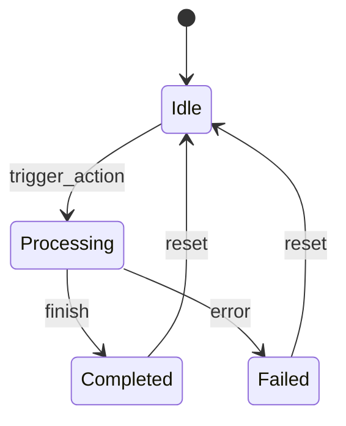

# 阶段 2：业务逻辑实现与状态机流转规范

> 档号: KALAR-DEV-ARCH-002  
> 阶段: 阶段 2（业务逻辑实现与状态机流转）  
> 状态: 方案编写中 / 待评审  

---

## 一、 领域求解器设计

业务逻辑纯逻辑无头实现，严禁依赖 Node 树或 UI 渲染节点：

```gdscript
class_name DomainSolver
extends RefCounted

func calculate_next_state(current_state: Dictionary, action: Dictionary) -> Dictionary:
  # 纯函数计算，无副作用
  var next_state := current_state.duplicate(true)
  # ... 计算状态迁移
  return next_state
```

---

## 二、 状态机转换图谱


