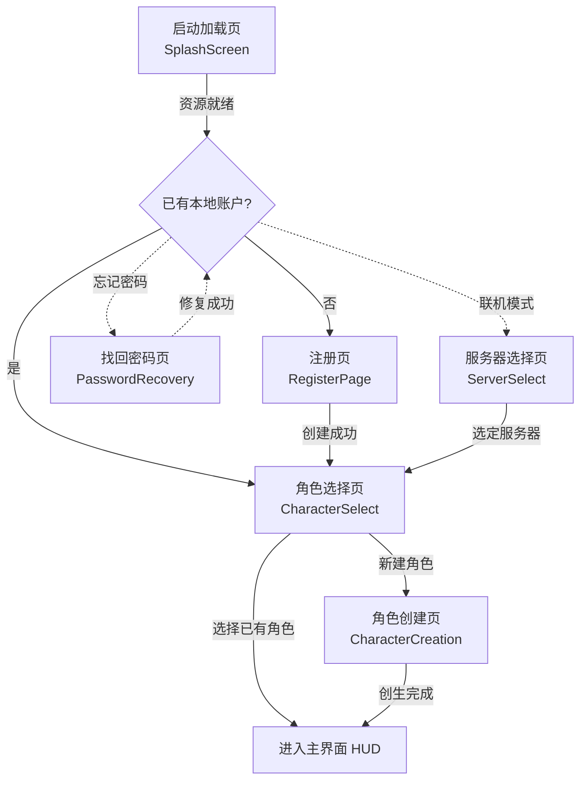
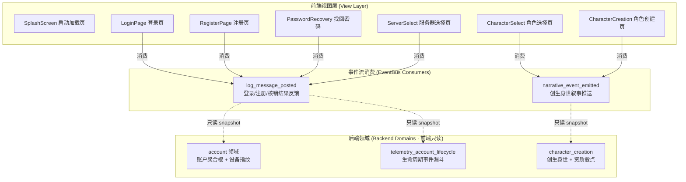
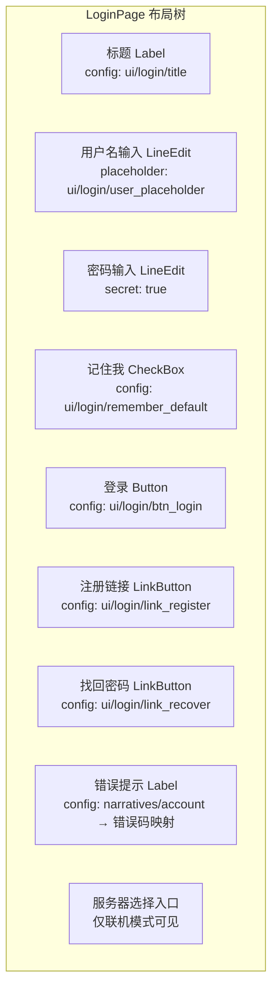
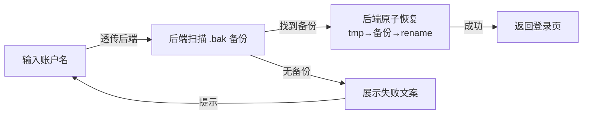
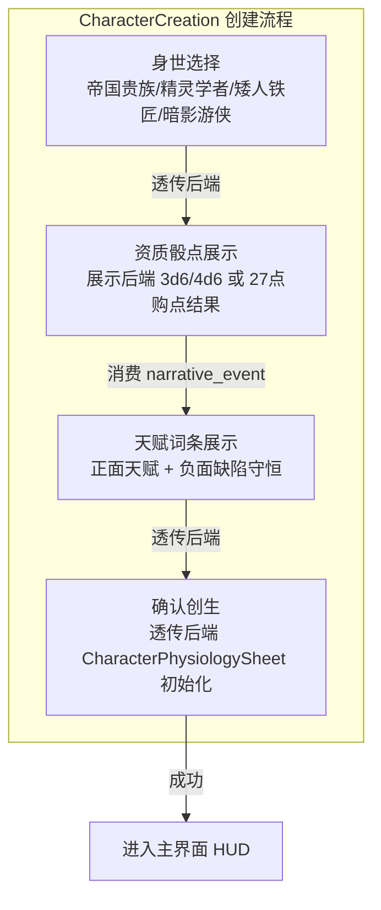

# 前端架构需求表1（第一卷：账号与入口系统）

> \[!NOTE]
> **【全局架构声明】**：本篇及全套前端技术文档中所提及的所有具体界面文案、按钮标签、配色令牌与演示数据，**均属基础演示示例（Illustrative Examples Only），绝非底层硬编码或静态写死结构**。前端表现层仅定义**事件流消费契约、视图-事件映射表、Theme 令牌层与组件可复用基座**，全部用户可见文案由 `config/frontend/ui.json` 与 `config/narratives/account.json` 驱动。

***

## 一、 系统架构总览与视图模型划分 (Frontend Domain Overview)

### 1.1 架构设计理念：账号入口表现宿主 (Account Entry Presentation Host)

本前端系统以**1.0 文字版单机离线账户**为运行底座，前端视图只消费 `EventBus` 的 `log_message_posted` 与 `narrative_event_emitted` 信号，以及 `GameConfig` 的只读配置查询，不持有任何账户鉴权或存档落盘逻辑（全部由后端第十四卷 account 与第四十二卷 telemetry\_account\_lifecycle 领域负责）。

* **表现层绝对解耦**：前端只负责「输入采集 → 透传后端 → 渲染反馈结果」，不做任何密码校验、设备指纹生成或存档写入；

* **单机零延迟秒进**：本地离线账户登录为同步快照读取，无网络等待；联机模式预留异步等待态；

* **配置驱动文案**：全部按钮标签、占位提示、错误文案来自 `config/frontend/ui.json`，错误码到文案的映射来自 `config/narratives/account.json`。

### 1.2 入口流程状态视图 (Entry Flow State Views)



### 1.3 核心子视图与事件映射 (View-Event Mapping)



***

## 二、 启动加载页 (Splash Screen)

### 2.1 视图职责与布局

启动加载页是客户端冷启动后的第一个视图，负责资源预加载进度展示与后端母机就绪握手。

| 区域      | 节点类型        | 内容来源                                         | 说明            |
| :------ | :---------- | :------------------------------------------- | :------------ |
| 引擎 Logo | TextureRect | `res://icon.svg`                             | 引擎标识居中展示      |
| 加载进度条   | ProgressBar | 代码驱动 `0~100%`                                | 资源预加载进度       |
| 加载状态文案  | Label       | `config/frontend/ui.json` → `splash/status`  | 如「正在校验确定性母机…」 |
| 版本号     | Label       | `config/frontend/ui.json` → `splash/version` | 引擎版本标识        |

### 2.2 加载阶段事件消费契约

```gdscript
## 启动加载页只监听日志事件，不发起任何后端调用
## 后端母机就绪后由 main scene 自动切换到登录页
func _ready() -> void:
    EventBus.get_instance().log_message_posted.connect(_on_log_message)
    # 进度条由本地资源加载驱动，非后端事件

func _on_log_message(level: String, message: String) -> void:
    status_label.text = message  # 展示后端就绪日志
```

***

## 三、 登录页 (Login Page)

### 3.1 视图职责与布局

登录页负责本地离线账户的凭据输入与秒级秒进。单机模式下登录为本地快照同步读取，联机模式预留异步等待。



### 3.2 输入采集与后端透传契约

前端只采集输入、透传后端、渲染结果，**不做任何密码校验或设备指纹生成**：

```typescript
// 前端登录请求 DTO（透传后端 account 领域，前端不做校验）
interface LoginRequestDTO {
  username: string;        // 用户输入原样透传
  password: string;        // 密码原样透传，前端不明文存储
  rememberMe: boolean;     // 记住我偏好（写入本地 settings）
  deviceId?: string;       // 联机模式由后端注入设备指纹，前端不生成
}

// 后端返回的登录结果（前端只渲染，不判定）
interface LoginResultDTO {
  success: boolean;
  errorCode?: string;      // 错误码 → narratives/account.json 查文案
  accountSnapshot?: {      // 只读快照，前端展示用
    accountId: string;
    displayName: string;
    characterSlots: CharacterSlotSummary[];
  };
}
```

### 3.3 错误码到文案映射

前端不硬编码任何错误文案，全部由 `config/narratives/account.json` 的 `login_errors` 节驱动：

| 错误码               | 配置路径                                                | 兜底默认文案           |
| :---------------- | :-------------------------------------------------- | :--------------- |
| `AUTH_FAILED`     | `narratives.account → login_errors/AUTH_FAILED`     | 「账户或密码不正确」       |
| `ACCOUNT_LOCKED`  | `narratives.account → login_errors/ACCOUNT_LOCKED`  | 「账户已被锁定，请联系管理员」  |
| `DEVICE_MISMATCH` | `narratives.account → login_errors/DEVICE_MISMATCH` | 「设备指纹不匹配，疑似异地登录」 |
| `RATE_LIMITED`    | `narratives.account → login_errors/RATE_LIMITED`    | 「登录尝试过于频繁，请稍后再试」 |

```gdscript
## 错误码 → 文案：从 narratives/account.json 查表，未命中回退默认值
func _render_login_error(error_code: String) -> void:
    error_label.text = GameConfig.get_string(
        "narratives.account", "login_errors/" + error_code,
        "登录失败，请重试"  # 兜底默认值
    )
```

***

## 四、 注册页 (Register Page)

### 4.1 视图职责与布局

注册页负责新账户创建。单机模式下一账户多角色冒险插槽；联机模式预留服务器侧唯一性校验。

| 区域   | 节点类型         | 内容来源                              | 说明              |
| :--- | :----------- | :-------------------------------- | :-------------- |
| 标题   | Label        | `ui/register/title`               | 「创建新账户」         |
| 用户名  | LineEdit     | `ui/register/user_placeholder`    | 输入透传后端          |
| 密码   | LineEdit     | `ui/register/pass_placeholder`    | `secret: true`  |
| 确认密码 | LineEdit     | `ui/register/confirm_placeholder` | 前端只做「两次一致」本地校验  |
| 模式选择 | OptionButton | `ui/register/modes`               | 标准模式 / 死斗硬核槽位   |
| 用户协议 | CheckBox     | `ui/register/agreement_text`      | 勾选后启用注册按钮       |
| 注册按钮 | Button       | `ui/register/btn_submit`          | 透传后端 account 领域 |
| 返回登录 | LinkButton   | `ui/register/back_to_login`       | 返回登录页           |

### 4.2 前端本地校验与后端透传边界

前端只做**不涉及业务逻辑的纯 UI 层校验**（两次密码一致、协议已勾选、非空），其余全部透传后端：

```gdscript
## 前端本地校验：只查 UI 层一致性，不查账户唯一性/密码强度规则
func _can_submit() -> bool:
    var user := username_edit.text.strip_edges()
    var pass := password_edit.text
    var confirm := confirm_edit.text
    var agreed := agreement_check.button_pressed
    # 纯 UI 校验：非空 + 两次一致 + 协议勾选
    return not user.is_empty() and not pass.is_empty() and pass == confirm and agreed
    # 账户唯一性、密码强度规则全部由后端 account 领域判定，前端透传结果
```

***

## 五、 找回密码与存档修复 (Password Recovery)

### 5.1 视图职责

单机模式下「找回密码」本质为**本地存档修复流程**：通过存档备份 `.bak` 文件的自愈机制恢复访问权限。前端只展示修复进度与结果，不执行任何文件操作（由后端 `persistence_protocol` 领域负责）。

### 5.2 修复流程视图



***

## 六、 服务器选择页 (Server Select)

### 6.1 视图职责

服务器选择页仅在**联机模式**下可见。单机模式下此页跳过，直接进入角色选择。前端只展示后端下发的服务器列表快照，不做任何网络探测或延迟测量（由后端 `telemetry_account_lifecycle` 领域负责）。

### 6.2 服务器列表只读渲染

```typescript
// 前端只渲染后端下发的只读快照，不做网络探测
interface ServerEntryDTO {
  serverId: string;
  serverName: string;
  status: 'online' | 'maintenance' | 'full';
  population: number;       // 后端统计的在线人数
  recommended?: boolean;    // 后端标记推荐服
}
```

***

## 七、 角色选择与创建页 (Character Select & Creation)

### 7.1 角色选择页

角色选择页展示当前账户下的多角色冒险插槽快照。前端只渲染后端 `account` 领域返回的 `characterSlots` 只读快照，不查询角色详细状态。

| 区域   | 节点类型      | 内容来源                            | 说明                    |
| :--- | :-------- | :------------------------------ | :-------------------- |
| 槽位列表 | ItemList  | `account.characterSlots[]` 只读快照 | 每槽显示封面元数据             |
| 封面信息 | Label × N | 快照字段                            | 职业位格 / 表象年龄 / 所处大陆与城镇 |
| 进入按钮 | Button    | `ui/charselect/btn_enter`       | 选中槽位后进入主界面            |
| 新建按钮 | Button    | `ui/charselect/btn_create`      | 跳转角色创建页               |
| 删除按钮 | Button    | `ui/charselect/btn_delete`      | 透传后端，前端做二次确认弹窗        |

### 7.2 角色创建页

角色创建页消费后端 `character_creation` 领域的创生身世叙事事件流。前端只展示骰点结果与身世叙事，**不做任何资质分配或骰点逻辑**（全部由后端第十五卷 character\_creation 领域负责）。



### 7.3 创生叙事事件消费契约

```gdscript
## 角色创建页消费创生叙事事件，只渲染不判定
func _ready() -> void:
    EventBus.get_instance().narrative_event_emitted.connect(_on_narrative)

func _on_narrative_event(packet: Dictionary) -> void:
    var cat = packet.get("category", "")
    var txt = packet.get("text", "")
    # 创生身世叙事推流 → 富文本渲染
    if cat == EventBus.get_category_name("info"):
        origin_log.append_text("[color=#38bdf8]" + txt + "[/color]\n")
```

***

## 八、 Theme 令牌与配色规范 (Theme Tokens)

账号入口系统的全部配色由 Theme 令牌层统一管理，与 `event_categories.json` 对齐：

| UI 元素 | 配色来源                                 | 令牌          | 兜底默认值                        |
| :---- | :----------------------------------- | :---------- | :--------------------------- |
| 页面背景  | Theme                                | `--bg`      | `Color(0.06, 0.08, 0.12, 1)` |
| 主标题文字 | Theme                                | `--title`   | `Color(0.38, 0.75, 0.98, 1)` |
| 普通正文  | Theme                                | `--text`    | `Color(0.88, 0.91, 0.95, 1)` |
| 错误提示  | Theme                                | `--danger`  | `Color(0.97, 0.53, 0.53, 1)` |
| 成功提示  | Theme                                | `--success` | `Color(0.20, 0.83, 0.60, 1)` |
| 系统事件  | `event_categories.json` → `system`   | `#38bdf8`   | —                            |
| 默认事件  | `event_categories.json` → `_default` | `#94a3b8`   | —                            |

***

## 九、 验收矩阵 (DoD Matrix)

| 验收项     | 验收标准                                       | 验证方式                                               |
| :------ | :----------------------------------------- | :------------------------------------------------- |
| 启动→登录可达 | 冷启动后自动到达登录页，无崩溃                            | `godot` 启动观察                                       |
| 登录秒进    | 单机模式登录延迟 < 100ms                           | 计时断言                                               |
| 文案零硬编码  | 所有按钮/占位/错误文案均来自配置表                         | `rg "登录" frontend/` 仅命中配置读取                        |
| 错误码映射   | 4 种错误码均有配置文案，兜底默认值生效                       | 删配置表键值后验证兜底                                        |
| 配色配置驱动  | 删除 `event_categories.json` 某分类后回退默认色       | 配置表删键后验证                                           |
| 零逻辑纪律   | 前端代码无 `Solver`/`FSM`/`DeterministicRNG` 调用 | `rg "Solver\|FSM\|DeterministicRNG" frontend/` 无命中 |
| 视图可切换   | 登录↔注册↔找回密码↔角色选择 均可导航                       | 手动走查                                               |

