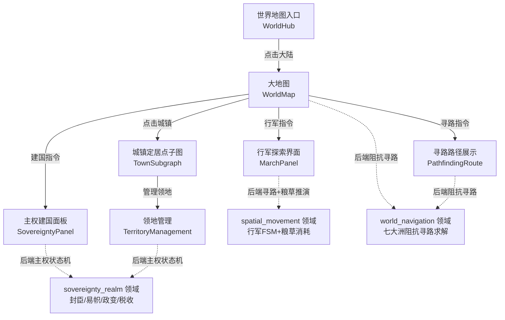
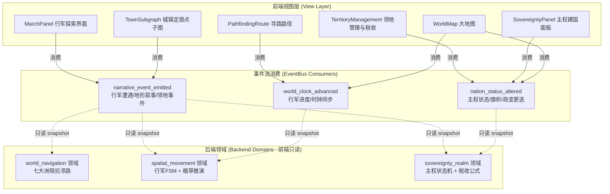
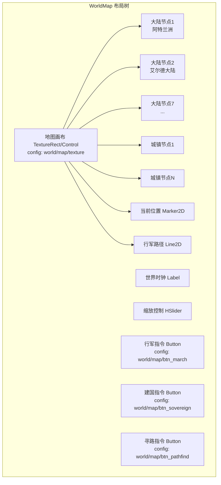
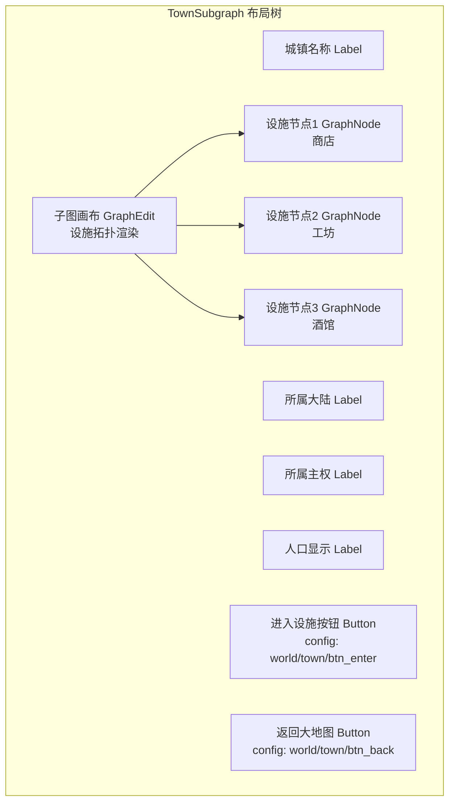
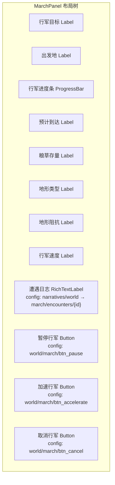
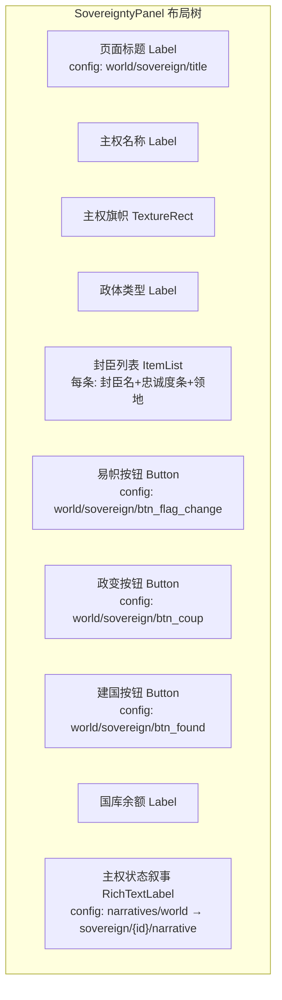
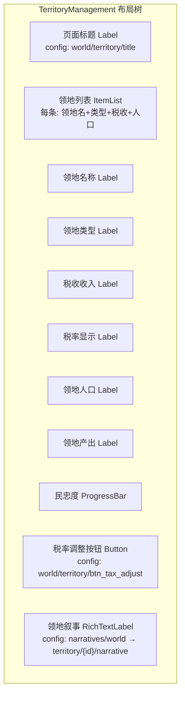
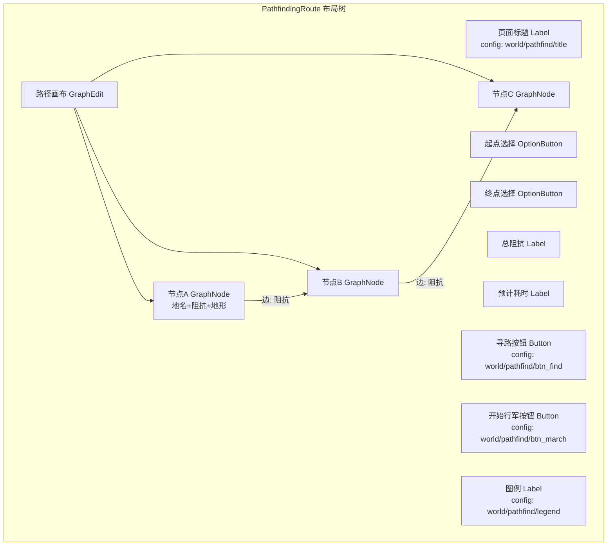

# 前端架构需求表10（第十卷：世界与地图系统）

> \[!NOTE]
> **【全局架构声明】**：本篇及全套前端技术文档中所提及的所有具体界面文案、按钮标签、配色令牌与演示数据，**均属基础演示示例（Illustrative Examples Only），绝非底层硬编码或静态写死结构**。前端表现层仅定义**事件流消费契约、视图-事件映射表、Theme 令牌层与组件可复用基座**，全部用户可见文案由 `config/frontend/ui.json` 与 `config/narratives/world.json` 驱动。

***

## 一、 系统架构总览与视图模型划分 (Frontend Domain Overview)

### 1.1 架构设计理念：世界地图表现宿主 (World Map Presentation Host)

本前端系统以**七大洲阻抗寻路与主权建国可视化**为运行底座，前端视图只消费 `EventBus` 的 `world_clock_advanced`、`nation_status_altered` 与 `narrative_event_emitted` 三个信号，以及 `GameConfig` 的只读配置查询，不持有任何寻路求解器、地形阻抗计算、主权状态机或税收公式（全部由后端 `world_navigation`、`spatial_movement`、`sovereignty_realm` 领域负责）。

* **表现层绝对解耦**：前端只负责「输入采集 → 透传后端 → 渲染反馈结果」，不做任何阻抗寻路计算、行军粮草消耗推演或主权政变更迭逻辑；
* **三信号消费**：`world_clock_advanced` 驱动行军进度与时钟同步；`nation_status_altered` 驱动主权状态与旗帜更新；`narrative_event_emitted` 驱动行军遭遇与领地叙事推送；
* **配置驱动文案**：全部大陆名称、地形名称、城镇名、主权职位名称来自 `config/frontend/ui.json`，行军叙事与建国描述来自 `config/narratives/world.json`。

### 1.2 世界地图流程状态视图 (World Map Flow State Views)



### 1.3 核心子视图与事件映射 (View-Event Mapping)



***

## 二、 大地图界面 (World Map)

### 2.1 视图职责与布局

大地图界面展示卡拉尔世界七大洲的拓扑结构与当前角色位置。前端只渲染后端 `world_navigation` 领域下发的地图快照与角色坐标，**不做任何阻抗寻路计算、地形分析或路径规划**（全部由后端领域负责）。

| 区域       | 节点类型           | 内容来源                                          | 说明                       |
| :------- | :------------- | :-------------------------------------------- | :----------------------- |
| 地图画布     | TextureRect/Control | `config/frontend/ui.json` → `world/map/texture` | 七大洲地形图底图           |
| 大陆节点     | TextureRect ×7 | 快照字段 `continents[]`                          | 七大洲节点标记                 |
| 城镇节点     | TextureRect ×N | 快照字段 `towns[]`                               | 城镇定居点标记                 |
| 当前位置     | Marker2D       | 快照字段 `current_position`                     | 角色当前位置图标                |
| 行军路径线   | Line2D         | 快照字段 `active_path[]`                        | 当前行军路线渲染                |
| 大陆名称     | Label          | `config/frontend/ui.json` → `world/continents/{id}` | 大陆名称标签               |
| 世界时钟     | Label          | 快照字段 `world_clock`                           | 当前世界时钟时刻                |
| 缩放控制     | HSlider         | 代码驱动 `0.5x~3.0x`                              | 地图缩放                     |
| 行军指令按钮 | Button         | `config/frontend/ui.json` → `world/map/btn_march` | 进入行军探索界面             |
| 建国指令按钮 | Button         | `config/frontend/ui.json` → `world/map/btn_sovereign` | 进入主权建国面板             |
| 寻路指令按钮 | Button         | `config/frontend/ui.json` → `world/map/btn_pathfind` | 进入寻路路径展示             |

### 2.2 布局树



### 2.3 输入采集与后端透传契约

```typescript
// 前端地图操作请求 DTO（透传后端 world_navigation 领域，前端不做寻路计算）
interface WorldMapRequestDTO {
  characterId: string;
  targetContinentId?: string;   // 选中的大陆 ID
  targetTownId?: string;         // 选中的城镇 ID
}

// 后端返回的地图快照（前端只渲染，不判定）
interface WorldMapSnapshotDTO {
  continents: ContinentDTO[];     // 七大洲节点
  towns: TownNodeDTO[];            // 城镇定居点节点
  currentPosition: { continentId: string; townId?: string; x: number; y: number };
  activePath?: PathSegmentDTO[];   // 当前行军路线（后端计算的阻抗寻路结果）
  worldClock: number;              // 当前世界时钟时刻
}

interface ContinentDTO {
  continentId: string;
  continentName: string;           // 大陆名称文案 key
  position: { x: number; y: number };
  terrainType: string;             // 地形类型文案 key
  impedance: number;               // 后端计算的寻路阻抗值（前端只展示）
  isAccessible: boolean;            // 后端判定是否可达
  sovereignId?: string;            // 所属主权 ID（若有）
}

interface TownNodeDTO {
  townId: string;
  townName: string;                 // 城镇名称文案 key
  continentId: string;
  position: { x: number; y: number };
  population: number;
  sovereignId?: string;
}

interface PathSegmentDTO {
  fromId: string;
  toId: string;
  impedance: number;                // 后端计算的阻抗值
  terrainType: string;
}
```

### 2.4 大地图事件消费代码示例

```gdscript
## 大地图消费世界时钟与主权状态事件，只渲染不计算阻抗/寻路
func _ready() -> void:
    var bus := EventBus.get_instance()
    bus.world_clock_advanced.connect(_on_world_clock)
    bus.nation_status_altered.connect(_on_nation_status)
    bus.narrative_event_emitted.connect(_on_narrative_event)
    _request_map_snapshot()

func _request_map_snapshot() -> void:
    BackendProxy.request("world_navigation", "map_snapshot",
        {"character_id": GameState.current_character_id})

## 消费世界时钟推进事件 → 更新时钟显示与行军进度
func _on_world_clock(packet: Dictionary) -> void:
    var new_time = packet.get("world_clock", 0)
    clock_label.text = GameConfig.get_string(
        "frontend.ui", "world/map/clock_format",
        "世界时钟: %d"  # 兜底默认值
    ) % new_time
    # 行军进度由后端 spatial_movement 推进，前端只更新路径线
    if packet.has("march_progress"):
        _update_march_path_line(packet.get("march_progress", {}))

## 消费主权状态变更事件 → 更新大陆/城镇旗帜与归属
func _on_nation_status(packet: Dictionary) -> void:
    var nation_id = packet.get("nation_id", "")
    var change_type = packet.get("change_type", "")
    match change_type:
        "flag_changed":
            _update_continent_flag(packet)
        "territory_annexed":
            _update_town_sovereign(packet)
        "regime_change":
            _refresh_all_flags(packet)
    # 主权变更叙事文本以 sovereignty 配色展示
    var txt = packet.get("text", "")
    nation_log.append_text("[color=#60a5fa]" + txt + "[/color]\n")

## 消费行军/地形叙事事件 → 追加事件日志
func _on_narrative_event(packet: Dictionary) -> void:
    var cat = packet.get("category", "")
    var txt = packet.get("text", "")
    if cat == EventBus.get_category_name("travel"):
        travel_log.append_text("[color=#34d399]" + txt + "[/color]\n")
```

***

## 三、 城镇定居点子图界面 (Town Subgraph)

### 3.1 视图职责与布局

城镇定居点子图界面展示单个城镇的内部拓扑与可用设施。前端只渲染后端 `world_navigation` 领域下发的城镇子图快照，**不做任何设施可用性判定或距离计算**（全部由后端领域负责）。

| 区域       | 节点类型           | 内容来源                                          | 说明                       |
| :------- | :------------- | :-------------------------------------------- | :----------------------- |
| 城镇名称     | Label          | 快照字段 `town_name`                             | 城镇名全文                    |
| 所属大陆     | Label          | 快照字段 `continent_name`                       | 大陆名                      |
| 所属主权     | Label          | 快照字段 `sovereign_name`                       | 主权名/无主权                  |
| 子图画布     | GraphEdit      | 快照字段 `facilities[]` + `connections[]`      | 城镇内部设施拓扑图               |
| 设施节点     | GraphNode ×N   | 快照字段 `facilities[]`                         | 商店/工坊/酒馆/官府等            |
| 设施类型图标 | TextureRect    | 快照字段 `facility_type`                        | 设施类型图标                   |
| 设施状态     | Label          | 快照字段 `facility_status`                     | 营业中/关闭/损坏                |
| 人口显示     | Label          | 快照字段 `population`                            | 城镇人口                     |
| 进入设施按钮 | Button         | `config/frontend/ui.json` → `world/town/btn_enter` | 选中设施后透传后端进入      |
| 返回大地图   | Button         | `config/frontend/ui.json` → `world/town/btn_back` | 返回大地图               |

### 3.2 布局树



### 3.3 输入采集与后端透传契约

```typescript
// 前端城镇设施进入请求 DTO（透传后端，前端不做可用性判定）
interface TownFacilityEnterDTO {
  townId: string;
  facilityId: string;
  characterId: string;
}

// 后端返回的城镇子图快照（前端只渲染，不判定）
interface TownSubgraphSnapshotDTO {
  townId: string;
  townName: string;
  continentName: string;
  sovereignName: string;
  population: number;
  facilities: FacilityNodeDTO[];
  connections: { fromId: string; toId: string }[];  // 设施间连接（后端计算）
}

interface FacilityNodeDTO {
  facilityId: string;
  facilityName: string;     // 设施名称文案 key
  facilityType: string;     // 类型图标 key
  facilityStatus: string;   // 状态文案 key
  position: { x: number; y: number };  // 后端计算布局坐标
  isAccessible: boolean;     // 后端判定是否可进入
}
```

### 3.4 城镇子图事件消费代码示例

```gdscript
## 城镇子图消费城镇设施叙事事件，只渲染不判定可用性
func _ready() -> void:
    EventBus.get_instance().narrative_event_emitted.connect(_on_narrative_event)
    _request_town_snapshot()

func _request_town_snapshot() -> void:
    BackendProxy.request("world_navigation", "town_subgraph_snapshot",
        {"town_id": _town_id, "character_id": GameState.current_character_id})

func _on_narrative_event(packet: Dictionary) -> void:
    var cat = packet.get("category", "")
    var txt = packet.get("text", "")
    var action = packet.get("action", "")
    if action == "facility_status_changed":
        _update_facility_status(packet.get("facility_id", ""), packet.get("status", ""))
    # 城镇叙事文本以 travel 配色展示
    if cat == EventBus.get_category_name("travel"):
        town_log.append_text("[color=#34d399]" + txt + "[/color]\n")

## 进入设施按钮点击 → 透传后端，前端不做可用性/距离判定
func _on_enter_pressed() -> void:
    var selected := subgraph.get_selected_facility_id()
    if selected.is_empty():
        return
    var req := TownFacilityEnterDTO.new()
    req.townId = _town_id
    req.facilityId = selected
    req.characterId = GameState.current_character_id
    BackendProxy.request("world_navigation", "enter_facility", req)
```

***

## 四、 行军探索界面 (March & Explore)

### 4.1 视图职责与布局

行军探索界面展示行军过程中的粮草消耗、地形信息与遭遇事件。前端只渲染后端 `spatial_movement` 领域下发的行军状态快照，**不做任何粮草消耗推演、地形阻抗计算或遭遇判定**（全部由后端领域负责）。

| 区域       | 节点类型           | 内容来源                                          | 说明                       |
| :------- | :------------- | :-------------------------------------------- | :----------------------- |
| 行军目标     | Label          | 快照字段 `destination`                          | 目的地名称                    |
| 出发地       | Label          | 快照字段 `origin`                               | 出发地名称                    |
| 行军进度条   | ProgressBar    | 快照字段 `progress`                             | 后端计算的行军进度 0~100%       |
| 预计到达   | Label          | 快照字段 `eta`                                   | 后端计算的预计到达世界时钟时刻       |
| 粮草存量     | Label          | 快照字段 `provisions`                           | 当前粮草存量/消耗速率             |
| 地形类型     | Label          | 快照字段 `current_terrain`                     | 当前地形名称（配置表驱动）           |
| 地形阻抗     | Label          | 快照字段 `terrain_impedance`                   | 后端计算的阻抗值（前端只展示）      |
| 行军速度     | Label          | 快照字段 `march_speed`                         | 后端计算的行军速度              |
| 遭遇日志     | RichTextLabel  | `config/narratives/world.json` → `march/encounters/{id}` | bbcode 富文本遭遇叙事   |
| 暂停行军按钮 | Button         | `config/frontend/ui.json` → `world/march/btn_pause` | 透传后端暂停行军           |
| 加速行军按钮 | Button         | `config/frontend/ui.json` → `world/march/btn_accelerate` | 透传后端加速行军          |
| 取消行军按钮 | Button         | `config/frontend/ui.json` → `world/march/btn_cancel` | 透传后端取消行军，前端做二次确认  |

### 4.2 布局树



### 4.3 输入采集与后端透传契约

```typescript
// 前端行军操作请求 DTO（透传后端 spatial_movement 领域，前端不做粮草/地形/遭遇判定）
interface MarchActionRequestDTO {
  marchId: string;         // 行军 ID
  action: 'pause' | 'accelerate' | 'cancel' | 'resume';
  characterId: string;
}

// 后端返回的行军状态快照（前端只渲染，不判定）
interface MarchSnapshotDTO {
  marchId: string;
  origin: string;
  destination: string;
  progress: number;          // 行军进度 0~100
  eta: number;               // 预计到达世界时钟时刻
  provisions: {
    current: number;         // 当前粮草存量
    consumptionRate: number;  // 后端计算的消耗速率
  };
  currentTerrain: string;   // 当前地形文案 key
  terrainImpedance: number;  // 后端计算的阻抗值
  marchSpeed: number;        // 后端计算的速度
  isPaused: boolean;
  encounters: EncounterDTO[];  // 遭遇事件列表
}

interface EncounterDTO {
  encounterId: string;
  encounterText: string;     // 遭遇叙事文案 key
  encounterType: string;     // 类型（战斗/发现/天气/NPC）
  category: string;          // 事件分类配色 key
  resolved: boolean;
}
```

### 4.4 行军探索事件消费代码示例

```gdscript
## 行军探索界面消费世界时钟推进与行军叙事事件，只渲染不推演粮草/阻抗
func _ready() -> void:
    var bus := EventBus.get_instance()
    bus.world_clock_advanced.connect(_on_world_clock)
    bus.narrative_event_emitted.connect(_on_narrative_event)
    _request_march_snapshot()

func _request_march_snapshot() -> void:
    BackendProxy.request("spatial_movement", "march_snapshot",
        {"character_id": GameState.current_character_id})

## 消费世界时钟推进 → 更新行军进度与粮草存量
func _on_world_clock(packet: Dictionary) -> void:
    if packet.has("march_update"):
        var update: Dictionary = packet.get("march_update", {})
        progress_bar.value = update.get("progress", 0)
        provisions_label.text = GameConfig.get_string(
            "frontend.ui", "world/march/provisions_format",
            "粮草: %.0f (消耗: %.1f/时)"
        ) % [update.get("provisions", 0), update.get("consumption_rate", 0)]
        eta_label.text = GameConfig.get_string(
            "frontend.ui", "world/march/eta_format",
            "预计到达: %d"
        ) % update.get("eta", 0)

## 消费行军遭遇叙事事件 → 追加遭遇日志（分类配色）
func _on_narrative_event(packet: Dictionary) -> void:
    var cat = packet.get("category", "")
    var txt = packet.get("text", "")
    var action = packet.get("action", "")
    if action == "march_encounter":
        var color := EventBus.get_instance().get_category_color(cat)
        encounter_log.append_text("[color=" + color + "]" + txt + "[/color]\n")
    elif action == "terrain_changed":
        var terrain := packet.get("terrain", "")
        terrain_label.text = GameConfig.get_string(
            "frontend.ui", "world/terrain/" + terrain, terrain)
        impedance_label.text = GameConfig.get_string(
            "frontend.ui", "world/march/impedance_format",
            "阻抗: %.1f"
        ) % packet.get("impedance", 0)

## 取消行军按钮点击 → 透传后端，前端不做粮草/后果判定
func _on_cancel_pressed() -> void:
    var confirm_text := GameConfig.get_string(
        "frontend.ui", "world/march/cancel_confirm",
        "确定取消行军？已消耗粮草不退还"  # 兜底默认值
    )
    if not _show_confirm_dialog(confirm_text):
        return
    var req := MarchActionRequestDTO.new()
    req.marchId = _march_id
    req.action = "cancel"
    req.characterId = GameState.current_character_id
    BackendProxy.request("spatial_movement", "march_action", req)
```

***

## 五、 主权建国面板 (Sovereignty Founding Panel)

### 5.1 视图职责与布局

主权建国面板展示主权国家的建立、封臣管理、易帜与政变操作。前端只渲染后端 `sovereignty_realm` 领域下发的主权快照，**不做任何封臣忠诚度计算、易帜条件判定或政变更迭逻辑**（全部由后端领域负责）。

| 区域       | 节点类型           | 内容来源                                          | 说明                       |
| :------- | :------------- | :-------------------------------------------- | :----------------------- |
| 页面标题     | Label          | `config/frontend/ui.json` → `world/sovereign/title` | 如「主权建国」             |
| 主权名称     | Label          | 快照字段 `nation_name`                          | 主权国名                    |
| 主权旗帜     | TextureRect    | 快照字段 `nation_flag`                          | 国旗图标                     |
| 政体类型     | Label          | 快照字段 `government_type`                     | 君主制/共和制/联邦等             |
| 封臣列表     | ItemList       | 快照字段 `vassals[]`                             | 封臣名/忠诚度/领地              |
| 封臣忠诚度   | ProgressBar    | 快照字段 `vassals[].loyalty`                   | 后端计算的忠诚度 0~100        |
| 易帜按钮     | Button         | `config/frontend/ui.json` → `world/sovereign/btn_flag_change` | 透传后端易帜（条件受限）     |
| 政变按钮     | Button         | `config/frontend/ui.json` → `world/sovereign/btn_coup` | 透传后端政变，前端做二次确认     |
| 建国按钮     | Button         | `config/frontend/ui.json` → `world/sovereign/btn_found` | 透传后端建立新主权           |
| 国库余额     | Label          | 快照字段 `treasury`                              | 国库资产                     |
| 主权状态叙事 | RichTextLabel  | `config/narratives/world.json` → `sovereign/{id}/narrative` | bbcode 富文本主权叙事   |

### 5.2 布局树



### 5.3 输入采集与后端透传契约

```typescript
// 前端主权操作请求 DTO（透传后端 sovereignty_realm 领域，前端不做忠诚度/易帜条件判定）
interface SovereigntyActionRequestDTO {
  nationId?: string;       // 主权 ID（建国时为空）
  action: 'found' | 'flag_change' | 'coup' | 'appoint_vassal' | 'dismiss_vassal';
  payload?: Record<string, unknown>;  // 操作参数原样透传
  characterId: string;
}

// 后端返回的主权快照（前端只渲染，不判定）
interface SovereigntySnapshotDTO {
  nationId: string;
  nationName: string;
  nationFlag: string;
  governmentType: string;    // 政体类型文案 key
  vassals: VassalDTO[];
  treasury: {
    gold: number;
    silver: number;
    manaMonocrystals: number;
  };
  hasSovereignty: boolean;    // 是否已建国
  canFound: boolean;         // 后端判定是否可建国
  canFlagChange: boolean;    // 后端判定是否可易帜
  canCoup: boolean;          // 后端判定是否可政变
}

interface VassalDTO {
  vassalId: string;
  vassalName: string;
  loyalty: number;            // 忠诚度 0~100（后端计算）
  territoryName: string;      // 封臣领地名称文案 key
  rank: string;               // 封臣阶位文案 key
}
```

### 5.4 主权建国事件消费代码示例

```gdscript
## 主权建国面板消费主权状态变更事件，只渲染不判定忠诚度/易帜条件
func _ready() -> void:
    var bus := EventBus.get_instance()
    bus.nation_status_altered.connect(_on_nation_status)
    bus.narrative_event_emitted.connect(_on_narrative_event)
    _request_sovereignty_snapshot()

func _request_sovereignty_snapshot() -> void:
    BackendProxy.request("sovereignty_realm", "sovereignty_snapshot",
        {"character_id": GameState.current_character_id})

## 消费主权状态变更事件 → 更新旗帜/政体/封臣
func _on_nation_status(packet: Dictionary) -> void:
    var change_type = packet.get("change_type", "")
    match change_type:
        "nation_founded":
            _render_new_nation(packet)
        "flag_changed":
            _update_nation_flag(packet.get("new_flag", ""))
        "regime_change":
            _update_government_type(packet.get("new_gov_type", ""))
        "vassal_loyalty_changed":
            _update_vassal_loyalty(packet.get("vassal_id", ""), packet.get("loyalty", 0))
        "vassal_appointed":
            _add_vassal_entry(packet)
        "vassal_dismissed":
            _remove_vassal_entry(packet.get("vassal_id", ""))
    var txt = packet.get("text", "")
    narrative_label.append_text("[color=#60a5fa]" + txt + "[/color]\n")

## 政变按钮点击 → 透传后端，前端不做忠诚度/成功率判定
func _on_coup_pressed() -> void:
    var confirm_text := GameConfig.get_string(
        "frontend.ui", "world/sovereign/coup_confirm",
        "确定发动政变？失败后果严重"  # 兜底默认值
    )
    if not _show_confirm_dialog(confirm_text):
        return
    var req := SovereigntyActionRequestDTO.new()
    req.nationId = _nation_id
    req.action = "coup"
    req.characterId = GameState.current_character_id
    BackendProxy.request("sovereignty_realm", "sovereignty_action", req)
```

***

## 六、 领地管理与税收展示界面 (Territory Management)

### 6.1 视图职责与布局

领地管理界面展示当前角色拥有的领地与税收状况。前端只渲染后端 `sovereignty_realm` 领域下发的领地快照，**不做任何税收公式计算、税率调整逻辑或领地产出推演**（全部由后端领域负责）。

| 区域       | 节点类型           | 内容来源                                          | 说明                       |
| :------- | :------------- | :-------------------------------------------- | :----------------------- |
| 页面标题     | Label          | `config/frontend/ui.json` → `world/territory/title` | 如「领地管理」             |
| 领地列表     | ItemList       | `sovereignty_realm.territories[]` 只读快照       | 每条显示领地名/类型/税收/人口       |
| 领地名称     | Label          | 快照字段 `territory_name`                       | 领地名称                     |
| 领地类型     | Label          | 快照字段 `territory_type`                      | 城市/要塞/村庄/矿区等            |
| 税收收入     | Label          | 快照字段 `tax_income`                           | 后端计算的税收（金币/银币/魔单晶）    |
| 税率显示     | Label          | 快照字段 `tax_rate`                              | 后端设定的当前税率               |
| 领地人口     | Label          | 快照字段 `population`                            | 领地人口                     |
| 领地产出     | Label          | 快照字段 `production`                            | 后端计算的产出                  |
| 民忠度       | ProgressBar    | 快照字段 `loyalty`                               | 后端计算的民忠度 0~100         |
| 税率调整按钮 | Button         | `config/frontend/ui.json` → `world/territory/btn_tax_adjust` | 透传后端调整税率         |
| 领地叙事     | RichTextLabel  | `config/narratives/world.json` → `territory/{id}/narrative` | bbcode 富文本领地叙事   |

### 6.2 布局树



### 6.3 输入采集与后端透传契约

```typescript
// 前端领地操作请求 DTO（透传后端 sovereignty_realm 领域，前端不做税收公式计算）
interface TerritoryActionRequestDTO {
  territoryId: string;
  action: 'adjust_tax' | 'develop' | 'garrison';
  payload?: Record<string, unknown>;  // 如新税率值原样透传
  characterId: string;
}

// 后端返回的领地快照（前端只渲染，不判定）
interface TerritorySnapshotDTO {
  territories: TerritoryEntryDTO[];
}

interface TerritoryEntryDTO {
  territoryId: string;
  territoryName: string;
  territoryType: string;     // 领地类型文案 key
  taxIncome: {
    gold: number;
    silver: number;
    manaMonocrystals: number;
  };
  taxRate: number;            // 当前税率（后端设定）
  population: number;
  production: string;         // 产出文案 key
  loyalty: number;            // 民忠度 0~100（后端计算）
  sovereignId: string;
}
```

### 6.4 领地管理事件消费代码示例

```gdscript
## 领地管理消费主权状态与领地叙事事件，只渲染不计算税收公式
func _ready() -> void:
    var bus := EventBus.get_instance()
    bus.nation_status_altered.connect(_on_nation_status)
    bus.narrative_event_emitted.connect(_on_narrative_event)
    _request_territory_snapshot()

func _request_territory_snapshot() -> void:
    BackendProxy.request("sovereignty_realm", "territory_snapshot",
        {"character_id": GameState.current_character_id})

func _on_nation_status(packet: Dictionary) -> void:
    var change_type = packet.get("change_type", "")
    match change_type:
        "tax_collected":
            _update_tax_income(packet)
        "loyalty_changed":
            _update_territory_loyalty(packet.get("territory_id", ""), packet.get("loyalty", 0))
        "territory_acquired":
            _add_territory_entry(packet)
        "territory_lost":
            _remove_territory_entry(packet.get("territory_id", ""))

func _on_narrative_event(packet: Dictionary) -> void:
    var cat = packet.get("category", "")
    var txt = packet.get("text", "")
    if cat == EventBus.get_category_name("sovereignty"):
        narrative_label.append_text("[color=#60a5fa]" + txt + "[/color]\n")

## 税率调整按钮点击 → 透传后端，前端不做税收公式/民忠度影响计算
func _on_tax_adjust_pressed() -> void:
    var new_rate := tax_rate_spinbox.value
    var req := TerritoryActionRequestDTO.new()
    req.territoryId = _selected_territory_id
    req.action = "adjust_tax"
    req.payload = {"new_tax_rate": new_rate}
    req.characterId = GameState.current_character_id
    BackendProxy.request("sovereignty_realm", "territory_action", req)
```

***

## 七、 寻路路径界面 (Pathfinding Route)

### 7.1 视图职责与布局

寻路路径界面展示后端计算的阻抗寻路结果。前端只渲染后端 `world_navigation` 领域下发的路径快照，**不做任何阻抗计算、路径规划或可达性判定**（全部由后端领域负责）。

| 区域       | 节点类型           | 内容来源                                          | 说明                       |
| :------- | :------------- | :-------------------------------------------- | :----------------------- |
| 页面标题     | Label          | `config/frontend/ui.json` → `world/pathfind/title` | 如「寻路路径」             |
| 起点选择     | OptionButton   | 快照字段 `available_origins[]`                  | 可选起点列表                   |
| 终点选择     | OptionButton   | 快照字段 `available_destinations[]`             | 可选终点列表                   |
| 路径画布     | GraphEdit      | 快照字段 `path_nodes[]` + `path_edges[]`       | 寻路结果有向图渲染               |
| 路径节点     | GraphNode ×N   | 快照字段 `path_nodes[]`                        | 每节点显示地名/阻抗/地形         |
| 路径边       | GraphEdge ×N   | 快照字段 `path_edges[]`                        | 有向箭头，标注阻抗值             |
| 总阻抗     | Label          | 快照字段 `total_impedance`                     | 后端计算的总阻抗                |
| 预计耗时   | Label          | 快照字段 `estimated_time`                      | 后端计算的预计行军时间          |
| 寻路按钮     | Button         | `config/frontend/ui.json` → `world/pathfind/btn_find` | 透传后端发起寻路           |
| 开始行军按钮 | Button         | `config/frontend/ui.json` → `world/pathfind/btn_march` | 使用此路径开始行军         |
| 图例       | Label          | `config/frontend/ui.json` → `world/pathfind/legend` | 阻抗颜色说明                |

### 7.2 布局树



### 7.3 输入采集与后端透传契约

```typescript
// 前端寻路请求 DTO（透传后端 world_navigation 领域，前端不做阻抗计算/路径规划）
interface PathfindingRequestDTO {
  originId: string;        // 起点 ID
  destinationId: string;    // 终点 ID
  characterId: string;
}

// 后端返回的寻路结果快照（前端只渲染，不判定）
interface PathfindingResultDTO {
  success: boolean;
  pathNodes: PathNodeDTO[];   // 后端已计算的路径节点序列
  pathEdges: PathEdgeDTO[];   // 后端已计算的路径边
  totalImpedance: number;      // 后端计算的总阻抗
  estimatedTime: number;       // 后端计算的预计耗时
  errorCode?: string;         // 无路径可达时的错误码
}

interface PathNodeDTO {
  nodeId: string;
  nodeName: string;           // 节点名称文案 key
  impedance: number;           // 后端计算的阻抗值
  terrainType: string;         // 地形类型文案 key
  position: { x: number; y: number };
}

interface PathEdgeDTO {
  fromNodeId: string;
  toNodeId: string;
  impedance: number;           // 后端计算的边阻抗值
  terrainType: string;
}
```

### 7.4 寻路路径事件消费代码示例

```gdscript
## 寻路路径界面消费寻路结果事件，只渲染不计算阻抗/路径规划
func _ready() -> void:
    EventBus.get_instance().narrative_event_emitted.connect(_on_narrative_event)

## 寻路按钮点击 → 透传后端，前端不做阻抗计算/路径规划
func _on_find_pressed() -> void:
    var origin := origin_select.get_selected_id()
    var dest := dest_select.get_selected_id()
    if origin.is_empty() or dest.is_empty():
        return
    var req := PathfindingRequestDTO.new()
    req.originId = origin
    req.destinationId = dest
    req.characterId = GameState.current_character_id
    BackendProxy.request("world_navigation", "find_path", req)

## 消费寻路结果事件 → 渲染路径节点与边
func _on_narrative_event(packet: Dictionary) -> void:
    var action = packet.get("action", "")
    if action == "pathfinding_result":
        var success = packet.get("success", false)
        if success:
            _render_path_nodes(packet.get("path_nodes", []))
            _render_path_edges(packet.get("path_edges", []))
            total_impedance_label.text = GameConfig.get_string(
                "frontend.ui", "world/pathfind/impedance_format",
                "总阻抗: %.1f"
            ) % packet.get("total_impedance", 0)
            eta_label.text = GameConfig.get_string(
                "frontend.ui", "world/pathfind/eta_format",
                "预计耗时: %d 时"
            ) % packet.get("estimated_time", 0)
        else:
            var err_code = packet.get("error_code", "NO_PATH")
            total_impedance_label.text = GameConfig.get_string(
                "narratives.world", "pathfind_errors/" + err_code,
                "无可达路径"  # 兜底默认值
            )

## 渲染路径节点：坐标与阻抗由后端下发，前端不重算
func _render_path_nodes(nodes: Array) -> void:
    for child in path_canvas.get_children():
        child.queue_free()
    for node in nodes:
        var gnode := GraphNode.new()
        gnode.title = GameConfig.get_string(
            "frontend.ui", "world/nodes/" + node.node_id + "/name", node.node_id)
        gnode.position_offset = Vector2(node.position.x, node.position.y)
        path_canvas.add_child(gnode)
```

***

## 八、 Theme 令牌与配色规范 (Theme Tokens)

世界与地图系统的全部配色由 Theme 令牌层统一管理，与 `event_categories.json` 对齐：

| UI 元素     | 配色来源                                   | 令牌          | 兜底默认值                        |
| :--------- | :--------------------------------------- | :---------- | :--------------------------- |
| 页面背景       | Theme                                    | `--bg`      | `Color(0.06, 0.08, 0.12, 1)` |
| 主标题文字     | Theme                                    | `--title`   | `Color(0.38, 0.75, 0.98, 1)` |
| 普通正文       | Theme                                    | `--text`    | `Color(0.88, 0.91, 0.95, 1)` |
| 主权事件文字   | `event_categories.json` → `sovereignty` | `#60a5fa`   | —                            |
| 行军探索事件 | `event_categories.json` → `travel`      | `#34d399`   | —                            |
| 商队物流事件 | `event_categories.json` → `caravan`     | `#34d399`   | —                            |
| 系统通知事件   | `event_categories.json` → `system`      | `#38bdf8`   | —                            |
| 行军路径线   | `event_categories.json` → `travel`      | `#34d399`   | —                            |
| 主权旗帜高亮 | `event_categories.json` → `sovereignty` | `#60a5fa`   | —                            |
| 民忠度满       | Theme                                    | `--success` | `Color(0.20, 0.83, 0.60, 1)` |
| 民忠度低       | Theme                                    | `--danger`  | `Color(0.97, 0.53, 0.53, 1)` |
| 锁定路径     | Theme                                    | `--muted`   | `Color(0.45, 0.48, 0.52, 1)` |
| 默认事件       | `event_categories.json` → `_default`     | `#94a3b8`   | —                            |

***

## 九、 验收矩阵 (DoD Matrix)

| 验收项          | 验收标准                                         | 验证方式                                               |
| :------------- | :------------------------------------------- | :------------------------------------------------- |
| 大地图可达       | 世界地图入口可到达大地图界面，无崩溃                           | `godot` 启动观察                                       |
| 七大洲渲染     | 七大洲节点与城镇节点正确渲染，位置与配置表对齐                  | 手动走查                                               |
| 城镇子图渲染   | 城镇内部设施拓扑图正确渲染                              | 手动走查                                               |
| 行军进度同步   | 行军进度条随 `world_clock_advanced` 实时更新          | 事件注入测试                                             |
| 主权状态同步   | 旗帜/政体/封臣随 `nation_status_altered` 实时更新      | 事件注入测试                                             |
| 寻路结果渲染   | 寻路路径节点与边正确渲染，阻抗值与后端快照一致                    | 手动走查                                               |
| 文案零硬编码   | 所有大陆名/城镇名/地形名/按钮文案均来自配置表                   | `rg "主权建国" frontend/` 仅命中配置读取                      |
| 配色配置驱动   | 删除 `event_categories.json` 的 `sovereignty`/`travel` 分类后回退默认色 | 配置表删键后验证                                           |
| 零逻辑纪律   | 前端代码无阻抗寻路求解/粮草推演/税收公式/主权状态机             | `rg "impedance_solver\|provisions_sim\|tax_formula\|sovereignty_fsm" frontend/` 无命中 |
| 事件消费完整   | 三信号 `world_clock_advanced`/`nation_status_altered`/`narrative_event_emitted` 均有视图消费 | 事件注入测试                                             |
| 视图可切换   | 大地图 ↔ 城镇子图 ↔ 行军 ↔ 主权建国 ↔ 领地管理 ↔ 寻路路径 均可导航 | 手动走查                                               |
