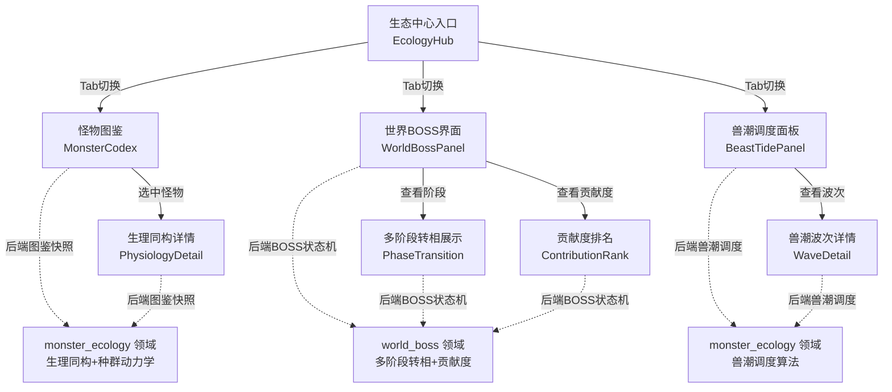
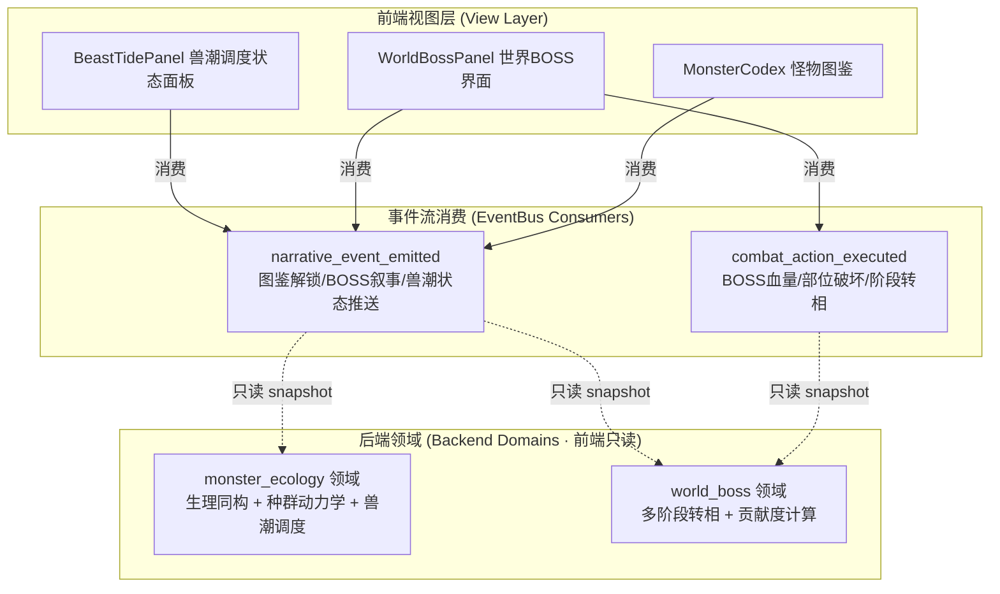
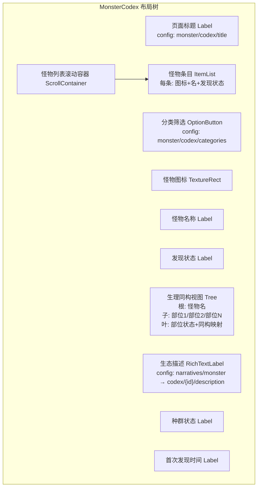
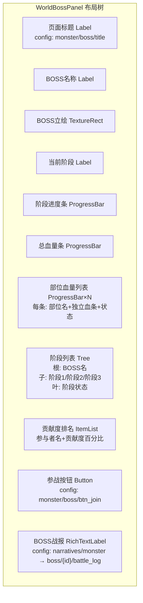
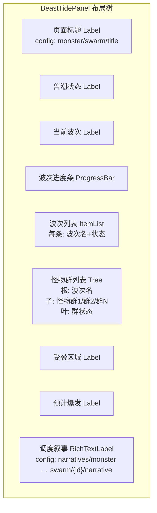

# 前端架构需求表11（第十一卷：怪物与生态系统）

> \[!NOTE]
> **【全局架构声明】**：本篇及全套前端技术文档中所提及的所有具体界面文案、按钮标签、配色令牌与演示数据，**均属基础演示示例（Illustrative Examples Only），绝非底层硬编码或静态写死结构**。前端表现层仅定义**事件流消费契约、视图-事件映射表、Theme 令牌层与组件可复用基座**，全部用户可见文案由 `config/frontend/ui.json` 与 `config/narratives/monster.json` 驱动。

***

## 一、 系统架构总览与视图模型划分 (Frontend Domain Overview)

### 1.1 架构设计理念：怪物生态表现宿主 (Monster Ecology Presentation Host)

本前端系统以**微观生理同构图鉴与世界 BOSS 多阶段转相可视化**为运行底座，前端视图只消费 `EventBus` 的 `combat_action_executed` 与 `narrative_event_emitted` 两个信号，以及 `GameConfig` 的只读配置查询，不持有任何生态种群动力学、BOSS 阶段状态机、兽潮调度算法或贡献度计算逻辑（全部由后端 `monster_ecology` 与 `world_boss` 领域负责）。

* **表现层绝对解耦**：前端只负责「事件 → 渲染」映射与只读 snapshot 查询，不做任何生理同构推导、BOSS 阶段切换判定或兽潮调度求解；
* **双信号消费**：`combat_action_executed` 驱动 BOSS 血量与部位破坏实时更新；`narrative_event_emitted` 驱动图鉴解锁叙事、BOSS 转相叙事与兽潮调度状态推送；
* **配置驱动文案**：全部怪物名称、生理部位名称、BOSS 阶段名称、兽潮波次名称来自 `config/frontend/ui.json`，怪物生态叙事与 BOSS 战报来自 `config/narratives/monster.json`。

### 1.2 怪物生态流程状态视图 (Monster Ecology Flow State Views)



### 1.3 核心子视图与事件映射 (View-Event Mapping)



***

## 二、 怪物图鉴界面 (Monster Codex)

### 2.1 视图职责与布局

怪物图鉴界面展示全部已发现怪物的微观生理同构信息。前端只渲染后端 `monster_ecology` 领域下发的图鉴快照，**不做任何生理同构推导、种群状态计算或解锁条件判定**（全部由后端领域负责）。

| 区域       | 节点类型           | 内容来源                                          | 说明                       |
| :------- | :------------- | :-------------------------------------------- | :----------------------- |
| 页面标题     | Label          | `config/frontend/ui.json` → `monster/codex/title` | 如「怪物图鉴」               |
| 怪物分类筛选 | OptionButton   | `config/frontend/ui.json` → `monster/codex/categories` | 兽类/人形/亡灵/龙种/元素等    |
| 怪物列表     | ItemList       | `monster_ecology.codex_entries[]` 只读快照       | 每条显示名/图标/已发现/未发现     |
| 怪物图标     | TextureRect    | 快照字段 `icon`                                   | 怪物头像/剪影                  |
| 怪物名称     | Label          | 快照字段 `name`                                  | 怪物名称（配置表驱动）             |
| 发现状态     | Label          | 快照字段 `is_discovered`                        | 已发现/未发现                  |
| 生理同构视图 | Tree           | 快照字段 `physiology[]`                         | 生理部位树形展示                 |
| 生理部位名   | Label          | 快照字段 `physiology[].part_name`              | 部位名称（配置表驱动）             |
| 生理部位状态 | Label          | 快照字段 `physiology[].part_status`            | 正常/受损/破坏/同构映射         |
| 生态描述     | RichTextLabel  | `config/narratives/monster.json` → `codex/{id}/description` | bbcode 富文本生态描述   |
| 种群状态     | Label          | 快照字段 `population_status`                   | 后端计算的种群密度（前端只展示）    |
| 首次发现时间 | Label          | 快照字段 `first_discovered_at`                 | 世界时钟时刻                   |

### 2.2 布局树



### 2.3 输入采集与后端透传契约

```typescript
// 前端图鉴查询请求 DTO（透传后端 monster_ecology 领域，前端不做解锁条件判定）
interface CodexQueryRequestDTO {
  filterCategory?: string;  // 分类筛选偏好（仅 UI 展示用）
  characterId: string;
}

// 后端返回的图鉴快照（前端只渲染，不判定）
interface CodexSnapshotDTO {
  entries: CodexEntryDTO[];
  totalDiscovered: number;
  totalSpecies: number;
}

interface CodexEntryDTO {
  monsterId: string;
  name: string;               // 怪物名称文案 key
  icon: string;                // 图标资源路径
  category: string;            // 分类文案 key
  isDiscovered: boolean;       // 后端判定是否已发现
  physiology: PhysiologyPartDTO[];  // 生理同构部位列表
  populationStatus: string;    // 后端计算的种群状态文案 key
  firstDiscoveredAt?: number;  // 首次发现世界时钟时刻
}

interface PhysiologyPartDTO {
  partId: string;
  partName: string;           // 部位名称文案 key
  partStatus: string;         // 部位状态文案 key
  isomorphicMapping: string;  // 同构映射文案 key（如「心脏→动力核心」）
  description: string;        // 部位描述文案 key
}
```

### 2.4 怪物图鉴事件消费代码示例

```gdscript
## 怪物图鉴消费图鉴解锁叙事事件，只渲染不判定解锁条件
func _ready() -> void:
    EventBus.get_instance().narrative_event_emitted.connect(_on_narrative_event)
    _request_codex_snapshot()

func _request_codex_snapshot() -> void:
    var req := CodexQueryRequestDTO.new()
    req.characterId = GameState.current_character_id
    req.filterCategory = _current_filter
    BackendProxy.request("monster_ecology", "codex_snapshot", req)

## 消费图鉴解锁叙事事件 → 更新发现状态
func _on_narrative_event(packet: Dictionary) -> void:
    var cat = packet.get("category", "")
    var txt = packet.get("text", "")
    var action = packet.get("action", "")
    if action == "monster_discovered":
        _update_codex_entry(packet.get("monster_id", ""), true)
        # 图鉴解锁叙事文本以 eco_swarm 配色展示
        codex_log.append_text("[color=#ef4444]" + txt + "[/color]\n")
    elif action == "physiology_revealed":
        _update_physiology_part(packet.get("monster_id", ""), packet.get("part_id", ""), packet.get("part_status", ""))
    elif action == "population_changed":
        _update_population_status(packet.get("monster_id", ""), packet.get("population_status", ""))
```

***

## 三、 世界 BOSS 界面 (World Boss Panel)

### 3.1 视图职责与布局

世界 BOSS 界面展示当前世界 BOSS 的多阶段转相状态与参与者贡献度。前端只渲染后端 `world_boss` 领域下发的 BOSS 状态快照，**不做任何阶段切换判定、血量计算或贡献度排序**（全部由后端领域负责）。BOSS 血量与部位破坏状态由 `combat_action_executed` 信号实时驱动。

| 区域       | 节点类型           | 内容来源                                          | 说明                       |
| :------- | :------------- | :-------------------------------------------- | :----------------------- |
| 页面标题     | Label          | `config/frontend/ui.json` → `monster/boss/title` | 如「世界 BOSS」            |
| BOSS 名称   | Label          | 快照字段 `boss_name`                            | BOSS 名称（配置表驱动）          |
| BOSS 立绘   | TextureRect    | 快照字段 `boss_portrait`                        | BOSS 当前阶段立绘              |
| 当前阶段     | Label          | 快照字段 `current_phase`                       | 阶段名称（配置表驱动）             |
| 阶段进度条   | ProgressBar    | 快照字段 `phase_progress`                      | 后端计算的当前阶段进度 0~100%    |
| 总血量条   | ProgressBar    | 快照字段 `total_hp` / `total_hp_max`        | 后端计算的总血量                |
| 部位血量列表 | ProgressBar ×N | 快照字段 `parts[]`                              | 多部位独立血条                  |
| 部位名称     | Label          | 快照字段 `parts[].part_name`                   | 部位名称                     |
| 部位状态     | Label          | 快照字段 `parts[].part_status`                | 正常/受损/破坏                 |
| 阶段列表     | Tree           | 快照字段 `phases[]`                             | 全部阶段展示（已完成/当前/未触发）     |
| 贡献度排名   | ItemList       | 快照字段 `contributions[]`                      | 参与者贡献度排名（后端排序）         |
| 参战按钮     | Button         | `config/frontend/ui.json` → `monster/boss/btn_join` | 透传后端参战               |
| BOSS 战报 | RichTextLabel  | `config/narratives/monster.json` → `boss/{id}/battle_log` | bbcode 富文本战报      |

### 3.2 布局树



### 3.3 输入采集与后端透传契约

```typescript
// 前端 BOSS 参战请求 DTO（透传后端 world_boss 领域，前端不做参战条件判定）
interface BossJoinRequestDTO {
  bossId: string;          // BOSS ID
  characterId: string;
}

// 后端返回的 BOSS 状态快照（前端只渲染，不判定）
interface WorldBossSnapshotDTO {
  bossId: string;
  bossName: string;
  bossPortrait: string;
  currentPhase: string;       // 当前阶段文案 key
  phaseProgress: number;        // 当前阶段进度 0~100
  totalHp: number;
  totalHpMax: number;
  parts: BossPartDTO[];         // 多部位血量列表
  phases: BossPhaseDTO[];        // 全部阶段列表
  contributions: ContributionDTO[];  // 贡献度排名（后端已排序）
  isAlive: boolean;
  isJoined: boolean;            // 后端判定是否已参战
  canJoin: boolean;             // 后端判定是否可参战
}

interface BossPartDTO {
  partId: string;
  partName: string;            // 部位名称文案 key
  hp: number;
  hpMax: number;
  partStatus: string;          // 部位状态文案 key
}

interface BossPhaseDTO {
  phaseId: string;
  phaseName: string;          // 阶段名称文案 key
  status: 'completed' | 'current' | 'locked';
  triggerCondition: string;   // 转相条件文案 key（前端只展示）
}

interface ContributionDTO {
  characterId: string;
  characterName: string;
  contributionPercent: number;  // 后端计算的贡献度百分比
  rank: number;
}
```

### 3.4 世界 BOSS 事件消费代码示例

```gdscript
## 世界BOSS界面消费战斗动作与BOSS叙事事件，只渲染不判定阶段/血量/贡献度
func _ready() -> void:
    var bus := EventBus.get_instance()
    bus.combat_action_executed.connect(_on_combat_action)
    bus.narrative_event_emitted.connect(_on_narrative_event)
    _request_boss_snapshot()

func _request_boss_snapshot() -> void:
    BackendProxy.request("world_boss", "boss_snapshot",
        {"character_id": GameState.current_character_id})

## 消费战斗动作事件 → 实时更新 BOSS 血量与部位状态
func _on_combat_action(packet: Dictionary) -> void:
    var action_type = packet.get("action_type", "")
    var target_id = packet.get("target_id", "")
    # 仅处理当前 BOSS 的战斗动作
    if target_id != _boss_id:
        return
    match action_type:
        "damage_dealt":
            var damage = packet.get("damage", 0)
            var part_id = packet.get("part_id", "")
            if part_id.is_empty():
                _update_total_hp(-damage)
            else:
                _update_part_hp(part_id, -damage)
        "part_destroyed":
            _mark_part_destroyed(packet.get("part_id", ""))
        "phase_transition":
            _handle_phase_transition(packet)

## 消费 BOSS 叙事事件 → 更新阶段与战报
func _on_narrative_event(packet: Dictionary) -> void:
    var cat = packet.get("category", "")
    var txt = packet.get("text", "")
    var action = packet.get("action", "")
    if action == "boss_phase_changed":
        _update_current_phase(packet.get("new_phase", ""))
        _update_boss_portrait(packet.get("new_portrait", ""))
        # 阶段转相叙事文本以 combat 配色展示
        battle_log.append_text("[color=#f87171]" + txt + "[/color]\n")
    elif action == "boss_defeated":
        _show_boss_defeated(packet)
        battle_log.append_text("[color=#f87171]" + txt + "[/color]\n")
    elif action == "contribution_updated":
        _refresh_contribution_rank(packet.get("contributions", []))

## 参战按钮点击 → 透传后端，前端不做参战条件判定
func _on_join_pressed() -> void:
    var req := BossJoinRequestDTO.new()
    req.bossId = _boss_id
    req.characterId = GameState.current_character_id
    BackendProxy.request("world_boss", "join_boss", req)
```

***

## 四、 兽潮调度状态面板 (Beast Tide Dispatch Panel)

### 4.1 视图职责与布局

兽潮调度状态面板展示当前兽潮的波次调度与怪物群状态。前端只渲染后端 `monster_ecology` 领域下发的兽潮快照，**不做任何兽潮调度算法、波次推进逻辑或怪物群生成计算**（全部由后端领域负责）。

| 区域       | 节点类型           | 内容来源                                          | 说明                       |
| :------- | :------------- | :-------------------------------------------- | :----------------------- |
| 页面标题     | Label          | `config/frontend/ui.json` → `monster/swarm/title` | 如「兽潮调度」             |
| 兽潮状态     | Label          | 快照字段 `swarm_status`                         | 蓄能中/爆发中/消退中/已平息      |
| 当前波次     | Label          | 快照字段 `current_wave`                        | 当前波次序号/总波次数            |
| 波次进度条   | ProgressBar    | 快照字段 `wave_progress`                       | 后端计算的当前波次进度 0~100%   |
| 波次列表     | ItemList       | 快照字段 `waves[]`                              | 全部波次展示（已完成/当前/未到达）   |
| 波次名称     | Label          | 快照字段 `waves[].wave_name`                   | 波次名称（配置表驱动）             |
| 怪物群列表   | Tree           | 快照字段 `waves[].monster_groups[]`            | 每波怪物群组成                  |
| 怪物群状态   | Label          | 快照字段 `waves[].monster_groups[].status`    | 待生成/已生成/已击退/已突破        |
| 受袭区域     | Label          | 快照字段 `affected_regions[]`                 | 受兽潮影响的区域/城镇             |
| 预计爆发   | Label          | 快照字段 `estimated_outbreak`                 | 后端计算的预计爆发世界时钟时刻     |
| 调度叙事     | RichTextLabel  | `config/narratives/monster.json` → `swarm/{id}/narrative` | bbcode 富文本兽潮叙事   |

### 4.2 布局树



### 4.3 输入采集与后端透传契约

```typescript
// 前端兽潮查询请求 DTO（透传后端 monster_ecology 领域，前端不做调度算法）
interface BeastTideQueryRequestDTO {
  characterId: string;
}

// 后端返回的兽潮快照（前端只渲染，不判定）
interface BeastTideSnapshotDTO {
  swarmStatus: string;        // 兽潮状态文案 key
  currentWave: number;
  totalWaves: number;
  waveProgress: number;        // 当前波次进度 0~100
  waves: BeastTideWaveDTO[];
  affectedRegions: string[];   // 受袭区域文案 key 列表
  estimatedOutbreak?: number;  // 预计爆发世界时钟时刻
  isActive: boolean;
}

interface BeastTideWaveDTO {
  waveId: string;
  waveName: string;            // 波次名称文案 key
  waveIndex: number;
  status: 'completed' | 'current' | 'pending';
  monsterGroups: MonsterGroupDTO[];
}

interface MonsterGroupDTO {
  groupId: string;
  monsterType: string;        // 怪物类型文案 key
  count: number;
  status: string;              // 群状态文案 key
  targetRegion: string;        // 目标区域文案 key
}
```

### 4.4 兽潮调度事件消费代码示例

```gdscript
## 兽潮调度面板消费兽潮叙事事件，只渲染不推演调度算法/波次推进
func _ready() -> void:
    EventBus.get_instance().narrative_event_emitted.connect(_on_narrative_event)
    _request_swarm_snapshot()

func _request_swarm_snapshot() -> void:
    BackendProxy.request("monster_ecology", "swarm_snapshot",
        {"character_id": GameState.current_character_id})

## 消费兽潮叙事事件 → 更新波次与怪物群状态
func _on_narrative_event(packet: Dictionary) -> void:
    var cat = packet.get("category", "")
    var txt = packet.get("text", "")
    var action = packet.get("action", "")
    # 兽潮事件以 eco_swarm 配色展示
    if cat == EventBus.get_category_name("eco_swarm"):
        match action:
            "swarm_status_changed":
                _update_swarm_status(packet.get("new_status", ""))
            "wave_started":
                _update_current_wave(packet.get("wave_index", 0))
                _update_wave_progress(packet.get("progress", 0))
            "wave_completed":
                _mark_wave_completed(packet.get("wave_id", ""))
            "monster_group_spawned":
                _update_group_status(packet.get("group_id", ""), "已生成")
            "monster_group_defeated":
                _update_group_status(packet.get("group_id", ""), "已击退")
            "monster_group_breached":
                _update_group_status(packet.get("group_id", ""), "已突破")
            "outbreak_imminent":
                _update_estimated_outbreak(packet.get("estimated_time", 0))
        # 兽潮调度叙事文本以 eco_swarm 配色展示
        narrative_label.append_text("[color=#ef4444]" + txt + "[/color]\n")
    elif cat == EventBus.get_category_name("combat"):
        # 兽潮中的战斗动作也展示在战报区
        battle_log.append_text("[color=#f87171]" + txt + "[/color]\n")
```

***

## 五、 Theme 令牌与配色规范 (Theme Tokens)

怪物与生态系统的全部配色由 Theme 令牌层统一管理，与 `event_categories.json` 对齐：

| UI 元素     | 配色来源                                   | 令牌          | 兜底默认值                        |
| :--------- | :--------------------------------------- | :---------- | :--------------------------- |
| 页面背景       | Theme                                    | `--bg`      | `Color(0.06, 0.08, 0.12, 1)` |
| 主标题文字     | Theme                                    | `--title`   | `Color(0.38, 0.75, 0.98, 1)` |
| 普通正文       | Theme                                    | `--text`    | `Color(0.88, 0.91, 0.95, 1)` |
| 战斗事件文字   | `event_categories.json` → `combat`     | `#f87171`   | —                            |
| 兽潮生态事件 | `event_categories.json` → `eco_swarm`  | `#ef4444`   | —                            |
| 系统通知事件 | `event_categories.json` → `system`      | `#38bdf8`   | —                            |
| BOSS 血量条 | `event_categories.json` → `combat`     | `#f87171`   | —                            |
| 部位正常       | Theme                                    | `--success` | `Color(0.20, 0.83, 0.60, 1)` |
| 部位受损       | Theme                                    | `--warning` | `Color(0.98, 0.75, 0.27, 1)` |
| 部位破坏       | Theme                                    | `--danger`  | `Color(0.97, 0.53, 0.53, 1)` |
| 兽潮爆发高亮 | `event_categories.json` → `eco_swarm`  | `#ef4444`   | —                            |
| 兽潮蓄能     | Theme                                    | `--muted`   | `Color(0.45, 0.48, 0.52, 1)` |
| 兽潮消退       | Theme                                    | `--success` | `Color(0.20, 0.83, 0.60, 1)` |
| 默认事件       | `event_categories.json` → `_default`     | `#94a3b8`   | —                            |

***

## 六、 验收矩阵 (DoD Matrix)

| 验收项          | 验收标准                                         | 验证方式                                               |
| :------------- | :------------------------------------------- | :------------------------------------------------- |
| 图鉴可达       | 生态中心入口可到达怪物图鉴，无崩溃                              | `godot` 启动观察                                       |
| 生理同构渲染   | 生理同构部位树正确渲染，部位名称与状态来自后端快照                    | 手动走查                                               |
| BOSS 界面渲染 | BOSS 立绘/血量条/部位血条/阶段列表/贡献度排名正确渲染            | 手动走查                                               |
| 血量实时更新   | BOSS 总血量与部位血量随 `combat_action_executed` 实时更新 | 事件注入测试                                             |
| 阶段转相同步   | BOSS 阶段转相叙事与立绘随 `narrative_event_emitted` 同步更新 | 事件注入测试                                             |
| 兽潮面板渲染   | 兽潮状态/波次列表/怪物群树/受袭区域正确渲染                      | 手动走查                                               |
| 兽潮状态同步   | 兽潮波次与怪物群状态随 `narrative_event_emitted` 的 eco_swarm 分类实时更新 | 事件注入测试                                             |
| 文案零硬编码   | 所有怪物名/部位名/阶段名/波次名/按钮文案均来自配置表                  | `rg "怪物图鉴" frontend/` 仅命中配置读取                      |
| 配色配置驱动   | 删除 `event_categories.json` 的 `combat`/`eco_swarm` 分类后回退默认色 | 配置表删键后验证                                           |
| 零逻辑纪律   | 前端代码无生理同构推导/BOSS 阶段状态机/兽潮调度算法/贡献度计算       | `rg "isomorphic_deduce\|boss_phase_fsm\|swarm_dispatch\|contribution_calc" frontend/` 无命中 |
| 事件消费完整   | `combat_action_executed` 与 `narrative_event_emitted` 的 eco_swarm 分类均有视图消费 | 事件注入测试                                             |
| 视图可切换   | 怪物图鉴 ↔ 世界BOSS ↔ 兽潮调度 均可导航                     | 手动走查                                               |
