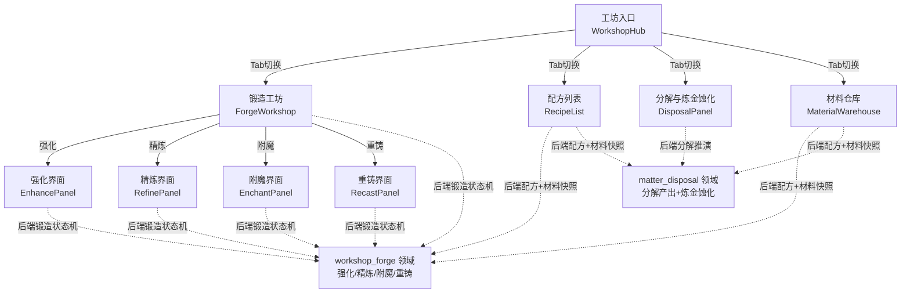
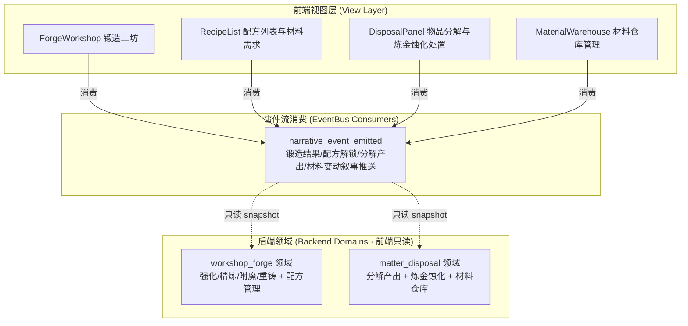
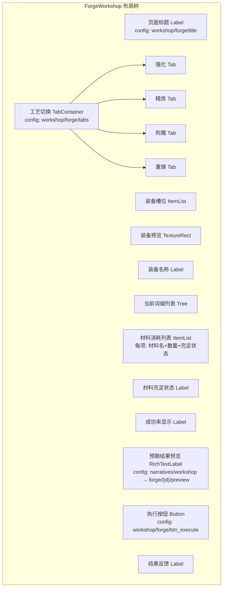
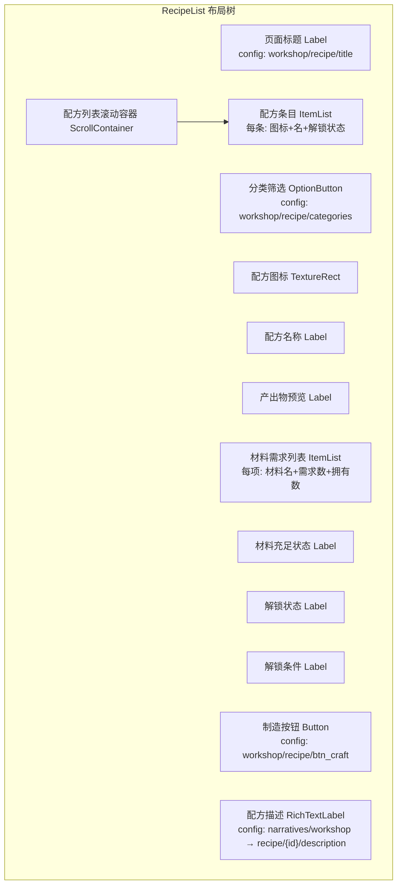
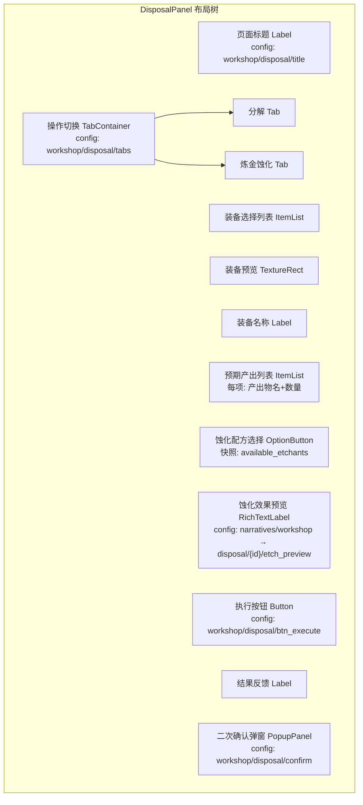
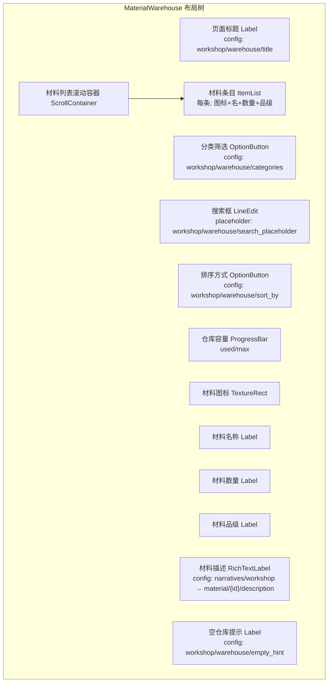

# 前端架构需求表12（第十二卷：制造与工坊系统）

> \[!NOTE]
> **【全局架构声明】**：本篇及全套前端技术文档中所提及的所有具体界面文案、按钮标签、配色令牌与演示数据，**均属基础演示示例（Illustrative Examples Only），绝非底层硬编码或静态写死结构**。前端表现层仅定义**事件流消费契约、视图-事件映射表、Theme 令牌层与组件可复用基座**，全部用户可见文案由 `config/frontend/ui.json` 与 `config/narratives/workshop.json` 驱动。

***

## 一、 系统架构总览与视图模型划分 (Frontend Domain Overview)

### 1.1 架构设计理念：制造工坊表现宿主 (Workshop Forge Presentation Host)

本前端系统以**锻造强化、配方管理、物品分解与材料仓库**为运行底座，前端视图只消费 `EventBus` 的 `narrative_event_emitted` 信号，以及 `GameConfig` 的只读配置查询，不持有任何锻造概率计算、词缀实例化逻辑、配方解锁条件判定或分解产出推演（全部由后端 `workshop_forge` 与 `matter_disposal` 领域负责）。

* **表现层绝对解耦**：前端只负责「输入采集 → 透传后端 → 渲染反馈结果」，不做任何强化成功率计算、附魔词缀实例化、分解产出推演或材料合成公式求解；
* **四工艺零判定**：锻造工坊的强化/精炼/附魔/重铸四工艺操作全部透传后端，前端只渲染后端返回的结果快照（成功/失败/词缀变化）；
* **配置驱动文案**：全部工艺名称、配方名称、材料名称、词缀描述来自 `config/frontend/ui.json`，锻造叙事与分解反馈来自 `config/narratives/workshop.json`。

### 1.2 制造工坊流程状态视图 (Workshop Forge Flow State Views)



### 1.3 核心子视图与事件映射 (View-Event Mapping)



***

## 二、 锻造工坊界面 (Forge Workshop)

### 2.1 视图职责与布局

锻造工坊界面是制造系统的核心操作入口，包含强化、精炼、附魔、重铸四工艺。前端只采集操作输入并透传后端 `workshop_forge` 领域，**不做任何强化成功率计算、词缀实例化或属性重算逻辑**（全部由后端领域负责）。

| 区域       | 节点类型           | 内容来源                                          | 说明                       |
| :------- | :------------- | :-------------------------------------------- | :----------------------- |
| 页面标题     | Label          | `config/frontend/ui.json` → `workshop/forge/title` | 如「锻造工坊」             |
| 工艺切换标签 | TabContainer   | `config/frontend/ui.json` → `workshop/forge/tabs` | 强化/精炼/附魔/重铸         |
| 装备槽位     | ItemList       | 当前装备快照                                       | 选择目标装备透传后端              |
| 装备预览     | TextureRect    | 快照字段 `equipment_icon`                      | 装备图标                     |
| 装备名称     | Label          | 快照字段 `equipment_name`                      | 装备名称                     |
| 当前词缀列表 | Tree           | 快照字段 `current_affixes[]`                   | 当前装备词缀展示                 |
| 材料消耗列表 | ItemList       | 快照字段 `required_materials[]`                | 后端计算的材料需求                |
| 材料充足状态 | Label          | 快照字段 `materials_sufficient`               | 后端判定材料是否充足              |
| 成功率显示   | Label          | 快照字段 `success_rate`                        | 后端计算的成功率（前端只展示）       |
| 预期结果预览 | RichTextLabel  | `config/narratives/workshop.json` → `forge/{id}/preview` | 后端下发的预期词缀变化预览 |
| 执行按钮     | Button         | `config/frontend/ui.json` → `workshop/forge/btn_execute` | 透传后端执行锻造           |
| 结果反馈     | Label          | 后端锻造结果事件                                     | 成功/失败/词缀变化              |

### 2.2 布局树



### 2.3 输入采集与后端透传契约

```typescript
// 前端锻造操作请求 DTO（透传后端 workshop_forge 领域，前端不做成功率/词缀/属性计算）
interface ForgeActionRequestDTO {
  equipmentId: string;     // 目标装备 ID
  processType: 'enhance' | 'refine' | 'enchant' | 'recast';  // 工艺类型
  materialIds: string[];    // 消耗材料 ID 列表
  characterId: string;
  payload?: Record<string, unknown>;  // 额外参数（如附魔卷轴ID）原样透传
}

// 后端返回的锻造预期快照（前端只渲染，不判定）
interface ForgePreviewDTO {
  equipmentId: string;
  equipmentName: string;
  equipmentIcon: string;
  currentAffixes: AffixDTO[];       // 当前词缀列表
  requiredMaterials: MaterialDTO[];   // 后端计算的材料需求
  materialsSufficient: boolean;       // 后端判定材料是否充足
  successRate: number;                 // 后端计算的成功率（前端只展示）
  previewAffixes: AffixDTO[];         // 后端下发的预期词缀变化
  canExecute: boolean;                // 后端判定是否可执行
}

// 后端返回的锻造结果（前端只渲染，不判定）
interface ForgeResultDTO {
  success: boolean;
  processType: string;
  resultAffixes: AffixDTO[];    // 结果词缀列表
  consumedMaterials: MaterialDTO[];  // 实际消耗的材料
  errorCode?: string;         // 错误码 → narratives/workshop.json 查文案
  narrativeText: string;       // 锻造叙事文本（配置表驱动）
}

interface AffixDTO {
  affixId: string;
  affixName: string;          // 词缀名称文案 key
  affixType: string;          // 正面/负面/中性
  affixValue: string;         // 词缀数值描述
  isNew: boolean;             // 后端标记是否为新词缀
}

interface MaterialDTO {
  materialId: string;
  materialName: string;       // 材料名称文案 key
  requiredQty: number;
  ownedQty: number;
  iconPath: string;
}
```

### 2.4 锻造工坊事件消费代码示例

```gdscript
## 锻造工坊消费锻造结果事件，只渲染不计算成功率/词缀/属性
func _ready() -> void:
    EventBus.get_instance().narrative_event_emitted.connect(_on_narrative_event)
    _request_forge_preview()

## 请求后端下发锻造预期快照（前端不做成功率/材料充足判定）
func _request_forge_preview() -> void:
    var req := {"equipment_id": _selected_equipment_id,
                "process_type": _current_process_type,
                "character_id": GameState.current_character_id}
    BackendProxy.request("workshop_forge", "forge_preview", req)

## 消费锻造结果事件 → 更新词缀列表与反馈
func _on_narrative_event(packet: Dictionary) -> void:
    var cat = packet.get("category", "")
    var txt = packet.get("text", "")
    var action = packet.get("action", "")
    if action == "forge_completed":
        var success = packet.get("success", false)
        if success:
            _refresh_affix_list(packet.get("result_affixes", []))
            result_label.text = GameConfig.get_string(
                "frontend.ui", "workshop/forge/success",
                "锻造成功"  # 兜底默认值
            )
        else:
            _render_forge_error(packet.get("error_code", "FORGE_FAILED"))
        # 锻造叙事文本以 grimoire 配色展示
        result_label.append_text("[color=#c084fc]" + txt + "[/color]\n")
    elif action == "affix_changed":
        _update_single_affix(packet)

## 执行按钮点击 → 透传后端，前端不做成功率/词缀实例化判定
func _on_execute_pressed() -> void:
    var req := ForgeActionRequestDTO.new()
    req.equipmentId = _selected_equipment_id
    req.processType = _current_process_type
    req.materialIds = _selected_material_ids
    req.characterId = GameState.current_character_id
    BackendProxy.request("workshop_forge", "execute_forge", req)
```

### 2.5 错误码到文案映射

前端不硬编码任何错误文案，全部由 `config/narratives/workshop.json` 的 `forge_errors` 节驱动：

| 错误码               | 配置路径                                                  | 兜底默认文案           |
| :---------------- | :------------------------------------------------------ | :--------------- |
| `MATERIAL_INSUFFICIENT` | `narratives.workshop → forge_errors/MATERIAL_INSUFFICIENT` | 「材料不足，无法锻造」 |
| `EQUIPMENT_INVALID` | `narratives.workshop → forge_errors/EQUIPMENT_INVALID` | 「装备不可用或不支持此工艺」 |
| `FORGE_FAILED`     | `narratives.workshop → forge_errors/FORGE_FAILED`     | 「锻造失败，材料已消耗」     |
| `MAX_ENHANCE_REACHED` | `narratives.workshop → forge_errors/MAX_ENHANCE_REACHED` | 「已达强化上限」 |
| `AFFIX_CONFLICT`  | `narratives.workshop → forge_errors/AFFIX_CONFLICT`  | 「词缀冲突，无法附加」  |

```gdscript
## 错误码 → 文案：从 narratives/workshop.json 查表，未命中回退默认值
func _render_forge_error(error_code: String) -> void:
    result_label.text = GameConfig.get_string(
        "narratives.workshop", "forge_errors/" + error_code,
        "锻造失败，请重试"  # 兜底默认值
    )
```

***

## 三、 配方列表与材料需求界面 (Recipe List & Material Requirements)

### 3.1 视图职责与布局

配方列表界面展示全部已解锁的制造配方与所需材料。前端只渲染后端 `workshop_forge` 领域下发的配方快照，**不做任何配方解锁条件判定或材料合成公式计算**（全部由后端领域负责）。

| 区域       | 节点类型           | 内容来源                                          | 说明                       |
| :------- | :------------- | :-------------------------------------------- | :----------------------- |
| 页面标题     | Label          | `config/frontend/ui.json` → `workshop/recipe/title` | 如「配方图鉴」             |
| 配方分类筛选 | OptionButton   | `config/frontend/ui.json` → `workshop/recipe/categories` | 武器/防具/饰品/材料/消耗品等   |
| 配方列表     | ItemList       | `workshop_forge.recipes[]` 只读快照              | 每条显示名/图标/解锁状态        |
| 配方图标     | TextureRect    | 快照字段 `recipe_icon`                          | 配方产出物图标                 |
| 配方名称     | Label          | 快照字段 `recipe_name`                         | 配方名称                     |
| 产出物预览   | Label          | 快照字段 `output_item`                        | 产出物名称与数量                |
| 材料需求列表 | ItemList       | 快照字段 `required_materials[]`                | 每项显示材料名/需求数/拥有数     |
| 材料充足状态 | Label          | 快照字段 `materials_sufficient`               | 后端判定是否满足材料需求        |
| 解锁状态     | Label          | 快照字段 `is_unlocked`                        | 已解锁/未解锁                  |
| 解锁条件     | Label          | 快照字段 `unlock_condition`                 | 后端设定的解锁条件文案          |
| 制造按钮     | Button         | `config/frontend/ui.json` → `workshop/recipe/btn_craft` | 透传后端制造             |
| 配方描述     | RichTextLabel  | `config/narratives/workshop.json` → `recipe/{id}/description` | bbcode 富文本配方描述   |

### 3.2 布局树



### 3.3 输入采集与后端透传契约

```typescript
// 前端配方制造请求 DTO（透传后端 workshop_forge 领域，前端不做解锁/材料判定）
interface RecipeCraftRequestDTO {
  recipeId: string;       // 配方 ID
  craftQuantity: number;   // 制造数量
  characterId: string;
}

// 后端返回的配方列表快照（前端只渲染，不判定）
interface RecipeListSnapshotDTO {
  recipes: RecipeEntryDTO[];
  totalUnlocked: number;
  totalRecipes: number;
}

interface RecipeEntryDTO {
  recipeId: string;
  recipeName: string;        // 配方名称文案 key
  recipeIcon: string;         // 配方图标路径
  category: string;           // 分类文案 key
  isUnlocked: boolean;        // 后端判定是否已解锁
  unlockCondition: string;    // 解锁条件文案 key
  outputItem: {
    itemName: string;         // 产出物名称文案 key
    quantity: number;
    iconPath: string;
  };
  requiredMaterials: MaterialDTO[];
  materialsSufficient: boolean;  // 后端判定材料是否充足
  canCraft: boolean;          // 后端判定是否可制造
}
```

### 3.4 配方列表事件消费代码示例

```gdscript
## 配方列表消费配方解锁与制造结果事件，只渲染不判定解锁/材料
func _ready() -> void:
    EventBus.get_instance().narrative_event_emitted.connect(_on_narrative_event)
    _request_recipe_list_snapshot()

func _request_recipe_list_snapshot() -> void:
    var req := {"character_id": GameState.current_character_id,
                "filter_category": _current_filter}
    BackendProxy.request("workshop_forge", "recipe_list_snapshot", req)

func _on_narrative_event(packet: Dictionary) -> void:
    var cat = packet.get("category", "")
    var txt = packet.get("text", "")
    var action = packet.get("action", "")
    if action == "recipe_unlocked":
        _update_recipe_unlock_status(packet.get("recipe_id", ""), true)
        # 配方解锁叙事文本以 grimoire 配色展示
        recipe_log.append_text("[color=#c084fc]" + txt + "[/color]\n")
    elif action == "craft_completed":
        var success = packet.get("success", false)
        if success:
            _refresh_material_counts(packet.get("consumed_materials", []))
            result_label.text = GameConfig.get_string(
                "frontend.ui", "workshop/recipe/craft_success",
                "制造成功"  # 兜底默认值
            )
        else:
            _render_craft_error(packet.get("error_code", "CRAFT_FAILED"))
        recipe_log.append_text("[color=#c084fc]" + txt + "[/color]\n")

## 制造按钮点击 → 透传后端，前端不做解锁/材料/成功率判定
func _on_craft_pressed() -> void:
    var selected := recipe_list.get_selected_recipe_id()
    if selected.is_empty():
        return
    var req := RecipeCraftRequestDTO.new()
    req.recipeId = selected
    req.craftQuantity = _craft_quantity
    req.characterId = GameState.current_character_id
    BackendProxy.request("workshop_forge", "craft", req)
```

***

## 四、 物品分解与炼金蚀化处置界面 (Item Disassembly & Alchemy Etching)

### 4.1 视图职责与布局

物品分解界面展示装备分解与炼金蚀化处置操作。前端只采集操作输入并透传后端 `matter_disposal` 领域，**不做任何分解产出推演、蚀化配方计算或材料实例化逻辑**（全部由后端领域负责）。

| 区域       | 节点类型           | 内容来源                                          | 说明                       |
| :------- | :------------- | :-------------------------------------------- | :----------------------- |
| 页面标题     | Label          | `config/frontend/ui.json` → `workshop/disposal/title` | 如「分解与蚀化」           |
| 操作切换标签 | TabContainer   | `config/frontend/ui.json` → `workshop/disposal/tabs` | 分解/炼金蚀化             |
| 装备选择列表 | ItemList       | 当前装备快照                                       | 选择分解/蚀化目标              |
| 装备预览     | TextureRect    | 快照字段 `equipment_icon`                      | 装备图标                     |
| 装备名称     | Label          | 快照字段 `equipment_name`                      | 装备名称                     |
| 预期产出列表 | ItemList       | 快照字段 `expected_outputs[]`                 | 后端计算的分解/蚀化产出预览     |
| 产出物名称   | Label          | 快照字段 `expected_outputs[].item_name`     | 产出材料名称                   |
| 产出数量     | Label          | 快照字段 `expected_outputs[].quantity`       | 预计产出数量                   |
| 蚀化配方选择 | OptionButton   | 快照字段 `available_etchants[]`               | 可用蚀化配方列表                 |
| 蚀化效果预览 | RichTextLabel  | `config/narratives/workshop.json` → `disposal/{id}/etch_preview` | 后端下发的蚀化效果预览 |
| 执行按钮     | Button         | `config/frontend/ui.json` → `workshop/disposal/btn_execute` | 透传后端执行分解/蚀化     |
| 结果反馈     | Label          | 后端分解/蚀化结果事件                                | 成功/失败/产出列表              |
| 二次确认弹窗 | PopupPanel     | `config/frontend/ui.json` → `workshop/disposal/confirm` | 分解/蚀化不可逆，前端做二次确认  |

### 4.2 布局树



### 4.3 输入采集与后端透传契约

```typescript
// 前端分解/蚀化请求 DTO（透传后端 matter_disposal 领域，前端不做产出推演/蚀化计算）
interface DisposalActionRequestDTO {
  equipmentId: string;     // 目标装备 ID
  actionType: 'disassemble' | 'alchemy_etch';
  etchantId?: string;       // 蚀化配方 ID（蚀化操作时必填）
  characterId: string;
}

// 后端返回的预期产出快照（前端只渲染，不判定）
interface DisposalPreviewDTO {
  equipmentId: string;
  equipmentName: string;
  equipmentIcon: string;
  expectedOutputs: DisposalOutputDTO[];   // 后端计算的预期产出
  availableEtchants: EtchantDTO[];         // 可用蚀化配方列表
  canExecute: boolean;                     // 后端判定是否可执行
  isReversible: boolean;                    // 后端标记操作是否可逆（通常为 false）
}

interface DisposalOutputDTO {
  materialId: string;
  materialName: string;      // 产出材料名称文案 key
  quantity: number;           // 预计产出数量
  iconPath: string;
  rarity: string;             // 材料品级文案 key
}

interface EtchantDTO {
  etchantId: string;
  etchantName: string;       // 蚀化配方名称文案 key
  description: string;       // 蚀化效果描述文案 key
  etchPreview: string;        // 蚀化预览文本（配置表驱动）
}

// 后端返回的分解/蚀化结果（前端只渲染，不判定）
interface DisposalResultDTO {
  success: boolean;
  actionType: string;
  actualOutputs: DisposalOutputDTO[];  // 实际产出材料列表
  errorCode?: string;
  narrativeText: string;
}
```

### 4.4 分解与蚀化事件消费代码示例

```gdscript
## 分解与蚀化界面消费分解/蚀化结果事件，只渲染不推演产出/蚀化效果
func _ready() -> void:
    EventBus.get_instance().narrative_event_emitted.connect(_on_narrative_event)
    _request_disposal_preview()

func _request_disposal_preview() -> void:
    var req := {"equipment_id": _selected_equipment_id,
                "action_type": _current_action_type,
                "character_id": GameState.current_character_id}
    BackendProxy.request("matter_disposal", "disposal_preview", req)

func _on_narrative_event(packet: Dictionary) -> void:
    var cat = packet.get("category", "")
    var txt = packet.get("text", "")
    var action = packet.get("action", "")
    if action == "disposal_completed":
        var success = packet.get("success", false)
        if success:
            _show_actual_outputs(packet.get("actual_outputs", []))
            result_label.text = GameConfig.get_string(
                "frontend.ui", "workshop/disposal/success",
                "操作成功"  # 兜底默认值
            )
        else:
            _render_disposal_error(packet.get("error_code", "DISPOSAL_FAILED"))
        # 分解/蚀化叙事文本以 grimoire 配色展示
        result_label.append_text("[color=#c084fc]" + txt + "[/color]\n")
    elif action == "etch_preview_updated":
        _update_etch_preview(packet.get("etch_preview", ""))

## 执行按钮点击 → 透传后端，前端不做产出推演/蚀化计算
func _on_execute_pressed() -> void:
    # 分解/蚀化不可逆操作 → 前端做二次确认
    var confirm_text := GameConfig.get_string(
        "frontend.ui", "workshop/disposal/confirm",
        "此操作不可逆，确定继续？"  # 兜底默认值
    )
    if not _show_confirm_dialog(confirm_text):
        return
    var req := DisposalActionRequestDTO.new()
    req.equipmentId = _selected_equipment_id
    req.actionType = _current_action_type
    if _current_action_type == "alchemy_etch":
        req.etchantId = _selected_etchant_id
    req.characterId = GameState.current_character_id
    BackendProxy.request("matter_disposal", "execute_disposal", req)
```

***

## 五、 材料仓库管理界面 (Material Warehouse)

### 5.1 视图职责与布局

材料仓库界面展示当前角色的全部制造材料库存。前端只渲染后端 `matter_disposal`（或 `workshop_forge`）领域下发的材料仓库快照，**不做任何材料合成公式计算、库存容量检查或材料品级判定**（全部由后端领域负责）。

| 区域       | 节点类型           | 内容来源                                          | 说明                       |
| :------- | :------------- | :-------------------------------------------- | :----------------------- |
| 页面标题     | Label          | `config/frontend/ui.json` → `workshop/warehouse/title` | 如「材料仓库」           |
| 材料分类筛选 | OptionButton   | `config/frontend/ui.json` → `workshop/warehouse/categories` | 金属/木材/皮革/宝石/药剂/精华等 |
| 材料列表     | ItemList       | `matter_disposal.materials[]` 只读快照          | 每条显示名/图标/数量/品级        |
| 材料图标     | TextureRect    | 快照字段 `icon`                                   | 材料图标                     |
| 材料名称     | Label          | 快照字段 `name`                                  | 材料名称（配置表驱动）             |
| 材料数量     | Label          | 快照字段 `quantity`                             | 当前库存数量                   |
| 材料品级     | Label          | 快照字段 `rarity`                               | 普通/精良/稀有/史诗/传说        |
| 材料描述     | RichTextLabel  | `config/narratives/workshop.json` → `material/{id}/description` | bbcode 富文本材料描述   |
| 排序方式     | OptionButton   | `config/frontend/ui.json` → `workshop/warehouse/sort_by` | 名称/数量/品级/分类          |
| 搜索框       | LineEdit       | `config/frontend/ui.json` → `workshop/warehouse/search_placeholder` | 输入关键词筛选（本地 UI 层筛选）|
| 仓库容量     | ProgressBar    | 快照字段 `used_capacity` / `max_capacity`    | 后端计算的仓库容量使用率         |
| 空仓库提示   | Label          | `config/frontend/ui.json` → `workshop/warehouse/empty_hint` | 如「仓库空空如也」            |

### 5.2 布局树



### 5.3 输入采集与后端透传契约

```typescript
// 前端材料仓库查询请求 DTO（透传后端，前端不做容量/品级判定）
interface MaterialWarehouseRequestDTO {
  filterCategory?: string;  // 分类筛选偏好（仅 UI 展示用）
  sortBy?: string;           // 排序偏好（仅 UI 展示用）
  characterId: string;
}

// 后端返回的材料仓库快照（前端只渲染，不判定）
interface MaterialWarehouseSnapshotDTO {
  materials: MaterialEntryDTO[];
  usedCapacity: number;       // 后端计算的已用容量
  maxCapacity: number;        // 后端计算的最大容量
}

interface MaterialEntryDTO {
  materialId: string;
  name: string;               // 材料名称文案 key
  icon: string;                // 图标路径
  category: string;            // 分类文案 key
  quantity: number;
  rarity: string;              // 品级文案 key
  description: string;         // 材料描述文案 key
  unitWeight: number;          // 单个重量（后端下发，前端只展示）
}
```

### 5.4 材料仓库事件消费代码示例

```gdscript
## 材料仓库消费材料变动事件，只渲染不计算容量/品级/合成
func _ready() -> void:
    EventBus.get_instance().narrative_event_emitted.connect(_on_narrative_event)
    _request_warehouse_snapshot()

func _request_warehouse_snapshot() -> void:
    var req := MaterialWarehouseRequestDTO.new()
    req.characterId = GameState.current_character_id
    req.filterCategory = _current_filter
    req.sortBy = _current_sort
    BackendProxy.request("matter_disposal", "warehouse_snapshot", req)

func _on_narrative_event(packet: Dictionary) -> void:
    var cat = packet.get("category", "")
    var txt = packet.get("text", "")
    var action = packet.get("action", "")
    if action == "material_acquired":
        _add_or_update_material(packet.get("material_id", ""), packet.get("quantity", 0))
    elif action == "material_consumed":
        _reduce_material_quantity(packet.get("material_id", ""), packet.get("quantity", 0))
    elif action == "capacity_changed":
        _update_capacity_display(packet.get("used", 0), packet.get("max", 0))
    # 材料变动叙事文本以 economy 配色展示
    warehouse_log.append_text("[color=#facc15]" + txt + "[/color]\n")

## 搜索框输入 → 纯 UI 层本地筛选（不透传后端）
func _on_search_text_changed(keyword: String) -> void:
    var filtered := []
    for entry in _all_materials:
        if keyword.is_empty() or keyword.to_lower() in entry.name.to_lower():
            filtered.append(entry)
    _render_material_list(filtered)
```

***

## 六、 Theme 令牌与配色规范 (Theme Tokens)

制造与工坊系统的全部配色由 Theme 令牌层统一管理，与 `event_categories.json` 对齐：

| UI 元素     | 配色来源                                   | 令牌          | 兜底默认值                        |
| :--------- | :--------------------------------------- | :---------- | :--------------------------- |
| 页面背景       | Theme                                    | `--bg`      | `Color(0.06, 0.08, 0.12, 1)` |
| 主标题文字     | Theme                                    | `--title`   | `Color(0.38, 0.75, 0.98, 1)` |
| 普通正文       | Theme                                    | `--text`    | `Color(0.88, 0.91, 0.95, 1)` |
| 锻造/附魔事件 | `event_categories.json` → `grimoire`  | `#c084fc`   | —                            |
| 材料变动事件 | `event_categories.json` → `economy`   | `#facc15`   | —                            |
| 系统通知事件 | `event_categories.json` → `system`      | `#38bdf8`   | —                            |
| 正面词缀       | Theme                                    | `--success` | `Color(0.20, 0.83, 0.60, 1)` |
| 负面词缀       | Theme                                    | `--danger`  | `Color(0.97, 0.53, 0.53, 1)` |
| 中性词缀       | Theme                                    | `--muted`   | `Color(0.45, 0.48, 0.52, 1)` |
| 品级：普通   | Theme                                    | `--muted`   | `Color(0.45, 0.48, 0.52, 1)` |
| 品级：精良   | Theme                                    | `--success` | `Color(0.20, 0.83, 0.60, 1)` |
| 品级：稀有   | `event_categories.json` → `system`      | `#38bdf8`   | —                            |
| 品级：史诗   | `event_categories.json` → `grimoire`  | `#c084fc`   | —                            |
| 品级：传说   | `event_categories.json` → `economy`   | `#facc15`   | —                            |
| 锻造成功       | Theme                                    | `--success` | `Color(0.20, 0.83, 0.60, 1)` |
| 锻造失败       | Theme                                    | `--danger`  | `Color(0.97, 0.53, 0.53, 1)` |
| 默认事件       | `event_categories.json` → `_default`     | `#94a3b8`   | —                            |

***

## 七、 验收矩阵 (DoD Matrix)

| 验收项          | 验收标准                                         | 验证方式                                               |
| :------------- | :------------------------------------------- | :------------------------------------------------- |
| 工坊可达       | 工坊入口可到达锻造工坊界面，无崩溃                              | `godot` 启动观察                                       |
| 四工艺切换   | 强化/精炼/附魔/重铸 Tab 可切换，各工艺界面正确渲染                | 手动走查                                               |
| 锻造结果反馈 | 锻造后词缀列表正确更新，成功/失败文案来自配置表                    | 手动走查                                               |
| 配方列表渲染 | 配方图标/名称/产出物/材料需求/解锁状态正确渲染                    | 手动走查                                               |
| 分解与蚀化   | 分解/蚀化操作透传后端，预期产出与实际结果正确展示                  | 手动走查                                               |
| 二次确认     | 分解/蚀化不可逆操作触发二次确认弹窗                          | 手动走查                                               |
| 材料仓库渲染 | 材料列表/图标/数量/品级/容量正确渲染                        | 手动走查                                               |
| 文案零硬编码 | 所有工艺名/配方名/材料名/词缀描述/按钮文案均来自配置表              | `rg "锻造工坊" frontend/` 仅命中配置读取                      |
| 错误码映射   | 5 种锻造错误码均有配置文案，兜底默认值生效                       | 删配置表键值后验证兜底                                        |
| 配色配置驱动 | 删除 `event_categories.json` 的 `grimoire`/`economy` 分类后回退默认色 | 配置表删键后验证                                           |
| 零逻辑纪律   | 前端代码无强化成功率计算/词缀实例化/分解产出推演/合成公式求解      | `rg "success_rate_calc\|instantiate_affix\|disposal_sim\|craft_formula" frontend/` 无命中 |
| 事件消费完整 | `narrative_event_emitted` 的 forge/recipe/disposal/warehouse 相关 action 均有视图消费 | 事件注入测试                                             |
| 视图可切换   | 锻造工坊 ↔ 配方列表 ↔ 分解蚀化 ↔ 材料仓库 均可导航            | 手动走查                                               |
