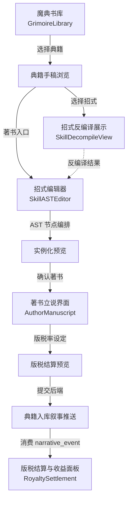
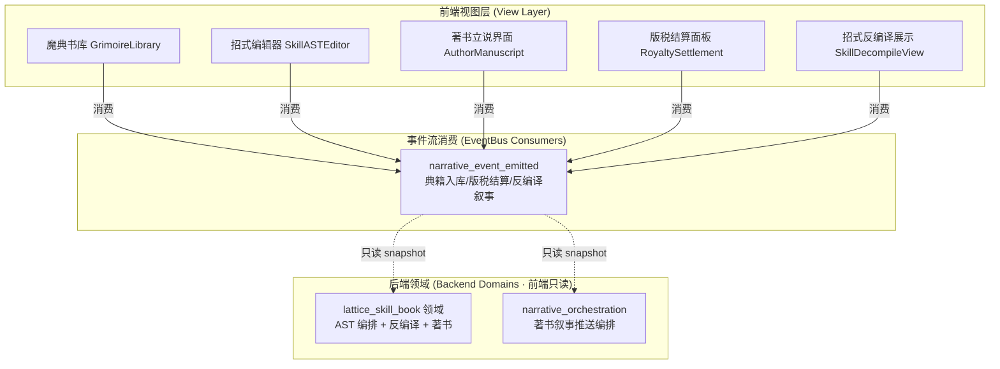
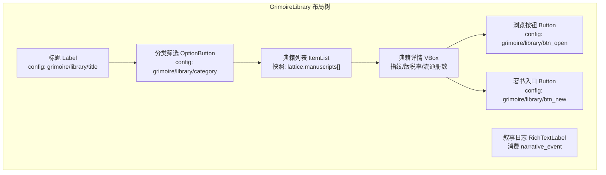
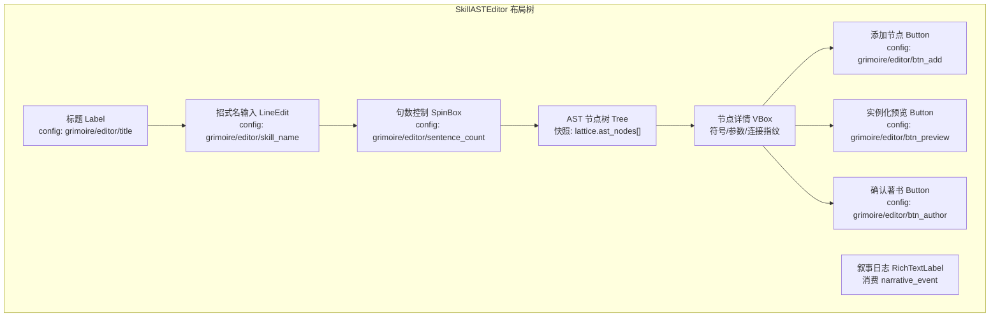
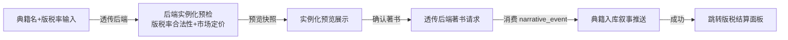
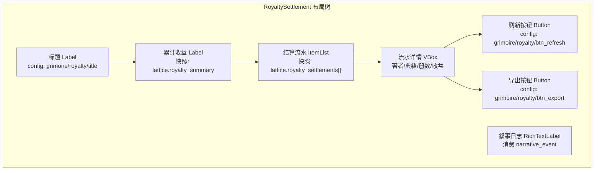
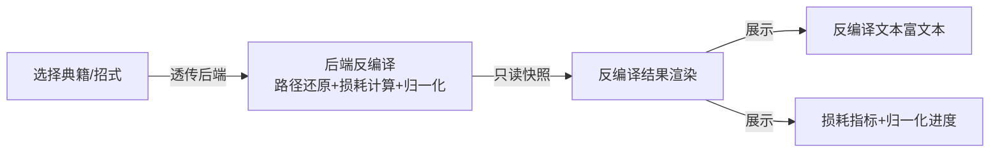

# 前端架构需求表13（第十三卷：魔典与著书系统）

> \[!NOTE]
> **【全局架构声明】**：本篇及全套前端技术文档中所提及的所有具体界面文案、按钮标签、配色令牌与演示数据，**均属基础演示示例（Illustrative Examples Only），绝非底层硬编码或静态写死结构**。前端表现层仅定义**事件流消费契约、视图-事件映射表、Theme 令牌层与组件可复用基座**，全部用户可见文案由 `config/frontend/ui.json` 与 `config/narratives/lattice.json`、`config/narratives/narrative_orchestration.json` 驱动。

***

## 一、 系统架构总览与视图模型划分 (Frontend Domain Overview)

### 1.1 架构设计理念：魔典著书表现宿主 (Grimoire Authorship Presentation Host)

本前端系统以**招式 AST（抽象语法树）编辑与典籍著书立说**为运行底座，前端视图只消费 `EventBus` 的 `narrative_event_emitted` 信号，以及 `GameConfig` 的只读配置查询，不持有任何 AST 求解、反编译路径还原或版税结算逻辑（全部由后端第十三卷 lattice_skill_book 与第三十五卷 narrative_orchestration 领域负责）。

* **表现层绝对解耦**：前端只负责「输入采集 → 透传后端 → 渲染反馈结果」，不做任何 AST 节点合法性校验、反编译损耗计算或版税率推导；
* **AST 可视化只读渲染**：招式编辑器的 AST 节点树由后端 `lattice_skill_book` 领域返回只读快照驱动，前端只展示节点结构与连接关系，不执行任何语法解析；
* **配置驱动文案**：全部典籍分类名、招式名模板、版税结算文案来自 `config/frontend/ui.json` 与 `config/narratives/lattice.json`，著书叙事推送文案来自 `config/narratives/narrative_orchestration.json`。

### 1.2 魔典著书流程状态视图 (Grimoire Authorship Flow Views)



### 1.3 核心子视图与事件映射 (View-Event Mapping)



***

## 二、 魔典书库界面 (Grimoire Library)

### 2.1 视图职责与布局

魔典书库是魔典与著书系统的总入口，负责展示后端 `lattice_skill_book` 领域下发的藏经阁典籍只读快照。前端只渲染典籍分类列表与元数据，不查询招式 AST 内容。

| 区域     | 节点类型         | 内容来源                                                | 说明                   |
| :------- | :--------------- | :------------------------------------------------------ | :--------------------- |
| 标题     | Label            | `config/frontend/ui.json` → `grimoire/library/title`    | 「藏经阁典籍库」        |
| 分类筛选 | OptionButton     | `config/frontend/ui.json` → `grimoire/library/category` | 如 MANUSCRIPT_GRIMOIRE |
| 典籍列表 | ItemList         | `lattice.manuscripts[]` 只读快照                        | 每项显示典籍名与著者    |
| 典籍详情 | Label × N        | 快照字段                                                | 指纹/版税率/流通册数    |
| 浏览按钮 | Button           | `config/frontend/ui.json` → `grimoire/library/btn_open` | 选中后打开典籍手稿      |
| 著书入口 | Button           | `config/frontend/ui.json` → `grimoire/library/btn_new`  | 跳转招式编辑器          |
| 叙事日志 | RichTextLabel    | `narrative_event_emitted` 推流                          | 著书入库实时推送渲染    |

### 2.2 典籍列表布局树



### 2.3 输入采集与后端透传契约

前端只采集分类筛选条件、选中典籍 ID，透传后端 `lattice_skill_book` 领域，**不做任何典籍排序或权限判定**：

```typescript
// 前端典籍浏览请求 DTO（透传后端 lattice_skill_book 领域，前端不做校验）
interface ManuscriptBrowseRequestDTO {
  category?: string;          // 分类筛选原样透传，如 "MANUSCRIPT_GRIMOIRE"
  authorId?: string;          // 著者筛选原样透传
  sortBy?: string;            // 排序偏好原样透传，后端决定排序逻辑
}

// 后端返回的典籍列表结果（前端只渲染，不判定）
interface ManuscriptListResultDTO {
  manuscripts: ManuscriptSnapshot[];  // 只读快照，前端展示用
  totalCount: number;
}

interface ManuscriptSnapshot {
  manuscriptId: string;       // 典籍唯一 ID，前缀 MANUSCRIPT_
  displayName: string;       // 展示名，前缀【著书】
  authorName: string;        // 著者名
  signature: string;         // AST 指纹，前缀 AST:
  royaltyPercent: number;    // 版税率，如 0.15
  circulationCount: number;  // 流通册数
  marketBasePrice: number;   // 市场基础价
  category: string;          // 典籍分类
}
```

### 2.4 典籍入库叙事事件消费契约

```gdscript
## 魔典书库只监听叙事事件，渲染典籍入库与版税结算推送
func _ready() -> void:
    EventBus.get_instance().narrative_event_emitted.connect(_on_narrative_event)

func _on_narrative_event(packet: Dictionary) -> void:
    var cat = packet.get("category", "")
    var txt = packet.get("text", "")
    # 典籍入库叙事推流 → 富文本渲染
    # 配色读 event_categories.json 的 grimoire 分类
    var color := EventBus.get_category_color("grimoire")
    log_rich.append_text("[color=%s]%s[/color]\n" % [color, txt])
```

***

## 三、 招式编辑器界面 (Skill AST Editor)

### 3.1 视图职责与布局

招式编辑器负责自创招式的 AST（抽象语法树）可视化编排。前端只展示后端 `lattice_skill_book` 领域返回的 AST 节点结构与连接快照，**不做任何语法解析、节点合法性校验或路径还原计算**（全部由后端负责）。

| 区域       | 节点类型          | 内容来源                                                  | 说明                     |
| :--------- | :---------------- | :-------------------------------------------------------- | :----------------------- |
| 标题       | Label             | `config/frontend/ui.json` → `grimoire/editor/title`      | 「招式 AST 编辑器」      |
| 招式名输入 | LineEdit          | `config/frontend/ui.json` → `grimoire/editor/skill_name`  | 透传后端，默认值读配置表  |
| 句数控制   | SpinBox           | `config/frontend/ui.json` → `grimoire/editor/sentence_count` | 透传后端 AST 句数 |
| AST 节点树 | Tree              | `lattice.ast_nodes[]` 只读快照                            | 展示节点类型与连接关系   |
| 节点详情   | Label × N         | 快照字段                                                  | 节点符号/参数/连接指纹   |
| 添加节点   | Button            | `config/frontend/ui.json` → `grimoire/editor/btn_add`     | 透传后端新增节点请求      |
| 实例化预览 | Button            | `config/frontend/ui.json` → `grimoire/editor/btn_preview` | 透传后端实例化预览        |
| 确认著书   | Button            | `config/frontend/ui.json` → `grimoire/editor/btn_author` | 跳转录书立说界面          |
| 叙事日志   | RichTextLabel     | `narrative_event_emitted` 推流                            | AST 操作反馈推送渲染      |

### 3.2 AST 节点树布局



### 3.3 输入采集与后端透传契约

前端只采集招式名、句数、节点编排意图，透传后端 `lattice_skill_book` 领域，**不做任何 AST 合法性或路径损耗计算**：

```typescript
// 前端招式编辑请求 DTO（透传后端 lattice_skill_book 领域，前端不做校验）
interface SkillEditRequestDTO {
  skillName: string;           // 招式名原样透传
  sentenceCount: number;       // AST 句数原样透传
  nodeOps: ASTNodeOp[];        // 节点操作意图原样透传
}

interface ASTNodeOp {
  opType: 'add' | 'remove' | 'connect';  // 操作类型
  nodeId?: string;             // 目标节点 ID
  symbol?: string;             // 节点符号，如 STAB/FLAME
  params?: Record<string, number>; // 节点参数原样透传
  connectToId?: string;        // 连接目标节点 ID
}

// 后端返回的 AST 快照（前端只渲染，不判定）
interface ASTSnapshotDTO {
  astSignature: string;        // AST 指纹，前缀 AST:
  nodes: ASTNodeSnapshot[];
  isValid: boolean;            // 后端判定结果，前端只展示
  decompilePreview?: string;   // 后端反编译预览文本
}

interface ASTNodeSnapshot {
  nodeId: string;
  symbol: string;              // 节点符号
  params: Record<string, number>;
  connectedNodeIds: string[];
}
```

### 3.4 AST 操作反馈事件消费契约

```gdscript
## 招式编辑器只监听叙事事件，渲染 AST 操作反馈推送
func _ready() -> void:
    EventBus.get_instance().narrative_event_emitted.connect(_on_narrative_event)

func _on_narrative_event(packet: Dictionary) -> void:
    var cat = packet.get("category", "")
    var txt = packet.get("text", "")
    # AST 操作反馈叙事推流 → 富文本渲染
    # 配色读 event_categories.json 的 grimoire 分类
    var color := EventBus.get_category_color("grimoire")
    log_rich.append_text("[color=%s]%s[/color]\n" % [color, txt])
```

***

## 四、 著书立说界面 (Author Manuscript)

### 4.1 视图职责与布局

著书立说界面负责将编辑完成的自创招式实例化为典籍手稿并设定版税率。前端只采集典籍名、版税率等输入，透传后端 `lattice_skill_book` 领域，**不做任何版税率推导、实例化预检或市场定价计算**。

| 区域         | 节点类型      | 内容来源                                                       | 说明                       |
| :----------- | :------------ | :------------------------------------------------------------- | :------------------------- |
| 标题         | Label         | `config/frontend/ui.json` → `grimoire/author/title`           | 「著书立说」               |
| 典籍名输入   | LineEdit      | `config/frontend/ui.json` → `grimoire/author/manuscript_name` | 透传后端，默认值读配置表    |
| 版税率滑块   | HSlider       | `config/frontend/ui.json` → `grimoire/author/royalty_range`   | 透传后端版税率              |
| 版税率显示   | Label         | 代码驱动百分比                                                 | 实时显示当前版税率          |
| 市场基础价   | Label         | `lattice.manuscript_defaults.market_base_price` 只读           | 后端计算结果展示            |
| 实例化预览   | RichTextLabel | `lattice.instantiation_preview` 只读快照                       | 后端实例化预览渲染          |
| 确认著书按钮 | Button        | `config/frontend/ui.json` → `grimoire/author/btn_submit`      | 透传后端著书请求            |
| 取消按钮     | Button        | `config/frontend/ui.json` → `grimoire/author/btn_cancel`      | 返回招式编辑器              |
| 叙事日志    | RichTextLabel | `narrative_event_emitted` 推流                                 | 著书入库推送渲染            |

### 4.2 著书流程视图



### 4.3 输入采集与后端透传契约

```typescript
// 前端著书请求 DTO（透传后端 lattice_skill_book 领域，前端不做校验）
interface AuthorManuscriptRequestDTO {
  astSignature: string;        // AST 指纹原样透传
  manuscriptName: string;      // 典籍名原样透传
  royaltyPercent: number;      // 版税率原样透传，前端不推导
  category?: string;           // 典籍分类原样透传
}

// 后端返回的著书结果（前端只渲染，不判定）
interface AuthorManuscriptResultDTO {
  success: boolean;
  errorCode?: string;         // 错误码 → narratives/lattice.json 查文案
  manuscriptSnapshot?: {       // 只读快照，前端展示用
    manuscriptId: string;
    displayName: string;      // 前缀【著书】
    signature: string;         // AST 指纹
    royaltyPercent: number;
    marketBasePrice: number;
    circulationCount: number;
  };
}
```

### 4.4 著书入库叙事事件消费契约

```gdscript
## 著书立说界面消费叙事事件，渲染典籍入库推送
## 文案来自 narratives/lattice.json 的 book_published 模板
func _ready() -> void:
    EventBus.get_instance().narrative_event_emitted.connect(_on_narrative_event)

func _on_narrative_event(packet: Dictionary) -> void:
    var cat = packet.get("category", "")
    var txt = packet.get("text", "")
    # 典籍入库叙事推流 → 富文本渲染
    # 配色读 event_categories.json 的 grimoire 分类
    var color := EventBus.get_category_color("grimoire")
    log_rich.append_text("[color=%s]%s[/color]\n" % [color, txt])
```

***

## 五、 版税结算与收益面板 (Royalty Settlement)

### 5.1 视图职责与布局

版税结算面板负责展示后端 `lattice_skill_book` 领域下发的版税结算只读快照。前端只渲染结算流水与累计收益，**不做任何版税计算、结算触发或分润推导**。

| 区域       | 节点类型       | 内容来源                                                     | 说明                     |
| :--------- | :------------- | :----------------------------------------------------------- | :----------------------- |
| 标题       | Label          | `config/frontend/ui.json` → `grimoire/royalty/title`        | 「版税结算与收益」       |
| 累计收益   | Label          | `lattice.royalty_summary` 只读快照                           | 后端统计的累计铜币收益    |
| 结算流水   | ItemList       | `lattice.royalty_settlements[]` 只读快照                     | 每条显示典籍/册数/收益    |
| 流水详情   | Label × N      | 快照字段                                                     | 著者/典籍名/销售册数     |
| 刷新按钮   | Button         | `config/frontend/ui.json` → `grimoire/royalty/btn_refresh`   | 透传后端刷新请求          |
| 导出按钮   | Button         | `config/frontend/ui.json` → `grimoire/royalty/btn_export`   | 透传后端导出请求          |
| 叙事日志   | RichTextLabel  | `narrative_event_emitted` 推流                               | 版税结算实时推送渲染      |

### 5.2 版税结算流水布局



### 5.3 输入采集与后端透传契约

```typescript
// 前端版税结算查询 DTO（透传后端 lattice_skill_book 领域，前端不做校验）
interface RoyaltySettlementQueryDTO {
  authorId?: string;           // 著者筛选原样透传
  manuscriptId?: string;       // 典籍筛选原样透传
  dateRange?: { from: number; to: number };  // 日期范围原样透传
}

// 后端返回的版税结算结果（前端只渲染，不判定）
interface RoyaltySettlementResultDTO {
  summary: {
    totalCopperCoins: number;    // 累计铜币收益
    totalManuscripts: number;     // 涉及典籍数
    totalCopies: number;          // 累计销售册数
  };
  settlements: RoyaltySettlementSnapshot[];
}

interface RoyaltySettlementSnapshot {
  settlementId: string;
  manuscriptId: string;
  manuscriptName: string;
  authorName: string;
  copiesSold: number;
  copperCoins: number;
  settledAt: number;
}
```

### 5.4 版税结算叙事事件消费契约

```gdscript
## 版税结算面板消费叙事事件，渲染结算推送
## 文案来自 narratives/lattice.json 的 royalties_settled 模板
func _ready() -> void:
    EventBus.get_instance().narrative_event_emitted.connect(_on_narrative_event)

func _on_narrative_event(packet: Dictionary) -> void:
    var cat = packet.get("category", "")
    var txt = packet.get("text", "")
    # 版税结算叙事推流 → 富文本渲染
    # 配色读 event_categories.json 的 grimoire 分类
    var color := EventBus.get_category_color("grimoire")
    log_rich.append_text("[color=%s]%s[/color]\n" % [color, txt])
```

***

## 六、 招式反编译展示界面 (Skill Decompile View)

### 6.1 视图职责与布局

招式反编译展示界面负责展示后端 `lattice_skill_book` 领域下发的反编译只读快照。前端只渲染反编译后的招式描述文本与损耗指标，**不做任何路径还原、损耗计算或学习者归一化**（全部由后端 `lattice_skill_book` 领域的 `decompiler` 模块负责）。

| 区域         | 节点类型       | 内容来源                                                     | 说明                       |
| :----------- | :------------- | :----------------------------------------------------------- | :------------------------- |
| 标题         | Label          | `config/frontend/ui.json` → `grimoire/decompile/title`     | 「招式反编译展示」         |
| 原典指纹     | Label          | `lattice.decompile_result.ast_signature` 只读               | 反编译源 AST 指纹          |
| 反编译招式名 | Label          | `lattice.decompile_result.skill_name` 只读                 | 后端还原的招式名           |
| 句数显示     | Label          | `lattice.decompile_result.sentence_count` 只读             | 反编译句数                 |
| 损耗指标     | Label × N      | `lattice.decompiler` 配置只读                                | 路径缩减率/损耗系数/归一化 |
| 反编译文本   | RichTextLabel  | `lattice.decompile_result.text` 只读快照                    | 后端反编译描述富文本渲染    |
| 学习者归一化 | ProgressBar    | `lattice.decompile_result.learner_score` 只读               | 后端归一化得分进度条       |
| 返回按钮     | Button         | `config/frontend/ui.json` → `grimoire/decompile/btn_back`  | 返回魔典书库               |
| 叙事日志     | RichTextLabel  | `narrative_event_emitted` 推流                               | 反编译反馈推送渲染         |

### 6.2 反编译流程视图



### 6.3 输入采集与后端透传契约

```typescript
// 前端反编译请求 DTO（透传后端 lattice_skill_book 领域，前端不做校验）
interface SkillDecompileRequestDTO {
  astSignature: string;        // 待反编译 AST 指纹原样透传
  manuscriptId?: string;       // 典籍 ID 原样透传
}

// 后端返回的反编译结果（前端只渲染，不判定）
interface SkillDecompileResultDTO {
  success: boolean;
  errorCode?: string;          // 错误码 → narratives/lattice.json 查文案
  decompileResult?: {
    astSignature: string;      // 源 AST 指纹
    skillName: string;         // 反编译招式名
    sentenceCount: number;     // 反编译句数
    text: string;              // 反编译描述文本（bbcode 富文本）
    learnerScore: number;      // 学习者归一化得分（0~100）
    pathReduction: number;     // 路径缩减率（后端配置驱动）
    lossCoefficient: number;   // 损耗系数（后端配置驱动）
  };
}
```

### 6.4 反编译反馈事件消费契约

```gdscript
## 招式反编译展示界面消费叙事事件，渲染反编译反馈推送
func _ready() -> void:
    EventBus.get_instance().narrative_event_emitted.connect(_on_narrative_event)

func _on_narrative_event(packet: Dictionary) -> void:
    var cat = packet.get("category", "")
    var txt = packet.get("text", "")
    # 反编译反馈叙事推流 → 富文本渲染
    # 配色读 event_categories.json 的 grimoire 分类
    var color := EventBus.get_category_color("grimoire")
    log_rich.append_text("[color=%s]%s[/color]\n" % [color, txt])
```

***

## 七、 Theme 令牌与配色规范 (Theme Tokens)

魔典与著书系统的全部配色由 Theme 令牌层统一管理，与 `event_categories.json` 对齐：

| UI 元素   | 配色来源                                 | 令牌          | 兜底默认值                        |
| :-------- | :--------------------------------------- | :------------ | :-------------------------------- |
| 页面背景  | Theme                                   | `--bg`        | `Color(0.06, 0.08, 0.12, 1)`      |
| 主标题文字 | Theme                                  | `--title`     | `Color(0.38, 0.75, 0.98, 1)`      |
| 普通正文  | Theme                                   | `--text`      | `Color(0.88, 0.91, 0.95, 1)`      |
| 错误提示  | Theme                                   | `--danger`    | `Color(0.97, 0.53, 0.53, 1)`       |
| 成功提示  | Theme                                   | `--success`   | `Color(0.20, 0.83, 0.60, 1)`      |
| 魔典事件  | `event_categories.json` → `grimoire`    | `#c084fc`     | —                                 |
| 默认事件  | `event_categories.json` → `_default`     | `#94a3b8`     | —                                 |

***

## 八、 验收矩阵 (DoD Matrix)

| 验收项        | 验收标准                                           | 验证方式                                                 |
| :------------ | :------------------------------------------------- | :------------------------------------------------------- |
| 书库可达      | 从主界面可进入魔典书库，典籍列表正常渲染            | `godot` 启动观察                                         |
| AST 编辑器可用 | 招式编辑器可展示 AST 节点树，操作反馈正常推送      | 手动走查 + `narrative_event_emitted` 信号断言            |
| 著书流程闭环  | 编辑→预览→著书→入库推送→版税结算 全链路可走通        | 手动走查                                                 |
| 反编译展示    | 选择典籍后反编译结果正确渲染，损耗指标来自配置表    | 删配置表键值后验证兜底                                   |
| 文案零硬编码  | 所有按钮/标题/占位文案均来自配置表                  | `rg "著书" frontend/` 仅命中配置读取                     |
| 配色配置驱动  | 删除 `event_categories.json` 的 `grimoire` 分类后回退默认色 | 配置表删键后验证                                         |
| 零逻辑纪律   | 前端代码无 AST 求解/反编译/版税计算调用             | `rg "decompiler\|path_reduction\|royalty_percent" frontend/` 无命中 |
| 视图可切换    | 书库↔编辑器↔著书↔结算↔反编译 均可导航              | 手动走查                                                 |
