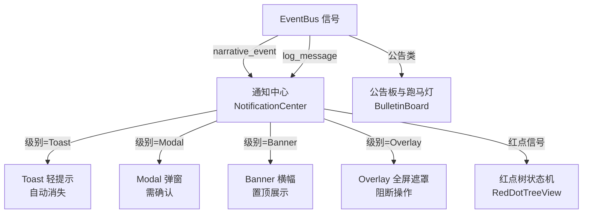
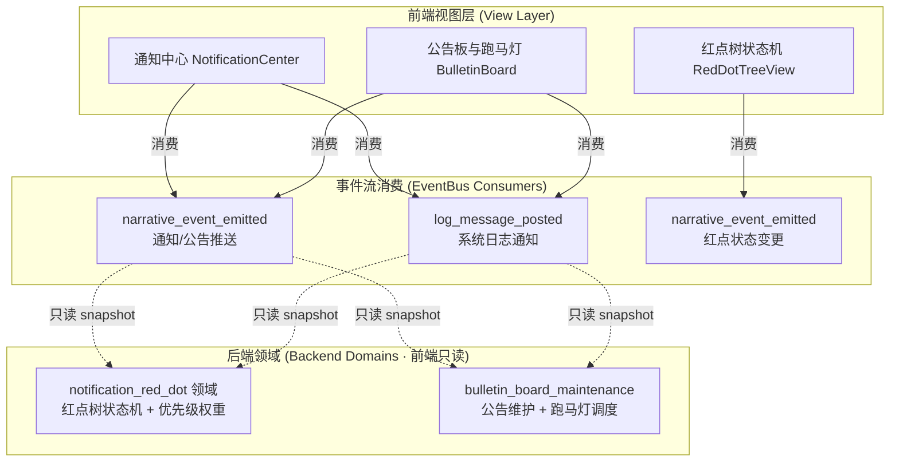
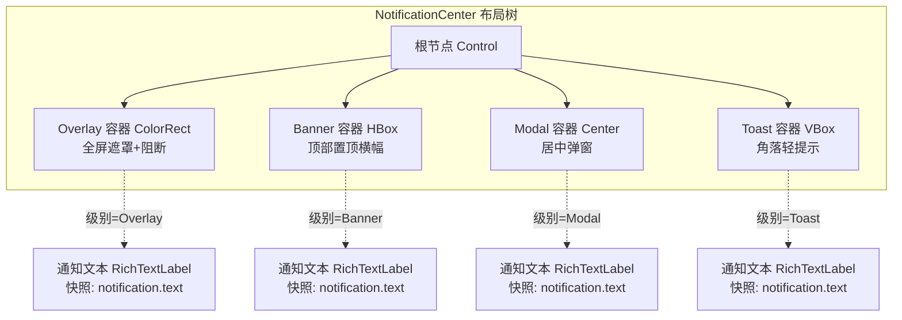
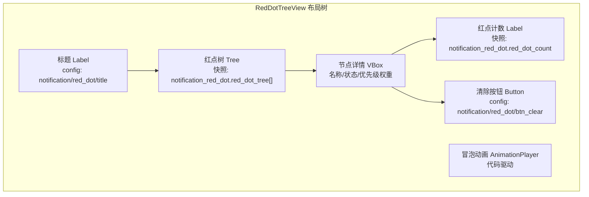
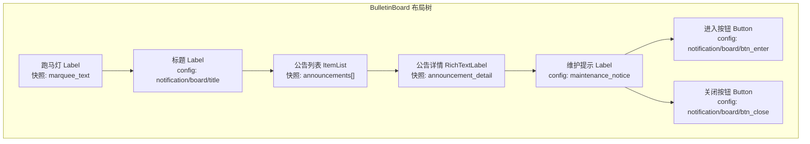

# 前端架构需求表14（第十四卷：通知与公告系统）

> \[!NOTE]
> **【全局架构声明】**：本篇及全套前端技术文档中所提及的所有具体界面文案、按钮标签、配色令牌与演示数据，**均属基础演示示例（Illustrative Examples Only），绝非底层硬编码或静态写死结构**。前端表现层仅定义**事件流消费契约、视图-事件映射表、Theme 令牌层与组件可复用基座**，全部用户可见文案由 `config/frontend/ui.json` 与 `config/narratives/notification_red_dot.json`、`config/narratives/bulletin_board_maintenance.json` 驱动。

***

## 一、 系统架构总览与视图模型划分 (Frontend Domain Overview)

### 1.1 架构设计理念：通知公告表现宿主 (Notification Bulletin Presentation Host)

本前端系统以**四级拓扑通知中心与红点树状态机冒泡**为运行底座，前端视图只消费 `EventBus` 的 `narrative_event_emitted` 与 `log_message_posted` 信号，以及 `GameConfig` 的只读配置查询，不持有任何通知优先级计算、红点状态机推进或公告维护调度逻辑（全部由后端第十四卷 notification_red_dot 与第三十五卷 bulletin_board_maintenance 领域负责）。

* **表现层绝对解耦**：前端只负责「事件 → 渲染」映射与只读状态 snapshot 查询，不做任何通知优先级排序、红点状态机推进或公告过期判定；
* **四级拓扑自适应**：Toast/Modal/Banner/Overlay 四级拓扑由后端下发的通知级别驱动，前端只按级别渲染对应组件，不做级别判定；
* **配置驱动文案**：全部通知文案模板、公告维护提示、红点标签来自 `config/frontend/ui.json` 与 `config/narratives/notification_red_dot.json`、`config/narratives/bulletin_board_maintenance.json`。

### 1.2 通知公告流程状态视图 (Notification Bulletin Flow Views)



### 1.3 核心子视图与事件映射 (View-Event Mapping)



***

## 二、 通知中心界面 (Notification Center)

### 2.1 视图职责与布局

通知中心是全局通知的总出口，负责按后端下发的通知级别渲染四级拓扑（Toast/Modal/Banner/Overlay）。前端只按级别渲染对应组件，**不做任何级别判定、优先级排序或自动消失计时**（计时由后端 `notification_red_dot` 领域的 `auto_dismiss_seconds` 配置驱动，前端只读配置表倒计时）。

| 区域         | 节点类型       | 内容来源                                                      | 说明                         |
| :----------- | :------------- | :------------------------------------------------------------ | :--------------------------- |
| Toast 容器   | VBoxContainer  | `narrative_event_emitted` / `log_message_posted` 推流        | 屏幕角落轻提示，自动消失     |
| Modal 容器   | CenterContainer | `narrative_event_emitted` / `log_message_posted` 推流        | 屏幕居中弹窗，需确认         |
| Banner 容器  | HBoxContainer  | `narrative_event_emitted` / `log_message_posted` 推流        | 顶部置顶横幅                 |
| Overlay 容器 | ColorRect       | `narrative_event_emitted` / `log_message_posted` 推流        | 全屏遮罩，阻断操作           |
| 通知文本     | RichTextLabel  | `notification.text` 只读快照                                  | 分类配色富文本渲染           |
| 确认按钮     | Button         | `config/frontend/ui.json` → `notification/btn_confirm`       | Modal/Overlay 确认透传后端    |
| 忽略按钮     | Button         | `config/frontend/ui.json` → `notification/btn_dismiss`        | Toast/Banner 手动忽略        |
| 自动消失计时 | Timer           | `notification_red_dot.defaults.auto_dismiss_seconds` 只读配置 | 前端只读配置表倒计时         |

### 2.2 四级拓扑布局树



### 2.3 输入采集与后端透传契约

前端只采集确认/忽略操作意图，透传后端 `notification_red_dot` 领域，**不做任何通知级别判定或优先级排序**：

```typescript
// 后端下发的通知快照（前端只渲染，不判定级别）
interface NotificationSnapshotDTO {
  notificationId: string;
  level: 'toast' | 'modal' | 'banner' | 'overlay';  // 后端判定级别，前端只渲染
  category: string;           // 事件分类，映射配色
  text: string;               // 通知文本（bbcode 富文本）
  autoDismissSeconds?: number; // 自动消失秒数（后端配置驱动）
  requireConfirm?: boolean;    // 是否需确认（后端判定）
  priorityWeight: number;      // 优先级权重（后端计算）
}

// 前端通知操作请求 DTO（透传后端，前端不做校验）
interface NotificationActionRequestDTO {
  notificationId: string;     // 通知 ID 原样透传
  action: 'confirm' | 'dismiss';  // 操作意图原样透传
}
```

### 2.4 通知事件消费契约

```gdscript
## 通知中心消费叙事事件与日志事件，按级别渲染四级拓扑
func _ready() -> void:
    var bus := EventBus.get_instance()
    bus.narrative_event_emitted.connect(_on_notification_event)
    bus.log_message_posted.connect(_on_log_message)

func _on_notification_event(packet: Dictionary) -> void:
    _render_notification(packet.get("level", "toast"), packet)

func _on_log_message(level: String, message: String) -> void:
    # 日志事件按级别映射为通知（后端决定映射关系，前端只渲染）
    var packet := {"level": "toast", "category": "system", "text": message}
    _render_notification("toast", packet)

func _render_notification(level: String, packet: Dictionary) -> void:
    var txt = packet.get("text", "")
    # 配色读 event_categories.json 对应分类
    var cat = packet.get("category", "_default")
    var color := EventBus.get_category_color(cat)
    var rich_text := "[color=%s]%s[/color]" % [color, txt]
    match level:
        "toast":   _show_toast(rich_text)
        "modal":   _show_modal(rich_text)
        "banner":  _show_banner(rich_text)
        "overlay": _show_overlay(rich_text)

func _show_toast(text: String) -> void:
    # 自动消失计时读配置表，前端只读不判定
    var seconds := GameConfig.get_float(
        "domains.notification_red_dot", "defaults/auto_dismiss_seconds", 3.0
    )
    toast_label.text = text
    toast_timer.wait_time = seconds
    toast_timer.start()
```

***

## 三、 红点树状态机冒泡展示界面 (Red-Dot Tree View)

### 3.1 视图职责与布局

红点树展示界面负责渲染后端 `notification_red_dot` 领域下发的红点状态机只读快照。前端只展示红点节点的层级树与冒泡状态，**不做任何红点状态机推进、冒泡计算或优先级权重判定**（全部由后端负责）。

| 区域       | 节点类型      | 内容来源                                                   | 说明                         |
| :--------- | :------------ | :--------------------------------------------------------- | :--------------------------- |
| 标题       | Label         | `config/frontend/ui.json` → `notification/red_dot/title` | 「红点状态树」               |
| 红点树     | Tree          | `notification_red_dot.red_dot_tree[]` 只读快照            | 层级树展示红点冒泡状态       |
| 节点详情   | Label × N     | 快照字段                                                   | 节点名/状态/优先级权重       |
| 红点计数   | Label         | `notification_red_dot.red_dot_count` 只读                  | 当前未读红点总数             |
| 清除按钮   | Button        | `config/frontend/ui.json` → `notification/red_dot/btn_clear` | 透传后端清除红点请求        |
| 冒泡动画   | AnimationPlayer | 代码驱动                                                  | 红点冒泡时播放闪烁动画       |

### 3.2 红点树冒泡布局



### 3.3 输入采集与后端透传契约

```typescript
// 后端下发的红点树快照（前端只渲染，不判定状态机）
interface RedDotTreeSnapshotDTO {
  nodes: RedDotNodeSnapshot[];
  totalRedDotCount: number;    // 总红点数
}

interface RedDotNodeSnapshot {
  nodeId: string;              // 红点节点 ID
  nodeName: string;            // 节点展示名
  parentId?: string;           // 父节点 ID
  state: 'active' | 'inactive';  // 红点状态（后端状态机推进）
  count: number;               // 未读计数
  priorityWeight: number;      // 优先级权重（后端计算）
  bubbling: boolean;           // 是否正在冒泡（后端判定）
}

// 前端红点清除请求 DTO（透传后端，前端不做校验）
interface RedDotClearRequestDTO {
  nodeId?: string;             // 指定节点清除，空则清除全部
}
```

### 3.4 红点状态变更事件消费契约

```gdscript
## 红点树展示界面消费叙事事件，渲染红点状态机冒泡
func _ready() -> void:
    EventBus.get_instance().narrative_event_emitted.connect(_on_narrative_event)

func _on_narrative_event(packet: Dictionary) -> void:
    var cat = packet.get("category", "")
    # 红点状态变更推流 → 重新渲染红点树
    # 前端只读快照，不推进状态机
    if cat == EventBus.get_category_name("system"):
        _refresh_red_dot_tree()
```

***

## 四、 公告板与跑马灯界面 (Bulletin Board & Marquee)

### 4.1 视图职责与布局

公告板界面负责展示后端 `bulletin_board_maintenance` 领域下发的公告只读快照与跑马灯滚动文本。前端只渲染公告内容与维护提示，**不做任何公告过期判定、维护调度或跑马灯排序**。

| 区域       | 节点类型       | 内容来源                                                          | 说明                       |
| :--------- | :------------- | :---------------------------------------------------------------- | :------------------------- |
| 标题       | Label          | `config/frontend/ui.json` → `notification/board/title`           | 「公告板」                 |
| 公告列表   | ItemList       | `bulletin_board_maintenance.announcements[]` 只读快照             | 每项显示公告标题与时间     |
| 公告详情   | RichTextLabel  | `bulletin_board_maintenance.announcement_detail` 只读           | 公告正文富文本渲染         |
| 跑马灯     | Label          | `bulletin_board_maintenance.marquee_text` 只读                   | 滚动展示公告摘要           |
| 维护提示   | Label          | `narratives.bulletin_board_maintenance.maintenance_notice` 只读   | 维护状态文案               |
| 进入按钮   | Button         | `config/frontend/ui.json` → `notification/board/btn_enter`       | 维护结束后进入世界透传     |
| 关闭按钮   | Button         | `config/frontend/ui.json` → `notification/board/btn_close`       | 关闭公告板                 |

### 4.2 公告板布局树



### 4.3 输入采集与后端透传契约

```typescript
// 后端下发的公告快照（前端只渲染，不判定过期/维护）
interface BulletinBoardSnapshotDTO {
  announcements: AnnouncementSnapshot[];
  marqueeText: string;         // 跑马灯滚动文本
  maintenanceStatus: 'normal' | 'maintenance';  // 后端判定状态
  remainingMinutes?: number;   // 维护剩余分钟（后端计算）
  entryAllowed: boolean;       // 是否允许进入（后端判定）
}

interface AnnouncementSnapshot {
  announcementId: string;
  title: string;
  body: string;                // 公告正文（bbcode 富文本）
  publishedAt: number;
  priority: number;             // 优先级（后端计算）
}

// 前端公告操作请求 DTO（透传后端，前端不做校验）
interface BulletinActionRequestDTO {
  announcementId?: string;     // 选中公告 ID 原样透传
  action: 'read' | 'enter';    // 操作意图原样透传
}
```

### 4.4 公告维护事件消费契约

```gdscript
## 公告板消费叙事事件与日志事件，渲染公告推送与维护状态
func _ready() -> void:
    var bus := EventBus.get_instance()
    bus.narrative_event_emitted.connect(_on_narrative_event)
    bus.log_message_posted.connect(_on_log_message)

func _on_narrative_event(packet: Dictionary) -> void:
    var cat = packet.get("category", "")
    var txt = packet.get("text", "")
    # 公告推送叙事 → 富文本渲染
    # 配色读 event_categories.json 的 system 分类
    var color := EventBus.get_category_color("system")
    detail_rich.append_text("[color=%s]%s[/color]\n" % [color, txt])

func _on_log_message(level: String, message: String) -> void:
    # 系统日志（如维护状态变更）→ 跑马灯展示
    # 文案来自 narratives/bulletin_board_maintenance.json
    var notice := GameConfig.get_string(
        "narratives.bulletin_board_maintenance", "maintenance_notice",
        "服务器正在进行例行维护，请稍后重试。"
    )
    marquee_label.text = notice
```

***

## 五、 Theme 令牌与配色规范 (Theme Tokens)

通知与公告系统的全部配色由 Theme 令牌层统一管理，与 `event_categories.json` 对齐：

| UI 元素     | 配色来源                                 | 令牌          | 兜底默认值                        |
| :---------- | :--------------------------------------- | :------------ | :-------------------------------- |
| 页面背景    | Theme                                   | `--bg`        | `Color(0.06, 0.08, 0.12, 1)`      |
| 主标题文字  | Theme                                   | `--title`     | `Color(0.38, 0.75, 0.98, 1)`      |
| 普通正文    | Theme                                   | `--text`      | `Color(0.88, 0.91, 0.95, 1)`      |
| 错误提示    | Theme                                   | `--danger`    | `Color(0.97, 0.53, 0.53, 1)`       |
| 成功提示    | Theme                                   | `--success`   | `Color(0.20, 0.83, 0.60, 1)`      |
| 红点计数    | Theme                                   | `--danger`    | `Color(0.97, 0.53, 0.53, 1)`       |
| 系统通知    | `event_categories.json` → `system`      | `#38bdf8`     | —                                 |
| 默认事件    | `event_categories.json` → `_default`     | `#94a3b8`     | —                                 |

***

## 六、 验收矩阵 (DoD Matrix)

| 验收项        | 验收标准                                                   | 验证方式                                                 |
| :------------ | :--------------------------------------------------------- | :------------------------------------------------------- |
| 四级拓扑可达  | Toast/Modal/Banner/Overlay 四级通知均能按级别渲染          | 手动触发各级别信号观察                                   |
| 红点树冒泡    | 红点状态机变更后红点树正确刷新，冒泡动画播放                | `narrative_event_emitted` 信号断言 + 手动走查            |
| 公告板可用    | 公告列表与跑马灯正常渲染，维护提示文案来自配置表            | 删配置表键值后验证兜底                                   |
| 文案零硬编码  | 所有通知/公告/维护文案均来自配置表                          | `rg "维护" frontend/` 仅命中配置读取                     |
| 自动消失计时  | Toast 自动消失秒数来自 `notification_red_dot` 配置表        | 配置表改值后验证倒计时变化                               |
| 配色配置驱动  | 删除 `event_categories.json` 的 `system` 分类后回退默认色    | 配置表删键后验证                                         |
| 零逻辑纪律   | 前端代码无红点状态机/优先级排序/公告过期判定调用             | `rg "priority_weight\|bubbling\|FSM" frontend/` 无命中     |
| 视图可切换    | 通知中心↔红点树↔公告板 均可导航                              | 手动走查                                                 |
