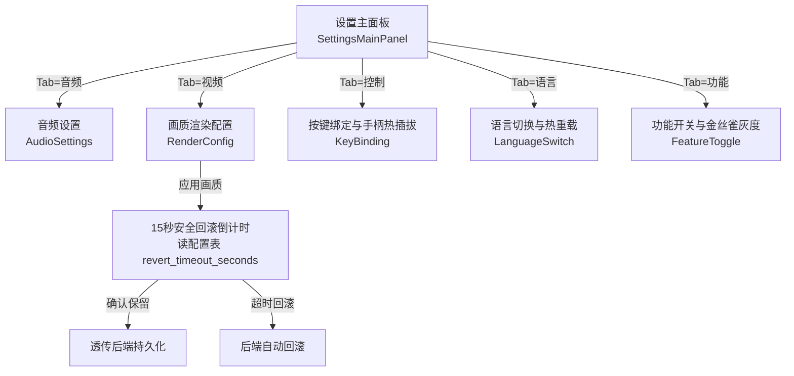
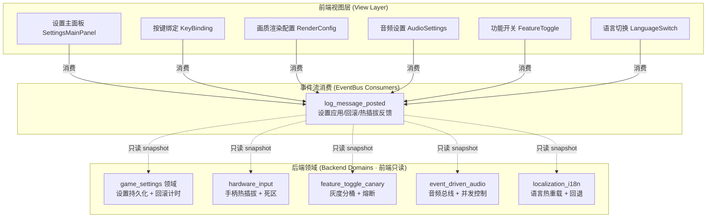
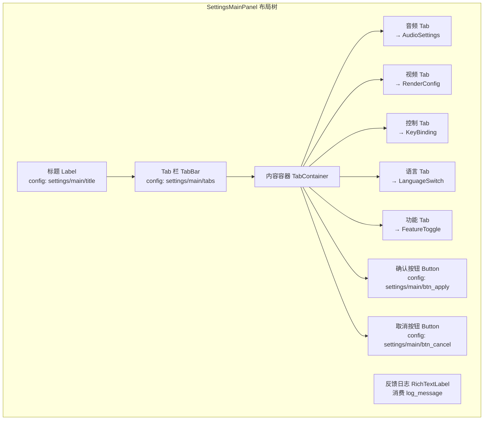
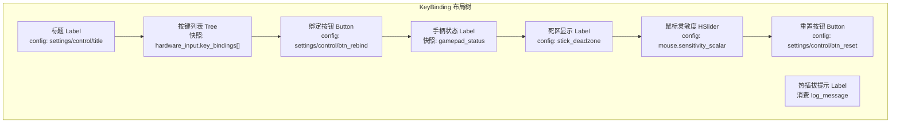
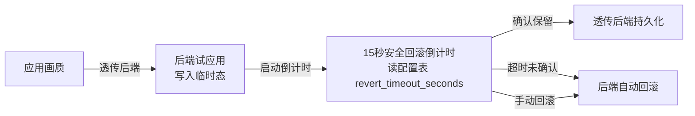
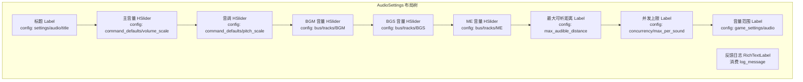
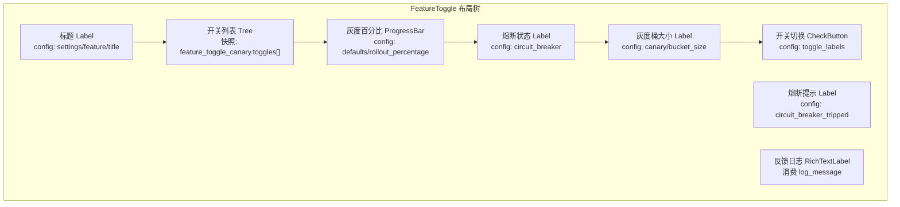
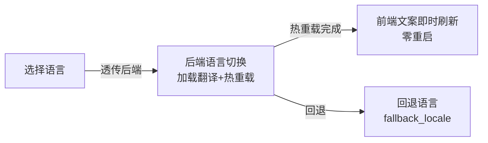

# 前端架构需求表15（第十五卷：设置中心系统）

> \[!NOTE]
> **【全局架构声明】**：本篇及全套前端技术文档中所提及的所有具体界面文案、按钮标签、配色令牌与演示数据，**均属基础演示示例（Illustrative Examples Only），绝非底层硬编码或静态写死结构**。前端表现层仅定义**事件流消费契约、视图-事件映射表、Theme 令牌层与组件可复用基座**，全部用户可见文案由 `config/frontend/ui.json` 与 `config/narratives/game_settings.json`、`config/narratives/feature_toggle_canary.json` 等驱动。

***

## 一、 系统架构总览与视图模型划分 (Frontend Domain Overview)

### 1.1 架构设计理念：设置中心表现宿主 (Settings Center Presentation Host)

本前端系统以**音频/视频/控制/语言/功能开关五维设置面板**为运行底座，前端视图只消费 `EventBus` 的 `log_message_posted` 信号，以及 `GameConfig` 的只读配置查询，不持有任何设置持久化、画质回滚计时、手柄热插拔检测或金丝雀灰度分桶逻辑（全部由后端第十五卷 game_settings、第三十三卷 hardware_input、第三十九卷 feature_toggle_canary、第四十一卷 event_driven_audio 与第四十卷 localization_i18n 领域负责）。

* **表现层绝对解耦**：前端只负责「输入采集 → 透传后端 → 渲染反馈结果」，不做任何设置持久化写入、画质安全回滚计时逻辑或灰度分桶判定；
* **15秒安全回滚只读计时**：画质渲染配置的 15 秒安全回滚倒计时由后端 `game_settings` 领域的 `revert_timeout_seconds` 配置驱动，前端只读配置表倒计时，不持有计时判定逻辑；
* **配置驱动文案**：全部设置项标签、分辨率选项、按键名、语言名来自 `config/frontend/ui.json` 与 `config/narratives/game_settings.json`，灰度熔断文案来自 `config/narratives/feature_toggle_canary.json`。

### 1.2 设置中心流程状态视图 (Settings Center Flow Views)



### 1.3 核心子视图与事件映射 (View-Event Mapping)



***

## 二、 设置主面板界面 (Settings Main Panel)

### 2.1 视图职责与布局

设置主面板是设置中心系统的总入口，负责展示音频/视频/控制/语言/功能五大 Tab。前端只渲染 Tab 框架与切换，**不做任何设置项持久化或偏好判定**。

| 区域     | 节点类型         | 内容来源                                                    | 说明                   |
| :------- | :--------------- | :---------------------------------------------------------- | :--------------------- |
| 标题     | Label            | `config/frontend/ui.json` → `settings/main/title`         | 「设置中心」           |
| Tab 栏   | TabBar           | `config/frontend/ui.json` → `settings/main/tabs`          | 音频/视频/控制/语言/功能 |
| 内容容器 | TabContainer     | 各 Tab 子视图                                               | 切换显示对应设置面板    |
| 确认按钮 | Button           | `config/frontend/ui.json` → `settings/main/btn_apply`     | 透传后端应用所有设置    |
| 取消按钮 | Button           | `config/frontend/ui.json` → `settings/main/btn_cancel`    | 返回上级界面            |
| 反馈日志 | RichTextLabel    | `log_message_posted` 推流                                   | 设置应用反馈推送渲染    |

### 2.2 设置主面板布局树



### 2.3 输入采集与后端透传契约

前端只采集 Tab 切换意图与整体确认/取消，透传后端 `game_settings` 领域，**不做任何设置项合法性或偏好判定**：

```typescript
// 前端设置应用请求 DTO（透传后端 game_settings 领域，前端不做校验）
interface SettingsApplyRequestDTO {
  audio?: AudioSettingsDTO;        // 音频设置原样透传
  video?: VideoSettingsDTO;        // 视频设置原样透传
  control?: ControlSettingsDTO;    // 控制设置原样透传
  language?: string;                // 语言选择原样透传
  features?: FeatureToggleDTO[];   // 功能开关原样透传
}

// 后端返回的设置结果（前端只渲染，不判定）
interface SettingsApplyResultDTO {
  success: boolean;
  appliedSettings?: SettingsSnapshotDTO;  // 只读快照
  requiresRestart?: boolean;               // 是否需重启（后端判定）
}
```

### 2.4 设置应用反馈事件消费契约

```gdscript
## 设置主面板消费日志事件，渲染设置应用反馈
func _ready() -> void:
    EventBus.get_instance().log_message_posted.connect(_on_log_message)

func _on_log_message(level: String, message: String) -> void:
    # 设置应用反馈 → 富文本渲染
    # 配色读 event_categories.json 的 system 分类
    var color := EventBus.get_category_color("system")
    log_rich.append_text("[color=%s]%s[/color]\n" % [color, message])
```

***

## 三、 按键绑定与手柄热插拔自适应界面 (Key Binding)

### 3.1 视图职责与布局

按键绑定界面负责展示后端 `hardware_input` 领域下发的按键映射只读快照与手柄热插拔状态。前端只渲染按键列表与热插拔提示，**不做任何手柄检测、死区计算或按键冲突判定**。

| 区域         | 节点类型       | 内容来源                                                     | 说明                         |
| :----------- | :------------- | :----------------------------------------------------------- | :--------------------------- |
| 标题         | Label          | `config/frontend/ui.json` → `settings/control/title`       | 「按键绑定」                 |
| 按键列表     | Tree           | `hardware_input.key_bindings[]` 只读快照                    | 展示动作名与绑定按键         |
| 绑定按钮     | Button × N     | `config/frontend/ui.json` → `settings/control/btn_rebind`  | 透传后端重绑请求              |
| 手柄状态     | Label          | `hardware_input.gamepad_status` 只读                        | 热插拔状态展示                |
| 死区显示     | Label          | `hardware_input.stick_deadzone` 只读配置                     | 死区内/外值展示               |
| 鼠标灵敏度   | HSlider        | `hardware_input.mouse.sensitivity_scalar` 只读配置           | 透传后端灵敏度调整            |
| 热插拔提示   | Label          | `log_message_posted` 推流                                   | 手柄接入/断开反馈             |
| 重置按钮     | Button         | `config/frontend/ui.json` → `settings/control/btn_reset`   | 透传后端重置默认绑定          |

### 3.2 按键绑定布局树



### 3.3 输入采集与后端透传契约

```typescript
// 前端按键重绑请求 DTO（透传后端 hardware_input 领域，前端不做校验）
interface KeyRebindRequestDTO {
  action: string;             // 动作名原样透传，如 "slash"
  newKey?: string;             // 新按键原样透传（监听输入后透传）
  gamepadButton?: string;       // 手柄按键原样透传
}

// 后端下发的按键映射快照（前端只渲染，不判定冲突）
interface KeyBindingSnapshotDTO {
  bindings: KeyBindingEntry[];
  gamepadStatus: {
    connected: boolean;
    name?: string;
    deadzoneInner: number;     // 死区内值（配置驱动）
    deadzoneOuter: number;     // 死区外值（配置驱动）
  };
  mouseSensitivity: number;    // 鼠标灵敏度（配置驱动）
}

interface KeyBindingEntry {
  action: string;              // 动作名
  primaryKey?: string;          // 主按键
  secondaryKey?: string;        // 备用按键
  gamepadButton?: string;       // 手柄按键
  conflict?: boolean;           // 冲突标记（后端判定）
}
```

### 3.4 手柄热插拔反馈事件消费契约

```gdscript
## 按键绑定界面消费日志事件，渲染手柄热插拔反馈
func _ready() -> void:
    EventBus.get_instance().log_message_posted.connect(_on_log_message)

func _on_log_message(level: String, message: String) -> void:
    # 手柄热插拔反馈 → 富文本渲染
    # 配色读 event_categories.json 的 system 分类
    var color := EventBus.get_category_color("system")
    notice_label.text = "[color=%s]%s[/color]" % [color, message]
```

***

## 四、 画质渲染配置界面 (Render Config)

### 4.1 视图职责与布局

画质渲染配置界面负责展示后端 `game_settings` 领域下发的渲染配置只读快照与 15 秒安全回滚倒计时。前端只读配置表 `revert_timeout_seconds` 做倒计时展示，**不做任何画质判定、回滚触发或分辨率合法性校验**。

| 区域         | 节点类型       | 内容来源                                                     | 说明                           |
| :----------- | :------------- | :----------------------------------------------------------- | :----------------------------- |
| 标题         | Label          | `config/frontend/ui.json` → `settings/video/title`          | 「画质渲染配置」               |
| 分辨率选择   | OptionButton   | `config/frontend/ui.json` → `settings/video/resolutions`   | 透传后端分辨率选择             |
| 画质预设     | OptionButton   | `config/frontend/ui.json` → `settings/video/quality_presets` | 透传后端画质预设               |
| UI 缩放      | HSlider        | `game_settings.ui` 只读配置范围                              | 透传后端 UI 缩放               |
| 渲染参数     | Label × N      | `game_settings.render` 只读配置                               | 默认宽高/最小/回退分辨率展示   |
| 应用按钮     | Button         | `config/frontend/ui.json` → `settings/video/btn_apply`      | 透传后端应用画质               |
| 回滚倒计时   | Label          | `game_settings.apply.revert_timeout_seconds` 只读配置       | 15秒安全回滚倒计时展示         |
| 确认保留按钮 | Button         | `config/frontend/ui.json` → `settings/video/btn_keep`       | 倒计时内确认保留透传后端       |
| 反馈日志     | RichTextLabel  | `log_message_posted` 推流                                    | 画质应用/回滚反馈推送渲染      |

### 4.2 画质安全回滚流程视图



### 4.3 输入采集与后端透传契约

```typescript
// 前端画质应用请求 DTO（透传后端 game_settings 领域，前端不做校验）
interface RenderConfigApplyRequestDTO {
  resolutionWidth: number;     // 分辨率宽原样透传
  resolutionHeight: number;    // 分辨率高原样透传
  qualityPreset?: string;       // 画质预设原样透传
  uiScale?: number;             // UI 缩放原样透传
}

// 后端返回的画质结果（前端只渲染，不判定合法性）
interface RenderConfigResultDTO {
  success: boolean;
  trialActive: boolean;        // 是否处于试应用期（后端判定）
  revertTimeoutSeconds: number; // 回滚超时秒数（配置驱动，前端只读倒计时）
  appliedResolution?: { width: number; height: number };
  fallbackResolution?: { width: number; height: number };  // 回退分辨率
}
```

### 4.4 画质回滚倒计时与反馈事件消费契约

```gdscript
## 画质渲染配置界面消费日志事件，渲染应用/回滚反馈
## 倒计时只读配置表 revert_timeout_seconds，不持有计时判定逻辑
func _ready() -> void:
    EventBus.get_instance().log_message_posted.connect(_on_log_message)

func _start_rollback_countdown() -> void:
    # 倒计时秒数读配置表，前端只读不判定
    var seconds := GameConfig.get_float(
        "domains.game_settings", "apply/revert_timeout_seconds", 15.0
    )
    countdown_label.text = "%.0f" % seconds
    rollback_timer.wait_time = seconds
    rollback_timer.start()

func _on_log_message(level: String, message: String) -> void:
    # 画质应用/回滚反馈 → 富文本渲染
    # 配色读 event_categories.json 的 system 分类
    var color := EventBus.get_category_color("system")
    log_rich.append_text("[color=%s]%s[/color]\n" % [color, message])
```

***

## 五、 音频设置界面 (Audio Settings)

### 5.1 视图职责与布局

音频设置界面负责展示后端 `event_driven_audio` 领域下发的音频总线配置只读快照。前端只渲染音量滑块与总线映射，**不做任何音频并发控制、总线路由或音效触发**。

| 区域       | 节点类型      | 内容来源                                                    | 说明                       |
| :--------- | :------------ | :---------------------------------------------------------- | :------------------------- |
| 标题       | Label         | `config/frontend/ui.json` → `settings/audio/title`        | 「音频设置」               |
| 主音量     | HSlider       | `event_driven_audio.command_defaults.volume_scale` 只读配置 | 透传后端主音量调整         |
| 音调       | HSlider       | `event_driven_audio.command_defaults.pitch_scale` 只读配置  | 透传后端音调调整           |
| BGM 音量   | HSlider       | `event_driven_audio.bus.tracks.BGM` 只读配置               | 透传后端 BGM 总线音量      |
| BGS 音量   | HSlider       | `event_driven_audio.bus.tracks.BGS` 只读配置               | 透传后端 BGS 总线音量      |
| ME 音量    | HSlider       | `event_driven_audio.bus.tracks.ME` 只读配置                | 透传后端 ME 总线音量       |
| 最大可听距离 | Label        | `event_driven_audio.command_defaults.max_audible_distance` 只读 | 后端空间音频参数展示 |
| 并发上限   | Label         | `event_driven_audio.concurrency.max_per_sound` 只读配置    | 同音效最大并发数展示        |
| 音量范围   | Label         | `game_settings.audio` 只读配置                             | 最小/最大音量范围展示      |
| 反馈日志   | RichTextLabel | `log_message_posted` 推流                                   | 音频设置反馈推送渲染        |

### 5.3 音频设置布局树



### 5.4 输入采集与后端透传契约

```typescript
// 前端音频设置请求 DTO（透传后端 event_driven_audio 领域，前端不做校验）
interface AudioSettingsRequestDTO {
  masterVolume: number;        // 主音量原样透传
  pitchScale: number;          // 音调原样透传
  busVolumes: {                 // 各总线音量原样透传
    BGM: number;
    BGS: number;
    ME: number;
  };
}

// 后端返回的音频设置结果（前端只渲染，不判定）
interface AudioSettingsResultDTO {
  success: boolean;
  appliedVolumes?: {
    master: number;
    buses: Record<string, number>;
  };
}
```

### 5.5 音频设置反馈事件消费契约

```gdscript
## 音频设置界面消费日志事件，渲染设置反馈
func _ready() -> void:
    EventBus.get_instance().log_message_posted.connect(_on_log_message)

func _on_log_message(level: String, message: String) -> void:
    # 音频设置反馈 → 富文本渲染
    # 配色读 event_categories.json 的 system 分类
    var color := EventBus.get_category_color("system")
    log_rich.append_text("[color=%s]%s[/color]\n" % [color, message])
```

***

## 六、 功能开关与金丝雀灰度展示界面 (Feature Toggle)

### 6.1 视图职责与布局

功能开关界面负责展示后端 `feature_toggle_canary` 领域下发的功能开关与灰度状态只读快照。前端只渲染开关状态与灰度百分比，**不做任何灰度分桶、熔断判定或回滚触发**。

| 区域         | 节点类型       | 内容来源                                                            | 说明                           |
| :----------- | :------------- | :------------------------------------------------------------------ | :----------------------------- |
| 标题         | Label          | `config/frontend/ui.json` → `settings/feature/title`             | 「功能开关与灰度」             |
| 开关列表     | Tree           | `feature_toggle_canary.toggles[]` 只读快照                         | 展示功能名/开关状态/灰度百分比  |
| 灰度百分比   | ProgressBar    | `feature_toggle_canary.defaults.rollout_percentage` 只读配置      | 灰度发布进度展示               |
| 熔断状态     | Label          | `feature_toggle_canary.circuit_breaker` 只读配置                   | 熔断阈值/失败次数展示           |
| 灰度桶大小   | Label          | `feature_toggle_canary.canary.bucket_size` 只读配置               | 灰度分桶大小展示               |
| 开关切换     | CheckButton × N | `config/frontend/ui.json` → `settings/feature/toggle_labels`      | 透传后端开关切换请求            |
| 熔断提示     | Label          | `narratives.feature_toggle_canary.circuit_breaker_tripped` 只读    | 熔断文案展示                   |
| 反馈日志     | RichTextLabel  | `log_message_posted` 推流                                          | 开关切换/熔断反馈推送渲染       |

### 6.2 功能开关布局树



### 6.3 输入采集与后端透传契约

```typescript
// 前端功能开关切换请求 DTO（透传后端 feature_toggle_canary 领域，前端不做校验）
interface FeatureToggleRequestDTO {
  featureId: string;           // 功能 ID 原样透传
  enabled: boolean;             // 开关状态原样透传
}

// 后端下发的功能开关快照（前端只渲染，不判定灰度/熔断）
interface FeatureToggleSnapshotDTO {
  toggles: FeatureToggleEntry[];
  rolloutPercentage: number;    // 灰度百分比（配置驱动）
  circuitBreaker: {
    maxFailures: number;        // 熔断阈值（配置驱动）
    currentFailures: number;    // 当前失败次数（后端统计）
    tripped: boolean;            // 是否已熔断（后端判定）
  };
}

interface FeatureToggleEntry {
  featureId: string;
  featureName: string;
  enabled: boolean;             // 开关状态（后端判定）
  inCanary: boolean;             // 是否在灰度中（后端判定）
  rolloutPercent: number;        // 灰度百分比
}
```

### 6.4 熔断反馈事件消费契约

```gdscript
## 功能开关界面消费日志事件，渲染开关切换/熔断反馈
## 熔断文案来自 narratives/feature_toggle_canary.json
func _ready() -> void:
    EventBus.get_instance().log_message_posted.connect(_on_log_message)

func _on_log_message(level: String, message: String) -> void:
    # 开关切换/熔断反馈 → 富文本渲染
    # 配色读 event_categories.json 的 system 分类
    var color := EventBus.get_category_color("system")
    log_rich.append_text("[color=%s]%s[/color]\n" % [color, message])
```

***

## 七、 语言切换与即时热重载界面 (Language Switch)

### 7.1 视图职责与布局

语言切换界面负责展示后端 `localization_i18n` 领域下发的语言配置只读快照与即时热重载状态。前端只渲染语言列表与当前语言，**不做任何语言回退判定或翻译加载**。

| 区域       | 节点类型      | 内容来源                                                    | 说明                       |
| :--------- | :------------ | :---------------------------------------------------------- | :------------------------- |
| 标题       | Label         | `config/frontend/ui.json` → `settings/language/title`     | 「语言切换」               |
| 语言列表   | ItemList      | `localization_i18n.locales[]` 只读快照                     | 展示可选语言               |
| 当前语言   | Label         | `localization_i18n.defaults.current_locale` 只读配置      | 当前语言展示               |
| 回退语言   | Label         | `localization_i18n.defaults.fallback_locale` 只读配置     | 回退语言展示               |
| 切换按钮   | Button        | `config/frontend/ui.json` → `settings/language/btn_switch` | 透传后端语言切换请求       |
| 热重载状态 | Label         | `log_message_posted` 推流                                  | 语言热重载进度反馈         |
| 反馈日志   | RichTextLabel | `log_message_posted` 推流                                  | 语言切换反馈推送渲染       |

### 7.2 语言切换流程视图



### 7.3 输入采集与后端透传契约

```typescript
// 前端语言切换请求 DTO（透传后端 localization_i18n 领域，前端不做校验）
interface LanguageSwitchRequestDTO {
  locale: string;             // 语言代码原样透传，如 "zh_CN"
}

// 后端返回的语言配置快照（前端只渲染，不判定回退）
interface LanguageConfigSnapshotDTO {
  currentLocale: string;       // 当前语言（配置驱动）
  fallbackLocale: string;      // 回退语言（配置驱动）
  availableLocales: LocaleEntry[];
}

interface LocaleEntry {
  locale: string;               // 语言代码
  displayName: string;          // 展示名
  isCurrent: boolean;            // 是否当前语言（后端判定）
}
```

### 7.4 语言热重载反馈事件消费契约

```gdscript
## 语言切换界面消费日志事件，渲染热重载反馈
func _ready() -> void:
    EventBus.get_instance().log_message_posted.connect(_on_log_message)

func _on_log_message(level: String, message: String) -> void:
    # 语言热重载反馈 → 富文本渲染
    # 配色读 event_categories.json 的 system 分类
    var color := EventBus.get_category_color("system")
    log_rich.append_text("[color=%s]%s[/color]\n" % [color, message])
    # 热重载完成后前端文案即时刷新，零重启
    _refresh_ui_texts()
```

***

## 八、 Theme 令牌与配色规范 (Theme Tokens)

设置中心系统的全部配色由 Theme 令牌层统一管理，与 `event_categories.json` 对齐：

| UI 元素     | 配色来源                                 | 令牌          | 兜底默认值                        |
| :---------- | :--------------------------------------- | :------------ | :-------------------------------- |
| 页面背景    | Theme                                   | `--bg`        | `Color(0.06, 0.08, 0.12, 1)`      |
| 主标题文字  | Theme                                   | `--title`     | `Color(0.38, 0.75, 0.98, 1)`      |
| 普通正文    | Theme                                   | `--text`      | `Color(0.88, 0.91, 0.95, 1)`      |
| 错误提示    | Theme                                   | `--danger`    | `Color(0.97, 0.53, 0.53, 1)`       |
| 成功提示    | Theme                                   | `--success`   | `Color(0.20, 0.83, 0.60, 1)`      |
| 回滚倒计时  | Theme                                   | `--warn`      | `Color(0.98, 0.75, 0.14, 1)`      |
| 熔断提示    | Theme                                   | `--danger`    | `Color(0.97, 0.53, 0.53, 1)`       |
| 系统事件    | `event_categories.json` → `system`     | `#38bdf8`     | —                                 |
| 默认事件    | `event_categories.json` → `_default`     | `#94a3b8`     | —                                 |

***

## 九、 验收矩阵 (DoD Matrix)

| 验收项        | 验收标准                                                     | 验证方式                                                 |
| :------------ | :----------------------------------------------------------- | :------------------------------------------------------- |
| 主面板可达    | 从主界面可进入设置主面板，五大 Tab 可切换                     | `godot` 启动观察                                         |
| 按键绑定可用  | 按键列表可展示，重绑请求透传后端，手柄热插拔反馈正常推送      | 手动走查 + `log_message_posted` 信号断言                 |
| 画质回滚计时  | 15秒安全回滚倒计时来自 `game_settings` 配置表，超时后端回滚   | 配置表改值后验证倒计时变化                               |
| 音频设置可用  | 各总线音量滑块可调，参数来自 `event_driven_audio` 配置表     | 配置表改值后验证范围变化                                 |
| 灰度展示      | 功能开关与灰度百分比正常渲染，熔断文案来自配置表              | 删配置表键值后验证兜底                                   |
| 语言热重载    | 语言切换后前端文案即时刷新，零重启，回退语言来自配置表        | 手动切换语言观察                                         |
| 文案零硬编码  | 所有设置项/Tab/按钮文案均来自配置表                            | `rg "设置" frontend/` 仅命中配置读取                     |
| 配色配置驱动  | 删除 `event_categories.json` 的 `system` 分类后回退默认色    | 配置表删键后验证                                         |
| 零逻辑纪律   | 前端代码无设置持久化/灰度分桶/回滚触发调用                     | `rg "rollout_percentage\|circuit_breaker\|revert_timeout" frontend/` 无业务判定 |
| 视图可切换    | 主面板↔各 Tab 子视图 均可导航                                 | 手动走查                                                 |
