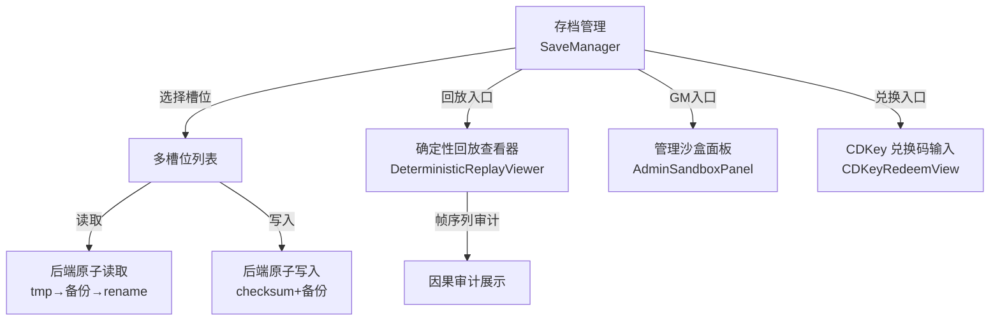
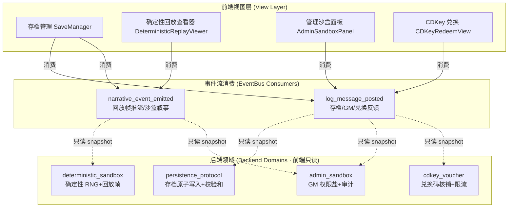
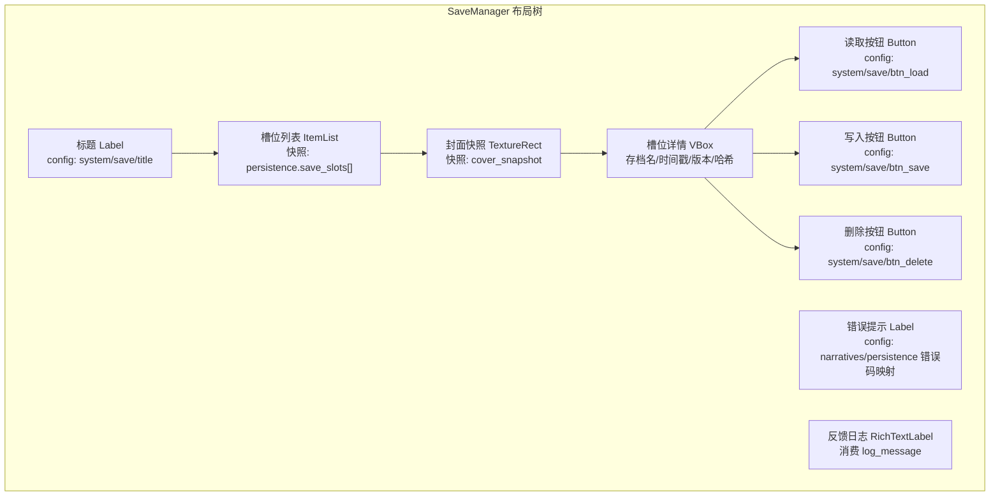
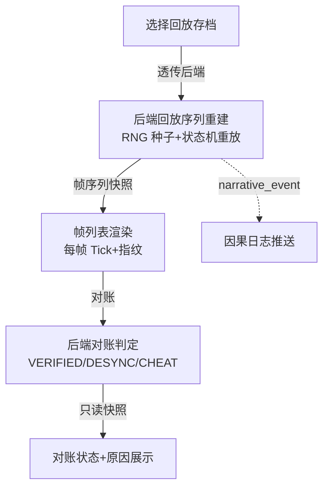
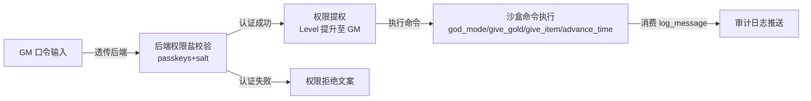
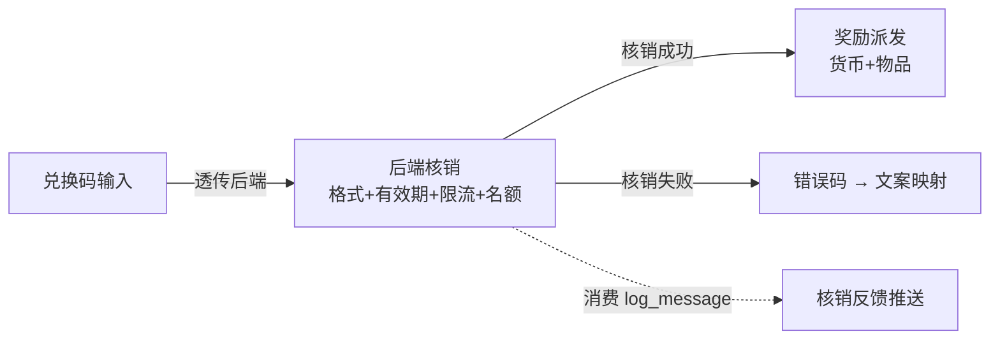

# 前端架构需求表16（第十六卷：系统与存档系统）

> \[!NOTE]
> **【全局架构声明】**：本篇及全套前端技术文档中所提及的所有具体界面文案、按钮标签、配色令牌与演示数据，**均属基础演示示例（Illustrative Examples Only），绝非底层硬编码或静态写死结构**。前端表现层仅定义**事件流消费契约、视图-事件映射表、Theme 令牌层与组件可复用基座**，全部用户可见文案由 `config/frontend/ui.json` 与 `config/narratives/persistence.json`、`config/narratives/deterministic.json`、`config/narratives/admin.json`、`config/narratives/cdkey_voucher.json` 驱动。

***

## 一、 系统架构总览与视图模型划分 (Frontend Domain Overview)

### 1.1 架构设计理念：存档回放表现宿主 (Persistence Replay Presentation Host)

本前端系统以**多槽位存档管理、确定性回放审计与 GM 沙盒调试**为运行底座，前端视图只消费 `EventBus` 的 `log_message_posted` 与 `narrative_event_emitted` 信号，以及 `GameConfig` 的只读配置查询，不持有任何存档原子写入、确定性 RNG 种子推进或 GM 权限盐校验逻辑（全部由后端第十六卷 persistence_protocol、第五卷 deterministic_sandbox、第二十一卷 admin_sandbox 与第二十四卷 cdkey_voucher 领域负责）。

* **表现层绝对解耦**：前端只负责「输入采集 → 透传后端 → 渲染反馈结果」，不做任何存档文件操作、确定性回放步进或 GM 口令校验；
* **确定性回放只读审计**：回放查看器的帧指纹与对账状态由后端 `deterministic_sandbox` 领域返回只读快照驱动，前端只展示帧序列与因果链，不执行任何 RNG 或状态机推进；
* **配置驱动文案**：全部存档错误码、GM 反馈文案、兑换码错误文案来自 `config/narratives/persistence.json`、`config/narratives/admin.json`、`config/narratives/cdkey_voucher.json`，存档路径与原子写入参数来自 `config/infrastructure/persistence.json`。

### 1.2 存档与回放流程状态视图 (Persistence Replay Flow Views)



### 1.3 核心子视图与事件映射 (View-Event Mapping)



***

## 二、 存档管理界面 (Save Manager)

### 2.1 视图职责与布局

存档管理界面负责展示后端 `persistence_protocol` 领域下发的多槽位存档只读快照。前端只渲染槽位列表与封面元数据，**不做任何存档文件操作、校验和计算或原子写入**（全部由后端负责）。

| 区域       | 节点类型       | 内容来源                                                      | 说明                         |
| :--------- | :------------- | :------------------------------------------------------------ | :--------------------------- |
| 标题       | Label          | `config/frontend/ui.json` → `system/save/title`            | 「存档管理」                 |
| 槽位列表   | ItemList       | `persistence.save_slots[]` 只读快照                          | 每槽显示封面元数据           |
| 封面快照   | TextureRect    | `persistence.save_slots[].cover_snapshot` 只读              | 槽位封面缩略图               |
| 槽位详情   | Label × N      | 快照字段                                                      | 存档名/时间戳/格式版本/哈希   |
| 读取按钮   | Button         | `config/frontend/ui.json` → `system/save/btn_load`         | 透传后端读取请求              |
| 写入按钮   | Button         | `config/frontend/ui.json` → `system/save/btn_save`         | 透传后端写入请求              |
| 删除按钮   | Button         | `config/frontend/ui.json` → `system/save/btn_delete`       | 透传后端删除请求              |
| 错误提示   | Label          | `narratives/persistence.json` → 错误码映射                    | 存档错误文案展示             |
| 反馈日志   | RichTextLabel  | `log_message_posted` 推流                                    | 存档操作反馈推送渲染          |

### 2.2 存档管理布局树



### 2.3 输入采集与后端透传契约

前端只采集槽位选择与操作意图，透传后端 `persistence_protocol` 领域，**不做任何文件操作或校验和计算**：

```typescript
// 前端存档操作请求 DTO（透传后端 persistence_protocol 领域，前端不做校验）
interface SaveActionRequestDTO {
  slotId: string;             // 槽位 ID 原样透传
  action: 'load' | 'save' | 'delete';  // 操作意图原样透传
  saveName?: string;           // 存档名原样透传（写入时）
}

// 后端返回的存档快照（前端只渲染，不判定）
interface SaveSlotSnapshotDTO {
  slots: SaveSlotEntry[];
  maxSlots: number;
}

interface SaveSlotEntry {
  slotId: string;              // 槽位 ID
  saveName?: string;           // 存档名
  timestamp?: number;          // 存档时间戳
  formatVersion?: string;      // 格式版本
  hashPreview?: string;        // 哈希预览（前8位）
  coverSnapshot?: string;      // 封面快照路径
  isEmpty: boolean;             // 是否空槽位
}

// 后端返回的存档操作结果（前端只渲染，不判定）
interface SaveActionResultDTO {
  success: boolean;
  errorCode?: string;          // 错误码 → narratives/persistence.json 查文案
  message?: string;
}
```

### 2.4 存档错误码到文案映射

前端不硬编码任何错误文案，全部由 `config/narratives/persistence.json` 的 `messages` 节驱动：

| 错误码               | 配置路径                                              | 兜底默认文案                   |
| :------------------ | :-------------------------------------------------- | :--------------------------- |
| `open_write_fail`   | `narratives.persistence → messages/open_write_fail` | 「文件写入失败」             |
| `checksum_mismatch` | `narratives.persistence → messages/checksum_mismatch` | 「存档完整性校验失败」       |
| `file_not_exist`    | `narratives.persistence → messages/file_not_exist`  | 「存档文件不存在」           |
| `json_parse_fail`   | `narratives.persistence → messages/json_parse_fail`  | 「存档解析失败」             |
| `atomic_replace_fail` | `narratives.persistence → messages/atomic_replace_fail` | 「原子替换失败」         |

```gdscript
## 错误码 → 文案：从 narratives/persistence.json 查表，未命中回退默认值
func _render_save_error(error_code: String) -> void:
    error_label.text = GameConfig.get_string(
        "narratives.persistence", "messages/" + error_code,
        "存档操作失败，请重试"  # 兜底默认值
    )
```

### 2.5 存档操作反馈事件消费契约

```gdscript
## 存档管理界面消费日志事件，渲染操作反馈
## 文案来自 narratives/persistence.json 的 messages 节
func _ready() -> void:
    EventBus.get_instance().log_message_posted.connect(_on_log_message)

func _on_log_message(level: String, message: String) -> void:
    # 存档操作反馈 → 富文本渲染
    # 配色读 event_categories.json 的 system 分类
    var color := EventBus.get_category_color("system")
    log_rich.append_text("[color=%s]%s[/color]\n" % [color, message])
```

***

## 三、 确定性回放查看器界面 (Deterministic Replay Viewer)

### 3.1 视图职责与布局

确定性回放查看器负责展示后端 `deterministic_sandbox` 领域下发的回放帧序列与因果审计只读快照。前端只渲染帧指纹与对账状态，**不做任何 RNG 种子推进、状态机步进或对账判定**（全部由后端负责）。

| 区域         | 节点类型       | 内容来源                                                     | 说明                           |
| :----------- | :------------- | :----------------------------------------------------------- | :----------------------------- |
| 标题         | Label          | `config/frontend/ui.json` → `system/replay/title`         | 「确定性回放查看器」           |
| 回放帧列表   | ItemList       | `deterministic.replay_frames[]` 只读快照                    | 每帧显示 Tick 序号与指纹      |
| 帧详情       | Label × N      | 快照字段                                                     | Tick/HP/AP/伤害/动词           |
| 帧指纹       | Label          | `deterministic.fingerprint.format` 只读配置                 | 帧指纹格式展示                 |
| 对账状态     | Label          | `deterministic.authority.status` 只读配置                   | VERIFIED_VALID/DESYNC/CHEAT   |
| 对账原因     | Label          | `deterministic.authority.reasons` 只读配置                  | 对账失败原因展示               |
| 容差显示     | Label          | `deterministic.conservation.tolerance` 只读配置             | 守恒容差展示                   |
| 最大失序帧   | Label          | `deterministic.authority.max_allowed_desync_ticks` 只读配置 | 允许最大失序帧数展示           |
| 回放控制     | Button × N     | `config/frontend/ui.json` → `system/replay/btn_*`          | 播放/暂停/步进透传后端         |
| 因果日志     | RichTextLabel  | `narrative_event_emitted` 推流                               | 回放帧因果叙事推送渲染         |

### 3.2 回放审计流程视图



### 3.3 输入采集与后端透传契约

```typescript
// 前端回放控制请求 DTO（透传后端 deterministic_sandbox 领域，前端不做校验）
interface ReplayControlRequestDTO {
  replayId: string;            // 回放 ID 原样透传
  action: 'play' | 'pause' | 'step_forward' | 'step_backward' | 'seek';  // 控制意图
  targetTick?: number;          // 跳转目标 Tick 原样透传
}

// 后端下发的回放帧快照（前端只渲染，不判定对账）
interface ReplayFrameSnapshotDTO {
  replayId: string;
  frames: ReplayFrameEntry[];
  validationStatus: string;    // 对账状态（后端判定）
  validationReason?: string;    // 对账原因（后端判定）
  totalTicks: number;
}

interface ReplayFrameEntry {
  tick: number;                 // Tick 序号
  fingerprint: string;          // 帧指纹（格式: T%d:HP%.1f:AP%d:D%.1f）
  hp: number;
  ap: number;
  damage: number;
  verb: string;                 // 动作词
  sequenceNumber: number;
}
```

### 3.4 回放帧因果叙事事件消费契约

```gdscript
## 确定性回放查看器消费叙事事件，渲染回放帧因果推送
## 文案来自 narratives/deterministic.json 的 frame_broadcast 模板
func _ready() -> void:
    EventBus.get_instance().narrative_event_emitted.connect(_on_narrative_event)

func _on_narrative_event(packet: Dictionary) -> void:
    var cat = packet.get("category", "")
    var txt = packet.get("text", "")
    # 回放帧因果推流 → 富文本渲染
    # 配色读 event_categories.json 的 system 分类
    var color := EventBus.get_category_color("system")
    log_rich.append_text("[color=%s]%s[/color]\n" % [color, txt])
```

***

## 四、 管理沙盒面板界面 (Admin Sandbox Panel)

### 4.1 视图职责与布局

管理沙盒面板负责展示后端 `admin_sandbox` 领域下发的 GM 调试只读快照。前端只渲染权限位阶与沙盒命令反馈，**不做任何 GM 口令校验、权限盐比对或审计阈值判定**。

| 区域         | 节点类型       | 内容来源                                                     | 说明                           |
| :----------- | :------------- | :----------------------------------------------------------- | :----------------------------- |
| 标题         | Label          | `config/frontend/ui.json` → `system/admin/title`           | 「管理沙盒面板」               |
| 权限认证入口 | LineEdit       | `config/frontend/ui.json` → `system/admin/passkey_input`  | GM 口令输入透传后端            |
| 权限位阶     | Label          | `admin_sandbox.permission_level` 只读快照                    | 当前 GM 位阶展示               |
| 沙盒命令列表 | ItemList       | `config/frontend/ui.json` → `system/admin/commands`       | 上帝模式/发金币/发道具/快进时间 |
| 命令参数输入 | LineEdit × N   | `config/frontend/ui.json` → `system/admin/param_placeholders` | 各命令参数输入透传             |
| 执行按钮     | Button         | `config/frontend/ui.json` → `system/admin/btn_execute`    | 透传后端沙盒命令执行            |
| 审计日志     | RichTextLabel  | `log_message_posted` 推流                                    | GM 审计反馈推送渲染            |
| 审计条目上限 | Label          | `infrastructure/admin.json → audit.recent_limit` 只读     | 审计展示上限                   |

### 4.2 GM 沙盒流程视图



### 4.3 输入采集与后端透传契约

前端只采集 GM 口令与命令参数，透传后端 `admin_sandbox` 领域，**不做任何口令校验或权限判定**：

```typescript
// 前端 GM 认证请求 DTO（透传后端 admin_sandbox 领域，前端不做校验）
interface GMAuthRequestDTO {
  passkey: string;             // GM 口令原样透传，前端不明文存储
}

// 前端沙盒命令执行请求 DTO（透传后端，前端不做校验）
interface SandboxCommandRequestDTO {
  command: string;             // 命令名原样透传，如 "god_mode"/"give_gold"
  params?: Record<string, string>;  // 命令参数原样透传
}

// 后端返回的沙盒执行结果（前端只渲染，不判定）
interface SandboxResultDTO {
  success: boolean;
  errorCode?: string;          // 错误码 → narratives/admin.json 查文案
  message?: string;            // 反馈文案
  permissionLevel?: number;    // 当前权限位阶
}
```

### 4.4 GM 反馈错误码到文案映射

前端不硬编码任何 GM 文案，全部由 `config/narratives/admin.json` 驱动：

| 错误码                  | 配置路径                                                | 兜底默认文案           |
| :--------------------- | :-------------------------------------------------- | :----------------- |
| `insufficient_permission` | `narratives.admin → insufficient_permission`       | 「GM 权限不足」     |
| `unknown_command`      | `narratives.admin → unknown_command`               | 「未知 GM 命令」     |
| `permission_denied`    | `narratives.admin → permission_denied`              | 「命令权限被拒绝」   |

```gdscript
## GM 沙盒面板消费日志事件，渲染审计反馈
## 文案来自 narratives/admin.json
func _ready() -> void:
    EventBus.get_instance().log_message_posted.connect(_on_log_message)

func _on_log_message(level: String, message: String) -> void:
    # GM 审计反馈 → 富文本渲染
    # 配色读 event_categories.json 的 system 分类
    var color := EventBus.get_category_color("system")
    audit_rich.append_text("[color=%s]%s[/color]\n" % [color, message])
```

***

## 五、 CDKey 兑换码输入与核销反馈界面 (CDKey Redeem View)

### 5.1 视图职责与布局

CDKey 兑换界面负责展示后端 `cdkey_voucher` 领域下发的兑换核销只读快照。前端只渲染兑换码输入与核销结果，**不做任何兑换码格式校验、限流计数或有效期判定**。

| 区域       | 节点类型       | 内容来源                                                       | 说明                         |
| :--------- | :------------- | :------------------------------------------------------------- | :--------------------------- |
| 标题       | Label          | `config/frontend/ui.json` → `system/cdkey/title`            | 「CDKey 兑换」               |
| 兑换码输入 | LineEdit       | `config/frontend/ui.json` → `system/cdkey/placeholder`     | 兑换码原样透传后端           |
| 兑换按钮   | Button         | `config/frontend/ui.json` → `system/cdkey/btn_redeem`      | 透传后端核销请求              |
| 核销结果   | Label          | `narratives/cdkey_voucher.json` → 结果文案映射               | 成功/失败文案展示             |
| 限流提示   | Label          | `cdkey_voucher.rate_limit` 只读配置                           | 最大失败次数/锁定时长展示     |
| 奖励详情   | ItemList       | `cdkey_voucher.reward_payload` 只读快照                      | 兑换奖励明细展示             |
| 物品派发   | Label          | `narratives/cdkey_voucher.json → item_dispatch_fallback_name` | 物品派发名展示               |
| 反馈日志   | RichTextLabel  | `log_message_posted` 推流                                     | 兑换核销反馈推送渲染          |

### 5.2 CDKey 兑换流程视图



### 5.3 输入采集与后端透传契约

```typescript
// 前端兑换码核销请求 DTO（透传后端 cdkey_voucher 领域，前端不做校验）
interface CDKeyRedeemRequestDTO {
  cdkey: string;              // 兑换码原样透传，前端不校验格式
  characterId?: string;        // 角色 ID 原样透传
}

// 后端返回的核销结果（前端只渲染，不判定）
interface CDKeyRedeemResultDTO {
  success: boolean;
  errorCode?: string;          // 错误码 → narratives/cdkey_voucher.json 查文案
  rewards?: {                  // 奖励明细（只读快照）
    manaMonocrystals: number;
    goldCoins: number;
    silverCoins: number;
    copperCoins: number;
    items?: ItemDispatchSnapshot[];
  };
  lockoutRemainingSeconds?: number;  // 限流锁定剩余秒数（后端计算）
}

interface ItemDispatchSnapshot {
  templateId: string;
  itemName: string;
  massKg: number;
  volumeSlots: number;
}
```

### 5.4 兑换错误码到文案映射

前端不硬编码任何兑换文案，全部由 `config/narratives/cdkey_voucher.json` 驱动：

| 错误码               | 配置路径                                                       | 兜底默认文案             |
| :------------------ | :----------------------------------------------------------- | :--------------------- |
| `rate_limited`      | `narratives.cdkey_voucher → rate_limited`                   | 「兑换尝试过于频繁」     |
| `invalid_code`      | `narratives.cdkey_voucher → invalid_code`                   | 「兑换码无效」           |
| `voucher_revoked`   | `narratives.cdkey_voucher → voucher_revoked`                | 「兑换码已停用」         |
| `expired`           | `narratives.cdkey_voucher → expired`                       | 「兑换码已过期」         |
| `level_too_low`     | `narratives.cdkey_voucher → level_too_low`                  | 「角色等级不足」         |
| `global_limit_reached` | `narratives.cdkey_voucher → global_limit_reached`         | 「全服名额已领完」       |
| `already_redeemed`  | `narratives.cdkey_voucher → already_redeemed`               | 「已领取过该礼包」       |

```gdscript
## CDKey 兑换界面消费日志事件，渲染核销反馈
## 文案来自 narratives/cdkey_voucher.json
func _ready() -> void:
    EventBus.get_instance().log_message_posted.connect(_on_log_message)

func _on_log_message(level: String, message: String) -> void:
    # 兑换核销反馈 → 富文本渲染
    # 配色读 event_categories.json 的 system 分类
    var color := EventBus.get_category_color("system")
    log_rich.append_text("[color=%s]%s[/color]\n" % [color, message])

## 错误码 → 文案：从 narratives/cdkey_voucher.json 查表
func _render_cdkey_error(error_code: String) -> void:
    error_label.text = GameConfig.get_string(
        "narratives.cdkey_voucher", error_code,
        "兑换失败，请重试"  # 兜底默认值
    )
```

***

## 六、 Theme 令牌与配色规范 (Theme Tokens)

系统与存档系统的全部配色由 Theme 令牌层统一管理，与 `event_categories.json` 对齐：

| UI 元素     | 配色来源                                 | 令牌          | 兜底默认值                        |
| :---------- | :--------------------------------------- | :------------ | :-------------------------------- |
| 页面背景    | Theme                                   | `--bg`        | `Color(0.06, 0.08, 0.12, 1)`      |
| 主标题文字  | Theme                                   | `--title`     | `Color(0.38, 0.75, 0.98, 1)`      |
| 普通正文    | Theme                                   | `--text`      | `Color(0.88, 0.91, 0.95, 1)`      |
| 错误提示    | Theme                                   | `--danger`    | `Color(0.97, 0.53, 0.53, 1)`       |
| 成功提示    | Theme                                   | `--success`   | `Color(0.20, 0.83, 0.60, 1)`      |
| 对账异常    | Theme                                   | `--danger`    | `Color(0.97, 0.53, 0.53, 1)`       |
| 对账正常    | Theme                                   | `--success`   | `Color(0.20, 0.83, 0.60, 1)`      |
| 系统事件    | `event_categories.json` → `system`      | `#38bdf8`     | —                                 |
| 默认事件    | `event_categories.json` → `_default`     | `#94a3b8`     | —                                 |

***

## 七、 验收矩阵 (DoD Matrix)

| 验收项        | 验收标准                                                     | 验证方式                                                 |
| :------------ | :----------------------------------------------------------- | :------------------------------------------------------- |
| 存档管理可达  | 从主界面可进入存档管理，多槽位列表正常渲染                    | `godot` 启动观察                                         |
| 存档错误映射  | 5 种存档错误码均有配置文案，兜底默认值生效                    | 删配置表键值后验证兜底                                   |
| 回放查看器    | 回放帧序列与对账状态正确渲染，帧指纹来自配置表                | 手动走查 + `narrative_event_emitted` 信号断言            |
| GM 沙盒可用   | GM 口令透传后端，权限位阶与审计反馈正常推送                   | 手动走查 + `log_message_posted` 信号断言                 |
| CDKey 兑换    | 兑换码透传后端，7 种错误码均有配置文案，奖励明细正常渲染       | 删配置表键值后验证兜底                                   |
| 文案零硬编码  | 所有存档/GM/兑换文案均来自配置表                              | `rg "兑换" frontend/` 仅命中配置读取                     |
| 配色配置驱动  | 删除 `event_categories.json` 的 `system` 分类后回退默认色    | 配置表删键后验证                                         |
| 零逻辑纪律   | 前端代码无存档文件操作/RNG 种子/权限盐校验调用                 | `rg "salt\|passkey\|lcg\|multiplier" frontend/` 无命中      |
| 视图可切换    | 存档管理↔回放查看器↔GM沙盒↔CDKey兑换 均可导航                 | 手动走查                                                 |
