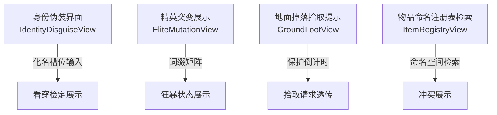
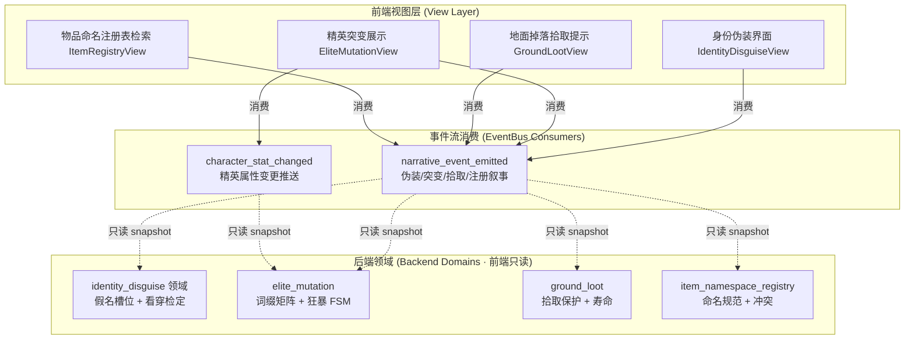
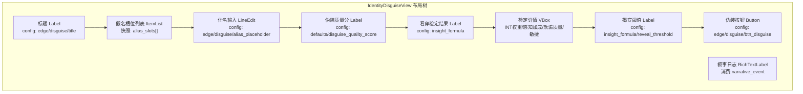
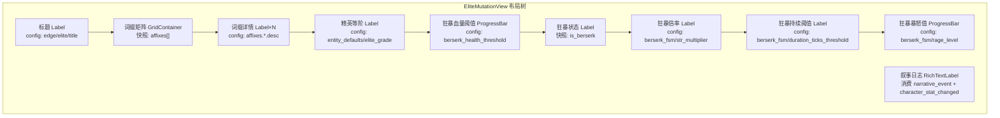
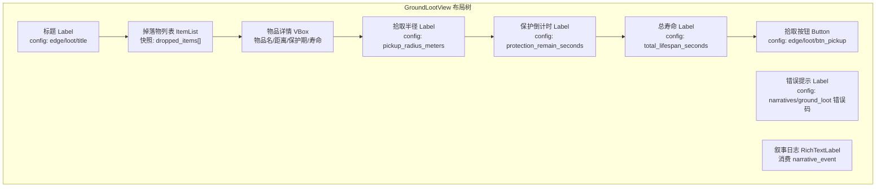
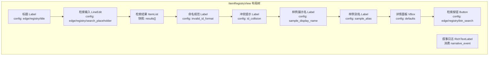

# 前端架构需求表17（第十七卷：边缘与杂项系统）

> \[!NOTE]
> **【全局架构声明】**：本篇及全套前端技术文档中所提及的所有具体界面文案、按钮标签、配色令牌与演示数据，**均属基础演示示例（Illustrative Examples Only），绝非底层硬编码或静态写死结构**。前端表现层仅定义**事件流消费契约、视图-事件映射表、Theme 令牌层与组件可复用基座**，全部用户可见文案由 `config/frontend/ui.json` 与 `config/narratives/identity_disguise.json`、`config/narratives/elite.json`、`config/narratives/ground_loot.json`、`config/narratives/item_namespace_registry.json` 驱动。

***

## 一、 系统架构总览与视图模型划分 (Frontend Domain Overview)

### 1.1 架构设计理念：边缘杂项表现宿主 (Edge Misc Presentation Host)

本前端系统以**身份伪装、精英突变、地面拾取与物品命名检索**四大边缘场景为运行底座，前端视图只消费 `EventBus` 的 `narrative_event_emitted` 与 `character_stat_changed` 信号，以及 `GameConfig` 的只读配置查询，不持有任何看穿检定计算、词缀矩阵推导、拾取保护倒计时或命名冲突判定逻辑（全部由后端第二十八卷 identity_disguise、第二十二卷 elite_mutation、第三十一卷 ground_loot 与第三十六卷 item_namespace_registry 领域负责）。

* **表现层绝对解耦**：前端只负责「输入采集 → 透传后端 → 渲染反馈结果」，不做任何看穿检定公式计算、狂暴状态机推进或物品 ID 冲突判定；
* **保护倒计时只读计时**：地面拾取保护期倒计时由后端 `ground_loot` 领域的 `protection_remain_seconds` 配置驱动，前端只读配置表做倒计时展示，不持有计时判定逻辑；
* **配置驱动文案**：全部伪装质量文案、精英词缀描述、拾取错误文案、命名冲突提示来自 `config/narratives/identity_disguise.json`、`config/narratives/elite.json`、`config/narratives/ground_loot.json`、`config/narratives/item_namespace_registry.json`。

### 1.2 边缘杂项流程状态视图 (Edge Misc Flow Views)



### 1.3 核心子视图与事件映射 (View-Event Mapping)



***

## 二、 身份伪装界面 (Identity Disguise View)

### 2.1 视图职责与布局

身份伪装界面负责展示后端 `identity_disguise` 领域下发的假名/化名槽位与看穿检定只读快照。前端只渲染化名列表与检定结果，**不做任何看穿公式计算或伪装质量判定**。

| 区域         | 节点类型       | 内容来源                                                          | 说明                           |
| :----------- | :------------- | :---------------------------------------------------------------- | :----------------------------- |
| 标题         | Label          | `config/frontend/ui.json` → `edge/disguise/title`             | 「身份伪装」                   |
| 假名槽位列表 | ItemList       | `identity_disguise.alias_slots[]` 只读快照                       | 每槽显示化名与伪装质量分       |
| 化名输入     | LineEdit       | `config/frontend/ui.json` → `edge/disguise/alias_placeholder`  | 新化名透传后端                  |
| 伪装质量分   | Label          | `identity_disguise.defaults.disguise_quality_score` 只读配置   | 后端计算伪装质量展示            |
| 看穿检定结果 | Label          | `identity_disguise.insight_formula` 只读配置                     | 检定阈值/权重展示               |
| 检定详情     | Label × N      | 快照字段                                                          | INT 权重/感知加成/欺骗质量/敏捷 |
| 揭穿阈值     | Label          | `identity_disguise.insight_formula.reveal_threshold` 只读配置   | 看穿揭穿阈值展示                |
| 伪装按钮     | Button         | `config/frontend/ui.json` → `edge/disguise/btn_disguise`        | 透传后端伪装请求                |
| 叙事日志     | RichTextLabel  | `narrative_event_emitted` 推流                                    | 伪装/看穿叙事推送渲染           |

### 2.2 身份伪装布局树



### 2.3 输入采集与后端透传契约

前端只采集化名输入与伪装意图，透传后端 `identity_disguise` 领域，**不做任何看穿公式计算或伪装质量判定**：

```typescript
// 前端伪装请求 DTO（透传后端 identity_disguise 领域，前端不做校验）
interface DisguiseRequestDTO {
  aliasName: string;          // 化名原样透传
  slotId?: string;             // 槽位 ID 原样透传
}

// 后端下发的伪装快照（前端只渲染，不判定看穿）
interface DisguiseSnapshotDTO {
  aliasSlots: AliasSlotEntry[];
  disguiseQualityScore: number;  // 伪装质量分（后端计算）
  insightResult: {
    intWeight: number;          // INT 权重（配置驱动）
    perceptionBonusWeight: number;  // 感知加成权重（配置驱动）
    deceptionQualityWeight: number;  // 欺骗质量权重（配置驱动）
    agiWeight: number;          // 敏捷权重（配置驱动）
    revealThreshold: number;    // 揭穿阈值（配置驱动）
    isRevealed: boolean;         // 是否被看穿（后端判定）
  };
}

interface AliasSlotEntry {
  slotId: string;
  aliasName: string;
  disguiseQualityScore: number;
  isActive: boolean;            // 是否当前生效（后端判定）
}
```

### 2.4 伪装看穿叙事事件消费契约

```gdscript
## 身份伪装界面消费叙事事件，渲染伪装/看穿推送
func _ready() -> void:
    EventBus.get_instance().narrative_event_emitted.connect(_on_narrative_event)

func _on_narrative_event(packet: Dictionary) -> void:
    var cat = packet.get("category", "")
    var txt = packet.get("text", "")
    # 伪装/看穿叙事推流 → 富文本渲染
    # 配色读 event_categories.json 对应分类
    var color := EventBus.get_category_color(cat)
    log_rich.append_text("[color=%s]%s[/color]\n" % [color, txt])
```

***

## 三、 精英突变展示界面 (Elite Mutation View)

### 3.1 视图职责与布局

精英突变展示界面负责展示后端 `elite_mutation` 领域下发的词缀矩阵与狂暴状态只读快照。前端只渲染词缀列表与狂暴状态条，**不做任何词缀属性推导、狂暴状态机推进或倍率计算**。

| 区域         | 节点类型       | 内容来源                                                       | 说明                           |
| :----------- | :------------- | :------------------------------------------------------------- | :----------------------------- |
| 标题         | Label          | `config/frontend/ui.json` → `edge/elite/title`              | 「精英突变展示」               |
| 词缀矩阵     | GridContainer  | `elite_mutation.affixes[]` 只读快照                            | 展示词缀名/属性修正/描述       |
| 词缀详情     | Label × N      | `elite_mutation.affixes.*.desc` 只读配置                       | 各词缀描述展示                 |
| 精英等阶     | Label          | `elite_mutation.entity_defaults.elite_grade` 只读配置         | 精英等阶展示                   |
| 狂暴血量阈值 | ProgressBar    | `elite_mutation.entity_defaults.berserk_health_threshold` 只读 | 狂暴触发血量阈值展示           |
| 狂暴状态     | Label          | `elite_mutation.entity_defaults.is_berserk` 只读快照           | 当前是否狂暴展示               |
| 狂暴倍率     | Label          | `elite_mutation.berserk_fsm.str_multiplier` 只读配置           | 狂暴力量倍率展示               |
| 狂暴持续阈值 | Label          | `elite_mutation.berserk_fsm.duration_ticks_threshold` 只读配置 | 狂暴持续 Tick 阈值展示         |
| 狂暴暴怒值   | ProgressBar    | `elite_mutation.berserk_fsm.rage_level` 只读配置              | 暴怒值进度条展示               |
| 叙事日志     | RichTextLabel  | `narrative_event_emitted` / `character_stat_changed` 推流     | 突变/狂暴叙事与属性变更推送    |

### 3.2 精英突变布局树



### 3.3 输入采集与后端透传契约

```typescript
// 后端下发的精英突变快照（前端只渲染，不判定词缀/狂暴）
interface EliteMutationSnapshotDTO {
  affixes: AffixEntry[];        // 词缀矩阵
  eliteGrade: number;           // 精英等阶
  isBerserk: boolean;            // 是否狂暴（后端状态机判定）
  berserkHealthThreshold: number;  // 狂暴血量阈值（配置驱动）
  rageLevel: number;             // 暴怒值（后端状态机推进）
}

interface AffixEntry {
  affixId: string;               // 词缀 ID，如 VAMPIRIC/MOLTEN/SWIFT
  affixName: string;             // 词缀名
  statMods: Record<string, number>;  // 属性修正
  description: string;          // 词缀描述（配置驱动）
  // 特殊效果参数（配置驱动，前端只展示）
  lifestealPercent?: number;
  fireDamageFlat?: number;
  apCostReduction?: number;
  reflectPercent?: number;
  physicalResistance?: number;
}

// 前端精英查看请求 DTO（透传后端，前端不做校验）
interface EliteViewRequestDTO {
  entityId: string;            // 精英实体 ID 原样透传
}
```

### 3.4 狂暴叙事与属性变更事件消费契约

```gdscript
## 精英突变展示界面消费叙事事件与属性变更事件
## 文案来自 narratives/elite.json 的 berserk_trigger 模板
func _ready() -> void:
    var bus := EventBus.get_instance()
    bus.narrative_event_emitted.connect(_on_narrative_event)
    bus.character_stat_changed.connect(_on_stat_changed)

func _on_narrative_event(packet: Dictionary) -> void:
    var cat = packet.get("category", "")
    var txt = packet.get("text", "")
    # 突变/狂暴叙事推流 → 富文本渲染
    # 配色读 event_categories.json 的 combat 分类
    var color := EventBus.get_category_color("combat")
    log_rich.append_text("[color=%s]%s[/color]\n" % [color, txt])

func _on_stat_changed(entity_id: String, stat_name: String, old_val: float, new_val: float) -> void:
    # 精英属性变更 → 更新词缀矩阵展示
    # 前端只渲染快照，不推导词缀
    _refresh_affix_matrix()
```

***

## 四、 地面掉落拾取提示界面 (Ground Loot View)

### 4.1 视图职责与布局

地面掉落拾取提示界面负责展示后端 `ground_loot` 领域下发的掉落物与保护期只读快照。前端只读配置表 `protection_remain_seconds` 做保护倒计时展示，**不做任何拾取半径判定、保护期计算或寿命衰减**。

| 区域         | 节点类型       | 内容来源                                                       | 说明                           |
| :----------- | :------------- | :------------------------------------------------------------- | :----------------------------- |
| 标题         | Label          | `config/frontend/ui.json` → `edge/loot/title`               | 「地面掉落」                   |
| 掉落物列表   | ItemList       | `ground_loot.dropped_items[]` 只读快照                         | 展示物品名/距离/状态           |
| 物品详情     | Label × N      | 快照字段                                                        | 物品名/距离/保护期/寿命        |
| 拾取半径     | Label          | `ground_loot.defaults.pickup_radius_meters` 只读配置         | 拾取半径展示                   |
| 保护倒计时   | Label          | `ground_loot.defaults.protection_remain_seconds` 只读配置     | 击杀专属保护期倒计时展示       |
| 总寿命       | Label          | `ground_loot.defaults.total_lifespan_seconds` 只读配置       | 掉落物总寿命展示               |
| 拾取按钮     | Button         | `config/frontend/ui.json` → `edge/loot/btn_pickup`         | 透传后端拾取请求                |
| 错误提示     | Label          | `narratives/ground_loot.json` → 错误码映射                     | 拾取错误文案展示               |
| 叙事日志     | RichTextLabel  | `narrative_event_emitted` 推流                                | 拾取/腐朽叙事推送渲染           |

### 4.2 地面掉落布局树



### 4.3 输入采集与后端透传契约

```typescript
// 前端拾取请求 DTO（透传后端 ground_loot 领域，前端不做校验）
interface PickupRequestDTO {
  itemId: string;             // 掉落物 ID 原样透传
}

// 后端下发的掉落物快照（前端只渲染，不判定半径/保护/寿命）
interface GroundLootSnapshotDTO {
  droppedItems: DroppedItemEntry[];
  pickupRadiusMeters: number;    // 拾取半径（配置驱动）
  protectionRemainSeconds: number;  // 保护期秒数（配置驱动）
  totalLifespanSeconds: number;    // 总寿命（配置驱动）
}

interface DroppedItemEntry {
  itemId: string;
  itemName: string;
  distanceMeters: number;        // 距离（后端计算）
  protectionRemainSeconds: number;  // 保护剩余秒数（后端计算）
  lifespanRemainSeconds: number;  // 寿命剩余秒数（后端计算）
  isProtected: boolean;          // 是否在保护期（后端判定）
  isDecayed: boolean;             // 是否已腐朽（后端判定）
}

// 后端返回的拾取结果（前端只渲染，不判定）
interface PickupResultDTO {
  success: boolean;
  errorCode?: string;          // 错误码 → narratives/ground_loot.json 查文案
}
```

### 4.4 拾取错误码到文案映射

前端不硬编码任何拾取文案，全部由 `config/narratives/ground_loot.json` 驱动：

| 错误码             | 配置路径                                                  | 兜底默认文案                   |
| :---------------- | :------------------------------------------------------ | :--------------------------- |
| `too_far`         | `narratives.ground_loot → too_far`                     | 「距离过远，无法拾取」       |
| `kill_protected`  | `narratives.ground_loot → kill_protected`              | 「物品处于击杀保护期」       |
| `inventory_full`  | `narratives.ground_loot → inventory_full`              | 「背包容量不足」             |
| `decayed`         | `narratives.ground_loot → decayed`                     | 「物品已腐朽」               |

```gdscript
## 地面掉落拾取提示界面消费叙事事件，渲染拾取/腐朽推送
## 文案来自 narratives/ground_loot.json
func _ready() -> void:
    EventBus.get_instance().narrative_event_emitted.connect(_on_narrative_event)

func _on_narrative_event(packet: Dictionary) -> void:
    var cat = packet.get("category", "")
    var txt = packet.get("text", "")
    # 拾取/腐朽叙事推流 → 富文本渲染
    # 配色读 event_categories.json 对应分类
    var color := EventBus.get_category_color(cat)
    log_rich.append_text("[color=%s]%s[/color]\n" % [color, txt])

## 保护倒计时只读配置表，不持有计时判定逻辑
func _start_protection_countdown(remain_seconds: float) -> void:
    # 倒计时秒数读配置表，前端只读不判定
    var default_seconds := GameConfig.get_float(
        "domains.ground_loot", "defaults/protection_remain_seconds", 60.0
    )
    var seconds = remain_seconds if remain_seconds > 0 else default_seconds
    countdown_label.text = "%.0f" % seconds
    protection_timer.wait_time = seconds
    protection_timer.start()

## 错误码 → 文案：从 narratives/ground_loot.json 查表
func _render_loot_error(error_code: String) -> void:
    error_label.text = GameConfig.get_string(
        "narratives.ground_loot", error_code,
        "拾取失败"  # 兜底默认值
    )
```

***

## 五、 物品命名注册表检索界面 (Item Namespace Registry View)

### 5.1 视图职责与布局

物品命名注册表检索界面负责展示后端 `item_namespace_registry` 领域下发的物品 ID 命名空间只读快照。前端只渲染检索结果与冲突标记，**不做任何 ID 格式校验或冲突判定**。

| 区域       | 节点类型       | 内容来源                                                           | 说明                           |
| :--------- | :------------- | :----------------------------------------------------------------- | :----------------------------- |
| 标题       | Label          | `config/frontend/ui.json` → `edge/registry/title`               | 「物品命名注册表」             |
| 检索输入   | LineEdit       | `config/frontend/ui.json` → `edge/registry/search_placeholder` | 命名空间检索词透传后端         |
| 检索结果   | ItemList       | `item_namespace_registry.results[]` 只读快照                      | 展示物品 ID/展示名/别名        |
| 命名规范   | Label          | `narratives/item_namespace_registry.json → invalid_id_format` 只读 | KALAR:[MAJOR]:[MINOR]:[TAG] 规范展示 |
| 冲突提示   | Label          | `narratives/item_namespace_registry.json → id_collision` 只读     | ID 冲突文案展示               |
| 样例展示名 | Label          | `narratives/item_namespace_registry.json → sample_display_name` 只读 | 样例物品名展示               |
| 样例别名   | Label          | `narratives/item_namespace_registry.json → sample_alias` 只读    | 样例别名展示                   |
| 详情面板   | Label × N      | `item_namespace_registry.defaults` 只读配置                      | 等阶/质量/体积/基础市值展示    |
| 检索按钮   | Button         | `config/frontend/ui.json` → `edge/registry/btn_search`           | 透传后端检索请求               |
| 叙事日志   | RichTextLabel  | `narrative_event_emitted` 推流                                    | 注册/冲突叙事推送渲染           |

### 5.2 物品注册表布局树



### 5.3 输入采集与后端透传契约

```typescript
// 前端检索请求 DTO（透传后端 item_namespace_registry 领域，前端不做校验）
interface ItemRegistrySearchRequestDTO {
  query: string;              // 检索词原样透传
  namespace?: string;          // 命名空间筛选原样透传
}

// 后端下发的检索结果快照（前端只渲染，不判定冲突）
interface ItemRegistryResultDTO {
  results: ItemRegistryEntry[];
  totalFound: number;
  hasCollision: boolean;       // 是否有冲突（后端判定）
  collisionId?: string;         // 冲突 ID（后端判定）
}

interface ItemRegistryEntry {
  itemId: string;               // 物品 ID，格式 KALAR:[MAJOR]:[MINOR]:[TAG]
  displayName: string;          // 展示名
  alias?: string;                // 别名
  tierRank: number;             // 等阶（配置驱动）
  massKg: number;                // 质量（配置驱动）
  volumeSlots: number;          // 体积（配置驱动）
  baseMarketValue: number;      // 基础市值（配置驱动）
  hasCollision: boolean;         // 是否冲突（后端判定）
}
```

### 5.4 注册冲突叙事事件消费契约

```gdscript
## 物品命名注册表检索界面消费叙事事件，渲染注册/冲突推送
## 文案来自 narratives/item_namespace_registry.json
func _ready() -> void:
    EventBus.get_instance().narrative_event_emitted.connect(_on_narrative_event)

func _on_narrative_event(packet: Dictionary) -> void:
    var cat = packet.get("category", "")
    var txt = packet.get("text", "")
    # 注册/冲突叙事推流 → 富文本渲染
    # 配色读 event_categories.json 的 system 分类
    var color := EventBus.get_category_color("system")
    log_rich.append_text("[color=%s]%s[/color]\n" % [color, txt])
```

***

## 六、 Theme 令牌与配色规范 (Theme Tokens)

边缘与杂项系统的全部配色由 Theme 令牌层统一管理，与 `event_categories.json` 对齐：

| UI 元素     | 配色来源                                 | 令牌          | 兜底默认值                        |
| :---------- | :--------------------------------------- | :------------ | :-------------------------------- |
| 页面背景    | Theme                                   | `--bg`        | `Color(0.06, 0.08, 0.12, 1)`      |
| 主标题文字  | Theme                                   | `--title`     | `Color(0.38, 0.75, 0.98, 1)`      |
| 普通正文    | Theme                                   | `--text`      | `Color(0.88, 0.91, 0.95, 1)`      |
| 错误提示    | Theme                                   | `--danger`    | `Color(0.97, 0.53, 0.53, 1)`       |
| 成功提示    | Theme                                   | `--success`   | `Color(0.20, 0.83, 0.60, 1)`      |
| 狂暴状态    | Theme                                   | `--danger`    | `Color(0.97, 0.53, 0.53, 1)`       |
| 保护倒计时  | Theme                                   | `--warn`      | `Color(0.98, 0.75, 0.14, 1)`      |
| 战斗事件    | `event_categories.json` → `combat`     | `#f87171`     | —                                 |
| 系统事件    | `event_categories.json` → `system`     | `#38bdf8`     | —                                 |
| 默认事件    | `event_categories.json` → `_default`     | `#94a3b8`     | —                                 |

***

## 七、 验收矩阵 (DoD Matrix)

| 验收项        | 验收标准                                                     | 验证方式                                                 |
| :------------ | :----------------------------------------------------------- | :------------------------------------------------------- |
| 伪装界面可达  | 身份伪装界面可展示假名槽位与看穿检定结果                     | `godot` 启动观察                                         |
| 精英突变展示  | 词缀矩阵与狂暴状态正确渲染，倍率来自配置表                   | 手动走查 + `character_stat_changed` 信号断言             |
| 地面拾取提示  | 掉落物列表与保护倒计时正常渲染，4 种错误码有配置文案          | 删配置表键值后验证兜底                                   |
| 命名注册检索  | 检索结果与冲突标记正确渲染，命名规范来自配置表                | 手动走查                                                 |
| 文案零硬编码  | 所有伪装/词缀/拾取/注册文案均来自配置表                        | `rg "腐朽\|伪装\|狂暴" frontend/` 仅命中配置读取           |
| 配色配置驱动  | 删除 `event_categories.json` 对应分类后回退默认色            | 配置表删键后验证                                         |
| 零逻辑纪律   | 前端代码无看穿公式/词缀推导/狂暴状态机/冲突判定调用             | `rg "insight_formula\|berserk_fsm\|reveal_threshold" frontend/` 无业务判定 |
| 视图可切换    | 伪装↔精英突变↔地面拾取↔命名注册 均可导航                      | 手动走查                                                 |
