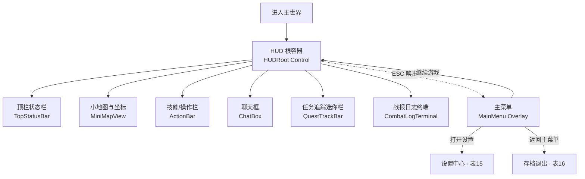
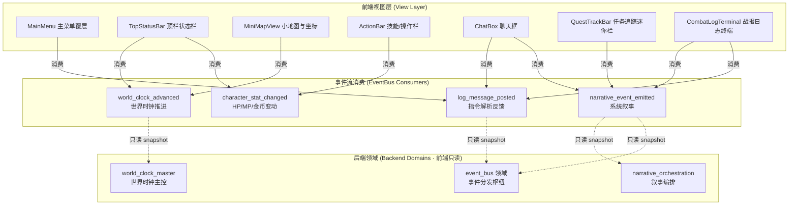
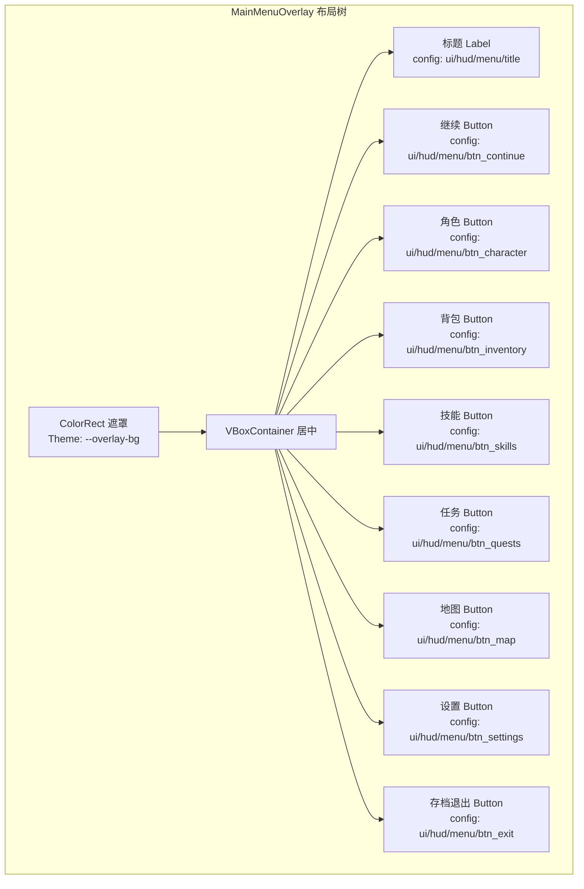
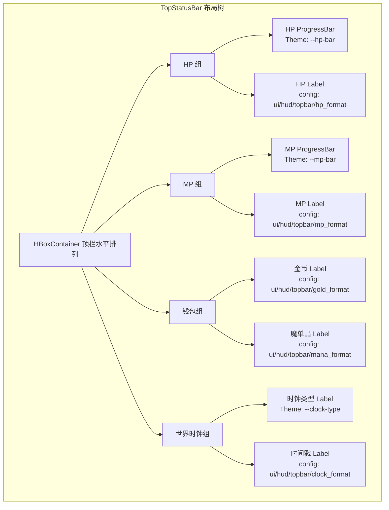
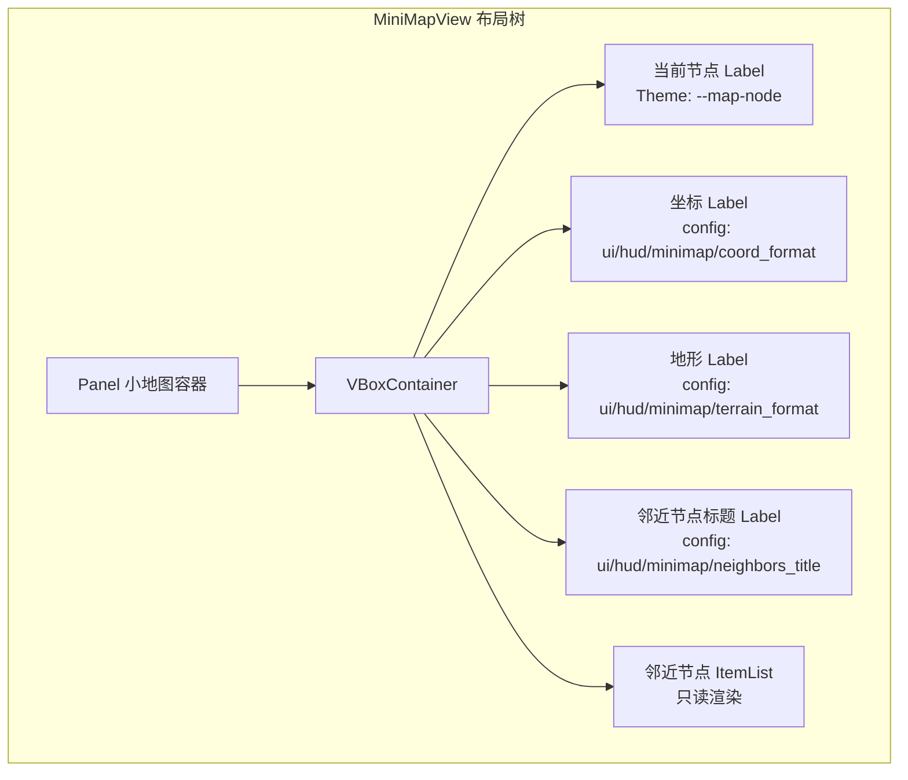
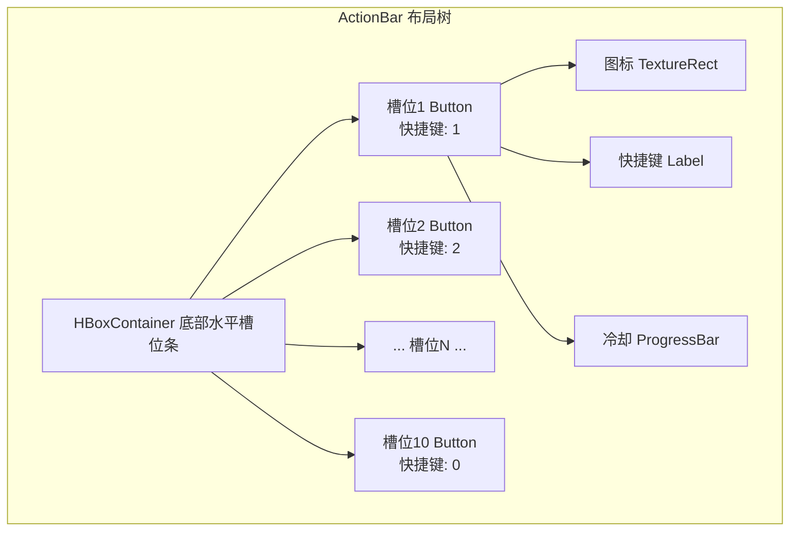
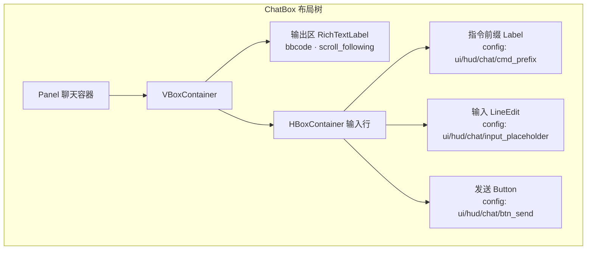
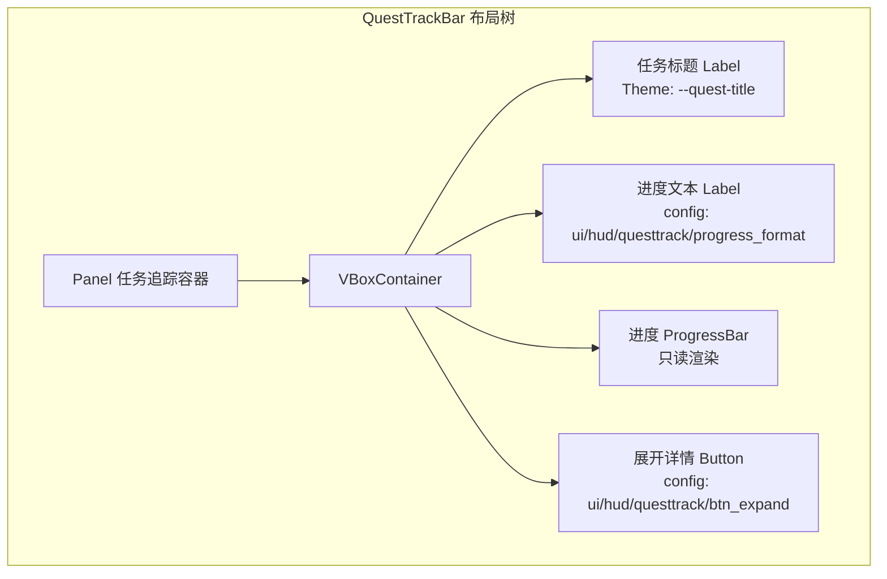
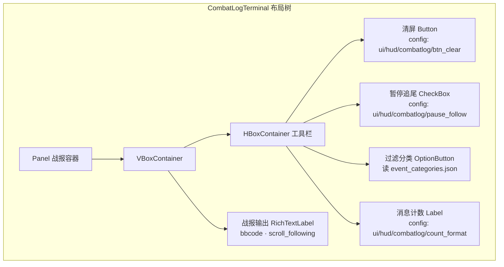

# 前端架构需求表2（第二卷：主界面HUD系统）

> \[!NOTE]
> **【全局架构声明】**：本篇及全套前端技术文档中所提及的所有具体界面文案、按钮标签、配色令牌与演示数据，**均属基础演示示例（Illustrative Examples Only），绝非底层硬编码或静态写死结构**。前端表现层仅定义**事件流消费契约、视图-事件映射表、Theme 令牌层与组件可复用基座**，全部用户可见文案由 `config/frontend/ui.json` 与 `config/narratives/hud.json` 驱动，全部事件分类配色由 `config/infrastructure/event_categories.json` 驱动。

***

## 一、 系统架构总览与视图模型划分 (Frontend Domain Overview)

### 1.1 架构设计理念：HUD 表现宿主 (HUD Presentation Host)

主界面 HUD 是玩家进入世界后**常驻驻留**的表现层容器，聚合顶栏状态、小地图、操作栏、聊天框、任务追踪迷你栏与战报日志终端七大子视图。前端 HUD 只消费 `EventBus` 的 `world_clock_advanced`、`narrative_event_emitted`、`log_message_posted`、`character_stat_changed` 四类信号，以及 `GameConfig` 的只读配置查询，不持有任何世界时钟推进、叙事编排或角色属性计算逻辑（全部由后端 `world_clock_master`、`narrative_orchestration`、`event_bus` 领域负责）。

* **表现层绝对解耦**：HUD 各子视图只负责「事件流 → 渲染映射」，不做任何时钟 tick 推进、叙事模板渲染或属性求解；
* **常驻零膨胀**：每个子视图只消费其对应事件分类，严禁将多领域入口堆砌进单一 HUD 容器（当前 `main_dashboard` 为过渡态演示页，后续按本表规格拆分独立子视图）；
* **配置驱动文案与配色**：全部 HUD 标签、占位提示、快捷键提示来自 `config/frontend/ui.json`；战报日志分类配色来自 `config/infrastructure/event_categories.json`，代码内只保留兜底默认值。

### 1.2 HUD 子视图布局与驻留流程 (HUD Layout & Persistence Flow)



### 1.3 核心子视图与事件映射 (View-Event Mapping)



***

## 二、 主菜单覆层 (Main Menu Overlay)

### 2.1 视图职责与布局

主菜单覆层是玩家按 `ESC` 唤出的半透明遮罩菜单，提供继续游戏、打开各子系统入口、设置与退出选项。前端只采集按钮点击并透传后端路由，不持有任何存档或设置状态。

| 区域     | 节点类型     | 内容来源                                        | 说明                  |
| :------- | :---------- | :--------------------------------------------- | :-------------------- |
| 遮罩背景  | ColorRect   | Theme `--overlay-bg`                           | 半透明黑色遮罩         |
| 菜单标题  | Label       | `config/frontend/ui.json` → `hud/menu/title`   | 如「暂停」             |
| 继续按钮  | Button      | `ui/hud/menu/btn_continue`                     | 关闭覆层返回 HUD       |
| 角色按钮  | Button      | `ui/hud/menu/btn_character`                    | 跳转角色面板 · 表3     |
| 背包按钮  | Button      | `ui/hud/menu/btn_inventory`                    | 跳转背包 · 表3        |
| 技能按钮  | Button      | `ui/hud/menu/btn_skills`                       | 跳转技能树 · 表3      |
| 任务按钮  | Button      | `ui/hud/menu/btn_quests`                       | 跳转任务系统 · 表7     |
| 地图按钮  | Button      | `ui/hud/menu/btn_map`                          | 跳转世界地图 · 表10    |
| 设置按钮  | Button      | `ui/hud/menu/btn_settings`                     | 跳转设置中心 · 表15    |
| 存档退出  | Button      | `ui/hud/menu/btn_exit`                         | 跳转存档管理 · 表16    |

### 2.2 布局树



### 2.3 输入采集与后端透传契约

前端只采集菜单按钮点击事件并路由到对应子系统视图，不做任何存档写入或设置持久化：

```typescript
// 前端菜单路由请求（透传视图切换，前端不持有状态）
interface MenuRouteRequestDTO {
  action: 'continue' | 'open_character' | 'open_inventory' | 'open_skills'
        | 'open_quests' | 'open_map' | 'open_settings' | 'exit_to_save';
  // 前端只负责视图栈 push/pop，不判定权限或存档状态
}

// 后端返回的路由许可（前端只渲染，不判定）
interface MenuRouteResultDTO {
  allowed: boolean;         // 后端判定是否允许进入（如战斗中禁用部分入口）
  targetView?: string;      // 目标视图标识
  blockedReason?: string;   // 阻断原因码 → narratives/hud.json 查文案
}
```

### 2.4 事件消费代码示例

```gdscript
## 主菜单覆层只监听日志事件展示后端就绪状态，不发起业务调用
func _ready() -> void:
    EventBus.get_instance().log_message_posted.connect(_on_log_message)
    visible = false  # 默认隐藏，ESC 唤出

func _unhandled_input(event: InputEvent) -> void:
    if event.is_action_pressed("ui_cancel"):  # ESC
        visible = !visible
        get_viewport().set_input_as_handled()

func _on_log_message(level: String, message: String) -> void:
    # 仅在菜单可见时展示后端系统日志
    if visible:
        status_label.text = message

## 按钮点击透传后端路由判定，前端不做权限校验
func _on_btn_character_pressed() -> void:
    _request_route("open_character")

func _request_route(action: String) -> void:
    # 透传后端 event_bus 领域判定路由许可，前端只渲染结果
    EventBus.get_instance().emit_log("info", "menu_route_request:" + action)
```

***

## 三、 顶栏状态栏 (Top Status Bar)

### 3.1 视图职责与布局

顶栏状态栏是 HUD 顶部常驻条，实时展示角色 HP/MP、钱包金币余额与世界时钟时间戳。前端只消费 `world_clock_advanced` 与 `character_stat_changed` 信号渲染只读快照，不做任何属性计算或时钟推进。

| 区域       | 节点类型      | 内容来源                                              | 说明                    |
| :--------- | :---------- | :--------------------------------------------------- | :---------------------- |
| HP 条      | ProgressBar | `character_stat_changed` → `current_hp/max_hp`       | 红色生命条               |
| MP 条      | ProgressBar | `character_stat_changed` → `current_mp/max_mp`       | 蓝色魔力条               |
| HP 数值    | Label       | `ui/hud/topbar/hp_format`                             | 如「%.0f / %.0f」        |
| 金币余额   | Label       | `character_stat_changed` → `gold`                    | 钱包金币只读渲染         |
| 魔单晶余额 | Label       | `character_stat_changed` → `mana_monocrystals`       | 高级货币只读渲染         |
| 世界时钟   | Label       | `world_clock_advanced` → `timestamp_str`             | 历法时间戳只读渲染       |
| 时钟类型   | Label       | `world_clock_advanced` → `clock_type`                | TRAVEL/BIO/LIFECYCLE 标识 |

### 3.2 布局树



### 3.3 输入采集与后端透传契约

顶栏状态栏是**纯只读渲染视图**，不采集任何用户输入，只消费后端事件流快照：

```typescript
// 后端推送的属性变动快照（前端只渲染，不计算）
interface CharacterStatChangedDTO {
  characterId: string;
  statName: string;         // current_hp / max_hp / current_mp / max_mp / gold / mana_monocrystals
  newVal: number;           // 新值原样透传
}

// 后端推送的世界时钟快照（前端只渲染，不推进）
interface WorldClockAdvancedDTO {
  clockType: string;        // TRAVEL / BIO / LIFECYCLE
  currentTick: number;      // 后端 tick 计数
  timestampStr: string;     // 已格式化的历法时间戳字符串
}
```

### 3.4 事件消费代码示例

```gdscript
## 顶栏状态栏只消费时钟与属性变动事件，只读渲染快照
func _ready() -> void:
    EventBus.get_instance().world_clock_advanced.connect(_on_clock_advanced)
    EventBus.get_instance().character_stat_changed.connect(_on_stat_changed)

func _on_clock_advanced(clock_type: String, _tick: int, timestamp_str: String) -> void:
    # 只读渲染时间戳，不做任何 tick 推进
    clock_time_label.text = timestamp_str
    clock_type_label.text = clock_type

func _on_stat_changed(character_id: String, stat_name: String, new_val: Variant) -> void:
    # 只读渲染属性快照，不计算衍生值
    match stat_name:
        "current_hp":
            hp_bar.value = float(new_val)
            hp_val_label.text = GameConfig.get_string(
                "frontend.ui", "hud/topbar/hp_format", "%.0f / %.0f"
            ) % [float(new_val), hp_bar.max_value]
        "current_mp":
            mp_bar.value = float(new_val)
            mp_val_label.text = GameConfig.get_string(
                "frontend.ui", "hud/topbar/mp_format", "%.0f / %.0f"
            ) % [float(new_val), mp_bar.max_value]
        "gold":
            gold_label.text = GameConfig.get_string(
                "frontend.ui", "hud/topbar/gold_format", "金币: %d"
            ) % int(new_val)
        "mana_monocrystals":
            mana_label.text = GameConfig.get_string(
                "frontend.ui", "hud/topbar/mana_format", "魔单晶: %d"
            ) % int(new_val)
```

***

## 四、 小地图与当前坐标 (Mini Map & Coordinate)

### 4.1 视图职责与布局

小地图是 HUD 右上角常驻缩略地图，展示当前角色所处世界节点、邻近节点拓扑与坐标标识。1.0 文字版以文字节点列表呈现；2.0 预留图形化缩略地图。前端只消费 `world_clock_advanced` 信号中 `TRAVEL` 类型的事件渲染当前节点快照，不做任何寻路或地形计算。

| 区域       | 节点类型    | 内容来源                                              | 说明                    |
| :--------- | :-------- | :--------------------------------------------------- | :---------------------- |
| 当前节点名 | Label     | `world_clock_advanced` → meta `current_node_name`    | 如「铁岩要塞」           |
| 当前坐标   | Label     | `world_clock_advanced` → meta `coord`                 | 节点坐标标识            |
| 地形类型   | Label     | `world_clock_advanced` → meta `terrain`               | PLAINS/MOUNTAIN/FOREST  |
| 邻近节点   | ItemList  | `world_clock_advanced` → meta `neighbors[]`          | 可达邻接节点列表        |
| 缩略图区   | TextureRect | 2.0 预留                                              | 1.0 文字版留空占位      |

### 4.2 布局树



### 4.3 输入采集与后端透传契约

小地图在 1.0 文字版为纯只读视图；点击邻近节点项透传后端寻路请求，前端不做阻抗寻路计算：

```typescript
// 前端寻路请求 DTO（透传后端 world_navigation 领域，前端不计算路径）
interface TravelRequestDTO {
  targetNodeId: string;    // 玩家点击的邻近节点 ID
  // 前端不计算路径、阻抗或行军速度，全部由后端 world_navigation 领域判定
}

// 后端返回的行军结果（前端只渲染，不判定）
interface TravelResultDTO {
  accepted: boolean;        // 后端判定是否可通行
  estimatedHours?: number;  // 后端计算的预计耗时
  blockedReason?: string;   // 阻断原因码
}
```

### 4.4 事件消费代码示例

```gdscript
## 小地图只消费 TRAVEL 类型时钟事件，渲染当前节点快照
func _ready() -> void:
    EventBus.get_instance().world_clock_advanced.connect(_on_clock_advanced)
    neighbor_list.item_selected.connect(_on_neighbor_selected)

func _on_clock_advanced(clock_type: String, _tick: int, _timestamp: String) -> void:
    # 只消费 TRAVEL 类型时钟事件渲染节点快照
    if clock_type != EventBus.get_category_name("travel"):
        return
    # 当前节点信息从事件 meta 中只读获取（meta 由后端注入）
    # 前端不做任何寻路或地形阻抗计算

func _on_neighbor_selected(index: int) -> void:
    var node_id = neighbor_list.get_item_metadata(index)
    # 透传后端 world_navigation 领域判定，前端不计算路径
    EventBus.get_instance().emit_log("info", "travel_request:" + str(node_id))
```

***

## 五、 技能/操作栏与快捷键绑定 (Action Bar & Hotkey Binding)

### 5.1 视图职责与布局

操作栏是 HUD 底部常驻快捷技能/物品槽位条，玩家可拖拽绑定技能或消耗品到 1~0 数字快捷键。前端只采集绑定操作并透传后端记录，不做任何技能冷却计算或 MP 消耗判定。

| 区域       | 节点类型      | 内容来源                                              | 说明                    |
| :--------- | :---------- | :--------------------------------------------------- | :---------------------- |
| 槽位 ×10   | Button ×10  | `character_stat_changed` → `hotbar_slots[]`          | 1~0 数字键绑定槽        |
| 槽位图标   | TextureRect | `hotbar_slots[].icon`                                 | 技能/物品图标           |
| 槽位快捷键 | Label       | `ui/hud/actionbar/slot_key_format`                   | 如「1」「2」…「0」      |
| 冷却遮罩   | ProgressBar | `character_stat_changed` → `cooldown_remaining`      | 只读渲染冷却进度        |
| MP 消耗提示 | Label      | `ui/hud/actionbar/mp_cost_format`                    | 只读展示 MP 消耗预览    |

### 5.2 布局树



### 5.3 输入采集与后端透传契约

前端只采集快捷键按下与拖拽绑定操作，透传后端执行技能/使用物品，不做冷却或 MP 判定：

```typescript
// 前端快捷键触发请求（透传后端 lattice_skill_book 领域，前端不判定冷却）
interface HotbarActionRequestDTO {
  slotIndex: number;        // 0~9 槽位索引
  actionType: 'skill' | 'item';
  actionId: string;         // 技能 ID 或物品实例 ID
  // 前端不检查 MP 是否足够、冷却是否结束，全部由后端判定
}

// 后端返回的执行结果（前端只渲染，不判定）
interface HotbarActionResultDTO {
  executed: boolean;        // 后端判定是否执行成功
  cooldownEndTick?: number; // 后端计算的冷却结束 tick
  mpConsumed?: number;      // 后端计算的 MP 消耗
  failReason?: string;      // 失败原因码 → narratives/hud.json 查文案
}
```

### 5.4 事件消费代码示例

```gdscript
## 操作栏只消费属性变动事件渲染冷却/MP，快捷键透传后端执行
func _ready() -> void:
    EventBus.get_instance().character_stat_changed.connect(_on_stat_changed)
    # 数字键 1~0 映射到槽位 0~9
    for i in range(10):
        var action_name = "hotbar_slot_" + str(i)
        # InputMap 绑定由设置中心 · 表15 管理

func _on_stat_changed(character_id: String, stat_name: String, new_val: Variant) -> void:
    match stat_name:
        "hotbar_cooldown":
            # 只读渲染冷却进度，不计算冷却结束时间
            var slot_idx = int(new_val.get("slot", -1))
            if slot_idx >= 0 and slot_idx < slots.size():
                slots[slot_idx].cooldown_bar.value = float(new_val.get("remaining", 0.0))
        "current_mp":
            # MP 不足时高亮提示，但不阻断执行（由后端判定）
            _update_mp_highlight(float(new_val))

func _on_slot_pressed(slot_index: int) -> void:
    # 透传后端执行，前端不检查 MP/冷却
    EventBus.get_instance().emit_log("info", "hotbar_action:" + str(slot_index))
```

***

## 六、 聊天框与指令解析前端入口 (Chat Box & Command Parser Entry)

### 6.1 视图职责与布局

聊天框是 HUD 左下角常驻文本输入与输出区，兼做**指令解析前端入口**。玩家输入 `/` 前缀指令后，前端原样透传后端 `chat_command` 领域解析，前端不做任何指令语法校验或参数解析。输出区消费 `log_message_posted` 与 `narrative_event_emitted` 信号渲染反馈。

**聊天输入框与聊天滚动区严格区分**：滚动区只承载消息流（有界回收，超出即从头部弹出）；输入框承载文本与**补全面板**——GM 输入 `/` 命令后，硬件层（《第三十二卷》`TabDoubleTapDetector`）监测到 Tab 键**连续两次快速按下**即向后端 `GmCommandIndexSolver`（《第二十一卷》）查询**最近 20 条**命令候选并展示于输入框；候选出现后再按 Tab 即应用**最近适配补全**（最近使用中首个前缀匹配命令）；候选支持分页滚动且页缓冲池回收复用（内存有界），最近无记录时回退默认命令目录。

| 区域       | 节点类型       | 内容来源                                              | 说明                    |
| :--------- | :----------- | :--------------------------------------------------- | :---------------------- |
| 输出区     | RichTextLabel | `log_message_posted` + `narrative_event_emitted`     | bbcode 富文本输出       |
| 输入框     | LineEdit     | `ui/hud/chat/input_placeholder`                      | 如「输入消息或 /指令…」 |
| 补全面板   | ItemList     | 后端 `gm_command_index` 快照 + `frontend/views.json` 提示文案 | 最近 20 条候选 · 双击 Tab 展示 · 再次 Tab 最近适配补全 · 分页滚动回收 |
| 发送按钮   | Button       | `ui/hud/chat/btn_send`                               | 透传后端解析            |
| 指令前缀   | Label        | `ui/hud/chat/cmd_prefix`                             | 如「/」自动检测        |
| 历史翻滚   | ScrollBar    | 代码驱动                                              | 输出区滚动              |

### 6.2 布局树



### 6.3 输入采集与后端透传契约

前端只采集输入文本原样透传，**不做任何指令语法校验、参数解析或权限判定**：

```typescript
// 前端聊天/指令请求 DTO（原样透传后端 chat_command 领域，前端不解析）
interface ChatInputRequestDTO {
  rawText: string;          // 玩家输入原样透传，包括 / 前缀
  // 前端不判定是否为指令、不解析参数、不检查权限
}

// 后端返回的解析结果（前端只渲染，不判定）
interface ChatParseResultDTO {
  isCommand: boolean;       // 后端判定是否为指令
  responseText: string;     // 后端生成的反馈文案（已格式化）
  responseType: 'system' | 'error' | 'narrative';  // 决定配色分类
  category?: string;        // event_categories.json 分类键
}
```

### 6.4 事件消费代码示例

```gdscript
## 聊天框消费日志与叙事事件渲染输出，输入原样透传后端解析
func _ready() -> void:
    EventBus.get_instance().log_message_posted.connect(_on_log_message)
    EventBus.get_instance().narrative_event_emitted.connect(_on_narrative)
    output_log.scroll_following = true  # 自动追尾

func _on_log_message(level: String, message: String) -> void:
    # 日志按级别配色，颜色读 event_categories.json
    var color = _get_level_color(level)
    output_log.append_text("[color=" + color + "][" + level + "] " + message + "[/color]\n")

func _on_narrative_event(packet: Dictionary) -> void:
    # 叙事事件按分类配色
    var cat = packet.get("category", EventBus.get_category_name("info"))
    var txt = packet.get("text", "")
    var color_tag = _get_category_color(cat)
    output_log.append_text("[color=" + color_tag + "][" + cat + "] " + txt + "[/color]\n")

func _on_send_pressed() -> void:
    var raw = input_edit.text.strip_edges()
    if raw.is_empty():
        return
    # 原样透传后端 chat_command 领域解析，前端不做语法校验
    EventBus.get_instance().emit_log("info", "chat_input:" + raw)
    input_edit.clear()

## 按分类名从 event_categories.json 取颜色（新增分类无需改代码）
func _get_category_color(category_name: String) -> String:
    var categories := GameConfig.get_dict("infrastructure.event_categories", "", {})
    for key in categories:
        var entry: Dictionary = categories[key]
        if entry.get("name", "") == category_name:
            return entry.get("color", _default_category_color())
    return _default_category_color()

func _default_category_color() -> String:
    return GameConfig.get_string("infrastructure.event_categories", "_default/color", "#94a3b8")

func _get_level_color(level: String) -> String:
    # 日志级别配色映射，读 config；未命中回退默认色
    return GameConfig.get_string("frontend.ui", "hud/chat/level_color/" + level.to_lower(), "#94a3b8")
```

***

## 七、 任务追踪迷你栏 (Quest Track Mini Bar)

### 7.1 视图职责与布局

任务追踪迷你栏是 HUD 右侧常驻折叠条，展示当前追踪中的任务进度快照。前端只消费 `narrative_event_emitted` 中 `QUEST` 分类事件渲染进度文本，不做任何任务状态机推进或达成条件判定（全部由后端 `commission_quest` 领域负责，详见 表7）。

| 区域       | 节点类型     | 内容来源                                              | 说明                    |
| :--------- | :--------- | :--------------------------------------------------- | :---------------------- |
| 任务标题   | Label      | `narrative_event_emitted` → meta `quest_title`       | 追踪中任务标题          |
| 进度文本   | Label      | `narrative_event_emitted` → meta `progress_text`    | 如「3/5 目标完成」      |
| 进度条     | ProgressBar | `narrative_event_emitted` → meta `progress_ratio`   | 0~1 进度比例只读渲染   |
| 展开按钮   | Button     | `ui/hud/questtrack/btn_expand`                       | 跳转任务详情 · 表7      |
| 折叠/展开  | CheckBox   | `ui/hud/questtrack/collapse_default`                 | 折叠迷你栏             |

### 7.2 布局树



### 7.3 输入采集与后端透传契约

任务追踪迷你栏是**纯只读渲染视图**，展开按钮仅做视图路由，不做任何任务状态查询：

```typescript
// 后端推送的任务进度快照（前端只渲染，不推进状态机）
interface QuestProgressSnapshotDTO {
  questId: string;
  questTitle: string;        // 任务标题文案
  progressText: string;      // 进度描述文案
  progressRatio: number;     // 0~1 进度比例
  category: string;         // event_categories.json 分类键
}

// 前端展开请求（仅视图路由，不查询任务详情）
interface QuestExpandRequestDTO {
  questId: string;           // 透传后端 commission_quest 领域查询详情
}
```

### 7.4 事件消费代码示例

```gdscript
## 任务追踪迷你栏只消费 QUEST 分类叙事事件，只读渲染进度
func _ready() -> void:
    EventBus.get_instance().narrative_event_emitted.connect(_on_narrative_event)

func _on_narrative_event(packet: Dictionary) -> void:
    var cat = packet.get("category", "")
    # 只消费 QUEST 分类事件，其他分类忽略
    if cat != EventBus.get_category_name("quest"):
        return
    var meta = packet.get("meta", {})
    var quest_title = meta.get("quest_title", "")
    var progress_text = meta.get("progress_text", "")
    var progress_ratio = float(meta.get("progress_ratio", 0.0))
    # 只读渲染进度快照，不推进任务状态机
    quest_title_label.text = quest_title
    quest_progress_label.text = progress_text
    quest_bar.value = progress_ratio * 100.0

func _on_btn_expand_pressed() -> void:
    # 仅路由到任务详情视图 · 表7，前端不查询任务数据
    EventBus.get_instance().emit_log("info", "quest_expand_request")
```

***

## 八、 战报日志终端 (Combat Log Terminal)

### 8.1 视图职责与布局

战报日志终端是 HUD 中央主区域常驻的 bbcode 富文本日志，消费全域 `narrative_event_emitted` 与 `log_message_posted` 信号，按 `event_categories.json` 分类配色渲染战报文本。此视图是当前 `main_dashboard.gd` 已实现的核心部分，`scroll_following` 自动追尾，新增分类只需在配置表加一行即自动继承配色，零代码改动。

| 区域         | 节点类型       | 内容来源                                              | 说明                          |
| :----------- | :----------- | :--------------------------------------------------- | :---------------------------- |
| 战报输出区   | RichTextLabel | `narrative_event_emitted` + `log_message_posted`     | bbcode 富文本 · 分类配色     |
| 自动追尾     | (属性)       | `scroll_following = true`                             | 新消息自动滚动到底            |
| 清屏按钮     | Button       | `ui/hud/combatlog/btn_clear`                         | 清空战报输出区                |
| 暂停追尾     | CheckBox     | `ui/hud/combatlog/pause_follow`                      | 暂停自动追尾便于回看          |
| 过滤分类     | OptionButton | `event_categories.json` 全分类枚举                    | 按分类过滤显示                |
| 消息计数     | Label        | 代码驱动计数                                          | 当前显示消息条数              |

### 8.2 布局树



### 8.3 输入采集与后端透传契约

战报日志终端是**纯只读渲染视图**，过滤与清屏均为前端本地 UI 状态，不透传后端：

```typescript
// 后端推送的叙事事件包（前端只渲染，不解析业务语义）
interface NarrativeEventPacketDTO {
  timestamp: number;        // 事件时间戳
  category: string;         // 分类名（已由 EventBus 解析为 event_categories.json 的 name 字段）
  text: string;             // 已格式化的叙事文案
  meta: Record<string, unknown>;  // 附加元数据
}

// 后端推送的日志消息（前端只渲染，不判定级别）
interface LogMessageDTO {
  level: string;            // 日志级别名（已由 EventBus 解析）
  message: string;           // 日志文本
}

// 前端本地过滤状态（不透传后端）
interface CombatLogFilterState {
  categoryFilter: string | 'all';   // 当前过滤分类，纯 UI 状态
  pauseFollow: boolean;              // 是否暂停自动追尾
}
```

### 8.4 事件消费代码示例

```gdscript
## 战报日志终端消费全域叙事与日志事件，分类配色读 event_categories.json
## 此实现已在 main_dashboard.gd 中验证，scroll_following 自动追尾
func _ready() -> void:
    EventBus.get_instance().narrative_event_emitted.connect(_on_narrative_event)
    EventBus.get_instance().log_message_posted.connect(_on_log_message)
    combat_log.scroll_following = true
    _populate_category_filter()

func _on_narrative_event(packet: Dictionary) -> void:
    var cat = packet.get("category", EventBus.get_category_name("info"))
    var txt = packet.get("text", "")
    var color_tag = _get_category_color(cat)
    # 分类配色 bbcode 渲染，新增分类自动继承配色
    var line = "[color=" + color_tag + "][" + cat + "] " + txt + "[/color]\n"
    if _should_show_category(cat):
        combat_log.append_text(line)
        _increment_msg_count()

func _on_log_message(level: String, message: String) -> void:
    var color = _get_level_color(level)
    combat_log.append_text("[color=" + color + "][" + level + "] " + message + "[/color]\n")

## 按分类名从 event_categories.json 取颜色（新增分类无需改代码）
func _get_category_color(category_name: String) -> String:
    var categories := GameConfig.get_dict("infrastructure.event_categories", "", {})
    for key in categories:
        var entry: Dictionary = categories[key]
        if entry.get("name", "") == category_name:
            return entry.get("color", _default_category_color())
    return _default_category_color()

func _default_category_color() -> String:
    return GameConfig.get_string("infrastructure.event_categories", "_default/color", "#94a3b8")

## 从 event_categories.json 动态填充过滤下拉框（新增分类自动出现）
func _populate_category_filter() -> void:
    filter_option.clear()
    filter_option.add_item(
        GameConfig.get_string("frontend.ui", "hud/combatlog/filter_all", "全部分类"), 0)
    var categories := GameConfig.get_dict("infrastructure.event_categories", "", {})
    var idx := 1
    for key in categories:
        var entry: Dictionary = categories[key]
        filter_option.add_item(entry.get("name", key), idx)
        idx += 1

func _should_show_category(cat: String) -> bool:
    if filter_option.selected == 0:  # 全部分类
        return true
    var selected_name = filter_option.get_item_text(filter_option.selected)
    return cat == selected_name

func _on_pause_follow_toggled(button_pressed: bool) -> void:
    combat_log.scroll_following = not button_pressed

func _on_btn_clear_pressed() -> void:
    combat_log.clear()
    msg_count = 0
    msg_count_label.text = GameConfig.get_string(
        "frontend.ui", "hud/combatlog/count_format", "%d 条") % 0
```

***

## 九、 Theme 令牌与配色规范 (Theme Tokens)

主界面 HUD 的全部配色由 Theme 令牌层统一管理，与 `event_categories.json` 对齐，实现「新增事件分类 → 自动继承配色、零代码改动」：

| UI 元素       | 配色来源                                 | 令牌              | 兜底默认值                        |
| :------------ | :------------------------------------- | :--------------- | :--------------------------- |
| HUD 背景       | Theme                                  | `--hud-bg`       | `Color(0.06, 0.08, 0.12, 1)` |
| 顶栏背景       | Theme                                  | `--topbar-bg`    | `Color(0.08, 0.10, 0.16, 0.9)` |
| HP 条          | Theme                                  | `--hp-bar`       | `Color(0.97, 0.40, 0.40, 1)` |
| MP 条          | Theme                                  | `--mp-bar`       | `Color(0.40, 0.60, 0.97, 1)` |
| 金币图标       | Theme                                  | `--gold-icon`    | `Color(0.98, 0.79, 0.25, 1)` |
| 魔单晶图标     | Theme                                  | `--mana-icon`    | `Color(0.75, 0.52, 0.98, 1)` |
| 菜单覆层遮罩   | Theme                                  | `--overlay-bg`   | `Color(0.0, 0.0, 0.0, 0.6)`  |
| 战斗事件       | `event_categories.json` → `combat`     | `#f87171`        | —                            |
| 行军事件       | `event_categories.json` → `travel`     | `#34d399`        | —                            |
| 生理时钟事件   | `event_categories.json` → `bio`        | `#94a3b8`        | —                            |
| 生命周期事件   | `event_categories.json` → `lifecycle`   | `#fbbf24`        | —                            |
| 经济事件       | `event_categories.json` → `economy`     | `#facc15`        | —                            |
| 任务事件       | `event_categories.json` → `quest`       | `#a3e635`        | —                            |
| 系统事件       | `event_categories.json` → `system`      | `#38bdf8`        | —                            |
| 默认事件       | `event_categories.json` → `_default`   | `#94a3b8`        | —                            |

***

## 十、 验收矩阵 (DoD Matrix)

| 验收项            | 验收标准                                            | 验证方式                                               |
| :--------------- | :----------------------------------------------- | :------------------------------------------------- |
| HUD 七子视图常驻   | 进入主世界后七个子视图均可见且无崩溃                     | `godot` 启动观察                                   |
| 顶栏时钟实时刷新   | `world_clock_advanced` 信号触发后顶栏时间戳更新         | 触发后端 tick 断言                                 |
| 顶栏属性实时刷新   | `character_stat_changed` 信号触发后 HP/MP/金币更新    | 触发属性变动断言                                    |
| 战报分类配色       | 战报文本颜色与 `event_categories.json` 分类色一致      | 对比配置表与渲染输出                                 |
| 战报自动追尾       | 新消息追加后滚动条自动到底，`scroll_following` 生效      | 连续推送事件观察滚动                                 |
| 新增分类零代码     | 在 `event_categories.json` 新增分类后战报自动渲染对应色 | 配置表加一行后验证                                   |
| 过滤下拉动态填充   | 过滤下拉框选项与 `event_categories.json` 分类一致      | 对比配置表与下拉选项                                 |
| 聊天指令原样透传   | 输入 `/` 指令后前端不解析，原样透传后端                 | `rg "parse\|validate_cmd" frontend/` 无命中        |
| 聊天 Tab 智能补全   | 输入 `/give` 后双击 Tab 展示最近 20 条补全候选，再次 Tab 应用最近适配；补全面板仅附着输入框不污染滚动区 | TC-FE02-04 断言 |
| 文案零硬编码       | 所有 HUD 标签/占位/格式均来自配置表                    | `rg "金币\|魔单晶\|时间" frontend/views/hud*` 仅命中配置读取 |
| 零逻辑纪律         | 前端代码无 `WorldClockMaster`/`tick_combat`/`Solver` 调用 | `rg "tick_combat\|tick_travel\|Solver" frontend/` 无命中 |
| ESC 唤出主菜单     | 按 ESC 唤出/收起主菜单覆层                            | 手动走查                                            |
| 快捷键绑定可配置   | 操作栏快捷键绑定通过设置中心 · 表15 可重绑定           | 走查设置中心联动                                    |
| 配色配置驱动       | 删除 `event_categories.json` 某分类后回退默认色        | 配置表删键后验证                                    |
