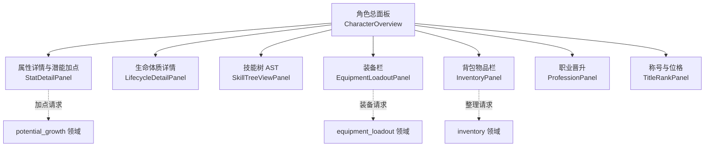
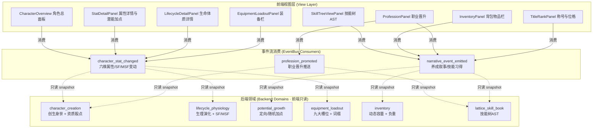
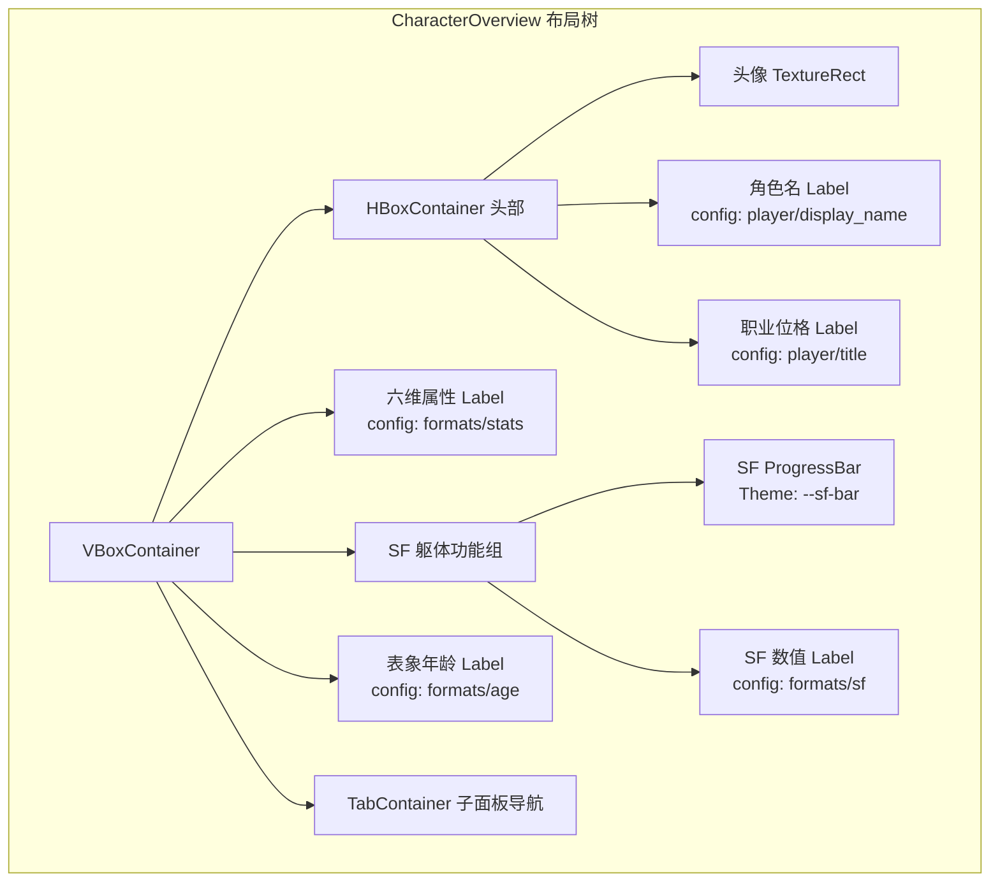
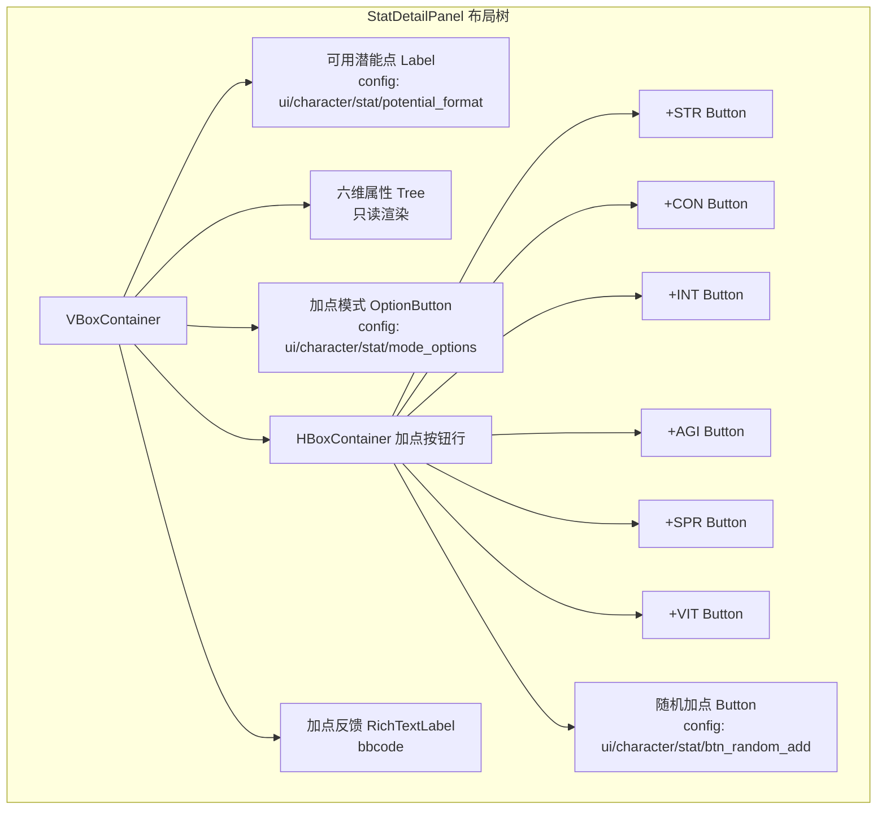
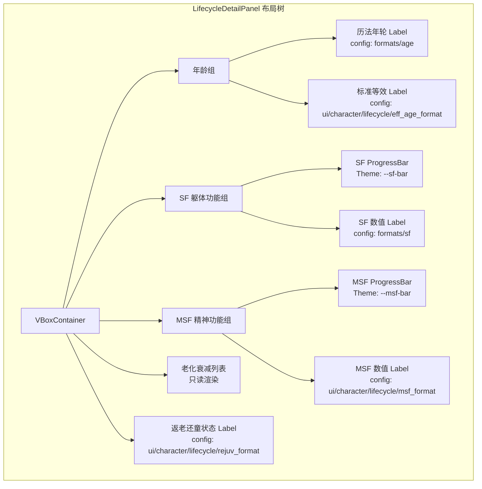
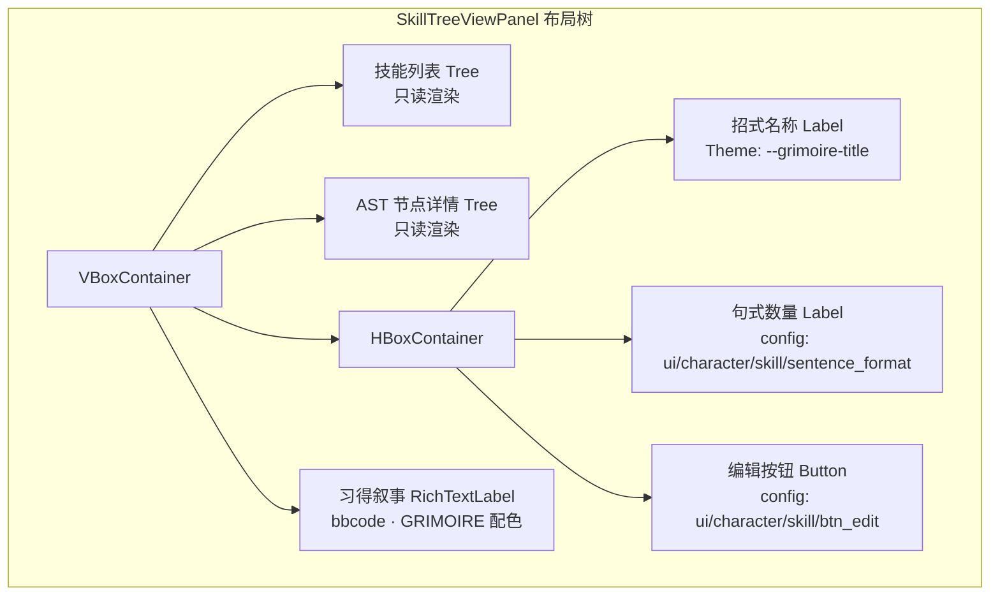
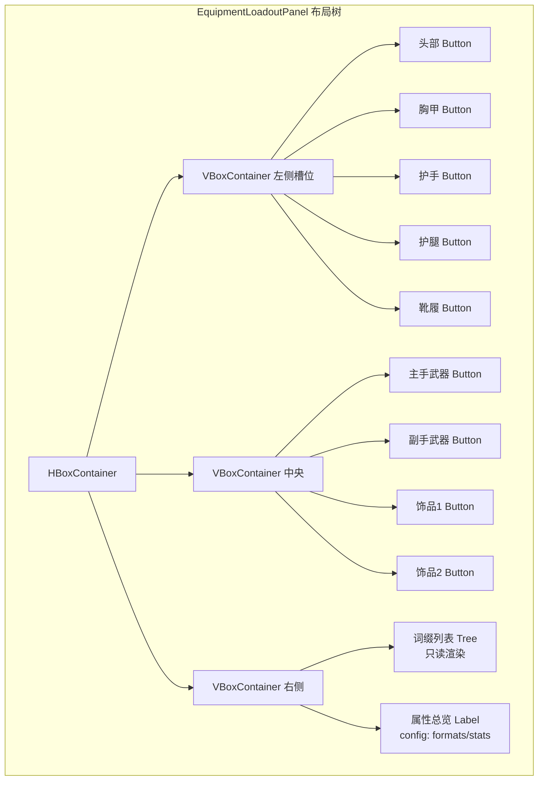
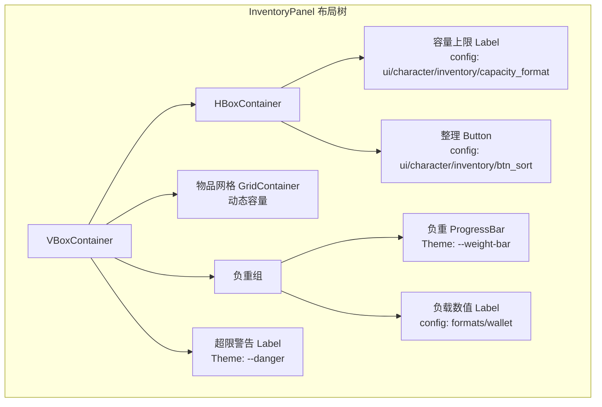
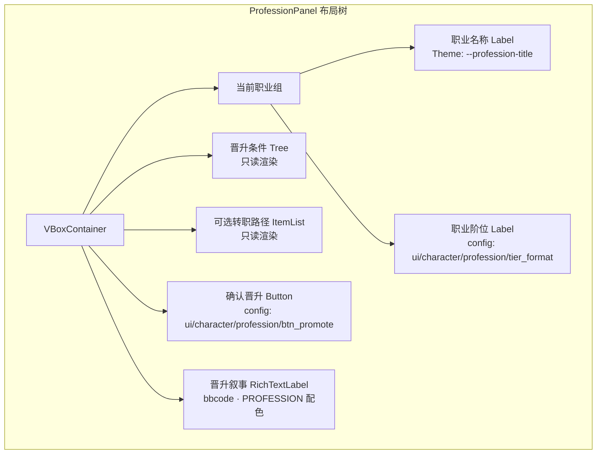
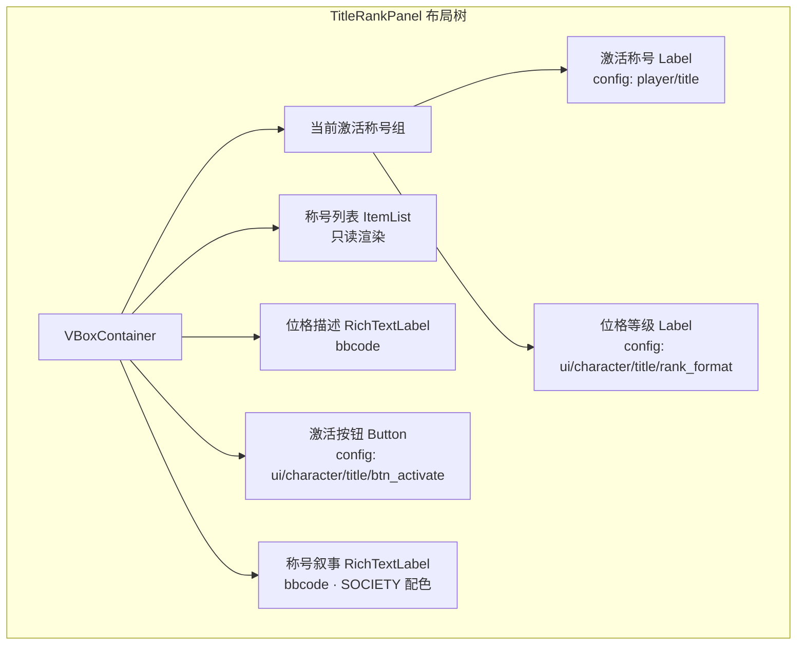

# 前端架构需求表3（第三卷：角色与养成系统）

> \[!NOTE]
> **【全局架构声明】**：本篇及全套前端技术文档中所提及的所有具体界面文案、按钮标签、配色令牌与演示数据，**均属基础演示示例（Illustrative Examples Only），绝非底层硬编码或静态写死结构**。前端表现层仅定义**事件流消费契约、视图-事件映射表、Theme 令牌层与组件可复用基座**，全部用户可见文案由 `config/frontend/ui.json` 与 `config/narratives/character.json` 驱动，全部事件分类配色由 `config/infrastructure/event_categories.json` 驱动。

***

## 一、 系统架构总览与视图模型划分 (Frontend Domain Overview)

### 1.1 架构设计理念：角色养成表现宿主 (Character Progression Presentation Host)

角色与养成系统是玩家查看自身角色全貌的核心视图集合，涵盖角色总面板、属性详情与潜能加点、生命体质详情、技能树 AST 可视化、装备栏、背包物品栏、职业晋升与称号位格共八个子视图。前端只消费 `EventBus` 的 `character_stat_changed`、`profession_promoted`、`narrative_event_emitted` 三类信号，以及 `GameConfig` 的只读配置查询，不持有任何属性计算、潜能分配、词缀重算或负重检定逻辑（全部由后端 `character_creation`、`lifecycle_physiology`、`potential_growth`、`equipment_loadout`、`inventory`、`lattice_skill_book` 六大领域负责）。

* **表现层绝对解耦**：角色视图只负责「事件流 → 属性面板渲染映射」，不做任何六维属性求解、潜能点分配或 SF/MSF 计算；
* **加点双轨透传**：定向加点与随机加点均由前端采集选择后原样透传后端 `potential_growth` 领域，前端不做概率骰点或资质校验；
* **配置驱动文案与配色**：全部属性标签、格式模板来自 `config/frontend/ui.json`（如 `formats/stats`、`formats/sf`、`formats/age`）；事件分类配色来自 `config/infrastructure/event_categories.json`。

### 1.2 角色养成视图导航流程 (Character View Navigation Flow)



### 1.3 核心子视图与事件映射 (View-Event Mapping)



***

## 二、 角色总面板 (Character Overview Panel)

### 2.1 视图职责与布局

角色总面板是养成系统的入口视图，聚合展示角色名称、六维属性（STR/CON/INT/AGI/SPR/VIT）、三大生理指标（SF 躯体功能 / MSF 精神功能 / 表象年龄）与当前职业位格。前端只消费 `character_stat_changed` 信号渲染只读快照，不做任何属性计算。

| 区域         | 节点类型      | 内容来源                                              | 说明                    |
| :----------- | :---------- | :--------------------------------------------------- | :---------------------- |
| 角色名       | Label       | `config/frontend/ui.json` → `player/display_name`    | 如「阿尔托莉雅 (玩家同构体)」 |
| 角色头像     | TextureRect | `player/portrait`                                    | 头像资源                |
| 六维属性区   | Label       | `character_stat_changed` → STR/CON/INT/AGI/SPR/VIT  | 格式读 `formats/stats`  |
| SF 躯体功能  | ProgressBar | `character_stat_changed` → `somatic_function`       | 0~100 进度条           |
| SF 数值      | Label       | `formats/sf`                                         | 如「85.3 / 100.0」      |
| 表象年龄     | Label       | `formats/age`                                        | 历法年轮 + 标准等效      |
| 职业位格     | Label       | `player/title`                                       | 动态称号位格            |
| Tab 导航     | TabContainer | 代码驱动                                              | 切换到各子面板          |

### 2.2 布局树



### 2.3 输入采集与后端透传契约

角色总面板是**纯只读渲染视图**，不采集任何用户输入，只消费后端事件流快照：

```typescript
// 后端推送的属性变动快照（前端只渲染，不计算衍生值）
interface CharacterStatChangedDTO {
  characterId: string;
  statName: string;    // str / con / int / agi / spr / vit / somatic_function / mental_function / apparent_age
  newVal: number;      // 新值原样透传
}

// 后端下发的角色只读快照（前端只渲染，不持有实体）
interface CharacterSnapshotDTO {
  displayName: string;
  title: string;              // 动态称号位格文案
  stats: {
    str: number; con: number; int: number;
    agi: number; spr: number; vit: number;
  };
  somaticFunction: number;    // SF 0~100
  mentalFunction: number;     // MSF 0~100
  rawAge: number;             // 历法年轮
  effectiveAge: number;       // 标准等效年龄
}
```

### 2.4 事件消费代码示例

```gdscript
## 角色总面板只消费属性变动事件，只读渲染六维与生理指标
func _ready() -> void:
    EventBus.get_instance().character_stat_changed.connect(_on_stat_changed)
    _render_static_fields()

func _render_static_fields() -> void:
    char_name_label.text = GameConfig.get_string(
        "frontend.ui", "player/display_name", "阿尔托莉雅 (玩家同构体)")
    prof_label.text = GameConfig.get_string(
        "frontend.ui", "player/title",
        "动态称号位格: 【剑道宗师 / 圣魔导师 / 极效魔剑士】(兼备)")

func _on_stat_changed(character_id: String, stat_name: String, new_val: Variant) -> void:
    # 只读渲染属性快照，不计算 SF/MSF 衍生值
    match stat_name:
        "str", "con", "int", "agi", "spr", "vit":
            _update_stats_display(stat_name, float(new_val))
        "somatic_function":
            sf_bar.value = float(new_val)
            sf_val_label.text = GameConfig.get_string(
                "frontend.ui", "formats/sf", "%.1f / 100.0") % float(new_val)
        "apparent_age":
            age_label.text = GameConfig.get_string(
                "frontend.ui", "formats/age",
                "历法年轮: %.1f 岁 (标准等效: %.1f 岁)") % [float(new_val), float(new_val)]

func _update_stats_display(stat_name: String, val: float) -> void:
    # 六维属性格式化渲染，格式模板读配置表
    var fmt = GameConfig.get_string(
        "frontend.ui", "formats/stats",
        "力量(STR): %.1f | 体质(CON): %.1f | 智力(INT): %.1f\n敏捷(AGI): %.1f | 精神(SPR): %.1f | 活力(VIT): %.1f")
    # 前端只更新对应字段显示，不做属性加权或资质校验
```

***

## 三、 属性详情与潜能加点 (Stat Detail & Potential Growth)

### 3.1 视图职责与布局

属性详情面板展示六维属性的当前值、上限、资质系数与可分配潜能点，支持**定向加点**（指定属性投入 1 点）与**随机加点**（投入后随机分配）双轨模式。前端只采集加点选择并透传后端 `potential_growth` 领域，不做任何概率骰点、资质校验或潜能扣减。

| 区域           | 节点类型      | 内容来源                                              | 说明                    |
| :------------- | :---------- | :--------------------------------------------------- | :---------------------- |
| 六维属性列表   | Tree         | `character_stat_changed` → 各属性快照                 | 每行：属性名/当前值/上限/资质系数 |
| 可用潜能点     | Label       | `character_stat_changed` → `available_potential`    | 剩余可分配点数只读渲染   |
| 定向加点按钮   | Button ×6   | `ui/character/stat/btn_add_str` 等                    | 透传后端定向分配         |
| 随机加点按钮   | Button      | `ui/character/stat/btn_random_add`                   | 透传后端随机分配         |
| 加点模式切换   | OptionButton | `ui/character/stat/mode_options`                    | 定向 / 随机             |
| 加点反馈区     | RichTextLabel | `narrative_event_emitted` → LIFECYCLE 分类           | 加点结果叙事             |

### 3.2 布局树



### 3.3 输入采集与后端透传契约

前端只采集加点选择（属性名 + 模式），原样透传后端 `potential_growth` 领域，不做骰点或资质校验：

```typescript
// 前端加点请求 DTO（透传后端 potential_growth 领域，前端不骰点）
interface PotentialAllocationRequestDTO {
  characterId: string;
  mode: 'directed' | 'random';     // 定向或随机双轨
  targetStat?: string;              // 定向模式指定属性（str/con/int/agi/spr/vit）
  points: number;                   // 投入点数
  // 前端不骰点、不校验资质系数、不扣减潜能池
}

// 后端返回的加点结果（前端只渲染，不判定）
interface PotentialAllocationResultDTO {
  success: boolean;
  allocatedStat?: string;           // 实际分配到的属性（随机模式后端决定）
  newStatValue?: number;            // 加点后新值
  remainingPotential: number;       // 剩余潜能点
  failReason?: string;              // 失败原因码 → narratives/character.json
}
```

### 3.4 事件消费代码示例

```gdscript
## 属性详情面板消费属性变动与叙事事件，加点请求透传后端
func _ready() -> void:
    EventBus.get_instance().character_stat_changed.connect(_on_stat_changed)
    EventBus.get_instance().narrative_event_emitted.connect(_on_narrative)

func _on_stat_changed(character_id: String, stat_name: String, new_val: Variant) -> void:
    match stat_name:
        "available_potential":
            pot_label.text = GameConfig.get_string(
                "frontend.ui", "character/stat/potential_format",
                "可分配潜能: %d") % int(new_val)
            # 潜能点为 0 时禁用加点按钮（纯 UI 状态，不判定业务规则）
            _update_button_states(int(new_val) > 0)
        _:
            _update_stat_tree(stat_name, float(new_val))

func _on_narrative_event(packet: Dictionary) -> void:
    var cat = packet.get("category", "")
    # 只消费 LIFECYCLE 分类的加点叙事
    if cat == EventBus.get_category_name("lifecycle"):
        var txt = packet.get("text", "")
        var color = _get_category_color(cat)
        feedback_log.append_text("[color=" + color + "]" + txt + "[/color]\n")

func _on_btn_add_stat(stat_name: String) -> void:
    var mode = mode_option.get_item_text(mode_option.selected)
    # 透传后端 potential_growth 领域，前端不骰点不校验
    EventBus.get_instance().emit_log("info",
        "potential_request:" + mode + ":" + stat_name)

func _on_btn_random_add_pressed() -> void:
    # 随机加点透传后端，前端不调用 RNG
    EventBus.get_instance().emit_log("info", "potential_request:random")

func _get_category_color(category_name: String) -> String:
    var categories := GameConfig.get_dict("infrastructure.event_categories", "", {})
    for key in categories:
        var entry: Dictionary = categories[key]
        if entry.get("name", "") == category_name:
            return entry.get("color", _default_category_color())
    return _default_category_color()

func _default_category_color() -> String:
    return GameConfig.get_string("infrastructure.event_categories", "_default/color", "#94a3b8")
```

***

## 四、 生命体质详情 (Lifecycle & Physiology Detail)

### 4.1 视图职责与布局

生命体质详情面板展示角色生理演化的深度数据：0-100 岁等效年龄、SF 躯体功能与 MSF 精神功能双指标、老化衰减曲线与返老还童状态。前端只消费 `character_stat_changed` 信号渲染只读快照，不做任何老化计算或返老还童操作（全部由后端 `lifecycle_physiology` 领域负责）。

| 区域           | 节点类型      | 内容来源                                              | 说明                    |
| :------------- | :---------- | :--------------------------------------------------- | :---------------------- |
| 历法年轮       | Label       | `character_stat_changed` → `raw_age`                 | 原始年龄                |
| 标准等效年龄   | Label       | `character_stat_changed` → `effective_age`           | 0-100 岁等效            |
| SF 躯体功能    | ProgressBar | `character_stat_changed` → `somatic_function`        | 0~100 红色进度条        |
| SF 数值        | Label       | `formats/sf`                                         | 如「85.3 / 100.0」      |
| MSF 精神功能   | ProgressBar | `character_stat_changed` → `mental_function`         | 0~100 蓝色进度条        |
| MSF 数值       | Label       | `ui/character/lifecycle/msf_format`                  | 如「92.1 / 100.0」      |
| 老化衰减曲线   | (预留图表)  | 1.0 文字版用数值列表                                 | 2.0 预留曲线图          |
| 返老还童状态   | Label       | `narrative_event_emitted` → LIFECYCLE 分类           | 当前返老还童状态文案    |

### 4.2 布局树



### 4.3 输入采集与后端透传契约

生命体质详情面板是**纯只读渲染视图**，不采集任何用户输入：

```typescript
// 后端推送的生理指标快照（前端只渲染，不计算 SF/MSF）
interface PhysiologySnapshotDTO {
  rawAge: number;              // 历法年轮
  effectiveAge: number;        // 标准等效年龄（0-100）
  somaticFunction: number;     // SF 0~100
  mentalFunction: number;      // MSF 0~100
  lifespanScale: number;        // 寿命缩放系数
  rejuvenationActive: boolean;  // 是否处于返老还童状态
  decayHistory: Array<{ age: number; sfLoss: number; msfLoss: number }>;
}
```

### 4.4 事件消费代码示例

```gdscript
## 生命体质详情面板只消费属性变动与叙事事件，只读渲染
func _ready() -> void:
    EventBus.get_instance().character_stat_changed.connect(_on_stat_changed)
    EventBus.get_instance().narrative_event_emitted.connect(_on_narrative)

func _on_stat_changed(character_id: String, stat_name: String, new_val: Variant) -> void:
    match stat_name:
        "raw_age":
            raw_age_label.text = GameConfig.get_string(
                "frontend.ui", "formats/age",
                "历法年轮: %.1f 岁 (标准等效: %.1f 岁)") % [float(new_val), float(new_val)]
        "effective_age":
            eff_age_label.text = GameConfig.get_string(
                "frontend.ui", "character/lifecycle/eff_age_format",
                "标准等效: %.1f / 100.0 岁") % float(new_val)
        "somatic_function":
            sf_bar.value = float(new_val)
            sf_val_label.text = GameConfig.get_string(
                "frontend.ui", "formats/sf", "%.1f / 100.0") % float(new_val)
        "mental_function":
            msf_bar.value = float(new_val)
            msf_val_label.text = GameConfig.get_string(
                "frontend.ui", "character/lifecycle/msf_format",
                "%.1f / 100.0") % float(new_val)

func _on_narrative_event(packet: Dictionary) -> void:
    var cat = packet.get("category", "")
    # 只消费 LIFECYCLE 分类的老化/返老还童叙事
    if cat == EventBus.get_category_name("lifecycle"):
        var txt = packet.get("text", "")
        var color = _get_category_color(cat)
        rejuv_label.text = txt  # 返老还童状态文案只读渲染

func _get_category_color(category_name: String) -> String:
    var categories := GameConfig.get_dict("infrastructure.event_categories", "", {})
    for key in categories:
        var entry: Dictionary = categories[key]
        if entry.get("name", "") == category_name:
            return entry.get("color", _default_category_color())
    return _default_category_color()

func _default_category_color() -> String:
    return GameConfig.get_string("infrastructure.event_categories", "_default/color", "#94a3b8")
```

***

## 五、 技能树/三维点阵 AST 可视化 (Skill Tree & Lattice AST)

### 5.1 视图职责与布局

技能树面板以三维点阵 AST（抽象语法树）结构展示角色已习得技能的招式节点拓扑。1.0 文字版以缩进树列表呈现 AST 节点；2.0 预留图形化 DAG 可视化。前端只消费 `narrative_event_emitted` 信号中 `GRIMOIRE` 分类事件渲染技能习得叙事，不做任何 AST 优化或招式编译（全部由后端 `lattice_skill_book` 领域负责，详见 表13）。

| 区域           | 节点类型      | 内容来源                                              | 说明                    |
| :------------- | :---------- | :--------------------------------------------------- | :---------------------- |
| 技能列表       | Tree         | `character_stat_changed` → `skill_list[]`            | 已习得技能树           |
| AST 节点详情   | Tree         | `narrative_event_emitted` → meta `ast_nodes`          | 节点符号/类型/连接     |
| 招式名称       | Label       | meta `skill_name`                                    | 当前选中招式           |
| 句式数量       | Label       | meta `sentence_count`                                | AST 句式数              |
| 编辑按钮       | Button      | `ui/character/skill/btn_edit`                       | 跳转魔典编辑器 · 表13   |
| 习得叙事       | RichTextLabel | `narrative_event_emitted` → GRIMOIRE 分类            | 技能习得 bbcode 日志    |

### 5.2 布局树



### 5.3 输入采集与后端透传契约

前端只采集技能选中与编辑跳转请求，透传后端 `lattice_skill_book` 领域，不做 AST 反编译或优化：

```typescript
// 后端下发的技能 AST 只读快照（前端只渲染，不编译）
interface SkillASTSnapshotDTO {
  skillId: string;
  skillName: string;
  sentenceCount: number;
  nodes: Record<string, {
    symbol: string;        // 如 STAB / FLAME
    nodeType: string;      // PHYSICAL_VERB / MAGIC_RUNE
    connections: string[];  // 连接的子节点 ID
  }>;
}

// 前端编辑请求（仅视图路由，不执行 AST 操作）
interface SkillEditRequestDTO {
  skillId: string;          // 透传后端 lattice_skill_book 领域
}
```

### 5.4 事件消费代码示例

```gdscript
## 技能树面板消费属性变动与 GRIMOIRE 分类叙事事件
func _ready() -> void:
    EventBus.get_instance().character_stat_changed.connect(_on_stat_changed)
    EventBus.get_instance().narrative_event_emitted.connect(_on_narrative)

func _on_stat_changed(character_id: String, stat_name: String, new_val: Variant) -> void:
    if stat_name == "skill_list":
        _render_skill_tree(new_val)  # 只读渲染技能列表

func _on_narrative_event(packet: Dictionary) -> void:
    var cat = packet.get("category", "")
    # 只消费 GRIMOIRE 分类的技能习得叙事
    if cat != EventBus.get_category_name("grimoire"):
        return
    var txt = packet.get("text", "")
    var meta = packet.get("meta", {})
    var color = _get_category_color(cat)
    skill_log.append_text("[color=" + color + "]" + txt + "[/color]\n")
    # AST 节点详情从 meta 只读渲染
    if meta.has("ast_nodes"):
        _render_ast_detail(meta["ast_nodes"])

func _on_btn_edit_pressed() -> void:
    # 仅路由到魔典编辑器 · 表13，前端不执行 AST 操作
    EventBus.get_instance().emit_log("info", "skill_edit_request")

func _get_category_color(category_name: String) -> String:
    var categories := GameConfig.get_dict("infrastructure.event_categories", "", {})
    for key in categories:
        var entry: Dictionary = categories[key]
        if entry.get("name", "") == category_name:
            return entry.get("color", _default_category_color())
    return _default_category_color()

func _default_category_color() -> String:
    return GameConfig.get_string("infrastructure.event_categories", "_default/color", "#94a3b8")
```

***

## 六、 装备栏 (Equipment Loadout Panel)

### 6.1 视图职责与布局

装备栏展示角色九大装备槽位（头部/胸甲/护手/护腿/靴履/主手武器/副手武器/饰品1/饰品2）及当前装备词缀即时重算后的属性总览。前端只消费 `character_stat_changed` 信号渲染词缀重算结果，不做任何词缀叠加计算或属性重算（全部由后端 `equipment_loadout` 领域负责）。

| 区域           | 节点类型      | 内容来源                                              | 说明                    |
| :------------- | :---------- | :--------------------------------------------------- | :---------------------- |
| 九大槽位       | Button ×9   | `character_stat_changed` → `equip_slots[]`           | 点击卸下/查看详情       |
| 槽位图标       | TextureRect | `equip_slots[].icon`                                 | 装备图标                |
| 槽位名称       | Label ×9   | `ui/character/equip/slot_head` 等                    | 槽位标签                |
| 词缀列表       | Tree         | `character_stat_changed` → `affixes[]`               | 当前装备词缀只读渲染    |
| 属性总览       | Label       | `character_stat_changed` → `derived_stats`           | 词缀重算后属性总览      |
| 装备详情弹窗   | PopupPanel  | `ui/character/equip/detail_*`                        | 点击槽位弹出装备详情    |

### 6.2 布局树



### 6.3 输入采集与后端透传契约

前端只采集装备卸下/替换请求，透传后端 `equipment_loadout` 领域，不做词缀重算：

```typescript
// 前端装备操作请求 DTO（透传后端 equipment_loadout 领域，前端不重算词缀）
interface EquipmentActionRequestDTO {
  slotIndex: number;          // 0~8 九大槽位
  action: 'unequip' | 'equip';
  itemInstanceId?: string;    // 装备物品实例 ID
  // 前端不计算词缀叠加、不重算属性总览
}

// 后端返回的词缀重算结果（前端只渲染，不判定）
interface EquipmentAffixResultDTO {
  slotIndex: number;
  itemName: string;
  affixes: Array<{ name: string; value: number; type: string }>;
  derivedStats: {              // 词缀重算后的属性总览
    str: number; con: number; int: number;
    agi: number; spr: number; vit: number;
  };
}
```

### 6.4 事件消费代码示例

```gdscript
## 装备栏消费属性变动事件渲染词缀重算结果，装备操作透传后端
func _ready() -> void:
    EventBus.get_instance().character_stat_changed.connect(_on_stat_changed)

func _on_stat_changed(character_id: String, stat_name: String, new_val: Variant) -> void:
    match stat_name:
        "equip_slots":
            _render_slots(new_val)  # 只读渲染九大槽位
        "derived_stats":
            # 词缀重算后的属性总览，前端只渲染不计算
            derived_label.text = GameConfig.get_string(
                "frontend.ui", "formats/stats",
                "力量(STR): %.1f | 体质(CON): %.1f | 智力(INT): %.1f\n敏捷(AGI): %.1f | 精神(SPR): %.1f | 活力(VIT): %.1f"
            ) % [float(new_val.get("str", 0)), float(new_val.get("con", 0)),
                  float(new_val.get("int", 0)), float(new_val.get("agi", 0)),
                  float(new_val.get("spr", 0)), float(new_val.get("vit", 0))]
        "affixes":
            _render_affix_tree(new_val)  # 词缀列表只读渲染

func _on_slot_pressed(slot_index: int) -> void:
    # 透传后端 equipment_loadout 领域，前端不重算词缀
    EventBus.get_instance().emit_log("info", "equip_slot_view:" + str(slot_index))

func _on_btn_unequip_pressed(slot_index: int) -> void:
    # 卸下装备透传后端，前端不修改属性
    EventBus.get_instance().emit_log("info", "equip_unequip:" + str(slot_index))
```

***

## 七、 背包物品栏 (Inventory Panel)

### 7.1 视图职责与布局

背包物品栏展示角色携带的全部物品，支持动态容量（随属性/装备扩展）与负重检定状态。前端只消费 `character_stat_changed` 信号渲染物品列表与负重状态，不做任何容量计算或负重判定（全部由后端 `inventory` 领域负责）。

| 区域           | 节点类型      | 内容来源                                              | 说明                    |
| :------------- | :---------- | :--------------------------------------------------- | :---------------------- |
| 物品网格       | GridContainer | `character_stat_changed` → `inventory_items[]`      | 动态容量物品槽位        |
| 物品图标       | TextureRect ×N | `inventory_items[].icon`                           | 物品图标                |
| 物品数量       | Label ×N    | `inventory_items[].count`                            | 堆叠数量                |
| 当前负重       | ProgressBar | `character_stat_changed` → `current_weight`         | 负重进度条              |
| 负重数值       | Label       | `formats/wallet` 中负重部分                          | 如「负重: 45.20 kg」    |
| 容量上限       | Label       | `character_stat_changed` → `max_capacity`            | 动态容量上限只读渲染    |
| 负重超限警告   | Label       | `ui/character/inventory/overweight_warning`         | 超限红色警告文案        |
| 整理按钮       | Button      | `ui/character/inventory/btn_sort`                    | 透传后端整理            |

### 7.2 布局树



### 7.3 输入采集与后端透传契约

前端只采集物品使用/丢弃/整理请求，透传后端 `inventory` 领域，不做负重检定：

```typescript
// 前端物品操作请求 DTO（透传后端 inventory 领域，前端不检定负重）
interface InventoryActionRequestDTO {
  itemInstanceId: string;
  action: 'use' | 'drop' | 'sort';
  quantity?: number;
  // 前端不检定负重是否超限、不计算容量是否够用
}

// 后端返回的物品栏快照（前端只渲染，不判定）
interface InventorySnapshotDTO {
  items: Array<{
    instanceId: string;
    itemId: string;
    name: string;
    icon: string;
    count: number;
    weightKg: number;
  }>;
  currentWeight: number;       // 当前总负重
  maxCapacity: number;         // 动态容量上限
  overweight: boolean;         // 后端检定的超限状态
}
```

### 7.4 事件消费代码示例

```gdscript
## 背包物品栏消费属性变动事件渲染物品列表与负重状态
func _ready() -> void:
    EventBus.get_instance().character_stat_changed.connect(_on_stat_changed)

func _on_stat_changed(character_id: String, stat_name: String, new_val: Variant) -> void:
    match stat_name:
        "inventory_items":
            _render_item_grid(new_val)  # 物品列表只读渲染
        "current_weight":
            weight_bar.value = float(new_val)
            weight_val_label.text = GameConfig.get_string(
                "frontend.ui", "formats/wallet",
                "金币: %d | 银币: %d | 铜币: %d | 魔单晶: %d (负重: %.2f kg)"
            ) % [0, 0, 0, 0, float(new_val)]
        "max_capacity":
            capacity_label.text = GameConfig.get_string(
                "frontend.ui", "character/inventory/capacity_format",
                "容量: %d / %d") % [int(new_val), int(new_val)]
            weight_bar.max_value = float(new_val)
        "overweight":
            # 超限警告只读渲染，前端不检定
            overweight_label.visible = bool(new_val)

func _on_btn_sort_pressed() -> void:
    # 透传后端 inventory 领域整理，前端不排序
    EventBus.get_instance().emit_log("info", "inventory_sort_request")

func _on_item_clicked(instance_id: String) -> void:
    # 物品详情透传后端，前端不解析物品属性
    EventBus.get_instance().emit_log("info", "inventory_item_view:" + instance_id)
```

***

## 八、 职业晋升面板 (Profession Promotion Panel)

### 8.1 视图职责与布局

职业晋升面板展示角色当前职业体系、已达成晋升条件与可选转职路径。前端只消费 `profession_promoted` 信号渲染晋升结果快照，不做任何资质校验或晋升条件判定（全部由后端 `character_creation` 与 `lattice_skill_book` 领域负责）。

| 区域           | 节点类型      | 内容来源                                              | 说明                    |
| :------------- | :---------- | :--------------------------------------------------- | :---------------------- |
| 当前职业       | Label       | `profession_promoted` → `profession_archetype.name`  | 当前职业名称            |
| 职业阶位       | Label       | `profession_archetype.tier`                          | 职业阶位等级            |
| 晋升条件列表   | Tree         | `profession_promoted` → `promotion_conditions[]`     | 条件达成状态只读渲染    |
| 可选转职路径   | ItemList    | `profession_promoted` → `available_paths[]`          | 可选转职方向            |
| 确认晋升按钮   | Button      | `ui/character/profession/btn_promote`                | 透传后端晋升            |
| 晋升叙事       | RichTextLabel | `narrative_event_emitted` → PROFESSION 分类          | 晋升 bbcode 叙事       |

### 8.2 布局树



### 8.3 输入采集与后端透传契约

前端只采集晋升选择并透传后端，不做资质校验：

```typescript
// 后端推送的职业晋升快照（前端只渲染，不判定条件）
interface ProfessionPromotedDTO {
  characterId: string;
  professionArchetype: {
    name: string;                // 职业名称
    tier: number;               // 阶位等级
    promotionConditions: Array<{ condition: string; met: boolean }>;
    availablePaths: Array<{ pathId: string; pathName: string; requirements: string }>;
  };
}

// 前端晋升请求 DTO（透传后端，前端不校验资质）
interface ProfessionPromotionRequestDTO {
  characterId: string;
  targetPathId: string;        // 选择的转职路径
  // 前端不检查晋升条件是否满足，全部由后端判定
}
```

### 8.4 事件消费代码示例

```gdscript
## 职业晋升面板消费 profession_promoted 信号与 PROFESSION 分类叙事
func _ready() -> void:
    EventBus.get_instance().profession_promoted.connect(_on_profession_promoted)
    EventBus.get_instance().narrative_event_emitted.connect(_on_narrative)

func _on_profession_promoted(character_id: String, profession_archetype: Dictionary) -> void:
    # 只读渲染职业晋升快照，不校验资质
    var name = profession_archetype.get("name", "")
    var tier = profession_archetype.get("tier", 0)
    prof_name_label.text = name
    prof_tier_label.text = GameConfig.get_string(
        "frontend.ui", "character/profession/tier_format", "阶位: %d") % int(tier)
    # 晋升条件与可选路径只读渲染
    var conditions = profession_archetype.get("promotion_conditions", [])
    var paths = profession_archetype.get("available_paths", [])
    _render_conditions(conditions)
    _render_paths(paths)

func _on_narrative_event(packet: Dictionary) -> void:
    var cat = packet.get("category", "")
    # 只消费 PROFESSION 分类的晋升叙事
    if cat != EventBus.get_category_name("profession"):
        return
    var txt = packet.get("text", "")
    var color = _get_category_color(cat)
    log.append_text("[color=" + color + "]" + txt + "[/color]\n")

func _on_btn_promote_pressed() -> void:
    var selected = path_list.get_item_metadata(path_list.selected)
    # 透传后端晋升，前端不校验资质条件
    EventBus.get_instance().emit_log("info", "profession_promote:" + str(selected))

func _get_category_color(category_name: String) -> String:
    var categories := GameConfig.get_dict("infrastructure.event_categories", "", {})
    for key in categories:
        var entry: Dictionary = categories[key]
        if entry.get("name", "") == category_name:
            return entry.get("color", _default_category_color())
    return _default_category_color()

func _default_category_color() -> String:
    return GameConfig.get_string("infrastructure.event_categories", "_default/color", "#94a3b8")
```

***

## 九、 称号系统与动态位格展示 (Title & Dynamic Rank Display)

### 9.1 视图职责与布局

称号系统面板展示角色已获得的全部称号、当前激活称号与动态位格展示。位格由后端根据职业阶位、属性资质与成就综合计算，前端只消费 `character_stat_changed` 与 `profession_promoted` 信号渲染只读快照，不做任何位格计算或称号激活逻辑。

| 区域           | 节点类型      | 内容来源                                              | 说明                    |
| :------------- | :---------- | :--------------------------------------------------- | :---------------------- |
| 当前激活称号   | Label       | `config/frontend/ui.json` → `player/title`           | 动态称号位格文案        |
| 称号列表       | ItemList    | `character_stat_changed` → `titles[]`                | 已获得称号列表          |
| 位格等级       | Label       | `character_stat_changed` → `rank_level`              | 位格等级只读渲染        |
| 位格描述       | RichTextLabel | `character_stat_changed` → `rank_description`       | 位格详细描述 bbcode     |
| 激活按钮       | Button      | `ui/character/title/btn_activate`                   | 透传后端切换激活称号    |
| 获得称号叙事   | RichTextLabel | `narrative_event_emitted` → SOCIETY 分类            | 获得称号 bbcode 叙事    |

### 9.2 布局树



### 9.3 输入采集与后端透传契约

前端只采集称号激活请求并透传后端，不做位格计算：

```typescript
// 后端推送的称号位格快照（前端只渲染，不计算位格）
interface TitleRankSnapshotDTO {
  activeTitle: string;           // 当前激活称号文案
  rankLevel: number;             // 位格等级（后端综合计算）
  rankDescription: string;       // 位格详细描述
  titles: Array<{
    titleId: string;
    titleText: string;           // 称号文案
    source: string;              // 获得来源
    isActive: boolean;
  }>;
}

// 前端称号激活请求（透传后端，前端不计算位格变化）
interface TitleActivateRequestDTO {
  titleId: string;              // 选择的称号
  // 前端不计算激活后位格变化，全部由后端重算
}
```

### 9.4 事件消费代码示例

```gdscript
## 称号位格面板消费属性变动与叙事事件，只读渲染位格快照
func _ready() -> void:
    EventBus.get_instance().character_stat_changed.connect(_on_stat_changed)
    EventBus.get_instance().narrative_event_emitted.connect(_on_narrative)
    _render_active_title()

func _render_active_title() -> void:
    active_title_label.text = GameConfig.get_string(
        "frontend.ui", "player/title",
        "动态称号位格: 【剑道宗师 / 圣魔导师 / 极效魔剑士】(兼备)")

func _on_stat_changed(character_id: String, stat_name: String, new_val: Variant) -> void:
    match stat_name:
        "rank_level":
            rank_level_label.text = GameConfig.get_string(
                "frontend.ui", "character/title/rank_format", "位格: %d") % int(new_val)
        "rank_description":
            rank_desc_label.text = str(new_val)
        "titles":
            _render_title_list(new_val)  # 称号列表只读渲染

func _on_narrative_event(packet: Dictionary) -> void:
    var cat = packet.get("category", "")
    # 只消费 SOCIETY 分类的称号获得叙事
    if cat != EventBus.get_category_name("society"):
        return
    var txt = packet.get("text", "")
    var color = _get_category_color(cat)
    log.append_text("[color=" + color + "]" + txt + "[/color]\n")

func _on_btn_activate_pressed() -> void:
    var selected = title_list.get_item_metadata(title_list.selected)
    # 透传后端切换激活称号，前端不重算位格
    EventBus.get_instance().emit_log("info", "title_activate:" + str(selected))

func _get_category_color(category_name: String) -> String:
    var categories := GameConfig.get_dict("infrastructure.event_categories", "", {})
    for key in categories:
        var entry: Dictionary = categories[key]
        if entry.get("name", "") == category_name:
            return entry.get("color", _default_category_color())
    return _default_category_color()

func _default_category_color() -> String:
    return GameConfig.get_string("infrastructure.event_categories", "_default/color", "#94a3b8")
```

***

## 十、 Theme 令牌与配色规范 (Theme Tokens)

角色与养成系统的全部配色由 Theme 令牌层统一管理，与 `event_categories.json` 对齐：

| UI 元素       | 配色来源                                 | 令牌              | 兜底默认值                        |
| :------------ | :------------------------------------- | :--------------- | :--------------------------- |
| 面板背景       | Theme                                  | `--panel-bg`     | `Color(0.08, 0.10, 0.16, 0.95)` |
| SF 躯体功能条  | Theme                                  | `--sf-bar`        | `Color(0.97, 0.53, 0.53, 1)` |
| MSF 精神功能条 | Theme                                  | `--msf-bar`       | `Color(0.40, 0.60, 0.97, 1)` |
| 负重条         | Theme                                  | `--weight-bar`    | `Color(0.98, 0.79, 0.25, 1)` |
| 超限警告       | Theme                                  | `--danger`        | `Color(0.97, 0.53, 0.53, 1)` |
| 职业标题       | Theme                                  | `--profession-title` | `Color(0.96, 0.45, 0.71, 1)` |
| 招式标题       | Theme                                  | `--grimoire-title`  | `Color(0.75, 0.52, 0.98, 1)` |
| 生命周期事件   | `event_categories.json` → `lifecycle`   | `#fbbf24`        | —                            |
| 魔典事件       | `event_categories.json` → `grimoire`  | `#c084fc`        | —                            |
| 职业事件       | `event_categories.json` → `profession`  | `#f472b6`        | —                            |
| 社交事件       | `event_categories.json` → `society`    | `#94a3b8`        | —                            |
| 默认事件       | `event_categories.json` → `_default`   | `#94a3b8`        | —                            |

***

## 十一、 验收矩阵 (DoD Matrix)

| 验收项            | 验收标准                                            | 验证方式                                               |
| :--------------- | :----------------------------------------------- | :------------------------------------------------- |
| 八子视图可达       | 角色总面板 Tab 可切换到全部七个子面板，无崩溃                  | 手动走查 Tab 导航                                    |
| 六维属性实时刷新   | `character_stat_changed` 信号触发后六维数值更新            | 触发属性变动断言                                    |
| SF/MSF 实时渲染   | 生理指标变动后进度条与数值同步更新                          | 触发生理演化断言                                    |
| 加点双轨透传       | 定向/随机加点请求原样透传后端，前端不骰点                     | `rg "randi\|randf\|DeterministicRNG" frontend/views/character*` 无命中 |
| 词缀即时重算       | 装备变动后属性总览由后端重算推送，前端不计算                    | `rg "calculate_affix\|recompute" frontend/` 无命中  |
| 负重只读渲染       | 背包负重数值由后端推送，前端不检定超限                         | `rg "check_weight\|overweight_check" frontend/` 无命中 |
| 职业晋升只读       | 晋升条件由后端判定，前端不校验资质                          | `rg "check_qualification\|meets_requirement" frontend/` 无命中 |
| 称号位格后端算     | 位格等级由后端综合计算推送，前端不计算                        | `rg "calculate_rank\|compute_rank" frontend/` 无命中 |
| 文案零硬编码       | 全部属性格式/称号/职业文案来自配置表                       | `rg "力量\|体质\|智力" frontend/views/character*` 仅命中配置读取 |
| 配色配置驱动       | 删除 `event_categories.json` 某分类后回退默认色            | 配置表删键后验证                                    |
| 零逻辑纪律         | 前端代码无 `Solver`/`FSM`/`DeterministicRNG` 调用          | `rg "Solver\|FSM\|DeterministicRNG" frontend/` 无命中 |
