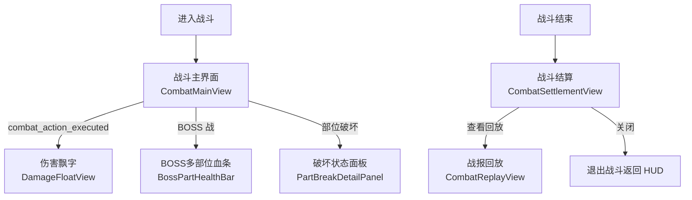
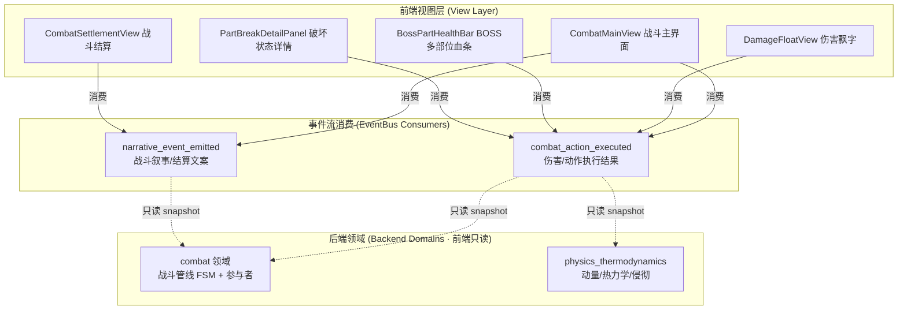
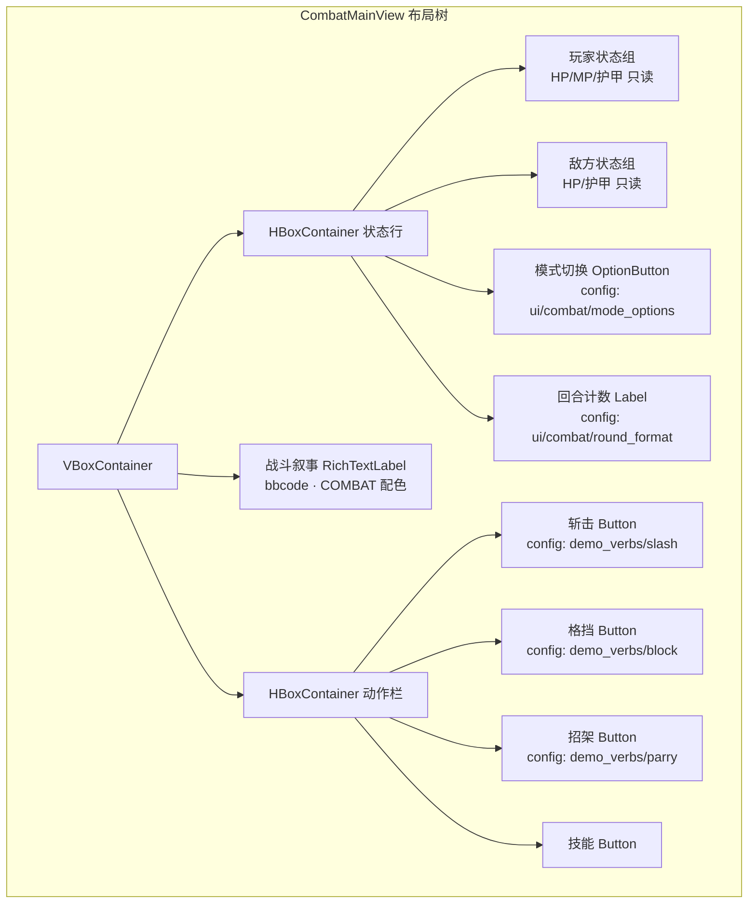
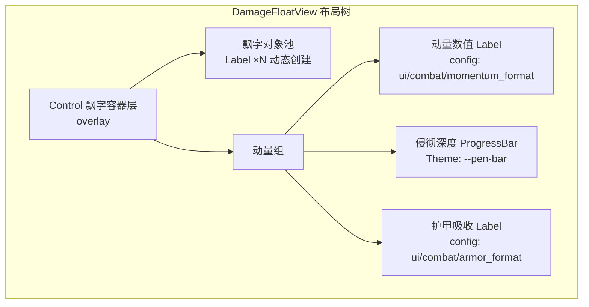
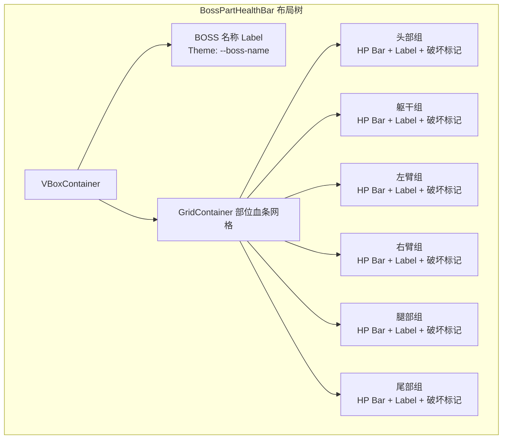
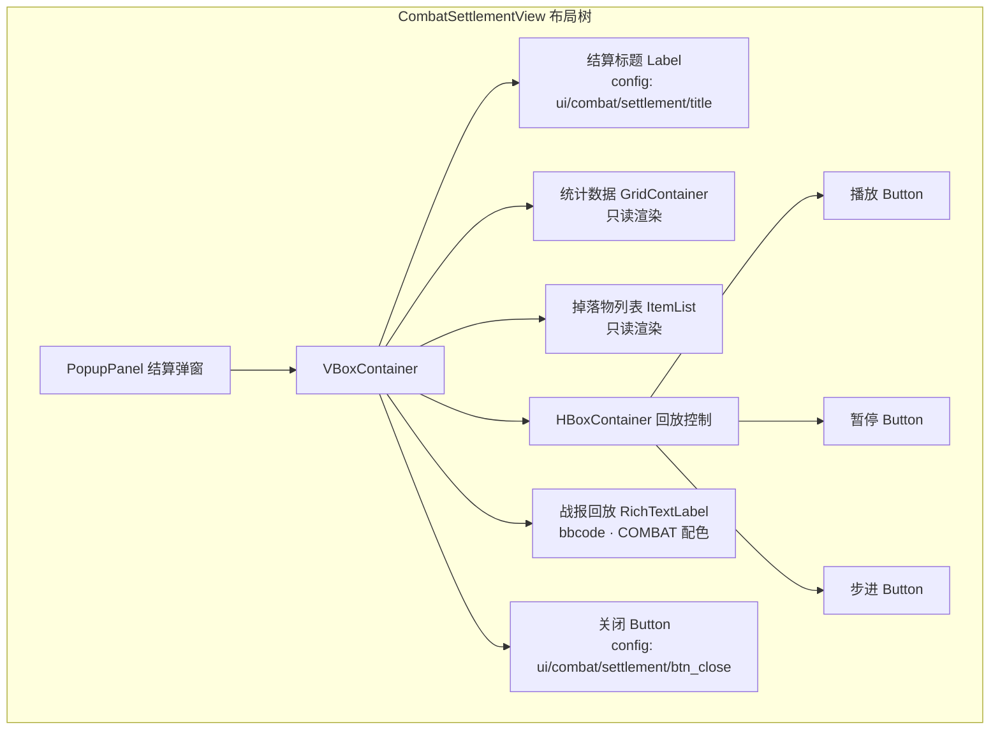
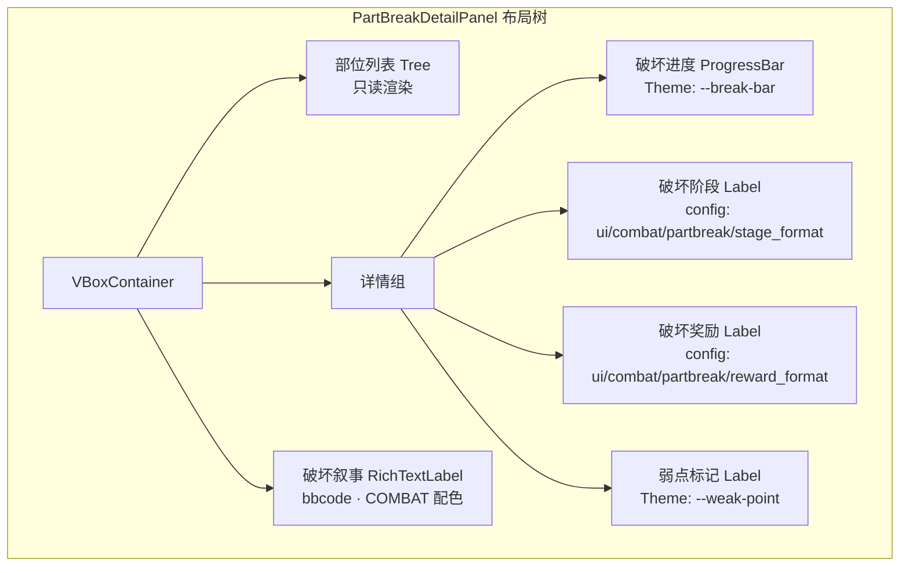

# 前端架构需求表4（第四卷：战斗界面系统）

> \[!NOTE]
> **【全局架构声明】**：本篇及全套前端技术文档中所提及的所有具体界面文案、按钮标签、配色令牌与演示数据，**均属基础演示示例（Illustrative Examples Only），绝非底层硬编码或静态写死结构**。前端表现层仅定义**事件流消费契约、视图-事件映射表、Theme 令牌层与组件可复用基座**，全部用户可见文案由 `config/frontend/ui.json` 与 `config/narratives/combat.json` 驱动，全部事件分类配色由 `config/infrastructure/event_categories.json` 驱动。

***

## 一、 系统架构总览与视图模型划分 (Frontend Domain Overview)

### 1.1 架构设计理念：战斗表现宿主 (Combat Presentation Host)

战斗界面系统是玩家在战斗场景中消费战斗事件流的核心视图集合，涵盖战斗主界面、伤害飘字与动量侵彻可视化、BOSS 多部位独立血条、战斗结算与战报回放、多部位破坏状态详情面板共五个子视图。前端只消费 `EventBus` 的 `combat_action_executed` 与 `narrative_event_emitted` 两类信号，以及 `GameConfig` 的只读配置查询，不持有任何伤害计算、动量求解或战斗状态机推进逻辑（全部由后端 `combat` 与 `physics_thermodynamics` 两大领域负责）。

* **表现层绝对解耦**：战斗视图只负责「战斗事件 → 飘字/血条/战报渲染映射」，不做任何伤害公式计算、护甲穿透求解或动量侵彻判定；
* **回合/实时双态预留**：1.0 文字版以回合制叙事为主，前端布局预留实时模式切换开关，事件消费契约两种模式完全一致；
* **配置驱动文案与配色**：全部战斗动词标签、伤害格式、结算文案来自 `config/frontend/ui.json`（如 `demo_verbs/slash`）；战斗事件分类配色来自 `config/infrastructure/event_categories.json` 的 `combat` 分类。

### 1.2 战斗流程与视图切换 (Combat Flow & View Switching)



### 1.3 核心子视图与事件映射 (View-Event Mapping)



***

## 二、 战斗主界面 (Combat Main View)

### 2.1 视图职责与布局

战斗主界面是战斗场景的常驻容器，展示战斗参与者状态、回合/实时模式切换与动作指令栏。前端只消费 `combat_action_executed` 信号渲染战斗结果快照，不做任何伤害计算或战斗状态机推进。回合/实时双态预留切换开关，事件消费契约两种模式完全一致。

| 区域           | 节点类型      | 内容来源                                              | 说明                    |
| :------------- | :---------- | :--------------------------------------------------- | :---------------------- |
| 玩家状态区     | VBoxContainer | `combat_action_executed` → `player_state`            | HP/MP/护甲只读渲染      |
| 敌方状态区     | VBoxContainer | `combat_action_executed` → `enemy_state`             | 敌方 HP/护甲只读渲染    |
| 战斗叙事区     | RichTextLabel | `narrative_event_emitted` → COMBAT 分类              | bbcode 战斗叙事         |
| 动作指令栏     | HBoxContainer | `ui/combat/btn_slash` 等                              | 攻击/格挡/招架/技能     |
| 模式切换       | OptionButton | `ui/combat/mode_options`                              | 回合制/实时预留         |
| 回合计数       | Label       | `combat_action_executed` → `round_count`             | 当前回合数只读渲染      |

### 2.2 布局树



### 2.3 输入采集与后端透传契约

前端只采集动作选择（动词 + 参数），原样透传后端 `combat` 领域执行，不做伤害计算：

```typescript
// 前端战斗动作请求 DTO（透传后端 combat 领域，前端不计算伤害）
interface CombatActionRequestDTO {
  actorId: string;            // 动作发起者 ID
  targetId: string;           // 目标 ID
  verb: string;               // 动作动词（SLASH / BLOCK / PARRY / 自定义技能）
  weaponParams?: {            // 武器参数透传（前端不校验）
    massKg: number;
    velocity: number;
    edgeSharpness: number;
  };
  // 前端不计算伤害值、不判定护甲穿透、不推进战斗 FSM
}

// 后端推送的战斗动作执行结果（前端只渲染，不判定）
interface CombatActionExecutedDTO {
  actorId: string;
  targetId: string;
  verb: string;
  damage?: number;            // 后端计算的伤害值
  momentum?: number;           // 后端计算的动量
  penetration?: number;        // 后端计算的侵彻深度
  targetRemainingHp?: number; // 目标剩余 HP
  armorAbsorbed?: number;      // 护甲吸收量
  criticalHit?: boolean;       // 是否暴击
  partHit?: string;            // 命中部位（BOSS 战）
}
```

### 2.4 事件消费代码示例

```gdscript
## 战斗主界面消费战斗动作与叙事事件，动作请求透传后端
func _ready() -> void:
    EventBus.get_instance().combat_action_executed.connect(_on_combat_action)
    EventBus.get_instance().narrative_event_emitted.connect(_on_narrative)
    narrative_log.scroll_following = true

func _on_combat_action(action_data: Dictionary) -> void:
    # 只读渲染战斗结果快照，不计算伤害
    var actor = action_data.get("actor_id", "")
    var target = action_data.get("target_id", "")
    var verb = action_data.get("verb", "")
    var damage = action_data.get("damage", 0.0)
    var remaining_hp = action_data.get("target_remaining_hp", 0.0)
    # 更新敌方 HP 显示
    _update_enemy_hp(float(remaining_hp))
    # 伤害飘字触发（由 DamageFloatView 消费同一事件）
    var color = _get_category_color(EventBus.get_category_name("combat"))
    narrative_log.append_text(
        "[color=" + color + "][" + verb + "] 造成 " + str(damage) + " 伤害[/color]\n")

func _on_narrative_event(packet: Dictionary) -> void:
    var cat = packet.get("category", "")
    if cat != EventBus.get_category_name("combat"):
        return
    var txt = packet.get("text", "")
    var color = _get_category_color(cat)
    narrative_log.append_text("[color=" + color + "]" + txt + "[/color]\n")

func _on_btn_slash_pressed() -> void:
    # 透传后端 combat 领域执行斩击，前端不计算伤害
    EventBus.get_instance().emit_log("info",
        "combat_action:SLASH:" + GameConfig.get_string("frontend.ui", "demo_verbs/slash", "SLASH"))

func _on_btn_block_pressed() -> void:
    EventBus.get_instance().emit_log("info",
        "combat_action:BLOCK:" + GameConfig.get_string("frontend.ui", "demo_verbs/block", "BLOCK"))

func _on_btn_parry_pressed() -> void:
    EventBus.get_instance().emit_log("info",
        "combat_action:PARRY:" + GameConfig.get_string("frontend.ui", "demo_verbs/parry", "PARRY"))

func _get_category_color(category_name: String) -> String:
    var categories := GameConfig.get_dict("infrastructure.event_categories", "", {})
    for key in categories:
        var entry: Dictionary = categories[key]
        if entry.get("name", "") == category_name:
            return entry.get("color", _default_category_color())
    return _default_category_color()

func _default_category_color() -> String:
    return GameConfig.get_string("infrastructure.event_categories", "_default/color", "#94a3b8")
```

***

## 三、 伤害飘字与动量侵彻可视化 (Damage Float & Momentum Penetration)

### 3.1 视图职责与布局

伤害飘字视图在战斗主界面上方动态浮现伤害数值与动量侵彻可视化。1.0 文字版以文字飘字动画呈现；2.0 预留粒子动效。前端只消费 `combat_action_executed` 信号中的伤害与动量字段渲染飘字，不做任何伤害公式或动量求解计算。

| 区域           | 节点类型      | 内容来源                                              | 说明                    |
| :------------- | :---------- | :--------------------------------------------------- | :---------------------- |
| 伤害飘字       | Label ×N   | `combat_action_executed` → `damage`                   | 浮动伤害数值动画        |
| 暴击标记       | Label       | `combat_action_executed` → `critical_hit`             | 暴击黄色高亮            |
| 动量数值       | Label       | `combat_action_executed` → `momentum`                 | 动量 kg·m/s 展示        |
| 侵彻深度       | ProgressBar | `combat_action_executed` → `penetration`              | 侵彻深度进度条          |
| 护甲吸收       | Label       | `combat_action_executed` → `armor_absorbed`          | 护甲吸收量灰色展示      |
| 飘字容器       | Control     | 代码驱动 Tween 动画                                   | 飘字浮动动画容器        |

### 3.2 布局树



### 3.3 输入采集与后端透传契约

伤害飘字视图是**纯只读渲染视图**，不采集任何用户输入：

```typescript
// 后端推送的战斗动作结果（前端只渲染飘字，不计算伤害）
interface CombatActionExecutedDTO {
  damage?: number;            // 后端计算的最终伤害
  momentum?: number;           // 后端计算的动量（kg·m/s）
  penetration?: number;        // 后端计算的侵彻深度
  armorAbsorbed?: number;      // 后端计算的护甲吸收量
  criticalHit?: boolean;       // 后端判定的暴击
  damageType?: string;         // 伤害类型（物理/魔法/热力学）
}

// 前端飘字渲染参数（纯 UI 状态，不透传后端）
interface DamageFloatRenderState {
  text: string;                // 飘字文本（从配置模板格式化）
  color: string;               // 飘字颜色（从 event_categories.json 取）
  position: Vector2;          // 飘字起始位置
  floatDuration: number;      // 浮动动画时长
  isCritical: boolean;         // 暴击放大效果
}
```

### 3.4 事件消费代码示例

```gdscript
## 伤害飘字视图消费战斗动作事件，只读渲染伤害与动量
func _ready() -> void:
    EventBus.get_instance().combat_action_executed.connect(_on_combat_action)

func _on_combat_action(action_data: Dictionary) -> void:
    var damage = float(action_data.get("damage", 0.0))
    var momentum = float(action_data.get("momentum", 0.0))
    var penetration = float(action_data.get("penetration", 0.0))
    var armor_absorbed = float(action_data.get("armor_absorbed", 0.0))
    var is_crit = bool(action_data.get("critical_hit", false))

    # 伤害飘字动画（从配置模板格式化文案，不计算伤害值）
    var fmt = GameConfig.get_string(
        "frontend.ui", "combat/damage_format", "%.1f")
    var color = _get_float_color(is_crit)
    _spawn_damage_float(fmt % damage, color, is_crit)

    # 动量与侵彻只读渲染
    mom_val_label.text = GameConfig.get_string(
        "frontend.ui", "combat/momentum_format", "动量: %.1f kg·m/s") % momentum
    pen_bar.value = penetration
    armor_abs_label.text = GameConfig.get_string(
        "frontend.ui", "combat/armor_format", "护甲吸收: %.1f") % armor_absorbed

func _spawn_damage_float(text: String, color: String, is_crit: bool) -> void:
    var label = Label.new()
    label.text = text
    label.add_theme_color_override("font_color", Color.from_string(color, Color.WHITE))
    if is_crit:
        label.add_theme_font_size_override("font_size", 28)  # 暴击放大
    else:
        label.add_theme_font_size_override("font_size", 18)
    # Tween 浮动动画（纯 UI 表现，不涉及后端逻辑）
    add_child(label)
    var tween = create_tween()
    tween.tween_property(label, "position:y", label.position.y - 60, 1.0)
    tween.tween_property(label, "modulate:a", 0.0, 0.5)
    tween.tween_callback(label.queue_free)

func _get_float_color(is_crit: bool) -> String:
    if is_crit:
        return GameConfig.get_string("frontend.ui", "combat/crit_color", "#fbbf24")
    return _get_category_color(EventBus.get_category_name("combat"))

func _get_category_color(category_name: String) -> String:
    var categories := GameConfig.get_dict("infrastructure.event_categories", "", {})
    for key in categories:
        var entry: Dictionary = categories[key]
        if entry.get("name", "") == category_name:
            return entry.get("color", _default_category_color())
    return _default_category_color()

func _default_category_color() -> String:
    return GameConfig.get_string("infrastructure.event_categories", "_default/color", "#94a3b8")
```

***

## 四、 BOSS 多部位独立血条 (Boss Multi-Part Health Bar)

### 4.1 视图职责与布局

BOSS 多部位血条视图在 BOSS 战中展示 BOSS 各独立部位（头/躯干/左臂/右臂/腿/尾等）的独立 HP 条与破坏状态。前端只消费 `combat_action_executed` 信号中 `part_hit` 与各部位 HP 字段渲染独立血条，不做任何部位破坏判定或血量计算。

| 区域           | 节点类型      | 内容来源                                              | 说明                    |
| :------------- | :---------- | :--------------------------------------------------- | :---------------------- |
| BOSS 名称       | Label       | `combat_action_executed` → `boss_name`               | BOSS 名称               |
| 部位血条 ×N    | ProgressBar ×N | `combat_action_executed` → `parts[].hp`            | 各部位独立 HP 条        |
| 部位名称       | Label ×N   | `combat_action_executed` → `parts[].name`            | 部位名称标签            |
| 部位 HP 数值   | Label ×N   | `combat_action_executed` → `parts[].hp`              | 各部位 HP 数值          |
| 破坏标记       | Label ×N   | `combat_action_executed` → `parts[].destroyed`       | 已破坏部位灰色标记      |
| 命中高亮       | (动效)     | `combat_action_executed` → `part_hit`                | 命中部位闪烁高亮        |

### 4.2 布局树



### 4.3 输入采集与后端透传契约

BOSS 多部位血条视图是**纯只读渲染视图**，不采集任何用户输入：

```typescript
// 后端推送的 BOSS 部位状态快照（前端只渲染，不计算部位 HP）
interface BossPartHealthSnapshotDTO {
  bossId: string;
  bossName: string;
  parts: Array<{
    partId: string;             // 部位 ID
    name: string;               // 部位名称文案
    hp: number;                 // 当前 HP（后端计算）
    maxHp: number;              // 最大 HP
    destroyed: boolean;         // 后端判定的破坏状态
    destroyReward?: string;     // 破坏奖励描述
  }>;
  partHit?: string;             // 本次命中的部位 ID
}
```

### 4.4 事件消费代码示例

```gdscript
## BOSS 多部位血条消费战斗动作事件，只读渲染各部位 HP
func _ready() -> void:
    EventBus.get_instance().combat_action_executed.connect(_on_combat_action)

func _on_combat_action(action_data: Dictionary) -> void:
    var boss_name = action_data.get("boss_name", "")
    var parts = action_data.get("parts", [])
    var part_hit = action_data.get("part_hit", "")
    if not boss_name.is_empty():
        boss_name_label.text = boss_name
    # 各部位 HP 只读渲染，不计算部位破坏条件
    for part in parts:
        _render_part_hp(part)
    # 命中部位高亮（纯 UI 表现）
    if not part_hit.is_empty():
        _highlight_part(part_hit)

func _render_part_hp(part: Dictionary) -> void:
    var part_id = part.get("part_id", "")
    var hp = float(part.get("hp", 0.0))
    var max_hp = float(part.get("max_hp", 100.0))
    var destroyed = bool(part.get("destroyed", false))
    var bar = _get_part_bar(part_id)
    if bar:
        bar.value = hp
        bar.max_value = max_hp
        # 已破坏部位灰色标记
        if destroyed:
            bar.modulate = Color(0.4, 0.4, 0.4, 0.6)
```

***

## 五、 战斗结算与战报回放 (Combat Settlement & Replay)

### 5.1 视图职责与布局

战斗结算视图在战斗结束后弹出，展示战斗统计（总伤害/承受伤害/回合数/掉落物）与战报全文回放。前端只消费 `narrative_event_emitted` 信号中 COMBAT 分类结算文案渲染只读快照，不做任何掉落物计算或经验分配。

| 区域           | 节点类型      | 内容来源                                              | 说明                    |
| :------------- | :---------- | :--------------------------------------------------- | :---------------------- |
| 结算标题       | Label       | `ui/combat/settlement/title`                          | 如「战斗胜利」          |
| 统计数据       | GridContainer | `narrative_event_emitted` → meta `settlement_stats`   | 总伤害/承受/回合/掉落   |
| 掉落物列表     | ItemList    | meta `loot[]`                                         | 掉落物品只读列表        |
| 战报回放区     | RichTextLabel | `narrative_event_emitted` → COMBAT 分类全文           | bbcode 战报全文回放     |
| 关闭按钮       | Button      | `ui/combat/settlement/btn_close`                     | 关闭返回 HUD            |
| 回放控制       | HBoxContainer | `ui/combat/settlement/btn_replay_*`                  | 播放/暂停/步进          |

### 5.2 布局树



### 5.3 输入采集与后端透传契约

前端只采集回放控制（播放/暂停/步进）与关闭请求，不做任何掉落计算：

```typescript
// 后端推送的战斗结算快照（前端只渲染，不计算掉落/经验）
interface CombatSettlementDTO {
  result: 'victory' | 'defeat' | 'flee';
  stats: {
    totalDamageDealt: number;
    totalDamageTaken: number;
    roundCount: number;
    durationTicks: number;
  };
  loot: Array<{ itemId: string; name: string; count: number }>;
  experienceGained?: number;
  replayLog: string[];         // 战报全文行数组（bbcode）
}

// 前端回放控制请求（纯 UI 状态，不透传后端）
interface ReplayControlState {
  playing: boolean;
  currentLineIndex: number;    // 当前回放行索引
}
```

### 5.4 事件消费代码示例

```gdscript
## 战斗结算视图消费 COMBAT 分类叙事事件，回放控制纯 UI 状态
var replay_lines: Array = []
var replay_index: int = 0

func _ready() -> void:
    EventBus.get_instance().narrative_event_emitted.connect(_on_narrative)
    replay_log.scroll_following = false  # 回放模式不自动追尾

func _on_narrative_event(packet: Dictionary) -> void:
    var cat = packet.get("category", "")
    # 只消费 COMBAT 分类的结算与战报
    if cat != EventBus.get_category_name("combat"):
        return
    var txt = packet.get("text", "")
    var meta = packet.get("meta", {})
    var color = _get_category_color(cat)
    # 战报行缓存供回放使用
    replay_lines.append("[color=" + color + "]" + txt + "[/color]")
    # 结算统计数据从 meta 只读渲染
    if meta.has("settlement_stats"):
        _render_settlement_stats(meta["settlement_stats"])
    if meta.has("loot"):
        _render_loot(meta["loot"])

func _on_btn_play_pressed() -> void:
    # 回放控制纯 UI 状态，不透传后端
    set_process(true)

func _on_btn_step_pressed() -> void:
    if replay_index < replay_lines.size():
        replay_log.append_text(replay_lines[replay_index] + "\n")
        replay_index += 1

func _on_btn_close_pressed() -> void:
    visible = false
    replay_lines.clear()
    replay_index = 0
    replay_log.clear()

func _get_category_color(category_name: String) -> String:
    var categories := GameConfig.get_dict("infrastructure.event_categories", "", {})
    for key in categories:
        var entry: Dictionary = categories[key]
        if entry.get("name", "") == category_name:
            return entry.get("color", _default_category_color())
    return _default_category_color()

func _default_category_color() -> String:
    return GameConfig.get_string("infrastructure.event_categories", "_default/color", "#94a3b8")
```

***

## 六、 多部位破坏状态详情面板 (Part Break Detail Panel)

### 6.1 视图职责与布局

多部位破坏状态详情面板展示 BOSS 各部位的破坏进度、破坏奖励与当前破坏阶段。前端只消费 `combat_action_executed` 信号中部位破坏字段渲染只读快照，不做任何破坏阈值判定或奖励计算。

| 区域           | 节点类型      | 内容来源                                              | 说明                    |
| :------------- | :---------- | :--------------------------------------------------- | :---------------------- |
| 部位列表       | Tree         | `combat_action_executed` → `parts[]`                  | 各部位破坏进度树        |
| 破坏进度       | ProgressBar | `combat_action_executed` → `parts[].break_progress`   | 0~100% 破坏进度        |
| 破坏阶段       | Label       | `combat_action_executed` → `parts[].break_stage`      | 如「完好/裂纹/破碎」    |
| 破坏奖励       | Label       | `combat_action_executed` → `parts[].destroy_reward`   | 破坏后奖励描述          |
| 弱点标记       | Label       | `combat_action_executed` → `parts[].weak_point`       | 弱点部位高亮            |
| 破坏叙事       | RichTextLabel | `narrative_event_emitted` → COMBAT 分类              | 部位破坏 bbcode 叙事   |

### 6.2 布局树



### 6.3 输入采集与后端透传契约

多部位破坏状态详情面板是**纯只读渲染视图**，不采集任何用户输入：

```typescript
// 后端推送的部位破坏状态快照（前端只渲染，不计算破坏阈值）
interface PartBreakSnapshotDTO {
  partId: string;
  partName: string;
  breakProgress: number;       // 0~1 破坏进度（后端计算）
  breakStage: string;          // 破坏阶段文案（完好/裂纹/破碎）
  destroyed: boolean;
  destroyReward?: string;      // 破坏奖励描述
  weakPoint: boolean;          // 是否为弱点部位
  weakPointMultiplier?: number; // 弱点伤害倍率（后端计算）
}
```

### 6.4 事件消费代码示例

```gdscript
## 多部位破坏状态面板消费战斗动作事件，只读渲染破坏进度
func _ready() -> void:
    EventBus.get_instance().combat_action_executed.connect(_on_combat_action)
    EventBus.get_instance().narrative_event_emitted.connect(_on_narrative)

func _on_combat_action(action_data: Dictionary) -> void:
    var parts = action_data.get("parts", [])
    # 各部位破坏进度只读渲染，不计算破坏阈值
    for part in parts:
        _render_part_break(part)

func _render_part_break(part: Dictionary) -> void:
    var part_id = part.get("part_id", "")
    var break_progress = float(part.get("break_progress", 0.0))
    var break_stage = part.get("break_stage", "")
    var reward = part.get("destroy_reward", "")
    var is_weak = bool(part.get("weak_point", false))
    # 破坏进度与阶段只读渲染
    break_bar.value = break_progress * 100.0
    break_stage_label.text = GameConfig.get_string(
        "frontend.ui", "combat/partbreak/stage_format", "阶段: %s") % break_stage
    reward_label.text = GameConfig.get_string(
        "frontend.ui", "combat/partbreak/reward_format", "奖励: %s") % reward
    # 弱点高亮（纯 UI 表现）
    weak_label.visible = is_weak

func _on_narrative_event(packet: Dictionary) -> void:
    var cat = packet.get("category", "")
    if cat != EventBus.get_category_name("combat"):
        return
    var txt = packet.get("text", "")
    var color = _get_category_color(cat)
    log.append_text("[color=" + color + "]" + txt + "[/color]\n")

func _get_category_color(category_name: String) -> String:
    var categories := GameConfig.get_dict("infrastructure.event_categories", "", {})
    for key in categories:
        var entry: Dictionary = categories[key]
        if entry.get("name", "") == category_name:
            return entry.get("color", _default_category_color())
    return _default_category_color()

func _default_category_color() -> String:
    return GameConfig.get_string("infrastructure.event_categories", "_default/color", "#94a3b8")
```

***

## 七、 Theme 令牌与配色规范 (Theme Tokens)

战斗界面系统的全部配色由 Theme 令牌层统一管理，与 `event_categories.json` 对齐：

| UI 元素       | 配色来源                                 | 令牌              | 兜底默认值                        |
| :------------ | :------------------------------------- | :--------------- | :--------------------------- |
| 战斗背景       | Theme                                  | `--combat-bg`    | `Color(0.04, 0.05, 0.08, 1)` |
| 玩家 HP 条     | Theme                                  | `--player-hp`    | `Color(0.20, 0.83, 0.60, 1)` |
| 敌方 HP 条     | Theme                                  | `--enemy-hp`     | `Color(0.97, 0.40, 0.40, 1)` |
| 伤害飘字       | `event_categories.json` → `combat`     | `#f87171`        | —                            |
| 暴击飘字       | Theme                                  | `--crit`         | `Color(0.98, 0.75, 0.14, 1)` |
| 侵彻进度条     | Theme                                  | `--pen-bar`      | `Color(0.97, 0.53, 0.53, 1)` |
| 破坏进度条     | Theme                                  | `--break-bar`    | `Color(0.96, 0.45, 0.71, 1)` |
| 弱点标记       | Theme                                  | `--weak-point`   | `Color(0.98, 0.75, 0.14, 1)` |
| BOSS 名称      | Theme                                  | `--boss-name`    | `Color(0.97, 0.40, 0.40, 1)` |
| 战斗事件       | `event_categories.json` → `combat`     | `#f87171`        | —                            |
| 默认事件       | `event_categories.json` → `_default`   | `#94a3b8`        | —                            |

***

## 八、 验收矩阵 (DoD Matrix)

| 验收项            | 验收标准                                            | 验证方式                                               |
| :--------------- | :----------------------------------------------- | :------------------------------------------------- |
| 五子视图可达       | 战斗主界面可唤出全部四个子视图，无崩溃                       | 手动走查                                            |
| 伤害飘字实时渲染   | `combat_action_executed` 信号触发后飘字动画播放            | 触发战斗动作断言                                    |
| 伤害值后端算       | 飘字伤害值由后端推送，前端不计算伤害公式                       | `rg "calculate_damage\|damage_formula" frontend/` 无命中 |
| 动量侵彻后端算     | 动量与侵彻深度由后端推送，前端不求解                          | `rg "momentum\|penetration" frontend/` 仅命中渲染读取 |
| BOSS 部位独立血条 | 各部位 HP 独立渲染，破坏后灰色标记                          | BOSS 战走查                                        |
| 部位破坏后端判     | 破坏阈值由后端判定，前端不计算                              | `rg "break_threshold\|destroy_check" frontend/` 无命中 |
| 结算掉落后端算     | 掉落物列表由后端推送，前端不计算掉落概率                       | `rg "drop_rate\|loot_roll" frontend/` 无命中       |
| 回放控制纯UI      | 回放播放/暂停/步进为前端 UI 状态，不透传后端                    | 代码走查                                            |
| 文案零硬编码       | 全部战斗动词/伤害格式/结算文案来自配置表                     | `rg "斩击\|格挡\|招架" frontend/views/combat*` 仅命中配置读取 |
| 配色配置驱动       | 删除 `event_categories.json` combat 分类后回退默认色       | 配置表删键后验证                                    |
| 零逻辑纪律         | 前端代码无 `CombatPipelineFSM`/`Solver`/`DeterministicRNG` 调用 | `rg "CombatPipelineFSM\|Solver\|DeterministicRNG" frontend/` 无命中 |
| 回合/实时双态预留   | 模式切换下拉框存在且切换不影响事件消费契约                     | 切换模式后触发战斗动作验证事件消费不变                |
