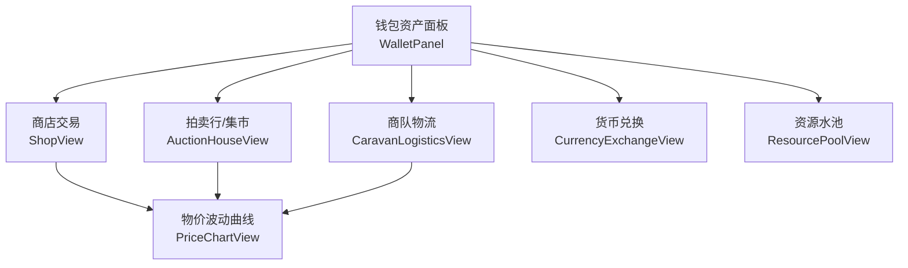
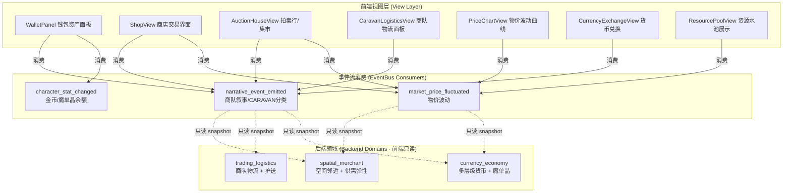
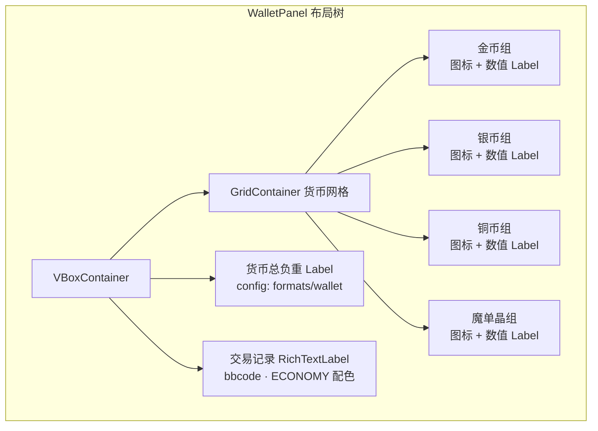
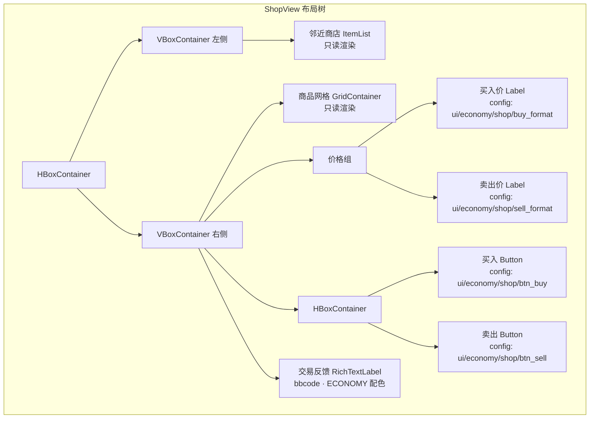
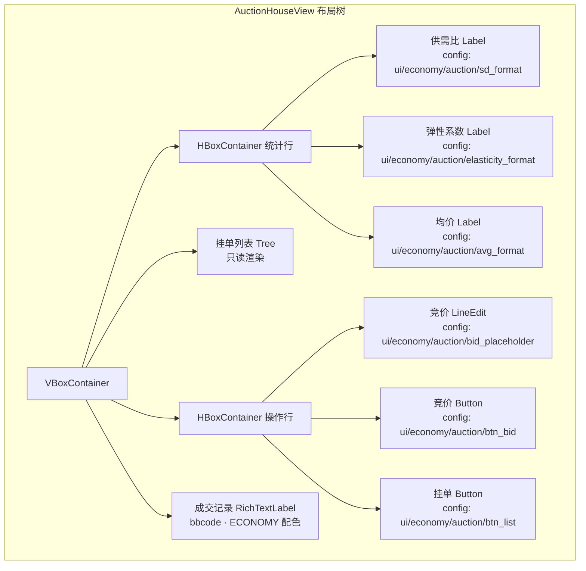
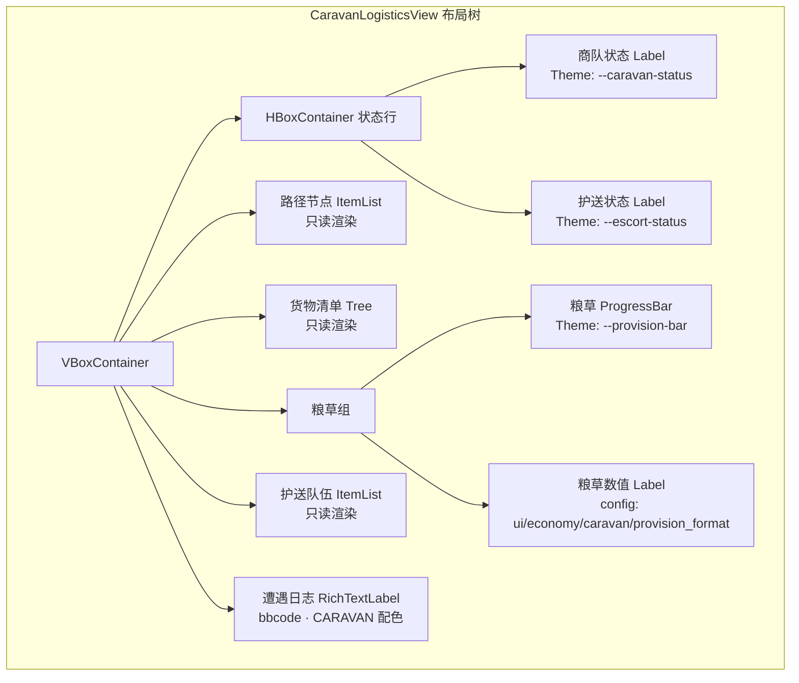
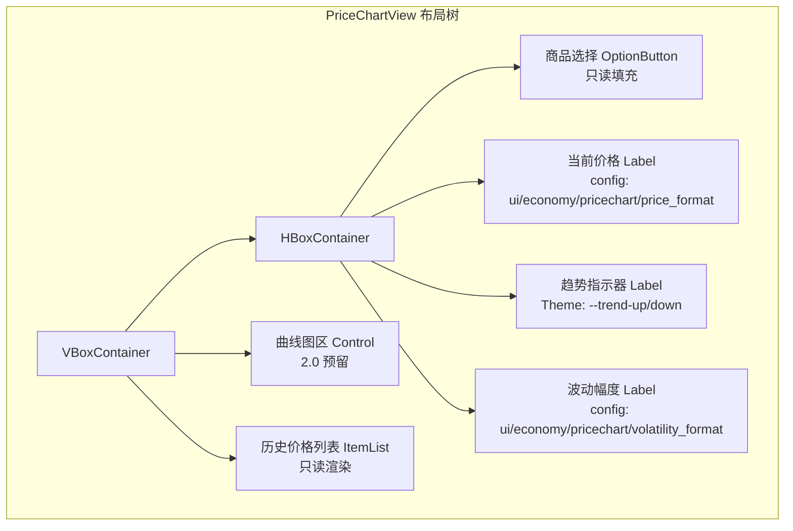
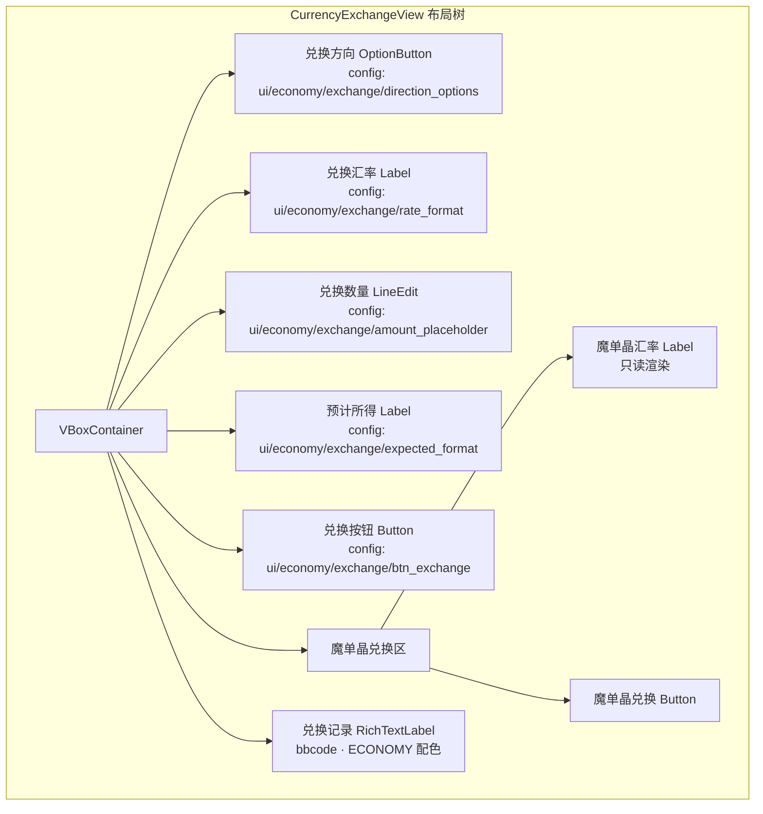
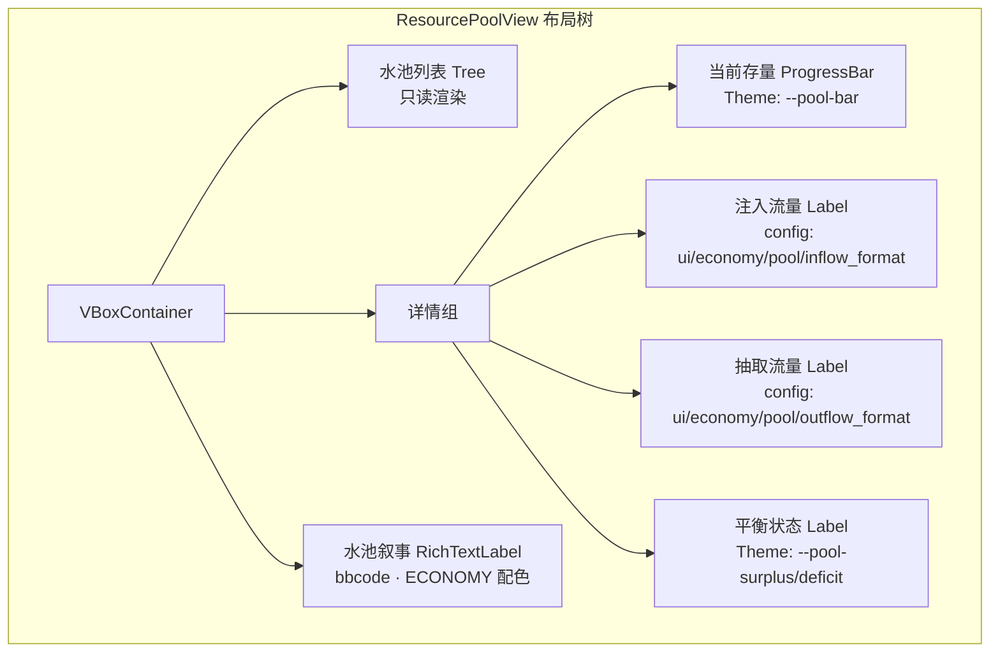

# 前端架构需求表5（第五卷：经济与交易系统）

> \[!NOTE]
> **【全局架构声明】**：本篇及全套前端技术文档中所提及的所有具体界面文案、按钮标签、配色令牌与演示数据，**均属基础演示示例（Illustrative Examples Only），绝非底层硬编码或静态写死结构**。前端表现层仅定义**事件流消费契约、视图-事件映射表、Theme 令牌层与组件可复用基座**，全部用户可见文案由 `config/frontend/ui.json` 与 `config/narratives/economy.json` 驱动，全部事件分类配色由 `config/infrastructure/event_categories.json` 驱动。

***

## 一、 系统架构总览与视图模型划分 (Frontend Domain Overview)

### 1.1 架构设计理念：经济交易表现宿主 (Economy & Trade Presentation Host)

经济与交易系统是玩家管理资产、参与市场与物流的核心视图集合，涵盖钱包资产面板、商店交易界面、拍卖行/集市、商队物流面板、物价波动曲线图、货币兑换与资源水池展示共七个子视图。前端只消费 `EventBus` 的 `market_price_fluctuated` 与 `narrative_event_emitted` 两类信号，以及 `GameConfig` 的只读配置查询，不持有任何定价计算、供需弹性求解或商队路径规划逻辑（全部由后端 `currency_economy`、`trading_logistics`、`spatial_merchant` 三大领域负责）。

* **表现层绝对解耦**：经济视图只负责「市场价格事件 → 钱包/曲线/水池渲染映射」，不做任何价格计算、税率扣除或货币兑换求解；
* **空间邻近感知只读**：商店交易界面的空间邻近感知由后端 `spatial_merchant` 领域计算并推送，前端只渲染邻近商店列表，不做距离或拓扑计算；
* **配置驱动文案与配色**：全部货币标签、交易格式、物价文案来自 `config/frontend/ui.json`（如 `formats/wallet`）；经济事件分类配色来自 `config/infrastructure/event_categories.json` 的 `economy` 分类。

### 1.2 经济交易视图导航流程 (Economy View Navigation Flow)



### 1.3 核心子视图与事件映射 (View-Event Mapping)



***

## 二、 钱包资产面板 (Wallet Asset Panel)

### 2.1 视图职责与布局

钱包资产面板展示角色持有的多层级金属货币（金币/银币/铜币）与魔单晶余额，以及货币总负重。前端只消费 `character_stat_changed` 信号渲染只读快照，不做任何货币换算或负重计算（全部由后端 `currency_economy` 领域负责）。

| 区域           | 节点类型      | 内容来源                                              | 说明                    |
| :------------- | :---------- | :--------------------------------------------------- | :---------------------- |
| 金币余额       | Label       | `config/frontend/ui.json` → `player/wallet/gold`     | 金币数量只读渲染        |
| 银币余额       | Label       | `player/wallet/silver`                               | 银币数量只读渲染        |
| 铜币余额       | Label       | `player/wallet/copper`                               | 铜币数量只读渲染        |
| 魔单晶余额     | Label       | `player/wallet/mana_monocrystals`                    | 魔单晶数量只读渲染      |
| 货币总负重     | Label       | `formats/wallet` 中负重部分                          | 总负重 kg 只读渲染      |
| 交易记录       | RichTextLabel | `narrative_event_emitted` → ECONOMY 分类             | 近期交易 bbcode 记录    |

### 2.2 布局树



### 2.3 输入采集与后端透传契约

钱包资产面板是**纯只读渲染视图**，不采集任何用户输入：

```typescript
// 后端推送的货币余额快照（前端只渲染，不计算换算）
interface WalletSnapshotDTO {
  gold: number;
  silver: number;
  copper: number;
  manaMonocrystals: number;
  totalWeightKg: number;       // 后端计算的货币总负重
}

// 前端格式化模板（读配置表，不硬编码）
// config/frontend/ui.json → formats/wallet:
// "金币: %d | 银币: %d | 铜币: %d | 魔单晶: %d (负重: %.2f kg)"
```

### 2.4 事件消费代码示例

```gdscript
## 钱包资产面板消费属性变动与叙事事件，只读渲染货币余额
func _ready() -> void:
    EventBus.get_instance().character_stat_changed.connect(_on_stat_changed)
    EventBus.get_instance().narrative_event_emitted.connect(_on_narrative)
    _render_wallet()

func _render_wallet() -> void:
    # 货币余额从配置表演示数据初始化，实际值由后端事件推送更新
    var gold = GameConfig.get_int("frontend.ui", "player/wallet/gold", 50)
    var silver = GameConfig.get_int("frontend.ui", "player/wallet/silver", 20)
    var copper = GameConfig.get_int("frontend.ui", "player/wallet/copper", 500)
    var mana = GameConfig.get_int("frontend.ui", "player/wallet/mana_monocrystals", 5)
    # 货币总负重由后端计算推送，前端不计算
    wallet_label.text = GameConfig.get_string(
        "frontend.ui", "formats/wallet",
        "金币: %d | 银币: %d | 铜币: %d | 魔单晶: %d (负重: %.2f kg)"
    ) % [gold, silver, copper, mana, 0.0]

func _on_stat_changed(character_id: String, stat_name: String, new_val: Variant) -> void:
    # 货币余额只读渲染，不计算换算或负重
    match stat_name:
        "gold", "silver", "copper", "mana_monocrystals", "wallet_weight":
            _render_wallet()

func _on_narrative_event(packet: Dictionary) -> void:
    var cat = packet.get("category", "")
    # 只消费 ECONOMY 分类的交易记录
    if cat != EventBus.get_category_name("economy"):
        return
    var txt = packet.get("text", "")
    var color = _get_category_color(cat)
    log.append_text("[color=" + color + "]" + txt + "[/color]\n")

func _get_category_color(category_name: String) -> String:
    var categories := GameConfig.get_dict("infrastructure.event_categories", "", {})
    for key in categories:
        var entry: Dictionary = categories[key]
        if entry.get("name", "") == category_name:
            return entry.get("color", _default_category_color())
    return _default_category_color()

func _default_category_color() -> String:
    return GameConfig.get_string("infrastructure.event_categories", "_default/color", "#94a3b8")
```

***

## 三、 商店交易界面 (Shop Trading View)

### 3.1 视图职责与布局

商店交易界面展示后端 `spatial_merchant` 领域计算的空间邻近商店列表与商品价格。前端只消费 `market_price_fluctuated` 信号渲染价格快照，不做任何距离计算、税率扣除或库存校验。空间邻近感知由后端推送，前端只渲染。

| 区域           | 节点类型      | 内容来源                                              | 说明                    |
| :------------- | :---------- | :--------------------------------------------------- | :---------------------- |
| 邻近商店列表   | ItemList    | `market_price_fluctuated` → meta `nearby_shops[]`    | 空间邻接商店只读列表    |
| 商品网格       | GridContainer | `market_price_fluctuated` → meta `items[]`          | 商品图标/名称/价格      |
| 当前选中商品   | Label       | meta `items[].selected`                              | 选中商品详情            |
| 买入价格       | Label       | meta `items[].buy_price`                              | 买入价只读渲染          |
| 卖出价格       | Label       | meta `items[].sell_price`                             | 卖出价只读渲染          |
| 买入按钮       | Button      | `ui/economy/shop/btn_buy`                            | 透传后端购买            |
| 卖出按钮       | Button      | `ui/economy/shop/btn_sell`                           | 透传后端出售            |
| 交易反馈       | RichTextLabel | `narrative_event_emitted` → ECONOMY 分类             | 交易结果 bbcode 反馈    |

### 3.2 布局树



### 3.3 输入采集与后端透传契约

前端只采集买/卖请求（商品 ID + 数量），原样透传后端 `currency_economy` 领域，不做价格计算或库存校验：

```typescript
// 前端交易请求 DTO（透传后端 currency_economy 领域，前端不计算价格）
interface TradeRequestDTO {
  shopId: string;              // 商店 ID
  itemId: string;              // 商品 ID
  action: 'buy' | 'sell';
  quantity: number;
  // 前端不计算总价、不扣减余额、不校验库存
}

// 后端推送的市场价格快照（前端只渲染，不计算供需弹性）
interface MarketPriceFluctuatedDTO {
  townId: string;
  itemId: string;
  newPrice: number;            // 后端计算的新价格
  nearbyShops?: Array<{        // 空间邻近商店（后端计算拓扑）
    shopId: string; name: string; distance: number;
  }>;
  items?: Array<{
    itemId: string; name: string; icon: string;
    buyPrice: number; sellPrice: number; stock: number;
  }>;
}
```

### 3.4 事件消费代码示例

```gdscript
## 商店交易界面消费市场价格事件与叙事事件，交易请求透传后端
func _ready() -> void:
    EventBus.get_instance().market_price_fluctuated.connect(_on_price_fluctuated)
    EventBus.get_instance().narrative_event_emitted.connect(_on_narrative)

func _on_price_fluctuated(town_id: String, item_id: String, new_price: int) -> void:
    # 商品价格只读渲染，不计算供需弹性
    buy_price_label.text = GameConfig.get_string(
        "frontend.ui", "economy/shop/buy_format", "买入: %d") % new_price
    sell_price_label.text = GameConfig.get_string(
        "frontend.ui", "economy/shop/sell_format", "卖出: %d") % int(new_price * 0.8)

func _on_narrative_event(packet: Dictionary) -> void:
    var cat = packet.get("category", "")
    if cat != EventBus.get_category_name("economy"):
        return
    var txt = packet.get("text", "")
    var meta = packet.get("meta", {})
    var color = _get_category_color(cat)
    log.append_text("[color=" + color + "]" + txt + "[/color]\n")
    # 空间邻近商店列表从 meta 只读渲染
    if meta.has("nearby_shops"):
        _render_nearby_shops(meta["nearby_shops"])

func _on_btn_buy_pressed() -> void:
    # 透传后端 currency_economy 领域购买，前端不扣减余额
    EventBus.get_instance().emit_log("info", "trade_buy:" + selected_item_id)

func _on_btn_sell_pressed() -> void:
    # 透传后端出售，前端不计算税率
    EventBus.get_instance().emit_log("info", "trade_sell:" + selected_item_id)

func _get_category_color(category_name: String) -> String:
    var categories := GameConfig.get_dict("infrastructure.event_categories", "", {})
    for key in categories:
        var entry: Dictionary = categories[key]
        if entry.get("name", "") == category_name:
            return entry.get("color", _default_category_color())
    return _default_category_color()

func _default_category_color() -> String:
    return GameConfig.get_string("infrastructure.event_categories", "_default/color", "#94a3b8")
```

***

## 四、 拍卖行/集市 (Auction House & Market)

### 4.1 视图职责与布局

拍卖行/集市界面展示供需弹性定价的实时挂单列表与价格走势。前端只消费 `market_price_fluctuated` 信号渲染供需弹性定价展示，不做任何供需曲线计算或弹性系数求解。

| 区域           | 节点类型      | 内容来源                                              | 说明                    |
| :------------- | :---------- | :--------------------------------------------------- | :---------------------- |
| 挂单列表       | Tree         | `market_price_fluctuated` → meta `listings[]`         | 买/卖挂单树状列表       |
| 供需指示器     | Label       | meta `supply_demand_ratio`                           | 供需比只读渲染          |
| 弹性系数       | Label       | meta `elasticity_coefficient`                        | 供需弹性系数只读展示    |
| 当前均价       | Label       | meta `average_price`                                 | 均价只读渲染            |
| 竞价输入       | LineEdit    | `ui/economy/auction/bid_placeholder`                 | 玩家输入竞价金额        |
| 确认竞价按钮   | Button      | `ui/economy/auction/btn_bid`                        | 透传后端竞价            |
| 挂单按钮       | Button      | `ui/economy/auction/btn_list`                        | 透传后端挂单            |
| 成交记录       | RichTextLabel | `narrative_event_emitted` → ECONOMY 分类             | 成交 bbcode 记录        |

### 4.2 布局树



### 4.3 输入采集与后端透传契约

前端只采集竞价金额与挂单请求，原样透传后端，不做供需弹性计算：

```typescript
// 前端竞价请求 DTO（透传后端 currency_economy 领域，前端不计算弹性）
interface AuctionBidRequestDTO {
  listingId: string;           // 挂单 ID
  bidAmount: number;           // 玩家输入的竞价金额原样透传
  // 前端不校验竞价是否高于当前价、不计算供需弹性
}

// 前端挂单请求 DTO（透传后端，前端不定价）
interface AuctionListRequestDTO {
  itemId: string;
  quantity: number;
  askPrice: number;            // 玩家设定的要价原样透传
  // 前端不计算建议价、不判定定价是否合理
}

// 后端推送的供需弹性快照（前端只渲染，不计算）
interface SupplyDemandSnapshotDTO {
  supplyDemandRatio: number;   // 供需比（后端计算）
  elasticityCoefficient: number; // 弹性系数（后端计算）
  averagePrice: number;        // 均价（后端计算）
  listings: Array<{
    listingId: string; itemId: string; type: 'buy' | 'sell';
    price: number; quantity: number;
  }>;
}
```

### 4.4 事件消费代码示例

```gdscript
## 拍卖行消费市场价格事件与叙事事件，竞价/挂单透传后端
func _ready() -> void:
    EventBus.get_instance().market_price_fluctuated.connect(_on_price_fluctuated)
    EventBus.get_instance().narrative_event_emitted.connect(_on_narrative)

func _on_price_fluctuated(town_id: String, item_id: String, new_price: int) -> void:
    # 供需弹性定价只读渲染，不计算弹性系数
    avg_price_label.text = GameConfig.get_string(
        "frontend.ui", "economy/auction/avg_format", "均价: %d") % new_price

func _on_narrative_event(packet: Dictionary) -> void:
    var cat = packet.get("category", "")
    if cat != EventBus.get_category_name("economy"):
        return
    var txt = packet.get("text", "")
    var meta = packet.get("meta", {})
    var color = _get_category_color(cat)
    log.append_text("[color=" + color + "]" + txt + "[/color]\n")
    # 供需弹性数据从 meta 只读渲染
    if meta.has("supply_demand_ratio"):
        sd_ratio_label.text = GameConfig.get_string(
            "frontend.ui", "economy/auction/sd_format", "供需比: %.2f"
        ) % float(meta["supply_demand_ratio"])
    if meta.has("elasticity_coefficient"):
        elasticity_label.text = GameConfig.get_string(
            "frontend.ui", "economy/auction/elasticity_format", "弹性: %.2f"
        ) % float(meta["elasticity_coefficient"])

func _on_btn_bid_pressed() -> void:
    # 透传后端竞价，前端不计算弹性或校验竞价
    EventBus.get_instance().emit_log("info", "auction_bid:" + bid_input.text)

func _on_btn_list_pressed() -> void:
    # 透传后端挂单，前端不定价
    EventBus.get_instance().emit_log("info", "auction_list_request")

func _get_category_color(category_name: String) -> String:
    var categories := GameConfig.get_dict("infrastructure.event_categories", "", {})
    for key in categories:
        var entry: Dictionary = categories[key]
        if entry.get("name", "") == category_name:
            return entry.get("color", _default_category_color())
    return _default_category_color()

func _default_category_color() -> String:
    return GameConfig.get_string("infrastructure.event_categories", "_default/color", "#94a3b8")
```

***

## 五、 商队物流面板与护送状态 (Caravan Logistics & Escort Status)

### 5.1 视图职责与布局

商队物流面板展示玩家商队的行进路径、货物清单、粮草消耗与护送状态。前端只消费 `narrative_event_emitted` 信号中 `CARAVAN` 分类事件渲染只读快照，不做任何路径规划、粮草计算或遭遇判定（全部由后端 `trading_logistics` 领域负责）。

| 区域           | 节点类型      | 内容来源                                              | 说明                    |
| :------------- | :---------- | :--------------------------------------------------- | :---------------------- |
| 商队状态       | Label       | `narrative_event_emitted` → meta `caravan_status`     | 行进中/休整/遭遇        |
| 路径节点       | ItemList    | meta `route_nodes[]`                                 | 商队路径节点列表        |
| 货物清单       | Tree         | meta `cargo[]`                                       | 货物列表只读渲染        |
| 粮草存量       | ProgressBar | meta `provisions`                                    | 粮草进度条              |
| 护送队伍       | ItemList    | meta `escort_members[]`                              | 护送成员列表            |
| 护送状态       | Label       | meta `escort_status`                                 | 护送安全/告警状态       |
| 遭遇日志       | RichTextLabel | `narrative_event_emitted` → CARAVAN 分类             | 遭遇事件 bbcode 日志    |

### 5.2 布局树



### 5.3 输入采集与后端透传契约

前端只采集商队指令（出发/休整/加速），透传后端 `trading_logistics` 领域，不做路径规划：

```typescript
// 前端商队指令请求 DTO（透传后端 trading_logistics 领域，前端不规划路径）
interface CaravanCommandRequestDTO {
  caravanId: string;
  command: 'depart' | 'rest' | 'accelerate' | 'halt';
  targetNodeId?: string;       // 目标节点（出发指令）
  // 前端不计算路径、不计算粮草消耗、不判定遭遇
}

// 后端推送的商队快照（前端只渲染，不计算）
interface CaravanSnapshotDTO {
  caravanStatus: string;       // 行进中/休整/遭遇
  routeNodes: Array<{ nodeId: string; nodeName: string; terrain: string }>;
  cargo: Array<{ itemId: string; name: string; quantity: number }>;
  provisions: number;         // 粮草存量（后端计算消耗）
  escortMembers: Array<{ memberId: string; name: string; hp: number }>;
  escortStatus: string;       // 安全/告警
}
```

### 5.4 事件消费代码示例

```gdscript
## 商队物流面板消费 CARAVAN 分类叙事事件，只读渲染物流快照
func _ready() -> void:
    EventBus.get_instance().narrative_event_emitted.connect(_on_narrative)

func _on_narrative_event(packet: Dictionary) -> void:
    var cat = packet.get("category", "")
    # 只消费 CARAVAN 分类的商队物流事件
    if cat != EventBus.get_category_name("caravan"):
        return
    var txt = packet.get("text", "")
    var meta = packet.get("meta", {})
    var color = _get_category_color(cat)
    log.append_text("[color=" + color + "]" + txt + "[/color]\n")
    # 商队状态从 meta 只读渲染
    caravan_status_label.text = meta.get("caravan_status", "")
    escort_status_label.text = meta.get("escort_status", "")
    # 粮草存量只读渲染，不计算消耗
    var provisions = float(meta.get("provisions", 0.0))
    prov_bar.value = provisions
    # 路径节点与货物清单只读渲染
    if meta.has("route_nodes"):
        _render_route(meta["route_nodes"])
    if meta.has("cargo"):
        _render_cargo(meta["cargo"])

func _on_btn_depart_pressed() -> void:
    # 透传后端 trading_logistics 领域出发，前端不规划路径
    EventBus.get_instance().emit_log("info", "caravan_depart")

func _on_btn_rest_pressed() -> void:
    EventBus.get_instance().emit_log("info", "caravan_rest")

func _get_category_color(category_name: String) -> String:
    var categories := GameConfig.get_dict("infrastructure.event_categories", "", {})
    for key in categories:
        var entry: Dictionary = categories[key]
        if entry.get("name", "") == category_name:
            return entry.get("color", _default_category_color())
    return _default_category_color()

func _default_category_color() -> String:
    return GameConfig.get_string("infrastructure.event_categories", "_default/color", "#94a3b8")
```

***

## 六、 物价波动曲线图 (Price Fluctuation Chart)

### 6.1 视图职责与布局

物价波动曲线图以时间序列展示指定商品的历史价格走势。1.0 文字版以数值列表与简易字符图呈现；2.0 预留折线图可视化。前端只消费 `market_price_fluctuated` 信号渲染价格历史快照，不做任何趋势预测或回归分析。

| 区域           | 节点类型      | 内容来源                                              | 说明                    |
| :------------- | :---------- | :--------------------------------------------------- | :---------------------- |
| 商品选择       | OptionButton | `market_price_fluctuated` → meta `tracked_items[]`   | 可查看的商品列表        |
| 当前价格       | Label       | `market_price_fluctuated` → `new_price`               | 最新价格只读渲染        |
| 历史价格列表   | ItemList    | meta `price_history[]`                               | 时间-价格历史列表       |
| 趋势指示器     | Label       | meta `trend`                                          | 上涨/下跌/持平          |
| 波动幅度       | Label       | meta `volatility`                                    | 波动率只读展示          |
| 曲线图区       | Control     | 1.0 文字版用数值列表                                 | 2.0 预留折线图          |

### 6.2 布局树



### 6.3 输入采集与后端透传契约

物价波动曲线图是**纯只读渲染视图**，商品切换为本地 UI 状态：

```typescript
// 后端推送的价格波动快照（前端只渲染，不预测趋势）
interface PriceFluctuationSnapshotDTO {
  townId: string;
  itemId: string;
  newPrice: number;
  trend: 'up' | 'down' | 'stable';  // 后端计算的趋势
  volatility: number;               // 后端计算的波动率
  priceHistory: Array<{ tick: number; price: number }>;
  trackedItems: Array<{ itemId: string; itemName: string }>;
}
```

### 6.4 事件消费代码示例

```gdscript
## 物价波动曲线图消费市场价格事件，只读渲染价格历史
func _ready() -> void:
    EventBus.get_instance().market_price_fluctuated.connect(_on_price_fluctuated)

func _on_price_fluctuated(town_id: String, item_id: String, new_price: int) -> void:
    # 当前价格只读渲染，不预测趋势
    curr_price_label.text = GameConfig.get_string(
        "frontend.ui", "economy/pricechart/price_format", "当前: %d") % new_price
    # 趋势与波动率由后端计算，从 meta 只读渲染

func _on_item_selected(index: int) -> void:
    # 商品切换为本地 UI 状态，不透传后端
    pass

func _render_price_history(history: Array) -> void:
    history_list.clear()
    for entry in history:
        var tick = entry.get("tick", 0)
        var price = entry.get("price", 0)
        history_list.add_item("Tick %d: %d" % [tick, price])

func _get_category_color(category_name: String) -> String:
    var categories := GameConfig.get_dict("infrastructure.event_categories", "", {})
    for key in categories:
        var entry: Dictionary = categories[key]
        if entry.get("name", "") == category_name:
            return entry.get("color", _default_category_color())
    return _default_category_color()

func _default_category_color() -> String:
    return GameConfig.get_string("infrastructure.event_categories", "_default/color", "#94a3b8")
```

***

## 七、 货币兑换 (Currency Exchange)

### 7.1 视图职责与布局

货币兑换界面展示多层级金属货币间的兑换汇率与魔单晶兑换。前端只消费 `market_price_fluctuated` 信号渲染汇率快照，不做任何汇率计算或兑换扣减。

| 区域           | 节点类型      | 内容来源                                              | 说明                    |
| :------------- | :---------- | :--------------------------------------------------- | :---------------------- |
| 兑换方向       | OptionButton | `ui/economy/exchange/direction_options`              | 金→银/银→铜/铜→金等    |
| 兑换汇率       | Label       | `market_price_fluctuated` → meta `exchange_rate`      | 当前汇率只读渲染        |
| 兑换数量       | LineEdit    | `ui/economy/exchange/amount_placeholder`              | 玩家输入兑换数量        |
| 预计所得       | Label       | meta `expected_output`                               | 预计所得只读展示        |
| 兑换按钮       | Button      | `ui/economy/exchange/btn_exchange`                   | 透传后端兑换            |
| 魔单晶兑换区   | VBoxContainer | meta `monocrystal_rates`                            | 魔单晶兑换专区          |

### 7.2 布局树



### 7.3 输入采集与后端透传契约

前端只采集兑换方向与数量，原样透传后端 `currency_economy` 领域，不做汇率计算：

```typescript
// 前端兑换请求 DTO（透传后端 currency_economy 领域，前端不计算汇率）
interface ExchangeRequestDTO {
  fromCurrency: string;        // 源货币（gold/silver/copper/mana_monocrystals）
  toCurrency: string;          // 目标货币
  amount: number;              // 兑换数量原样透传
  // 前端不计算汇率、不扣减余额、不校验是否足够
}

// 后端推送的汇率快照（前端只渲染，不计算）
interface ExchangeRateSnapshotDTO {
  exchangeRate: number;        // 后端计算的当前汇率
  expectedOutput: number;      // 后端计算的预计所得
  monocrystalRates: Array<{ from: string; rate: number }>;
}
```

### 7.4 事件消费代码示例

```gdscript
## 货币兑换消费市场价格事件，兑换请求透传后端
func _ready() -> void:
    EventBus.get_instance().market_price_fluctuated.connect(_on_price_fluctuated)
    EventBus.get_instance().narrative_event_emitted.connect(_on_narrative)

func _on_price_fluctuated(town_id: String, item_id: String, new_price: int) -> void:
    # 汇率只读渲染，不计算
    rate_label.text = GameConfig.get_string(
        "frontend.ui", "economy/exchange/rate_format", "汇率: 1:%d") % new_price

func _on_narrative_event(packet: Dictionary) -> void:
    var cat = packet.get("category", "")
    if cat != EventBus.get_category_name("economy"):
        return
    var txt = packet.get("text", "")
    var color = _get_category_color(cat)
    log.append_text("[color=" + color + "]" + txt + "[/color]\n")

func _on_btn_exchange_pressed() -> void:
    # 透传后端兑换，前端不计算汇率或扣减余额
    EventBus.get_instance().emit_log("info", "exchange_request:" + amount_edit.text)

func _get_category_color(category_name: String) -> String:
    var categories := GameConfig.get_dict("infrastructure.event_categories", "", {})
    for key in categories:
        var entry: Dictionary = categories[key]
        if entry.get("name", "") == category_name:
            return entry.get("color", _default_category_color())
    return _default_category_color()

func _default_category_color() -> String:
    return GameConfig.get_string("infrastructure.event_categories", "_default/color", "#94a3b8")
```

***

## 八、 资源水池展示 (Resource Pool Display)

### 8.1 视图职责与布局

资源水池展示界面以可视化方式展示世界级资源水池的当前存量、注入与抽取流量。前端只消费 `market_price_fluctuated` 与 `narrative_event_emitted` 信号渲染只读快照，不做任何水池注入/抽取计算或平衡校验。

| 区域           | 节点类型      | 内容来源                                              | 说明                    |
| :------------- | :---------- | :--------------------------------------------------- | :---------------------- |
| 水池列表       | Tree         | `market_price_fluctuated` → meta `pools[]`            | 各资源水池列表          |
| 当前存量       | ProgressBar | meta `pools[].current`                                | 存量进度条              |
| 注入流量       | Label       | meta `pools[].inflow`                                 | 注入速率只读渲染        |
| 抽取流量       | Label       | meta `pools[].outflow`                                | 抽取速率只读渲染        |
| 平衡状态       | Label       | meta `pools[].balance`                                | 盈余/赤字状态           |
| 水池叙事       | RichTextLabel | `narrative_event_emitted` → ECONOMY 分类             | 水池变动 bbcode 叙事    |

### 8.2 布局树



### 8.3 输入采集与后端透传契约

资源水池展示是**纯只读渲染视图**，不采集任何用户输入：

```typescript
// 后端推送的资源水池快照（前端只渲染，不计算注入/抽取）
interface ResourcePoolSnapshotDTO {
  pools: Array<{
    poolId: string;
    poolName: string;
    current: number;            // 当前存量（后端计算）
    capacity: number;           // 容量上限
    inflow: number;             // 注入速率（后端计算）
    outflow: number;            // 抽取速率（后端计算）
    balance: 'surplus' | 'deficit' | 'equilibrium';  // 后端判定的平衡状态
  }>;
}
```

### 8.4 事件消费代码示例

```gdscript
## 资源水池展示消费市场价格与叙事事件，只读渲染水池快照
func _ready() -> void:
    EventBus.get_instance().market_price_fluctuated.connect(_on_price_fluctuated)
    EventBus.get_instance().narrative_event_emitted.connect(_on_narrative)

func _on_price_fluctuated(town_id: String, item_id: String, _new_price: int) -> void:
    # 水池存量从 meta 只读渲染，不计算注入/抽取
    pass  # 水池数据由后端在 meta 中推送

func _on_narrative_event(packet: Dictionary) -> void:
    var cat = packet.get("category", "")
    if cat != EventBus.get_category_name("economy"):
        return
    var txt = packet.get("text", "")
    var meta = packet.get("meta", {})
    var color = _get_category_color(cat)
    log.append_text("[color=" + color + "]" + txt + "[/color]\n")
    # 水池数据从 meta 只读渲染
    if meta.has("pools"):
        _render_pools(meta["pools"])

func _render_pools(pools: Array) -> void:
    pool_tree.clear()
    for pool in pools:
        var current = float(pool.get("current", 0.0))
        var capacity = float(pool.get("capacity", 100.0))
        var inflow = float(pool.get("inflow", 0.0))
        var outflow = float(pool.get("outflow", 0.0))
        current_bar.value = current
        current_bar.max_value = capacity
        inflow_label.text = GameConfig.get_string(
            "frontend.ui", "economy/pool/inflow_format", "注入: %.1f/s") % inflow
        outflow_label.text = GameConfig.get_string(
            "frontend.ui", "economy/pool/outflow_format", "抽取: %.1f/s") % outflow

func _get_category_color(category_name: String) -> String:
    var categories := GameConfig.get_dict("infrastructure.event_categories", "", {})
    for key in categories:
        var entry: Dictionary = categories[key]
        if entry.get("name", "") == category_name:
            return entry.get("color", _default_category_color())
    return _default_category_color()

func _default_category_color() -> String:
    return GameConfig.get_string("infrastructure.event_categories", "_default/color", "#94a3b8")
```

***

## 九、 Theme 令牌与配色规范 (Theme Tokens)

经济与交易系统的全部配色由 Theme 令牌层统一管理，与 `event_categories.json` 对齐：

| UI 元素       | 配色来源                                 | 令牌              | 兜底默认值                        |
| :------------ | :------------------------------------- | :--------------- | :--------------------------- |
| 经济面板背景   | Theme                                  | `--econ-bg`      | `Color(0.08, 0.10, 0.16, 0.95)` |
| 金币图标       | Theme                                  | `--gold-icon`    | `Color(0.98, 0.79, 0.25, 1)` |
| 银币图标       | Theme                                  | `--silver-icon`  | `Color(0.75, 0.75, 0.80, 1)` |
| 铜币图标       | Theme                                  | `--copper-icon`  | `Color(0.80, 0.55, 0.35, 1)` |
| 魔单晶图标     | Theme                                  | `--mana-icon`    | `Color(0.75, 0.52, 0.98, 1)` |
| 趋势上涨       | Theme                                  | `--trend-up`     | `Color(0.20, 0.83, 0.60, 1)` |
| 趋势下跌       | Theme                                  | `--trend-down`   | `Color(0.97, 0.53, 0.53, 1)` |
| 粮草进度条     | Theme                                  | `--provision-bar` | `Color(0.98, 0.79, 0.25, 1)` |
| 水池存量条     | Theme                                  | `--pool-bar`     | `Color(0.40, 0.60, 0.97, 1)` |
| 经济事件       | `event_categories.json` → `economy`     | `#facc15`        | —                            |
| 商队事件       | `event_categories.json` → `caravan`    | `#34d399`        | —                            |
| 默认事件       | `event_categories.json` → `_default`   | `#94a3b8`        | —                            |

***

## 十、 验收矩阵 (DoD Matrix)

| 验收项            | 验收标准                                            | 验证方式                                               |
| :--------------- | :----------------------------------------------- | :------------------------------------------------- |
| 七子视图可达       | 钱包面板可导航到全部六个子视图，无崩溃                      | 手动走查                                            |
| 钱包实时刷新       | `character_stat_changed` 信号触发后货币余额更新          | 触发货币变动断言                                    |
| 价格后端算         | 商品价格由后端推送，前端不计算供需弹性                       | `rg "calculate_price\|elasticity" frontend/` 无命中  |
| 空间邻近后端算     | 邻近商店列表由后端推送，前端不做距离计算                     | `rg "distance\|proximity" frontend/` 仅命中渲染读取 |
| 商队路径后端规划   | 商队路径由后端推送，前端不规划                             | `rg "pathfind\|route_plan" frontend/` 无命中       |
| 汇率后端算         | 兑换汇率由后端推送，前端不计算                             | `rg "exchange_rate\|convert" frontend/` 仅命中渲染读取 |
| 水池流量后端算     | 水池注入/抽取由后端推送，前端不计算平衡                       | `rg "inflow\|outflow\|balance" frontend/` 仅命中渲染读取 |
| 趋势预测禁用       | 前端不做价格趋势预测或回归分析                             | `rg "predict\|regression\|forecast" frontend/` 无命中 |
| 文案零硬编码       | 全部货币标签/价格格式/交易文案来自配置表                    | `rg "金币\|银币\|铜币\|魔单晶" frontend/views/economy*` 仅命中配置读取 |
| 配色配置驱动       | 删除 `event_categories.json` economy 分类后回退默认色    | 配置表删键后验证                                    |
| 零逻辑纪律         | 前端代码无 `Solver`/`FSM`/`DeterministicRNG` 调用          | `rg "Solver\|FSM\|DeterministicRNG" frontend/` 无命中 |
