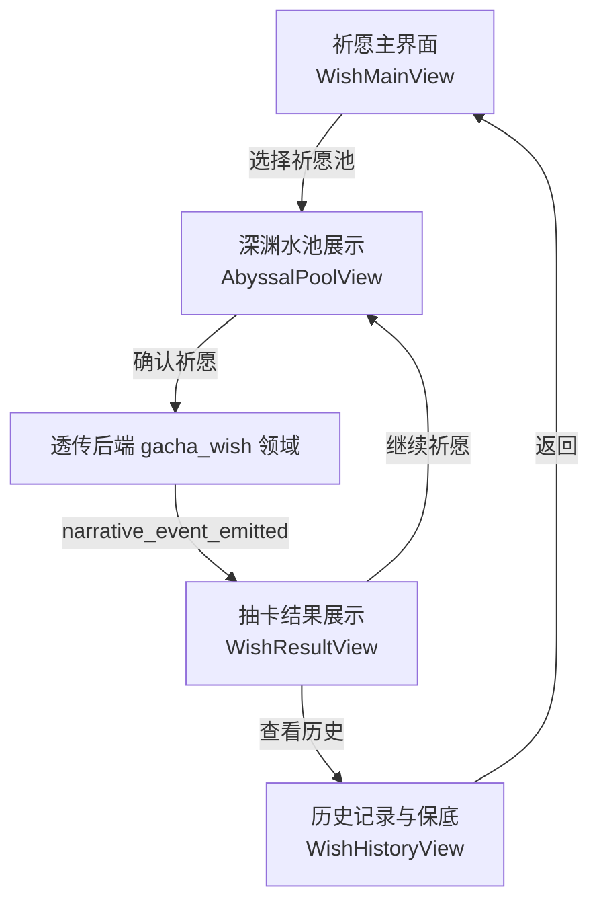
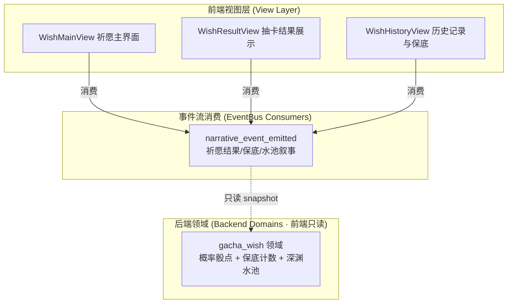
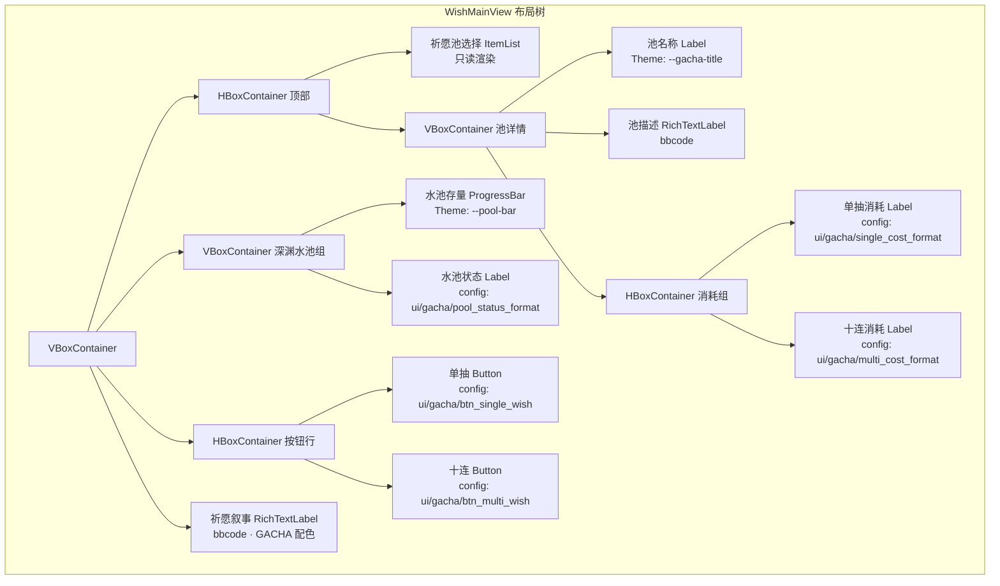
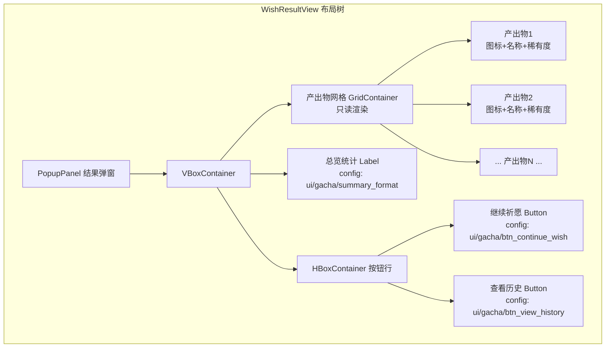
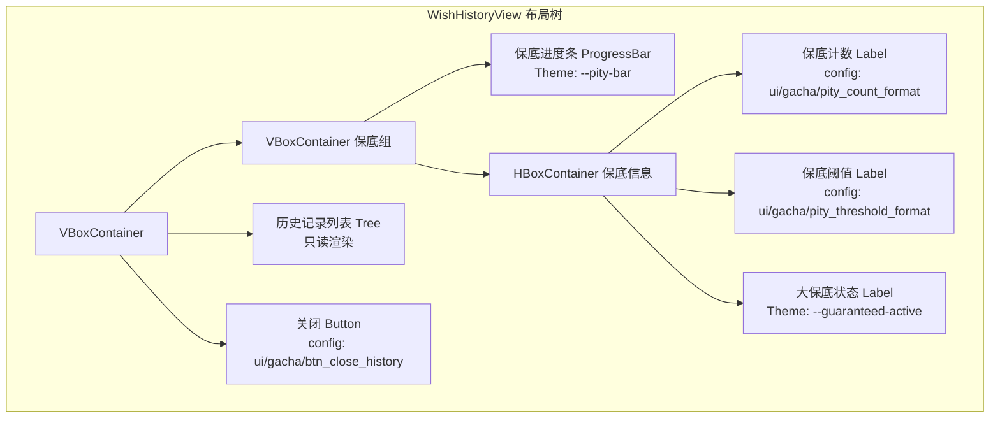

# 前端架构需求表6（第六卷：抽卡祈愿系统）

> \[!NOTE]
> **【全局架构声明】**：本篇及全套前端技术文档中所提及的所有具体界面文案、按钮标签、配色令牌与演示数据，**均属基础演示示例（Illustrative Examples Only），绝非底层硬编码或静态写死结构**。前端表现层仅定义**事件流消费契约、视图-事件映射表、Theme 令牌层与组件可复用基座**，全部用户可见文案由 `config/frontend/ui.json` 与 `config/narratives/gacha.json` 驱动，全部事件分类配色由 `config/infrastructure/event_categories.json` 驱动。

***

## 一、 系统架构总览与视图模型划分 (Frontend Domain Overview)

### 1.1 架构设计理念：抽卡祈愿表现宿主 (Gacha Wish Presentation Host)

抽卡祈愿系统是玩家消耗货币进行祈愿抽取的核心视图集合，涵盖祈愿主界面、抽卡结果展示、历史记录与保底进度条共三个子视图。前端只消费 `EventBus` 的 `narrative_event_emitted` 信号，以及 `GameConfig` 的只读配置查询，不持有任何概率骰点、保底计数或深渊水池注入/抽取逻辑（全部由后端 `gacha_wish` 领域负责）。

* **表现层绝对解耦**：祈愿视图只负责「祈愿叙事事件 → 结果展示渲染映射」，不做任何概率计算、稀有度判定或保底计数器推进；
* **保底进度只读**：保底进度条由后端 `gacha_wish` 领域计算并推送快照，前端只渲染百分比，不做任何保底阈值判定；
* **配置驱动文案与配色**：全部祈愿按钮标签、稀有度文案、结果格式来自 `config/frontend/ui.json`；祈愿事件分类配色来自 `config/infrastructure/event_categories.json` 的 `gacha` 分类。

### 1.2 祈愿流程与视图切换 (Wish Flow & View Switching)



### 1.3 核心子视图与事件映射 (View-Event Mapping)



***

## 二、 祈愿主界面 (Wish Main View)

### 2.1 视图职责与布局

祈愿主界面是玩家进入抽卡系统的入口视图，展示可选祈愿池、货币消耗预览与深渊水池当前状态。前端只消费 `narrative_event_emitted` 信号中 `GACHA` 分类事件渲染水池只读快照，祈愿请求原样透传后端 `gacha_wish` 领域，不做任何概率骰点或保底判定。

| 区域           | 节点类型      | 内容来源                                              | 说明                    |
| :------------- | :---------- | :--------------------------------------------------- | :---------------------- |
| 祈愿池选择     | ItemList    | `narrative_event_emitted` → meta `wish_pools[]`       | 可选祈愿池列表          |
| 池名称         | Label       | meta `wish_pools[].name`                              | 当前选中池名称          |
| 池描述         | RichTextLabel | meta `wish_pools[].description`                       | 池详情 bbcode 描述      |
| 单抽消耗       | Label       | meta `wish_pools[].single_cost`                      | 单次祈愿货币消耗        |
| 十连消耗       | Label       | meta `wish_pools[].multi_cost`                       | 十连祈愿货币消耗        |
| 深渊水池存量   | ProgressBar | meta `abyssal_pool_current`                          | 水池当前存量进度条      |
| 水池状态       | Label       | meta `abyssal_pool_status`                            | 水池充盈/枯竭状态       |
| 单抽按钮       | Button      | `ui/gacha/btn_single_wish`                           | 透传后端单次祈愿        |
| 十连按钮       | Button      | `ui/gacha/btn_multi_wish`                            | 透传后端十连祈愿        |
| 祈愿叙事       | RichTextLabel | `narrative_event_emitted` → GACHA 分类               | 祈愿过程 bbcode 叙事    |

### 2.2 布局树



### 2.3 输入采集与后端透传契约

前端只采集祈愿池选择与单抽/十连请求，原样透传后端 `gacha_wish` 领域，不做概率骰点或保底判定：

```typescript
// 前端祈愿请求 DTO（透传后端 gacha_wish 领域，前端不骰点）
interface WishRequestDTO {
  poolId: string;              // 祈愿池 ID
  wishType: 'single' | 'multi'; // 单抽或十连
  // 前端不调用 RNG、不计算概率、不判定稀有度、不推进保底计数器
}

// 后端推送的祈愿池快照（前端只渲染，不计算概率）
interface WishPoolSnapshotDTO {
  wishPools: Array<{
    poolId: string;
    name: string;              // 池名称文案
    description: string;       // 池详情描述
    singleCost: number;        // 单次消耗
    multiCost: number;         // 十连消耗
    currencyType: string;      // 消耗货币类型
  }>;
  abyssalPoolCurrent: number;  // 水池当前存量（后端计算）
  abyssalPoolMax: number;      // 水池容量上限
  abyssalPoolStatus: string;   // 水池状态文案（充盈/枯竭）
}
```

### 2.4 事件消费代码示例

```gdscript
## 祈愿主界面消费 GACHA 分类叙事事件，祈愿请求透传后端
func _ready() -> void:
    EventBus.get_instance().narrative_event_emitted.connect(_on_narrative)
    log.scroll_following = true

func _on_narrative_event(packet: Dictionary) -> void:
    var cat = packet.get("category", "")
    # 只消费 GACHA 分类的祈愿叙事
    if cat != EventBus.get_category_name("gacha"):
        return
    var txt = packet.get("text", "")
    var meta = packet.get("meta", {})
    var color = _get_category_color(cat)
    log.append_text("[color=" + color + "]" + txt + "[/color]\n")
    # 深渊水池存量从 meta 只读渲染，不计算注入/抽取
    if meta.has("abyssal_pool_current"):
        pool_bar.value = float(meta["abyssal_pool_current"])
    if meta.has("abyssal_pool_status"):
        pool_status_label.text = meta["abyssal_pool_status"]
    # 祈愿池列表从 meta 只读渲染
    if meta.has("wish_pools"):
        _render_pool_list(meta["wish_pools"])

func _on_btn_single_wish_pressed() -> void:
    # 透传后端 gacha_wish 领域单抽，前端不骰点
    EventBus.get_instance().emit_log("info", "wish_request:single:" + selected_pool_id)

func _on_btn_multi_wish_pressed() -> void:
    # 透传后端十连，前端不调用 RNG
    EventBus.get_instance().emit_log("info", "wish_request:multi:" + selected_pool_id)

func _get_category_color(category_name: String) -> String:
    var categories := GameConfig.get_dict("infrastructure.event_categories", "", {})
    for key in categories:
        var entry: Dictionary = categories[key]
        if entry.get("name", "") == category_name:
            return entry.get("color", _default_category_color())
    return _default_category_color()

func _default_category_color() -> String:
    return GameConfig.get_string("infrastructure.event_categories", "_default/color", "#94a3b8")
```

***

## 三、 抽卡结果展示 (Wish Result View)

### 3.1 视图职责与布局

抽卡结果展示在祈愿完成后弹出，以实例化预览方式展示抽到的产出物品。前端只消费 `narrative_event_emitted` 信号中 `GACHA` 分类事件渲染产出物只读快照，不做任何稀有度判定或物品实例化。

| 区域           | 节点类型      | 内容来源                                              | 说明                    |
| :------------- | :---------- | :--------------------------------------------------- | :---------------------- |
| 结果弹窗       | PopupPanel  | 代码驱动                                              | 抽卡结果弹窗容器        |
| 产出物网格     | GridContainer | `narrative_event_emitted` → meta `results[]`          | 产出物品图标网格        |
| 物品图标       | TextureRect ×N | meta `results[].icon`                               | 产出物图标              |
| 物品名称       | Label ×N    | meta `results[].name`                                 | 产出物名称              |
| 稀有度标记     | Label ×N    | meta `results[].rarity`                              | 稀有度只读展示          |
| 稀有度边框     | (动效)     | meta `results[].rarity`                               | 稀有度对应边框颜色      |
| 总览统计       | Label       | meta `summary`                                       | 抽卡统计总览            |
| 继续按钮       | Button      | `ui/gacha/btn_continue_wish`                         | 继续祈愿                |
| 查看历史按钮   | Button      | `ui/gacha/btn_view_history`                          | 跳转历史记录            |

### 3.2 布局树



### 3.3 输入采集与后端透传契约

前端只采集继续祈愿与查看历史请求，不做任何物品实例化或稀有度判定：

```typescript
// 后端推送的抽卡结果快照（前端只渲染，不判定稀有度）
interface WishResultSnapshotDTO {
  results: Array<{
    itemId: string;
    name: string;              // 产出物名称文案
    icon: string;              // 产出物图标路径
    rarity: string;            // 稀有度文案（后端判定）
    rarityColor: string;       // 稀有度对应颜色（后端推送）
    isNew?: boolean;           // 是否新获得
  }>;
  summary: string;             // 统计总览文案
  poolId: string;              // 来源祈愿池
}

// 前端继续祈愿请求（透传后端，前端不骰点）
interface ContinueWishRequestDTO {
  poolId: string;              // 继续祈愿的池 ID
  wishType: 'single' | 'multi';
  // 前端不计算是否还有足够货币，由后端判定
}
```

### 3.4 事件消费代码示例

```gdscript
## 抽卡结果展示消费 GACHA 分类叙事事件，只读渲染产出物
func _ready() -> void:
    EventBus.get_instance().narrative_event_emitted.connect(_on_narrative)
    visible = false  # 默认隐藏，收到结果事件后弹出

func _on_narrative_event(packet: Dictionary) -> void:
    var cat = packet.get("category", "")
    # 只消费 GACHA 分类的抽卡结果
    if cat != EventBus.get_category_name("gacha"):
        return
    var meta = packet.get("meta", {})
    # 产出物列表从 meta 只读渲染，不判定稀有度
    if meta.has("results"):
        _render_results(meta["results"])
        visible = true
    if meta.has("summary"):
        summary_label.text = meta["summary"]

func _render_results(results: Array) -> void:
    # 清空旧产出物网格
    for child in result_grid.get_children():
        child.queue_free()
    # 产出物只读渲染，不做实例化或稀有度判定
    for item in results:
        var icon = TextureRect.new()
        var name_label = Label.new()
        var rarity_label = Label.new()
        name_label.text = item.get("name", "")
        rarity_label.text = item.get("rarity", "")
        # 稀有度边框颜色由后端推送，前端只渲染
        var rarity_color = item.get("rarity_color", _default_category_color())
        rarity_label.add_theme_color_override("font_color",
            Color.from_string(rarity_color, Color.WHITE))
        result_grid.add_child(icon)
        result_grid.add_child(name_label)
        result_grid.add_child(rarity_label)

func _on_btn_continue_wish_pressed() -> void:
    # 透传后端继续祈愿，前端不检查货币余额
    visible = false
    EventBus.get_instance().emit_log("info", "wish_continue:" + current_pool_id)

func _on_btn_view_history_pressed() -> void:
    # 路由到历史记录视图
    EventBus.get_instance().emit_log("info", "wish_view_history")

func _get_category_color(category_name: String) -> String:
    var categories := GameConfig.get_dict("infrastructure.event_categories", "", {})
    for key in categories:
        var entry: Dictionary = categories[key]
        if entry.get("name", "") == category_name:
            return entry.get("color", _default_category_color())
    return _default_category_color()

func _default_category_color() -> String:
    return GameConfig.get_string("infrastructure.event_categories", "_default/color", "#94a3b8")
```

***

## 四、 历史记录与保底进度条 (Wish History & Pity Progress)

### 4.1 视图职责与布局

历史记录与保底进度条视图展示玩家全部祈愿历史记录与当前保底进度。前端只消费 `narrative_event_emitted` 信号中 `GACHA` 分类事件渲染历史与保底只读快照，不做任何保底计数器推进或阈值判定。

| 区域           | 节点类型      | 内容来源                                              | 说明                    |
| :------------- | :---------- | :--------------------------------------------------- | :---------------------- |
| 历史记录列表   | Tree         | `narrative_event_emitted` → meta `history[]`          | 祈愿历史记录树          |
| 记录时间       | Label ×N   | meta `history[].timestamp`                           | 祈愿时间戳              |
| 记录产出       | Label ×N   | meta `history[].result_name`                         | 产出物名称              |
| 记录稀有度     | Label ×N   | meta `history[].rarity`                               | 稀有度只读展示          |
| 保底进度条     | ProgressBar | meta `pity_progress`                                  | 0~100% 保底进度         |
| 保底计数       | Label       | meta `pity_count`                                    | 当前保底计数            |
| 保底阈值       | Label       | meta `pity_threshold`                                 | 保底阈值只读展示        |
| 大保底状态     | Label       | meta `guaranteed_status`                             | 大保底是否激活          |

### 4.2 布局树



### 4.3 输入采集与后端透传契约

历史记录与保底进度条视图是**纯只读渲染视图**，不采集任何用户输入：

```typescript
// 后端推送的祈愿历史与保底快照（前端只渲染，不计算保底）
interface WishHistorySnapshotDTO {
  history: Array<{
    timestamp: string;         // 祈愿时间戳
    poolName: string;          // 祈愿池名称
    resultName: string;        // 产出物名称
    rarity: string;            // 稀有度（后端判定）
    rarityColor: string;       // 稀有度颜色
    isNew: boolean;            // 是否新获得
  }>;
  pityProgress: number;       // 保底进度 0~1（后端计算）
  pityCount: number;           // 当前保底计数（后端维护）
  pityThreshold: number;      // 保底阈值（后端配置）
  guaranteedStatus: boolean;   // 大保底是否激活（后端判定）
}
```

### 4.4 事件消费代码示例

```gdscript
## 历史记录与保底进度条消费 GACHA 分类叙事事件，只读渲染
func _ready() -> void:
    EventBus.get_instance().narrative_event_emitted.connect(_on_narrative)

func _on_narrative_event(packet: Dictionary) -> void:
    var cat = packet.get("category", "")
    # 只消费 GACHA 分类的祈愿事件
    if cat != EventBus.get_category_name("gacha"):
        return
    var meta = packet.get("meta", {})
    # 保底进度从 meta 只读渲染，不推进计数器
    if meta.has("pity_progress"):
        pity_bar.value = float(meta["pity_progress"]) * 100.0
    if meta.has("pity_count"):
        pity_count_label.text = GameConfig.get_string(
            "frontend.ui", "gacha/pity_count_format", "当前: %d 抽") % int(meta["pity_count"])
    if meta.has("pity_threshold"):
        pity_threshold_label.text = GameConfig.get_string(
            "frontend.ui", "gacha/pity_threshold_format", "保底: %d 抽") % int(meta["pity_threshold"])
    if meta.has("guaranteed_status"):
        guaranteed_label.visible = bool(meta["guaranteed_status"])
    # 历史记录从 meta 只读渲染
    if meta.has("history"):
        _render_history(meta["history"])

func _render_history(history: Array) -> void:
    history_tree.clear()
    var root = history_tree.create_item()
    for entry in history:
        var item = history_tree.create_item(root)
        var ts = entry.get("timestamp", "")
        var name = entry.get("result_name", "")
        var rarity = entry.get("rarity", "")
        item.set_text(0, ts + " | " + name + " | " + rarity)
        # 稀有度颜色由后端推送，前端只渲染
        var rarity_color = entry.get("rarity_color", _default_category_color())
        item.set_custom_color(0, Color.from_string(rarity_color, Color.WHITE))

func _on_btn_close_pressed() -> void:
    visible = false

func _get_category_color(category_name: String) -> String:
    var categories := GameConfig.get_dict("infrastructure.event_categories", "", {})
    for key in categories:
        var entry: Dictionary = categories[key]
        if entry.get("name", "") == category_name:
            return entry.get("color", _default_category_color())
    return _default_category_color()

func _default_category_color() -> String:
    return GameConfig.get_string("infrastructure.event_categories", "_default/color", "#94a3b8")
```

***

## 五、 Theme 令牌与配色规范 (Theme Tokens)

抽卡祈愿系统的全部配色由 Theme 令牌层统一管理，与 `event_categories.json` 对齐：

| UI 元素       | 配色来源                                 | 令牌              | 兜底默认值                        |
| :------------ | :------------------------------------- | :--------------- | :--------------------------- |
| 祈愿面板背景   | Theme                                  | `--gacha-bg`      | `Color(0.06, 0.05, 0.12, 0.98)` |
| 祈愿标题       | Theme                                  | `--gacha-title`   | `Color(0.96, 0.45, 0.71, 1)` |
| 深渊水池条     | Theme                                  | `--pool-bar`     | `Color(0.75, 0.52, 0.98, 1)` |
| 保底进度条     | Theme                                  | `--pity-bar`     | `Color(0.98, 0.75, 0.14, 1)` |
| 大保底激活     | Theme                                  | `--guaranteed-active` | `Color(0.98, 0.75, 0.14, 1)` |
| 普通稀有度     | Theme                                  | `--rarity-common` | `Color(0.75, 0.75, 0.80, 1)` |
| 稀有稀有度     | Theme                                  | `--rarity-rare`   | `Color(0.40, 0.60, 0.97, 1)` |
| 史诗稀有度     | Theme                                  | `--rarity-epic`   | `Color(0.75, 0.52, 0.98, 1)` |
| 传说稀有度     | Theme                                  | `--rarity-legendary` | `Color(0.98, 0.75, 0.14, 1)` |
| 祈愿事件       | `event_categories.json` → `gacha`      | `#f472b6`        | —                            |
| 默认事件       | `event_categories.json` → `_default`   | `#94a3b8`        | —                            |

***

## 六、 验收矩阵 (DoD Matrix)

| 验收项            | 验收标准                                            | 验证方式                                               |
| :--------------- | :----------------------------------------------- | :------------------------------------------------- |
| 三子视图可达       | 祈愿主界面可导航到结果展示与历史记录，无崩溃                 | 手动走查                                            |
| 祈愿请求透传       | 单抽/十连请求原样透传后端，前端不骰点                          | `rg "randi\|randf\|DeterministicRNG" frontend/views/gacha*` 无命中 |
| 概率后端算         | 产出物稀有度由后端判定推送，前端不计算概率                       | `rg "probability\|drop_rate\|rarity_calc" frontend/` 无命中 |
| 保底后端算         | 保底进度与计数由后端推送，前端不推进计数器                       | `rg "pity_count\|increment_pity\|check_pity" frontend/` 仅命中渲染读取 |
| 水池状态只读       | 深渊水池存量由后端推送，前端不计算注入/抽取                    | `rg "pool_inject\|pool_extract\|pool_balance" frontend/` 无命中 |
| 稀有度颜色后端推   | 产出物稀有度颜色由后端推送，前端不硬编码稀有度色                  | `rg "legendary.*color\|epic.*color" frontend/` 仅命中配置读取 |
| 结果实例化后端做   | 产出物实例化由后端完成，前端不实例化物品                        | `rg "instantiate\|create_item" frontend/views/gacha*` 无命中 |
| 文案零硬编码       | 全部祈愿按钮/消耗格式/保底文案来自配置表                      | `rg "单抽\|十连\|保底" frontend/views/gacha*` 仅命中配置读取 |
| 配色配置驱动       | 删除 `event_categories.json` gacha 分类后回退默认色       | 配置表删键后验证                                    |
| 零逻辑纪律         | 前端代码无 `Solver`/`FSM`/`DeterministicRNG` 调用          | `rg "Solver\|FSM\|DeterministicRNG" frontend/" 无命中 |
