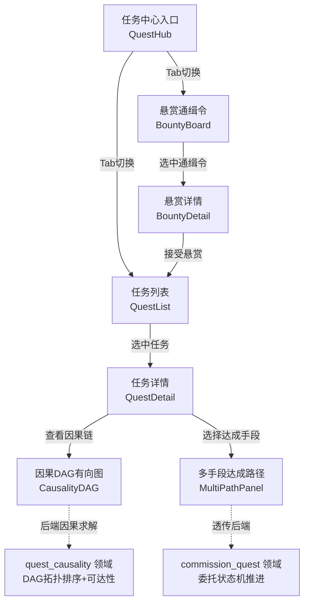
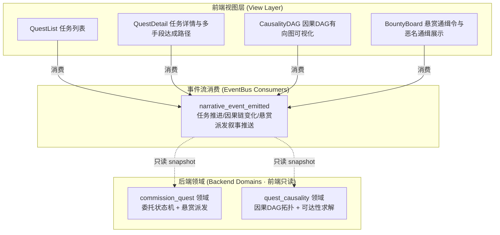
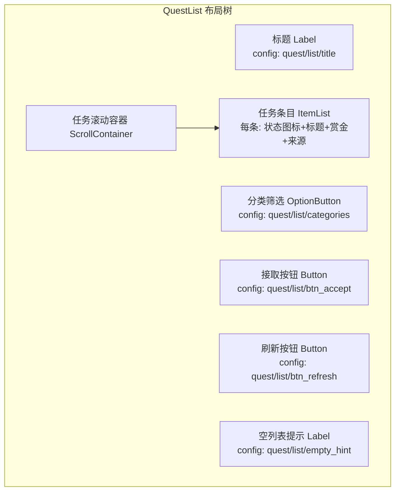
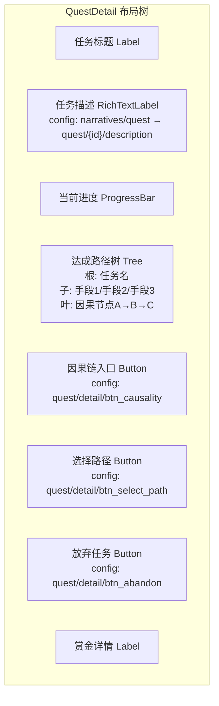
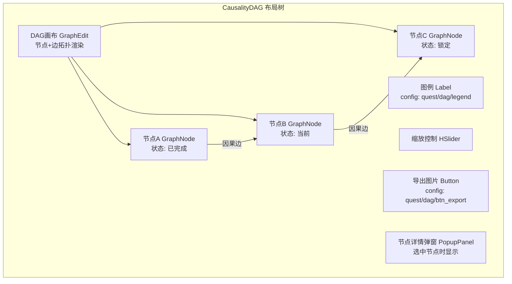
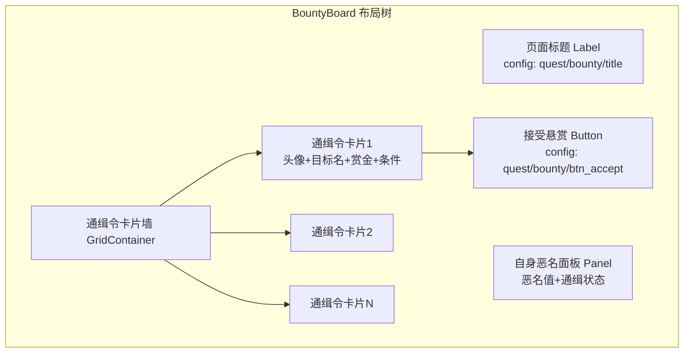

# 前端架构需求表7（第七卷：任务与因果系统）

> \[!NOTE]
> **【全局架构声明】**：本篇及全套前端技术文档中所提及的所有具体界面文案、按钮标签、配色令牌与演示数据，**均属基础演示示例（Illustrative Examples Only），绝非底层硬编码或静态写死结构**。前端表现层仅定义**事件流消费契约、视图-事件映射表、Theme 令牌层与组件可复用基座**，全部用户可见文案由 `config/frontend/ui.json` 与 `config/narratives/quest.json` 驱动。

***

## 一、 系统架构总览与视图模型划分 (Frontend Domain Overview)

### 1.1 架构设计理念：任务因果表现宿主 (Quest Causality Presentation Host)

本前端系统以**世界自发委托与因果 DAG 可视化**为运行底座，前端视图只消费 `EventBus` 的 `narrative_event_emitted` 信号，以及 `GameConfig` 的只读配置查询，不持有任何任务状态机、因果求解器或 DAG 拓扑计算逻辑（全部由后端 `commission_quest` 与 `quest_causality` 领域负责）。

* **表现层绝对解耦**：前端只负责「输入采集 → 透传后端 → 渲染反馈结果」，不做任何任务可达性判定、因果链推导或 DAG 节点排序；
* **多手段达成零判定**：任务详情页展示后端下发的多条达成路径快照，前端不计算哪条路径更优，仅渲染后端 `quest_causality` 领域返回的 DAG 节点状态；
* **配置驱动文案**：全部任务分类标签、悬赏等级名称、因果节点描述来自 `config/frontend/ui.json`，任务叙事文本与因果事件描述来自 `config/narratives/quest.json`。

### 1.2 任务与因果流程状态视图 (Quest Causality Flow State Views)



### 1.3 核心子视图与事件映射 (View-Event Mapping)



***

## 二、 任务列表界面 (Quest List)

### 2.1 视图职责与布局

任务列表界面展示当前角色可接取与进行中的全部委托与悬赏。前端只渲染后端 `commission_quest` 领域下发的任务列表只读快照，不做任何任务过滤逻辑或可达性判定（全部由后端领域负责）。

| 区域       | 节点类型        | 内容来源                                         | 说明                      |
| :------- | :---------- | :------------------------------------------- | :---------------------- |
| 页面标题     | Label       | `config/frontend/ui.json` → `quest/list/title` | 如「委托大厅」                 |
| 分类筛选标签   | OptionButton | `config/frontend/ui.json` → `quest/list/categories` | 世界自发委托 / 悬赏派发 / 全部     |
| 任务列表     | ItemList    | `commission_quest.quests[]` 只读快照              | 每条显示标题/状态/赏金/来源         |
| 任务状态图标   | TextureRect | 快照字段 `status` 映射                            | 未接取/进行中/可交付/已完成/失败     |
| 赏金预览     | Label       | 快照字段 `reward`                               | 金币/银币/物品预览              |
| 任务来源标签   | Label       | 快照字段 `source`                               | 世界自发 / NPC委托 / 悬赏派发     |
| 接取按钮     | Button      | `config/frontend/ui.json` → `quest/list/btn_accept` | 选中后透传后端接取              |
| 刷新按钮     | Button      | `config/frontend/ui.json` → `quest/list/btn_refresh` | 请求后端下发最新快照            |
| 空列表提示    | Label       | `config/frontend/ui.json` → `quest/list/empty_hint` | 如「当前无可用委托」             |

### 2.2 布局树



### 2.3 输入采集与后端透传契约

前端只采集分类筛选偏好与选中任务 ID，透传后端 `commission_quest` 领域，**不做任何任务可达性或接取条件判定**：

```typescript
// 前端任务接取请求 DTO（透传后端 commission_quest 领域，前端不做校验）
interface QuestAcceptRequestDTO {
  questId: string;          // 选中任务的原样透传
  characterId: string;       // 当前角色 ID 透传
  filterCategory?: string;   // 当前分类筛选偏好（仅 UI 展示用，不影响后端逻辑）
}

// 后端返回的任务列表快照（前端只渲染，不判定）
interface QuestListSnapshotDTO {
  quests: QuestEntryDTO[];
  totalCount: number;
  filterApplied: string;     // 后端实际应用的筛选（可能与前端请求不同）
}

interface QuestEntryDTO {
  questId: string;
  title: string;             // 来自 config/narratives/quest.json
  category: 'commission' | 'bounty';  // 世界自发委托 / 悬赏派发
  status: 'available' | 'active' | 'completable' | 'completed' | 'failed';
  reward: {
    gold?: number;
    silver?: number;
    items?: string[];        // 物品 ID 列表，前端不解析物品详情
  };
  source: string;            // 来源标签文案 key
  causalityRootId?: string;   // 因果 DAG 根节点 ID（可选，用于跳转因果图）
  deadline?: number;          // 世界时钟截止时刻（前端只展示，不判定超时）
}
```

### 2.4 任务事件消费代码示例

```gdscript
## 任务列表界面消费任务叙事事件，只渲染不判定
func _ready() -> void:
    EventBus.get_instance().narrative_event_emitted.connect(_on_narrative_event)
    _request_quest_list_snapshot()

## 请求后端下发任务列表只读快照（前端不做任何过滤/排序）
func _request_quest_list_snapshot() -> void:
    var req := QuestAcceptRequestDTO.new()
    req.filterCategory = _current_filter  # UI 筛选偏好透传
    BackendProxy.request("commission_quest", "list_snapshot", req)

## 消费任务叙事事件 → 刷新列表条目状态
func _on_narrative_event(packet: Dictionary) -> void:
    var cat = packet.get("category", "")
    var txt = packet.get("text", "")
    # 任务推进/因果链变化事件 → 更新对应条目状态图标
    if cat == EventBus.get_category_name("quest"):
        _refresh_quest_entry_status(packet.get("quest_id", ""), packet.get("new_status", ""))
    elif cat == EventBus.get_category_name("bounty"):
        _append_bounty_entry(packet)

## 接取按钮点击 → 透传后端，前端不做可达性判定
func _on_accept_pressed() -> void:
    var selected = quest_list.get_selected_item_id()
    if selected.is_empty():
        return
    var req := QuestAcceptRequestDTO.new()
    req.questId = selected
    req.characterId = GameState.current_character_id
    BackendProxy.request("commission_quest", "accept", req)
```

***

## 三、 任务详情与多手段达成路径界面 (Quest Detail & Multi-Path)

### 3.1 视图职责与布局

任务详情界面展示单个委托的完整描述、当前进度与多条达成路径。前端只渲染后端 `quest_causality` 领域下发的 DAG 节点状态快照，**不做任何路径优先级排序或手段可行性计算**（全部由后端领域负责）。

| 区域       | 节点类型           | 内容来源                                          | 说明                       |
| :------- | :------------- | :-------------------------------------------- | :----------------------- |
| 任务标题     | Label          | 快照字段 `title`                                  | 来自配置表                    |
| 任务描述     | RichTextLabel  | `config/narratives/quest.json` → `quest/{id}/description` | bbcode 富文本叙事             |
| 当前进度条    | ProgressBar    | 快照字段 `progress`                               | 后端计算的 0~100%             |
| 达成路径列表   | Tree           | 快照字段 `paths[]`                                | 多手段树形展示                  |
| 路径节点状态   | TextureRect ×N | 快照字段 `paths[].nodes[].status`                | 已完成/当前/锁定/可选            |
| 因果链入口    | Button         | `config/frontend/ui.json` → `quest/detail/btn_causality` | 跳转因果 DAG 可视化界面        |
| 选择路径按钮   | Button         | `config/frontend/ui.json` → `quest/detail/btn_select_path` | 透传后端选定达成手段             |
| 放弃任务按钮   | Button         | `config/frontend/ui.json` → `quest/detail/btn_abandon` | 透传后端，前端做二次确认弹窗        |
| 赏金详情     | Label          | 快照字段 `reward_detail`                          | 详细奖励分解                   |

### 3.2 布局树



### 3.3 输入采集与后端透传契约

```typescript
// 前端路径选择请求 DTO（透传后端 quest_causality 领域，前端不做路径可行性判定）
interface PathSelectRequestDTO {
  questId: string;          // 任务 ID
  pathId: string;           // 选中的达成路径 ID（原样透传）
  characterId: string;
}

// 后端返回的任务详情快照（前端只渲染，不判定）
interface QuestDetailSnapshotDTO {
  questId: string;
  title: string;
  description: string;       // 配置表驱动的叙事文本
  progress: number;           // 后端计算的总体进度 0~100
  paths: QuestPathDTO[];      // 多手段达成路径列表
  rewardDetail: RewardDetailDTO;
  status: string;
}

interface QuestPathDTO {
  pathId: string;
  pathLabel: string;          // 如「武力突破」「外交斡旋」「潜入渗透」
  nodes: CausalityNodeDTO[];  // 因果链节点序列
  isCurrent: boolean;         // 后端标记当前正在走的路径
  isLocked: boolean;          // 后端标记锁定路径（前置条件未满足）
}

interface CausalityNodeDTO {
  nodeId: string;
  nodeLabel: string;          // 节点描述文案 key
  status: 'completed' | 'current' | 'locked' | 'optional';
  prerequisites: string[];    // 前置节点 ID 列表（前端只渲染依赖箭头，不计算可达性）
}
```

### 3.4 任务详情事件消费代码示例

```gdscript
## 任务详情界面消费因果链变化事件，只渲染不判定
func _ready() -> void:
    EventBus.get_instance().narrative_event_emitted.connect(_on_narrative_event)
    _request_quest_detail_snapshot()

## 请求后端下发任务详情只读快照
func _request_quest_detail_snapshot() -> void:
    var req := {"quest_id": _quest_id, "character_id": GameState.current_character_id}
    BackendProxy.request("quest_causality", "detail_snapshot", req)

## 消费因果链变化事件 → 更新路径节点状态
func _on_narrative_event(packet: Dictionary) -> void:
    var cat = packet.get("category", "")
    var txt = packet.get("text", "")
    if cat == EventBus.get_category_name("quest"):
        var node_id = packet.get("node_id", "")
        var new_status = packet.get("node_status", "")
        _update_path_node_status(node_id, new_status)
        # 因果叙事文本追加到描述区
        desc_label.append_text("[color=#a3e635]" + txt + "[/color]\n")

## 选择路径按钮点击 → 透传后端，前端不做路径可行性判定
func _on_select_path_pressed() -> void:
    var selected_path = path_tree.get_selected_path_id()
    if selected_path.is_empty():
        return
    var req := PathSelectRequestDTO.new()
    req.questId = _quest_id
    req.pathId = selected_path
    req.characterId = GameState.current_character_id
    BackendProxy.request("quest_causality", "select_path", req)
```

***

## 四、 因果 DAG 有向图可视化界面 (Causality DAG Visualization)

### 4.1 视图职责与布局

因果 DAG 有向图界面以有向无环图形式展示任务因果链的拓扑结构。前端只渲染后端 `quest_causality` 领域下发的 DAG 节点与边只读快照，**不做任何拓扑排序、可达性求解或环检测**（全部由后端领域负责）。前端仅根据后端下发的坐标信息进行节点布局渲染。

| 区域       | 节点类型           | 内容来源                                          | 说明                       |
| :------- | :------------- | :-------------------------------------------- | :----------------------- |
| DAG 画布   | GraphEdit/Control | 快照字段 `nodes[]` + `edges[]`                | 有向图节点与边渲染                |
| 节点       | GraphNode ×N    | 快照字段 `nodes[]`                               | 每节点显示标签/状态/类型          |
| 因果边      | GraphEdge ×N    | 快照字段 `edges[]`                               | 有向箭头，颜色由节点状态决定          |
| 节点详情弹窗   | PopupPanel      | 快照字段 `nodes[]` 选中节点                          | 展示节点完整描述与前置条件           |
| 图例       | Label           | `config/frontend/ui.json` → `quest/dag/legend` | 状态颜色说明                  |
| 缩放控制     | HSlider         | 代码驱动 `0.5x~2.0x`                              | 画布缩放                     |
| 导出图片按钮   | Button          | `config/frontend/ui.json` → `quest/dag/btn_export` | 导出当前 DAG 快照为图片        |

### 4.2 布局树



### 4.3 输入采集与后端透传契约

```typescript
// 前端 DAG 查询请求 DTO（透传后端 quest_causality 领域，前端不做拓扑计算）
interface CausalityDAGRequestDTO {
  questId: string;          // 任务 ID
  characterId: string;
  includeLocked: boolean;   // 是否包含锁定节点（UI 偏好透传）
}

// 后端返回的 DAG 快照（前端只渲染，不判定）
interface CausalityDAGSnapshotDTO {
  questId: string;
  nodes: DAGNodeDTO[];       // 后端已拓扑排序的节点列表
  edges: DAGEdgeDTO[];       // 后端已计算的因果边列表
  layoutMode: 'hierarchical' | 'radial';  // 后端建议的布局模式
}

interface DAGNodeDTO {
  nodeId: string;
  nodeLabel: string;         // 节点标签文案 key
  nodeType: 'action' | 'condition' | 'outcome' | 'branch';
  status: 'completed' | 'current' | 'locked' | 'optional' | 'failed';
  position: { x: number; y: number };  // 后端计算的布局坐标（前端不重算）
  description: string;       // 节点完整描述（配置表驱动）
  prerequisites: string[];   // 前置节点 ID（前端只渲染箭头，不计算可达性）
}

interface DAGEdgeDTO {
  fromNodeId: string;
  toNodeId: string;
  edgeType: 'causal' | 'temporal' | 'conditional';
  label?: string;            // 边标签文案 key（可选）
}
```

### 4.4 DAG 事件消费代码示例

```gdscript
## 因果DAG界面消费因果链变化事件，只渲染不判定拓扑
func _ready() -> void:
    EventBus.get_instance().narrative_event_emitted.connect(_on_narrative_event)
    _request_dag_snapshot()

## 请求后端下发 DAG 只读快照（前端不做拓扑排序/可达性求解）
func _request_dag_snapshot() -> void:
    var req := CausalityDAGRequestDTO.new()
    req.questId = _quest_id
    req.characterId = GameState.current_character_id
    req.includeLocked = _show_locked_toggle.button_pressed
    BackendProxy.request("quest_causality", "dag_snapshot", req)

## 消费因果链变化事件 → 更新节点状态颜色
func _on_narrative_event(packet: Dictionary) -> void:
    var cat = packet.get("category", "")
    if cat == EventBus.get_category_name("quest"):
        var node_id = packet.get("node_id", "")
        var new_status = packet.get("node_status", "")
        _update_node_visual(node_id, new_status)

## 根据后端快照渲染 DAG 节点（前端只布局不计算拓扑）
func _render_dag(snapshot: Dictionary) -> void:
    var nodes: Array = snapshot.get("nodes", [])
    var edges: Array = snapshot.get("edges", [])
    # 清空旧节点
    for child in dag_canvas.get_children():
        child.queue_free()
    # 渲染节点：坐标由后端下发，前端不重算
    for node in nodes:
        var gnode := GraphNode.new()
        gnode.title = GameConfig.get_string("narratives.quest", "nodes/" + node.node_id + "/label", node.node_id)
        gnode.position_offset = Vector2(node.position.x, node.position.y)
        gnode.modulate = _get_status_color(node.status)
        dag_canvas.add_child(gnode)
    # 渲染边：依赖关系由后端下发，前端不计算可达性
    for edge in edges:
        dag_canvas.connect_node(edge.from_node_id, 0, edge.to_node_id, 0)
```

***

## 五、 悬赏通缉令与恶名通缉展示界面 (Bounty Board)

### 5.1 视图职责与布局

悬赏通缉令界面展示世界派发的通缉任务与角色恶名值。前端只渲染后端 `commission_quest` 领域下发的悬赏快照，**不做任何恶名阈值判定或通缉等级计算**（全部由后端领域负责）。

| 区域       | 节点类型           | 内容来源                                          | 说明                       |
| :------- | :------------- | :-------------------------------------------- | :----------------------- |
| 页面标题     | Label          | `config/frontend/ui.json` → `quest/bounty/title` | 如「悬赏通缉令」                |
| 通缉令卡片墙   | GridContainer  | `commission_quest.bounties[]` 只读快照            | 卡片式排列展示                 |
| 通缉目标头像   | TextureRect    | 快照字段 `target_portrait`                       | 目标角色/NPC 头像             |
| 通缉目标名称   | Label          | 快照字段 `target_name`                           | 目标名/假名                  |
| 恶名等级标签   | Label          | 快照字段 `notoriety_level`                       | 后端计算的恶名等级               |
| 赏金数额     | Label          | 快照字段 `bounty_reward`                        | 金币/银币/魔单晶               |
| 通缉条件     | RichTextLabel  | `config/narratives/quest.json` → `bounty/{id}/condition` | 活捉/击杀/带回证据等           |
| 剩余时间     | Label          | 快照字段 `deadline`                              | 世界时钟截止时刻（前端只展示不判定超时）   |
| 接受悬赏按钮   | Button         | `config/frontend/ui.json` → `quest/bounty/btn_accept` | 透传后端接受悬赏              |
| 自身恶名面板   | Panel          | 快照字段 `self_notoriety`                        | 当前角色恶名值与通缉状态            |

### 5.2 布局树



### 5.3 输入采集与后端透传契约

```typescript
// 前端悬赏接取请求 DTO（透传后端 commission_quest 领域，前端不做恶名/资质判定）
interface BountyAcceptRequestDTO {
  bountyId: string;         // 悬赏 ID 原样透传
  characterId: string;
}

// 后端返回的悬赏列表快照（前端只渲染，不判定）
interface BountyListSnapshotDTO {
  bounties: BountyEntryDTO[];
  selfNotoriety: NotorietySnapshotDTO;  // 自身恶名状态
}

interface BountyEntryDTO {
  bountyId: string;
  targetName: string;        // 通缉目标名/假名
  targetPortrait: string;    // 头像资源路径
  notorietyLevel: number;     // 后端计算的恶名等级（前端只展示）
  bountyReward: {
    gold?: number;
    silver?: number;
    manaMonocrystals?: number;
  };
  conditionType: string;     // 条件文案 key（活捉/击杀/带回证据）
  deadline?: number;         // 世界时钟截止时刻
  status: 'available' | 'accepted' | 'completed' | 'expired';
}

interface NotorietySnapshotDTO {
  currentNotoriety: number;   // 当前恶名值
  notorietyLevel: string;     // 恶名等级标签文案 key
  isWanted: boolean;          // 后端判定是否被通缉（前端不计算）
  wantedBountyId?: string;    // 自身被通缉的悬赏 ID（若有）
}
```

### 5.4 悬赏事件消费代码示例

```gdscript
## 悬赏通缉令界面消费悬赏派发/恶名变化事件，只渲染不判定
func _ready() -> void:
    EventBus.get_instance().narrative_event_emitted.connect(_on_narrative_event)
    _request_bounty_snapshot()

## 请求后端下发悬赏列表只读快照
func _request_bounty_snapshot() -> void:
    var req := {"character_id": GameState.current_character_id}
    BackendProxy.request("commission_quest", "bounty_snapshot", req)

## 消费悬赏/恶名事件 → 更新卡片与自身恶名面板
func _on_narrative_event(packet: Dictionary) -> void:
    var cat = packet.get("category", "")
    var txt = packet.get("text", "")
    if cat == EventBus.get_category_name("bounty"):
        var action = packet.get("action", "")
        match action:
            "new_bounty":
                _add_bounty_card(packet)
            "bounty_expired":
                _remove_bounty_card(packet.get("bounty_id", ""))
            "notoriety_changed":
                _update_self_notoriety(packet.get("notoriety", 0), packet.get("level", ""))
        # 悬赏叙事文本以 bounty 配色展示
        notoriety_log.append_text("[color=#f43f5e]" + txt + "[/color]\n")
    elif cat == EventBus.get_category_name("quest"):
        # 悬赏完成事件走 quest 分类
        _mark_bounty_completed(packet.get("bounty_id", ""))

## 接受悬赏按钮点击 → 透传后端，前端不做恶名/资质判定
func _on_accept_bounty_pressed(bounty_id: String) -> void:
    var req := BountyAcceptRequestDTO.new()
    req.bountyId = bounty_id
    req.characterId = GameState.current_character_id
    BackendProxy.request("commission_quest", "accept_bounty", req)
```

***

## 六、 Theme 令牌与配色规范 (Theme Tokens)

任务与因果系统的全部配色由 Theme 令牌层统一管理，与 `event_categories.json` 对齐：

| UI 元素     | 配色来源                                   | 令牌          | 兜底默认值                        |
| :--------- | :--------------------------------------- | :---------- | :--------------------------- |
| 页面背景       | Theme                                    | `--bg`      | `Color(0.06, 0.08, 0.12, 1)` |
| 主标题文字     | Theme                                    | `--title`   | `Color(0.38, 0.75, 0.98, 1)` |
| 普通正文       | Theme                                    | `--text`    | `Color(0.88, 0.91, 0.95, 1)` |
| 任务事件文字     | `event_categories.json` → `quest`        | `#a3e635`   | —                            |
| 悬赏事件文字     | `event_categories.json` → `bounty`       | `#f43f5e`   | —                            |
| 已完成节点     | Theme                                    | `--success` | `Color(0.20, 0.83, 0.60, 1)` |
| 当前节点       | `event_categories.json` → `quest`        | `#a3e635`   | —                            |
| 锁定节点       | Theme                                    | `--muted`   | `Color(0.45, 0.48, 0.52, 1)` |
| 失败节点       | Theme                                    | `--danger`  | `Color(0.97, 0.53, 0.53, 1)` |
| 恶名通缉高亮   | `event_categories.json` → `bounty`       | `#f43f5e`   | —                            |
| 默认事件       | `event_categories.json` → `_default`     | `#94a3b8`   | —                            |

***

## 七、 验收矩阵 (DoD Matrix)

| 验收项          | 验收标准                                         | 验证方式                                               |
| :------------- | :------------------------------------------- | :------------------------------------------------- |
| 任务列表可达       | 任务中心入口可到达任务列表页，无崩溃                           | `godot` 启动观察                                       |
| 任务详情可展开     | 选中任务后展示详情与多手段达成路径                              | 手动走查                                               |
| DAG 图渲染     | 因果 DAG 节点与边正确渲染，状态颜色与配置表对齐                  | 配置表删键后验证兜底                                        |
| 悬赏卡片墙渲染     | 通缉令卡片墙正确展示，赏金/恶名/条件均来自后端快照                    | 手动走查                                               |
| 文案零硬编码      | 所有任务标题/描述/按钮文案均来自配置表                           | `rg "委托大厅" frontend/` 仅命中配置读取                      |
| 配色配置驱动      | 删除 `event_categories.json` 的 `quest`/`bounty` 分类后回退默认色 | 配置表删键后验证                                           |
| 零逻辑纪律       | 前端代码无 DAG 拓扑排序/可达性求解/恶名阈值计算                 | `rg "topological_sort\|reachability\|notoriety_threshold" frontend/` 无命中 |
| 多手段路径零判定   | 前端不计算路径优先级，仅渲染后端下发路径列表                       | 代码审查                                               |
| 事件消费完整     | `narrative_event_emitted` 的 quest/bounty 分类均有视图消费 | 事件注入测试                                             |
| 视图可切换       | 任务列表 ↔ 任务详情 ↔ 因果DAG ↔ 悬赏通缉令 均可导航               | 手动走查                                               |
