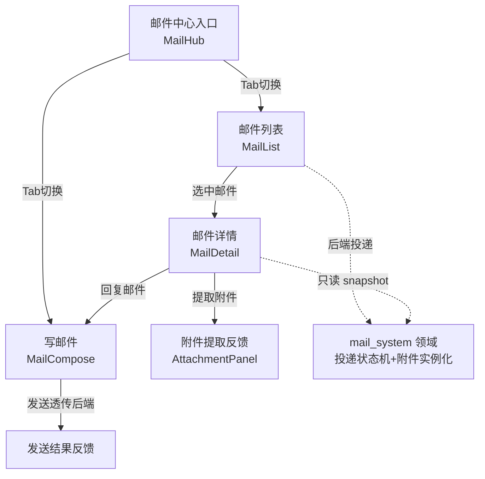
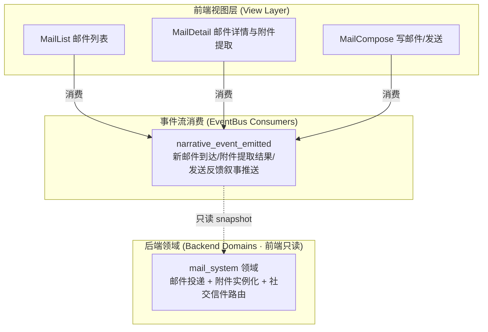
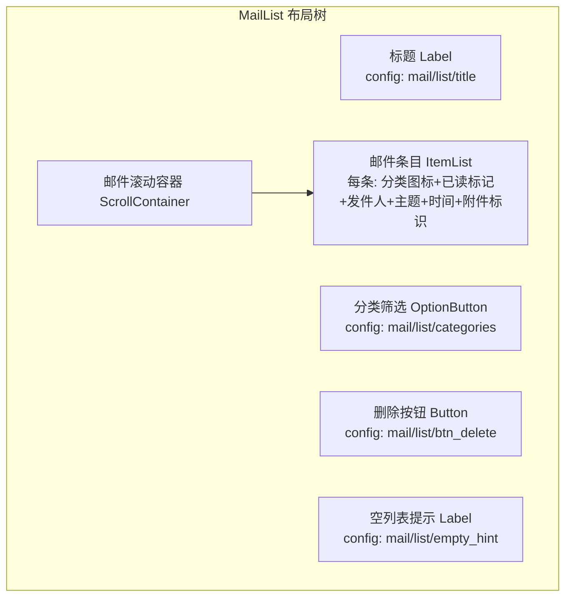
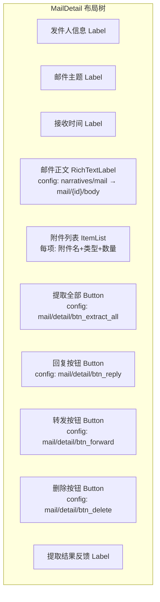
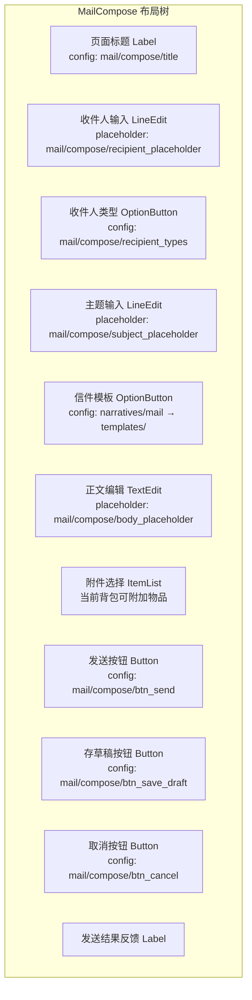

# 前端架构需求表8（第八卷：邮件系统）

> \[!NOTE]
> **【全局架构声明】**：本篇及全套前端技术文档中所提及的所有具体界面文案、按钮标签、配色令牌与演示数据，**均属基础演示示例（Illustrative Examples Only），绝非底层硬编码或静态写死结构**。前端表现层仅定义**事件流消费契约、视图-事件映射表、Theme 令牌层与组件可复用基座**，全部用户可见文案由 `config/frontend/ui.json` 与 `config/narratives/mail.json` 驱动。

***

## 一、 系统架构总览与视图模型划分 (Frontend Domain Overview)

### 1.1 架构设计理念：邮件表现宿主 (Mail Presentation Host)

本前端系统以**三类邮件拓扑分类与社交信件收发**为运行底座，前端视图只消费 `EventBus` 的 `narrative_event_emitted` 信号，以及 `GameConfig` 的只读配置查询，不持有任何邮件投递状态机、附件实例化逻辑或社交关系判定（全部由后端 `mail_system` 领域负责）。

* **表现层绝对解耦**：前端只负责「输入采集 → 透传后端 → 渲染反馈结果」，不做任何邮件分类路由、附件所有权判定或投递延迟计算；
* **三类邮件零路由**：邮件列表的三类分类（系统通知 / NPC 信件 / 玩家社交信件）由后端 `mail_system` 领域下发分类标签，前端只渲染分类颜色与图标，不做分类路由判定；
* **配置驱动文案**：全部邮件分类名称、按钮标签、附件操作提示来自 `config/frontend/ui.json`，信件正文叙事模板来自 `config/narratives/mail.json`。

### 1.2 邮件收发流程状态视图 (Mail Flow State Views)



### 1.3 核心子视图与事件映射 (View-Event Mapping)



***

## 二、 邮件列表界面 (Mail List)

### 2.1 视图职责与布局

邮件列表界面展示当前角色收到的全部邮件，按三类拓扑分类（系统通知 / NPC 信件 / 玩家社交信件）分组。前端只渲染后端 `mail_system` 领域下发的邮件列表只读快照，**不做任何邮件分类路由或未读计数逻辑**（全部由后端领域负责）。

| 区域       | 节点类型        | 内容来源                                         | 说明                      |
| :------- | :---------- | :------------------------------------------- | :---------------------- |
| 页面标题     | Label       | `config/frontend/ui.json` → `mail/list/title` | 如「邮件信箱」                 |
| 分类筛选标签   | OptionButton | `config/frontend/ui.json` → `mail/list/categories` | 全部 / 系统通知 / NPC信件 / 玩家信件 |
| 邮件列表     | ItemList    | `mail_system.mails[]` 只读快照                    | 每条显示发件人/主题/时间/已读状态     |
| 邮件分类图标   | TextureRect | 快照字段 `category` 映射                           | 系统/NPC/玩家三类图标          |
| 已读/未读标记  | TextureRect | 快照字段 `is_read`                              | 未读邮件高亮显示                |
| 附件标识     | TextureRect | 快照字段 `has_attachment`                       | 有附件的邮件显示夹子图标           |
| 发件人名称   | Label       | 快照字段 `sender`                               | 发件人名/NPC名/系统名          |
| 邮件主题     | Label       | 快照字段 `subject`                              | 主题预览                    |
| 接收时间     | Label       | 快照字段 `received_at`                          | 世界时钟时刻（前端只展示不计算时差）     |
| 删除按钮     | Button      | `config/frontend/ui.json` → `mail/list/btn_delete` | 透传后端，前端做二次确认弹窗        |
| 空列表提示    | Label       | `config/frontend/ui.json` → `mail/list/empty_hint` | 如「信箱空空如也」              |

### 2.2 布局树



### 2.3 输入采集与后端透传契约

前端只采集分类筛选偏好与选中邮件 ID，透传后端 `mail_system` 领域，**不做任何邮件分类路由或未读计数判定**：

```typescript
// 前端邮件列表请求 DTO（透传后端 mail_system 领域，前端不做校验）
interface MailListRequestDTO {
  characterId: string;      // 当前角色 ID
  filterCategory?: string;   // 分类筛选偏好（仅 UI 展示用，不影响后端分类路由）
}

// 后端返回的邮件列表快照（前端只渲染，不判定）
interface MailListSnapshotDTO {
  mails: MailEntryDTO[];
  unreadCount: number;       // 后端统计的未读数（前端不自行计数）
  totalCount: number;
}

interface MailEntryDTO {
  mailId: string;
  sender: string;            // 发件人名（系统名/NPC名/玩家名）
  senderType: 'system' | 'npc' | 'player';  // 三类邮件拓扑分类
  subject: string;           // 主题文案 key
  preview: string;          // 正文预览前 N 字
  category: string;         // 事件分类配色 key（society/system）
  isRead: boolean;          // 后端标记已读状态
  hasAttachment: boolean;    // 后端标记是否有附件
  receivedAt: number;        // 世界时钟接收时刻
  priority?: 'normal' | 'urgent';  // 后端标记优先级
}
```

### 2.4 邮件列表事件消费代码示例

```gdscript
## 邮件列表界面消费新邮件到达事件，只渲染不判定分类
func _ready() -> void:
    EventBus.get_instance().narrative_event_emitted.connect(_on_narrative_event)
    _request_mail_list_snapshot()

## 请求后端下发邮件列表只读快照（前端不做分类路由/未读计数）
func _request_mail_list_snapshot() -> void:
    var req := MailListRequestDTO.new()
    req.characterId = GameState.current_character_id
    req.filterCategory = _current_filter
    BackendProxy.request("mail_system", "list_snapshot", req)

## 消费新邮件到达事件 → 追加列表条目
func _on_narrative_event(packet: Dictionary) -> void:
    var cat = packet.get("category", "")
    var txt = packet.get("text", "")
    var action = packet.get("action", "")
    if action == "mail_received":
        _prepend_mail_entry(packet)
        # 新邮件到达通知以对应分类配色展示
        var color = EventBus.get_instance().get_category_color(cat)
        notice_label.append_text("[color=" + color + "]" + txt + "[/color]\n")

## 选中邮件 → 透传后端标记已读，跳转详情
func _on_mail_selected(mail_id: String) -> void:
    BackendProxy.request("mail_system", "mark_read", {"mail_id": mail_id})
    _navigate_to_detail(mail_id)
```

***

## 三、 邮件详情与附件提取界面 (Mail Detail & Attachment)

### 3.1 视图职责与布局

邮件详情界面展示单封邮件的完整正文与附件列表。前端只渲染后端 `mail_system` 领域下发的邮件详情只读快照，**不做任何附件所有权判定或实例化逻辑**（全部由后端领域负责）。附件提取按钮透传后端，前端只展示提取结果。

| 区域       | 节点类型           | 内容来源                                          | 说明                       |
| :------- | :------------- | :-------------------------------------------- | :----------------------- |
| 发件人信息   | Label          | 快照字段 `sender_detail`                         | 发件人名/头像/职位             |
| 邮件主题     | Label          | 快照字段 `subject`                              | 主题全文                     |
| 接收时间     | Label          | 快照字段 `received_at`                          | 世界时钟时刻                  |
| 邮件正文     | RichTextLabel  | `config/narratives/mail.json` → `mail/{id}/body` | bbcode 富文本信件正文        |
| 附件列表     | ItemList       | 快照字段 `attachments[]`                         | 附件名称/类型/数量              |
| 提取全部按钮   | Button         | `config/frontend/ui.json` → `mail/detail/btn_extract_all` | 透传后端提取全部附件         |
| 提取单个按钮   | Button ×N      | `config/frontend/ui.json` → `mail/detail/btn_extract` | 每个附件可单独提取            |
| 回复按钮     | Button         | `config/frontend/ui.json` → `mail/detail/btn_reply` | NPC/玩家信件可回复（系统邮件不可回复）|
| 转发按钮     | Button         | `config/frontend/ui.json` → `mail/detail/btn_forward` | 透传后端转发              |
| 删除按钮     | Button         | `config/frontend/ui.json` → `mail/detail/btn_delete` | 透传后端，前端做二次确认        |
| 提取结果反馈   | Label          | 后端提取结果事件                                     | 成功/失败/背包已满等           |

### 3.2 布局树



### 3.3 输入采集与后端透传契约

```typescript
// 前端附件提取请求 DTO（透传后端 mail_system 领域，前端不做所有权/背包容量判定）
interface AttachmentExtractRequestDTO {
  mailId: string;          // 邮件 ID
  attachmentId?: string;    // 单个附件 ID（不传则提取全部）
  characterId: string;
}

// 后端返回的邮件详情快照（前端只渲染，不判定）
interface MailDetailSnapshotDTO {
  mailId: string;
  senderDetail: {
    name: string;
    portrait?: string;       // 发件人头像路径
    title?: string;          // 发件人职位/称号
    senderType: 'system' | 'npc' | 'player';
  };
  subject: string;
  receivedAt: number;
  body: string;              // bbcode 富文本正文（配置表驱动）
  attachments: AttachmentDTO[];
  canReply: boolean;        // 后端判定是否可回复（系统邮件不可回复）
  canForward: boolean;       // 后端判定是否可转发
  isRead: boolean;
}

interface AttachmentDTO {
  attachmentId: string;
  itemName: string;         // 附件物品名称文案 key
  itemType: string;          // 物品类型（装备/材料/货币/道具）
  quantity: number;
  isExtracted: boolean;     // 后端标记是否已提取
  iconPath: string;         // 附件图标路径
}

// 后端返回的提取结果（前端只渲染，不判定）
interface AttachmentExtractResultDTO {
  success: boolean;
  extractedItems: AttachmentDTO[];  // 成功提取的附件列表
  errorCode?: string;      // 错误码 → narratives/mail.json 查文案
}
```

### 3.4 邮件详情事件消费代码示例

```gdscript
## 邮件详情界面消费附件提取结果事件，只渲染不判定
func _ready() -> void:
    EventBus.get_instance().narrative_event_emitted.connect(_on_narrative_event)
    _request_mail_detail_snapshot()

## 请求后端下发邮件详情只读快照
func _request_mail_detail_snapshot() -> void:
    var req := {"mail_id": _mail_id, "character_id": GameState.current_character_id}
    BackendProxy.request("mail_system", "detail_snapshot", req)

## 消费附件提取结果事件 → 更新附件状态与反馈
func _on_narrative_event(packet: Dictionary) -> void:
    var cat = packet.get("category", "")
    var txt = packet.get("text", "")
    var action = packet.get("action", "")
    if action == "attachment_extracted":
        var success = packet.get("success", false)
        if success:
            _mark_attachment_extracted(packet.get("attachment_id", ""))
            result_label.text = GameConfig.get_string(
                "frontend.ui", "mail/detail/extract_success",
                "附件提取成功"
            )
        else:
            var err_code = packet.get("error_code", "EXTRACT_FAILED")
            result_label.text = GameConfig.get_string(
                "narratives.mail", "extract_errors/" + err_code,
                "附件提取失败"  # 兜底默认值
            )
        # 提取结果叙事文本以 society 配色展示
        result_label.append_text("[color=#94a3b8]" + txt + "[/color]\n")

## 提取全部按钮点击 → 透传后端，前端不做背包容量/所有权判定
func _on_extract_all_pressed() -> void:
    var req := AttachmentExtractRequestDTO.new()
    req.mailId = _mail_id
    req.characterId = GameState.current_character_id
    BackendProxy.request("mail_system", "extract_all", req)
```

***

## 四、 写邮件/发送界面 (Mail Compose)

### 4.1 视图职责与布局

写邮件界面负责社交信件的撰写与发送。前端只采集输入内容并透传后端 `mail_system` 领域，**不做任何收件人有效性校验、信件内容审核或投递延迟计算**（全部由后端领域负责）。该界面仅对 NPC 信件与玩家社交信件开放，系统通知邮件不可撰写。

| 区域       | 节点类型           | 内容来源                                          | 说明                       |
| :------- | :------------- | :-------------------------------------------- | :----------------------- |
| 页面标题     | Label          | `config/frontend/ui.json` → `mail/compose/title` | 如「撰写信件」                 |
| 收件人输入   | LineEdit       | `config/frontend/ui.json` → `mail/compose/recipient_placeholder` | 输入收件人名/ID 透传后端      |
| 收件人类型   | OptionButton   | `config/frontend/ui.json` → `mail/compose/recipient_types` | NPC / 玩家角色          |
| 主题输入     | LineEdit       | `config/frontend/ui.json` → `mail/compose/subject_placeholder` | 主题文本透传后端           |
| 正文编辑     | TextEdit       | `config/frontend/ui.json` → `mail/compose/body_placeholder` | bbcode 富文本编辑      |
| 附件选择     | ItemList       | 当前背包可附加物品快照                                  | 选择物品作为附件透传后端         |
| 信件模板   | OptionButton   | `config/narratives/mail.json` → `templates/` | 预设信件模板快速填充           |
| 发送按钮     | Button         | `config/frontend/ui.json` → `mail/compose/btn_send` | 透传后端发送              |
| 存草稿按钮   | Button         | `config/frontend/ui.json` → `mail/compose/btn_save_draft` | 透传后端保存草稿           |
| 取消按钮     | Button         | `config/frontend/ui.json` → `mail/compose/btn_cancel` | 返回邮件列表              |
| 发送结果反馈   | Label          | 后端发送结果事件                                     | 成功/失败/投递中等             |

### 4.2 布局树



### 4.3 输入采集与后端透传契约

前端只采集信件内容输入，透传后端 `mail_system` 领域，**不做任何收件人有效性校验或内容审核**：

```typescript
// 前端写信发送请求 DTO（透传后端 mail_system 领域，前端不做校验）
interface MailComposeRequestDTO {
  recipient: string;       // 收件人名/ID 原样透传
  recipientType: 'npc' | 'player';  // 收件人类型
  subject: string;          // 主题文本原样透传
  body: string;             // bbcode 富文本正文原样透传
  attachmentIds: string[];   // 选中的附件物品 ID 列表
  templateId?: string;      // 使用的信件模板 ID（可选）
  characterId: string;
}

// 后端返回的发送结果（前端只渲染，不判定）
interface MailSendResultDTO {
  success: boolean;
  errorCode?: string;      // 错误码 → narratives/mail.json 查文案
  deliveryStatus?: 'delivered' | 'pending' | 'rejected';
  estimatedDeliveryTime?: number;  // 预计投递时间（世界时钟时刻）
  mailId?: string;          // 成功发送后分配的邮件 ID
}
```

### 4.4 错误码到文案映射

前端不硬编码任何错误文案，全部由 `config/narratives/mail.json` 的 `send_errors` 节驱动：

| 错误码               | 配置路径                                                | 兜底默认文案           |
| :---------------- | :-------------------------------------------------- | :--------------- |
| `RECIPIENT_NOT_FOUND` | `narratives.mail → send_errors/RECIPIENT_NOT_FOUND` | 「收件人不存在」         |
| `RECIPIENT_OFFLINE` | `narratives.mail → send_errors/RECIPIENT_OFFLINE` | 「收件人当前离线，信件将延迟投递」 |
| `ATTACHMENT_INVALID` | `narratives.mail → send_errors/ATTACHMENT_INVALID` | 「附件物品不可用或已消耗」 |
| `BODY_TOO_LONG`     | `narratives.mail → send_errors/BODY_TOO_LONG`     | 「信件正文超出长度限制」     |
| `DELIVERY_BLOCKED`  | `narratives.mail → send_errors/DELIVERY_BLOCKED`  | 「投递被阻断，对方可能拒收」  |

```gdscript
## 错误码 → 文案：从 narratives/mail.json 查表，未命中回退默认值
func _render_send_error(error_code: String) -> void:
    result_label.text = GameConfig.get_string(
        "narratives.mail", "send_errors/" + error_code,
        "信件发送失败，请重试"  # 兜底默认值
    )
```

### 4.5 写邮件事件消费代码示例

```gdscript
## 写邮件界面消费发送结果事件，只渲染不判定
func _ready() -> void:
    EventBus.get_instance().narrative_event_emitted.connect(_on_narrative_event)

## 发送按钮点击 → 透传后端，前端不做收件人有效性/内容审核判定
func _on_send_pressed() -> void:
    var recipient := recipient_edit.text.strip_edges()
    var subject := subject_edit.text.strip_edges()
    var body := body_edit.text
    # 纯 UI 校验：非空（收件人与主题）
    if recipient.is_empty() or subject.is_empty():
        result_label.text = GameConfig.get_string(
            "frontend.ui", "mail/compose/empty_warning",
            "收件人与主题不能为空"  # 兜底默认值
        )
        return
    var req := MailComposeRequestDTO.new()
    req.recipient = recipient
    req.recipientType = _recipient_type_selected
    req.subject = subject
    req.body = body
    req.attachmentIds = _selected_attachment_ids
    req.characterId = GameState.current_character_id
    BackendProxy.request("mail_system", "send", req)

## 消费发送结果事件 → 渲染反馈
func _on_narrative_event(packet: Dictionary) -> void:
    var cat = packet.get("category", "")
    var txt = packet.get("text", "")
    var action = packet.get("action", "")
    if action == "mail_sent":
        var success = packet.get("success", false)
        if success:
            var delivery = packet.get("delivery_status", "delivered")
            result_label.text = GameConfig.get_string(
                "frontend.ui", "mail/compose/send_success_" + delivery,
                "信件已发送"  # 兜底默认值
            )
            # 发送成功后清空编辑区
            _clear_compose_form()
        else:
            _render_send_error(packet.get("error_code", "SEND_FAILED"))
        # 发送结果叙事文本以 society 配色展示
        result_label.append_text("[color=#94a3b8]" + txt + "[/color]\n")

## 信件模板选择 → 从配置表加载预设文本，前端不做模板逻辑
func _on_template_selected(template_id: String) -> void:
    var template_body := GameConfig.get_string(
        "narratives.mail", "templates/" + template_id + "/body",
        ""  # 兜底空值
    )
    var template_subject := GameConfig.get_string(
        "narratives.mail", "templates/" + template_id + "/subject",
        ""
    )
    body_edit.text = template_body
    subject_edit.text = template_subject
```

***

## 五、 Theme 令牌与配色规范 (Theme Tokens)

邮件系统的全部配色由 Theme 令牌层统一管理，与 `event_categories.json` 对齐：

| UI 元素     | 配色来源                                   | 令牌          | 兜底默认值                        |
| :--------- | :--------------------------------------- | :---------- | :--------------------------- |
| 页面背景       | Theme                                    | `--bg`      | `Color(0.06, 0.08, 0.12, 1)` |
| 主标题文字     | Theme                                    | `--title`   | `Color(0.38, 0.75, 0.98, 1)` |
| 普通正文       | Theme                                    | `--text`    | `Color(0.88, 0.91, 0.95, 1)` |
| 系统邮件事件   | `event_categories.json` → `system`      | `#38bdf8`   | —                            |
| 社交信件事件   | `event_categories.json` → `society`     | `#94a3b8`   | —                            |
| 未读邮件高亮   | `event_categories.json` → `system`      | `#38bdf8`   | —                            |
| 附件提取成功   | Theme                                    | `--success` | `Color(0.20, 0.83, 0.60, 1)` |
| 附件提取失败   | Theme                                    | `--danger`  | `Color(0.97, 0.53, 0.53, 1)` |
| 发送成功提示   | Theme                                    | `--success` | `Color(0.20, 0.83, 0.60, 1)` |
| 发送失败提示   | Theme                                    | `--danger`  | `Color(0.97, 0.53, 0.53, 1)` |
| 默认事件       | `event_categories.json` → `_default`     | `#94a3b8`   | —                            |

***

## 六、 验收矩阵 (DoD Matrix)

| 验收项          | 验收标准                                         | 验证方式                                               |
| :------------- | :------------------------------------------- | :------------------------------------------------- |
| 邮件列表可达       | 邮件中心入口可到达邮件列表页，无崩溃                            | `godot` 启动观察                                       |
| 三类邮件分类渲染   | 系统/NPC/玩家三类邮件分类图标与颜色正确渲染                    | 手动走查                                               |
| 邮件详情可展开     | 选中邮件后展示正文与附件列表                                | 手动走查                                               |
| 附件提取透传     | 提取按钮透传后端，前端不做所有权/背包容量判定                      | 代码审查                                               |
| 写邮件可发送     | 写邮件界面可填写并透传后端发送                              | 手动走查                                               |
| 文案零硬编码      | 所有邮件标题/正文/按钮文案均来自配置表                           | `rg "邮件信箱" frontend/` 仅命中配置读取                      |
| 错误码映射     | 5 种错误码均有配置文案，兜底默认值生效                           | 删配置表键值后验证兜底                                        |
| 配色配置驱动      | 删除 `event_categories.json` 的 `society`/`system` 分类后回退默认色 | 配置表删键后验证                                           |
| 零逻辑纪律       | 前端代码无投递状态机/附件实例化/分类路由调用                  | `rg "delivery_fsm\|instantiate_attachment\|route_category" frontend/` 无命中 |
| 事件消费完整     | `narrative_event_emitted` 的 mail 相关 action 均有视图消费 | 事件注入测试                                             |
| 视图可切换       | 邮件列表 ↔ 邮件详情 ↔ 写邮件 均可导航                          | 手动走查                                               |
