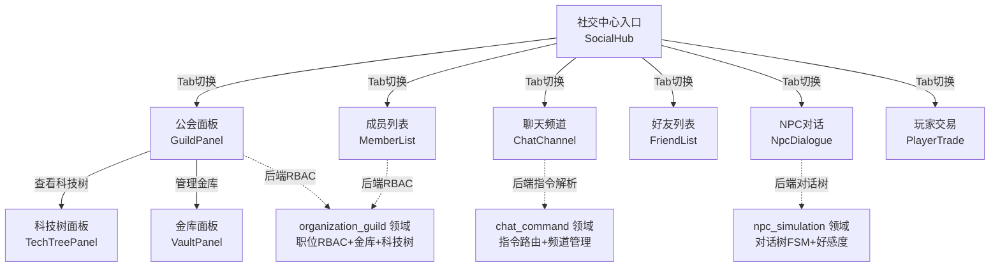
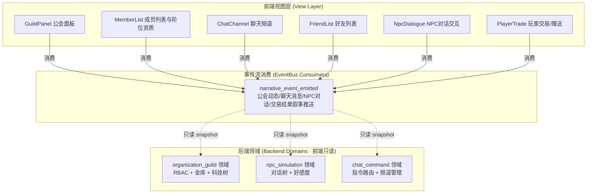
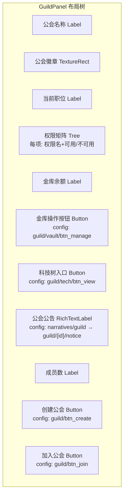
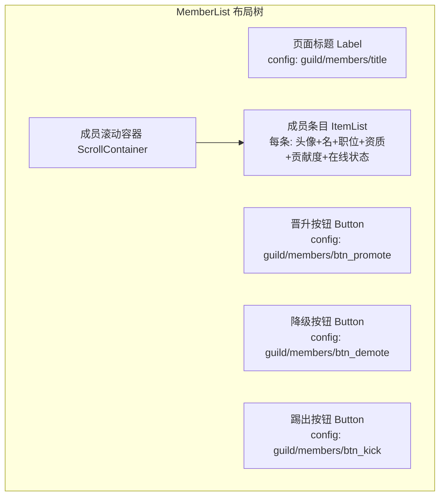
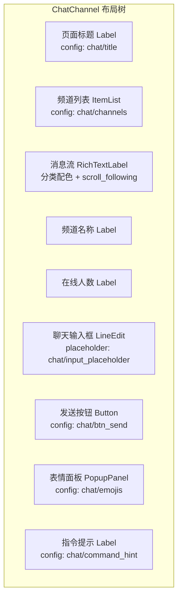
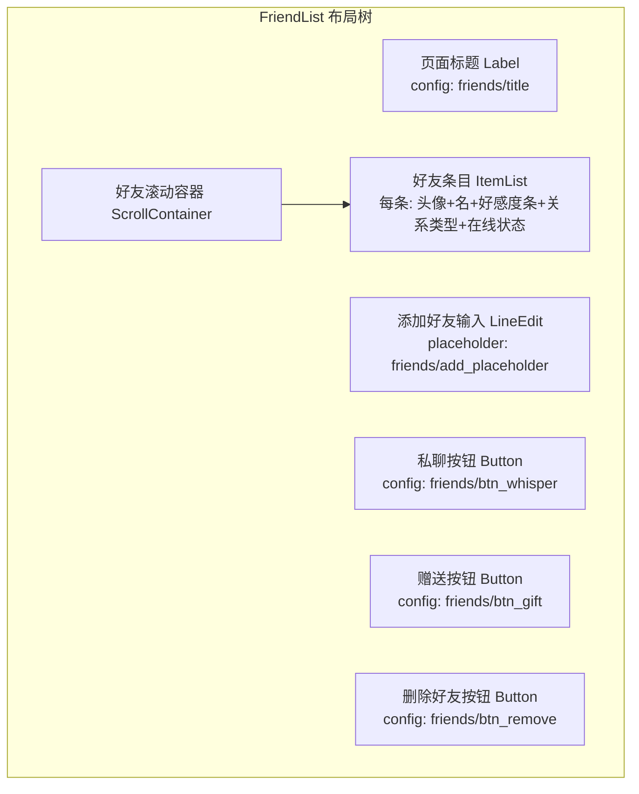
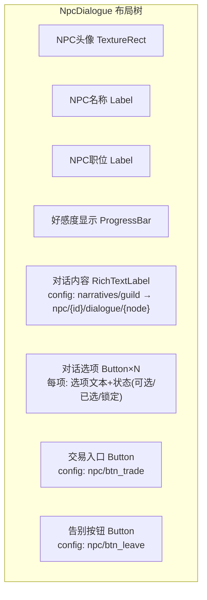
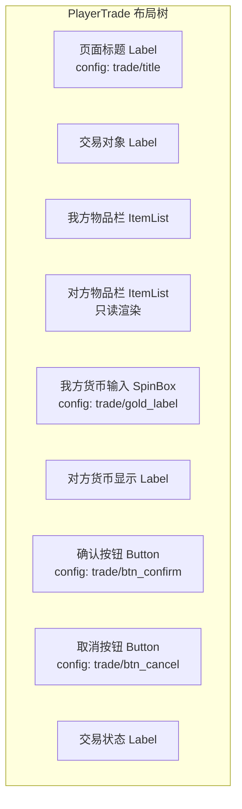

# 前端架构需求表9（第九卷：社交与公会系统）

> \[!NOTE]
> **【全局架构声明】**：本篇及全套前端技术文档中所提及的所有具体界面文案、按钮标签、配色令牌与演示数据，**均属基础演示示例（Illustrative Examples Only），绝非底层硬编码或静态写死结构**。前端表现层仅定义**事件流消费契约、视图-事件映射表、Theme 令牌层与组件可复用基座**，全部用户可见文案由 `config/frontend/ui.json` 与 `config/narratives/guild.json` 驱动。

***

## 一、 系统架构总览与视图模型划分 (Frontend Domain Overview)

### 1.1 架构设计理念：社交公会表现宿主 (Social Guild Presentation Host)

本前端系统以**公会管理、社交关系网络与 NPC 对话交互**为运行底座，前端视图只消费 `EventBus` 的 `narrative_event_emitted` 信号，以及 `GameConfig` 的只读配置查询，不持有任何 RBAC 权限判定、科技树解锁逻辑、聊天指令解析或 NPC 对话树推进（全部由后端 `organization_guild`、`npc_simulation`、`chat_command` 领域负责）。

* **表现层绝对解耦**：前端只负责「输入采集 → 透传后端 → 渲染反馈结果」，不做任何 RBAC 权限校验、科技树前置条件判定或对话分支选择逻辑；
* **职位权限零判定**：公会面板的职位 RBAC 权限由后端 `organization_guild` 领域下发权限快照，前端只根据快照渲染可用/不可用状态，不自行计算权限矩阵；
* **配置驱动文案**：全部公会职位名称、聊天频道名称、NPC 对话选项文案来自 `config/frontend/ui.json`，公会叙事与 NPC 对话文本来自 `config/narratives/guild.json`。

### 1.2 社交公会流程状态视图 (Social Guild Flow State Views)



### 1.3 核心子视图与事件映射 (View-Event Mapping)



***

## 二、 公会面板界面 (Guild Panel)

### 2.1 视图职责与布局

公会面板展示当前角色所在公会的总览信息，包括职位 RBAC 权限、金库资产与科技树进度。前端只渲染后端 `organization_guild` 领域下发的公会快照，**不做任何 RBAC 权限计算、金库余额校验或科技树前置条件判定**（全部由后端领域负责）。

| 区域       | 节点类型           | 内容来源                                          | 说明                       |
| :------- | :------------- | :-------------------------------------------- | :----------------------- |
| 公会名称     | Label          | 快照字段 `guild_name`                            | 公会名全文                    |
| 公会徽章     | TextureRect    | 快照字段 `guild_emblem`                          | 公会徽章图标                   |
| 当前职位     | Label          | 快照字段 `current_rank`                          | 角色在公会中的职位                |
| 权限矩阵     | Tree           | 快照字段 `permissions[]`                        | RBAC 权限项列表（可用/不可用）     |
| 金库余额     | Label          | 快照字段 `vault_balance`                        | 金币/银币/魔单晶                |
| 金库操作按钮   | Button         | `config/frontend/ui.json` → `guild/vault/btn_manage` | 透传后端金库操作（权限受限）       |
| 科技树入口    | Button         | `config/frontend/ui.json` → `guild/tech/btn_view` | 跳转科技树面板             |
| 公会公告     | RichTextLabel  | `config/narratives/guild.json` → `guild/{id}/notice` | bbcode 富文本公告          |
| 成员数       | Label          | 快照字段 `member_count`                          | 当前成员总数                   |
| 创建/加入公会  | Button         | `config/frontend/ui.json` → `guild/btn_create` / `btn_join` | 无公会时显示               |

### 2.2 布局树



### 2.3 输入采集与后端透传契约

```typescript
// 前端公会操作请求 DTO（透传后端 organization_guild 领域，前端不做 RBAC 判定）
interface GuildActionRequestDTO {
  guildId: string;         // 公会 ID
  characterId: string;
  action: string;           // 操作类型（vault_deposit/vault_withdraw/tech_research 等）
  payload?: Record<string, unknown>;  // 操作参数原样透传
}

// 后端返回的公会快照（前端只渲染，不判定）
interface GuildSnapshotDTO {
  guildId: string;
  guildName: string;
  guildEmblem: string;      // 徽章资源路径
  currentRank: string;      // 当前职位标签文案 key
  permissions: PermissionDTO[];  // RBAC 权限快照
  vaultBalance: {
    gold: number;
    silver: number;
    manaMonocrystals: number;
  };
  techTreeProgress: TechTreeNodeDTO[];  // 科技树节点状态
  memberCount: number;
  notice: string;           // 公告文案 key
  hasGuild: boolean;        // 是否已加入公会
}

interface PermissionDTO {
  permissionKey: string;     // 权限标识
  permissionLabel: string;   // 权限名称文案 key
  granted: boolean;          // 后端 RBAC 判定结果（前端只渲染）
  reason?: string;           // 不可用原因文案 key（可选）
}

interface TechTreeNodeDTO {
  nodeId: string;
  nodeLabel: string;        // 科技名称文案 key
  status: 'unlocked' | 'researching' | 'locked';
  progress?: number;        // 研究进度 0~100（后端计算）
  prerequisites: string[];   // 前置科技 ID（前端只渲染依赖箭头，不计算可达性）
}
```

### 2.4 公会面板事件消费代码示例

```gdscript
## 公会面板消费公会动态事件，只渲染不判定 RBAC
func _ready() -> void:
    EventBus.get_instance().narrative_event_emitted.connect(_on_narrative_event)
    _request_guild_snapshot()

## 请求后端下发公会只读快照（前端不做 RBAC/金库/科技树判定）
func _request_guild_snapshot() -> void:
    var req := {"character_id": GameState.current_character_id}
    BackendProxy.request("organization_guild", "guild_snapshot", req)

## 消费公会动态事件 → 更新权限/金库/科技树状态
func _on_narrative_event(packet: Dictionary) -> void:
    var cat = packet.get("category", "")
    var txt = packet.get("text", "")
    var action = packet.get("action", "")
    if cat == EventBus.get_category_name("society"):
        match action:
            "rank_changed":
                _update_rank_display(packet.get("new_rank", ""))
            "vault_updated":
                _update_vault_balance(packet)
            "tech_researched":
                _update_tech_node(packet.get("node_id", ""), packet.get("status", ""))
            "guild_notice":
                notice_label.append_text("[color=#94a3b8]" + txt + "[/color]\n")

## 金库操作按钮点击 → 透传后端，前端不做 RBAC/余额判定
func _on_vault_pressed() -> void:
    var req := GuildActionRequestDTO.new()
    req.guildId = _guild_id
    req.characterId = GameState.current_character_id
    req.action = "vault_view"
    BackendProxy.request("organization_guild", "vault_action", req)
```

***

## 三、 成员列表与阶位资质界面 (Member List & Rank)

### 3.1 视图职责与布局

成员列表界面展示公会全体成员及其阶位资质。前端只渲染后端 `organization_guild` 领域下发的成员列表只读快照，**不做任何阶位晋升条件判定或资质计算**（全部由后端领域负责）。

| 区域       | 节点类型           | 内容来源                                          | 说明                       |
| :------- | :------------- | :-------------------------------------------- | :----------------------- |
| 页面标题     | Label          | `config/frontend/ui.json` → `guild/members/title` | 如「公会成员名册」             |
| 成员列表     | ItemList       | `organization_guild.members[]` 只读快照          | 每条显示名/职位/在线/贡献度        |
| 成员头像     | TextureRect    | 快照字段 `portrait`                              | 成员角色头像                   |
| 成员名称     | Label          | 快照字段 `name`                                  | 角色名/假名                  |
| 当前职位     | Label          | 快照字段 `rank`                                  | 阶位名称（配置表驱动）             |
| 阶位资质     | Label          | 快照字段 `qualification`                        | 资质等级/功勋值                 |
| 贡献度       | Label          | 快照字段 `contribution`                          | 后端计算的贡献度                |
| 在线状态     | TextureRect    | 快照字段 `is_online`                              | 在线/离线图标                  |
| 晋升按钮     | Button         | `config/frontend/ui.json` → `guild/members/btn_promote` | 透传后端晋升（权限受限）       |
| 降级按钮     | Button         | `config/frontend/ui.json` → `guild/members/btn_demote` | 透传后端降级（权限受限）       |
| 踢出按钮     | Button         | `config/frontend/ui.json` → `guild/members/btn_kick` | 透传后端踢出（权限受限），前端做二次确认  |

### 3.2 布局树



### 3.3 输入采集与后端透传契约

```typescript
// 前端成员操作请求 DTO（透传后端 organization_guild 领域，前端不做阶位/资质判定）
interface MemberActionRequestDTO {
  guildId: string;
  targetMemberId: string;   // 操作目标成员 ID
  action: 'promote' | 'demote' | 'kick';
  characterId: string;       // 操作发起者 ID
}

// 后端返回的成员列表快照（前端只渲染，不判定）
interface MemberListSnapshotDTO {
  members: MemberEntryDTO[];
  selfRank: string;          // 自身职位（用于前端渲染可用操作按钮）
  canManage: boolean;        // 后端 RBAC 判定是否有管理权限（前端只渲染按钮状态）
}

interface MemberEntryDTO {
  memberId: string;
  name: string;              // 成员名/假名
  portrait: string;          // 头像路径
  rank: string;              // 阶位名称文案 key
  qualification: string;     // 资质等级文案 key
  contribution: number;       // 贡献度（后端计算）
  isOnline: boolean;
  joinedAt: number;           // 加入时间（世界时钟）
}
```

### 3.4 成员列表事件消费代码示例

```gdscript
## 成员列表消费成员变动事件，只渲染不判定阶位/资质
func _ready() -> void:
    EventBus.get_instance().narrative_event_emitted.connect(_on_narrative_event)
    _request_member_list_snapshot()

func _request_member_list_snapshot() -> void:
    BackendProxy.request("organization_guild", "member_list_snapshot",
        {"character_id": GameState.current_character_id})

func _on_narrative_event(packet: Dictionary) -> void:
    var cat = packet.get("category", "")
    var txt = packet.get("text", "")
    var action = packet.get("action", "")
    if cat == EventBus.get_category_name("society"):
        match action:
            "member_joined":
                _add_member_entry(packet)
            "member_left":
                _remove_member_entry(packet.get("member_id", ""))
            "rank_changed":
                _update_member_rank(packet.get("member_id", ""), packet.get("new_rank", ""))
            "contribution_updated":
                _update_member_contribution(packet.get("member_id", ""), packet.get("contribution", 0))
        member_log.append_text("[color=#94a3b8]" + txt + "[/color]\n")

## 踢出按钮点击 → 透传后端，前端不做权限判定
func _on_kick_pressed() -> void:
    var selected := member_list.get_selected_member_id()
    if selected.is_empty():
        return
    # 二次确认弹窗
    var confirm_text := GameConfig.get_string(
        "frontend.ui", "guild/members/kick_confirm",
        "确定踢出该成员？"  # 兜底默认值
    )
    if not _show_confirm_dialog(confirm_text):
        return
    var req := MemberActionRequestDTO.new()
    req.guildId = _guild_id
    req.targetMemberId = selected
    req.action = "kick"
    req.characterId = GameState.current_character_id
    BackendProxy.request("organization_guild", "member_action", req)
```

***

## 四、 聊天频道界面 (Chat Channel)

### 4.1 视图职责与布局

聊天频道界面展示当前可用的聊天频道与消息流。前端只渲染后端 `chat_command` 领域下发的频道列表与消息快照，**不做任何指令解析、频道权限校验或消息过滤**（全部由后端领域负责）。聊天输入框透传后端，由后端 `chat_command` 领域解析指令。

| 区域       | 节点类型           | 内容来源                                          | 说明                       |
| :------- | :------------- | :-------------------------------------------- | :----------------------- |
| 页面标题     | Label          | `config/frontend/ui.json` → `chat/title`     | 如「聊天频道」                  |
| 频道列表     | ItemList       | `chat_command.channels[]` 只读快照               | 世界/公会/区域/私聊等频道          |
| 消息流       | RichTextLabel  | 快照字段 `messages[]`                           | bbcode 富文本消息流，分类配色     |
| 频道名称     | Label          | 快照字段 `channel_name`                          | 当前频道名称                   |
| 在线人数     | Label          | 快照字段 `online_count`                          | 后端统计的在线人数                |
| 聊天输入框   | LineEdit       | `config/frontend/ui.json` → `chat/input_placeholder` | 输入消息/指令透传后端       |
| 发送按钮     | Button         | `config/frontend/ui.json` → `chat/btn_send` | 透传后端发送               |
| 表情面板     | PopupPanel     | `config/frontend/ui.json` → `chat/emojis`    | 表情快捷输入                   |
| 指令提示     | Label          | `config/frontend/ui.json` → `chat/command_hint` | 如「/ 指令由后端解析」         |

### 4.2 布局树



### 4.3 输入采集与后端透传契约

```typescript
// 前端聊天发送请求 DTO（透传后端 chat_command 领域，前端不做指令解析/权限校验）
interface ChatSendRequestDTO {
  channelId: string;       // 频道 ID
  message: string;         // 消息文本原样透传（含 / 指令前缀也原样透传）
  characterId: string;
}

// 后端返回的频道与消息快照（前端只渲染，不判定）
interface ChatSnapshotDTO {
  channels: ChatChannelDTO[];
  messages: ChatMessageDTO[];
  currentChannelId: string;
}

interface ChatChannelDTO {
  channelId: string;
  channelName: string;      // 频道名称文案 key
  category: string;         // 事件分类配色 key
  onlineCount: number;
  isJoined: boolean;        // 后端判定是否已加入
  canSend: boolean;         // 后端 RBAC 判定是否有发言权
}

interface ChatMessageDTO {
  messageId: string;
  senderName: string;
  senderType: 'system' | 'npc' | 'player';
  content: string;          // bbcode 富文本内容
  category: string;         // 事件分类配色 key
  timestamp: number;         // 世界时钟时刻
  isCommand: boolean;       // 后端判定是否为指令消息
}
```

### 4.4 聊天频道事件消费代码示例

```gdscript
## 聊天频道消费消息流事件，只渲染不解析指令
func _ready() -> void:
    EventBus.get_instance().narrative_event_emitted.connect(_on_narrative_event)
    _request_chat_snapshot()

func _request_chat_snapshot() -> void:
    BackendProxy.request("chat_command", "chat_snapshot",
        {"character_id": GameState.current_character_id})

## 消费聊天消息事件 → 追加消息流（分类配色）
func _on_narrative_event(packet: Dictionary) -> void:
    var cat = packet.get("category", "")
    var txt = packet.get("text", "")
    var action = packet.get("action", "")
    if action == "chat_message":
        var sender := packet.get("sender_name", "")
        var color := EventBus.get_instance().get_category_color(cat)
        # 消息流以对应分类配色展示，scroll_following 自动追尾
        msg_flow.append_text("[color=" + color + "][" + sender + "][/color] " + txt + "\n")
    elif action == "channel_updated":
        _refresh_channel_list(packet)

## 发送按钮点击 → 透传后端，前端不做指令解析/权限校验
func _on_send_pressed() -> void:
    var msg := input_edit.text.strip_edges()
    if msg.is_empty():
        return
    var req := ChatSendRequestDTO.new()
    req.channelId = _current_channel_id
    req.message = msg  # 含 / 指令前缀也原样透传，由后端 chat_command 解析
    req.characterId = GameState.current_character_id
    BackendProxy.request("chat_command", "send", req)
    input_edit.clear()
```

***

## 五、 好友列表界面 (Friend List)

### 5.1 视图职责与布局

好友列表界面展示当前角色的社交关系网络。前端只渲染后端 `chat_command`（或 `npc_simulation`）领域下发的好友列表只读快照，**不做任何好友关系判定或好感度计算**（全部由后端领域负责）。

| 区域       | 节点类型           | 内容来源                                          | 说明                       |
| :------- | :------------- | :-------------------------------------------- | :----------------------- |
| 页面标题     | Label          | `config/frontend/ui.json` → `friends/title` | 如「社交关系」                  |
| 好友列表     | ItemList       | `chat_command.friends[]` 只读快照                | 每条显示名/头像/在线/好感度        |
| 好友头像     | TextureRect    | 快照字段 `portrait`                              | 好友角色头像                   |
| 好友名称     | Label          | 快照字段 `name`                                  | 角色名/假名                  |
| 好感度条     | ProgressBar    | 快照字段 `affinity`                              | 后端计算的好感度 0~100         |
| 关系类型     | Label          | 快照字段 `relation_type`                        | 朋友/盟友/师徒/宿敌等           |
| 在线状态     | TextureRect    | 快照字段 `is_online`                              | 在线/离线图标                  |
| 私聊按钮     | Button         | `config/frontend/ui.json` → `friends/btn_whisper` | 跳转私聊频道            |
| 赠送按钮     | Button         | `config/frontend/ui.json` → `friends/btn_gift` | 跳转玩家交易/赠送界面         |
| 删除好友按钮 | Button         | `config/frontend/ui.json` → `friends/btn_remove` | 透传后端，前端做二次确认        |
| 添加好友输入 | LineEdit       | `config/frontend/ui.json` → `friends/add_placeholder` | 输入名/ID透传后端         |

### 5.2 布局树



### 5.3 输入采集与后端透传契约

```typescript
// 前端好友操作请求 DTO（透传后端，前端不做关系判定）
interface FriendActionRequestDTO {
  targetId: string;        // 目标好友 ID
  action: 'add' | 'remove' | 'whisper';
  characterId: string;
}

// 后端返回的好友列表快照（前端只渲染，不判定）
interface FriendListSnapshotDTO {
  friends: FriendEntryDTO[];
}

interface FriendEntryDTO {
  friendId: string;
  name: string;
  portrait: string;
  affinity: number;          // 好感度 0~100（后端计算）
  relationType: string;       // 关系类型文案 key
  isOnline: boolean;
  isNpc: boolean;             // 是否为 NPC 好友
}
```

### 5.4 好友列表事件消费代码示例

```gdscript
## 好友列表消费好友变动事件，只渲染不判定关系/好感度
func _ready() -> void:
    EventBus.get_instance().narrative_event_emitted.connect(_on_narrative_event)
    _request_friend_list_snapshot()

func _request_friend_list_snapshot() -> void:
    BackendProxy.request("chat_command", "friend_list_snapshot",
        {"character_id": GameState.current_character_id})

func _on_narrative_event(packet: Dictionary) -> void:
    var cat = packet.get("category", "")
    var txt = packet.get("text", "")
    var action = packet.get("action", "")
    if cat == EventBus.get_category_name("society"):
        match action:
            "friend_added":
                _add_friend_entry(packet)
            "friend_removed":
                _remove_friend_entry(packet.get("friend_id", ""))
            "affinity_changed":
                _update_friend_affinity(packet.get("friend_id", ""), packet.get("affinity", 0))
            "friend_online":
                _update_friend_online_status(packet.get("friend_id", ""), true)
            "friend_offline":
                _update_friend_online_status(packet.get("friend_id", ""), false)
        friend_log.append_text("[color=#94a3b8]" + txt + "[/color]\n")
```

***

## 六、 NPC 对话交互界面 (NPC Dialogue)

### 6.1 视图职责与布局

NPC 对话界面展示与 NPC 的对话树交互。前端只渲染后端 `npc_simulation` 领域下发的对话节点与选项快照，**不做任何对话树推进、好感度计算或分支选择逻辑**（全部由后端领域负责）。

| 区域       | 节点类型           | 内容来源                                          | 说明                       |
| :------- | :------------- | :-------------------------------------------- | :----------------------- |
| NPC 头像   | TextureRect    | 快照字段 `npc_portrait`                          | NPC 立绘/头像                |
| NPC 名称   | Label          | 快照字段 `npc_name`                              | NPC 名/假名                  |
| NPC 职位   | Label          | 快照字段 `npc_title`                             | NPC 职位/称号                |
| 好感度显示   | ProgressBar    | 快照字段 `affinity`                              | 后端计算的好感度 0~100         |
| 对话内容     | RichTextLabel  | `config/narratives/guild.json` → `npc/{id}/dialogue/{node}` | bbcode 富文本对话       |
| 对话选项     | Button ×N      | 快照字段 `options[]`                             | 选项按钮列表                   |
| 选项状态     | Label          | 快照字段 `options[].status`                     | 可选/已选/锁定                 |
| 交易入口     | Button         | `config/frontend/ui.json` → `npc/btn_trade` | NPC 可交易时显示             |
| 告别按钮     | Button         | `config/frontend/ui.json` → `npc/btn_leave` | 透传后端结束对话             |

### 6.2 布局树



### 6.3 输入采集与后端透传契约

```typescript
// 前端对话选项请求 DTO（透传后端 npc_simulation 领域，前端不做对话树推进/好感度计算）
interface DialogueSelectRequestDTO {
  npcId: string;           // NPC ID
  nodeId: string;          // 当前对话节点 ID
  optionId: string;        // 选中的选项 ID（原样透传）
  characterId: string;
}

// 后端返回的对话快照（前端只渲染，不判定）
interface DialogueSnapshotDTO {
  npcId: string;
  npcName: string;
  npcPortrait: string;
  npcTitle: string;
  affinity: number;          // 当前好感度（后端计算）
  currentNodeId: string;
  dialogueText: string;      // 对话正文（配置表驱动 bbcode）
  options: DialogueOptionDTO[];
  canTrade: boolean;        // 后端判定是否可交易
  dialogueEnded: boolean;    // 后端判定对话是否结束
}

interface DialogueOptionDTO {
  optionId: string;
  optionText: string;       // 选项文案 key
  status: 'available' | 'selected' | 'locked';
  lockReason?: string;      // 锁定原因文案 key（可选）
}
```

### 6.4 NPC 对话事件消费代码示例

```gdscript
## NPC对话界面消费对话节点变化事件，只渲染不推进对话树
func _ready() -> void:
    EventBus.get_instance().narrative_event_emitted.connect(_on_narrative_event)
    _request_dialogue_snapshot()

func _request_dialogue_snapshot() -> void:
    BackendProxy.request("npc_simulation", "dialogue_snapshot",
        {"npc_id": _npc_id, "character_id": GameState.current_character_id})

## 消费对话节点变化事件 → 更新对话内容与选项
func _on_narrative_event(packet: Dictionary) -> void:
    var cat = packet.get("category", "")
    var txt = packet.get("text", "")
    var action = packet.get("action", "")
    if action == "dialogue_node_changed":
        _render_dialogue_node(packet)
        # NPC 对话叙事文本以 society 配色展示
        dialogue_label.append_text("[color=#94a3b8]" + txt + "[/color]\n")
    elif action == "affinity_changed":
        _update_affinity_bar(packet.get("affinity", 0))

## 选项按钮点击 → 透传后端，前端不做对话树推进/好感度计算
func _on_option_pressed(option_id: String) -> void:
    var req := DialogueSelectRequestDTO.new()
    req.npcId = _npc_id
    req.nodeId = _current_node_id
    req.optionId = option_id
    req.characterId = GameState.current_character_id
    BackendProxy.request("npc_simulation", "select_option", req)
```

***

## 七、 玩家交易/赠送界面 (Player Trade)

### 7.1 视图职责与布局

玩家交易界面负责角色间物品/货币的赠送与交易。前端只采集输入并透传后端 `organization_guild`（或交易领域），**不做任何交易公平性判定、物品所有权校验或背包容量检查**（全部由后端领域负责）。

| 区域       | 节点类型           | 内容来源                                          | 说明                       |
| :------- | :------------- | :-------------------------------------------- | :----------------------- |
| 页面标题     | Label          | `config/frontend/ui.json` → `trade/title`   | 如「玩家交易」                  |
| 交易对象     | Label          | 快照字段 `partner_name`                          | 交易对象名/头像                 |
| 我方物品栏   | ItemList       | 当前背包快照                                       | 选择物品放入交易栏                |
| 对方物品栏   | ItemList       | 快照字段 `partner_items[]`                      | 对方放入的物品只读渲染             |
| 我方货币输入 | SpinBox        | `config/frontend/ui.json` → `trade/gold_label` | 金币/银币/魔单晶输入        |
| 对方货币显示 | Label          | 快照字段 `partner_currency`                     | 对方放入的货币只读显示             |
| 确认按钮     | Button         | `config/frontend/ui.json` → `trade/btn_confirm` | 透传后端确认交易             |
| 取消按钮     | Button         | `config/frontend/ui.json` → `trade/btn_cancel` | 透传后端取消交易             |
| 交易状态     | Label          | 后端交易状态事件                                     | 等待/已确认/成功/失败            |

### 7.2 布局树



### 7.3 输入采集与后端透传契约

```typescript
// 前端交易请求 DTO（透传后端，前端不做公平性/所有权/容量判定）
interface TradeRequestDTO {
  partnerId: string;       // 交易对象 ID
  itemIds: string[];       // 我方放入的物品 ID 列表
  currency: {              // 我方放入的货币
    gold?: number;
    silver?: number;
    manaMonocrystals?: number;
  };
  action: 'offer' | 'confirm' | 'cancel';
  characterId: string;
}

// 后端返回的交易快照（前端只渲染，不判定）
interface TradeSnapshotDTO {
  partnerName: string;
  partnerItems: TradeItemDTO[];   // 对方放入的物品（只读）
  partnerCurrency: {
    gold?: number;
    silver?: number;
    manaMonocrystals?: number;
  };
  myItems: TradeItemDTO[];         // 我方已放入的物品
  myCurrency: {
    gold?: number;
    silver?: number;
    manaMonocrystals?: number;
  };
  status: 'pending' | 'confirmed' | 'completed' | 'cancelled' | 'failed';
  selfConfirmed: boolean;
  partnerConfirmed: boolean;
}

interface TradeItemDTO {
  itemId: string;
  itemName: string;
  quantity: number;
  iconPath: string;
}
```

### 7.4 玩家交易事件消费代码示例

```gdscript
## 玩家交易界面消费交易状态变化事件，只渲染不判定公平性/所有权
func _ready() -> void:
    EventBus.get_instance().narrative_event_emitted.connect(_on_narrative_event)
    _request_trade_snapshot()

func _request_trade_snapshot() -> void:
    BackendProxy.request("organization_guild", "trade_snapshot",
        {"character_id": GameState.current_character_id})

func _on_narrative_event(packet: Dictionary) -> void:
    var cat = packet.get("category", "")
    var txt = packet.get("text", "")
    var action = packet.get("action", "")
    if cat == EventBus.get_category_name("society"):
        match action:
            "trade_item_offered":
                _update_partner_items(packet)
            "trade_currency_offered":
                _update_partner_currency(packet)
            "trade_confirmed":
                _update_confirm_status(packet)
            "trade_completed":
                _show_trade_result(true, packet)
            "trade_failed":
                _show_trade_result(false, packet)
            "trade_cancelled":
                _close_trade_view()
        trade_log.append_text("[color=#94a3b8]" + txt + "[/color]\n")

## 确认按钮点击 → 透传后端，前端不做公平性判定
func _on_confirm_pressed() -> void:
    var req := TradeRequestDTO.new()
    req.partnerId = _partner_id
    req.itemIds = _selected_item_ids
    req.currency = _selected_currency
    req.action = "confirm"
    req.characterId = GameState.current_character_id
    BackendProxy.request("organization_guild", "trade_action", req)
```

***

## 八、 Theme 令牌与配色规范 (Theme Tokens)

社交与公会系统的全部配色由 Theme 令牌层统一管理，与 `event_categories.json` 对齐：

| UI 元素     | 配色来源                                   | 令牌          | 兜底默认值                        |
| :--------- | :--------------------------------------- | :---------- | :--------------------------- |
| 页面背景       | Theme                                    | `--bg`      | `Color(0.06, 0.08, 0.12, 1)` |
| 主标题文字     | Theme                                    | `--title`   | `Color(0.38, 0.75, 0.98, 1)` |
| 普通正文       | Theme                                    | `--text`    | `Color(0.88, 0.91, 0.95, 1)` |
| 社交事件文字   | `event_categories.json` → `society`     | `#94a3b8`   | —                            |
| 系统通知事件   | `event_categories.json` → `system`      | `#38bdf8`   | —                            |
| 权限可用       | Theme                                    | `--success` | `Color(0.20, 0.83, 0.60, 1)` |
| 权限不可用   | Theme                                    | `--muted`   | `Color(0.45, 0.48, 0.52, 1)` |
| 在线状态       | Theme                                    | `--success` | `Color(0.20, 0.83, 0.60, 1)` |
| 离线状态       | Theme                                    | `--muted`   | `Color(0.45, 0.48, 0.52, 1)` |
| 交易成功       | Theme                                    | `--success` | `Color(0.20, 0.83, 0.60, 1)` |
| 交易失败       | Theme                                    | `--danger`  | `Color(0.97, 0.53, 0.53, 1)` |
| 默认事件       | `event_categories.json` → `_default`     | `#94a3b8`   | —                            |

***

## 九、 验收矩阵 (DoD Matrix)

| 验收项          | 验收标准                                         | 验证方式                                               |
| :------------- | :------------------------------------------- | :------------------------------------------------- |
| 公会面板可达       | 社交中心入口可到达公会面板，无崩溃                            | `godot` 启动观察                                       |
| 成员列表渲染     | 成员名册正确展示头像/职位/资质/贡献度/在线状态                  | 手动走查                                               |
| 聊天频道消息流   | 消息流分类配色正确，scroll_following 自动追尾              | 手动走查                                               |
| 好友列表渲染     | 好友头像/好感度/关系类型/在线状态正确渲染                      | 手动走查                                               |
| NPC对话可交互   | NPC 对话选项可点击并透传后端，对话节点正确切换                | 手动走查                                               |
| 玩家交易可发起   | 交易界面可选择物品/货币并透传后端确认                        | 手动走查                                               |
| 文案零硬编码      | 所有职位名/频道名/对话选项/按钮文案均来自配置表                  | `rg "公会成员名册" frontend/` 仅命中配置读取                  |
| 配色配置驱动      | 删除 `event_categories.json` 的 `society` 分类后回退默认色 | 配置表删键后验证                                           |
| 零逻辑纪律       | 前端代码无 RBAC 判定/对话树FSM/指令解析/好感度计算        | `rg "rbac_check\|dialogue_fsm\|parse_command\|affinity_calc" frontend/` 无命中 |
| 事件消费完整     | `narrative_event_emitted` 的 society 相关 action 均有视图消费 | 事件注入测试                                             |
| 视图可切换       | 公会 ↔ 成员 ↔ 聊天 ↔ 好友 ↔ NPC对话 ↔ 交易 均可导航      | 手动走查                                               |
