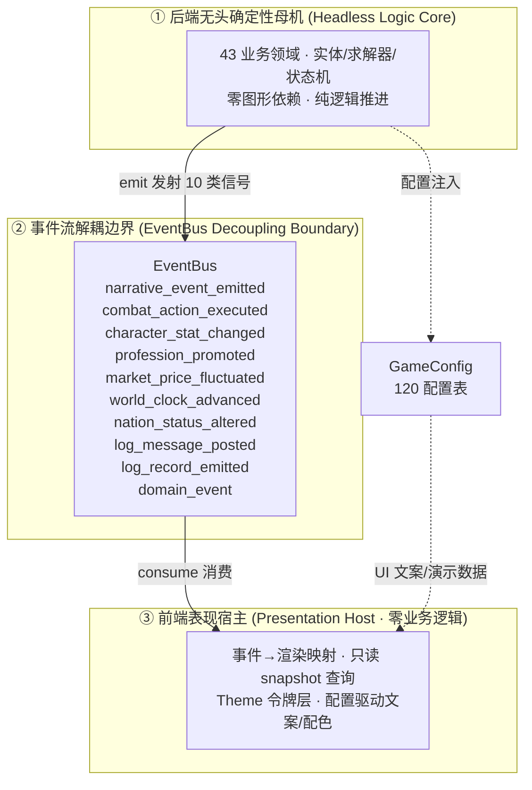
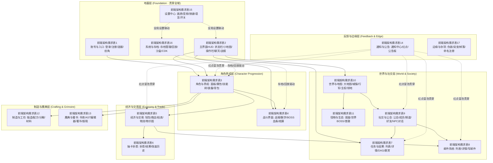

# 前端架构需求表索引 (Frontend Architecture Specification Index)

***

## 一、 架构体系总览

卡拉尔世界引擎（Kalar World Engine）前端架构是严格遵循「表现层与逻辑母机绝对解耦」原则的**确定性表现宿主体系**：前端 100% 独立于后端业务逻辑，不持有任何状态机、求解器或领域实体，唯一数据来源是 `EventBus` 事件流推送与 `GameConfig` 配置表只读查询。

> \[!NOTE]
> **【全局架构声明】**：本套前端规范提及的具体界面文案、按钮标签、配色令牌、布局数值与演示数据，**均属基础演示示例（Illustrative Examples Only），绝非底层硬编码或静态写死结构**。前端表现层仅定义**事件流消费契约、视图-事件映射表、Theme 令牌层与组件可复用基座**；用户可见文案由 `config/frontend/ui.json` 与 `config/narratives/*.json` 驱动，配色由 `config/infrastructure/event_categories.json` 驱动。

### 1.1 表现层解耦宿主哲学 (Presentation-Agnostic Host)



### 1.2 前端三大铁律 (Three Iron Laws)

1. **零逻辑纪律**：前端只做「事件 → 渲染」映射与只读状态 snapshot 查询，严禁内嵌任何求解器调用、状态机推进或确定性 RNG 调用；
2. **配置驱动**：全部用户可见文案、按钮标签、格式模板来自 `config/frontend/ui.json` 与 `config/narratives/*.json`；全部事件分类配色来自 `config/infrastructure/event_categories.json`；代码内只保留兜底默认值；
3. **单视图不可膨胀**：每个领域视图只消费其对应的事件分类，严禁将多领域入口堆砌进单一仪表盘（当前 `main_dashboard` 为过渡态演示页，后续按系统拆分独立视图）。

### 1.3 从 1.0 文字版到 2.0/3.0 图形版的平滑演进

* **1.0 文字版**（当前阶段）：前端直接消费事件流中的叙事模板与分类文本，进行打字机控制台、bbcode 富文本战报与文字面板渲染；

* **未来 2.0 (2D)**：图形前端消费同一事件流中的物理动词、坐标向量与碰撞参数驱动 2D 骨骼与地图探索动画，**前端事件消费契约 1 行无需改动**；

* **未来 3.0 (3D)**：3D 动作动捕与粒子视效消费同一事件流，**后端核心代码与前端事件契约零改动**。

***

## 二、 十七大前端系统依赖全景图 (17-System Dependency Graph)



***

## 三、 十七大前端系统分卷目录索引表 (Volume Index)

### 🚀 总纲：[卡拉尔世界引擎全域开发路线图.md](../卡拉尔世界引擎开发路线图.md)

| 系统编号     | 文档名称                                                                                               | 核心界面与前端规范职责                                                                                                                                               | 消费 EventBus 信号                                                                        | 后端领域映射                                                                                                                  | 当前状态       |
| :------- | :------------------------------------------------------------------------------------------------- | :-------------------------------------------------------------------------------------------------------------------------------------------------------- | :------------------------------------------------------------------------------------ | :---------------------------------------------------------------------------------------------------------------------- | :--------- |
| **第一卷** | [前端架构需求表1.md](前端架构需求表1.md) | **账号与入口系统** | `log_message_postednarrative_event_emitted` | account · telemetry\_account\_lifecycle · character\_creation | ✅ **已落盘** |
| **第二卷** | [前端架构需求表2.md](前端架构需求表2.md) | **主界面 HUD** | `world_clock_advancednarrative_event_emittedlog_message_postedcharacter_stat_changed` | event\_bus · world\_clock\_master · narrative\_orchestration | ✅ **已落盘** |
| **第三卷** | [前端架构需求表3.md](前端架构需求表3.md) | **角色与养成系统** | `character_stat_changedprofession_promotednarrative_event_emitted` | character\_creation · lifecycle\_physiology · potential\_growth · equipment\_loadout · inventory · lattice\_skill\_book | ✅ **已落盘** |
| **第四卷** | [前端架构需求表4.md](前端架构需求表4.md) | **战斗界面系统** | `combat_action_executednarrative_event_emitted` | combat · physics\_thermodynamics | ✅ **已落盘** |
| **第五卷** | [前端架构需求表5.md](前端架构需求表5.md) | **经济与交易系统** | `market_price_fluctuatednarrative_event_emitted` | currency\_economy · trading\_logistics · spatial\_merchant | ✅ **已落盘** |
| **第六卷** | [前端架构需求表6.md](前端架构需求表6.md) | **抽卡祈愿系统** | `narrative_event_emitted` | gacha\_wish | ✅ **已落盘** |
| **第七卷** | [前端架构需求表7.md](前端架构需求表7.md) | **任务与因果系统** | `narrative_event_emitted` | commission\_quest · quest\_causality | ✅ **已落盘** |
| **第八卷** | [前端架构需求表8.md](前端架构需求表8.md) | **邮件系统** | `narrative_event_emitted` | mail\_system | ✅ **已落盘** |
| **第九卷** | [前端架构需求表9.md](前端架构需求表9.md) | **社交与公会系统** | `narrative_event_emitted` | organization\_guild · npc\_simulation · chat\_command | ✅ **已落盘** |
| **第十卷** | [前端架构需求表10.md](前端架构需求表10.md) | **世界与地图系统** | `world_clock_advancednation_status_alterednarrative_event_emitted` | world\_navigation · spatial\_movement · sovereignty\_realm | ✅ **已落盘** |
| **第十一卷** | [前端架构需求表11.md](前端架构需求表11.md) | **怪物与生态系统** | `combat_action_executednarrative_event_emitted` | monster\_ecology · world\_boss | ✅ **已落盘** |
| **第十二卷** | [前端架构需求表12.md](前端架构需求表12.md) | **制造与工坊系统** | `narrative_event_emitted` | workshop\_forge · matter\_disposal | ✅ **已落盘** |
| **第十三卷** | [前端架构需求表13.md](前端架构需求表13.md) | **魔典与著书系统** | `narrative_event_emitted` | lattice\_skill\_book · narrative\_orchestration | ✅ **已落盘** |
| **第十四卷** | [前端架构需求表14.md](前端架构需求表14.md) | **通知与公告系统** | `narrative_event_emittedlog_message_posted` | notification\_red\_dot · bulletin\_board\_maintenance | ✅ **已落盘** |
| **第十五卷** | [前端架构需求表15.md](前端架构需求表15.md) | **设置中心系统** | `log_message_posted` | game\_settings · hardware\_input · feature\_toggle\_canary · event\_driven\_audio · localization\_i18n | ✅ **已落盘** |
| **第十六卷** | [前端架构需求表16.md](前端架构需求表16.md) | **系统与存档系统** | `log_message_postednarrative_event_emitted` | persistence\_protocol · deterministic\_sandbox · admin\_sandbox · cdkey\_voucher | ✅ **已落盘** |
| **第十七卷** | [前端架构需求表17.md](前端架构需求表17.md) | **边缘与杂项系统** | `narrative_event_emittedcharacter_stat_changed` | identity\_disguise · elite\_mutation · ground\_loot · item\_namespace\_registry | ✅ **已落盘** |

***

## 四、 前端技术栈选型与 Godot UI 架构矩阵 (Frontend Tech Stack)

### 4.1 核心分层哲学：表现层解耦宿主

卡拉尔世界引擎前端严格贯彻\*\*「表现层只消费事件、不持有逻辑」\*\*的原则，与后端后端架构需求表索引第三条「无头母机 vs 表现宿主」互为镜像：

| 层级                         | 职责                     | 数据来源                               | 禁止行为            |
| :------------------------- | :--------------------- | :--------------------------------- | :-------------- |
| **视图层 (View Layer)**       | 事件→渲染映射、布局、动效          | EventBus 信号 + GameConfig 只读查询      | ❌ 调用求解器/状态机/RNG |
| **组件层 (Component Layer)**  | 可复用 UI 基座（面板/按钮/列表/图表） | Theme 令牌 + 配置文案                    | ❌ 内嵌业务判定逻辑      |
| **主题层 (Theme Layer)**      | 配色令牌、字号层级、间距栅格、圆角      | `event_categories.json` 配色 + 兜底默认值 | ❌ 硬编码颜色/字号      |
| **导航层 (Navigation Layer)** | 视图间路由、Tab 切换、弹窗栈管理     | 视图注册表                              | ❌ 持有领域状态        |

### 4.2 推荐技术栈选型矩阵

| 系统层级        | 推荐选型方案                            | 核心技术选型依据与优势                                                                                                                                             | 备选/演进方案               |
| :---------- | :-------------------------------- | :------------------------------------------------------------------------------------------------------------------------------------------------------ | :-------------------- |
| **前端客户端宿主** | **Godot Engine 4.x (GDScript)**   | • **事件原生契合**：信号系统与 EventBus 推流天然对接；• **UI 系统成熟**：Control 节点树 + Theme 资源 + bbcode 富文本；• **全平台导出**：一键导出 Web/Win/Mac/Linux/iOS/Android；• **开源无版税**：MIT 协议。 | Vue3 + PixiJS (Web 端) |
| **UI 布局系统** | **Godot Control 节点树 + Theme 资源**  | • VBox/HBox/Grid/Tab/Split 容器原生平铺；• Theme 资源统一管理配色/字号/间距，与配置表对齐；• 锚点与 grow 实现响应式自适应。                                                                    | 自定义布局引擎               |
| **富文本战报**   | **RichTextLabel + bbcode**        | • 原生支持 `[color]`/`[b]`/`[img]` 标签；• `scroll_following` 自动追尾；• 分类配色直接读 `event_categories.json`。                                                          | 自定义文本渲染               |
| **主题令牌层**   | **Godot Theme 资源 + 配置表驱动**        | • 运行时动态生成 Theme，配色读配置表；• 新增事件分类无需改代码，自动继承配色。                                                                                                            | 硬编码 Color             |
| **数据可视化**   | **Godot Control 自绘 + 预留 Chart 库** | • 1.0 文字版用 ProgressBar/ItemList/Tree 自绘；• 2.0 预留接入图表库（物价曲线/DAG 图）。                                                                                      | 第三方图表插件               |

### 4.3 Theme 令牌层与配置表对齐契约

前端 Theme 令牌必须与 `config/infrastructure/event_categories.json` 的分类配色严格对齐，实现「新增事件分类 → 自动继承配色、零代码改动」：

```gdscript
## 运行时从 event_categories.json 动态构建 Theme 配色表
## 新增分类只需在配置表加一行，前端自动渲染对应颜色
func _get_category_color(category_name: String) -> String:
    var categories := GameConfig.get_dict("infrastructure.event_categories", "", {})
    for key in categories:
        var entry: Dictionary = categories[key]
        if entry.get("name", "") == category_name:
            return entry.get("color", _default_category_color())
    return _default_category_color()
```

| 事件分类        | 配色令牌      | 配置键           | 用途     |
| :---------- | :-------- | :------------ | :----- |
| COMBAT      | `#f87171` | `combat`      | 战斗事件战报 |
| TRAVEL      | `#34d399` | `travel`      | 行军探索事件 |
| BIO         | `#94a3b8` | `bio`         | 生理时钟事件 |
| ECONOMY     | `#facc15` | `economy`     | 经济交易事件 |
| GRIMOIRE    | `#c084fc` | `grimoire`    | 魔典著书事件 |
| SOVEREIGNTY | `#60a5fa` | `sovereignty` | 主权建国事件 |
| QUEST       | `#a3e635` | `quest`       | 任务因果事件 |
| SYSTEM      | `#38bdf8` | `system`      | 系统通知事件 |
| DEFAULT     | `#94a3b8` | `_default`    | 兜底默认色  |

***

## 五、 前端实施分期路线 (Implementation Phasing)

| 阶段        | 目标                       | 涉及系统                 | 验收标准                                |
| :-------- | :----------------------- | :------------------- | :---------------------------------- |
| **P0 地基** | 账号入口 + 主菜单框架 + Theme 令牌层 | 表1 · 表2 · 表15        | 登录→主菜单→设置 可走通；Theme 配色与配置表对齐        |
| **P1 核心** | 角色面板 + 战斗 + 经济 + 战报      | 表3 · 表4 · 表5         | 玩家可查看属性、发起战斗、消费货币；EventBus 全信号有视图消费 |
| **P2 世界** | 世界地图 + 任务 + 邮件 + 社交      | 表10 · 表7 · 表8 · 表9   | 大地图可导航、任务可追踪、邮件可收发、公会可管理            |
| **P3 深度** | 抽卡 + 工坊 + 魔典 + 怪物图鉴      | 表6 · 表12 · 表13 · 表11 | 抽卡可抽、装备可造、招式可编、BOSS 可战              |
| **P4 闭环** | 通知 + 存档 + 回放 + 边缘        | 表14 · 表16 · 表17      | 红点树冒泡、存档可管、回放可审、全领域有入口              |

