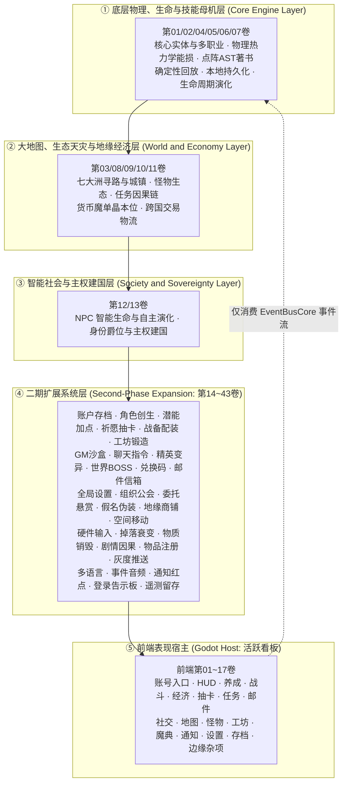

# 卡拉尔世界引擎全域开发实施路线图 (Kalar World Engine Master Roadmap)

> [!IMPORTANT]
> **【全局研发与 Agent 施工总纲】**：统领全域 **129 大已验收历史案卷 = 后端 42 卷 + 前端 17 卷 + 短期已归档 70 卷，共 586 件标准化施工细则**（另含在案后端 43 卷需求表与第 08 期短期施工在途卷）。每案卷拆解为 4 大标准施工阶段（实体定义 ➔ 算法求解 ➔ 状态机集成 ➔ 验收测试），以命令式打勾清单 (`- [ ]`) 全程约束实施。
>
> **三层体系（本文件只做总纲导航，细节按需加载）**：
> ① **活跃看板**：[路线图/路线图总索引.md](路线图/路线图总索引.md) —— 前端 17 卷 × 4 阶段 = 68 阶段打勾执行；
> ② **已验收档案**：[归档库/卡拉尔全宗档案总目录与元数据库.md](归档库/卡拉尔全宗档案总目录与元数据库.md) —— 586 件全量元数据与档号（`KALAR-DEV-2026-RMxx-xxx`）检索；
> ③ **需求真理源**：[后端架构需求表索引](后端架构/后端架构需求表索引.md)（43 卷）与 [前端架构需求表索引](前端架构/前端架构需求表索引.md)（17 卷）。
>
> Agent 操作契约与文档门禁见 [README.md](README.md)；本路线图严格基于《基本玩法需求设计稿》全套六卷制定。

---

## 一、 四层工程实施全景图 (Engineering Panorama)

---

## 二、 施工细则导航（按需加载，不在本文重复明细表）

| 层级 | 内容 | 数量 | 入口 |
| :--- | :--- | :---: | :--- |
| 活跃看板 | 前端 17 卷 × 4 阶段命令式打勾清单 | 68 | [路线图/路线图总索引.md](路线图/路线图总索引.md) |
| 已验收档案 | 后端 42 卷（168 阶段）+ 前端 17 卷（68 阶段）+ 短期 70 卷（280 阶段正件 + 70 附件） | 586 | [归档库/卡拉尔全宗档案总目录与元数据库.md](归档库/卡拉尔全宗档案总目录与元数据库.md) |
| 档案元数据 | 129 大案卷 586 件全宗总目录（档号 / 题名 / 主题词 / 直达链接） | 586 | [归档库/卡拉尔全宗档案总目录与元数据库.md](归档库/卡拉尔全宗档案总目录与元数据库.md) |
| 需求真理源 | 后端 43 卷需求表 + 前端 17 卷需求表 | 60 | [后端架构需求表索引](后端架构/后端架构需求表索引.md) · [前端架构需求表索引](前端架构/前端架构需求表索引.md) |

**前端路线图开工纪律**：前端 17 卷的施工实施（写码 / 建场景）须经项目负责人明确授予后方可启动；
在未授予期间，允许且仅允许对路线图文档做规范化、与后端需求表的逻辑对齐修正。

---

## 三、 确定性审计与验收交付标准 (DoD Matrix)

1. **确定性物理与热力学断言**：所有伤害、相变能损与经历增长在相同种子下 1,000 次运行哈希完全一致；
2. **三维点阵与著书闭环**：自创招式能损化简后，成功转化为真实物品，并在集市与藏经阁产生真实货币流动；
3. **主权与社会自治闭环**：自建国家与政变夺权能够真实接管领地税收、关税并改写世界格局；
4. **全域门禁全绿**：`bash scripts/sh/audit-all.sh` 通过（含架构护栏 TC-ARCH-01~06、配置审查与文档四域基线棘轮门禁）。
