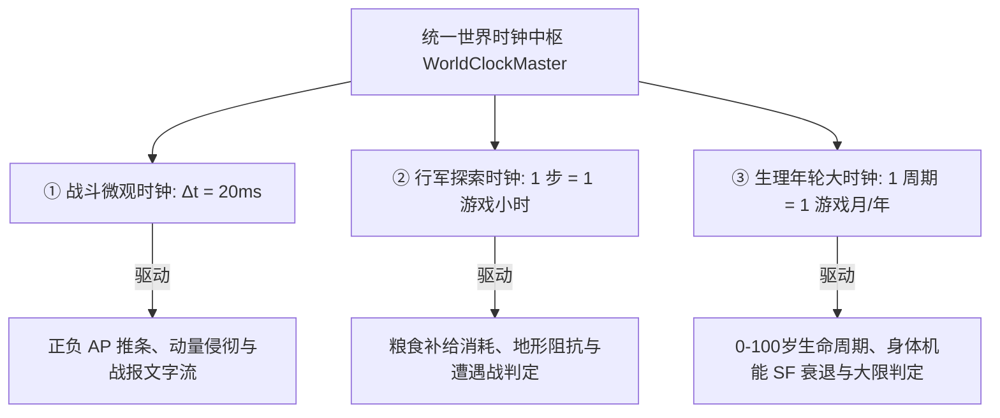
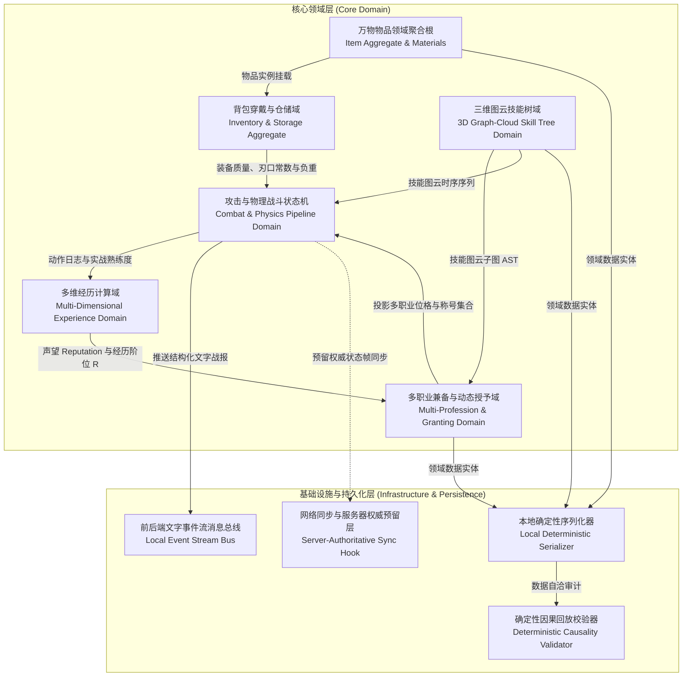
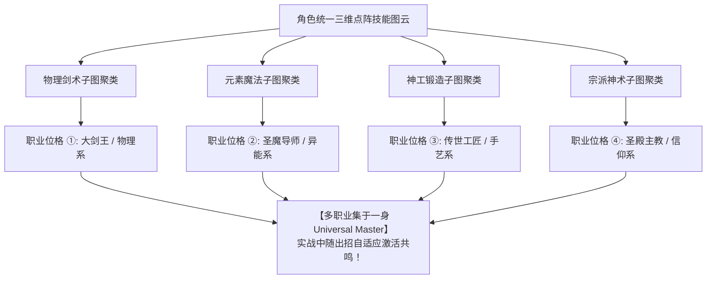
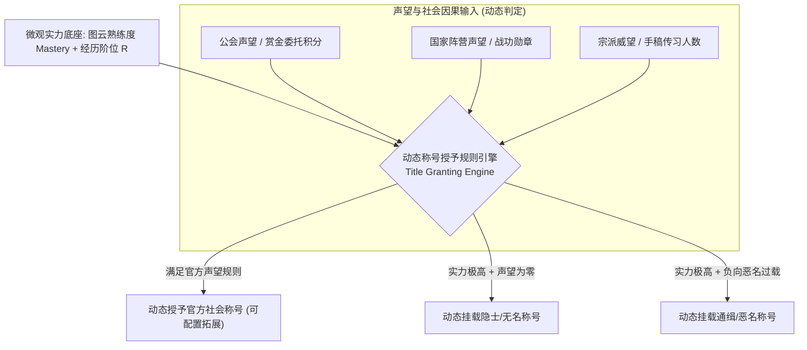

# 后端架构需求表1（第一卷：核心领域模型、物品系统与自发涌现职业）

> [!NOTE]
> **【全局架构声明】**：本篇及全套技术文档中所提及的所有具体职业名称、称号文本、物品材质范例与种族生理参数，**均属基础演示示例（Illustrative Examples Only），绝非底层硬编码或静态写死结构**。底层引擎仅定义**无边界图云特征空间、万物物理属性聚合模型、多职业兼备与动态聚类投影算法、以及系统运行时动态授予称号与位格的扩展接口**。

---

## 一、 系统架构总览与领域模型划分 (DDD Domain Overview)

### 1.1 架构设计理念：文字版无头确定性母机 (Headless Deterministic Text-Stream Engine)
本后端架构系统以**1.0 文字版单机无头确定性引擎**为核心运行底座，采用基于**离散数学、状态机因果链、三维有向加权图论与热力学能损律**的第一性原理进行建模。
* **表现层绝对解耦 (Presentation-Agnostic)**：后端核心引擎 100% 独立于 UI 渲染层。后端只负责状态推进、物理碰撞因果结算，并向前端推流**结构化文字事件流 (Structured Text Event Stream)**；
* **从 1.0 文字版到 2.0/3.0 图形版的平滑演进**：
  - **1.0 文字版**：前端直接根据事件流中的文学模板与叙事文本进行打字机控制台与富文本卡片渲染；
  - **未来 2.0 (2D) / 3.0 (3D) 版**：图形前端消费同一个 JSON 事件流中的物理动词、符文枚举与碰撞参数驱动骨骼与动捕动画，**后端核心代码 1 行无需改动**；
* **单机立足，预留网络权威**：单机环境下本地即为权威裁决者；同时预留标准网络输入快照与服务器权威状态广播接口。

### 1.2 三级世界时钟调度模型 (Tri-Level World Clock Engine)
针对文字魔幻 RPG 的不同玩法粒度，后端建立严格分层的三级时间推进中枢：



### 1.3 核心子域与上下文映射 (Bounded Context Mapping)


---

## 二、 物品系统、背包穿戴与仓储聚合 (Item System & Storage Aggregate)

### 2.1 万物物品领域实体模型 (Item Entity & Physical Properties)
```typescript
export type ItemCategory =
  | 'WEAPON_BLADE'        // 刃类兵器 (剑、刀、匕首)
  | 'WEAPON_BLUNT'        // 钝类兵器 (锤、杖、盾牌)
  | 'WEAPON_POLE'         // 长柄兵器 (枪、戟、矛)
  | 'ARMOR_EQUIPMENT'     // 防具装具 (甲胄、战靴、头盔、斗篷)
  | 'CONSUMABLE_POTION'   // 消耗品 (药剂、合剂、解毒草)
  | 'CONSUMABLE_RATION'   // 口粮补给 (干粮、肉干、清水)
  | 'MANA_CRYSTAL'        // 魔素结晶 / 核心素材 (魔单晶、异兽核)
  | 'CRAFTING_MATERIAL'   // 锻造原材料 (生铁、精金、秘银、龙鳞)
  | 'MANUSCRIPT_GRIMOIRE' // 典籍手稿 (大剑谱、魔导书、信物卷轴)
  | 'QUEST_MISC';         // 剧情信物 / 杂物

export interface ItemEntity {
  itemId: UUID;
  templateId: string;
  customName: string;
  category: ItemCategory;
  massKg: number;
  volumeSlots: number;
  durability: { current: number; max: number; hardness: number };
  combatMetrics?: {
    edgeSharpness?: number;
    reachMeters?: number;
    effectiveArmor?: number;
    elementalResistances?: Record<string, number>;
  };
  affixSockets: {
    totalSockets: number;
    imprintedRunes: string[];
    dynamicAffixes: Array<{ affixId: string; value: number }>;
  };
  marketBasePrice: number;
  crafterSignatureId?: UUID;
}
```

### 2.2 随身背包动态穿戴聚合模型 (Wearable Slot Storage Aggregation)
$$\text{Capacity}_{\text{total}} = \text{Capacity}_{\text{base}} + \sum_{i \in \text{EquippedSlots}} \text{Capacity}(i) \times (1 + \mu_{\text{race}})$$

### 2.3 自然人度量原器与零基线定义 (Baseline 0 Standard)
* **绝对基线定义 ($\text{Capacity}_{\text{base}} = 0$)**：以标准健康自然人（人类度量原器）在全裸无装备状态下的储物能力作为数学基准零点；
* **无装备物理约束**：无任何穿戴装备的人类，随身背包槽位严格恒等于 0，无法存放任何非手持物品。

### 2.4 仓库系统接口契约
```typescript
interface IWarehouseStorageService {
    openVault(characterId: UUID, vaultId: UUID): Promise<VaultAggregate>;
    transferItem(from: StorageSlot, to: StorageSlot, itemInstance: ItemEntity): TransactionResult;
    serializeLocalVault(vaultId: UUID): LocalStorageBlob;
    syncRemoteVault?(characterId: UUID, remoteEndpoint: string): Promise<SyncResult>;
}
```

---

## 三、 多维经历系统架构 (Multi-Dimensional Experience System)

### 3.1 废除传统单维 EXP 的多维重构模型
```
经历系统 (Experience System) = 声望模块 (Reputation) ⊗ 阅历模块 (Growth Phase) ⊗ 熟练模块 (Proficiency)
```

$$\mathcal{R} = \left\lfloor \alpha \cdot \ln(1 + \text{Reputation}) + \beta \cdot \left(\frac{\text{AgeProgress}}{\text{MaxLife}}\right)^{\gamma} \cdot \text{ExplorationIndex} + \delta \cdot \sum_{k} \omega_k \cdot \text{Mastery}_k \right\rfloor$$

---

## 四、 技能树系统架构 (3D Graph-Cloud Topology & Neural Memory)

### 4.1 三维有向加权图云拓扑模型 (3D Graph-Cloud Topology)
$$\mathcal{G}_{\text{skill}} = (V, E, W, \vec{P})$$

* **节点绝对解耦**：物理剑法、身法步法、魔素符文、宗派信条与工匠手艺全部共处于同一个三维图云中，玩家可自由跨界连线；
* **边权重自然衰减与熵增**：$W(e, t) = W(e, t_0) \cdot e^{-\lambda \cdot (t - t_0)} + \Delta W_{\text{train}}$。

---

## 五、 攻击系统与战斗物理管线 (Combat & Physics Execution Pipeline)

### 5.1 正负 AP 动态势能轴与打断中断状态机
$$\text{AP}_{\text{init}} = \text{Clamp}\left(\mu_{\text{diff}} \cdot \left(\text{AGI}_{\text{self}} - \text{AGI}_{\text{target}}\right) + \text{BaseAP}, \; -10, \; 10\right)$$

### 5.2 物理与魔法伤害结算
$$\text{Damage}_{\text{phys}} = \left( \frac{1}{2} m v^2 \cdot \cos\theta \cdot K_{\text{edge}} - \text{Armor}_{\text{eff}} \right) \times \prod_{e \in \text{SkillPath}} W(e)$$

$$\text{Damage}_{\text{magic}} = \frac{E_{\text{actual}}}{\Delta t \cdot S_{\text{cross}}} \times (1 - \text{Resist}_{\text{elem}}) \times \prod_{e \in \text{SpellPath}} W(e)$$

---

## 六、 数据持久化、校验与网络同步预留体系 (Persistence & Networking Hook)

```typescript
interface DeterministicInputSnapshot {
    tick: number;
    entityId: UUID;
    movementVector: Vector3;
    activeVerb: PhysicalVerbEnum;
    spellRuneSequence: number[];
    clientTimestamp: number;
}

interface IServerAuthoritativeSync {
    submitInputSnapshot(snapshot: DeterministicInputSnapshot): void;
    fetchAuthoritativeState(tick: number): WorldStateFrame;
    reconcileClientState(authoritativeFrame: WorldStateFrame, pendingInputs: DeterministicInputSnapshot[]): WorldState;
}
```

---

## 七、 动态自发涌现、多职业兼备与称号授予预留引擎 (Emergent Multi-Profession & Title Granting Engine)

> [!NOTE]
> **【全局架构准则】**：本章节及全套文档中所提及的所有具体职业名称、称号文本与位阶等级（如“剑士”、“魔剑士”、“剑官”、“剑圣”等），**均属基础演示示例（Illustrative Examples Only），绝非底层硬编码或静态写死结构**。底层引擎仅定义**无边界图云特征空间、多职业集于一身的兼容模型、动态聚类投影算法、以及系统运行时动态授予称号与位格的扩展接口**。

### 7.1 核心公理：职业绝非终身锁定，支持【多职业兼备集于一身】 (Multi-Profession Coexistence)
**【第一性原理公理】**：
* 彻底废除“单选职业（Single-Class Lock）”与“职业转职互斥”的传统枷锁；
* **职业是图云特征空间的聚类投影，而非角色的终身牢笼**；
* **万法归宗、兼收并蓄**：一个角色完全可以**“既是神圣级大剑士、又是始源魔导士、同时还是顶级锻造神匠与某教派大主教”**；
* 角色的核心档案中维护一个**多职业位格聚合清单 (`activeProfessions: ProfessionArchetype[]`)**，根据当前交互场景与出招时序动态激活对应的流派加成！



---

### 7.2 职业特征向量与多聚类投影算法 (Multi-Cluster Projection Algorithm)
系统从角色激活的所有图云子图中，分别提取局部特征向量与全局质心向量：

$$\vec{P}_{\text{prof}} = \left\langle \omega_{\text{phys}}, \; \omega_{\text{magic}}, \; \omega_{\text{faith}}, \; \omega_{\text{dex}}, \; \omega_{\text{craft}} \right\rangle, \quad \sum \omega_i = 1.0$$

* **多流派判定机制**：当角色在多个独立领域（如物理动量与元素魔素）的图云子图均达到该领域的熟练度门槛时，系统**同时为角色挂载多个对应的职业流派档案**；
* **自发融合魔剑士**：当物理子图与魔素子图在三维空间中形成跨界相连的闭环时，系统自动额外派生出【复合魔剑士】的复合流派标签。

---

### 7.3 拓扑同构识别与去重分类引擎 (Canonical Graph Isomorphism & Deduplication)
$$\text{Sim}(\vec{P}_A, \vec{P}_B) = \frac{\vec{P}_A \cdot \vec{P}_B}{\|\vec{P}_A\| \|\vec{P}_B\|}$$

1. **同构去重 (Exact Isomorphism)**：若两个技能子图的 AST 拓扑结构同构（仅动词命名微调），直接判定为同一职业流派；
2. **亚种归纳 (Dialect Clustering, $\text{Sim} \ge \Theta_{\text{sim}}$)**：若特征相似度达到阈值（如 $\Theta_{\text{sim}} = 0.85$），自动归纳为**同宗衍生亚流派 (Sub-Archetype)**；
3. **全新涌现 (New Emergent Profession, $\text{Sim} < \Theta_{\text{sim}}$)**：当出现全新的空域拓扑时，系统确立为**全新始源流派**，记录创世宗师 ID 并触发新流派注册！

---

### 7.4 动态称号与社会位格授予预留机制 (Dynamic Title & Accreditation Granting Hook)
**【核心架构公理】：战斗实力（图云熟练度与经历阶位）只是基础底座，所有外部称号与社会位格名号均由系统运行时的【声望系统 ⊗ 委托战功 ⊗ 宗派威望】规则引擎动态评估授予，底层不写死任何固定称号！**



---

### 7.5 职业与称号领域接口定义 (TypeScript Reference)

```typescript
// 1. 动态职业流派实体 (运行时动态生成)
export interface ProfessionArchetype {
  professionId: UUID;
  canonicalArchetypeName: string; // 系统自发聚类生成的流派大名
  featureVector: [number, number, number, number, number]; // [phys, magic, faith, dex, craft]
  parentArchetypeId?: UUID;       // 父级流派 ID (用于派系衍生)
  creatorId?: UUID;               // 创派始祖玩家 ID
  registeredTimestamp: number;    // 首次注册时间戳
}

// 2. 角色多职业聚合 Profile
export interface MultiProfessionProfile {
  primaryArchetypeId?: UUID;      // 主导代表流派 (可选，仅用于面板首要展示)
  activeArchetypes: ProfessionArchetype[]; // 角色当前兼备的所有职业流派清单 (多职业于一身)
  grantedTitles: GrantedTitleEntity[];    // 系统当前授予的所有荣誉称号集合
}

// 3. 动态称号实体 (由系统根据声望动态授予，预留扩展)
export interface GrantedTitleEntity {
  titleId: UUID;
  titleName: string;              // 动态称号名称 (由系统运行时签发)
  grantingAuthority: string;      // 授予机构 (公会 / 王国 / 圣殿 / 隐士自发)
  grantedTimestamp: number;
  passiveBuffModifiers?: Record<string, number>; // 称号附加属性修正
}

// 4. 职业自发涌现与多职业评估服务契约
export interface IEmergentProfessionEngine {
  /**
   * 基于角色当前三维图云全貌，动态评估出角色当前兼备的所有职业流派清单 (支持多职业一身)
   */
  evaluateActiveProfessions(
    activeSkillSubgraph: SkillSubgraphAST,
    characterAttributes: CharacterAttributeSheet
  ): MultiProfessionProfile;

  /**
   * 拓扑去重断言器：判断新图云是归入已有流派亚种，还是诞生全新始源流派
   */
  deduplicateAndClassify(
    candidateVector: [number, number, number, number, number],
    subgraphAST: SkillSubgraphAST
  ): { isNewArchetype: boolean; targetArchetype: ProfessionArchetype; similarityScore: number };

  /**
   * 动态称号授予服务预留接口：由声望系统综合判定并签发称号
   */
  evaluateAndGrantTitles(
    characterId: UUID,
    currentProfessions: MultiProfessionProfile,
    rankTier: number,
    reputationProfile: ReputationAggregate
  ): GrantedTitleEntity[];
}
```
