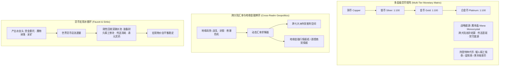

# 后端架构需求表10（第十卷：货币体系、魔单晶本位与通货膨胀调控求解器）

> [!NOTE]
> **【全局架构声明】**：本篇及全套技术文档中所提及的所有具体货币名称（如“金币、魔单晶、矮人铁券”）、进制兑换比例、汇率常数与消耗数值，**均属基础演示示例（Illustrative Examples Only），绝非底层硬编码或静态写死结构**。底层引擎仅定义**多层级货币矩阵结构、战略能源魔单晶本位模型、跨大陆动态汇率变动方程、地缘金融行情情报网络、以及宏观通胀回收深渊水池接口契约**。

---

## 一、 系统概述与地缘货币哲学 (Monetary Matrix Overview)

### 1.1 核心职责与设计哲学
本卷基于《基本玩法需求设计稿四》与《设计稿五》，定义底层引擎中的**世俗金属流通货币、战略能源魔单晶本位制、跨大陆动态汇率求解器、地缘宏观金融情报网络、以及通胀防溢出与刚性回收水池**。
* **双轨货币体系**：微观层面以金属货币满足民生与基础交易，宏观战略层面以**【魔单晶 (Mana Monocrystal)】**作为类似现实中“黄金/原油”的不可动摇的硬通货基石；
* **与第十一卷交易系统复合咬合**：货币汇率波动与交易市场的供需物价形成实时闭环，驱动跨大陆地缘商贸博弈与玩家套利操作。

### 1.2 货币矩阵流转整体架构


---

## 二、 多层级货币矩阵：世俗金属货币 vs 魔单晶战略本位 (Metallic & Mana Currency)

### 2.1 世俗流通金属货币 (Metallic Currency)
用于城镇日常生活、普通装备购买与旅店休整：

$$\text{TotalCopperValue} = \text{Copper} + 100 \times \text{Silver} + 10000 \times \text{Gold} + 1000000 \times \text{Platinum}$$

* **物理负重与容积约束**：大额携带金属货币计入随身背包负重，迫使大商队采用魔导票据或魔单晶结算。

---

### 2.2 战略能源货币：魔单晶本位制 (Mana Monocrystal Standard)
> **魔单晶 (Mana Monocrystal)**：卡拉尔世界纯度达 $99.9\%$ 的固态魔素结晶，由北灵大陆英尔神权帝国垄断主产。

* **双重属性**：
  1. **战略硬通货**：跨大陆大宗军火贸易、传世神器交易、国家外交赔款的唯一指定结算货币；
  2. **高能消耗品**：驱动魔导传送阵、激活王权级灭国法式、为大型要塞护盾供能的核心燃料。
* **价值不可归零性**：只要宇宙中施法与传送需求存在，魔单晶的内在价值永远坚挺。

---

## 三、 跨大陆汇率变动、地缘博弈与情报网络 (Cross-Realm Exchange & Market Intelligence)

### 3.1 跨大陆地缘购买力偏置模型
七大洲各区域的货币购买力受地缘政治、资源丰度和工业能力加权：

$$\text{ExchangeRate}(R_A \to R_B) = \frac{\text{LocalPurchasingPower}(R_B)}{\text{LocalPurchasingPower}(R_A)} \times \left(1 + \mu_{\text{tariffs}} + \mu_{\text{crisis}}\right)$$

* **地缘金融现象 (演示示例)**：
  - **矮人大陆 (兰洲)**：制造业全球最发达，工业制品与铁器极其廉价，金币购买力极高；
  - **西域荒洲**：魔素污秽、战乱频繁，粮食与高纯魔单晶溢价 $300\%$；
  - **商贸套利**：玩家可组建商队在矮人大陆低价采购精工军火，历经阻抗运至荒洲抛售，获取暴利！

### 3.2 玩家地缘商贸情报网络 (Realm Trade Gazette & Rumors)
系统通过酒馆 NPC 与商会行情看板向玩家推流**《七大洲商贸金融战报》**：

```json
{
  "tick": 184000,
  "eventType": "REALM_FINANCIAL_UPDATE",
  "headline": "【格莱斯神圣帝国】对北方诸国实施严苛关税封锁，边境铁矿价格暴跌 40%，粮食外流受阻！",
  "arbitrageOpportunity": {
    "recommendedRoute": "温洲 ➔ 苍洲山海关",
    "commodity": "粮食与高纯魔素药剂",
    "projectedProfitMargin": "+280%"
  }
}
```

---

## 四、 宏观通胀调控、产出水龙头与刚性回收深渊水池 (Inflation Sinks Engine)

### 4.1 货币产出水龙头 (Monetary Faucets)
1. 公会赏金委托与战功发放；
2. 击杀魔兽分解魔核与素材变现；
3. 采矿冶炼与大地图遗迹探索。

### 4.2 刚性回收深渊水池 (Permanent Monetary Sinks)
为杜绝游戏后期金币泛滥导致通货膨胀，系统建立以下刚性消耗闭环：
* **装备碰撞磨损与精工维护**：冷兵器砍击与防具受创导致的耐久度消耗，必须在铁匠工坊支付高额精工淬火费；
* **魔导传送阵跃迁能耗**：瞬间跨越七大洲必须单向消耗珍稀的【魔单晶】；
* **宗门藏经阁拓印与反编译费用**：在三维点阵空间重构法式消耗智识资源与金币；
* **自然大限寿元灵药**：为延缓天人五衰而购置的极品续命圣药（指数级昂贵）。

---

## 五、 数据结构与货币服务接口契约 (TypeScript Reference)

```typescript
// 1. 角色钱包与战略资产实体
export interface CharacterWalletEntity {
  copper: number;                 // 铜币
  silver: number;                 // 银币
  gold: number;                   // 金币
  platinum: number;               // 白金币
  manaMonocrystals: number;       // 魔单晶储备 (战略硬通货)
  factionTokens: Record<string, number>; // 阵营特种代币
}

// 2. 货币金融服务接口
export interface IMonetarySystemService {
  // 转换并统一折算为基准价值
  evaluateNetWorthInCopper(wallet: CharacterWalletEntity): number;
  // 跨大陆结算与动态汇率换算
  convertCurrencyBetweenRealms(
    amount: number,
    fromRealm: string,
    toRealm: string,
    currencyType: 'GOLD' | 'MANA_MONOCRYSTAL'
  ): { targetAmount: number; tariffCost: number };
  // 生成并拉取当前七大洲地缘商贸金融行情报纸
  fetchRealmFinancialGazette(characterId: UUID): FinancialGazetteReport;
  // 扣减刚性回收水池费用 (耐久修理/传送/拓印)
  deductSinkingFee(characterId: UUID, feeType: 'REPAIR' | 'WAYGATE' | 'DECOMPILE', cost: number): boolean;
}
```
