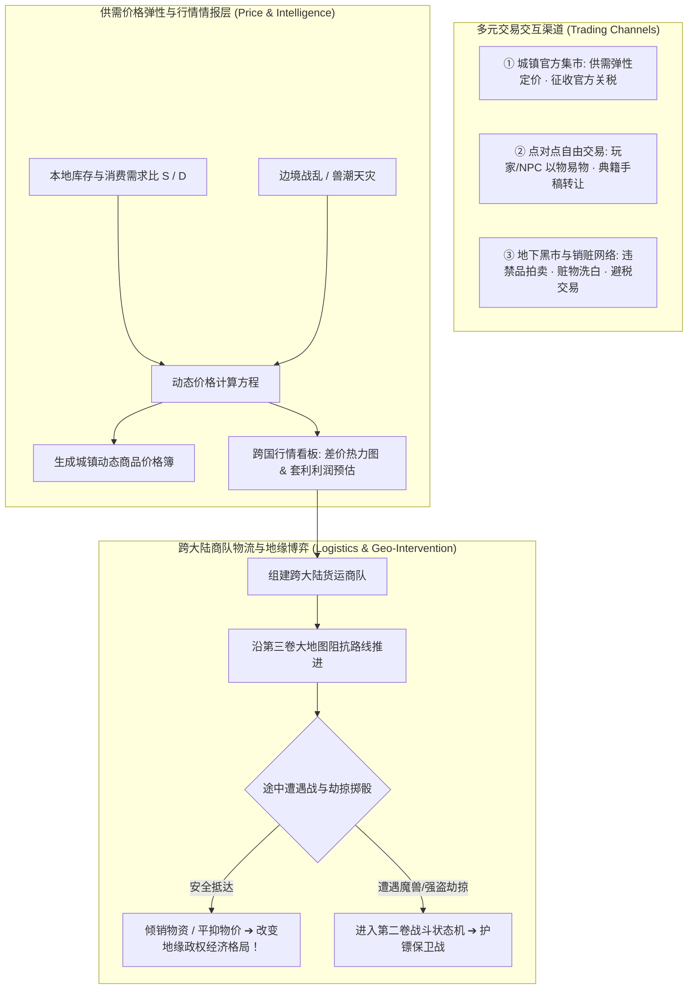

# 后端架构需求表11（第十一卷：交易系统、供需价格弹性与跨大陆物流经济求解器）

> [!NOTE]
> **【全局架构声明】**：本篇及全套技术文档中所提及的所有具体商品价格、关税比例、供需弹性常数与黑市交易规则，**均属基础演示示例（Illustrative Examples Only），绝非底层硬编码或静态写死结构**。底层引擎仅定义**局部市场供需弹性方程、点对点与黑市交易协议、跨大陆商队物流运输动力学、跨国价格波动看板、以及玩家地缘商贸博弈接口契约**。

---

## 一、 系统概述与地缘市场生态 (Market & Trade Ecology Overview)

### 1.1 核心职责与设计哲学
本卷基于《基本玩法需求设计稿四》、《设计稿五》与《设计稿六》，定义底层引擎中的**城镇集市局部供需弹性定价求解器、点对点自由交易协议、地下黑市与销赃网络、跨大陆商队物流运输模拟、以及跨国价格波动看板与地缘商贸博弈系统**。
* **与第十卷货币系统复合咬合**：货币汇率与局部商品供需实时咬合，共同驱动跨七大洲的宏观经济态势；
* **玩家可干预的真实地缘博弈**：玩家不仅能感知不同国家之间的物价波动，更能通过商队倾销、商路护送或资源垄断，实质性改变一个国家的物价走势与地缘命运！

### 1.2 交易市场、物流与地缘博弈整体架构


---

## 二、 城镇集市供需价格弹性求解器 (Supply & Demand Price Elasticity Engine)

### 2.1 局部供需平衡与价格动态浮动方程
城镇集市中任意物品 $i$ 的即时买入/卖出价格由本地供需比与关税动态决定：

$$P_{\text{buy}}(i) = P_{\text{base}}(i) \times \left[ 1 + \kappa_{\text{elasticity}} \cdot \left( \frac{\text{Demand}(i) - \text{Supply}(i)}{\text{Supply}(i) + \epsilon} \right) \right] \times \left( 1 + \text{TariffRate}_{\text{nation}} \right)$$

$$P_{\text{sell}}(i) = P_{\text{buy}}(i) \times (1 - \text{MerchantSpread}) \times (1 - \text{TownTax})$$

* $P_{\text{base}}$：物品在第一卷中定义的物理基础材料价值；
* $\kappa_{\text{elasticity}}$：该品类的价格弹性系数（粮食、药品等必需品弹性大，奢侈品弹性小）；
* $\text{Supply}(i)$：城镇当前仓库中的实际库存；
* $\text{Demand}(i)$：由城镇人口规模、驻军数量与当前危机状态计算的每日消耗需求。

---

### 2.2 市场倾销与物资断绝冲击模型
1. **大宗倾销 (Dumping Crash)**：当商队向某城镇一次性倾销数千单位同类物品时，本地 $\text{Supply}$ 暴增，导致该商品本地售价在短期内发生断崖式下跌；
2. **战乱匮乏 (Scarcity Spike)**：当城镇遭遇第八卷兽潮围城时，粮食与药剂的 $\text{Demand}$ 飙升，物价自发暴涨至基础价的 $300\% \sim 500\%$！

---

## 三、 跨国价格波动看板与地缘商贸博弈 (Realm Market Ticker & Geo-Trade War)

### 3.1 跨大陆差价热力图与智能套利计算器 (Arbitrage Spread Engine)
系统为玩家提供沉浸式的**《七大洲商贸行情看板》**，根据玩家已探明的城镇情报实时计算利润率：

$$\text{ProjectedProfitRate} = \frac{P_{\text{sell}}(i, \text{Town}_B) \times \text{ExchangeRate}(A \to B) - P_{\text{buy}}(i, \text{Town}_A) - \text{LogisticsCost}}{\text{InvestedCapital}}$$

* **文字端交互呈现 (示例)**：
  > 📰 **【商会行情感知】**：
  > - **矮人兰洲 ➔ 荒洲要塞**：精工长剑买入 15 金币，荒洲售价 68 金币（套利净利润率 $+310\%$）；
  > - **中央天河 ➔ 精灵灵洲**：优质粮食买入 2 金币，灵洲售价 8 金币（套利净利润率 $+260\%$）。

---

### 3.2 玩家地缘商贸干预机制 (Player Geo-Economic Intervention)
玩家的经济行为会实质性改变地缘局势：
1. **平抑物价救世**：在某要塞遭遇兽潮导致粮价暴涨时，玩家不顾危险运送大批粮食抵达，平抑物价并获得海量正向阵营声望与市民爱戴；
2. **商贸战砸盘**：玩家联合商会大举倾销工业品，击垮敌对势力的工匠作坊，迫使其关税壁垒崩溃。

---

## 四、 多元交易交互形态与黑市销赃网络 (Trading Channels & Underworld Network)

### 4.1 点对点自由交易 (P2P Barter & Manuscript Exchange)
* **以物易物与典籍传授**：支持在无货币介入的情况下，直接以矿石/药剂交换前人留下的三维点阵典籍手稿；
* **交易双向因果断言**：原子性交换背包与穿戴槽位，绝不产生数据不同步。

---

### 4.2 地下黑市与违禁品销赃网络 (Black Market & Smuggling Network)
* **准入门槛**：仅在荒洲、要塞暗区或通过特定盗贼公会信物方可进入；
* **专属交易品类**：
  1. **赃物洗白 (Loot Fencing)**：偷窃/暗杀所得的带有原主标记的物品，在官方集市会被守卫扣押，必须在黑市折价销赃；
  2. **禁忌典籍拍卖**：三大宗教明令禁止的邪道神术残卷与始源法式断章；
  3. **通缉犯地下补给**：被官方通缉的角色可在黑市高价购买口粮与药品。

---

## 五、 跨大陆商队物流、护送与劫掠风险求解器 (Caravan Logistics & Risk Solver)

### 5.1 商队组建与物理运力模型
商队作为大地图上的移动实体聚合根，具备物理负重与护卫规模：

$$\text{CaravanCapacity} = \sum_{v \in \text{Vehicles}} \text{Capacity}(v) + \sum_{b \in \text{Beasts}} \text{Capacity}(b)$$

* **行军口粮代谢**：商队每日消耗随行伙计与驮兽的粮食；若途中断粮，商队移动速度锐减且货物易损毁。

---

### 5.2 沿途劫掠与遭遇战风险状态机 (Piracy & Ambush Risk FSM)
商队沿大地图行进时，每个时间步依据**地貌阻抗、治安度与货物总价值**进行风险掷骰：

$$\mathcal{P}_{\text{ambush}} = \text{Clamp}\left( \Omega_{\text{terrain}} \times \left(1 - \frac{\text{LocalLawAndOrder}}{100}\right) \times \left(1 + \frac{\text{CargoValue}}{100000}\right), \; 0.01, \; 0.80 \right)$$

---

## 六、 数据结构与交易服务接口契约 (TypeScript Reference)

```typescript
// 1. 跨国行情套利评估项
export interface ArbitrageOpportunityItem {
  commodityTemplateId: string;
  originTownId: UUID;
  destinationTownId: UUID;
  buyPriceOrigin: number;
  sellPriceDest: number;
  projectedProfitMargin: number; // 预期利润率 (如 +2.80)
  travelImpedanceScore: number;  // 路线危险度
}

// 2. 交易与物流服务契约
export interface IMarketTradeService {
  // 执行官方集市买卖交易 (原子更新库存与供需价格)
  executeMarketTransaction(
    buyerId: UUID,
    townId: UUID,
    itemTemplateId: string,
    quantity: number,
    isBuyingFromMarket: boolean
  ): TransactionReceipt;

  // 获取跨国差价行情看板
  queryArbitrageOpportunities(characterId: UUID): ArbitrageOpportunityItem[];

  // 黑市销赃与洗白
  fenceStolenGoods(sellerId: UUID, stolenItem: ItemEntity): TransactionReceipt;

  // 派遣跨大陆商队并推进物流 Tick
  dispatchCaravan(caravan: TradeCaravanEntity): boolean;
  stepCaravanLogistics(caravanId: UUID, deltaHours: number): CaravanLogisticsReport;
}
```
