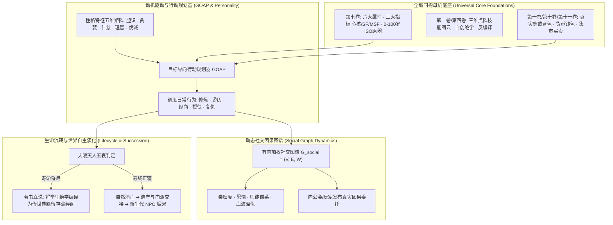

# 后端架构需求表12（第十二卷：NPC 智能生命系统、社交因果网络与自主演化调度求解器）

> [!NOTE]
> **【全局架构声明】**：本篇及全套技术文档中所提及的所有具体 NPC 姓名、门派长老称号、社交关系预设与性格标签，**均属基础演示示例（Illustrative Examples Only），绝非底层硬编码或静态写死结构**。底层引擎仅定义**NPC 与玩家 100% 全域底座同构模型、目标导向行动规划器 (GOAP)、有向加权社交图谱、以及寿元流转自主世界演化状态机契约**。

---

## 一、 系统概述与 NPC 第一性原理 (Autonomous NPC Overview)

### 1.1 核心职责与设计哲学
本卷基于《基本玩法需求设计稿一》至《设计稿六》，定义底层引擎中的**NPC 智能生命系统、全域底座完全同构模型、目标导向行动规划器 (GOAP)、动态社交因果图谱、以及独立于玩家的世界自主演化流水线**。
* **全域底座 100% 绝对同构 (Universal Entity Isomorphism)**：彻底摒弃传统死板的“站桩对话工具人”。NPC 在底层**就是不插手柄的“玩家”**——拥有完全相同的生理指标、三维点阵技能图云、多职业兼备、背包财产与寿元流转；
* **拥有独立动机与因果的人生 (Living World Autonomy)**：NPC 会自行修炼悟道、著书立说、生老病死、拉帮结派、发布悬赏、并在大地图上沿阻抗路线游历经商。

### 1.2 NPC 智能生命与世界自主演化整体架构


---

## 二、 全域底座完全同构模型 (Universal Entity Isomorphism Architecture)

### 2.1 生理与生命周期完全同构（基于第七卷）
* **六大属性与三大指标**：力 STR、体 CON、智 INT、敏 AGI、精 SPR、生 VIT，实时计算心核 $H_{\text{core}}$、身体机能 SF 与精神压力 MSF；
* **0 ~ 100 岁绝对标准原器与生机逆龄**：
  - NPC 随着世界时钟流逝自然衰老；
  - 刻苦修炼突破至高深肉身体质（英体/灵体）的 NPC 老者，表面机能**逆龄回青年/成年**；
  - 达到大限 100 岁（乘种族倍率）若未突破桎梏，遭遇天人五衰自然离世。

---

### 2.2 技能图云与悟道传承完全同构（基于第一卷与第四卷）
* **三维点阵技能树**：NPC 的招式完全存储于其大脑的三维点阵点云中；
* **自主研习与反编译化简**：高智力（INT）的学者型 NPC 会自主研习藏经阁手稿，在点阵空间中拉线重构，化简出能损更低的极效新法式；
* **门派宗师著书立说**：武道宗师 NPC 在达到【自创法则】境界后，会调用第四卷编译器，将自己的三维点阵图云编译渲染为实体文学典籍手稿（如《落英剑诀手卷》）传给弟子。

---

### 2.3 财富、装备与交易完全同构（基于第一卷、第十卷与第十一卷）
* **真实背包与负重**：NPC 穿戴装备具备真实的物理质量、硬度与刃口侵彻常数；
* **真实钱包**：NPC 拥有独立的 `CharacterWalletEntity`（铜银金与魔单晶），去集市购买口粮或在工坊修补武器必须扣减自己的真实财产；
* **以物易物与雇佣**：NPC 钱财不足时，会用祖传典籍手稿或珍稀矿石向玩家抵押交易，或发布委托悬赏玩家护送。

---

## 三、 NPC 性格矩阵与目标导向行动规划器 (GOAP & Personality Matrix)

### 3.1 性格五维矩阵与行为偏置
每个 NPC 的决策偏好由五维性格特征向量严密界定：

$$\vec{\mathcal{T}}_{\text{npc}} = \left\langle \text{Courage}, \; \text{Greed}, \; \text{Benevolence}, \; \text{Rationality}, \; \text{Devotion} \right\rangle \in [0.0, 1.0]^5$$

* **高理智 + 高贪婪**：倾向于低买高卖做大商贾，精算跨大陆差价，绝不轻易涉险；
* **高胆识 + 低仁慈**：倾向于成为冷血赏金猎人或黑市亡命之徒，受创后容易陷入狂暴；
* **高虔诚**：严守所属宗教信条，每日在神殿祈祷冥想，极易产生神术共鸣加成。

---

### 3.2 目标导向行动规划器 (Goal-Oriented Action Planning, GOAP)
后端世界时钟步进时，NPC 行为调度引擎根据**生理需求（饥饿/疲惫）、性格偏置与社交目标**动态求解最优行动序列：


---

## 四、 动态社交因果图谱与世界自主演化 (Social Graph & World Autonomy)

### 4.1 有向加权社交拓扑图结构 (Directed Weighted Social Graph)
$$\mathcal{G}_{\text{social}} = (V_{\text{entities}}, \; E_{\text{relations}}, \; \vec{\mathcal{W}}_{\text{attitude}})$$

$$\vec{\mathcal{W}}_{\text{attitude}}(A \to B) = \left\langle \text{Affection} \in [-100, 100], \; \text{Trust} \in [0, 100], \; \text{Debt} \in [-100, 100] \right\rangle$$

* **血海深仇 (Blood Feud)**：若玩家或另一 NPC 击杀了该 NPC 的亲友，$\text{Affection} \to -100$，该 NPC 将其列为终生复仇目标；
* **授业恩师 (Mentorship)**：传授手稿与点阵拉线建立师徒纽带，忠诚度与宗门信条加权绑定。

---

### 4.2 寿元大限、跨代传承与自主演化闭环
1. **大限著书**：当一位 95 岁的传奇 NPC 宗师检测到自身寿命即将归零时，其 GOAP 目标自动切换为【著书立说】，将自身三维点阵终极奥义编译成典籍手稿，陈列于宗门藏经阁或托付给得意门生；
2. **自然坐化与世代更迭**：宗师自然坐化逝去，门派产生权力重组与大分裂（第四卷），后代年轻 NPC 研习祖师典籍崛起，**整个世界在无需玩家参与的情况下自发向前波澜壮阔地演进！**

---

## 五、 数据结构与 NPC 领域服务接口契约 (TypeScript Reference)

```typescript
// 1. NPC 完整生命实体 (与玩家 100% 同构)
export interface AutonomousNPCEntity {
  npcId: UUID;
  personalName: string;
  personality: {
    courage: number;      // 胆识 (0.0 ~ 1.0)
    greed: number;        // 贪婪 (0.0 ~ 1.0)
    benevolence: number;  // 仁慈 (0.0 ~ 1.0)
    rationality: number;  // 理智 (0.0 ~ 1.0)
    devotion: number;     // 虔诚 (0.0 ~ 1.0)
  };

  // 同构生理档案 (第七卷)
  physiology: CharacterPhysiologySheet;

  // 同构背包与财产 (第一卷/第十卷)
  wallet: CharacterWalletEntity;
  inventorySlots: ItemEntity[];

  // 同构三维图云技能与多职业 (第一卷/第四卷)
  skillLatticeGraph: SkillSubgraphAST;
  professionProfile: MultiProfessionProfile;

  // 社交与作息规划 (GOAP)
  socialRelations: Record<UUID, { affection: number; trust: number; relationType: string }>;
  currentGOAPPlan?: {
    goalName: string;
    actionQueue: string[];
    currentActionIndex: number;
  };
}

// 2. NPC 自主演化调度服务
export interface INPCSimulationService {
  // 推进 NPC 大地图作息与 GOAP 决策 (每游戏小时)
  stepNPCDailySimulation(npc: AutonomousNPCEntity, deltaHours: number): NPCSimulationReport;

  // NPC 战斗决策 AI: 评估战场态势并推演生成本回合行动卡 (第二卷/第五卷)
  evaluateNPCCombatTurn(npc: AutonomousNPCEntity, opponentState: CharacterPhysiologySheet): ActionCard[];

  // NPC 大限著书立说与传承交接
  executePosthumousManuscriptLegacy(dyingNPC: AutonomousNPCEntity): ManuscriptEntity;
}
```
