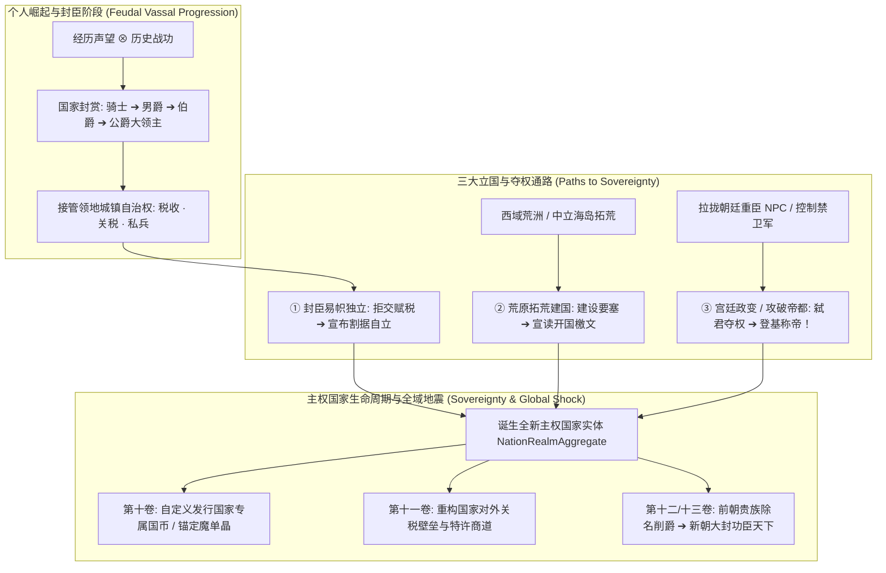
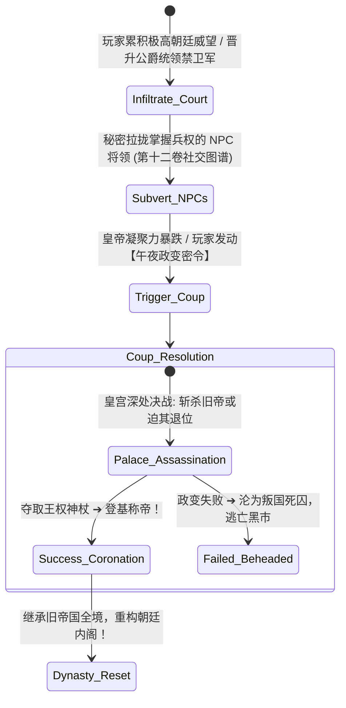

# 后端架构需求表13（第十三卷：身份爵位、自建国家与政权推翻覆灭求解器）

> [!NOTE]
> **【全局架构声明】**：本篇及全套技术文档中所提及的所有具体国家名称（如“格莱斯神圣帝国、北方诸国联邦”）、爵位头衔、政变事件与国策范例，**均属基础演示示例（Illustrative Examples Only），绝非底层硬编码或静态写死结构**。底层引擎仅定义**无边界动态主权国家聚合根 (NationRealmAggregate)、玩家拓荒自建国家协议、宫廷政变与攻城推翻状态机、以及地缘改朝换代全域蝴蝶效应求解器**。

---

## 一、 系统概述与地缘主权第一性原理 (Sovereign Nation & Dynamic Hegemony)

### 1.1 核心职责与设计哲学
本卷基于《基本玩法需求设计稿三》至《设计稿六》，定义底层引擎中的**玩家与 NPC 动态身份爵位体系、领地自治治理权、无边界主权国家聚合模型、玩家拓荒自建国家、宫廷政变与攻城推翻政权、以及改朝换代全域蝴蝶效应求解器**。
* **天下非一人之天下，国家绝非写死枚举 (No Hardcoded Nations)**：国家在底层是动态挂载于大地图城镇子图上的**主权聚合根实体**，完全支持玩家**自建新兴国家、易帜割据自立、发动政变弑君夺位、或率军踏平旧朝皇都改朝换代**！
* **万物互联的蝴蝶效应 (Universal Butterfly Causality)**：政权的覆灭与自建会在全宇宙引发货币重铸、贵族阶层洗牌、关税重构与邻国地缘核震！

### 1.2 爵位、自建国家与政权推翻整体演化架构


---

## 二、 动态主权国家聚合实体与国家生命周期 (Nation Realm Aggregate Model)

### 2.1 主权国家聚合根实体模型
```typescript
export interface NationRealmAggregate {
  nationId: UUID;
  canonicalNationName: string;   // 国家全称 (如 "神圣格莱斯帝国" 或 玩家自建 "大风联邦")
  sovereignRulerId: UUID;         // 当前最高统治者 ID (皇帝/教皇/大总统 - 玩家或 NPC)
  governmentType: 'FEUDAL_EMPIRE' | 'HOLY_THEOCRACY' | 'FREE_REPUBLIC' | 'MILITARY_JUNTA';

  // 领土疆域子图 (挂载的大地图城镇节点 ID 集合)
  territoryTownIds: UUID[];
  capitalTownId: UUID;            // 帝国首都要塞 ID

  // 国家财政与战略储备 (第十卷)
  nationalTreasury: {
    goldReserves: number;         // 国库金币
    manaMonocrystalReserves: number; // 战略魔单晶储备
    customCurrencyName?: string;  // 自建国币名称
  };

  // 国策法典与意识形态
  dogmaPolicies: {
    stateReligionId?: UUID;       // 官方国教 (第四卷)
    baseTariffRate: number;       // 基准对外关税
    standingArmyQuota: number;    // 常备军团编制上限
  };

  stabilityPercent: number;       // 国家凝聚力与治安稳定性 (0 ~ 100%)
  diplomaticRelations: Record<UUID, 'ALLIANCE' | 'PEACE' | 'COLD_WAR' | 'TOTAL_WAR'>;
}
```

---

## 三、 玩家自建国家与拓荒立国求解器 (Nation Foundry & Pioneering Engine)

### 3.1 荒原拓荒建国三大充要条件
玩家在无主之地（如荒洲边缘或外海新大陆）建立全新主权国家需满足：
1. **地基硬件条件**：占领或建造一座核心定居点要塞（拥有议事厅、城防工事与集市）；
2. **人口与繁荣度**：定居点吸引移民人口达到阈值，粮食供需自给自足（第十一卷）；
3. **主权宣誓仪式**：消耗 500 金币与 50 颗魔单晶进行**【全服建国宣告】**，确立国号、政体与国策法典，正式注册全宇宙全新国家聚合根！

---

## 四、 政变推翻、改朝换代与割据战争状态机 (Coup d'État, Revolution & Secession FSM)

### 4.1 宫廷政变与弑君夺权 (Palace Coup Engine)


---

### 4.2 攻城推翻与王朝覆灭 (Dynastic Annihilation)
当玩家或起义叛军率领大军攻破敌国首都、且皇室血脉全部断绝时：
* **国家覆灭事件 (Nation Extinction)**：原国家聚合实体解体；
* **战胜国重新瓜分**：战胜方玩家可选择**【兼并疆土纳入自建国版图】**，或**【设立傀儡附属国】**！

---

## 五、 改朝换代的全域蝴蝶效应震荡 (Dynastic Butterfly Shockwaves)

当政权发生更迭（如旧帝国被推翻、玩家新王朝诞生）时，事件总线向全域广播特大地震：

```
【特大历史事件】: 玩家推翻神圣格莱斯帝国，定都山海关，建立大风帝国！
      │
      ├─► [维度① 货币金融]: 旧帝国铸币贬值 50%，大风国币正式发行并强制流通 (第十卷)
      ├─► [维度② 贵族阶级]: 原帝国老贵族 NPC 全员除名削爵，玩家有功战友全员大封公侯 (第十三卷)
      ├─► [维度③ 宗教神学]: 国教由天权保守派切换为革新派，全国神术偏置重构 (第四卷)
      ├─► [维度④ 国际地缘]: 北方诸国恐惧新政权崛起，连夜派遣使节团纳贡求和 (第九卷)
      └─► [维度⑤ 宏观经济]: 解除北方关税封锁，七大洲跨国商贸迎来百年繁荣期！ (第十一卷)
```

---

## 六、 数据结构与主权服务接口契约 (TypeScript Reference)

```typescript
// 1. 领地与封地治理实体
export interface FiefDemesneEntity {
  fiefId: UUID;
  assignedTownId: UUID;          // 绑定的定居点城镇 ID (第三卷)
  lordEntityId: UUID;            // 领主 ID (玩家或 NPC)
  grantedNationId: UUID;         // 册封宗主国 ID
  taxRatePercent: number;        // 领主自定义税率 (0 ~ 50%)
  tariffRatePercent: number;     // 自定义过境关税率
  garrisonTroopsCount: number;   // 领地驻军规模
  monthlyTaxYield: number;       // 月度税收净收益
}

// 2. 主权建国与政变推翻服务契约
export interface ISovereignNationService {
  // 荒原拓荒建国：注册全新独立主权国
  foundNewSovereignNation(
    founderId: UUID,
    nationName: string,
    capitalTownId: UUID,
    constitution: { governmentType: string; baseTariff: number }
  ): NationRealmAggregate;

  // 发动宫廷政变或推翻旧帝
  executeCoupDEtat(rebelLeaderId: UUID, targetNationId: UUID): CoupResultReport;

  // 封臣宣布易帜独立割据
  declareSecessionAndIndependence(lordId: UUID, fiefIds: UUID[]): SecessionReport;

  // 皇帝/统治者执行分封赐爵与削黜
  grantNobilityAndFief(rulerId: UUID, targetEntityId: UUID, rank: string, townId: UUID): boolean;
  revokeNobilityAndFief(rulerId: UUID, targetEntityId: UUID, reason: string): boolean;
}
```
