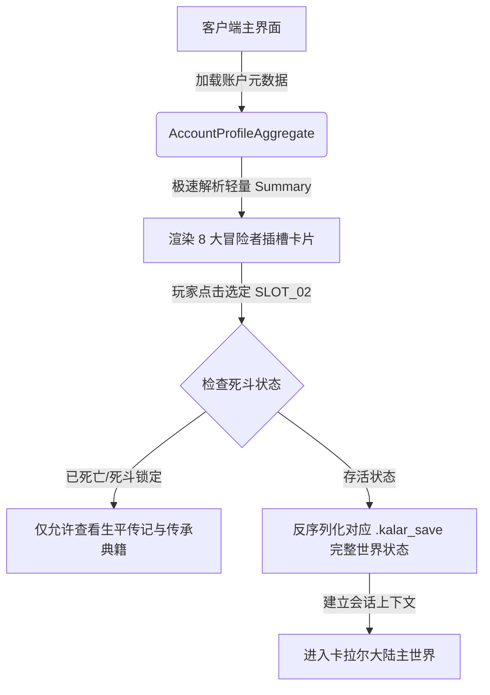

# 后端架构需求表14（第十四卷：账户身份、会话鉴权与多角色存档槽位管理系统）

> [!IMPORTANT]
> **【系统定性与第一性原理】**：
> 本卷定义卡拉尔高魔世界引擎的**元游戏生命周期（Meta-Game Lifecycle）与账户会话管理中枢**。系统必须满足：
> 1. **单机离线自洽与设备指纹绑定**：玩家在无网络状态下凭本地账户即可零延迟进入卡拉尔大陆，数据 100% 本地自洽闭环；
> 2. **多冒险者存档插槽物理隔离**：单账户支持开设多个独立冒险者插槽，支持“标准冒险模式”与“死斗硬核模式（Permadeath，身死道消即锁档）”；
> 3. **元数据轻量快照**：无需加载完整庞大世界状态，仅凭毫秒级存档封面元数据（角色名、职阶等级、年龄外貌、心核状态、所处大陆与城镇）即可完成 UI 渲染展示；
> 4. **前后端解耦与网络鉴权预留**：采用统一 Session Token 契约，未来接入跨设备云存档或多人服务器权威同步时无需重构底层。

---

## 一、 本地账户聚合根 (`AccountProfileAggregate`)

```gdscript
# 脚本路径: res://core/domain/account/account_profile_aggregate.gd
class_name AccountProfileAggregate
extends RefCounted

# 基础身份凭证
var account_id: String               # 账户唯一标识 (UUIDv4)
var username: String                 # 账户用户名 / 冒险者代号
var password_hash_sha256: String     # 本地安全散列校验码 (加盐哈希)
var created_timestamp_utc: int       # 创号时间戳
var last_login_timestamp_utc: int    # 上次登入时间戳

# 设备指纹与离线凭证
var local_device_fingerprint: String # 本机设备唯一绑定哈希
var is_guest_mode: bool = false      # 是否为无名游侠(游客)速通模式

# 多角色存档槽位映射 (slot_index: 0~7)
var save_slot_summaries: Dictionary = {} # slot_id (String) -> SaveSlotSummaryDTO
var active_slot_id: String = ""          # 当前登入的冒险槽位

# 全局成就与因果传承点
var meta_legacy_points: int = 0          # 累积天命传承点 (用于角色投胎创生兑换先天特质)
var unlocked_heritage_traits: Array[String] = [] # 历史坐化或通关传奇角色解锁的传承词条

func get_summary_by_slot(slot_id: String) -> Dictionary:
    if save_slot_summaries.has(slot_id):
        return save_slot_summaries[slot_id]
    return {}
```

---

## 二、 多角色存档插槽切换与快照协议 (`SaveSlotManager`)

### 2.1 存档槽位元数据契约 (`SaveSlotSummaryDTO`)
```gdscript
# 脚本路径: res://core/domain/account/save_slot_summary_dto.gd
class_name SaveSlotSummaryDTO
extends RefCounted

var slot_id: String                   # 槽位 ID (如: "SLOT_01")
var character_name: String            # 角色姓名 (如: "艾尔登·雷文霍德")
var title_prefix: String              # 称号 (如: "圣痕斩风者 / 极效魔剑士")
var profession_tier_name: String      # 职业位格 (如: "高阶魔剑使 · 阶位 4")
var apparent_age: int                 # 表象年龄 (如: 24 岁)
var current_location_name: String     # 身处地缘 (如: "中洲·卡拉尔圣城")
var play_time_seconds: int            # 冒险历练时长 (秒)
var is_permadeath_mode: bool = false  # 是否为硬核一命死斗模式 (心核破碎即锁档)
var is_fallen: bool = false           # 是否已寿元耗尽或被击杀死亡
var last_saved_time_utc: int          # 最近存档时间戳
var save_file_sha256: String          # 存档校验指纹
```

### 2.2 插槽调度与冷热数据解耦流转图


---

## 三、 会话鉴权与安全凭证服务 (`AuthService`)

### 3.1 离线/单机 Session 状态机
```gdscript
# 脚本路径: res://core/services/auth/auth_service.gd
class_name AuthService
extends RefCounted

enum AuthState {
    UNAUTHENTICATED,     # 未登入
    AUTHENTICATED_LOCAL, # 本地单机鉴权成功
    AUTHENTICATED_CLOUD, # 云端同步鉴权成功 (预留)
    SESSION_EXPIRED      # 会话过期
}

static func authenticate_local(username: String, pass_plain: String, account: AccountProfileAggregate) -> Dictionary:
    if account == null:
        return { "success": false, "code": "ERR_ACCOUNT_NOT_FOUND", "token": "" }

    var salted_input = (pass_plain + account.created_timestamp_utc.to_string()).sha256_text()
    if salted_input != account.password_hash_sha256:
        return { "success": false, "code": "ERR_PASSWORD_MISMATCH", "token": "" }

    # 生成本地会话令牌
    var token_payload = username + "_" + Time.get_unix_time_from_system().to_string() + "_" + str(randi())
    var session_token = token_payload.sha256_text()

    return {
        "success": true,
        "code": "AUTH_SUCCESS",
        "session_token": session_token,
        "account_id": account.account_id
    }
```

---

## 四、 跨版本存档迁移与原子落盘防损坏机制

1. **写临时文件 ➔ 签名 ➔ 原子 Rename 替换**：
   - 写入 `save_slot_01.tmp`；
   - 计算 SHA-256 签名并注入尾部；
   - 调用 OS 原子级文件移动重命名覆盖 `save_slot_01.kalar_save`，严防断电损坏；
2. **存档自动备份副本**：
   - 每次覆盖前自动保留最近一个有效存档版本为 `save_slot_01.bak`；
   - 一旦主存档校验失败，自动无缝降级从 `.bak` 恢复并提示玩家。
