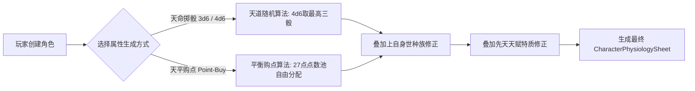

# 后端架构需求表15（第十五卷：角色创生、种族血脉身世与先天资质骰点分配系统）

> [!IMPORTANT]
> **【系统定性与第一性原理】**：
> 本卷定义卡拉尔高魔世界引擎的**角色创生、种族血脉、身世背景与先天六维属性分配中枢**。系统必须满足：
> 1. **种族血脉与身世决定初值与机缘**：人类帝国贵族、高等精灵秘术学者、山地矮人铁匠、魔裔游侠或荒原兽人，直接决定初始金币、阵营好感度、魔素亲和力与出生大洲；
> 2. **六大固有属性物理对齐**：力量(STR)、体质(CON)、智魔力(INT)、敏捷(AGI)、精神定力(SPR)、生命活力(VIT) 严格继承《第七卷》微观生理同构模型；
> 3. **双轨创角分配机制（跑团骰点制 vs 自由购点制）**：统一等级制（1~6 级，继承《第七卷》统一换算底座）——
>    - **天命掷骰 (4d6-Drop-Lowest → 等级)**：3~18 掷骰结果线性映射统一等级 1~6，体现世界随机混沌与投胎造化，支持气运重掷；
>    - **天平购点 (Point-Buy，等级域)**：21 点池，每级消耗 = 等级数（1 级 1 点 … 6 级 6 点），高等级阶梯递增消耗；
> 4. **身世/天赋 = 系数修正**：origin `attribute_bonus` 语义迁移为种族系数数组（`config/domains/attribute.json` → `race_coefficients`，如 HIGH_ELF INT×1.2 / MOUNTAIN_DWARF CON×1.3），先天天赋按 `trait_coef_scale`（默认 0.1）乘入先天基础系数（`base_coefficients`）——不占等级空间，等级不变时底层实际值联动。
> 4. **先天天赋词条天平契约**：正面特质（如【始源魔素共鸣】【巨人之力】）与先天缺陷（如【心核裂隙】【魔素绝缘】）相互制衡，保持因果点数守恒。

---

## 一、 种族血脉、身世与地缘出生点模拟器 (`ReincarnationOriginEngine`)

```gdscript
# 脚本路径: res://core/domain/creation/reincarnation_origin_engine.gd
class_name ReincarnationOriginEngine
extends RefCounted

# 九大种族与身世常数定义
const ORIGINS = {
    "IMPERIAL_NOBLE": {
        "name": "帝国贵族后裔",
        "race": "HUMAN",
        "desc": "生于繁华行省贵族世家，自幼接受皇家剑术与宫廷礼仪培养，家族资助丰厚。",
        "initial_gold": 500,
        "initial_reputation": 100,
        "base_factions": { "HOLY_EMPIRE": 50, "MAGE_COUNCIL": 20 },
        "attribute_bonus": { "INT": 2, "STR": 1 }
    },
    "ELVEN_SCHOLAR": {
        "name": "精灵秘术学徒",
        "race": "HIGH_ELF",
        "desc": "来自世界之树庇护的精灵古城，拥有天生的魔素感知力与悠长寿命。",
        "initial_gold": 80,
        "initial_reputation": 40,
        "base_factions": { "FOREST_ENCLAVE": 60, "HOLY_EMPIRE": 0 },
        "attribute_bonus": { "INT": 3, "SPR": 1 }
    },
    "DWARVEN_BLACKSMITH": {
        "name": "矮人锻造学徒",
        "race": "MOUNTAIN_DWARF",
        "desc": "生长于地下熔岩巨构城邦，体格极其强健，熟悉各种金属硬度与武器工艺。",
        "initial_gold": 150,
        "initial_reputation": 20,
        "base_factions": { "IRON_FORGE_LEAGUE": 60 },
        "attribute_bonus": { "CON": 3, "STR": 1 }
    },
    "SHADOW_OUTCAST": {
        "name": "黑市暗影游侠",
        "race": "TIEFLING_OR_HUMAN",
        "desc": "生长于大陆地下黑市与盗贼公会，擅长潜行暗杀与黑市违禁品销赃。",
        "initial_gold": 120,
        "initial_reputation": 0,
        "base_factions": { "THIEVES_GUILD": 50, "HOLY_EMPIRE": -30 },
        "attribute_bonus": { "AGI": 3, "INT": 1 }
    }
}

# 七大洲出生地契约
const BIRTH_REGIONS = {
    "CENTRAL_CONTINENT": { "name": "中洲·卡拉尔圣城", "climate": "TEMPERATE", "mana_density": 1.0 },
    "SILVER_FOREST":     { "name": "东洲·银月密林", "climate": "MYSTIC_FOREST", "mana_density": 1.4 },
    "SCORCHED_CANYON":   { "name": "南洲·烈阳熔岩峡谷", "climate": "VOLCANIC", "mana_density": 1.8 },
    "HOWLING_TUNDRA":    { "name": "北洲·狂风永冻苔原", "climate": "TUNDRA", "mana_density": 1.2 },
    "VOID_ARCHIPELAGO":  { "name": "西洲·虚空破碎群岛", "climate": "VOID_OCEAN", "mana_density": 2.0 }
}
```

---

## 二、 先天六维属性初始化求解器 (`AttributeInitializationSolver`)



### 2.1 算法一：天命掷骰模拟器 (Dice Rolling)
```gdscript
# 脚本路径: res://core/domain/creation/attribute_initialization_solver.gd
class_name AttributeInitializationSolver
extends RefCounted

# 4d6 剔除最低骰值: 均值约 12.24，区间 [3, 18]
static func roll_4d6_drop_lowest(rng_seed: int = 0) -> int:
    var rolls: Array[int] = []
    for i in range(4):
        rolls.append(randi_range(1, 6))
    rolls.sort()
    # 剔除下标 0 的最小值，保留后三项求和
    return rolls[1] + rolls[2] + rolls[3]

# 全套六维属性掷骰生成
static func generate_by_rolling() -> Dictionary:
    return {
        "STR": roll_4d6_drop_lowest(),
        "CON": roll_4d6_drop_lowest(),
        "INT": roll_4d6_drop_lowest(),
        "AGI": roll_4d6_drop_lowest(),
        "SPR": roll_4d6_drop_lowest(),
        "VIT": 10.0 # 初始生命活力锚点
    }
```

### 2.2 算法二：天平购点法 (Point-Buy System)
* **规则标准**：
  * 所有基础属性默认起步为 $8$ 点；
  * 玩家持有 $27$ 点初始天命潜能点池；
  * 属性升档点数消耗阶梯：
    $$8 \to 13: \text{每点消耗 } 1 \text{ 潜能}$$
    $$14 \to 15: \text{每点消耗 } 2 \text{ 潜能}$$
    $$16 \to 18: \text{每点消耗 } 3 \text{ 潜能}$$

```gdscript
static func validate_point_buy(attributes: Dictionary, max_points: int = 27) -> Dictionary:
    var total_cost = 0
    var cost_table = { 8:0, 9:1, 10:2, 11:3, 12:4, 13:5, 14:7, 15:9, 16:12, 17:15, 18:19 }

    for key in ["STR", "CON", "INT", "AGI", "SPR"]:
        var val = attributes.get(key, 8)
        if val < 8 or val > 18:
            return { "valid": false, "error": "属性值超出购点区间[8, 18]: " + str(key) }
        total_cost += cost_table[val]

    if total_cost > max_points:
        return { "valid": false, "error": "超出最大可用点数池，当前消耗: " + str(total_cost) }

    return { "valid": true, "spent_points": total_cost, "remaining_points": max_points - total_cost }
```

---

## 三、 先天天赋特质词条池 (`InnateTraitRegistry`)

```gdscript
# 脚本路径: res://core/domain/creation/innate_trait_registry.gd
class_name InnateTraitRegistry
extends RefCounted

const TRAITS = {
    # 正面天赋 (消耗天命点)
    "PRIMAL_MANA_AFFINITY": {
        "name": "始源魔素共鸣",
        "type": "POSITIVE",
        "cost": 4,
        "desc": "天生具备神代始源魔素直驱能力，施展法术相变能损降低 20%，智魔力+2",
        "modifier": { "INT": 2, "phase_loss_reduction": 0.20 }
    },
    "TITAN_BLOOD": {
        "name": "泰坦巨人体魄",
        "type": "POSITIVE",
        "cost": 3,
        "desc": "体内流淌着远古泰坦血脉，物理动量碰撞系数提升 15%，体质+3",
        "modifier": { "CON": 3, "STR": 1, "k_mom_bonus": 0.15 }
    },
    # 负面缺陷 (获取额外天命点补偿)
    "FRACTURED_HEART_CORE": {
        "name": "心核裂隙",
        "type": "NEGATIVE",
        "cost": -3,
        "desc": "先天心核存在裂痕，剧烈战斗负 AP 时精神压力 MSF 上升速度提升 50%",
        "modifier": { "heart_core_max": 0.85, "MSF_rate": 1.5 }
    },
    "FRAIL_METABOLISM": {
        "name": "机能衰弱",
        "type": "NEGATIVE",
        "cost": -2,
        "desc": "先天免疫力低下，身体机能 SF 自然衰退速率加快，口粮消耗增加 20%",
        "modifier": { "SF_decay_mult": 1.2 }
    }
}
```

---

## 四、 创角完成聚合输出 (`CharacterCreationService`)

```gdscript
# 组装领域聚合根实体
static func finalize_creation(
    account_id: String,
    slot_id: String,
    char_name: String,
    origin_key: String,
    region_key: String,
    final_attributes: Dictionary,
    selected_traits: Array[String]
) -> Dictionary:
    return {
        "character_id": "CHAR_" + str(randi()),
        "character_name": char_name,
        "origin": ORIGINS[origin_key],
        "birth_region": BIRTH_REGIONS[region_key],
        "physiology_sheet": {
            "STR": final_attributes.STR,
            "CON": final_attributes.CON,
            "INT": final_attributes.INT,
            "AGI": final_attributes.AGI,
            "SPR": final_attributes.SPR,
            "VIT": 100.0, # 满值生命活力
            "apparent_age": 20.0,
            "heart_core_integrity": 1.0
        },
        "innate_traits": selected_traits,
        "inventory": { "baseline_capacity": 0, "equipped_slots": {} },
        "wallet": { "copper": 0, "silver": ORIGINS[origin_key].initial_gold, "gold": 0, "mana_crystals": 0 }
    }
```
