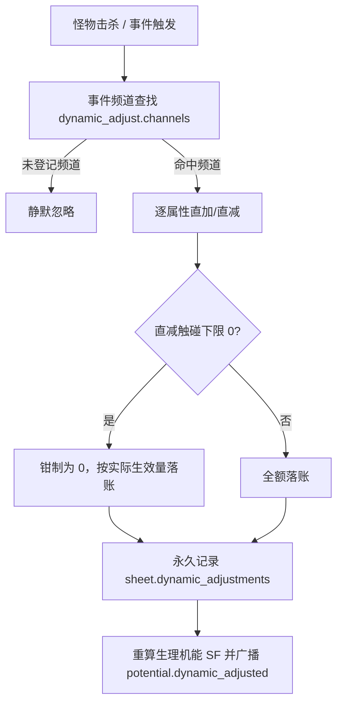

# 后端架构需求表16（第十六卷：后天潜能成长、双轨加点（定向/随机动态）与属性破阶递减求解器）

> [!IMPORTANT]
> **【系统定性与第一性原理】**：
> 本卷定义卡拉尔高魔世界引擎的**后天修行成长、潜能点产出、双轨属性提升与心核重构洗点求解器**。系统必须满足：
> 1. **潜能点 (Potential Points) 产出严谨有据**：潜能绝非无由凭空暴涨，必须由“职阶位阶突破”、“生死血战顿悟”、“炼金魔药淬炼”、“古代典籍研习”等因果事件触发；
> 2. **定向加点 (Targeted Allocation) 遵循边际递减律**：属性值越高，进一步提升所需消耗的潜能点呈阶梯上升，且实际物理/法术转化效能遵循软上限（Soft-Cap 60）与硬上限（Hard-Cap 100）对数衰减；
> 3. **随机动态加点 (Dynamic Adjustment / 系统直加直减)**：击杀怪物与触发事件由**系统**直接对属性做永久性点数调整（不消耗潜能点、不走定向成本曲线）：
>    - **触发-幅值全配置驱动**：`dynamic_adjust.channels` 按事件频道（`<域>.<事件>`，如 `monster.killed` / `world_boss.boss_defeated`）映射 `{属性: ±幅值}`，运营可调；
>    - **直减下限 0**：属性不可扣成负数，实际生效量记入 `sheet.dynamic_adjustments` 永久落账，调整后实时重算生理机能 SF 并广播 `potential.dynamic_adjusted` 领域事件；
>    - **联动契约**：事件流系统（`EventBusCore.emit_domain_event`）与怪物大系统（击杀事件按 `monster.killed` 频道契约调用 `DynamicAttributeAdjuster.consume_event_channel`）共同驱动；
> 4. **心核重构与洗点因果代价**：洗点必须消耗战略资源“魔单晶 (Mana Monocrystals)”，且强行重塑生理经络会引发心核震荡，伴随虚弱期 DEBUFF。

---

## 一、 潜能点产生与存储契约 (`PotentialGrowthEngine`)

```gdscript
# 脚本路径: res://core/domain/progression/potential_growth_engine.gd
class_name PotentialGrowthEngine
extends RefCounted

# 潜能点产出途径枚举与基准值
const POTENTIAL_SOURCES = {
    "TIER_BREAKTHROUGH":  { "name": "职业位阶破阶晋升", "base_points": 5, "desc": "突破生命机能桎梏，魔素回路升维" },
    "MORTAL_EPIPHANY":    { "name": "绝境生死战顿悟", "base_points": 2, "desc": "在负 AP 濒死绝境中逆境突破" },
    "ELIXIR_ALCHEMY":     { "name": "吞服炼金淬体魔药", "base_points": 3, "desc": "吸收高阶魔药重塑骨骼经络" },
    "GRIMOIRE_STUDY":     { "name": "彻底参悟古代典籍", "base_points": 1, "desc": "将典籍技能点阵 AST 彻底化简" }
}

# 结算破阶潜能产出
static func award_breakthrough_potential(character_sheet: Dictionary, source_type: String) -> int:
    var src = POTENTIAL_SOURCES.get(source_type, { "base_points": 1 })
    var spr_bonus = 1.0 + float(character_sheet.get("SPR", 10.0) - 10.0) * 0.02 # 精神定力越高，顿悟产出越丰厚
    return int(round(src.base_points * spr_bonus))
```

---

## 二、 定向手动加点模型与边际递减求解器 (`TargetedAttributeSolver`)

### 2.1 属性提升消耗潜能阶梯表（统一等级域 1~6 级）
| 属性当前等级 | 提升 1 级所需潜能点 | 对应生理与魔素阶段描述 |
| :--- | :---: | :--- |
| **1 ~ 2 级** | **1 点** | 凡人冒险者基础锻炼，机能初开 |
| **3 ~ 4 级** | **2 点** | 进阶职阶，魔素回路贯通肢体 |
| **5 ~ 6 级** | **3 点** | 大师级强者，心核与肉身完美共鸣（6 级封顶） |

成本方程：$C(L) = 1 + \lfloor (L-1)/2 \rfloor$（`point_cost/base=1, tier_size=2`）。

### 2.2 三层统一换算模型（等级 → 底层实际值）
- **L1 等级层**：统一 1~6 级 + 区间内连续值 `progress ∈ [0,1)`，连续等级量 $q = (L-1) + progress$；
- **L2 中间系数结构层（阅历重塑层）**：`系数 = 种族系数 × 属性系数 × 阅历重塑系数`——身世/天赋为系数修正（`base_coefficients`），心核洗点重置阅历重塑层（预留阅历系统联动）；
- **L3 底层实际值域**：$Actual = 人类基准 \times 成长曲线(q) \times 系数 + 动态调整值$——随机动态加点直加/直减作用于实际值域，永久不逆转；
- **成长曲线（分段非线性）**：段增量系数数组（默认 Σ=6，6 级恰好 = 6×基准，还原 600/60/6000/600/60/6000）；死区 $q \le 0.5$ → 实际 0（STR 参考 0~50 全零，其余按基准同比缩放）；
- **配置联动**：`config/domains/attribute.json` 的种族/属性/段增量系数或换算规则变化时，即使显示等级不变，底层实际能力数值随之变化。

```gdscript
# 脚本路径: res://core/domain/progression/targeted_attribute_solver.gd
class_name TargetedAttributeSolver
extends RefCounted

const SOFT_CAP: float = 60.0
const HARD_CAP: float = 100.0
const K_DIMINISH: float = 25.0

# 计算属性实际生效效能 E(A)
static func evaluate_effective_attribute(raw_value: float) -> float:
    if raw_value <= SOFT_CAP:
        return raw_value
    var excess = raw_value - SOFT_CAP
    var effective_excess = (HARD_CAP - SOFT_CAP) * (1.0 - exp(-excess / K_DIMINISH))
    return min(HARD_CAP, SOFT_CAP + effective_excess)

# 执行手动定向加点
static func apply_targeted_point(
    current_attributes: Dictionary,
    target_attr: String,
    available_potential: int
) -> Dictionary:
    var cur_val = current_attributes.get(target_attr, 10)
    if cur_val >= int(HARD_CAP):
        return { "success": false, "error": "已达生命天道硬上限(100)，无法继续加点", "remaining_potential": available_potential }

    var cost = 1
    if cur_val >= 80: cost = 10
    elif cur_val >= 60: cost = 5
    elif cur_val >= 40: cost = 3
    elif cur_val >= 20: cost = 2

    if available_potential < cost:
        return { "success": false, "error": "潜能点不足，提升需消耗: " + str(cost), "remaining_potential": available_potential }

    current_attributes[target_attr] = cur_val + 1
    return {
        "success": true,
        "new_value": cur_val + 1,
        "spent_cost": cost,
        "remaining_potential": available_potential - cost
    }
```

---

## 三、 随机动态加点模型 (Dynamic Attribute Adjustment / 系统直加直减)

击杀怪物与触发事件由系统直接对属性做**永久性**点数调整（随机动态加点）：不消耗潜能点、不走定向破阶成本曲线，与玩家定向加点完全分离。



**实现契约**（`res://backend/domains/potential_growth/dynamic_attribute_adjuster.gd`）：
- `DynamicAttributeAdjuster.consume_event_channel(sheet, channel)`：事件频道 → 配置表映射 → 逐属性调整，未登记频道返回 `NO_DYNAMIC_ADJUST_CONFIG`；
- `DynamicAttributeAdjuster.apply_dynamic_adjustment(sheet, stat, delta)`：直加/直减、下限 0（`floor` 配置）、永久落账、重算 SF；
- 配置：`config/domains/potential.json` → `dynamic_adjust.channels`（如 `world_boss.boss_defeated` → `{ "SPR": 2, "VIT": -1 }`）；
- 洗点隔离：动态调整永久保留，心核洗点仅重置玩家定向加点至「先天初值 + 动态调整值」。

> 注：旧「随机惯性加点」（行为/魔素惯性轮盘）`auto_allocate_by_inertia` 已退役删除，不再消耗潜能点做随机分配。

---

## 四、 心核重构与洗点因果代价管线 (`AttributeRespecPipeline`)

> **洗点隔离契约**：洗点仅返还玩家定向加点的潜能点，属性重置至「先天初值 + 系统动态调整值」——随机动态加点（击杀/事件）为永久性调整，洗点不逆转。

```gdscript
# 脚本路径: res://core/domain/progression/attribute_respec_pipeline.gd
class_name AttributeRespecPipeline
extends RefCounted

# 洗点代价定义
const RESPEC_MANA_CRYSTALS_BASE: int = 100 # 基础消耗 100 魔单晶
const HEART_CORE_DAMAGE: float = 0.15     # 心核震荡: 扣除 15% 心核完整度

static func execute_respec(
    character_sheet: Dictionary,
    wallet: Dictionary,
    respec_count: int
) -> Dictionary:
    var cost = RESPEC_MANA_CRYSTALS_BASE * (1 + respec_count)
    if wallet.get("mana_crystals", 0) < cost:
        return { "success": false, "error": "魔单晶不足，重构心核需消耗: " + str(cost) }

    # 扣除魔单晶
    wallet["mana_crystals"] -= cost

    # 心核强行逆转震荡 (完整度受损)
    var hc = character_sheet.get("heart_core_integrity", 1.0)
    character_sheet["heart_core_integrity"] = max(0.20, hc - HEART_CORE_DAMAGE)

    # 统计返还的所有后天潜能点
    var reclaimed_potential = 0
    # 将 STR/CON/INT/AGI/SPR 重置回先天基准值 (如默认 10)，差额按阶梯全部退还为潜能点

    return {
        "success": true,
        "spent_crystals": cost,
        "heart_core_integrity": character_sheet["heart_core_integrity"],
        "reclaimed_potential": reclaimed_potential,
        "narrative": "【心核重构】魔单晶强行洗练魔素回路，能量溢散，心核遭受震荡！"
    }
```

---

## 五、 后天潜能与双轨加点单元测试与验收契约 (`TestPotentialGrowthDomain`)

**测试套件**：`res://tests/unit/test_potential_growth.gd`（经 `tests/test_registry.gd` 统一注册，CLI 与 UI 共用同一注册表）。
**确定性基线**：全部用例在 `DeterministicRNG` 固定种子下可复现；动态加点与洗点用例断言属性守恒（来源 ➔ 去向）。

| 用例 ID | 测试目标 | 核心断言 |
| :--- | :--- | :--- |
| `TC-POT-01` | 属性破阶边际递减购点方程 C(A) | 10 级成本 1 点 / 20 级 2 点 / 35 级 3 点 |
| `TC-POT-02` | 手动定向加点与实时生理机能重算 | `allocate_targeted_point` 成功后属性 +1、潜能点扣减、SF 重算 |
| `TC-POT-03` | 心核重构全额返还潜能点与因果代价扣除 | 金币/魔单晶扣除、属性回「先天初值+动态调整」、潜能点全额返还 |
| `TC-POT-04` | 随机动态加点（事件驱动/下限0/不耗潜能点/永久记录） | `world_boss.boss_defeated` 频道按配置表 SPR+2/VIT-1；未登记频道 NO_DYNAMIC_ADJUST_CONFIG；直减触碰下限 0 不扣负；潜能点余额不变；dynamic_adjustments 落账 |
| `TC-POT-05` | 心核洗点不逆转系统动态加点（永久性隔离） | 动态+5 后玩家定向+5 再洗点：属性=先天10+动态5=15、潜能全额返还、动态记录保留 |
| `TC-POT-06` | 定向加点由阅历突破驱动 | `growth/default_reason == ENLIGHTENMENT`（卡拉尔以阅历替代升级）|
