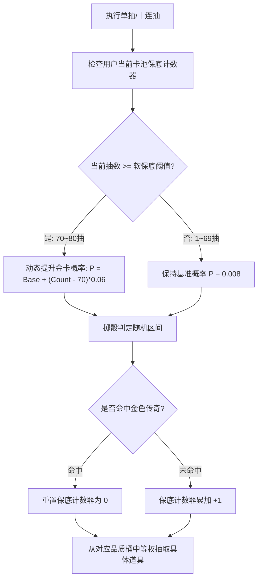

# 后端架构需求表17（第十七卷：货币祈愿抽奖、神秘宝箱与保底伪随机求解器）

> [!IMPORTANT]
> **【系统定性与第一性原理】**：
> 本卷定义卡拉尔高魔世界引擎的**货币祈愿抽取、神秘宝箱开启、概率掉落与保底伪随机中枢**。系统必须满足：
> 1. **货币与资源闭环刚性消耗**：抽奖与祈愿严格消耗《第十卷》中的“魔单晶 (Mana Monocrystals)”或“命运金币”，抽奖消耗直接进入宏观深渊水池进行能量销毁，抑制全服通胀；
> 2. **产出物 100% 实例化为真实领域实体**：抽取的武器、防具、典籍手稿与材料，必须严格转化为《第一卷》的 `ItemEntity` 聚合根，或直接写入《第四卷》技能 AST 藏经阁库；
> 3. **严谨的伪随机分布 (PRD / Pseudo-Random Distribution) 与双轨保底机制**：
>    - **小保底与大保底状态机**：支持 $N$ 抽必出稀有（如 10 抽保底紫装）、$M$ 抽必出传世神话（如 80 抽必出金色传奇）；
>    - **概率递增软保底方程**：未命中时逐抽线性提升命中概率，杜绝伪随机极端非酋体感；
> 4. **完全确定性可回放审计**：每个卡池拥有独立的抽奖随机数种子序列，支持在《第五卷》确定性沙盒中无损重演验证防作弊。

---

## 一、 祈愿卡池聚合实体 (`GachaBannerAggregate`)

```gdscript
# 脚本路径: res://core/domain/gacha/gacha_banner_aggregate.gd
class_name GachaBannerAggregate
extends RefCounted

var banner_id: String               # 卡池唯一标识 (如: "BANNER_ANCIENT_RELICS")
var banner_name: String             # 卡池名称 (如: "远古遗物与神话武装")
var banner_type: String             # WEAPON_BANNER / GRIMOIRE_BANNER / MATERIAL_CHEST
var cost_item_category: String      # "MANA_CRYSTAL" 或 "GOLD"
var cost_per_pull: int = 10         # 单抽消耗数量 (如 10 魔单晶)
var cost_ten_pull: int = 90         # 十连抽优惠消耗数量 (如 90 魔单晶)

# 基础概率配置表 (基准概率)
var base_probabilities: Dictionary = {
    "TIER_5_LEGENDARY": 0.008,      # 传奇金 (0.8%)
    "TIER_4_EPIC":      0.060,      # 史诗紫 (6.0%)
    "TIER_3_RARE":      0.400,      # 稀有蓝 (40.0%)
    "TIER_2_COMMON":    0.532       # 普通白 (53.2%)
}

# 掉落物品清单索引 (按品质分桶)
var prize_pool_registry: Dictionary = {
    "TIER_5_LEGENDARY": [],         # 传奇 ItemTemplate ID 列表
    "TIER_4_EPIC": [],
    "TIER_3_RARE": [],
    "TIER_2_COMMON": []
}
```

---

## 二、 双轨保底伪随机求解器 (`GachaProbabilitySolver`)



### 2.1 软硬保底概率递增求解算法
```gdscript
# 脚本路径: res://core/domain/gacha/gacha_probability_solver.gd
class_name GachaProbabilitySolver
extends RefCounted

const SOFT_PITY_START: int = 70
const HARD_PITY_COUNT: int = 80
const SOFT_PITY_INCREMENT: float = 0.06 # 超过 70 抽后每抽递增 6%

static func calculate_legendary_probability(current_pity_count: int, base_prob: float = 0.008) -> float:
    if current_pity_count >= HARD_PITY_COUNT:
        return 1.0 # 80 抽硬保底必中
    if current_pity_count < SOFT_PITY_START:
        return base_prob
    # 软保底线性阶梯递增
    var excess = current_pity_count - SOFT_PITY_START + 1
    return min(1.0, base_prob + float(excess) * SOFT_PITY_INCREMENT)

# 执行单次抽取掷骰
static func execute_single_pull(
    banner: GachaBannerAggregate,
    user_pity_state: Dictionary
) -> Dictionary:
    var pity_5_star = user_pity_state.get("pity_5_star_count", 0) + 1
    var pity_4_star = user_pity_state.get("pity_4_star_count", 0) + 1

    var prob_5_star = calculate_legendary_probability(pity_5_star, banner.base_probabilities["TIER_5_LEGENDARY"])
    var roll = randf()
    var result_tier = "TIER_2_COMMON"

    if roll < prob_5_star:
        result_tier = "TIER_5_LEGENDARY"
        pity_5_star = 0
    elif pity_4_star >= 10 or roll < (prob_5_star + banner.base_probabilities["TIER_4_EPIC"]):
        result_tier = "TIER_4_EPIC"
        pity_4_star = 0
    elif roll < (prob_5_star + banner.base_probabilities["TIER_4_EPIC"] + banner.base_probabilities["TIER_3_RARE"]):
        result_tier = "TIER_3_RARE"
    else:
        result_tier = "TIER_2_COMMON"

    user_pity_state["pity_5_star_count"] = pity_5_star
    user_pity_state["pity_4_star_count"] = pity_4_star

    # 抽取具体物品模板
    var item_templates = banner.prize_pool_registry[result_tier]
    var selected_template = item_templates[randi() % item_templates.size()]

    return {
        "tier": result_tier,
        "template_id": selected_template,
        "pity_state": user_pity_state
    }
```

---

## 三、 抽奖结算与物品实例化流水线 (`GachaExecutionService`)

1. **钱包原子扣费**：检查魔单晶/金币余额，扣款成功后广播货币流转事件；
2. **物品实例化（注册表三元组）**：掉落表 `item_ids` 为《第三十六卷》已登记 canonical_id，经 `ItemRegistrySolver.build_instance_payload` 按原型属性（质量/体积）实例化，未登记掉落或背包容量不足严格计入 `grant_failed_count`（不造临时物件）；
3. **入包与溢出处理**：若随身穿戴行囊已满，自动转存入城镇旅店个人仓库或邮戳暂存箱。

---

## 四、 祈愿保底与十连执行单元测试与验收契约 (`TestGachaDomain`)

本卷验收契约与实现测试一一对应：覆盖软保底概率爬升、硬保底兜底与十连结算入包三大闭环。

**测试套件**：`res://tests/unit/test_gacha_wish.gd`（`TestGachaDomain`，经 `tests/test_registry.gd` 统一注册，CLI 与 UI 共用同一注册表）；**归档细则**：阶段 4 施工细则 `KALAR-DEV-2026-RM17-004`（见归档库档案卷）。
**确定性基线**：全部用例在 `DeterministicRNG` 固定种子下可复现；涉及货币与物品流转的用例同时断言来源 ➔ 去向守恒闭环。

| 用例 ID | 测试目标 | 核心断言 |
| :--- | :--- | :--- |
| `TC-GACHA-01` | 软保底递增与 90 抽硬保底 100% 概率 | `calculate_current_5star_rate`: 基数 0.006；75 抽软保底 > 0.20；90 抽 == 1.0 |
| `TC-GACHA-02` | 命中 5 星后重置保底计数器 | 89 抽时 `roll_single_draw` 命中 rarity==5，随后 `current_pity_count` 归零 |
| `TC-GACHA-03` | 十连祈愿扣款与注册表三元组掉落实例化入包 | `execute_multi_pull` 成功、掉落 10 件全部入包（granted==10 / failed==0）、template_id 均落 `KALAR:` canonical_id 且体积取原型值 |
