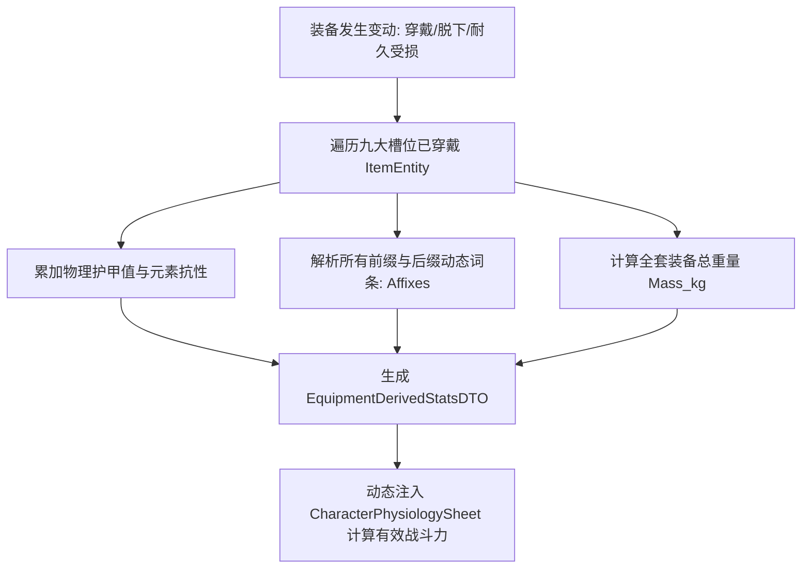

# 后端架构需求表18（第十八卷：战备配装、装备穿戴槽位力学与动态词缀系统）

> [!IMPORTANT]
> **【系统定性与第一性原理】**：
> 本卷定义卡拉尔高魔世界引擎的**战备配装方案、九大装备槽位力学、动态属性词缀加成与负重惩罚中枢**。系统必须满足：
> 1. **装备槽位与人体解剖学力学完全对齐**：
>    - **主手/副手 (Main/Off Hand)**：影响物理攻击动量 $K_{	ext{mom}}$、刃口锋利度 $K_{	ext{edge}}$ 与力矩攻击范围；
>    - **头部/胸甲/护腿/战靴 (Armor Set)**：提供物理有效抗力与元素抗性吸收，直接抵消动能冲击；
>    - **项链/双戒指 (Jewelry Sockets)**：提供魔素回路增幅、相变能损降低与精神定力加成；
> 2. **动态词缀 (Affixes & Modifiers) 即时属性重算**：装备穿戴脱下时，毫秒级即时重新编译生效《第七卷》微观生理面板；
> 3. **装备负重与敏捷 AP 惩罚闭环**：穿戴重型板甲显著提升护甲，但产生负重质量，对身法 AGI 和正负 AP 恢复速度产生物理阻抗；
> 4. **战备预设方案 (Loadout Presets)**：支持玩家与 NPC 保存多套战备配置（如【轻装游侠套】、【重甲抗线套】、【秘术施法套】）并进行一键战前切换。

---

## 一、 战备穿戴槽位聚合根 (`EquipmentLoadoutAggregate`)

```gdscript
# 脚本路径: res://core/domain/equipment/equipment_loadout_aggregate.gd
class_name EquipmentLoadoutAggregate
extends RefCounted

# 九大标准穿戴槽位
var slots: Dictionary = {
    "MAIN_HAND": null,      # 主手武器 (ItemEntity)
    "OFF_HAND": null,       # 副手盾牌/法器 (ItemEntity)
    "HEAD": null,           # 头部盔帽 (ItemEntity)
    "CHEST": null,          # 胸部甲胄 (ItemEntity)
    "LEGS": null,           # 腿部护甲 (ItemEntity)
    "FEET": null,           # 战靴 (ItemEntity)
    "NECK": null,           # 护符项链 (ItemEntity)
    "RING_LEFT": null,      # 左手戒指 (ItemEntity)
    "RING_RIGHT": null      # 右手戒指 (ItemEntity)
}

# 战备预设方案名称
var loadout_name: String = "默认战备"
var total_mass_kg: float = 0.0
```

---

## 二、 动态词缀重算与属性修正求解器 (`EquipmentModifierEvaluator`)



### 2.1 词缀与属性重算算法
```gdscript
# 脚本路径: res://core/domain/equipment/equipment_modifier_evaluator.gd
class_name EquipmentModifierEvaluator
extends RefCounted

static func evaluate_loadout_stats(loadout: EquipmentLoadoutAggregate) -> Dictionary:
    var derived = {
        "total_armor": 0.0,
        "total_mass_kg": 0.0,
        "weapon_k_mom": 1.0,
        "weapon_k_edge": 1.0,
        "attribute_modifiers": { "STR": 0, "CON": 0, "INT": 0, "AGI": 0, "SPR": 0 },
        "phase_loss_reduction": 0.0,
        "elemental_resists": {}
    }

    for slot_key in loadout.slots.keys():
        var item = loadout.slots[slot_key]
        if item == null: continue

        # 1. 基础物理质量与抗力
        derived.total_mass_kg += item.mass_kg
        var eff_armor = item.combat_metrics.get("effective_armor", 0.0)
        # 耐久度影响护甲系数 (耐久低于20%时护甲打折)
        var dura_ratio = clamp(item.durability_current / max(1.0, item.durability_max), 0.2, 1.0)
        derived.total_armor += eff_armor * dura_ratio

        # 2. 主手武器攻击力学
        if slot_key == "MAIN_HAND":
            derived.weapon_k_mom = item.combat_metrics.get("k_mom", 1.0)
            derived.weapon_k_edge = item.combat_metrics.get("edge_sharpness", 1.0)

        # 3. 动态词缀解析
        for affix in item.dynamic_affixes:
            var target_stat = affix.get("target_stat", "")
            var add_val = affix.get("add_val", 0)
            if derived.attribute_modifiers.has(target_stat):
                derived.attribute_modifiers[target_stat] += add_val
            elif target_stat == "PHASE_LOSS_REDUCTION":
                derived.phase_loss_reduction += affix.get("float_val", 0.0)

    loadout.total_mass_kg = derived.total_mass_kg
    return derived

# 计算负重对身法 AGI 与行动 AP 的惩罚
static func calculate_encumbrance_penalty(total_mass_kg: float, character_str: float) -> Dictionary:
    var max_carry_weight = character_str * 5.0 # STR * 5kg 为额定负重基准
    if total_mass_kg <= max_carry_weight:
        return { "is_overencumbered": false, "agi_penalty": 0, "ap_regen_mult": 1.0 }

    var excess_ratio = (total_mass_kg - max_carry_weight) / max_carry_weight
    var agi_loss = int(floor(excess_ratio * 10.0))
    var ap_mult = max(0.5, 1.0 - excess_ratio * 0.4)

    return {
        "is_overencumbered": true,
        "agi_penalty": agi_loss,
        "ap_regen_mult": ap_mult
    }
```

---

## 三、 战备穿戴业务状态机 (`EquipmentFSM`)

1. **穿戴槽位前置检定**：检定角色力量/智力是否满足装备最低需求门槛；
2. **双手武器互斥冲突处理**：装备双手巨剑时，自动卸下副手盾牌并退回随身背包；
3. **耐力战损磨损**：在《第二卷》物理侵彻结算中，每次遭受攻击自动扣除对应部位防具 0.1~0.5 耐久度。

---

## 四、 战备槽位与词缀重算单元测试与验收契约 (`TestEquipmentLoadoutDomain`)

本卷验收契约与实现测试一一对应：覆盖槽位穿戴、词缀/符文/护甲综合重算与穿戴状态机背包同步三大闭环。

**测试套件**：`res://tests/unit/test_equipment_loadout.gd`（`TestEquipmentLoadoutDomain`，经 `tests/test_registry.gd` 统一注册，CLI 与 UI 共用同一注册表）；**归档细则**：阶段 4 施工细则 `KALAR-DEV-2026-RM18-004`（见归档库档案卷）。
**确定性基线**：全部用例在 `DeterministicRNG` 固定种子下可复现；涉及货币与物品流转的用例同时断言来源 ➔ 去向守恒闭环。

| 用例 ID | 测试目标 | 核心断言 |
| :--- | :--- | :--- |
| `TC-EQUIP-01` | 10 大战备槽位装备与快速提取 | `equip("MAIN_HAND", sword)` 后 `get_equipped_item` 返回同一实例 |
| `TC-EQUIP-02` | 装备战备词缀、符文与护甲综合重算 | `evaluate_total_modifiers`: total_armor 25.0、RUNE_TITAN 贡献 bonus_str +5.0、total_mass_kg 15.0 |
| `TC-EQUIP-03` | 穿戴状态机背包槽位互换与同步 | `EquipmentFSM.equip_from_inventory` 成功且背包对应槽位同步移除 |
