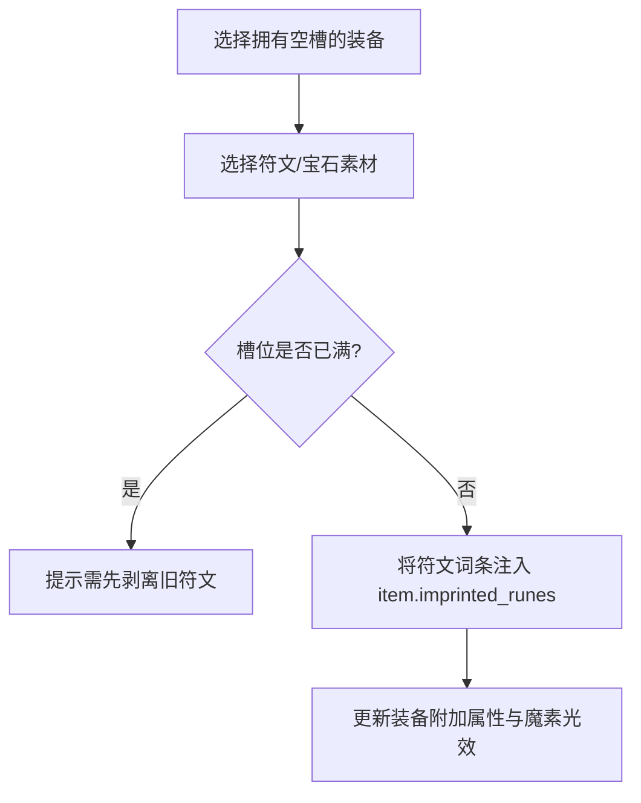

# 后端架构需求表19（第十九卷：工坊锻造、装备强化精炼与符文附魔重铸系统）

> [!IMPORTANT]
> **【系统定性与第一性原理】**：
> 本卷定义卡拉尔高魔世界引擎的**城镇工坊锻造、装备强化精炼、符文附魔镶嵌与词条洗练重铸中枢**。系统必须满足：
> 1. **强化精炼遵循热力学概率衰减**：
>    - 装备强化等级 ($+1 \sim +15$) 逐级提升装备基础护甲与刃口锋利度；
>    - 高级强化存在失败惩罚，支持使用“守护魔晶”防止降级或破损；
> 2. **符文插槽镶嵌深度联动《第四卷》点阵 AST**：
>    - 装备附带空孔插槽 (Sockets)，玩家可将铭刻有特定物理/魔法符文的灵石镶嵌其中；
>    - 镶嵌符文直接向装备注入动态词缀，甚至赋予装备主动技能释放回路；
> 3. **词条洗练重铸 (Reforging & Recalibration)**：
>    - 消耗魔单晶与锻造催化剂，随机重构装备的附加词缀属性；
>    - 支持锁定单个极品词条进行定向洗练；
> 4. **装备分解与材料回收循环**：淘汰装备可丢入工坊熔炉分解，产出对应莫氏硬度的精炼矿石与魔素尘埃。

---

## 一、 装备强化与精炼升级求解器 (`EquipmentEnhancementSolver`)

```gdscript
# 脚本路径: res://core/domain/workshop/equipment_enhancement_solver.gd
class_name EquipmentEnhancementSolver
extends RefCounted

# 强化成功率与失败惩罚配置
const ENHANCEMENT_RULES = {
    # 强化等级: [成功率, 失败惩罚: NONE / DOWNGRADE / DESTROY, 消耗金币, 消耗魔单晶]
    1:  [1.00, "NONE",       100, 1],
    2:  [1.00, "NONE",       200, 2],
    3:  [0.90, "NONE",       400, 3],
    4:  [0.80, "NONE",       800, 5],
    5:  [0.70, "NONE",       1500, 8],
    6:  [0.60, "NONE",       2500, 12],
    7:  [0.50, "DOWNGRADE",  4000, 18], # 失败降 1 级
    8:  [0.40, "DOWNGRADE",  6000, 25],
    9:  [0.30, "DOWNGRADE",  9000, 35],
    10: [0.25, "DOWNGRADE",  15000, 50],
    11: [0.20, "DESTROY",    25000, 75], # 失败可能碎裂(可用保护石)
    12: [0.15, "DESTROY",    40000, 110],
    13: [0.10, "DESTROY",    60000, 160],
    14: [0.07, "DESTROY",    90000, 230],
    15: [0.05, "DESTROY",    150000, 350]
}

# 执行强化求解
static func resolve_enhancement(
    current_tier: int,
    has_protection_stone: bool
) -> Dictionary:
    if current_tier >= 15:
        return { "success": false, "new_tier": 15, "status": "ALREADY_MAX_TIER" }

    var target_tier = current_tier + 1
    var rule = ENHANCEMENT_RULES[target_tier]
    var success_rate = rule[0]
    var penalty_type = rule[1]

    var roll = randf()
    if roll < success_rate:
        return { "success": true, "new_tier": target_tier, "status": "ENHANCE_SUCCESS" }
    else:
        # 强化失败逻辑
        if has_protection_stone or penalty_type == "NONE":
            return { "success": false, "new_tier": current_tier, "status": "FAILED_PROTECTED" }
        elif penalty_type == "DOWNGRADE":
            return { "success": false, "new_tier": max(0, current_tier - 1), "status": "FAILED_DOWNGRADED" }
        else: # DESTROY
            return { "success": false, "new_tier": 0, "status": "FAILED_DESTROYED" }
```

---

## 二、 符文镶嵌与附魔矩阵系统 (`SocketInscriptionService`)



```gdscript
# 脚本路径: res://core/domain/workshop/socket_inscription_service.gd
class_name SocketInscriptionService
extends RefCounted

static func inscribe_rune(
    item: ItemEntity,
    rune_id: String,
    rune_affix: Dictionary
) -> Dictionary:
    if item.imprinted_runes.size() >= item.total_sockets:
        return { "success": false, "error": "装备插槽已满，无法继续镶嵌符文" }

    item.imprinted_runes.append(rune_id)
    item.dynamic_affixes.append(rune_affix)

    return {
        "success": true,
        "imprinted_count": item.imprinted_runes.size(),
        "total_sockets": item.total_sockets
    }
```

---

## 三、 词条洗练重铸与分解流水线 (`ReforgingAndSalvagePipeline`)

1. **词条重铸 (Reforging)**：消耗魔单晶，重新生成装备的 `dynamic_affixes` 随机词缀池；
2. **装备分解 (Salvaging)**：
   - 基础白装 ➔ 铁矿石/皮革碎片；
   - 高阶强化/附魔装备 ➔ 高纯度魔素尘埃 + 稀有合金锭。

---

## 四、 强化锻造与分解返还单元测试与验收契约 (`TestWorkshopForgeDomain`)

本卷验收契约与实现测试一一对应：覆盖强化阶梯、符文铭刻与熔炉分解货币返还三大闭环。

**测试套件**：`res://tests/unit/test_workshop_forge.gd`（`TestWorkshopForgeDomain`，经 `tests/test_registry.gd` 统一注册，CLI 与 UI 共用同一注册表）；**归档细则**：阶段 4 施工细则 `KALAR-DEV-2026-RM19-004`（见归档库档案卷）。
**确定性基线**：全部用例在 `DeterministicRNG` 固定种子下可复现；涉及货币与物品流转的用例同时断言来源 ➔ 去向守恒闭环。

| 用例 ID | 测试目标 | 核心断言 |
| :--- | :--- | :--- |
| `TC-FORGE-01` | +1 强化确定性成功与锋利度阶梯提升 | `attempt_enhancement`: enhance_level 0→1，edge_sharpness 1.0→1.10 |
| `TC-FORGE-02` | 装备孔位符文镶嵌与铭刻 | `inscribe_rune` 成功且 `imprinted_runes` == [RUNE_ARCANE] |
| `TC-FORGE-03` | 装备分解材料与熔铸货币返还 | `salvage_equipment` 成功、物品移出背包、铜币返还 50000 |
