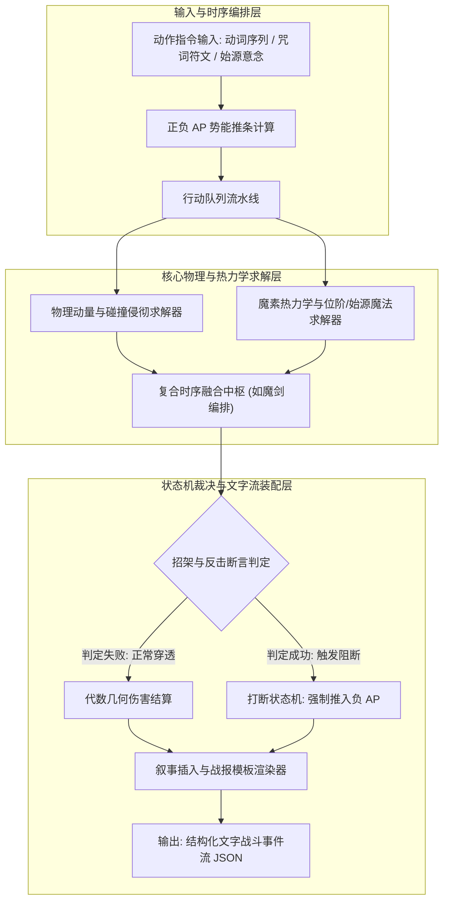
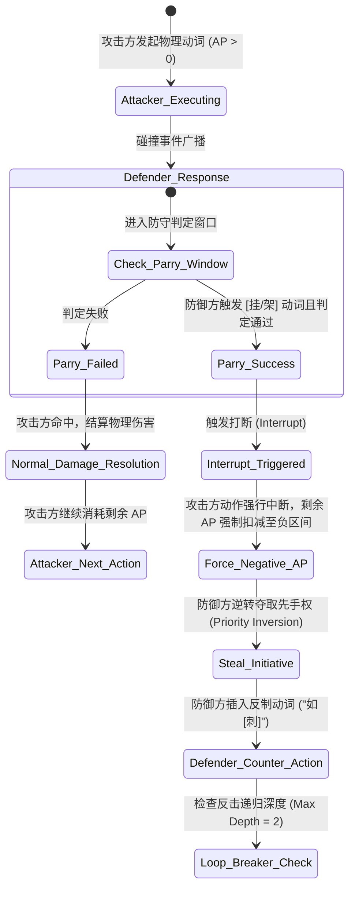
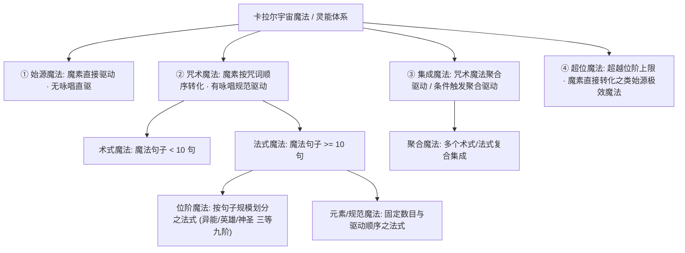
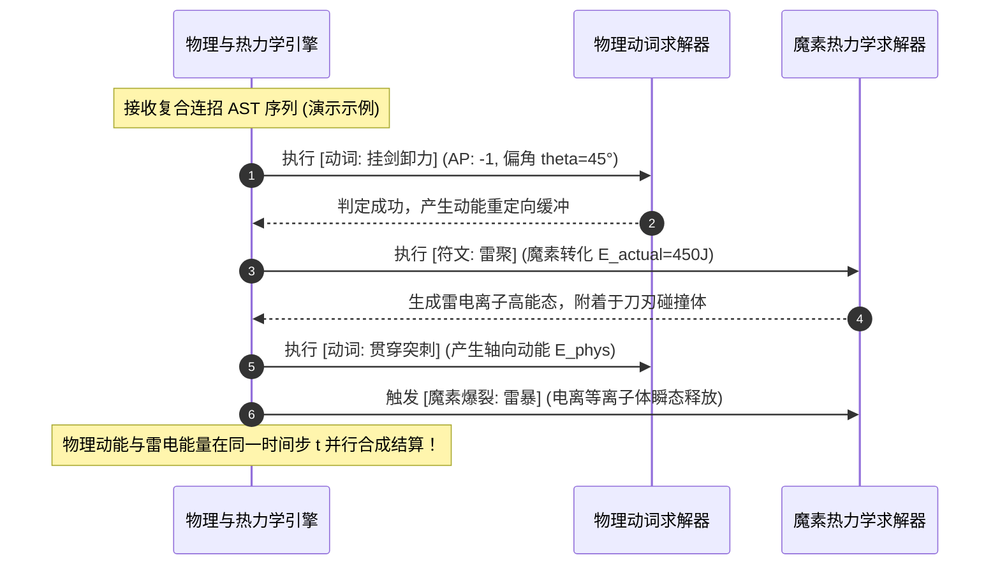

# 后端架构需求表2（第二卷：物理碰撞、动量传递与魔素热力学求解器）

> [!NOTE]
> **【全局架构声明】**：本篇及全套技术文档中所提及的所有具体物理动词（如“刺、劈、挂”）、法术技能名（如“雷光破阵突”）、具体力学系数与伤害数值，**均属基础演示示例（Illustrative Examples Only），绝非底层硬编码或静态写死结构**。底层引擎仅定义**确定性碰撞代数几何方程、魔素热力学相变转换律、正负 AP 动态势能轴状态机、以及可无限注册动词/符文的扩展接口契约**。

---

## 一、 系统概述与物理计算管线 (Physics Pipeline Overview)

### 1.1 核心职责与设计原则
本卷基于《基本玩法需求设计稿》与《基本玩法需求设计稿二》，定义底层战斗引擎中的**物理碰撞判定、动量传递守恒、魔素热力学两步能损转换求解器、无咏唱/有咏唱与位阶魔法体系、正负 AP 动态势能轴状态机、以及结构化文字战斗事件流生成器**。
* **确定性计算 (Deterministic Execution)**：所有物理量（质量 $m$、速度 $v$、入射角 $\theta$、魔素焓值 $H$）均采用定点数/高精度离散步长计算，确保单机本地与未来网络权威仲裁的一致性；
* **表现层无关的文字事件流推流 (Presentation-Agnostic Event Stream)**：后端物理引擎结算的同时，自动装配并推流结构化文字战报与剧情叙事流，供前端打字机组件与未来 2D/3D 图形引擎消费。

### 1.2 物理、热力学与文字事件流生成管线


---

## 二、 动量守恒与武器几何侵彻判定 (Physical Momentum & Penetration Solver)

### 2.1 物理原子动词指令集与微观向量定义 (基础示例)
系统定义物理动词原子基准，每个动词在空间中拥有独立的动量传递系数 $K_{\text{mom}}$、前摇/后摇时间步 $\Delta t$、以及侵彻截面 $S_{\text{cross}}$（支持由外部配置或自创绝学动态扩展注册）：

| 动词标识 (基础示例) | 英文命名 | 动量传递系数 $K_{\text{mom}}$ | 几何侵彻常数 $K_{\text{edge}}$ | 物理职能与力学特征 |
| :--- | :--- | :--- | :--- | :--- |
| **刺** | `Stab` | $1.20$ (点集中轴向传递) | $1.50$ (高压强穿刺) | 突破点式硬甲，前摇短，易被侧向偏斜 |
| **劈** | `Slash` | $1.50$ (法向重力合力) | $1.20$ (刃线剪切) | 大动量下压，产生高冲击钝击与割裂 |
| **挂** | `Parry-Deflect` | $0.30$ (侧向偏角卸力) | $0.10$ (非侵彻) | **核心防反动词**：改变敌方动能方向，打断敌方 AP 推进 |
| **挑** | `Up-thrust` | $0.90$ (逆重力仰角) | $1.10$ (下颌/关节侵彻) | 破坏敌方下盘重心，迫使敌方进入失衡 |
| **崩** | `Collapse` | $1.80$ (爆炸性瞬态冲击) | $0.80$ (面冲击) | 震碎敌方骨骼与盾牌，造成心核震荡 |
| **抹** | `Wipe` | $0.40$ (切向高速滑移) | $1.30$ (弱点掠割) | 高速小动作，极低 AP 消耗，施加流血减益 |
| **绞** | `Bind` | $0.60$ (角动量锁定) | $0.20$ (缠绕压制) | 锁死敌方兵刃，双方 AP 同步进入僵持锁定 |
| **架** | `Block` | $0.50$ (法向面承载) | $0.05$ (纯防御) | 正面硬抗吸收动能，自身消耗体能 SF |

### 2.2 动量传递与代数几何侵彻方程
物理攻击判定生效时，由物理求解器计算有效穿透冲量与动能传递：

$$E_{\text{kinetic}} = \frac{1}{2} m_{\text{weap}} \cdot v_{\text{swing}}^2 \cdot \cos\theta \cdot K_{\text{mom}}$$

$$\text{Damage}_{\text{phys}} = \max\left(0, \; \frac{E_{\text{kinetic}} \cdot K_{\text{edge}}}{S_{\text{cross}}} - \text{Armor}_{\text{eff}}(\text{TargetSlot})\right) \times \prod_{e \in \text{SkillPath}} W(e)$$

---

## 三、 正负 AP 动态势能轴与打断中断状态机 (AP Continuum FSM)

### 3.1 正负 AP 连续势能轴数学模型
每小回合（Round）开始时，系统依据战斗环境、等级与敏捷度量衡，动态计算双方的初始 AP 差值：

$$\text{AP}_{\text{init}} = \text{Clamp}\left(\mu_{\text{diff}} \cdot \left(\text{AGI}_{\text{self}} - \text{AGI}_{\text{target}}\right) + \text{BaseAP}, \; -10, \; 10\right)$$

* **$\text{AP} > 0$（先攻主动态）**：角色拥有行动主动权，可连续调度指令集出招，每一动作消耗对应的 $\Delta \text{AP}$；
* **$\text{AP} < 0$（硬直受制态）**：角色处于被压制或破防僵直状态，禁止主动打出任何消耗 AP 的攻击卡牌，只能挂载**被动招架判定器**；
* **$\text{AP} = 0$（均势态）**：双方进入微秒级先手判定。

### 3.2 招架打断、推条与优先级抢夺状态机


---

## 四、 魔法本质、热力学能损与位阶/始源魔法体系 (Magic Essence, Thermodynamics & Spell Tiers)

### 4.1 魔法的本质与四大宏观形态划分
> **【魔法 (灵能) 底层公理】**：魔法，又称灵能——即**生命体固有性灵魂意识干涉现实世界物质的能力**。其本质上是生命体固有性灵魂意识，使用一定手段，直接或间接干涉现实物质世界中指定场域内的物质，从而使单位个体拥有**意识驱动物质**的一定能力。

底层引擎将全宇宙所有魔法干涉严格划分为四大宏观形态：



1. **始源魔法 (Primal Magic)**：由天地魔素直接驱动的原始法则魔法（无咏唱、无编译中介）；
2. **咒术魔法 (Incantation Magic)**：由魔素按一定**咒词顺序**转化驱动的魔法（有咏唱体系）；
3. **集成魔法 (Integrated Magic)**：由魔素按一定咒术魔法顺序转化驱动的聚合魔法，或在达成指定因果条件后触发的复合魔法；
4. **超位魔法 (Super-Tier Magic)**：超越“位阶魔法”最高阶级的终极法式，由魔素直接转化的**类始源极强法则魔法**。

---

### 4.2 魔素的两步热力学相变历程与能损定律
魔法释放不是凭空生成伤害，而是一个严格遵循魔素热力学守恒的相变过程：

```
【常规有咏唱相变历程】:
魔素 (Raw Mana) ───[第一步能损 25%~50%]───> 魔力/灵力 (Processed Mana) ───[第二步能损 10%~30%]───> 物质性魔法 (Manifestation)

【始源 / 超位跳跃直驱】:
魔素 (Raw Mana) ──────────────────────[极效直驱能损仅 1%~5%]──────────────────────> 物质性魔法 (Manifestation)
```

#### 1. 能量转化损失的核心力学原因
* **空间魔素富集度**：相应场域内的游离魔素密度 $\rho_{\text{mana}}$ 越低，能损越高；
* **咒词代码冗余度**：编写词句不够简洁、不够高效——**编写词句越多，能耗损失比越高**；
* **能量耗散形式**：转化过程中的无用功主要以**热能与杂乱光能**向周围空间发散。

#### 2. 降低魔素转化能损的工程途径
* **提高环境魔素富集度**：布置魔导聚灵阵或在灵洲高浓度场域施法；
* **优化精简咒词代码**：重构咒词语法树，剔除冗余修辞（言灵者特质）；
* **改良转化形式（悟道跃迁）**：弄清楚魔素转化的本质，从“有咏唱法式”跃迁至“始源直驱”。

---

### 4.3 咒术魔法细分与“位阶魔法”的历史演化纪元断层

#### 1. 咒术魔法的微观尺度解构
* **术式魔法 (Art Spells)**：魔法句子 $< 10$ 句（施法极速、低 AP 消耗，敏捷魔术师主战法）；
* **法式魔法 (Formal Spells)**：魔法句子 $\ge 10$ 句（复杂回路、高能输出）；
* **元素魔法 / 规范魔法 (Elemental / Standard Magic)**：按固定数目和转化驱动顺序构成的标准法式；
* **聚合魔法 (Composite Magic)**：由多个术式或法式按特定排列顺序构成的多重/复合效果集成魔法。

#### 2. “位阶魔法”的纪元演化断层真相 (The Historical Incantation Cleavage)
* **元年分割之前（无咏唱史前神代）**：
  - 神代生命直接以灵魂意识直驱天地魔素（**无咏唱直驱**），世间**不存在大规模的位阶划分**；
  - 虽有极少数萌芽，但其古代原形与后世分级**绝非一一对应**；
* **元年分割之后（有咏唱文明时代）**：
  - 随着凡人体质退化与咒词咏唱体系（有咏唱）的大规模普及；
  - 帝国与教会学术界为了让普通人安全施法，**才正式按照魔法句子数目与能损规模，大规模详细划分出“位阶魔法”**！

#### 3. 位阶魔法天梯：三等九阶与超位映射矩阵 (示例配置)

| 位阶大类 | 包含阶位 | 魔法句子数目规模 | 施法形态 | 代表性战略定位 (演示示例) |
| :--- | :--- | :--- | :--- | :--- |
| **术式级** | **零阶 / 基础术式** | $< 10$ 句极简短句 | 快速短咏唱 / 瞬发 | 基础照明、微型风弹、点状电弧 |
| **异能级** | **第一阶 ~ 第三阶** | $10 \sim 25$ 句规范法式 | 标准有咏唱 | 初级魔士战法：单体火球、冰刺突射、岩石盾 |
| **英雄级** | **第四阶 ~ 第六阶** | $25 \sim 50$ 句复合句 | 阵列有咏唱 | 军导战术法式：大范围暴风雪、连环闪电、熔岩爆发 |
| **神圣级** | **第七阶 ~ 第九阶** | $> 50$ 句长篇法典 | 仪式长咏唱 | 战略禁咒：改变局部地形、神圣制裁、天象呼唤 |
| **王权/灭国级** | **第十阶 ~ 第十一阶** | 复合仪式多法阵联立 | 大型军团共鸣咏唱 | 要塞毁灭：需魔单晶供能，直接抹平城邦防线 |
| **超位 / 始源级** | **超越位阶 (Super-Tier)** | **无咏唱 / 始源真言直驱** | **灵魂始源直驱** | **法则干涉**：跳过中介魔力，能损 1%~5%，因果律锁定、时空干涉！ |

---

## 五、 复合时序编排与混合物理求解 (Hybrid Engine - 以魔剑组合为例)

### 5.1 物理动词与魔素回路的混合编排 (演化示例)
复合流派在底层由物理动词节点与魔素符文节点在三维图云中自由跨界关联自发演化而成。



### 5.2 复合伤害代数合成方程
$$\text{Damage}_{\text{hybrid}} = \text{Damage}_{\text{phys}} + \text{Damage}_{\text{magic}} + \Phi_{\text{res}}\left(W_{\text{phys}\leftrightarrow\text{magic}}\right)$$

---

## 六、 结构化文字战斗事件流与战中叙事管线 (Text Stream & Narrative Engine)

### 6.1 战中剧情叙事插入系统 (Narrative Trigger Pipeline)
后端战斗主循环支持挂载 `NarrativeTriggerContext`：
* **触发条件类型**：
  - `ON_BATTLE_START`：遭遇战首回合叙事插入；
  - `ON_HEALTH_THRESHOLD`：血线低于阈值（如 HP $< 30\%$）触发绝境觉醒剧情；
  - `ON_SPECIFIC_VERB_COMBO`：特定原子动词触发破招时的特殊博弈叙事；
* **执行机制**：判定命中后，战斗主循环向前端推流 `NARRATIVE_PAUSE_EVENT`，暂停 AP 推条并输出文学剧本，待前端确认后恢复物理时钟。

### 6.2 动词组合文学模板渲染器 (Combat Narrative Template Engine)
物理引擎结算的同时，根据动词时序、武器类型与伤害结果，动态组装高质量文字事件流（示例文本）：

```json
{
  "tick": 520,
  "eventType": "COMBAT_ACTION_RESOLVED",
  "verb": "PARRY_DEFLECT",
  "actorName": "玩家",
  "targetName": "敌方实体",
  "narrativeText": "[玩家] 侧身沉肩，以精妙的 [挂剑卸力] 偏斜了 [敌方实体] 的重劈，金铁摩擦迸发出刺目火星！",
  "apDelta": { "player": -1, "target": -3 },
  "isInterrupt": true,
  "damage": 0
}
```

---

## 七、 战斗数值边界与防溢出硬性约束 (Boundary Conditions & Invariants)

1. **伤害下限非负守恒**：$\text{FinalDamage} \ge 0$，严禁出现负伤害导致异常回血；
2. **单次物理伤害上限截断**：$\text{Damage}_{\text{phys}} \le \text{MaxHP}_{\text{Attacker}} \times K_{\text{overkill}}$（防止单帧溢出导致物理引擎崩溃）；
3. **单次魔法伤害上限截断**：$\text{Damage}_{\text{magic}} \le \text{MaxMP}_{\text{Attacker}} \times K_{\text{overkill}}$；
4. **定点数仿真步长**：战斗物理帧率固定为 $\Delta t = 20\text{ms}$（每秒 50 个逻辑 Tick），所有除法运算强制使用安全除法函数防止除以零异常。
