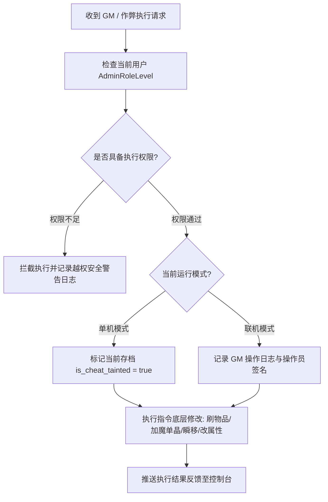

# 后端架构需求表20（第二十卷：隐藏管理员权限、全域 GM 仲裁与沙盒作弊调试系统）

> [!IMPORTANT]
> **【系统定性与第一性原理】**：
>
> 本卷定义卡拉尔高魔世界引擎的**超级管理员权限树、全域 GM 仲裁管道、单机沙盒作弊（Cheat Sandbox）与调试中枢**。系统必须满足：
> 1. **双态权限解耦（单机自由作弊 vs 联机权威审计）**：
>    - **单机模式**：作为官方内置开发者控制台与爽快作弊系统，允许玩家自由修改数值、刷取神兵魔单晶、体验全流派；
>    - **联机模式**：作为最高安全等级的 GM 仲裁系统，必须校验加密 Session Token 与管理员公私钥签名，严防越权注入；
> 2. **细粒度四级权限矩阵 (Permission RBAC Matrix)**：
>    - `LEVEL_0_PLAYER` (标准玩家，仅允许使用公共交互指令)；
>    - `LEVEL_1_TESTER` (测试员，允许查看包体性能帧率、碰撞线框与无害调试信息)；
>    - `LEVEL_2_GAMEMASTER` (巡查 GM，允许禁言、踢人、瞬移监察、发放受限补偿)；
>    - `LEVEL_3_SUPERADMIN` (超级管理员/创世神，拥有全域世界状态与底层字节码热修改权)；
> 3. **作弊标记污染隔离 (`is_cheat_tainted`)**：
>    - 单机玩家一旦使用作弊指令，当前存档被永久打上 `is_cheat_tainted = true` 标记；
>    - 该标记自动禁用该存档上传全服天梯排行榜与云端成就，保证联机环境的绝对公平；
> 4. **全指令因果流水审计**：所有管理员/作弊操作均记录在确定性时间戳日志中，支持回放追溯。

---

## 一、 管理员权限聚合实体与 RBAC 矩阵 (`AdminPermissionAggregate`)

```gdscript
# 脚本路径: res://core/domain/admin/admin_permission_aggregate.gd
class_name AdminPermissionAggregate
extends RefCounted

enum AdminRoleLevel {
    PLAYER = 0,        # 普通冒险者
    TESTER = 1,        # 测试玩家 (查看调试信息)
    GAMEMASTER = 2,    # 巡视裁判 (踢人/禁言/地缘监测)
    SUPERADMIN = 3     # 创世神 (无限制修改万物)
}

var account_id: String
var current_role: AdminRoleLevel = AdminRoleLevel.PLAYER
var is_god_mode: bool = false            # 锁血无敌状态
var is_infinite_mana: bool = false        # 无限魔素/零能损状态
var is_instant_cooldown: bool = false     # 技能与行动零冷却
var speed_multiplier: float = 1.0         # 移动与时钟加速倍率 (1.0 ~ 10.0)

# 校验当前用户是否具备指定命令的执行门槛
func has_permission_for_level(required_level: AdminRoleLevel) -> bool:
    return int(current_role) >= int(required_level)
```

---

## 二、 全域沙盒作弊与调试求解器 (`SandboxCheatSolver`)



### 2.1 核心作弊与调试修改逻辑

```gdscript
# 脚本路径: res://core/domain/admin/sandbox_cheat_solver.gd
class_name SandboxCheatSolver
extends RefCounted

# 1. 强制注入物品与战略货币
static func cheat_give_item(character_entity: Dictionary, item_template_id: String, count: int = 1) -> Dictionary:
    # 标记作弊污染
    character_entity["is_cheat_tainted"] = true
    # 实例化真实 ItemEntity 并推入背包
    return { "success": true, "msg": "已向背包注入物品: " + item_template_id + " x" + str(count) }

static func cheat_add_mana_crystals(wallet: Dictionary, amount: int) -> Dictionary:
    wallet["mana_monocrystals"] = wallet.get("mana_monocrystals", 0) + amount
    return { "success": true, "new_balance": wallet["mana_monocrystals"] }

# 2. 瞬移传送至任意大地图坐标或城镇
static func cheat_teleport(character_entity: Dictionary, target_town_id: String) -> Dictionary:
    character_entity["current_location_id"] = target_town_id
    return { "success": true, "msg": "已强制撕裂空间瞬移至: " + target_town_id }

# 3. 境界一键飞升与全属性拉满
static func cheat_max_attributes(sheet: Dictionary) -> Dictionary:
    sheet["STR"] = 100.0
    sheet["CON"] = 100.0
    sheet["INT"] = 100.0
    sheet["AGI"] = 100.0
    sheet["SPR"] = 100.0
    sheet["heart_core_integrity"] = 1.0
    sheet["somatic_function"] = 100.0
    return { "success": true, "msg": "已飞升至半神境界，全六维属性达硬上限 100！" }
```

---

## 三、 全域 GM 仲裁流水线与日志审计 (`GMArbitrationAuditService`)

1. **安全审计写入**：所有 GM 指令调用，自动打包为 `GMAuditLogPacket` 并持久化到 `admin_actions.log`；
2. **全服广播干预**：超级管理员可向全服在线客户端广播系统滚屏公告（如维护预告、全服生态天灾刷新预警）；
3. **内置 GM 命令目录桥接**：`GmCommandCatalog` 将沙盒能力注册为 `/give /gold /god /time` 聊天指令（`LEVEL_GAME_MASTER` 门槛，具名静态 handler 桥接 `SandboxCheatSolver`）；`GIVE_ITEM` 支持《第三十六卷》注册表**统一英文名**解析（名称三元组：ID/英文名/i18n）——仅接受 `english_name`（如 `mithril_longsword`，大小写不敏感），中文别名与数字 ID 一律拒绝，无 `id` 前缀等兼容写法；命中则 `template_id` 落 canonical_id 并取原型质量/体积，支持数量参数；物品注册表上下文必填，缺失即拒（无兼容临时物件路径）；
4. **追缴服务边界规范（联机运营）**：`ClawbackService` 供运营部门追缴外挂/利用漏洞非法刷取的资产——仅联机模式（`infrastructure.admin` → `run/mode == online`）可用、单机沙盒一律拒绝；权限门槛 `LEVEL_GAME_MASTER`；支持按币种回扣（全额扣减、**支持扣至负数**，超额部分记为欠账/赤字，钱包 `is_in_debt` 语义允许突破下界）、按原型 `canonical_id` 批量回扣（超额钳制到实际持有数）、按实例 `item_id` 精确回扣单件；全部操作经 `GMArbitrationAuditService` 留痕（操作者/原因码 CHEAT_DETECTED | EXPLOIT_ABUSE | MANUAL_AUDIT/数量/签名）。

---

## 四、 RBAC 提权与审计签名单元测试与验收契约 (`TestAdminSandboxDomain`)

本卷验收契约与实现测试一一对应：覆盖权限矩阵提权、沙盒作弊注入、仲裁日志防篡改、注册表物品发放、内置 GM 命令目录、全域启动装配与追缴边界规范七大闭环。

**测试套件**：`res://tests/unit/test_admin_sandbox.gd`（`TestAdminSandboxDomain`，经 `tests/test_registry.gd` 统一注册，CLI 与 UI 共用同一注册表）；**归档细则**：阶段 4 施工细则 `KALAR-DEV-2026-RM20-004`（见归档库档案卷）。
**确定性基线**：全部用例在 `DeterministicRNG` 固定种子下可复现；涉及货币与物品流转的用例同时断言来源 ➔ 去向守恒闭环。

| 用例 ID | 测试目标 | 核心断言 |
| :--- | :--- | :--- |
| `TC-ADMIN-01` | RBAC 动态提权与权限矩阵拦截 | 初始无 GM 权限；口令提权成功后 `has_permission(LEVEL_GAME_MASTER)` 翻转为真 |
| `TC-ADMIN-02` | 上帝模式作弊指令注入与全属性拉满 | `execute_cheat_command(GOD_MODE)` 后 str==999.0 且心核完整度保持 1.0 |
| `TC-ADMIN-03` | GM 仲裁日志审计与防篡改签名 | `record_audit` 返回记录含 admin_id 且 signature 非空 |
| `TC-ADMIN-04` | GM /give 统一英文名物品发放（英文名解析/中文与数字 ID 拒绝/注册表必填/数量发放） | 英文名 `mithril_longsword` 解析出 canonical_id 且 template_id 落位、质量/体积取原型值；中文别名「秘银剑」与数字 ID「1001」均拒绝；缺失注册表上下文拒绝发放；count=3 发放 3 件独立实例 |
| `TC-ADMIN-05` | 内置 GM 命令目录注册/分发/权限门禁/严格语法/隔离清理 | `/give mithril_longsword` 分发成功入背包；`/give id …` 等非规范形态拒绝（无兼容前缀）；LEVEL_PLAYER 被 min_admin_level 拦截；未注册命令返回 unknown；注销后全局注册表还原 |
| `TC-ADMIN-06` | 全域启动装配（注册表+内置命令+分发闭环） | `GameBootstrap.assemble()` 后物品数 ≥ 6、give/gold/god/time 已注册、经装配 catalog 走通 `/give mithril_longsword` 分发 |
| `TC-ADMIN-07` | 追缴服务边界规范（联机限定/权限门槛/货币扣至负数欠账/物品超额钳制/审计留痕） | 单机模式返回 CLAWBACK_OFFLINE_FORBIDDEN；PLAYER 返回 CLAWBACK_PERMISSION_DENIED；货币超额追缴全额扣减、支持扣至负数（持有 1000 请求 5000 → 余额 -4000、into_debt 且净欠额可查）；原型/实例追缴按 canonical_id/item_id 回扣且钳制到实际持有数；审计日志含 CLAWBACK_* 且签名非空 |
