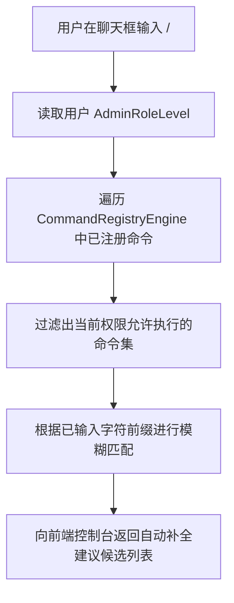

# 后端架构需求表21（第二十一卷：聊天框指令解析器、动态命令识别与奖励发放管线）

> [!IMPORTANT]
> **【系统定性与第一性原理】**：
>
> 本卷定义卡拉尔高魔世界引擎的**聊天框/控制台文本指令分词解析器、动态命令过滤、以及全域奖励与礼包兑换码发放中枢**。系统必须满足：
> 1. **聊天框无缝输入与前缀拦截**：以 `/`（斜杠）开头的输入自动拦截为命令行指令，普通文本则流转为社交频道消息；
> 2. **基于权限的动态可用命令识别与自动补全 (Dynamic Auto-Completion)**：
>    - 系统根据当前用户的《第二十卷》`AdminRoleLevel`，仅展示与识别当前用户有权使用的命令集；
>    - 输入 `/` 时自动弹出可用命令提示与语法帮助（如 `/give <统一英文名> [count]`）；
>    - GM 命令最近使用索引（`GmCommandIndexSolver`，窗口 20 条）支持双击 Tab 展示最近补全候选、再次 Tab 最近适配补全；候选分页滚动且页缓冲池回收复用（内存有界）；
> 3. **全域奖励与系统邮件发放管线 (Reward Dispatch Pipeline)**：
>    - 支持 GM 发送带附件的系统邮件、全服维护补偿、节日礼包；
>    - 支持 CDKey / 兑换码核销状态机，杜绝并发重放利用；
> 4. **健壮的参数类型校验与容错**：严防非法类型输入（如数字参数传入恶意字符串）导致后端状态机崩溃。

---

## 一、 聊天框指令分词与 AST 解析器 (`ChatCommandParser`)

```gdscript
# 脚本路径: res://core/domain/command/chat_command_parser.gd
class_name ChatCommandParser
extends RefCounted

# 解析后的结构化指令包
class ParsedCommandDTO extends RefCounted:
    var raw_input: String
    var is_command: bool = false
    var command_verb: String = ""      # 如 "give", "tp", "add_crystal", "help"
    var arguments: Array[String] = []  # 参数列表
    var error_message: String = ""

static func parse_input(text: String) -> ParsedCommandDTO:
    var dto = ParsedCommandDTO.new()
    dto.raw_input = text.strip_edges()

    if not dto.raw_input.begins_with("/"):
        dto.is_command = false
        return dto

    dto.is_command = true
    var tokens = dto.raw_input.substr(1).split(" ", false)
    if tokens.size() == 0:
        dto.error_message = "空指令，输入 /help 查看可用指令"
        return dto

    dto.command_verb = tokens[0].to_lower()
    for i in range(1, tokens.size()):
        dto.arguments.append(tokens[i])

    return dto
```

---

## 二、 动态命令注册表与自动补全引擎 (`CommandRegistryEngine`)



### 2.1 注册表核心实现

```gdscript
# 脚本路径: res://core/domain/command/command_registry_engine.gd
class_name CommandRegistryEngine
extends RefCounted

# 注册所有可用指令元数据
const COMMAND_DEFINITIONS = {
    "help": {
        "min_level": AdminPermissionAggregate.AdminRoleLevel.PLAYER,
        "syntax": "/help [command]",
        "desc": "查看所有当前可用的命令清单与说明"
    },
    "redeem": {
        "min_level": AdminPermissionAggregate.AdminRoleLevel.PLAYER,
        "syntax": "/redeem <cdkey_code>",
        "desc": "核销并领取官方礼包兑换码奖励"
    },
    "give": {
        "min_level": AdminPermissionAggregate.AdminRoleLevel.SUPERADMIN,
        "syntax": "/give <统一英文名> [count]",
        "desc": "【GM】按统一英文名向自身背包发放指定物品"
    },
    "tp": {
        "min_level": AdminPermissionAggregate.AdminRoleLevel.GAMEMASTER,
        "syntax": "/tp <town_id>",
        "desc": "【GM】瞬间移动至指定城镇或地缘坐标"
    },
    "add_crystals": {
        "min_level": AdminPermissionAggregate.AdminRoleLevel.SUPERADMIN,
        "syntax": "/add_crystals <amount>",
        "desc": "【GM】向钱包增加指定数量的魔单晶"
    },
    "god": {
        "min_level": AdminPermissionAggregate.AdminRoleLevel.SUPERADMIN,
        "syntax": "/god [on/off]",
        "desc": "【GM】开启/关闭锁血无敌与零能损状态"
    }
}

# 根据用户权限获取可用的自动补全候选
static func get_available_completions(user_level: AdminPermissionAggregate.AdminRoleLevel, input_prefix: String) -> Array[Dictionary]:
    var clean_prefix = input_prefix.lstrip("/").to_lower()
    var candidates: Array[Dictionary] = []

    for cmd_verb in COMMAND_DEFINITIONS.keys():
        var def = COMMAND_DEFINITIONS[cmd_verb]
        if int(user_level) >= int(def.min_level):
            if cmd_verb.begins_with(clean_prefix) or clean_prefix == "":
                candidates.append({
                    "verb": cmd_verb,
                    "syntax": def.syntax,
                    "desc": def.desc
                })
    return candidates
```

---

## 三、 奖励发放与 CDKey 兑换码核销管线 (`RewardDispatchPipeline`)

```gdscript
# 脚本路径: res://core/domain/command/reward_dispatch_pipeline.gd
class_name RewardDispatchPipeline
extends RefCounted

# 兑换码核销状态机（注册表三元组发放：item_id 必填为已登记 canonical_id，
# 原型属性为单一事实源，无效配置严格拒绝且不消耗兑换码）
static func redeem_cdkey(
    cdkey: String,
    account_id: String,
    wallet: CharacterWalletEntity,
    inventory: WearableInventoryAggregate,
    catalog: ItemRegistryCatalog
) -> Dictionary:
    var clean_code = cdkey_code.strip_edges().to_upper()
    if redeemed_history.has(clean_code):
        return { "success": false, "error": "该兑换码已被当前账户核销领取过，不可重复使用" }

    # 模拟兑换码解析与奖池发放
    if clean_code == "KALAR_WELCOME_2026":
        redeemed_history.append(clean_code)
        wallet["mana_monocrystals"] = wallet.get("mana_monocrystals", 0) + 100
        wallet["gold"] = wallet.get("gold", 0) + 1000
        return {
            "success": true,
            "rewards": { "mana_monocrystals": 100, "gold": 1000 },
            "msg": "【天赐礼包】成功领取新手开荒大礼包：魔单晶x100，金币x1000！"
        }

    return { "success": false, "error": "无效或已过期的天赐兑换码" }
```

---

## 四、 指令解析与 CDKey 核销单元测试与验收契约 (`TestChatCommandDomain`)

本卷验收契约与实现测试一一对应：覆盖斜杠指令词法分析、动态注册分发、兑换码防重复与 GM 命令索引补全四大闭环。

**测试套件**：`res://tests/unit/test_chat_command.gd`（`TestChatCommandDomain`，经 `tests/test_registry.gd` 统一注册，CLI 与 UI 共用同一注册表）；**归档细则**：阶段 4 施工细则 `KALAR-DEV-2026-RM21-004`（见归档库档案卷）。
**确定性基线**：全部用例在 `DeterministicRNG` 固定种子下可复现；涉及货币与物品流转的用例同时断言来源 ➔ 去向守恒闭环。

| 用例 ID | 测试目标 | 核心断言 |
| :--- | :--- | :--- |
| `TC-CMD-01` | 斜杠指令词法分析与 AST 语法树生成 | `parse_input_line("/give gold 500 count=10")`: is_command、位置参数 2 条、具名参数 count==10 |
| `TC-CMD-02` | 指令动态注册与无缝分发执行 | `register_command` 后 `dispatch_command` 成功；测试结束注销并还原全局注册表计数 |
| `TC-CMD-03` | CDKey 兑换核销与注册表三元组发放（防重复/原型属性/容量拒绝原子性） | 首次核销 success 且 gold==500；物品 template_id 落 canonical_id 且质量/体积取原型值；同码同用户二次核销失败；容量不足整体回滚（货币未入账、码未消耗）且扩容后重试成功 |
| `TC-CMD-04` | GM 命令索引最近20条窗口/分页滚动/页池回收/默认回退/最近适配补全 | 窗口截断至 20 条且 MRU 置顶；分页 4 页、页池 ≤ max_pages；最近适配返回 /cmd_24；无最近记录回退默认目录 |
