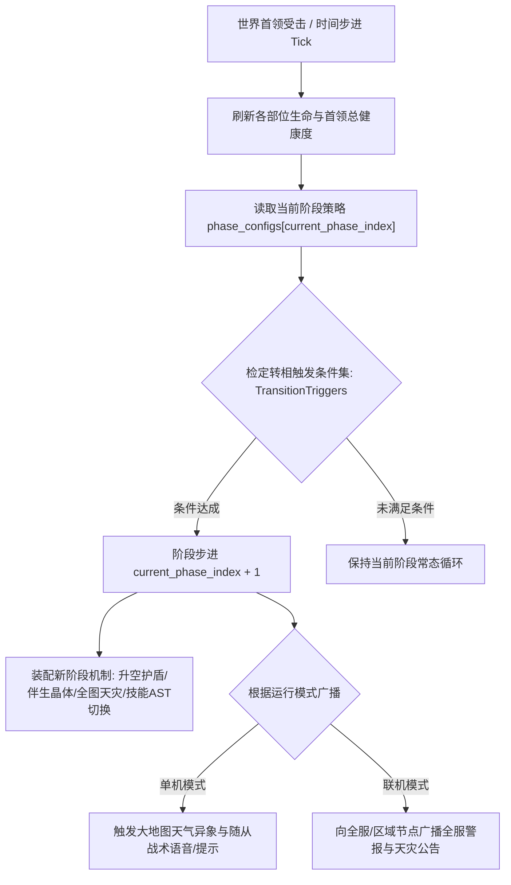

# 后端架构需求表23（第二十三卷：世界 BOSS 与巨型灾厄首领通用引擎底座（单机游荡天灾与联机共战双态同构））

> [!IMPORTANT]
> **【系统定性与第一性原理】**：
> 本卷定义卡拉尔高魔世界引擎的**世界级巨型灾厄首领（World Boss / Calamity Leviathans）、多部位独立解剖学拓扑、数据驱动阶段转相（Phase Transition）与双态（单机/联机）贡献度结算通用框架底座**。
>
> **【严正定调 · 单机与联机双态 100% 同构】**：
> 1. **单机非联机独占，乃单机开放世界核心生态**：
>    - **单机态（Single-Player Mode）**：世界 BOSS 是单机大地图上的**“游荡远古天灾 / 地脉禁区守护神”**。它们在七大洲地脉间自发巡游，引发局部区域魔素畸变、暴风雪/熔岩天灾与商队断绝。单机玩家可单枪匹马挑战，亦可调遣酒馆随从、阵营盟友军团、雇佣兵或攻城重械协同围剿；
>    - **联机态（Multiplayer Mode）**：世界 BOSS 承担跨团队公会集结、全服地缘争夺与跨区域史诗 Raid 战役；
>    - **双态底层零分叉**：单机与联机 100% 共享相同的实体聚合根、多部位受击力学、转相逻辑与贡献度结算求解器；
> 2. **完全数据驱动与零硬编码 (Data-Driven Zero-Hardcoding)**：
>    - 绝无写死特定怪物与血量，通过 `WorldBossTemplateConfig` 驱动任意巨龙、泰坦魔像、深渊利维坦或浮空遗迹战舰；
> 3. **通用多部位独立破坏拓扑 (Colossal Body-Part Hierarchy)**：
>    - 各解剖学部位（如双翼/核心晶核/触手群/护盾结界）拥有独立碰撞体、有效护甲、破坏受损阈值与断肢/瘫痪惩罚；
> 4. **参数化多阶段转相引擎 (Configurable Phase Transition Engine)**：
>    - 支持任意 $N$ 阶段，由生命百分比、部位全毁、战斗时长或环境魔素等复合断言触发；
>    - 阶段流转动作支持无敌护盾、天灾结晶召唤、全图重力反转、超位法术等插件化机制装配；
> 5. **通用加权贡献度与战利品分配求解器 (Universal Contribution & Loot Solver)**：
>    - 单机模式下结算玩家与随从/NPC 军团的战斗贡献（决定战利品归属、随从忠诚度与阵营声望）；
>    - 联机模式下结算各团队与全服玩家的 Shapley 积分排名。

---

## 一、 数据驱动世界首领通用聚合根 (`WorldBossAggregate`)

```gdscript
# 脚本路径: res://core/domain/world_boss/world_boss_aggregate.gd
class_name WorldBossAggregate
extends RefCounted

enum WorldBossContextMode {
    SINGLE_PLAYER_ROAMING, # 单机模式: 大地图游荡天灾/禁区领主 (可单挑或带随从/NPC军团)
    MULTIPLAYER_RAID       # 联机模式: 全服/多团队跨区域史诗集结
}

# 基础身份与模板溯源
var instance_id: String                       # 运行时全局唯一实例 ID (UUIDv4)
var template_id: String                       # 模板配置 ID (如 "TEMPLATE_CALAMITY_TITAN")
var current_mode: WorldBossContextMode = WorldBossContextMode.SINGLE_PLAYER_ROAMING
var localized_name_key: String                # 本地化名称键名
var current_continent_node_id: String         # 当前所在大洲/定居点网格 ID

# 通用多部位解剖学血条与力学拓扑 (part_id -> ColossalBodyPartDTO)
var body_parts: Dictionary = {}               # {"HEAD": part, "WING_LEFT": part, "CORE_CRYSTAL": part}
var total_current_hp: float = 0.0
var total_max_hp: float = 0.0

# 数据驱动的多阶段配置链表
var phase_configs: Array[Dictionary] = []     # 阶段策略配置数组 (支持 1~N 阶段)
var current_phase_index: int = 0              # 当前阶段索引
var is_invulnerable: bool = false             # 机制无敌护盾状态
var active_mechanic_entities: Array[String] = [] # 伴生机制物实例 ID 列表 (如天灾晶核/护盾生成器)

# 参战实体贡献度账本 (entity_id -> CombatContributionRecordDTO: 支持玩家、随从与同盟 NPC)
var contribution_ledger: Dictionary = {}

func calculate_composite_health() -> void:
    var cur = 0.0
    var max_h = 0.0
    for part in body_parts.values():
        cur += part.current_hp
        max_h += part.max_hp
    total_current_hp = cur
    total_max_hp = max_h
```

---

## 二、 通用阶段转相状态机 (`ConfigurablePhaseTransitionFSM`)



### 2.1 阶段转相通用判定算法
```gdscript
# 脚本路径: res://core/domain/world_boss/configurable_phase_transition_fsm.gd
class_name ConfigurablePhaseTransitionFSM
extends RefCounted

static func evaluate_transition(boss: WorldBossAggregate, delta: float) -> Dictionary:
    if boss.current_phase_index >= boss.phase_configs.size() - 1:
        return { "transitioned": false } # 已处于最终狂化阶段

    var next_phase_idx = boss.current_phase_index + 1
    var next_phase_cfg = boss.phase_configs[next_phase_idx]
    var trigger_rule = next_phase_cfg.get("transition_trigger", {})

    var should_transition = false
    var hp_ratio = boss.total_current_hp / max(1.0, boss.total_max_hp)

    # 1. 触发模式 A: 生命百分比门槛 (如低于 70%, 30%)
    if trigger_rule.has("hp_ratio_below") and hp_ratio <= trigger_rule["hp_ratio_below"]:
        should_transition = true
    # 2. 触发模式 B: 关键部位破坏 (如护盾晶核/双翼全毁)
    elif trigger_rule.has("required_destroyed_part"):
        var req_part = trigger_rule["required_destroyed_part"]
        if boss.body_parts.has(req_part) and boss.body_parts[req_part].current_hp <= 0:
            should_transition = true

    if should_transition:
        boss.current_phase_index = next_phase_idx
        boss.is_invulnerable = next_phase_cfg.get("grant_invulnerability", false)
        return {
            "transitioned": true,
            "new_phase_index": next_phase_idx,
            "phase_name": next_phase_cfg.get("phase_name", "UNKNOWN"),
            "broadcast_announcement": next_phase_cfg.get("broadcast_message", "")
        }

    return { "transitioned": false }
```

---

## 三、 单机/联机双态通用贡献度结算求解器 (`UniversalContributionSolver`)

无论是在单机沙盒中玩家带领 3 名 NPC 随从击杀，还是联机模式下 40 人大型团队讨伐，结算公式 100% 同构：

$$\text{Score} = (D_{\text{deal}} \times W_{\text{dmg}}) + (D_{\text{take}} \times W_{\text{tank}}) + (M_{\text{score}} \times W_{\text{mech}}) + (H_{\text{done}} \times W_{\text{heal}})$$

```gdscript
# 脚本路径: res://core/domain/world_boss/universal_contribution_solver.gd
class_name UniversalContributionSolver
extends RefCounted

static func evaluate_entity_score(record: Dictionary, weights: Dictionary) -> float:
    var dmg = record.get("damage_dealt", 0.0) * weights.get("damage", 0.60)
    var tank = record.get("damage_taken", 0.0) * weights.get("tanking", 0.20)
    var mech = record.get("mechanic_score", 0.0) * weights.get("mechanics", 0.15)
    var heal = record.get("support_healing", 0.0) * weights.get("support", 0.05)
    return dmg + tank + mech + heal

# 结算战利品与声望
static func settle_rewards(
    boss: WorldBossAggregate,
    weights_profile: Dictionary,
    reward_tier_table: Array[Dictionary]
) -> Array[Dictionary]:
    var ranked_list: Array[Dictionary] = []

    for entity_id in boss.contribution_ledger.keys():
        var rec = boss.contribution_ledger[entity_id]
        var score = evaluate_entity_score(rec, weights_profile)
        ranked_list.append({
            "entity_id": entity_id,
            "is_player": rec.get("is_player", true),
            "score": score,
            "details": rec
        })

    ranked_list.sort_custom(func(a, b): return a.score > b.score)

    for i in range(ranked_list.size()):
        var rank = i + 1
        ranked_list[i]["rank"] = rank
        ranked_list[i]["reward_package"] = match_tier(rank, reward_tier_table)

    return ranked_list

static func match_tier(rank: int, tier_table: Array[Dictionary]) -> Dictionary:
    for tier in tier_table:
        if rank <= tier.get("max_rank", 999999):
            return tier.get("reward_dto", {})
    return {}
```

---

## 四、 多阶段转相与战功结算单元测试与验收契约 (`TestWorldBossDomain`)

本卷验收契约与实现测试一一对应：覆盖多阶段转相机制切换与单机/联机同构战功结算两大闭环。

**测试套件**：`res://tests/unit/test_world_boss.gd`（`TestWorldBossDomain`，经 `tests/test_registry.gd` 统一注册，CLI 与 UI 共用同一注册表）；**归档细则**：阶段 4 施工细则 `KALAR-DEV-2026-RM23-004`（见归档库档案卷）。
**确定性基线**：全部用例在 `DeterministicRNG` 固定种子下可复现；涉及货币与物品流转的用例同时断言来源 ➔ 去向守恒闭环。

| 用例 ID | 测试目标 | 核心断言 |
| :--- | :--- | :--- |
| `TC-BOSS-01` | 世界首领多阶段转相与机制护盾激活 | 阶段血量清空触发 `phase_transition`，current_phase_index 1→2 且 `is_channeling_wipe_spell` 为真 |
| `TC-BOSS-02` | 单机联机通用战功榜加权计算与 MVP 评定 | `distribute_boss_loot`: MVP 为最高贡献者 PLAYER_B，榜单覆盖全部参战实体 |
