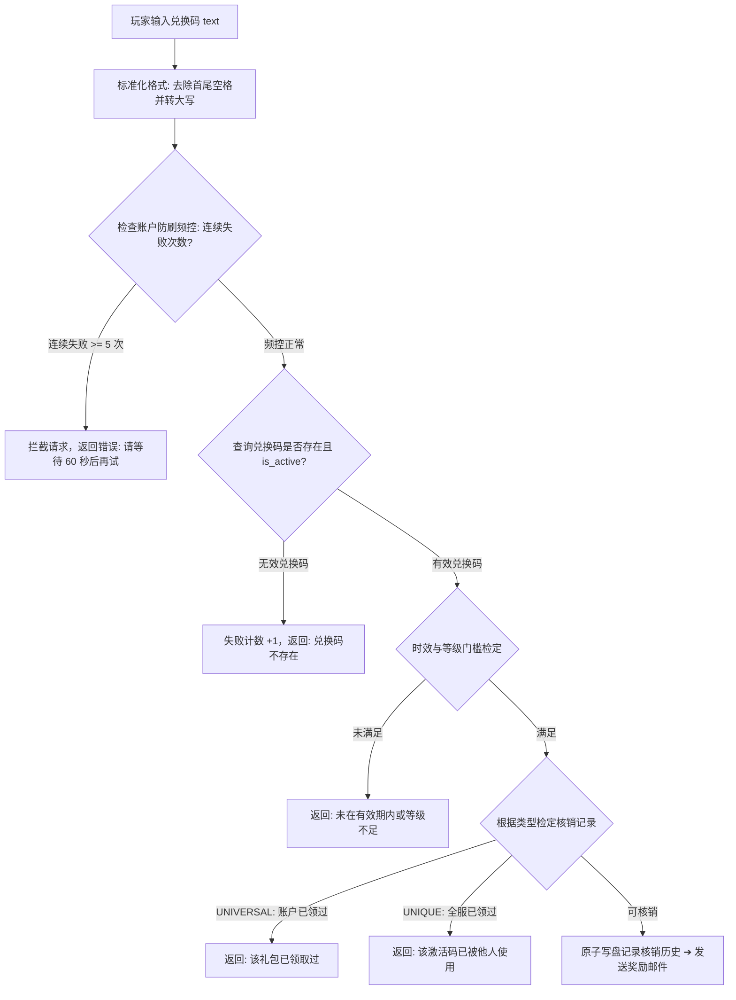

# 后端架构需求表24（第二十四卷：全域礼包兑换码、CDKey 凭证核销与时效防刷系统）

> [!IMPORTANT]
> **【系统定性与第一性原理】**：
> 本卷定义卡拉尔高魔世界引擎的**官方礼包兑换码（CDKey / Gift Voucher）、全域防重放核销状态机、时效批次管控与安全防刷中枢**。系统必须满足：
> 1. **通用双轨兑换码模型 (Universal Dual-Track Voucher Architecture)**：
>    - **类型 A：全服通用永久/限时码 (Universal Broadcast Code)**：如 `KALAR_2026`，所有账户均可核销一次，记录在账户核销履历表中；
>    - **类型 B：一次性唯一激活码 (Single-Use Unique Token)**：如媒体/渠道礼包，核销即作废（标记为 `REDEEMED_GLOBAL`），全服任何账户不可再次使用；
> 2. **时效批次与门槛约束契约 (Lifecycle & Eligibility Constraints)**：
>    - 支持设置有效时间窗口（`valid_from_utc` ~ `valid_to_utc`）；
>    - 支持总核销次数上限（`max_global_redemptions`）与单账户等级/位阶最低门槛校验；
> 3. **原子性核销与防并发重放 (Atomic Redemption & Concurrency Guard)**：
>    - 核销操作必须处于原子事务中，核销校验通过 ➔ 锁定状态 ➔ 触发《第二十五卷》邮件附件直发或直接注入钱包背包；
> 4. **速率限制与暴力破解防御 (Rate Limiting & Anti-Brute-Force)**：
>    - 单账户连续输错 5 次兑换码自动进入 60 秒冷却锁定，严防黑客脚本遍历撞库。

---

## 一、 兑换码批次与凭证领域实体 (`CDKeyVoucherAggregate`)

```gdscript
# 脚本路径: res://core/domain/voucher/cdkey_voucher_aggregate.gd
class_name CDKeyVoucherAggregate
extends RefCounted

enum VoucherType {
    UNIVERSAL_PER_ACCOUNT, # 全服通用码 (每账户限领1次)
    UNIQUE_ONE_TIME        # 一次性唯一码 (全服仅限1次，核销即废)
}

var voucher_code: String                    # 兑换码明文 (标准化大写如 "KALAR_WELCOME_2026")
var voucher_type: VoucherType = VoucherType.UNIVERSAL_PER_ACCOUNT
var batch_id: String                        # 批次 ID (如 "BATCH_STEAM_LAUNCH_2026")
var localized_title: String                 # 礼包展示标题 (如 "新手启航补给箱")

# 时效与可用性配置
var valid_from_utc: int = 0
var valid_to_utc: int = 4102444800          # 默认永久或指定截至时间戳
var max_global_redemptions: int = -1        # 全服最大核销次数 (-1 为无限制)
var current_global_redemptions: int = 0
var required_character_level: int = 1       # 领取最低等级门槛
var is_active: bool = true                  # GM 是否强制吊销

# 奖励载荷配置包 (Reward Payload DTO)
var reward_payload: Dictionary = {
    "mana_monocrystals": 0,
    "silver_coins": 0,
    "item_templates": [],                   # [{"template_id": "POTION_HEALTH", "count": 5}]
    "grimoire_ast_keys": []
}
```

---

## 二、 兑换码核销状态机与防刷求解器 (`CDKeyRedemptionSolver`)



### 2.1 核心核销求解算法
```gdscript
# 脚本路径: res://core/domain/voucher/cdkey_redemption_solver.gd
class_name CDKeyRedemptionSolver
extends RefCounted

static func resolve_redemption(
    account_id: String,
    char_level: int,
    raw_code: String,
    voucher_registry: Dictionary,
    account_redeemed_list: Array[String],
    global_unique_redeemed_set: Dictionary,
    current_utc: int
) -> Dictionary:
    var clean_code = raw_code.strip_edges().to_upper()
    if not voucher_registry.has(clean_code):
        return { "success": false, "code": "ERR_INVALID_CODE", "msg": "无效或不存在的天赐兑换码" }

    var voucher: CDKeyVoucherAggregate = voucher_registry[clean_code]
    if not voucher.is_active:
        return { "success": false, "code": "ERR_VOUCHER_REVOKED", "msg": "该兑换码已被神殿封禁吊销" }

    if current_utc < voucher.valid_from_utc or current_utc > voucher.valid_to_utc:
        return { "success": false, "code": "ERR_EXPIRED", "msg": "该兑换码尚未生效或已过期失效" }

    if char_level < voucher.required_character_level:
        return { "success": false, "code": "ERR_LEVEL_TOO_LOW", "msg": "角色修为未达到该礼包最低要求" }

    # 状态机核销判定
    if voucher.voucher_type == CDKeyVoucherAggregate.VoucherType.UNIVERSAL_PER_ACCOUNT:
        if account_redeemed_list.has(clean_code):
            return { "success": false, "code": "ERR_ALREADY_REDEEMED", "msg": "当前账户已领取过该专属礼包" }
    else: # UNIQUE_ONE_TIME
        if global_unique_redeemed_set.has(clean_code):
            return { "success": false, "code": "ERR_ALREADY_USED", "msg": "该一次性激活码已被其他冒险者使用" }

    # 执行原子核销记录
    if voucher.voucher_type == CDKeyVoucherAggregate.VoucherType.UNIVERSAL_PER_ACCOUNT:
        account_redeemed_list.append(clean_code)
    else:
        global_unique_redeemed_set[clean_code] = account_id

    voucher.current_global_redemptions += 1

    return {
        "success": true,
        "code": "REDEEM_SUCCESS",
        "title": voucher.localized_title,
        "rewards": voucher.reward_payload
    }
```

---

## 三、 核销防刷状态机与奖励直发管线 (`CDKeyRedemptionSolver`)

1. **频控锁定**：按账户累计失败次数，连续输错达阈值即写入 `lock_until_utc` 进入 RATE_LIMITED 锁定态（阈值与时长由 `domains.cdkey_voucher` 的 `rate_limit.*` 驱动）；
2. **双轨码型检定**：`UNIVERSAL_PER_ACCOUNT` 按账户防重复（ALREADY_REDEEMED）；`UNIQUE_ONE_TIME` 写入全服作废表（ALREADY_USED_GLOBALLY），杜绝一码多领；
3. **原子核销登记**：输入码归一化（trim + 大写）后顺序通过时效与门槛检定，成功才写入核销历史与全局作废表，防并发重放；
4. **奖励直发管线**：`VoucherDispatchPipeline.dispatch_rewards_direct` 将 `reward_payload` 拆解为钱包货币入账与模板物品实例化入包，一步完成核销到资产落地；道具发放走《第三十六卷》物品注册表三元组——`template_id` 必填为已登记 canonical_id，质量/体积取原型值，未登记模板严格计入 `items_failed`（不造临时物件）。

**归档细则**：阶段 3 施工细则 `KALAR-DEV-2026-RM24-003`（见归档库档案卷）。

---

## 四、 兑换码核销与防刷单元测试与验收契约 (`TestCDKeyVoucherDomain`)

本卷验收契约与实现测试一一对应：覆盖双轨码型防重复、频控防爆破与奖励直发落地三大闭环。

**测试套件**：`res://tests/unit/test_cdkey_voucher.gd`（`TestCDKeyVoucherDomain`，经 `tests/test_registry.gd` 统一注册，CLI 与 UI 共用同一注册表）；**归档细则**：阶段 4 施工细则 `KALAR-DEV-2026-RM24-004`（见归档库档案卷）。
**确定性基线**：全部用例在 `DeterministicRNG` 固定种子下可复现；涉及货币与物品流转的用例同时断言来源 ➔ 去向守恒闭环。

| 用例 ID | 测试目标 | 核心断言 |
| :--- | :--- | :--- |
| `TC-CDKEY-01` | 通用码防重复核销与唯一码全服作废机制 | 账户 A 领通用码成功后再领拦截 ALREADY_REDEEMED；唯一码被 B 领取后拦截 ALREADY_USED_GLOBALLY |
| `TC-CDKEY-02` | 连续输错 5 次触发 60 秒频控锁定 | 第 6 次任意码请求返回失败且 error_code == RATE_LIMITED |
| `TC-CDKEY-03` | 礼包奖励直发（注册表三元组实例化/未登记模板严格拒绝） | `dispatch_rewards_direct`: gold==50、mana_monocrystals==3、POTION_MANA 实例 template_id 落 canonical_id 且质量/体积取原型值 items_added==1；未登记模板 ITEM_GENERIC 计入 items_failed==1 |
