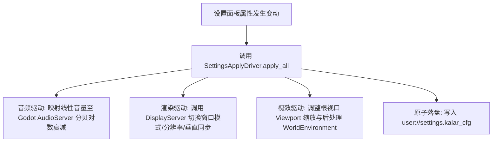

# 后端架构需求表26（第二十六卷：全局设置中心、音画视效调度与渲染管线配置系统）

> [!IMPORTANT]
> **【系统定性与第一性原理】**：
> 本卷定义卡拉尔高魔世界引擎的**全局用户个性化设置中心、音频总线混音调度、UI/视效个性化、以及现代多端渲染管线配置中枢**。系统必须满足：
> 1. **分层配置领域模型 (Hierarchical Configuration Schema)**：
>    - **音频层 (Audio Bus Routing)**：Master 总音量、BGM 音乐、SFX 战斗音效、UI 提示音、环境天灾音效 independent 音量与分路静音；
>    - **视效与 UI 层 (Visuals & Interface)**：UI 缩放因子 ($0.75 \sim 1.5\times$)、字体大小、战斗飘字数字密度、多语言区域本地化 (I18N: zh_CN / en_US)；
>    - **渲染管线与画质层 (Render Pipeline & Graphics)**：
>      - 显示模式：全屏 (Exclusive Fullscreen)、无边框窗口 (Borderless Window)、普通窗口化；
>      - 分辨率与长宽比适配 ($1280\times 720 \sim 3840\times 2160$)；
>      - 帧率上限 ($30 / 60 / 120 / 144 / \text{Unlimited}$) 与垂直同步 (VSync: Disabled / Enabled / Adaptive)；
>      - 抗锯齿 (Anti-Aliasing: None / FXAA / MSAA-2x / MSAA-4x) 与后处理辉光 (Glow/Bloom)、动态阴影质量；
>    - **操作与输入层 (Input & Keybindings)**：动作映射 (Action Mapping) 与手柄死区调节；
> 2. **即时热应用与无损回滚 (Instant Hot-Apply & Auto-Revert)**：
>    - 分辨率与全屏切换具备 15 秒倒计时安全回滚确认机制，严防玩家黑屏无法恢复；
> 3. **独立自洽原子落盘 (`settings.kalar_cfg`)**：
>    - 设置与具体冒险者存档解耦，独立序列化为 JSON/ConfigFile 格式，启动时零依赖秒级热加载。

---

## 一、 全局设置领域聚合实体 (`GameSettingsAggregate`)

```gdscript
# 脚本路径: res://core/domain/settings/game_settings_aggregate.gd
class_name GameSettingsAggregate
extends RefCounted

# 1. 音频总线设置组 (线性音量 0.0 ~ 1.0)
var audio_settings: Dictionary = {
    "master_volume": 1.0,
    "bgm_volume": 0.8,
    "sfx_volume": 0.9,
    "ui_volume": 0.8,
    "ambience_volume": 0.7,
    "is_master_muted": false
}

# 2. 界面与视效设置组
var ui_visual_settings: Dictionary = {
    "ui_scale": 1.0,                        # 缩放倍率 (0.8, 1.0, 1.25, 1.5)
    "language": "zh_CN",                    # 语言代码
    "show_damage_numbers": true,             # 是否显示战斗碰撞飘字
    "damage_text_scale": 1.0,
    "screen_shake_intensity": 1.0           # 屏幕受击震动幅度 (0.0 ~ 2.0)
}

# 3. 渲染管线与画质设置组
var render_settings: Dictionary = {
    "window_mode": "EXCLUSIVE_FULLSCREEN",  # FULLSCREEN / BORDERLESS / WINDOWED
    "resolution_width": 1920,
    "resolution_height": 1080,
    "vsync_mode": "ENABLED",                # DISABLED / ENABLED / ADAPTIVE
    "target_fps_cap": 60,                   # 30, 60, 120, 0 (0为不锁帧)
    "msaa_level": "MSAA_4X",                # NONE / MSAA_2X / MSAA_4X / MSAA_8X
    "shadow_quality": "HIGH",               # LOW / MEDIUM / HIGH / ULTRA
    "glow_bloom_enabled": true,
    "particle_density": 1.0                 # 粒子密度 (0.2 ~ 1.0)
}
```

---

## 二、 渲染与音画即时热应用驱动器 (`SettingsApplyDriver`)



### 2.1 核心热应用算法与分贝转换
```gdscript
# 脚本路径: res://core/domain/settings/settings_apply_driver.gd
class_name SettingsApplyDriver
extends RefCounted

# 线性音量 (0.0~1.0) 转化为对数分贝 dB 方程
static func linear_to_db(linear_val: float) -> float:
    if linear_val <= 0.001:
        return -80.0 # 完全静音
    return 20.0 * (log(linear_val) / log(10.0))

# 即时热应用全套设置
static func apply_all_settings(settings: GameSettingsAggregate) -> void:
    # 1. 应用音频
    var master_vol = 0.0 if settings.audio_settings["is_master_muted"] else settings.audio_settings["master_volume"]
    var master_db = linear_to_db(master_vol)
    # AudioServer.set_bus_volume_db(AudioServer.get_bus_index("Master"), master_db)

    # 2. 应用渲染画质
    var render_cfg = settings.render_settings
    # DisplayServer.window_set_vsync_mode(DisplayServer.VSYNC_ENABLED if render_cfg["vsync_mode"] == "ENABLED" else DisplayServer.VSYNC_DISABLED)
    # Engine.max_fps = render_cfg["target_fps_cap"]
```

---

## 三、 设置热应用与安全回滚驱动器 (`SettingsApplyDriver`)

1. **校验与钳制**：音量、UI 缩放（0.75~1.5）与分辨率边界全部由 `domains.game_settings` 驱动，非法值 `validate_and_sanitize` 即时钳制回安全区间；
2. **分辨率切换守卫**：`apply_resolution_with_revert_guard` 先备份当前快照再应用新分辨率，进入待确认态；
3. **15 秒安全回滚**：`tick_revert_timer` 超时未确认即回滚备份快照，防止黑屏白屏把玩家锁死在不可用分辨率。

**归档细则**：阶段 3 施工细则 `KALAR-DEV-2026-RM26-003`（见归档库档案卷）。

---

## 四、 设置持久化与安全回滚单元测试与验收契约 (`TestGameSettingsDomain`)

本卷验收契约与实现测试一一对应：覆盖序列化完整性、边界钳制与分辨率回滚三大闭环。

**测试套件**：`res://tests/unit/test_game_settings.gd`（`TestGameSettingsDomain`，经 `tests/test_registry.gd` 统一注册，CLI 与 UI 共用同一注册表）；**归档细则**：阶段 4 施工细则 `KALAR-DEV-2026-RM26-004`（见归档库档案卷）。
**确定性基线**：全部用例在 `DeterministicRNG` 固定种子下可复现；涉及货币与物品流转的用例同时断言来源 ➔ 去向守恒闭环。

| 用例 ID | 测试目标 | 核心断言 |
| :--- | :--- | :--- |
| `TC-SET-01` | 全局设置序列化与反序列化完整性 | `save_to_memory_string` → `load_from_memory_string` 后 master_volume 0.65 与分辨率 2560 精确还原 |
| `TC-SET-02` | 设置数值边界防护与自适应 Clamp 修正 | bgm_volume 2.5 钳制为 1.0，ui_scale 0.2 钳制为 0.75 |
| `TC-SET-03` | 分辨率切换 15 秒未确认安全自动回滚 | `tick_revert_timer(16.0)` 回滚成功，分辨率还原 1920×1080 |
