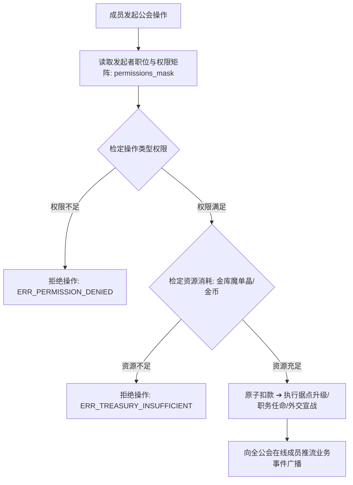

# 后端架构需求表27（第二十七卷：原生与自创组织系统、公会自治管理与职位驻地科技中枢）

> [!IMPORTANT]
> **【系统定性与第一性原理】**：
> 本卷定义卡拉尔高魔世界引擎的**原生世界组织 (Native World Guilds)、玩家自创公会 (Player-Created Organizations)、阶层职位权限与据点资产自治中枢**。系统必须满足：
> 1. **双轨组织创生拓扑 (Dual-Track Organization Genesis)**：
>    - **原生固有组织 (Native Baseline)**：创世初始化自发生成的常驻大势力（如七大洲各城镇的【冒险者公会】、【秘术学者协会】、【黑铁工匠行会】、【暗影盗贼兄弟会】）；
>    - **玩家自创自治组织 (Player-Custom Custom Guilds)**：玩家达到经历声望、持有建会令与魔单晶资产后，可自由拓荒建立宗派、佣兵战团、跨国商会或隐秘结社；
> 2. **细粒度职位 RBAC 与治理架构 (Hierarchy & Governance Architecture)**：
>    - 组织内部拥有多级头衔职位 (如 会长/副会长/司库/执事/精英/外门见习)；
>    - 严格的权限分配（审批入会、动用金库、宣战停战、接发专属委托、升级驻地设施）；
> 3. **组织资产金库与驻地设施科技树 (Guild Treasury & Headquarters Tech-Tree)**：
>    - 共享公共魔单晶/金币金库与公会仓储；
>    - 据点建筑升级（如公会炼金坊、战术冥想室、锻造熔炉），为全员提供被动光环增益；
> 4. **动态地缘外交与阵营声望矩阵 (Diplomatic Relations & Affiliation DAG)**：
>    - 组织间具备动态外交状态（同盟/友好/中立/敌对/公开宣战），直接影响大地图行军碰撞与自由 PVP 判定。

---

## 一、 组织实体聚合根 (`OrganizationAggregate`)

```gdscript
# 脚本路径: res://core/domain/organization/organization_aggregate.gd
class_name OrganizationAggregate
extends RefCounted

enum OrganizationType {
    NATIVE_ADVENTURER_GUILD,   # 原生冒险者公会 (官方法定)
    NATIVE_MAGES_ASSOCIATION,  # 原生秘术学者协会
    NATIVE_MERCENARY_UNION,    # 原生雇佣兵同盟
    NATIVE_THIEVES_BROTHERHOOD,# 原生暗影兄弟会
    PLAYER_CREATED_CUSTOM      # 玩家自建自治组织
}

enum DiplomaticStance {
    ALLIED,     # 军事同盟
    FRIENDLY,   # 友好贸易
    NEUTRAL,    # 中立
    HOSTILE,    # 敌对
    AT_WAR      # 宣战死斗状态
}

var org_id: String                          # 组织全局唯一 ID (UUIDv4 或 "ORG_ADVENTURER_GUILD_CENTRAL")
var localized_name: String                  # 组织名称
var org_type: OrganizationType = OrganizationType.PLAYER_CREATED_CUSTOM
var leader_account_id: String               # 领袖/会长账户 ID
var headquarters_town_id: String            # 驻地总部所在城镇 ID

# 组织资产与科技
var treasury_mana_crystals: int = 0         # 公共魔单晶储备
var treasury_gold_coins: int = 0            # 公共金币储备
var tech_levels: Dictionary = {             # 设施科技等级
    "ALCHEMY_LAB": 1,
    "BLACKSMITH_FORGE": 1,
    "TACTICAL_TRAINING": 1
}

# 成员花名册 (account_id -> OrgMemberDTO: role, join_time, contribution)
var member_roster: Dictionary = {}

# 外交关系图谱 (target_org_id -> DiplomaticStance)
var diplomatic_relations: Dictionary = {}
```

---

## 二、 组织自治管理与权限求解器 (`OrganizationGovernanceSolver`)



### 2.1 核心自治与外交求解算法
```gdscript
# 脚本路径: res://core/domain/organization/organization_governance_solver.gd
class_name OrganizationGovernanceSolver
extends RefCounted

static func try_upgrade_facility(
    org: OrganizationAggregate,
    facility_key: String,
    cost_crystals: int,
    cost_gold: int,
    operator_role: String
) -> Dictionary:
    if operator_role != "LEADER" and operator_role != "VICE_LEADER":
        return { "success": false, "code": "ERR_NOT_AUTHORIZED", "msg": "仅领袖与副会长可签署公会设施改造令" }

    if org.treasury_mana_crystals < cost_crystals or org.treasury_gold_coins < cost_gold:
        return { "success": false, "code": "ERR_INSUFFICIENT_FUNDS", "msg": "公会金库储备不足以支撑该项升级" }

    org.treasury_mana_crystals -= cost_crystals
    org.treasury_gold_coins -= cost_gold
    org.tech_levels[facility_key] = org.tech_levels.get(facility_key, 0) + 1

    return {
        "success": true,
        "facility": facility_key,
        "new_level": org.tech_levels[facility_key],
        "remaining_crystals": org.treasury_mana_crystals
    }
```

---

## 三、 治理鉴权与驻地科技状态机 (`OrganizationTechFSM`)

1. **职位 RBAC 鉴权**：`OrganizationGovernanceSolver.can_perform_action` 按职位拦截越权（见习生提取金库 PERMISSION_DENIED；宣战仅限会长级）；
2. **驻地科技升级**：`upgrade_facility` 消耗 = 当前等级 × 500 金 + × 10 魔单晶，金库余额不足 INSUFFICIENT_FUNDS，成功后 `tech_levels` 步进；
3. **全员光环结算**：`calculate_guild_buff_modifiers` 按设施等级输出全成员被动增益（如锻造坊 2 级 equipment_durability_loss_reduction 0.08）。

**归档细则**：阶段 3 施工细则 `KALAR-DEV-2026-RM27-003`（见归档库档案卷）。

---

## 四、 组织治理与科技光环单元测试与验收契约 (`TestOrganizationGuildDomain`)

本卷验收契约与实现测试一一对应：覆盖金库出纳鉴权、外交权限矩阵与科技增益结算三大闭环。

**测试套件**：`res://tests/unit/test_organization_guild.gd`（`TestOrganizationGuildDomain`，经 `tests/test_registry.gd` 统一注册，CLI 与 UI 共用同一注册表）；**归档细则**：阶段 4 施工细则 `KALAR-DEV-2026-RM27-004`（见归档库档案卷）。
**确定性基线**：全部用例在 `DeterministicRNG` 固定种子下可复现；涉及货币与物品流转的用例同时断言来源 ➔ 去向守恒闭环。

| 用例 ID | 测试目标 | 核心断言 |
| :--- | :--- | :--- |
| `TC-ORG-01` | 组织职位 RBAC 鉴权与公共金库出纳审计 | 见习生提取拦截 PERMISSION_DENIED；会长提取 500 金 + 10 晶后金库 1500/40 |
| `TC-ORG-02` | 公会最高外交宣战权限与矩阵迁移 | 执事宣战拦截；会长宣战后 `diplomatic_relations[ORG_B]` 迁移为 AT_WAR |
| `TC-ORG-03` | 驻地科技设施升级与全员光环增益结算 | 升级成功 new_level==2、金库扣 500；锻造增益 durability_loss_reduction==0.08 |
