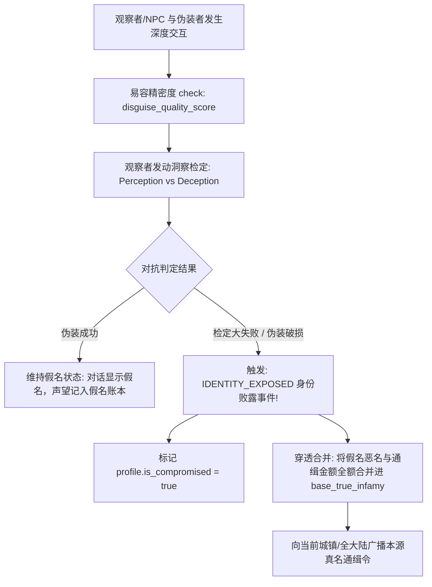

# 后端架构需求表29（第二十九卷：角色同名多重身份、假名伪装欺诈与声望因果回溯系统）

> [!IMPORTANT]
> **【系统定性与第一性原理】**：
> 本卷定义卡拉尔高魔世界引擎的**非唯一显示昵称（同名自由）、多重化名/假名伪装欺诈（Pseudonyms & Disguise）、以及真伪身份声望/恶名因果合并中枢**。系统必须满足：
> 1. **全域允许同名自由 (Non-Unique Display Name Policy)**：
>    - 真实人类社会中姓名绝非全球唯一哈希，允许世界中存在多个同名同姓冒险者（如多个名为“亚瑟”的骑士）；
>    - 系统底层唯一键严格锁定为不可变的 `character_uuid`，所有战斗力学、资产索引与会话只认 UUID，显示名称 100% 允许同名；
> 2. **多重假名与身份面具 (Multi-Identity Mask & Alias Profile)**：
>    - 角色拥有一个【本源真名 (True Identity)】与多个可动态切换的【化名/假名身份 (Alias Profile)】（如配戴鸦面具成为“黑鸦刺客”，佩戴假徽章自称“白银领主”）；
>    - 交互、交易、接取委托时对外暴露当前激活的显示昵称；
> 3. **社交欺骗与看穿检定机制 (Social Deception & Insight Check)**：
>    - 假名伪装存在易容破绽值，NPC 或其他玩家可通过【感知/洞察 INT vs 敏捷/欺诈 AGI】进行对抗掷骰；
> 4. **双轨声望/恶名隔离与真身败露因果回溯 (Reputation Isolation & Identity Exposure)**：
>    - **常态隔离**：使用假名行善或作恶时，声望、阵营好感度与通缉恶名仅累加在该【假名履历】下，真身保持清白；
>    - **真身败露 (Unmasked Event)**：若伪装在案发现场被当场识破、或被高阶真实之眼法术破妄，触发 `IDENTITY_EXPOSED` 事件，该假名下的所有恶名、血债因果立即 **100% 穿透合并回玩家本源真名档案**，引爆全大陆追杀。

---

## 一、 角色多重身份领域实体 (`CharacterIdentityAggregate`)

```gdscript
# 脚本路径: res://core/domain/identity/character_identity_aggregate.gd
class_name CharacterIdentityAggregate
extends RefCounted

class AliasProfile extends RefCounted:
    var alias_id: String                    # 假名唯一 ID (UUID)
    var display_name: String                # 对外显示的虚假姓名 (可任意重名)
    var disguise_quality_score: float = 50.0# 易容伪装精密度 (0~100)
    var accumulated_reputation: int = 0     # 该假名积累的声望
    var accumulated_infamy_bounty: int = 0  # 该假名被悬赏的通缉恶名赏金
    var is_compromised: bool = false        # 该假名是否已彻底败露

var character_uuid: String                  # 角色不可变唯一底座 UUID
var true_canonical_name: String             # 本源真实姓名 (同样允许重名)
var active_alias_id: String = ""            # 当前穿戴激活的假名 ID (空字符串代表以真身行事)

# 本源真身积累的声望与通缉赏金
var base_true_reputation: int = 0
var base_true_infamy_bounty: int = 0

# 假名身份槽位字典 (alias_id -> AliasProfile)
var alias_slots: Dictionary = {}

func get_current_public_display_name() -> String:
    if active_alias_id != "" and alias_slots.has(active_alias_id):
        var profile: AliasProfile = alias_slots[active_alias_id]
        if not profile.is_compromised:
            return profile.display_name
    return true_canonical_name
```

---

## 二、 伪装看穿与身份败露求解器 (`IdentityDeceptionSolver`)



### 2.1 身份败露与声望合并算法
```gdscript
# 脚本路径: res://core/domain/identity/identity_deception_solver.gd
class_name IdentityDeceptionSolver
extends RefCounted

# 执行身份揭穿与因果合并
static func expose_identity(identity: CharacterIdentityAggregate, alias_id: String) -> Dictionary:
    if not identity.alias_slots.has(alias_id):
        return { "success": false, "code": "ERR_NO_SUCH_ALIAS" }

    var profile: CharacterIdentityAggregate.AliasProfile = identity.alias_slots[alias_id]
    if profile.is_compromised:
        return { "success": false, "code": "ALREADY_COMPROMISED" }

    profile.is_compromised = true

    # 将假名下的声望与通缉赏金全额并入真身
    identity.base_true_reputation += profile.accumulated_reputation
    identity.base_true_infamy_bounty += profile.accumulated_infamy_bounty

    # 强制卸下伪装，切回真身
    if identity.active_alias_id == alias_id:
        identity.active_alias_id = ""

    return {
        "success": true,
        "event": "IDENTITY_EXPOSED",
        "true_name": identity.true_canonical_name,
        "transferred_infamy": profile.accumulated_infamy_bounty,
        "total_true_infamy": identity.base_true_infamy_bounty
    }
```

---

## 三、 身份暴露管线与洞察看穿求解器 (`IdentityExposurePipeline`)

1. **非唯一同名与 UUID 底座**：显示名允许全域重复，真身以不可变 `character_uuid` 物理隔离，`equip_alias` 切换对外显示名不触碰本源；
2. **声望隔离记账**：`record_deed` 将恶名赏金记入当前 `alias_slot.accumulated_infamy_bounty`，真身 `base_true_infamy_bounty` 在面具下不受污染；
3. **看穿与败露**：`evaluate_insight_check` 以易容质量对抗观察者洞察；`trigger_unmask_exposure` 败露时将假名恶名 100% 穿透合并回真身并强制摘除面具。

**归档细则**：阶段 3 施工细则 `KALAR-DEV-2026-RM29-003`（见归档库档案卷）。

---

## 四、 假名伪装与败露合并单元测试与验收契约 (`TestIdentityDisguiseDomain`)

本卷验收契约与实现测试一一对应：覆盖同名自由与 UUID 自洽、声望隔离与败露穿透合并三大闭环。

**测试套件**：`res://tests/unit/test_identity_disguise.gd`（`TestIdentityDisguiseDomain`，经 `tests/test_registry.gd` 统一注册，CLI 与 UI 共用同一注册表）；**归档细则**：阶段 4 施工细则 `KALAR-DEV-2026-RM29-004`（见归档库档案卷）。
**确定性基线**：全部用例在 `DeterministicRNG` 固定种子下可复现；涉及货币与物品流转的用例同时断言来源 ➔ 去向守恒闭环。

| 用例 ID | 测试目标 | 核心断言 |
| :--- | :--- | :--- |
| `TC-ID-01` | 非唯一同名自由与底层不可变 UUID 物理自洽 | 两角色同名同姓但 `character_uuid` 互异 |
| `TC-ID-02` | 假名面具下的声望恶名完全隔离 | 面具下作恶 5000 悬赏：真身 base 为 0，假名槽位累计 5000，对外显示假名 |
| `TC-ID-03` | 假名当场败露与恶名赏金 100% 穿透合并回真身 | 洞察对抗成功后 `trigger_unmask_exposure`: 真身恶名 == 8000 且显示名还原本名 |
