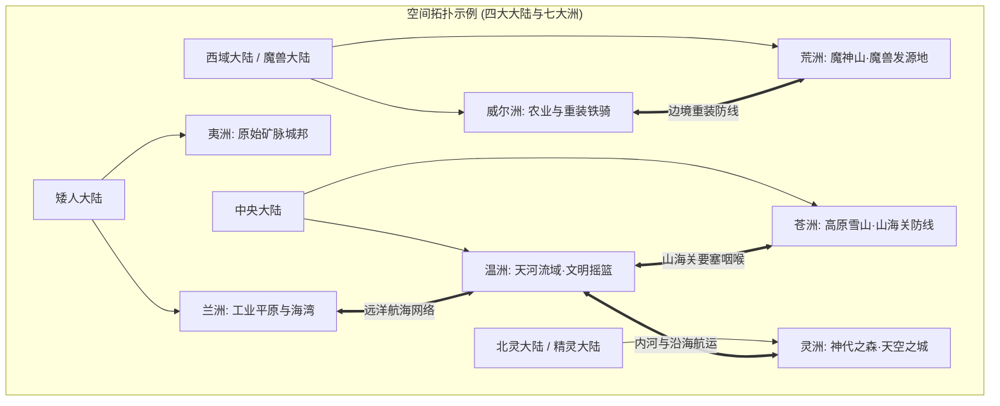
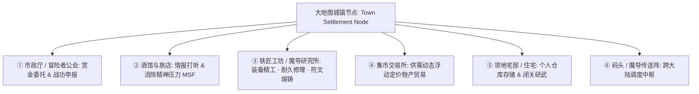
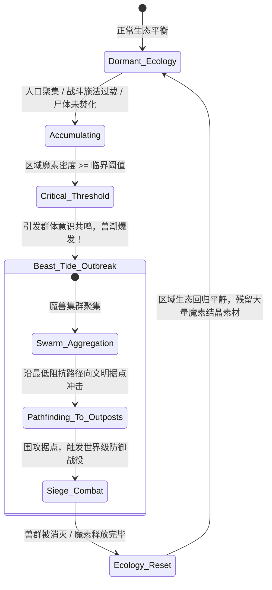

# 后端架构需求表3（第三卷：七大洲阻抗寻路、城镇系统与生态天灾调度算法）

> [!NOTE]
> **【全局架构声明】**：本篇及全套技术文档中所提及的所有具体地理大洲名称（如“温洲、兰洲”）、国家政权名称（如“英尔帝国、矮人联盟”）、城镇据点名称、地貌阻抗系数与天灾事件参数，**均属基础演示示例（Illustrative Examples Only），绝非底层硬编码或静态写死结构**。底层引擎仅定义**分层加权有向图拓扑模型、大地图下辖城镇子图聚合、A* 多介质阻抗求解方程、魔素扩散偏微分状态机、以及可无限动态注册国家、城镇与大地图节点的宏观调度接口**。

---

## 一、 系统概述与地理拓扑图论 (Geographical Topology Overview)

### 1.1 核心职责与空间模型
本卷基于《基本玩法需求设计稿四》、《设计稿五》与《设计稿六》，定义大地图系统的**图论网格拓扑、大地图下辖城镇定居点子图聚合、多介质阻抗寻路算法、行军与后勤补给损耗模型、生态天灾调度算法、以及地缘政权宏观调度状态机**。

### 1.2 全球四大大陆与七大洲空间有向图模型 (基础示例)
全球地理空间在底层定义为**多层分层加权有向图**：

$$\mathcal{G}_{\text{world}} = (\mathcal{V}_{\text{nodes}}, \mathcal{E}_{\text{routes}}, \mathcal{W}_{\text{impedance}})$$



---

## 二、 大地图下辖城镇系统与定居点子图架构 (Town & Settlement Subgraph Architecture)

### 2.1 城镇在大地图空间中的聚合本质
在底层图论中，**城镇/要塞/村落是大地图宏观节点 $\mathcal{V}_{\text{node}}$ 下辖的局部拓扑子图（Settlement Subgraph Aggregate）**。角色进入城镇即从“大地图行军时钟”无缝切换至“局部定居点微观交互时钟”。



### 2.2 城镇六大核心功能设施规范
1. **市政厅 / 冒险者公会 (Town Hall & Guild)**：
   - 动态发布区域悬赏、魔物清剿与阵营护送委托；
   - 评估并结算角色战功，向声望系统 (`ReputationAggregate`) 提交晋升认证；
2. **酒馆与旅店 (Tavern & Inn)**：
   - 消耗金币与口粮进行深度休整，加速**精神压力 (MSF)** 自然衰减；
   - 触发 NPC 传闻、流言与突发奇遇对话树；
3. **工坊与魔导研究所 (Forge & Workshop)**：
   - 提供冷兵器刃口打磨、硬度回火、防具修补与耐久度回复；
   - 消耗素材进行魔导符文附魔与典籍装订；
4. **集市交易所与动态物价方程 (Dynamic Market Pricing)**：
   - 城镇商品价格基于本地**供需比率 ($S/D$) 与战争/天灾状态**动态浮动：

$$P_{\text{actual}} = P_{\text{base}} \times \left( 1 + \kappa_{\text{scarcity}} \cdot \frac{\text{Demand} - \text{Supply}}{\text{Supply} + \epsilon} \right) \times (1 + \text{TariffRate}_{\text{nation}})$$

5. **城镇治安度与执法警觉状态机 (Law & Order FSM)**：
   - 城镇维护**治安度 (0 ~ 100%)** 与**警戒级别 (Alert Level 0 ~ 3)**；
   - 角色在城内触发盗窃、行凶等非法行为，治安度下降，守卫治安官即刻进入敌对追捕状态。

---

## 三、 地形阻抗网格与多介质寻路算法 (Impedance Pathfinding & Logistics)

### 3.1 地形阻抗与通行系数矩阵 (基础配置示例)
每个地图节点 $u$ 与路线边 $(u, v)$ 包含独立的地形阻抗常数 $\Omega_{\text{terrain}}$ 与环境魔素浓度 $\rho_{\text{mana}}$：

| 地形分类 (配置示例) | 阻抗常数 $\Omega_{\text{terrain}}$ | 移动速度折减 | 补给消耗倍率 | 遭遇战风险权重 |
| :--- | :--- | :--- | :--- | :--- |
| **铺装道路 / 平原 (Plains)** | $1.00$ | $0\%$ | $\times 1.0$ | 低 ($0.05$) |
| **茂密丛林 (Forest / Jungle)** | $1.50$ | $-33\%$ | $\times 1.3$ | 中 ($0.15$) |
| **高原与极寒雪山 (Snow Mountain)** | $2.50$ | $-60\%$ | $\times 2.0$ | 高 ($0.30$)，需御寒抗冻判定 |
| **荒洲沼泽与焦土 (Wasteland/Swamp)** | $3.00$ | $-67\%$ | $\times 2.5$ | 极高 ($0.45$)，持续累积 MSF 压力 |
| **远洋深海航线 (Ocean Route)** | $0.80$ | $+25\%$ (顺风) | $\times 1.2$ | 受海况与深海巨兽威胁波动 |

### 3.2 多介质动态路径代价求解方程 (A* Path Cost Equation)
从节点 $A$ 至节点 $B$ 的路径评估代价函数 $f(n)$：

$$f(n) = g(n) + h(n)$$

$$g(n) = \sum_{e \in \text{PathSegments}} \text{Distance}(e) \times \Omega_{\text{terrain}}(e) \times \left(1 + \frac{\text{Encumbrance}}{\text{CarryCapacity}}\right) \times \mu_{\text{weather}}$$

### 3.3 行军时间与队伍生理机能损耗模型
队伍在移动推进过程中，每个世界时钟步（$\Delta t_{\text{travel}}$ = 1 游戏小时）结算一次生存代谢：
* **粮食补给消耗**：

$$\Delta \text{Supplies} = N_{\text{party}} \times \text{BaseRation} \times \Omega_{\text{terrain}}$$

* **断粮代偿与机能衰退**：若 $\text{Supplies} \le 0$，角色触发饥饿负面状态：
  - **身体机能 (SF)** 衰减：$\Delta \text{SF} = -0.05 \times \text{StarvationHours}$；
  - **精神压力 (MSF)** 飙升：$\Delta \text{MSF} = +2.0 \times \text{StarvationHours}$；
  - 心核完整度开始受到不可逆侵蚀。

---

## 四、 生态天灾、尸变污染与兽潮自平衡调度 (Ecological Disaster Engine)

### 4.1 区域魔素浓度畸变与魔兽生态循环
魔兽种在生态中扮演魔素与有机物分解转化的核心角色：
* **魔素排泄与晶化**：魔兽摄入自然能量，排泄高纯度魔素晶体；
* **魔素浓度过载方程**：区域魔素密度 $\rho_{\text{mana}}(x, y, t)$ 随生物聚集与战斗施法持续累加：

$$\frac{\partial \rho_{\text{mana}}}{\partial t} = D \nabla^2 \rho_{\text{mana}} + \sum \text{SpellManaRelease} - \text{NaturalDissipation}$$

### 4.2 兽潮天灾自发涌现算法 (Beast Tide Resonance Engine)
当某区域内的魔素畸变浓度或魔兽种群密度突破临界阈值 $\Theta_{\text{critical}}$ 时，触发群体意识共鸣与兽潮天灾：



### 4.3 尸体异变与二次污染扩散机制 (Corpse Contamination Protocol)
* 怪物被击杀后，系统在其死亡节点挂载 `CorpseEntity`；
* 若在 $T_{\text{burn\_window}} = 24$ 游戏小时内未被执行净化/焚烧动词；
* `CorpseEntity` 腐烂释放高污染魔素，自发孵化出新一代腐生怪异，并直接对周边范围内的野外实体产生狂暴诱引，推动兽潮临界进度！

---

## 五、 地缘政权矩阵与宏观外交调度 (Geopolitical Scheduling Engine)

### 5.1 全球国家政权地缘矩阵配置 (示例实体)
系统维护地缘政权的实力评级、战略资源垄断与地缘危机状态（支持外部动态注入）：

```typescript
export interface NationGeopoliticalState {
  nationId: UUID;
  nationName: string;             // 国家政权名称 (动态配置)
  globalPowerRank: number;        // 国力排名
  strategicResource: string;      // 战略资源 (魔单晶 / 稀有金铁 / 重装军火 / 远洋船舶)
  borderCrisisState: 'STABLE' | 'SIEGE_WARFARE' | 'BEAST_TIDE_ASSAULT' | 'COLD_WAR_STANDOFF';
  supplyLineIntegrity: number;    // 后勤补给线完整度 (0 ~ 100%)
  tariffsAndTradeOpenness: number;// 贸易开放度 (0: 封锁, 1: 自由贸易)
}
```

---

## 六、 数据结构与城镇大地图调度接口定义 (TypeScript Interface)

```typescript
// 1. 城镇定居点领域实体
export interface TownSettlementAggregate {
  townId: UUID;
  townName: string;
  parentRealmZone: string;
  population: number;
  lawAndOrder: number;            // 治安度 (0 ~ 100%)
  alertLevel: 0 | 1 | 2 | 3;      // 警戒级别
  taxRate: number;                // 地方税率
  marketInventory: Record<UUID, { itemTemplateId: string; stock: number; currentPrice: number }>;
}

// 2. 地图寻路与城镇服务契约
export interface IPathfindingService {
  findOptimalRoute(
    startNodeId: UUID,
    targetNodeId: UUID,
    partyEncumbrance: number,
    transportType: 'FOOT' | 'CARAVAN' | 'NAVAL_VESSEL' | 'WAYGATE'
  ): RoutePlanResult;

  calculateTravelStepCost(currentNodeId: UUID, nextNodeId: UUID, partyProfile: PartyProfile): TravelConsumption;
  enterSettlement(characterId: UUID, townId: UUID): TownSettlementAggregate;
}

export interface IEcosystemDisasterScheduler {
  updateRegionalManaDensity(regionId: UUID, deltaMana: number): void;
  registerCorpseEntity(corpse: CorpseEntity): void;
  igniteCorpse(corpseId: UUID): boolean;
  evaluateBeastTideTrigger(regionId: UUID): BeastTideEvent | null;
}
```
