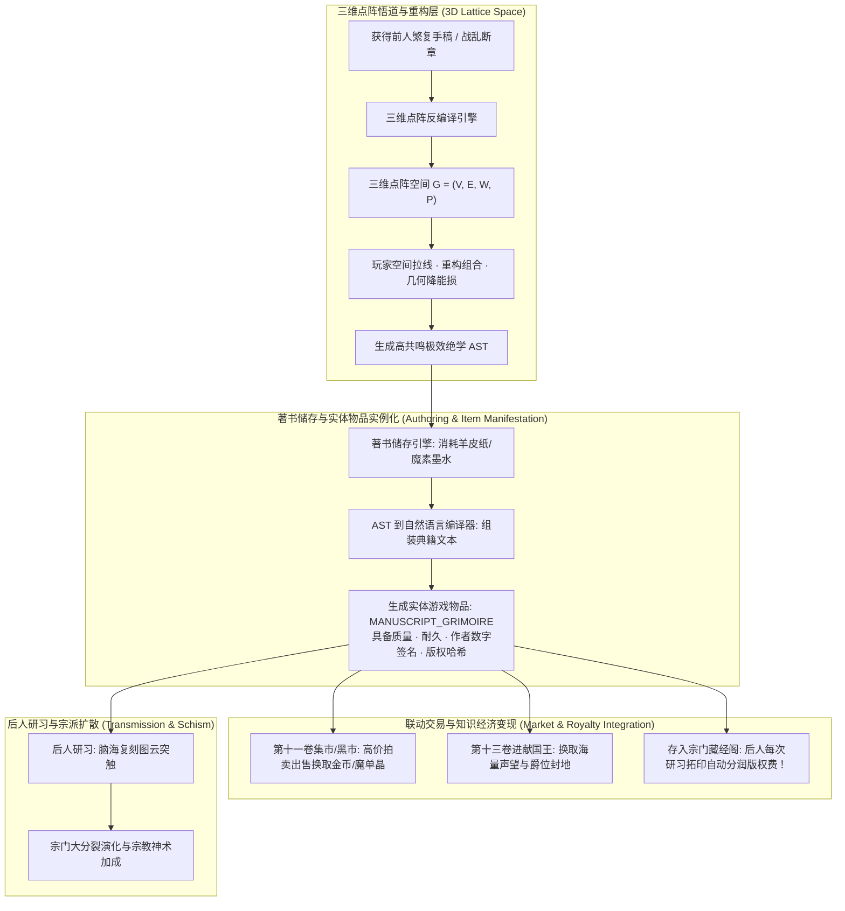
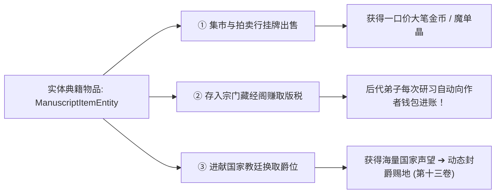

# 后端架构需求表4（第四卷：技能图云 AST 序列化、三维点阵反编译与著书储存系统）

> [!NOTE]
> **【全局架构声明】**：本篇及全套技术文档中所提及的所有具体宗教派系名称（如“天权教、命定教、星辉教”）、典籍教典名（如“《天典》、《神权》”）、具体手稿范例（如“《雷光破阵突·真解手稿》”），**均属基础演示示例（Illustrative Examples Only），绝非底层硬编码或静态写死结构**。底层引擎仅定义**通用 AST 拓扑序列化协议、三维点阵空间反编译求解器、著书储存与实体物品实例化管线、宗门谱系 DAG 演化状态机、以及知识产权交易分润契约**。

---

## 一、 系统概述与知识传承模型 (Knowledge Transmission Overview)

### 1.1 核心职责与工程目标
本卷基于《基本玩法需求设计稿二》与《基本玩法需求设计稿三》，定义底层引擎中的**技能树抽象语法树 (AST) 序列化引擎、基于三维点阵云图空间组合搭配的反编译优化求解器、著书储存系统与实体物品实例化管线、典籍手稿交易联动协议、宗门谱系大分裂演化模型、以及宗教信仰神术偏置状态机**。
* **三维点阵全域同构底座 (Universal 3D Point-Cloud Lattice)**：无论是物理动词连招、魔法咒术回路、还是典籍残卷，在底层**100% 同构为三维点阵云图空间中的节点与连线拓扑**；
* **著书立说 ➔ 实体物品 ➔ 交易变现闭环**：玩家或 NPC 宗师在点阵空间自创或优化法式后，可消耗材料将其**【著书立说】转化为真实的游戏内实体典籍物品（`ItemCategory: MANUSCRIPT_GRIMOIRE`）**，可在集市拍卖出售、赚取巨额货币，或存入藏经阁赚取持续版权分润！

### 1.2 知识图谱、著书变现与宗门传承整体架构


---

## 二、 技能子图 AST 语法树结构与拓扑编译引擎 (Skill Subgraph AST Engine)

### 2.1 技能子图抽象语法树 (AST) 与三维点阵空间映射
角色在三维点阵云图中所连结的几何拓扑，在底层与 AST 实体保持一一双向映射：

```typescript
// 1. 三维点阵节点实体
export type LatticeNodeType = 'PHYSICAL_VERB' | 'MAGIC_RUNE' | 'CONDITIONAL_GATE' | 'PARALLEL_MERGE';

export interface LatticeNodeEntity {
  nodeId: UUID;
  nodeType: LatticeNodeType;
  symbolName: string;            // 动词/符文符号 (如 "STAB", "PARRY", "RUNE_FLAME")
  spatialPosition: [number, number, number]; // 三维空间坐标 P(x, y, z)
  timeOffsetMs: number;          // 时序偏置量 (毫秒)
  apDelta: number;               // 行动点消耗或产生
  energyParams: {
    rawMomentum?: number;        // 物理动量
    manaEnthalpy?: number;       // 魔素焓值
    dissipationRate?: number;    // 能损率
  };
  connectedEdgeIds: UUID[];      // 关联的有向边 ID 集合
}

// 2. 完整三维点阵子图 AST 实体
export interface SkillSubgraphAST {
  astVersion: string;
  signatureHash: string;         // SHA-256 不可篡改拓扑哈希
  creatorIdentifier: UUID;       // 初代宗师数字签名
  lineageGeneration: number;     // 师承代数
  sentenceCount: number;         // 拓扑路径投影出的句子数目 (判定术式 <10 还是法式 >=10)
  spatialBoundingRadius: number; // 三维空间包围球半径
  rootNodeIds: UUID[];           // 起手根节点
  nodes: Record<UUID, LatticeNodeEntity>;
  edgeWeights: Record<string, number>; // 边权重映射 "NodeA->NodeB": 0.95
}
```

---

## 三、 基于三维点阵云图的空间组合反编译求解器 (3D Point-Cloud Decompilation)

### 3.1 三维点阵反编译与空间组合优化的第一性原理
大魔导士与武道宗师对绝学的改良，**完全基于三维点阵空间的重新组合搭配与几何路径优化**：
* **三维点阵反编译**：将前人留下的繁杂法式或断章，**逆向还原为三维点阵点云空间中的离散点与连线拓扑**；
* **三维空间组合搭配与重构**：玩家在三维点阵空间中自由拉线，走最近空间共鸣短弧，消除空间冗余回环；
* **热力学与能损收益**：拓扑路径越短，映射出的句子数自发减少，魔素热力学转化能损 $\eta_{\text{compile}}$ 大幅下降！

$$\Delta \eta_{\text{compile}} = -\kappa_{\text{geom}} \cdot \left( 1 - \frac{\text{LatticePathLength}_{\text{new}}}{\text{LatticePathLength}_{\text{old}}} \right) \cdot \prod_{e \in \text{NewEdges}} W(e)$$

---

## 四、 著书储存系统、实体物品实例化与交易变现联动 (Authoring, Storage & Market Integration)

### 4.1 著书立说与实体物品实例化管线 (Authoring Pipeline)
当玩家或 NPC 宗师创造出满意的三维点阵子图后，可启动【著书立说】流程：
1. **消耗材料**：空白羊皮纸/魔导皮卷 $\times 1$ + 秘银墨水/魔素提取液 $\times 1$；
2. **AST 编译渲染**：语义模板编译器自动将图节点翻译为富有文学质感的传世篇章；
3. **实例化为游戏物品**：在第一卷物品系统中创建 `ItemEntity`（`category: MANUSCRIPT_GRIMOIRE`）：

```typescript
export interface ManuscriptItemEntity extends ItemEntity {
  category: 'MANUSCRIPT_GRIMOIRE';
  authorCharacterId: UUID;       // 初代著书宗师 ID
  authorNameSnapshot: string;    // 著书时宗师大名
  manuscriptTitle: string;       // 典籍手稿名称 (如《雷光破阵突·真解手稿》)
  imprintedSkillAST: SkillSubgraphAST; // 承载的完整三维点阵 AST
  bookType: 'ORIGINAL_MASTER' | 'TRANSCRIBED_COPY' | 'ANCIENT_FRAGMENT'; // 始祖原典 / 拓印副本 / 战乱残卷
  intellectualProperty: {
    royaltyPercent: number;      // 藏经阁研习版权抽成比例 (默认 10%)
    totalCopiesMade: number;     // 已被拓印传抄总次数
    accumulatedRoyalties: number;// 累计赚取的版税总额 (金币/魔单晶)
  };
}
```

---

### 4.2 联动第十卷/第十一卷交易系统的多维变现渠道 (Monetization Channels)



1. **集市与黑市拍卖变现（第十一卷）**：
   - 估值引擎根据其**三维点阵稀缺度、句子精炼度、阶位与能损优化比**计算官方指导拍卖底价；
   - 绝世神功典籍可拍出数十万金币或数百颗魔单晶的惊天财富！
2. **宗门藏经阁版权长效分润（第十卷、第十二卷）**：
   - 作者将典籍原本留存于宗门藏经阁；
   - 宗门后世弟子每研习一次，系统自动从弟子钱包中扣除研习费，并将 **$10\%\sim 30\%$ 版权金实时划入作者的个人钱包 (`CharacterWalletEntity`)**；
3. **进献国家与圣殿（第十三卷）**：
   - 将镇国级法式手稿进献给帝国皇家图书馆，直接换取数万点国家声望，一跃晋升为王国男爵/伯爵！

---

## 五、 宗门谱系演化、大分裂与学术共同体模型 (Lineage & Schism Matrix)

### 5.1 守破离四层金字塔跨代演化法则
* **第一层（被动基础） $\rightarrow$ 第二层（主动基础）**：官方或启蒙导师手把手传授的基础指令集；
* **第三层（融合传承）**：直接研习实体典籍手稿，在脑海中复刻三维点阵突触连线；
* **第四层（自创法则）**：脱离前人窠臼，在三维点阵空间自创全新闭环子图；一旦著书立说，**该绝学在后世弟子手中自动降阶为第三层传承**！

### 5.2 宗门谱系与学术派系大分裂模型 (Sect Schism Dynamics)
* **派系自然分化**：宗门内部弟子研习秘籍时产生不同变异连线分支；
* **大分裂判定**：空间拓扑重合度低于 $40\%$ 时，系统自动触发**宗门自然分裂事件**，衍生出两个独立的二级学术门派！

---

## 六、 世界宗教信仰法则与神术偏置状态机 (Religious Dogma FSM)

### 6.1 宗教信仰偏置与机制矩阵 (基础配置示例)

| 宗教派系 (示例) | 核心教典 (示例) | 专属机制特质 (示例) | 物理与魔法偏置增益 | 负面代价 / 禁忌约束 |
| :--- | :--- | :--- | :--- | :--- |
| **天权系 · 保守派** | 《天典》 | **[神圣神谕 / 绝对招架]** | 神圣法术抗性 $+35\%$，反击打断几率 $+25\%$ | 科技/工程道具使用效率 $-50\%$ |
| **天权系 · 革新派** | 《天典》 | **[唯物工程 / 道具极效]** | 道具 AP 消耗减半，学习系数 $+30\%$ | 神圣神术能耗增加 $+20\%$ |
| **宿命系 (如命定)** | 《神权》 | **[命运锁定 / 宿命推条]** | 触发多次连击时强制敌方下回合 AP 为负值 | 违背教令直接触发天罚 (MSF 爆表) |
| **自由系 (如星辉)** | 《星辉》 | **[灵能流转 / 轻量连招]** | 施法有几率即时返还 AP，MSF 衰减快 | 单次爆发杀伤略低于重型大魔法 |

### 6.2 信仰系数 (FAITH) 对魔素转化的数学偏置方程
$$\eta_{\text{faith}} = \eta_{\text{base}} \times \left( 1 - 0.70 \cdot \frac{\text{DevotionScore}}{100} \cdot \text{FAITH} \right)$$

---

## 七、 接口定义与数据契约 (TypeScript Reference)

```typescript
export interface IManuscriptAuthoringService {
  // 著书立说：将三维点阵 AST 编译并实例化为实体典籍物品
  inscribeSkillIntoManuscript(
    authorId: UUID,
    ast: SkillSubgraphAST,
    title: string,
    materialItems: UUID[]
  ): ManuscriptItemEntity;

  // 宗门藏经阁：研习拓印手稿并结算版权费
  studyAndTranscribeManuscript(
    learnerId: UUID,
    manuscriptId: UUID
  ): { targetBrain: MemoryAggregate; royaltyPaid: number };
}
```
