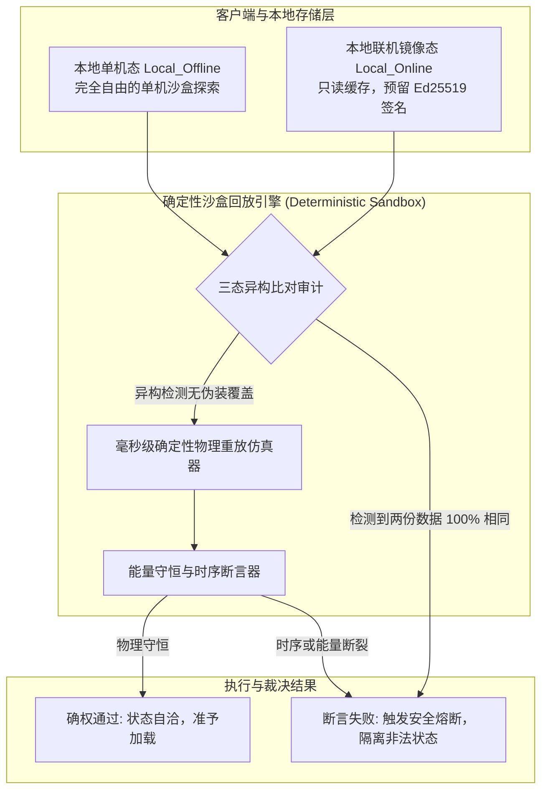

# 后端架构需求表5（第五卷：单机确定性回放校验器与三态状态机架构）

> [!NOTE]
> **【全局架构声明】**：本篇及全套技术文档中所提及的所有具体校验步长（如“$\Delta t = 20\text{ms}$”）、加密算法范例（如“Ed25519 / SHA-256”）、断言异常类型与状态结构，**均属基础工程实现示例（Illustrative Examples Only），绝非底层硬编码或静态写死结构**。底层引擎仅定义**基于因果律与能量守恒的确定性沙盒回放逻辑、单机态与联机镜像解耦防御机制、以及零流氓驱动的安全断言契约**。

---

## 一、 系统概述与安全哲学 (Security & Attestation Overview)

### 1.1 核心职责与工程目标
本卷定义后端系统的**轻量级沙盒确定性物理回放仿真器、本地单机态与网络状态解耦模型、状态连续性审计断言器、以及无流氓驱动的密码学防篡改校验体系**。
* **0 驱动开销**：不依赖任何 Ring 0 级别的流氓常驻内核驱动，不进行任何侵犯用户隐私的全局内存与硬盘扫描；
* **基于因果律与数学自洽的安全防御**：所有动作与数据状态必须严格满足离散时序因果链与能量守恒定律，任何非法突变在沙盒重放时均会在毫秒级被自动熔断。

### 1.2 校验架构与数据流向


---

## 二、 确定性沙盒回放仿真器实现 (Deterministic Headless Replay Simulator)

### 2.1 确定性离散步长与状态转移方程
沙盒回放引擎在无头（Headless）环境下运行，采用固定逻辑步长 $\Delta t = 20\text{ms}$（每秒 50 逻辑帧），从初始世界种子（Seed）与输入事件流确定性推进：

$$S_{t + \Delta t} = \mathcal{F}_{\text{engine}}\left(S_t, \; \vec{I}_t\right)$$

* $S_t$：$t$ 时刻的完全世界状态（包含所有实体的 AP、坐标、动量、魔素焓值、心核状态）；
* $\vec{I}_t$：$t$ 时刻所有输入指令快照（`DeterministicInputSnapshot`）；
* $\mathcal{F}_{\text{engine}}$：纯函数式、无外部副作用的物理与状态转移核心。

### 2.2 确定性回放验证核心接口
```typescript
export interface IDeterministicReplayEngine {
  /**
   * 在沙盒中重放一段动作日志流，验证其物理自洽性
   * @param initialSnapshot 初始状态快照
   * @param eventStream 输入事件流序列
   * @param expectedFinalHash 预期的最终状态哈希
   * @returns 验证审计报告
   */
  replayAndVerify(
    initialSnapshot: WorldStateSnapshot,
    eventStream: ActionEventStream,
    expectedFinalHash: string
  ): VerificationReport;
}
```

---

## 三、 状态连续性审计与守恒断言器 (State Continuity & Conservation Assertions)

### 3.1 能量与动量守恒断言 (Conservation Law Assertion)
在沙盒重放的每一个时间微步，断言器执行严格的物理守恒校验：
1. **动量冲量守恒断言**：

$$\left| \Delta \vec{P}_{\text{attacker}} + \Delta \vec{P}_{\text{defender}} - \vec{J}_{\text{external}} \right| < \epsilon$$

2. **魔素转化热力学守恒断言**：

$$E_{\text{spell\_output}} \le E_{\text{mana\_consumed}} \times (1 - \eta_{\text{compile\_min}}) \times (1 - \eta_{\text{spatial\_min}})$$

* **判定规则**：若任何单帧释放的魔法能量超过了所消耗魔素在理论最低能损下的最大产出，断言器立即抛出 `ThermodynamicViolationException`。

### 3.2 动作前摇与时序单调性断言 (Action Timing Monotonicity)
* 每个物理动词与魔素法式均有不可压缩的最小前摇帧数 $N_{\text{windup}}$；
* 若输入流中某动作的生效时间与前一动作间隔小于 $N_{\text{windup}}$，系统直接判定为“非法抽帧/瞬发篡改”，当场拒绝该动作。

---

## 四、 本地单机态与网络状态解耦模型 (Dual/Tri-State Decoupling)

### 4.1 本地单机态 (Local_Offline) 规格
* **定位**：单机模式下角色的绝对自由探索沙盒；
* **存储特性**：纯本地读写，支持玩家在本地完全自主推导图云、体验剧情与单机调试；
* **边界约束**：单机数据不会自动静默污染预留的联机镜像。

### 4.2 本地联机镜像态 (Local_Online) 预留规格
* **定位**：由权威状态同步下发并缓存在本地的镜像数据；
* **签名防伪装机制**：数据尾部附带不可伪造的非对称加密公私钥证书（如 Ed25519 签名）；
* **防伪装覆盖互斥陷阱**：
  - 在启动与加载阶段，系统比对 `Local_Offline` 与 `Local_Online` 的拓扑哈希；
  - **若检测到单机存档与联机镜像完全一致**，系统判定存在“以单机存档直接覆盖联机缓存”的非法伪装行为，自动熔断联机加载通道。

---

## 五、 数据结构与校验契约 (TypeScript Reference)

```typescript
export interface VerificationReport {
  isConsistent: boolean;
  totalTicksSimulated: number;
  anomalyDetected?: {
    tick: number;
    anomalyType: 'ENERGY_VIOLATION' | 'TIMING_DISCONTINUITY' | 'MOMENTUM_MISMATCH' | 'SIGNATURE_INVALID';
    debugMessage: string;
  };
}

export interface IStateAssertionService {
  assertPhysicalInvariants(before: EntityState, after: EntityState, action: ActionCard): boolean;
  assertMemoryIntegrity(characterBrain: MemoryAggregate): boolean;
}
```
