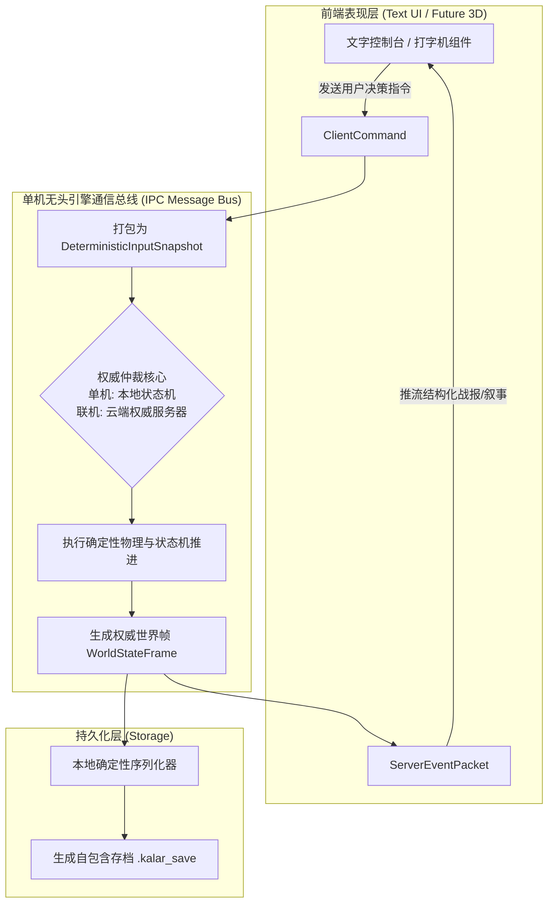
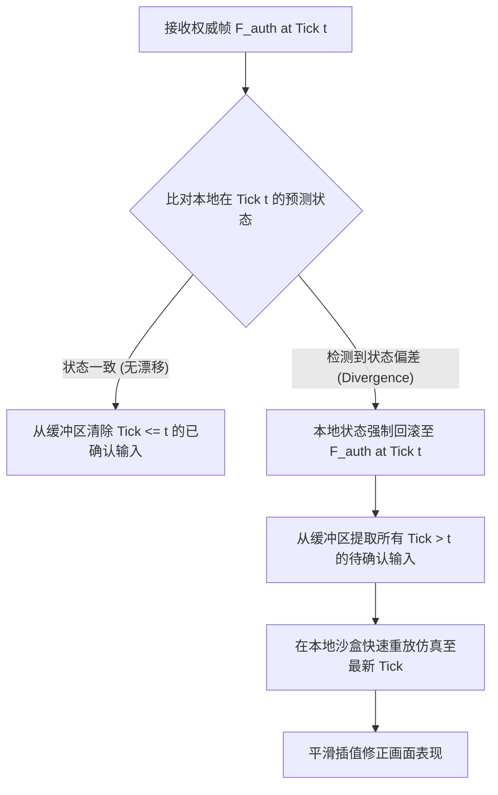

# 后端架构需求表6（第六卷：本地持久化、网络同步协议与服务器权威仲裁实现）

> [!NOTE]
> **【全局架构声明】**：本篇及全套技术文档中所提及的所有具体存档字段示例（如 `.kalar_save` JSON 结构）、前后端 IPC 命令名（如 `PLAY_ACTION_CARD`）、状态调和参数与代码实现，**均属基础工程实现示例（Illustrative Examples Only），绝非底层硬编码或静态写死结构**。底层引擎仅定义**自包含原子持久化协议、输入快照与事件推送契约、以及单机/云端权威仲裁无缝热切换的通用接口抽象**。

---

## 一、 系统概述与架构定位 (Persistence & Synchronization Overview)

### 1.1 核心职责与工程目标
本卷定义后端系统的数据持久化、本地前后端通信总线、以及网络同步层规范：
* **单机本地持久化规范**：纯文本、自包含且不可篡改的本地存档格式（`.kalar_save`）；
* **本地前后端通信契约 (Local IPC / MessagePort Protocol)**：定义文字版单机前端与无头引擎之间的命令-事件双向总线；
* **网络同步协议预留**：基于定点数帧同步的客户端输入快照协议与状态预测调和算法；
* **服务器权威仲裁接口**：定义单机本地权威与未来云端分布式权威无缝切换的标准契约。

### 1.2 数据流向与权威仲裁整体架构


---

## 二、 本地自洽存档文件规范 (Local Save File Specification: `.kalar_save`)

### 2.1 文件二进制与文本结构规范 (基础格式示例)
单机存档采用自包含的 JSON/Protocol Buffers 混合结构，根节点包含元数据头、完整实体状态树与校验摘要：

```json
{
  "header": {
    "magic": "KALAR_SAVE_V1",
    "engineVersion": "1.0.0",
    "timestamp": 1788163200,
    "worldSeed": 4294967291,
    "playTimeSeconds": 86400
  },
  "characterAggregate": {
    "characterId": "d8b3c9f2-...",
    "race": "HUMAN_NEW",
    "normalizedAge": 28.4,
    "attributes": { "str": 14, "con": 12, "int": 18, "agi": 16, "spr": 15, "vit": 100 },
    "physiologicalMetrics": { "heartCoreIntegrity": 1.0, "somaticFunction": 85.2, "mentalStressFactor": 12.0 },
    "wearableInventory": { "equippedSlots": {}, "totalCapacity": 12, "items": [] }
  },
  "skillGraphCloud": {
    "nodes": {},
    "edgeWeights": {},
    "memoryTraceIntegrity": 0.98
  },
  "worldProgress": {
    "currentRealm": "WEN_ZHOU",
    "visitedNodes": [],
    "reputationMap": {}
  },
  "integrityDigest": {
    "astTopologicalHash": "e3b0c44298fc1c149afbf4c8996fb92427ae41e4649b934ca495991b7852b855",
    "fullStateSha256": "8f434346648f6b96df89dda901c5176b10a6d83961dd3c1ac88b59b2dc327aa4"
  }
}
```

### 2.2 存储原子性与防断电损坏 (Crash-Resilient Atomic Write)
持久化过程必须采用**原子重命名机制 (Atomic Write-and-Rename)**：
1. 将当前状态序列化写入临时文件 `.kalar_save.tmp`；
2. 计算并写入 SHA-256 完整性摘要；
3. 执行操作系统级原子替换：`MoveFileEx(tmp, target, MOVEFILE_REPLACE_EXISTING)`；
4. 保证在任何突发断电或崩溃情况下，原存档文件 100% 完好无损。

---

## 三、 本地前后端 IPC 消息协议规范 (Local IPC Protocol - 基础示例)

### 3.1 前端输入命令包 (ClientCommand - 示例结构)
单机前端通过 WebWorker `postMessage` 或 Electron IPC 向无头引擎发送指令：

```typescript
export type ClientCommand =
  | { type: 'PLAY_ACTION_CARD'; payload: { cardId: string; targetEntityId: UUID } }
  | { type: 'MULLIGAN_REDRAW'; payload: {} }
  | { type: 'SUBMIT_NARRATIVE_CHOICE'; payload: { choiceIndex: number } }
  | { type: 'START_WORLD_TRAVEL'; payload: { targetNodeId: UUID } };
```

### 3.2 后端事件推送包 (ServerEventPacket - 示例结构)
无头引擎向前端推流纯文本与结构化数据：

```typescript
export type ServerEventPacket =
  | { type: 'COMBAT_TEXT_STREAM'; payload: { narrativeText: string; apUpdate: Record<string, number>; isInterrupt: boolean } }
  | { type: 'NARRATIVE_INSERTION'; payload: { dialogTitle: string; contentLines: string[]; choices: string[] } }
  | { type: 'WORLD_STATE_SYNC'; payload: { currentTick: number; characterSheet: CharacterAttributeSheet } };
```

---

## 四、 客户端确定性输入快照协议 (Deterministic Input Snapshot Protocol)

### 4.1 输入快照数据结构定义
输入流严格以固定逻辑帧（Tick，$\Delta t = 20\text{ms}$）为单位进行采样与封装：

```typescript
export interface DeterministicInputSnapshot {
  tick: number;                     // 逻辑时间步索引
  entityId: UUID;                   // 操作实体唯一标识
  movementVector: [number, number]; // 移动归一化向量 (定点数 [x, y])
  activePhysicalVerb?: PhysicalVerbEnum; // 当前发起的物理动词 (如 STAB, PARRY)
  spellRuneInputs?: number[];       // 正在编译的魔素符文序号流
  interactTargetId?: UUID;          // 目标交互实体 ID
  mulliganTriggered?: boolean;      // 是否触发战术重掷
  clientTimestampMs: number;        // 客户端本地时间戳
}
```

---

## 五、 状态预测调和算法 (Client Prediction & Reconciliation)

### 5.1 本地预测与影子状态机
* **即时响应性**：单机与客户端在发出指令后，立即在本地驱动**影子状态机 (Shadow FSM)** 进行即时动作与粒子渲染，实现 0 延迟手感；
* **待确认队列 (Pending Input Buffer)**：发出的输入快照同步压入本地待确认队列。

### 5.2 权威帧回滚与快照调和 (Reconciliation Algorithm)
当接收到权威状态帧 $F_{\text{auth}}(t)$ 时，执行以下调和流程：



---

## 六、 服务器权威仲裁与接口抽象 (Server-Authoritative Interface)

### 6.1 统一权威仲裁接口契约
系统通过依赖注入模式，实现单机本地仲裁器与远程网络仲裁器的零成本切换：

```typescript
export interface IAuthoritativeArbiter {
  dispatchInput(snapshot: DeterministicInputSnapshot): void;
  tickWorld(currentTick: number): WorldStateFrame;
  getCurrentAuthoritativeFrame(): WorldStateFrame;
}

// 1. 单机本地仲裁器实现 (当前 MVP)
export class StandaloneLocalArbiter implements IAuthoritativeArbiter {
  private localEngine: HeadlessPhysicsEngine;

  public dispatchInput(snapshot: DeterministicInputSnapshot): void {
    this.localEngine.enqueueInput(snapshot);
  }

  public tickWorld(currentTick: number): WorldStateFrame {
    return this.localEngine.step(currentTick);
  }

  public getCurrentAuthoritativeFrame(): WorldStateFrame {
    return this.localEngine.getLatestFrame();
  }
}

// 2. 预留远程网络仲裁器实现 (未来联机)
export class RemoteNetworkArbiter implements IAuthoritativeArbiter {
  private networkSocket: INetworkClient;
  private pendingBuffer: DeterministicInputSnapshot[] = [];

  public dispatchInput(snapshot: DeterministicInputSnapshot): void {
    this.pendingBuffer.push(snapshot);
    this.networkSocket.sendSnapshotPacket(snapshot);
  }

  public tickWorld(currentTick: number): WorldStateFrame {
    return this.networkSocket.receiveLatestAuthoritativeFrame();
  }

  public getCurrentAuthoritativeFrame(): WorldStateFrame {
    return this.networkSocket.getLatestFrame();
  }
}
```
