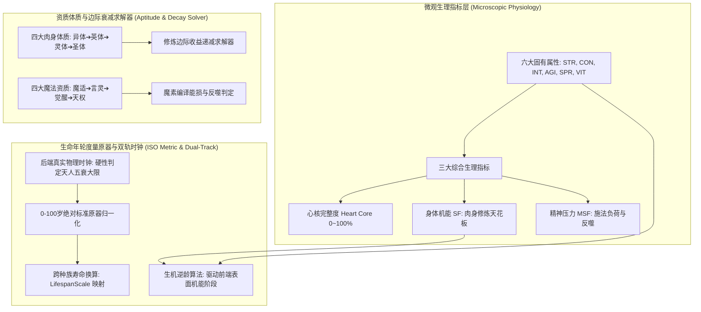

# 后端架构需求表7（第七卷：生命体质、生理机能衰退与生命周期演化求解器）

> [!NOTE]
> **【全局架构声明】**：本篇及全套技术文档中所提及的所有具体属性数值、种族寿命放大倍率、体质位阶名称与成长系数参数，**均属基础演示示例（Illustrative Examples Only），绝非底层硬编码或静态写死结构**。底层引擎仅定义**六大属性与三大生理指标状态机、0~100岁绝对标准度量原器映射算法、肉身修炼边际衰减方程、以及双轨解耦真实时钟 vs 表象逆龄演化求解器**。

---

## 一、 系统概述与生命第一性原理 (Biological Progression Overview)

### 1.1 核心职责与工程目标
本卷基于《基本玩法需求设计稿二》与《基本玩法需求设计稿四》，定义底层引擎中的**生命体质微观指标、四大肉身体质与魔法资质概率分布、0~100岁绝对标准度量原器、跨种族寿命等效换算引擎、以及真实时钟 vs 表象机能双轨逆龄状态机**。
* **生物年轮客观性**：模拟自然生命的生理代谢机能与真实寿元大限，拒绝数值无限膨胀；
* **表现层与真实时钟双轨解耦**：后端物理寿元时钟单向硬性流逝，前端表象机能随修炼境界可实现动态逆龄演化。

### 1.2 生命演化与体质状态机整体架构


---

## 二、 六大固有属性与三大综合生理指标微观计算 (Attributes & Physiological Metrics)

### 2.1 六大固有属性定义 (Base Attributes)
每个自然生命体在底层均由六大基石属性共同定义：

| 属性标识 | 英文全称 | 核心力学与底层职能 |
| :--- | :--- | :--- |
| **力 (力量)** | `Strength (STR)` | 决定物理挥击末端动能、武器挥重上限与力量对抗判定 |
| **体 (体质)** | `Constitution (CON)` | 决定肉体物理减伤基准、材料硬度抗力、抗毒与抗衰退底子 |
| **智 (智魔力)** | `Intelligence (INT)` | 决定咒词语法编译效率、逻辑化简速率与魔法能量通量 |
| **敏 (敏捷)** | `Agility (AGI)` | 决定微观时间步先手优先级、身法柔韧度与闪避偏角判定 |
| **精 (精神力)** | `Spirit (SPR)` | 决定灵魂意识干涉现实强度、施法稳定性与抗魔素反噬坚韧度 |
| **生 (生命潜能)** | `Vitality (VIT)` | 决定自然寿元大限储备、血气再生速率与心核承载力 |

> **统一六维属性底座（2026-08 重构）**：六项属性统一为 **1~6 级**等级制，人类为统一底层度量基准（十进制划分：STR 6 级=600 / AGI 6 级=60 / INT 6 级=6000 / SPR 6 级=600 / CON 6 级=60 / VIT 6 级=6000）。**属性等级/属性点仅代表统一等级，不直接等同于底层实际数值**——底层实际能力值一律经 `AttributeConversionEngine`（`config/domains/attribute.json`：人类基准/种族系数数组/属性系数数组/分段非线性成长曲线/死区）统一换算与规则校验，属性提升不可简单增加显示点数。三层模型：L1 等级层（1~6 级 + 区间内连续值）→ L2 中间系数结构层（种族×天赋×阅历重塑系数，洗点作用域）→ L3 底层实际值域（随机动态加点直加/直减，永久不逆转）。底层系数/换算规则变化时，即使显示等级不变，实际能力数值亦可联动变化。

---

### 2.2 三大综合生理指标状态机 (Composite Physiological Metrics)

#### 1. 心核完整度 (Heart Core Integrity, $H_{\text{core}} \in [0.0, 1.0]$)
* **本质**：自然人出生即拥有的生命动力核心，承载全身气血与魔素循环；
* **致命弱点与暴毙判定**：
  - 当受击动能穿透护甲并直接命中心脏/核心部位时，扣减 $H_{\text{core}}$；
  - 若 $H_{\text{core}} \le 0.20$，角色全属性断崖式暴跌 $80\%$；若 $H_{\text{core}} = 0$，状态机直接判定**致命暴毙 (Instant Death)**。

#### 2. 身体机能 (Somatic Function, $\text{SF} \in [0, 100]$)
* **计算方程**：由六大属性加权映射派生：

$$\text{SF} = \text{Clamp}\left( w_1 \cdot \text{STR} + w_2 \cdot \text{CON} + w_3 \cdot \text{AGI} + w_4 \cdot \text{VIT}, \; 0, \; 100 \right)$$

* **核心铁律**：**任何生命体修炼肉身境界的绝对上限，严格由自身的身体机能 $\text{SF}$ 决定！**

#### 3. 精神压力 (Mental Stress Factor, $\text{MSF} \in [0, 100]$)
* **累积与反噬模型**：高频施法、受创流血、饥饿断粮或遭遇精神震慑时累积：

$$\text{BackfireRate} = \max\left(0, \; \frac{\text{MSF} - \text{Threshold}_{\text{safe}}}{100 - \text{Threshold}_{\text{safe}}}\right)$$

* **反噬后果**：当 $\text{MSF} > 80$ 时，施法极易触发魔素回路过载，导致施法当场中断且自身承受能量反噬。

---

## 三、 四大肉身体质与四大魔法资质天梯 (Physical Tiers & Magical Aptitudes)

### 3.1 四大肉身体质与修炼边际衰减律 (Marginal Decay Law)
* **肉身体质四大级别 (示例)**：
  1. **异体 (Esoteric Body)**：凡人异化初阶；
  2. **英体 (Heroic Body)**：千锤百炼英雄之躯；
  3. **灵体 (Spiritual Body)**：通体通透，神圣级肉身；
  4. **圣体 (Sacred Body)**：肉身成圣，打破寿命与物理极限之躯。
* **边际衰减方程**：

$$\frac{d(\text{SF})}{dt} = \frac{\mu_{\text{train}} \cdot \text{Effort}}{1 + \kappa_{\text{decay}} \cdot (\text{BodyTier})^2}$$

* **物理瓶颈**：当达到神圣级（灵体）时，常规锻炼收益趋近于 0，必须通过洗髓伐毛、天地灵药或打破自然大限等非凡契机方可精进。

---

### 3.2 四大魔法资质概率分布与编译特质
> **魔法资质是生命体灵魂与生俱来的“意识干涉现实分辨率”**。

| 魔法资质分类 | 理论稀缺概率 (示例) | 魔素编译能损加成 | 特殊法术权限与反噬豁免 |
| :--- | :--- | :--- | :--- |
| **魔适者 (Mana-Adapted)** | $1 / 100$ (百分之一) | 基准能损 ($25\% \sim 50\%$) | 能够感应并驱动基础术式魔法 |
| **言灵者 (Word-Bound)** | $1 / 10,000$ (万分之一) | 能损降低 $-30\%$ | 天生精简咒词，大幅削减编译时间 |
| **觉醒者 (Awakened)** | $1 / 1,000,000$ (百万分之一) | 能损降低 $-60\%$ | 灵魂极其坚韧，可越阶驱动高阶法式 |
| **天权者 (Heaven-Ordained)**| $1 / 10,000,000+$ (千万无一)| **直驱始源能损仅 $1\% \sim 5\%$**| **神性宿命体**：无需繁琐咒词，直接共鸣天地始源法则！ |

---

## 四、 0-100岁绝对标准原器与跨种族寿命等效换算 (Age Equivalence Engine)

### 4.1 ISO 绝对标准度量原器生命阶段 (0 ~ 100 岁)
系统以**人类种族 0 ~ 100 岁**作为全宇宙统一度量原器基准，状态机 0 冗余维护 9 大生理阶段：

```
【后端绝对标准原器 9 大生命阶段】
01. 婴儿期: 00 ~ 10 岁  (生机初萌，依赖本能)
02. 幼儿期: 10 ~ 14 岁  (语言与协调能力养成)
03. 童年期: 15 ~ 18 岁  (学习机能巅峰，手艺启蒙)
04. 少年期: 19 ~ 22 岁  (身手敏捷，游历师承)
05. 青年期: 23 ~ 30 岁  (体质精力巅峰，战力爆发)
06. 成年期: 31 ~ 50 岁  (心智沉稳，宗师境界构筑)
07. 中年期: 51 ~ 70 岁  (肉体微衰，经验理智顶峰)
08. 老年期: 71 ~ 90 岁  (气血衰退，意志神性极高)
09. 大限期: 91 ~ 100 岁 (天人五衰，自然寿命终点，超越即死亡)
```

---

### 4.2 跨种族寿命等效双向换算算法 (Age Equivalence Engine)

#### 1. 双向等效映射方程
* **归一化等效年龄（Normalized Age, $T_{\text{norm}}$ - 后端查表判定标准原器）**：

$$T_{\text{norm}} = \text{Clamp}\left(\text{Round}\left(\frac{T_{\text{raw}}}{\text{LifespanScale}}, \; 1\right), \; 0, \; 100\right)$$

* **实际物理寿命（Raw Biological Age, $T_{\text{raw}}$ - 前端面板展示存活年限）**：

$$T_{\text{raw}} = \lfloor T_{\text{norm}} \times \text{LifespanScale} \rfloor$$

* **换算范例 (演示示例)**：
  - 精灵寿命倍率 $\text{LifespanScale} = 10.0$：活了 $234$ 年的精灵，其等效年龄 $T_{\text{norm}} = 23.4$ 岁，后端精准判定为【05. 青年期】；
  - 兽族寿命倍率 $\text{LifespanScale} = 0.8$：活了 $40$ 年的兽族，其等效年龄 $T_{\text{norm}} = 50.0$ 岁，进入【07. 中年期】。

---

## 五、 双轨解耦时钟与生机逆龄演化法则 (Dual-Track Clock & Rejuvenation)

### 5.1 真实物理时钟 vs 表象机能阶段 (Dual-Track Reality)
* **后端真实物理时钟 (True Chronological Clock)**：
  - 客观物理时间流逝，负责硬性判定天人五衰、自然寿元大限、特定转职门槛与历史纪元事件；
* **前端表面成长阶段 (Apparent Biological Stage)**：
  - 结合【基础年龄 + 综合属性（体质/修为/气血/SF）】加权反向归一化计算。

### 5.2 生机逆龄法则 (Rejuvenation Mechanics)
当一个客观年龄 60 岁的老者，通过刻苦修行将肉身突破至【英体/灵体】，且身体机能 $\text{SF}$ 提升至 90 以上时：
* **表象逆转**：其前端面板表象机能**由【中年】逆转为【青年/成年】**（精力充沛、神采奕奕）；
* **寿元铁律**：其后端物理真实寿元时钟依然严密流转，大限到来时若未打破天道桎梏依然会遭遇天人五衰。

### 5.3 多维机能系数矩阵 (Growth Factor Matrix - 示例)
```typescript
export enum GrowthFactorType {
  LEARNING = 'LEARNING',       // 学习系数 (影响秘籍阅读、魔法学习转化率)
  PHYSIQUE = 'PHYSIQUE',       // 体质系数 (影响力量敏捷成长、抗毒抗衰退)
  CHARISMA = 'CHARISMA',       // 魅力系数 (影响交际、说服、阵营共鸣)
  SANITY = 'SANITY',           // 理智系数 (影响魔法严谨度、防反噬坚韧度)
  MORALE = 'MORALE',           // 士气系数 (影响意志力、暴击率与防溃逃)
  LUCK = 'LUCK',               // 幸运系数 (影响暴击概率与奇遇事件掷骰)
  BLOODLINE = 'BLOODLINE',     // 血脉系数 (影响异族特有异能亲和度)
  FAITH = 'FAITH'              // 信仰系数 (影响神性与教派神术增幅)
}
```

---

## 六、 数据结构与体质接口定义 (TypeScript Reference)

```typescript
// 1. 角色六大固有属性与三大生理指标实体
export interface CharacterPhysiologySheet {
  // 六大固有属性
  str: number; // 力量
  con: number; // 体质
  int: number; // 智魔力
  agi: number; // 敏捷
  spr: number; // 精神力
  vit: number; // 生命潜能 (寿元储备)

  // 三大综合生理指标
  heartCoreIntegrity: number; // 心核完整度 (0.0 ~ 1.0)
  somaticFunction: number;    // 身体机能 SF (0 ~ 100)
  mentalStressFactor: number; // 精神压力 MSF (0 ~ 100)

  // 资质与体质境界
  bodyTier: 'ESOTERIC_BODY' | 'HEROIC_BODY' | 'SPIRITUAL_BODY' | 'SACRED_BODY';
  magicAptitude: 'NONE' | 'MANA_ADAPTED' | 'WORD_BOUND' | 'AWAKENED' | 'HEAVEN_ORDAINED';
}

// 2. 生命与寿命演化服务契约
export interface IBiologicalProgressionService {
  // 步进客观物理时间，结算年轮代谢与自然大限
  stepBiologicalClock(character: CharacterPhysiologySheet, deltaHours: number): BiologicalTickResult;
  // 评估生机逆龄表象机能阶段
  calculateApparentStage(character: CharacterPhysiologySheet, rawAge: number, lifespanScale: number): BiologicalStageEnum;
  // 结算施法产生的精神压力 MSF 与反噬判定
  accumulateMentalStress(character: CharacterPhysiologySheet, manaEnthalpy: number): StressResult;
}
```
