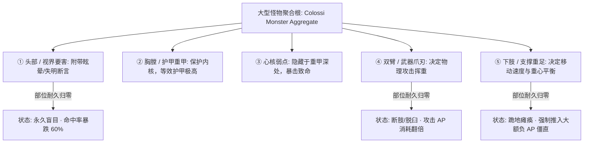
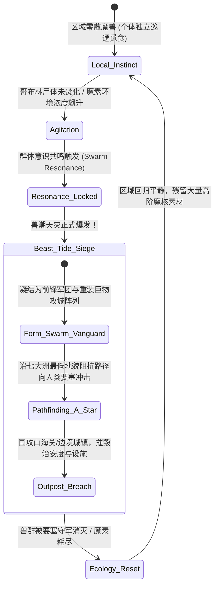

# 后端架构需求表8（第八卷：怪物生态、异兽摄取演化与群体兽潮调度求解器）

> [!NOTE]
> **【全局架构声明】**：本篇及全套技术文档中所提及的所有具体怪物名称（如“哥布林、魔狼、类人巨物、真龙”）、部位破坏参数、生态常数与掉落素材数值，**均属基础演示示例（Illustrative Examples Only），绝非底层硬编码或静态写死结构**。底层引擎仅定义**怪物微观生理与玩家同构模型、多部位破坏力学求解器、吞噬图云同化算法、群体意识共鸣兽潮状态机、以及基于正负 AP 的动态出招 AI 接口契约**。

---

## 一、 系统概述与怪物第一性原理 (Monster & Fiend Ecosystem Overview)

### 1.1 核心职责与设计哲学
本卷基于《基本玩法需求设计稿四》、《设计稿五》与《设计稿六》，定义底层引擎中的**怪物微观生理同构模型、类人巨物多部位破坏力学、异兽吞噬摄取自发进化求解器、群体共鸣兽潮调度状态机、以及基于正负 AP 动态势能轴的怪物决策 AI**。
* **生物/物理层绝对同构 (Universal Entity Isomorphism)**：怪物在底层**不是一串死板的数值包**，而是与玩家 100% 同构的生命实体——拥有六大属性、三大生理指标（心核/SF/MSF）、三维点阵技能图云，并遵循完全一致的物理动量与热力学能损法则；
* **生态循环与天灾自发涌现**：怪物作为世界魔素循环的分解转化者，种群过载时通过数学状态机自发涌现为世界级兽潮天灾。

### 1.2 怪物生态与战斗决策整体架构

```mermaid
graph TD
    subgraph "微观实体与部位力学层 (Microscopic Entity & Parts)"
        ATTR[同构六大属性: STR, CON, INT, AGI, SPR, VIT] --> COMPOSITE[三大综合生理指标: 心核, SF, MSF]
        COMPOSITE --> PARTS[多部位独立碰撞体: 头部 · 躯干 · 四肢 · 核心心脏]
        PARTS --> BREAK[部位破坏状态机: 断肢 · 破甲 · 盲目 ➔ AP惩罚]
    end

    subgraph "吞噬同化与进化演化层 (Ingestion & Evolution Engine)"
        EAT[吞噬外部猎物 / 吸收环境魔素] --> ASSIMILATE[三维图云同化: 抽取并融合猎物动词与符文]
        ASSIMILATE --> OVERLOAD_CHK{魔素过载断言: E > H_core_max?}
        OVERLOAD_CHK -->|未超载| MORPH[异兽形态蜕变与境界跃迁]
        OVERLOAD_CHK -->|超载| BURST[魔素回路爆裂: 实体当场爆体消亡]
    end

    subgraph "群体共鸣与天灾调度层 (Swarm Resonance & World Crisis)"
        DENSITY[区域种群过载 / 哥布林尸变未焚化] --> RESONANCE[群体意识共鸣算法]
        RESONANCE --> BEAST_TIDE[世界级兽潮爆发: 沿大地图阻抗向要塞攻城]
    end

    subgraph "实战决策与动态发卡 AI (Dynamic Combat AI)"
        MSF_AI[狂暴度 MSF + 战场态势] --> DRAW_AI[三维图云推演行动卡池]
        DRAW_AI --> AP_FSM[正负 AP 势能博弈: 见招拆招 · 招架 · 扑咬]
    end
```


---

## 二、 怪物微观生理与类人巨物多部位破坏力学 (Entity Physiology & Part Mechanics)

### 2.1 怪物微观生理与玩家 100% 同构模型
怪物在底层拥有完整的生命档案与微观生理指标：
* **心核完整度 ($H_{\text{core}} \in [0.0, 1.0]$)**：怪物体内的魔核/动力心脏，一旦被物理穿刺击碎，同样触发暴毙；
* **身体机能 ($\text{SF} \in [0, 100]$)**：决定怪物撕咬挥爪的动能上限；
* **精神狂暴度 ($\text{MSF} \in [0, 100]$)**：怪物受创后 MSF 上升，进入狂暴状态（攻击动能提升，但防守招架判定率骤降）。

---

### 2.2 类人巨物与大型怪物的多部位独立破坏力学 (Part Break & Disablement)
大型怪物与类人巨物具备多组独立挂载的部位碰撞体（Part Colliders）：



#### 1. 部位伤害传导与破坏方程
$$\text{Damage}_{\text{part}} = \max\left(0, \; \frac{E_{\text{kinetic}} \cdot K_{\text{edge}}}{S_{\text{cross}}} - \text{Armor}_{\text{part}}\right)$$

* 当单一部位耐久 $\text{Durability}_{\text{part}} \le 0$ 时，触发**部位破坏事件 (Part Severed/Broken)**；
* 部位破坏产生的溢出伤害按传导系数 $\kappa_{\text{transfer}} = 0.50$ 计入主体总生命。

---

## 三、 异兽吞噬进化与三维图云同化求解器 (Ingestion Evolution & Morphing Engine)

### 3.1 吞噬摄取与三维图云基因同化
魔兽种具备强大的自养与异养分解吞噬机能：
* **图云突触同化**：当魔兽击杀并吞噬特定猎物（如击杀一名精通火系法式的魔导士）时，同化求解器提取猎物 AST 中的核心符文节点，**直接插入并缝合至该魔兽自身的三维技能点阵云图中**；
* **形态自发展开**：魔兽自发掌握猎物的招式（例如普通魔狼吞噬火蜥蜴后，自发展开出《烈焰撕咬》混合技能）。

### 3.2 魔素过载爆体临界方程 (Mana Overload Threshold)
魔兽虽然能摄取能量，但其心核存在客观热力学承载极限：

$$E_{\text{absorbed}} = E_{\text{current}} + \Delta E_{\text{ingest}}$$

$$\text{Assert}\left( E_{\text{absorbed}} \le H_{\text{core\_capacity}} \cdot \text{CON}_{\text{monster}} \right)$$

* **爆体消亡判定**：若魔兽贪婪吞噬了超越自身体质上限的极高纯度魔单晶，内部魔素回路瞬间烧穿，状态机立即判定为**“魔素过载爆体 (Overload Catastrophic Rupture)”**，当场湮灭并向四周空间喷发高能冲击波。

---

## 四、 群体意识共鸣与世界级兽潮天灾调度状态机 (Swarm Resonance & Beast Tide Engine)

### 4.1 群体意识自发凝聚模型 (Swarm Consciousness Emergence)
在特定大地图区域内，单个怪物的行为由局部本能驱动；当区域怪物密度 $\mathcal{D}_{\text{region}}$ 与魔素畸变浓度 $\rho_{\text{mana}}$ 联合突破临界阈值时，引擎自发激活**集群无头群体智能 (Headless Swarm Intelligence)**：



### 4.2 哥布林尸变二次污染连锁引信 (Corpse Cascade Trigger)
* 哥布林具备一胎九子的超常繁殖力；
* 死亡挂载的 `CorpseEntity` 在 $24\text{h}$ 窗口内未被火焰动词净化时，自发腐烂并释放【狂暴诱引荷尔蒙】，直接使方圆 $50\text{km}$ 内的所有魔兽群体共鸣进度**瞬时跳增 $+30\%$**，作为引爆兽潮的恶性连锁引信。

---

## 五、 怪物战斗决策状态机与动态发卡 AI (Dynamic Combat AI & Action Hand)

### 5.1 怪物动态发卡池与神经应激机制
怪物在与玩家交战时，完全摒弃传统写死的固定攻击轮询，而是**与玩家同构运行“工作记忆应激发卡”机制**：
* 怪物根据自身的狂暴度 MSF、当前剩余 AP、以及玩家刚刚打出的物理动词（如玩家正处于破防负 AP 态）；
* 动态从自身三维图云中推演并抽取 $3 \sim 4$ 张行动卡；
* **决策树判定优先级**：
  1. **若自身处于负 AP 僵直** ➔ 挂载被动硬抗/招架；
  2. **若检测到玩家处于硬直负 AP** ➔ 调度最高动量的致命撕咬/重劈动词进行绝杀压制；
  3. **若自身濒死且 MSF 爆表** ➔ 触发狂暴拼死一搏或逃窜判定。

---

## 六、 数据结构与怪物领域服务接口契约 (TypeScript Reference)

```typescript
// 1. 怪物部位实体
export interface MonsterPartEntity {
  partId: UUID;
  partName: string;               // 头部 / 胸膛 / 左前爪 / 支撑下肢 / 尾槌
  partType: 'HEAD' | 'TORSO' | 'LIMB_ARM' | 'LIMB_LEG' | 'VITAL_CORE';
  currentDurability: number;
  maxDurability: number;
  armorAbsorption: number;
  isSeveredOrBroken: boolean;     // 是否已被破坏/断肢
  disablementPenalty: {
    apCostMultiplier: number;     // 攻击 AP 惩罚
    accuracyPenalty: number;      // 命中率衰减
    forceStunTicks?: number;      // 触发瘫痪僵直时间步
  };
}

// 2. 怪物聚合根实体 (与玩家 100% 同构)
export interface MonsterAggregateEntity {
  monsterId: UUID;
  speciesTemplateId: string;
  classification: 'DEMONIC_FIEND' | 'MAGICAL_BEAST' | 'GOBLIN_MUTANT' | 'HUMANOID_COLOSSI';

  // 同构生理指标
  physiology: {
    attributes: { str: number; con: number; int: number; agi: number; spr: number; vit: number };
    heartCoreIntegrity: number;   // 心核完整度 (0.0 ~ 1.0)
    somaticFunction: number;      // 身体机能 SF (0 ~ 100)
    mentalStressFactor: number;   // 精神狂暴度 MSF (0 ~ 100)
  };

  // 部位力学集合
  parts: MonsterPartEntity[];

  // 技能图云 AST 与吞噬基因库
  skillLatticeGraph: SkillSubgraphAST;
  ingestedGenePool: string[];     // 已同化的外部猎物符文/动词列表
}

// 3. 怪物生态与战斗决策服务契约
export interface IMonsterEcosystemService {
  // 结算怪物吞噬猎物并进行三维图云同化
  assimilatePreyLattice(predator: MonsterAggregateEntity, preyAST: SkillSubgraphAST): AssimilationResult;
  // 结算怪物受击与部位破坏力学
  resolvePartDamage(monster: MonsterAggregateEntity, partId: UUID, impactDamage: number): PartDamageReport;
  // 怪物战斗 AI: 评估战场态势并推演生成本回合行动卡
  evaluateCombatAIHand(monster: MonsterAggregateEntity, playerCombatState: PlayerCombatState): ActionCard[];
}
```
