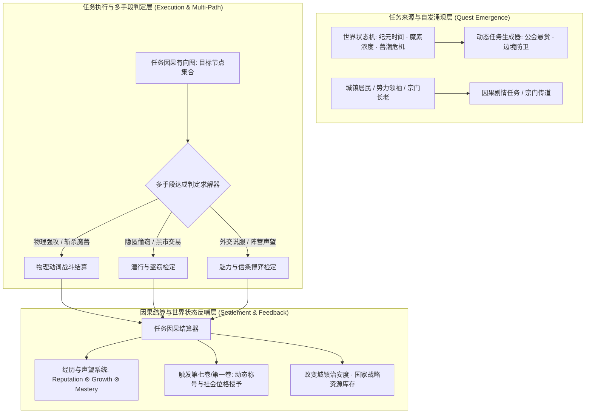

# 后端架构需求表9（第九卷：任务系统、动态因果事件链与声望结算求解器）

> [!NOTE]
> **【全局架构声明】**：本篇及全套技术文档中所提及的所有具体任务名称（如“山海关防守委托、魔单晶护送”）、NPC 委托人名、声望数值与奖励道具，**均属基础演示示例（Illustrative Examples Only），绝非底层硬编码或静态写死结构**。底层引擎仅定义**世界状态因果有向无环图 (Causality DAG)、多维目标判定求解器、动态涌现任务生成器、以及与经历声望系统严格咬合的结算契约**。

---

## 一、 系统概述与任务因果哲学 (Quest Causality Overview)

### 1.1 核心职责与设计哲学
本卷基于《基本玩法需求设计稿三》、《设计稿五》与《设计稿六》，定义底层引擎中的**世界状态因果事件图、公会/国家动态委托流、多手段任务目标判定求解器、黑白两道阵营因果、以及声望与经历结算流水线**。
* **拒绝死板线性脚本 (Non-Linear Causality DAG)**：任务在底层不是写死的线性脚本，而是挂载在世界状态机上的**因果有向无环图 (Causality DAG)**；
* **手段绝对开放 (Multiple Resolution Paths)**：同一个任务目标（如获取一把要塞钥匙），系统支持物理破门强攻、魔法隐匿偷取、外交谈判说服、金钱贿赂、黑市调包等多种手段达成，底层只验证最终世界状态的自洽性。

### 1.2 任务系统整体架构与数据流向


---

## 二、 任务因果有向图与目标判定求解器 (Causality DAG & Objective Solver)

### 2.1 任务因果有向无环图结构 (Quest Causality DAG)
每个任务实体由前置条件集、核心阶段节点、分支决策弧与终结状态构成：

```typescript
// 1. 任务目标原子类型
export type QuestObjectiveType =
  | 'KILL_MONSTER_TARGET'     // 击杀特定怪物 (支持部位破坏要求)
  | 'ACQUIRE_ITEM_PROPERTY'   // 获取特定物理属性物品 (如纯度 >= 90% 魔单晶)
  | 'ESCORT_CARAVAN_TO_NODE'  // 护送商队抵达成大地图目标节点
  | 'REACH_WORLD_COORDINATE'  // 探索并抵达指定经纬度/遗迹节点
  | 'IMPRINT_SKILL_TO_STUDENTS'// 宗门传道: 招收并教会 N 名弟子掌握特定 AST
  | 'REDUCE_REGIONAL_MANA'    // 生态调理: 降低区域魔素畸变浓度至安全线
  | 'STEAL_OR_ASSASSINATE';   // 暗黑刺杀或黑产销赃

// 2. 任务因果节点实体
export interface QuestNodeEntity {
  nodeId: UUID;
  description: string;
  objectiveType: QuestObjectiveType;
  targetParams: Record<string, any>; // 目标因果断言参数
  isOptional: boolean;               // 是否为可选完美达成条件
  childNodes: UUID[];                // 下游分支节点 ID
  failureConditions: Array<{ conditionType: string; threshold: any }>; // 失败熔断断言
}
```

### 2.2 多手段达成断言机制 (State-Based Assertion)
系统不监测玩家的具体按键过程，而是**在每个逻辑 Tick 断言世界状态是否满足目标谓词**：

$$\text{IsObjectiveMet}(Q, \mathcal{S}_{\text{world}}) = \text{Assert}\left( \text{PredicateFunction}\left(\mathcal{S}_{\text{world}}, \; Q.\text{TargetParams}\right) \right)$$

* **范例**：若目标是“平息村庄危机”，玩家无论选择“全歼周边哥布林窝点（物理）”、“将哥布林尸体全部火焰净化（生态）”、还是“施展高阶幻术将怪群引向荒洲（魔法）”，只要区域威胁值降至 0，任务均判定为成功！

---

## 三、 黑白阵营因果、恶名通缉与背叛状态机 (Alignment & Notoriety FSM)

### 3.1 阵营声望加权与反向撕裂机制
任务结算时，系统向涉及的所有地缘势力派发正负声望变化向量：

$$\Delta \vec{R}_{\text{factions}} = \left[ \Delta R_{\text{Sponsor}}, \; \Delta R_{\text{Allies}}, \; \Delta R_{\text{Rivals}}, \; \Delta R_{\text{Underworld}} \right]$$

* **阵营对立撕裂**：完成格莱斯神圣帝国的边境清剿任务，自动扣除北方诸国联邦的阵营好感度；
* **恶名通缉状态机 (Bounty & Wanted FSM)**：
  - 若角色在任务中触发恶性背叛、暗杀无辜或屠戮城镇守卫，`NotorietyScore` 飙升；
  - 达到临界值时，公会向全服/区域 NPC 雇佣兵发布对该角色的**【玩家通缉悬赏令 (Player Wanted Notice)】**！

---

## 四、 动态生态与天灾任务自发涌现引擎 (Procedural Quest Generator)

### 4.1 联动第三卷与第八卷的自动发榜机制
当大地图与生态系统检测到宏观危机时，公会与市政厅自动合成悬赏任务：
1. **兽潮前哨预警**：当某区域魔素密度 $\rho_{\text{mana}} \ge \Theta_{\text{critical}}$ 且魔兽集群正在聚拢时，公会板自动涌现【紧急清剿/魔核采集】委托；
2. **要塞围城防御**：当兽潮兵临山海关要塞时，全服广播世界级【山海关协同防守战役】！

---

## 五、 数据结构与任务服务接口契约 (TypeScript Reference)

```typescript
// 1. 任务聚合根实体
export interface QuestAggregateEntity {
  questId: UUID;
  questTitle: string;
  category: 'MAIN_CHRONICLE' | 'GUILD_BOUNTY' | 'NATION_WAR' | 'SECT_LINEAGE' | 'UNDERWORLD_BLACK';
  issuingFactionId: UUID;         // 发榜势力/公会 ID
  requiredRankTier: number;       // 所需经历阶位 R
  timeLimitTicks?: number;        // 时效限制 (世界时钟步)
  dagNodes: Record<UUID, QuestNodeEntity>;
  currentNodeIds: UUID[];
  rewardPackage: {
    baseMoney: number;            // 基础货币报酬
    manaMonocrystals?: number;    // 魔单晶战略奖励
    reputationGain: Record<UUID, number>; // 阵营声望收益
    growthExpBio: number;         // 阅历值收益
    itemRewards: UUID[];          // 奖励物品 ID
  };
}

// 2. 任务领域服务接口
export interface IQuestEngineService {
  acceptQuest(characterId: UUID, questId: UUID): boolean;
  evaluateWorldStateForActiveQuests(worldState: WorldState): QuestProgressReport[];
  completeQuest(characterId: UUID, questId: UUID, resolutionPath: string): QuestRewardSummary;
  abandonOrFailQuest(characterId: UUID, questId: UUID, reason: string): FailurePenaltyReport;
}
```
