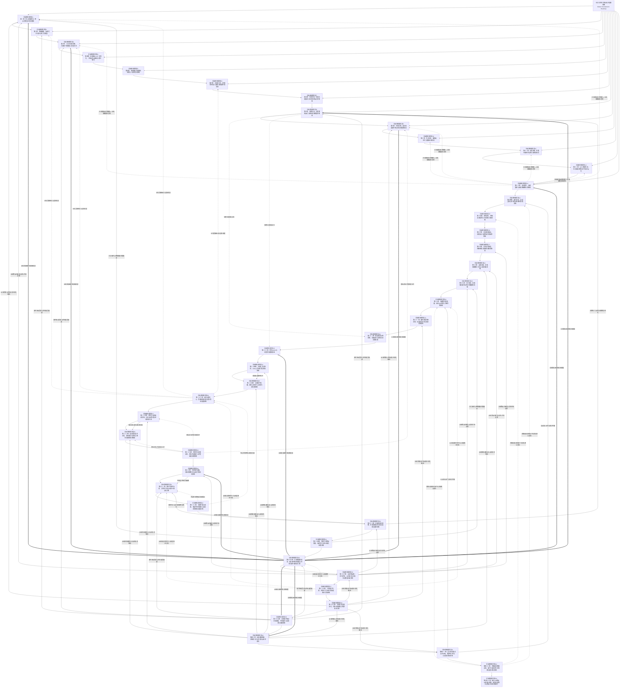
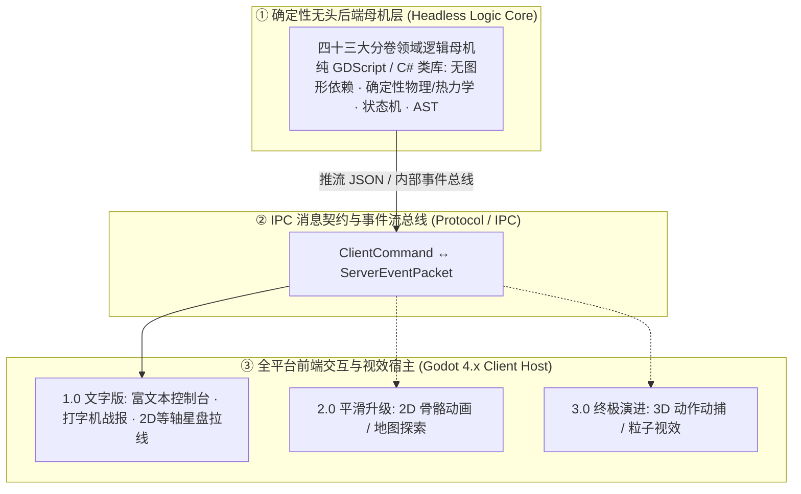

# 后端架构需求表索引 (Backend Architecture Specification Index)

---

## 一、 架构体系总览

卡拉尔世界引擎（Kalar World Engine）后端架构是严格遵循第一性原理的无头确定性母机体系：以**单机无头引擎为基石**自底向上完成物理仿真、状态机推进与数据持久化，并在各核心层预留**网络同步与服务器权威仲裁接口**，支持平滑升级为多人联机系统。

> [!NOTE]
> **【全局架构声明】**：本套规范提及的具体职业、种族、怪物、NPC、国家、爵位、物品材质、地名等名称与数值，**均属基础演示示例（Illustrative Examples Only），绝非底层硬编码或静态写死结构**。底层引擎仅定义**无边界图云特征空间、万物物理属性聚合、玩家与 NPC 全域底座绝对同构、动态主权国家聚合实体、以及运行时动态授予称号与位格的扩展接口**。

全套后端架构规范文档由四十三卷构成，由全域开发路线图统领实施：

---

## 二、 核心开发路线图与分卷目录索引

### 🚀 研发总控：[卡拉尔世界引擎全域开发路线图.md](../卡拉尔世界引擎开发路线图.md)

| 分卷编号 | 文档名称 | 核心领域与规范职责 |
| :--- | :--- | :--- |
| **第一卷** | [后端架构需求表1.md](./后端架构需求表1.md) | **核心领域模型、物品系统与多职业兼备** |
| **第二卷** | [后端架构需求表2.md](./后端架构需求表2.md) | **物理碰撞、始源/咒术/超位与热力学能损** |
| **第三卷** | [后端架构需求表3.md](./后端架构需求表3.md) | **七大洲阻抗寻路、大地图下辖城镇与生态天灾** |
| **第四卷** | [后端架构需求表4.md](./后端架构需求表4.md) | **技能图云 AST 序列化、三维点阵反编译与著书储存** |
| **第五卷** | [后端架构需求表5.md](./后端架构需求表5.md) | **单机确定性回放校验器与三态状态机架构** |
| **第六卷** | [后端架构需求表6.md](./后端架构需求表6.md) | **本地持久化、网络同步协议与服务器权威仲裁实现** |
| **第七卷** | [后端架构需求表7.md](./后端架构需求表7.md) | **生命体质、生理机能衰退与生命周期演化求解器** |
| **第八卷** | [后端架构需求表8.md](./后端架构需求表8.md) | **怪物生态、异兽摄取演化与群体兽潮调度求解器** |
| **第九卷** | [后端架构需求表9.md](./后端架构需求表9.md) | **任务系统、动态因果事件链与声望结算求解器** |
| **第十卷** | [后端架构需求表10.md](./后端架构需求表10.md) | **货币体系、魔单晶本位与通货膨胀调控求解器** |
| **第十一卷** | [后端架构需求表11.md](./后端架构需求表11.md) | **交易系统、供需价格弹性与跨大陆物流经济求解器** |
| **第十二卷** | [后端架构需求表12.md](./后端架构需求表12.md) | **NPC 智能生命系统、社交因果网络与自主演化调度求解器** |
| **第十三卷** | [后端架构需求表13.md](./后端架构需求表13.md) | **身份爵位、自建国家与政权推翻覆灭求解器** |
| **第十四卷** | [后端架构需求表14.md](./后端架构需求表14.md) | **账户身份、会话鉴权与多角色存档槽位管理系统** |
| **第十五卷** | [后端架构需求表15.md](./后端架构需求表15.md) | **角色创生、种族血脉身世与先天资质骰点分配系统** |
| **第十六卷** | [后端架构需求表16.md](./后端架构需求表16.md) | **后天潜能成长、双轨加点（定向/随机动态）与属性破阶递减求解器** |
| **第十七卷** | [后端架构需求表17.md](./后端架构需求表17.md) | **货币祈愿抽奖、神秘宝箱与保底伪随机求解器** |
| **第十八卷** | [后端架构需求表18.md](./后端架构需求表18.md) | **战备配装、装备穿戴槽位力学与动态词缀系统** |
| **第十九卷** | [后端架构需求表19.md](./后端架构需求表19.md) | **工坊锻造、装备强化精炼与符文附魔重铸系统** |
| **第二十卷** | [后端架构需求表20.md](./后端架构需求表20.md) | **隐藏管理员权限、全域 GM 仲裁与沙盒作弊调试系统** |
| **第二十一卷** | [后端架构需求表21.md](./后端架构需求表21.md) | **聊天框指令解析器、动态命令识别与奖励发放管线** |
| **第二十二卷** | [后端架构需求表22.md](./后端架构需求表22.md) | **精英变异怪物通用衍生与狂暴状态机底座** |
| **第二十三卷** | [后端架构需求表23.md](./后端架构需求表23.md) | **世界 BOSS 与巨型灾厄首领通用引擎底座（单机游荡天灾与联机共战双态同构）** |
| **第二十四卷** | [后端架构需求表24.md](./后端架构需求表24.md) | **全域礼包兑换码、CDKey 凭证核销与时效防刷系统** |
| **第二十五卷** | [后端架构需求表25.md](./后端架构需求表25.md) | **全域邮件信箱、系统公告附件与仓储生命周期系统** |
| **第二十六卷** | [后端架构需求表26.md](./后端架构需求表26.md) | **全局设置中心、音画视效调度与渲染管线配置系统** |
| **第二十七卷** | [后端架构需求表27.md](./后端架构需求表27.md) | **原生与自创组织系统、公会自治管理与职位驻地科技中枢** |
| **第二十八卷** | [后端架构需求表28.md](./后端架构需求表28.md) | **组织委托悬赏派发、冒险者阶位资质与佣金抽成结算求解器** |
| **第二十九卷** | [后端架构需求表29.md](./后端架构需求表29.md) | **角色同名多重身份、假名伪装欺诈与声望因果回溯系统** |
| **第三十卷** | [后端架构需求表30.md](./后端架构需求表30.md) | **空间邻近感知、地缘商铺集市与动态货架交易系统** |
| **第三十一卷** | [后端架构需求表31.md](./后端架构需求表31.md) | **双轨空间坐标系、文字拓扑向 2D 连续位移平滑演化引擎** |
| **第三十二卷** | [后端架构需求表32.md](./后端架构需求表32.md) | **多硬件输入感知、键鼠手柄热插拔与自适应控制器调度系统** |
| **第三十三卷** | [后端架构需求表33.md](./后端架构需求表33.md) | **地面实体掉落物、空间拾取保护与生态衰变半衰期系统** |
| **第三十四卷** | [后端架构需求表34.md](./后端架构需求表34.md) | **物质守恒物品销毁、熔炉焚化与炼金蚀化处置系统** |
| **第三十五卷** | [后端架构需求表35.md](./后端架构需求表35.md) | **全域因果剧情流、动态事件编排调度与世界大事件编年史引擎** |
| **第三十六卷** | [后端架构需求表36.md](./后端架构需求表36.md) | **全域物品统一命名空间、ID 注册表与分类学元数据注册系统** |
| **第三十七卷** | [后端架构需求表37.md](./后端架构需求表37.md) | **工程调试热更、特性开关与金丝雀灰度推送分流系统** |
| **第三十八卷** | [后端架构需求表38.md](./后端架构需求表38.md) | **全域多语言国际化、词条动态插值与兜底回退引擎** |
| **第三十九卷** | [后端架构需求表39.md](./后端架构需求表39.md) | **全域事件驱动音频调度、空间混音与动态音轨编排系统** |
| **第四十卷** | [后端架构需求表40.md](./后端架构需求表40.md) | **全域通知弹窗、系统跑马灯与有向红点树状态机** |
| **第四十一卷** | [后端架构需求表41.md](./后端架构需求表41.md) | **登录页全服动态告示板、维护倒计时与 GM 远程推流系统** |
| **第四十二卷** | [后端架构需求表42.md](./后端架构需求表42.md) | **旁路遥测数据总线、账户注册登录生命周期与留存统计系统** |
| **第四十三卷** | [后端架构需求表43.md](./后端架构需求表43.md) | **账号UID物品ID库统计系统（递归挂载聚合与物品生命周期事件）** |

---

## 三、 全域技术栈选型与 Godot 跨平台架构矩阵 (Tech Stack & Godot Integration)

### 3.1 核心分层哲学：无头母机 (Headless Core) vs 表现宿主 (Godot Host)
卡拉尔世界引擎严格贯彻**“表现层与逻辑母机绝对解耦”**的原则：

---

### 3.2 推荐技术栈选型矩阵 (Tech Stack Matrix)

| 系统层级 | 推荐选型方案 | 核心技术选型依据与优势 | 备选/演进方案 |
| :--- | :--- | :--- | :--- |
| **前端客户端宿主** | **Godot Engine 4.x (GDScript / C#)** | • **轻量极速**：启动秒级，运行时仅几十 MB，内存占用极低； • **全平台原生导出**：一键导出 Web (HTML5/WASM)、Windows、macOS、Linux、iOS、Android； • **UI 与 Shader 极其优秀**：适合渲染高质量文字排版、卡牌动效、以及三维点阵云图等轴着色器； • **开源无版税风险**：MIT 协议，绝无商业绑架风险。 | Webview / Vue3 + PixiJS |
| **后端无头逻辑母机** | **GDScript 原生类库 / C# .NET 9** | • **GDScript**：0 配置门槛、热重载丝滑、Web 导出体积仅十几 MB，首选极速闭环 1.0； • **C# .NET**：强类型高性能、单机同进程零拷贝内存直调，未来联机直接作为独立权威服务器。 | Rust (GDExtension) |
| **序列化与消息契约** | **JSON (开发期) / Protocol Buffers (生产期)** | • **自洽可读**：`.kalar_save` 纯文本存档便于调试与模组制作； • **二进制高压缩**：联机状态下 Protobuf 序列化开销极小。 | FlatBuffers / MessagePack |
| **三维点阵图拓扑** | **Custom 3D Lattice Graph Engine** | • 专为有向加权图论、AST 遍历、变分测地线搜索定制。 | QuikGraph / NetworkX |
