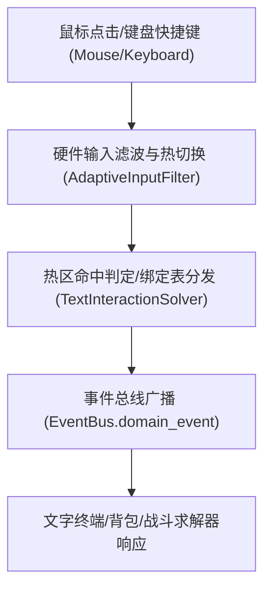

# 施工细则：Phase 05 核心引擎演进 —— 阶段2：文字版鼠标点击与键盘快捷键交互（硬件输入联动·配置驱动）

> [!NOTE]
> **【施工目标】**：文字版完备版不依赖 2D TileMap 物理，**以鼠标点击拾取与键盘快捷键为第一交互**，经 `hardware_input` 域预留并全量配置驱动（零写死）。
> **案卷全局共享上下文**：👉 [KALAR-DEV-2026-ST01-ATT_附件_案卷共享契约与上下文.md](KALAR-DEV-2026-ST01-ATT_附件_案卷共享契约与上下文.md)。
> **对应需求源**：[后端架构需求表索引](../../../../后端架构/后端架构需求表索引.md) 与 [硬件输入领域](..\..\..\..\..\config\domains\hardware_input.json)。
> 📍 **卷内快速直达**：[ATT 共享附件](KALAR-DEV-2026-ST01-ATT_附件_案卷共享契约与上下文.md) ｜ [阶段1](KALAR-DEV-2026-ST01-001_阶段1_游戏主循环与状态栈契约.md) ｜ **阶段2 (当前)** ｜ [阶段3](KALAR-DEV-2026-ST01-003_阶段3_世界时钟推进与NPC离线自发演化.md) ｜ [阶段4](KALAR-DEV-2026-ST01-004_阶段4_联机权威同步与验收测试.md)

---

## 📌 第一性原理溯源指针

* **精准上游规范指针**：[二、 业务计算与求解器](../../../../后端架构/后端架构需求表索引.md) ｜ [hardware_input.json 四域契约](..\..\..\..\..\config\domains\hardware_input.json)
* **核心不变量约束断言**：`鼠标点击命中仅经配置化热区判定，键盘快捷键仅经绑定表分发，零硬编码键位；设备类型毫秒级热切换由 AdaptiveInputFilter 驱动`。

---

## 一、 核心算法与业务实现 (Core Business Logic · 文字版)

```gdscript
# 模块路径: res://backend/domains/hardware_input/text_interaction_solver.gd
class_name TextInteractionSolver extends RefCounted:
    # 鼠标点击：命中热区判定（点击坐标 + 热区矩形，灵敏度配置化）
    static func hit_test_mouse_click(click_pos: Vector2, hot_area: Rect2, sensitivity: float = -1.0) -> bool:
        var sens := sensitivity if sensitivity >= 0.0 else GameConfig.get_float("domains.hardware_input", "mouse/sensitivity_scalar", 1.0)
        var expanded := hot_area.grow(hot_area.size.length() * (sens - 1.0) * 0.1)
        return expanded.has_point(click_pos)

    # 键盘快捷键：绑定表分发（action_name → 快捷键表，配置化，可重绑定）
    static func dispatch_shortcut(action_name: String, state: InputDeviceStateAggregate) -> Dictionary:
        var bindings: Array = state.action_mappings.get(action_name, [])
        if bindings.is_empty():
            return {"success": false, "error_code": "NO_BINDING"}
        return {"success": true, "action": action_name, "bindings": bindings.duplicate()}

    # 设备热切换：鼠标/键盘事件驱动（预留触屏/手柄）
    static func handle_hardware_event(state: InputDeviceStateAggregate, event_type: String, timestamp_ms: int) -> Dictionary:
        var switched := AdaptiveInputFilterSolver.handle_device_input_event(state, event_type, timestamp_ms)
        return {"success": true, "switched": switched, "device": state.current_device}
```

* **配置驱动（零写死）**：`config/domains/hardware_input.json` `mouse/sensitivity_scalar`、`action_mappings`（`move_north: [Key_W, Joypad_Up]` 等）、`tab_double_tap/window_ms`；快捷键重绑定经 `ActionRebindingService.rebind_action` 运行时热更新，前端 `MainHUDView` 的 `action_bar_slots` 与 `chat_input` 已预留 `Tab` 双击补全链路。

---

## 二、 响应式与状态跃迁 (Event-Driven State Transitions · 文字版)



> **2D 移动说明**：本阶段文字版不实现 `TileMap` 物理瓦片与相机跟随；`TilemapViewportSolver` 保留为 `Phase_05 S2` 2D 演进预留，当前仅以文字版交互通过验收。
