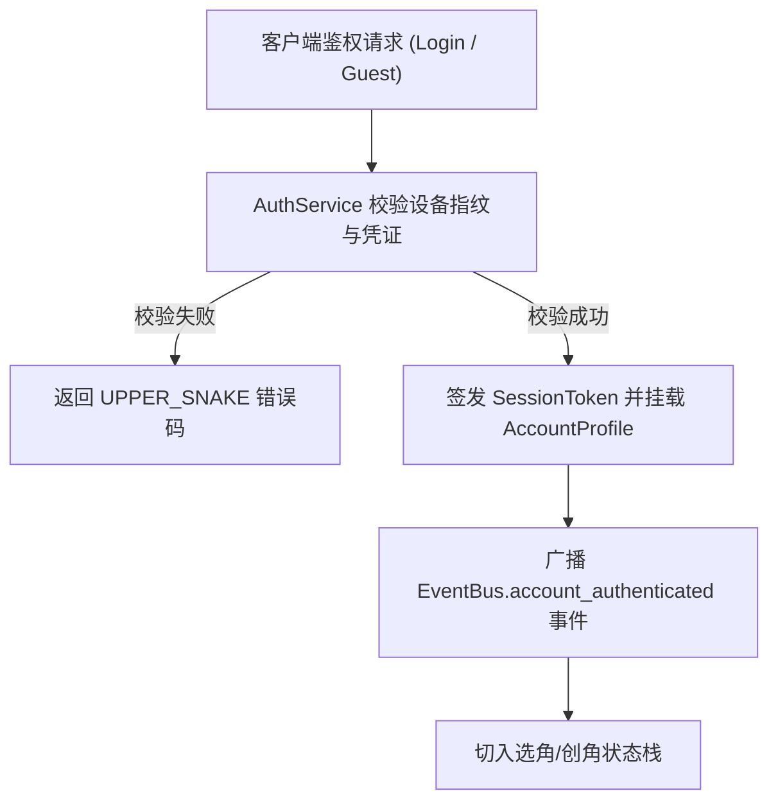

# 施工细则：Phase 07 账号体系加固 —— 阶段2：登录鉴权与会话Token

> [!NOTE]
> **【施工目标】**：实现 `AuthService` 游客/账号密码鉴权、Token 签发校验与设备指纹绑定。
> **案卷全局共享上下文**：👉 [KALAR-DEV-2026-ST03-ATT_附件_案卷共享契约与上下文.md](KALAR-DEV-2026-ST03-ATT_附件_案卷共享契约与上下文.md)。
> **对应需求源**：[后端架构需求表14](../../../../后端架构/后端架构需求表14.md)。
> 📍 **卷内快速直达**：[ATT 共享附件](KALAR-DEV-2026-ST03-ATT_附件_案卷共享契约与上下文.md) ｜ [阶段1](KALAR-DEV-2026-ST03-001_阶段1_账号存储契约与多槽位DTO.md) ｜ **阶段2 (当前)** ｜ [阶段3](KALAR-DEV-2026-ST03-003_阶段3_创建角色第一步后端存储联动.md) ｜ [阶段4](KALAR-DEV-2026-ST03-004_阶段4_安全与验收测试.md)

---

## 📌 第一性原理溯源指针

* **精准上游规范指针**：[二、 账号鉴权与会话状态机](../../../../后端架构/后端架构需求表14.md)
* **核心不变量约束断言**：`Token 必须携带过期时间戳与签名散列，单机模式下自动生成轻量 Local-Token，错误码一律采用 UPPER_SNAKE`。
* **防漂移最高指示**：严禁明文比对密码；严禁在前端直接篡改鉴权状态。

---

## 一、 核心算法与业务实现 (Core Business Logic)

```gdscript
# 模块路径: res://backend/domains/account/auth_service.gd
class_name AuthService extends RefCounted:

    static func authenticate_guest(device_fingerprint: String) -> Dictionary:
        if device_fingerprint.is_empty():
            return {"success": false, "error_code": "EMPTY_DEVICE_FINGERPRINT", "message": "设备指纹不能为空"}

        var guest_id := "GUEST_" + str(device_fingerprint.hash()).pad_zeros(10)
        var token := _generate_session_token(guest_id, device_fingerprint)
        return {
            "success": true,
            "account_id": guest_id,
            "token": token,
            "is_guest": true
        }

    static func validate_token(token: String, expected_account_id: String) -> bool:
        if token.is_empty() or not token.begins_with("TK_"):
            return false
        var parts := token.split("_")
        if parts.size() < 3:
            return false
        return parts[1] == expected_account_id

    static func _generate_session_token(account_id: String, fingerprint: String) -> String:
        var salt := str(Time.get_unix_time_from_system())
        return "TK_" + account_id + "_" + str((fingerprint + salt).hash())
```

---

## 二、 响应式与状态跃迁 (Event-Driven State Transitions)


